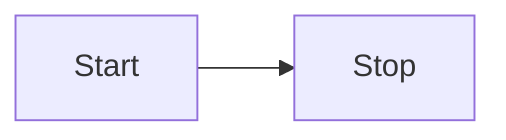
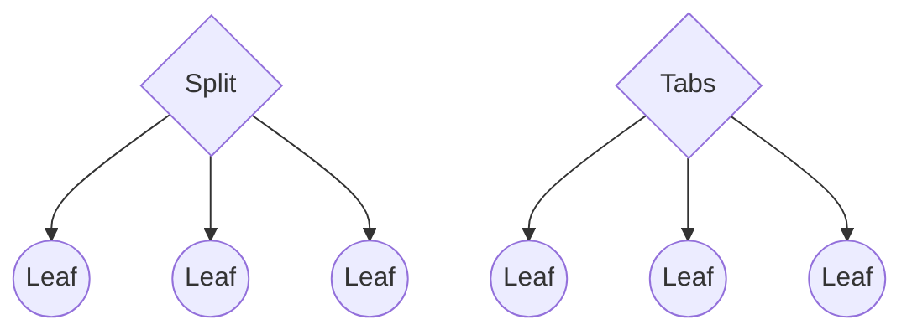
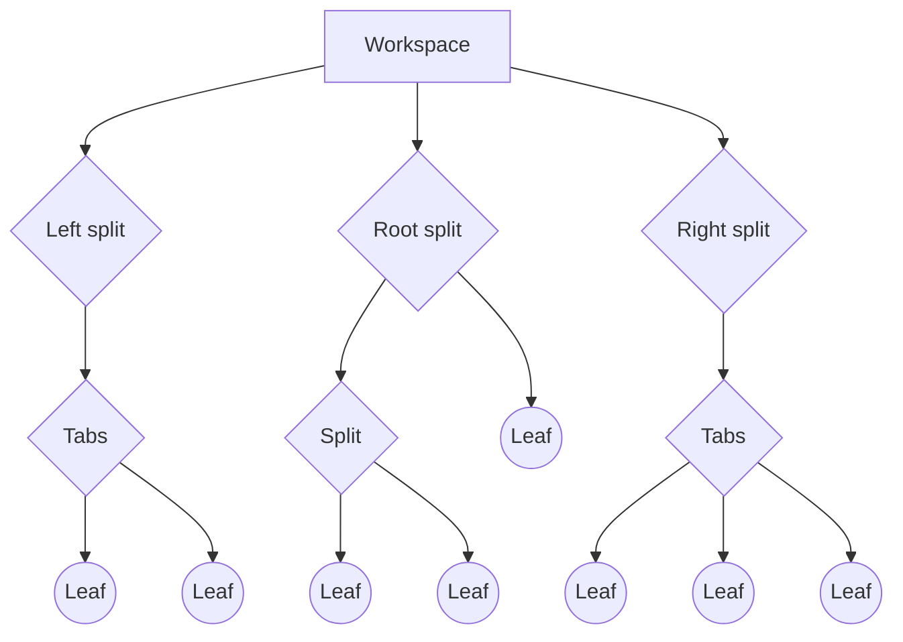
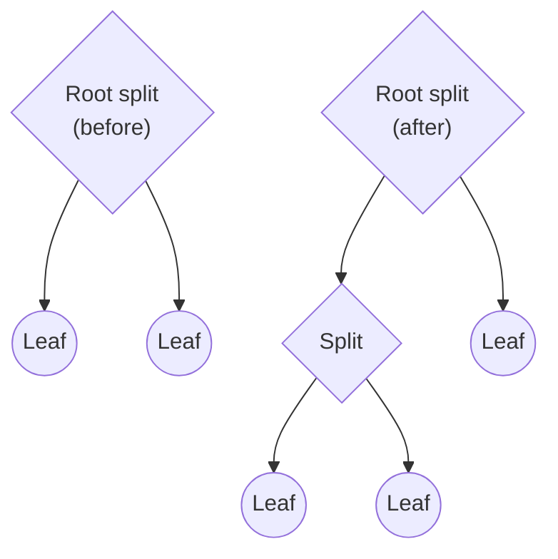
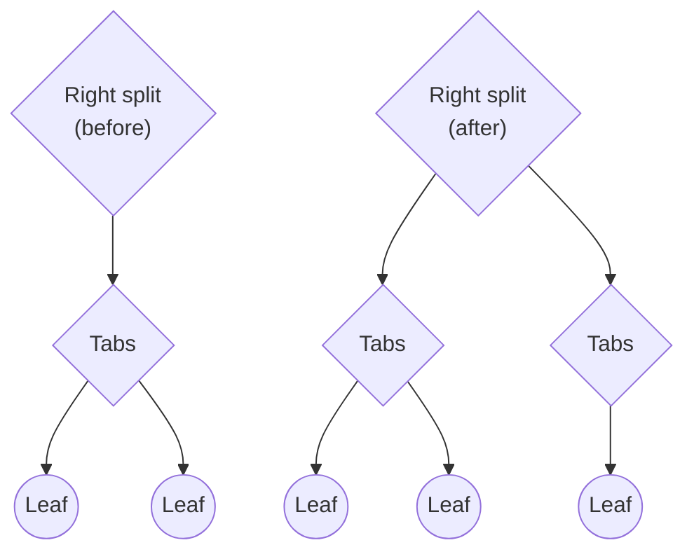

Developer policies.md:
```
Our goal for community plugins and themes is to make it easy for users to safely modify and expand the capabilities of Obsidian, while prioritizing private and offline usage of the app.

All community plugins and themes added to the Obsidian directory must respect the following policies. Every plugin and theme is individually vetted before being included in the directory. Plugins and themes that don't follow these policies will be removed from the directory.

These policies only apply to plugins listed in the official Obsidian directory. These policies do not apply to plugins installed outside of the Obsidian directory, but they are nonetheless good practices to follow.

## Policies

### Not allowed

Plugins and themes must not:

- Obfuscate code to hide its purpose.
- Insert dynamic ads that are loaded over the internet.
- Insert static ads outside a plugin’s own interface.
- Include client-side telemetry.
- Include a mechanism that updates the plugin.
- Themes may not load assets from the network. To bundle an asset, see [[Embed fonts and images in your theme|this guide]].

### Disclosures

The following are only allowed if clearly indicated in your README:

- Payment is required for full access.
- An account is required for full access.
- Network use. Clearly explain which remote services are used and why they're needed.
- Accessing files outside of Obsidian vaults. Clearly explain why this is needed.
- Static ads such as banners and pop-up messages within the plugin's own interface.
- Server-side telemetry. Link to a privacy policy that explains how the data is handled must be included.
- Close sourced code. This will be handled on a case by case basis.

### Copyright and licensing

All community plugins and themes must follow these requirements:

- Include a [LICENSE file](https://docs.github.com/en/communities/setting-up-your-project-for-healthy-contributions/adding-a-license-to-a-repository) and clearly indicate the license of your plugin or theme.
- Comply with the original licenses of any code your plugin or theme makes use of, including attribution in the README if required.
- Respect Obsidian's trademark policy. Don't use the "Obsidian" trademark in a way that could confuse users into thinking your plugin or theme is a first-party creation.

## Reporting violations

If you encounter a plugin or theme that violates the policies above, please let the developer know by opening a GitHub issue in their repository. Kindly check existing issues to see if it’s already reported.

If the developer doesn’t respond after 7 days, [contact the Obsidian team](https://help.obsidian.md/Help+and+support#Report+a+security+issue). For serious violations, you can contact our team immediately.

## Removing plugins and themes

In case of a policy violation, we may attempt to contact the developer and provide a reasonable timeframe for them to resolve the problem.

If the problem isn't resolved by then, we'll remove plugins or themes from our directory.

We may immediately remove a plugin or theme if:

- The plugin or theme appears to be malicious.
- The developer is uncooperative.
- This is a repeated violation.

In addition, we may also remove plugins or themes that have become unmaintained or severely broken.

```

Home.md:
```
---
cssclasses: hide-title
---
# Obsidian Developer Docs

Welcome to the official Obsidian Developer Documentation, where you can learn how to build plugins and themes for [Obsidian](https://obsidian.md/). For tips on how to use Obsidian, visit [the official Help site](https://help.obsidian.md/).

## Plugins

Build plugins to extend the existing functionality in Obsidian using TypeScript.

- [[Build a plugin|Build your first plugin]]
- [[Submit your plugin]]

## Themes

Design beautiful themes and snippets for Obsidian using CSS.

- [[Build a theme|Build your first theme]]
- [[Submit your theme]]
- [[CSS variables]]

## Join the developer community

If you get stuck, or if you're looking for feedback, [join the community](https://obsidian.md/community).

- `#plugin-dev` and `#theme-dev` channels on Discord.
- [Developers & API](https://forum.obsidian.md/c/developers-api/14) and [Share & showcase](https://forum.obsidian.md/c/share-showcase/9) on the forum.

## Contributing

If you see any errors or room for improvement on this site, or want to submit a PR, feel free to open an issue on [our GitHub repository](https://github.com/obsidianmd/obsidian-developer-docs).
Additional details are available on our [readme](https://github.com/obsidianmd/obsidian-developer-docs#readme).

Thank you in advance for contributing!

```

Obsidian October O_O 2024 plugin self-critique checklist.md:
```
---
description: A checklist for plugin developers to self-critique their plugins.
permalink: oo24/plugin
---
## [Add this checklist to your Obsidian](obsidian://new?name=Obsidian%20October%202024%20plugin%20self-critique%20checklist&content=%23%23%20Releasing%20%26%20naming%0A%0A-%20%5B%20%5D%20Remove%20placeholder%20names%20such%20as%20%60MyPlugin%60%20and%20%60SampleSettingTab%60.%0A-%20%5B%20%5D%20Don%27t%20include%20the%20word%20%22Obsidian%22%20in%20your%20name%20unless%20it%20absolutely%20makes%20sense.%20Most%20of%20the%20time%20it%27s%20redundant.%0A-%20%5B%20%5D%20Don%27t%20include%20your%20plugin%20name%20in%20command%20names.%20Obsidian%20adds%20this%20for%20you.%0A-%20%5B%20%5D%20Don%27t%20prefix%20commands%20with%20your%20plugin%20ID.%20Obsidian%20adds%20this%20for%20you.%0A-%20%5B%20%5D%20Don%27t%20include%20%60main.js%60%20in%20your%20repo.%20Only%20include%20it%20in%20your%20releases.%0A-%20%5B%20%5D%20If%20you%20haven%27t%2C%20consider%20add%20a%20%60fundingUrl%60%20so%20that%20users%20of%20your%20plugin%20can%20show%20some%20support.%20%5BLearn%20more%5D%28https%3A%2F%2Fdocs.obsidian.md%2FReference%2FManifest%23fundingUrl%29.%0A%0A%23%23%20Compatibility%0A%0A-%20%5B%20%5D%20Don%27t%20provide%20default%20hotkeys%20for%20commands.%20%5BLearn%20more%5D%28https%3A%2F%2Fdocs.obsidian.md%2FPlugins%2FReleasing%2FPlugin%2Bguidelines%23Avoid%2Bsetting%2Ba%2Bdefault%2Bhotkey%2Bfor%2Bcommands%29.%0A-%20%5B%20%5D%20Don%27t%20override%20core%20styling.%20If%20needed%2C%20add%20your%20own%20class%20and%20make%20the%20styling%20only%20apply%20to%20your%20class.%0A-%20%5B%20%5D%20Do%20scan%20your%20code%20for%20deprecated%20methods%20%28they%20usually%20show%20up%20as%20strikeout%20text%20in%20IDEs%29.%0A-%20%5B%20%5D%20Don%27t%20assign%20styles%20via%20JavaScript%20or%20in%20HTML.%20%5BLearn%20more%5D%28https%3A%2F%2Fdocs.obsidian.md%2FPlugins%2FReleasing%2FPlugin%2Bguidelines%23No%2Bhardcoded%2Bstyling%29.%0A-%20%5B%20%5D%20Don%27t%20access%20the%20hardcoded%20%60.obsidian%60%20folder%20if%20you%20need%20to%20access%20the%20configuration%20directory.%20The%20location%20could%20be%20customized%2C%20so%20please%20use%20%60Vault.configDir%60%20instead.%0A%0A%23%23%20Mobile%20support%0A%0APlease%20only%20complete%20this%20section%20if%20you%20have%20%60isDesktopOnly%60%20set%20to%20false%20in%20your%20manifest.%0A%0A-%20%5B%20%5D%20Don%27t%20use%20node.js%20modules%20such%20as%20%60fs%60%2C%20%60path%60%2C%20and%20%60electron%60.%0A-%20%5B%20%5D%20Don%27t%20use%20regex%20lookbehinds%20if%20you%20want%20to%20support%20iOS%20versions%20lower%20than%2016.4%20%28ignore%20this%20if%20you%20don%27t%20use%20regex%20in%20your%20plugin%29.%20%5BLearn%20more%5D%28https%3A%2F%2Fdocs.obsidian.md%2FPlugins%2FGetting%2Bstarted%2FMobile%2Bdevelopment%23Lookbehind%2Bin%2Bregular%2Bexpressions%29.%0A-%20%5B%20%5D%20Don%27t%20use%20the%20%60FileSystemAdapter%60%20class.%0A-%20%5B%20%5D%20Don%27t%20use%20%60process.platform%60%2C%20use%20Obsidian%27s%20%60Platform%60%20instead.%20%5BLink%20to%20API%5D%28https%3A%2F%2Fdocs.obsidian.md%2FReference%2FTypeScript%2BAPI%2FPlatform%29.%0A-%20%5B%20%5D%20Don%27t%20use%20%60fetch%60%20or%20%60axios.get%60%2C%20use%20Obsidian%27s%20%60requestUrl%60%20instead.%20%5BLink%20to%20API%5D%28https%3A%2F%2Fdocs.obsidian.md%2FReference%2FTypeScript%2BAPI%2FrequestUrl%29.%0A%0A%23%23%20Coding%20style%0A%0A-%20%5B%20%5D%20Don%27t%20use%20%60var%60.%20Use%20%60let%60%20or%20%60const%60%20instead.%20%5BLearn%20more%5D%28https%3A%2F%2Fjavascript.plainenglish.io%2F4-reasons-why-var-is-considered-obsolete-in-modern-javascript-a30296b5f08f%29.%0A-%20%5B%20%5D%20Don%27t%20use%20the%20global%20%60app%60%20instance.%20Use%20%60this.app%60%20provided%20to%20your%20plugin%20instance%20instead.%20%5BLearn%20more%5D%28https%3A%2F%2Fdocs.obsidian.md%2FPlugins%2FReleasing%2FPlugin%2Bguidelines%23Avoid%2520using%2520global%2520app%2520instance%29.%0A-%20%5B%20%5D%20Do%20break%20up%20your%20%60main.ts%60%20into%20smaller%20files%20or%20even%20folders%20if%20it%20gets%20big%20to%20make%20code%20easier%20to%20find.%0A-%20%5B%20%5D%20Do%20use%20%60async%60%20and%20%60await%60%20when%20you%20can%20for%20readability%2C%20instead%20of%20using%20%60Promise%60.%20%5BLearn%20more%5D%28https%3A%2F%2Fdocs.obsidian.md%2FPlugins%2FReleasing%2FPlugin%2Bguidelines%23Prefer%2Basync%252Fawait%2Bover%2BPromise%29.%0A-%20%5B%20%5D%20Don%27t%20use%20global%20variables.%20Try%20to%20keep%20variables%20either%20in%20the%20scope%20of%20classes%20or%20functions.%20%5BLearn%20more%5D%28http%3A%2F%2Fwiki.c2.com%2F%3FGlobalVariablesAreBad%29.%0A-%20%5B%20%5D%20Do%20test%20with%20%60instanceof%60%20before%20casting%20into%20other%20types%20such%20as%20%60TFile%60%2C%20%60TFolder%60%2C%20or%20%60FileSystemAdapter%60%2C%20%0A-%20%5B%20%5D%20Don%27t%20use%20use%20%60as%20any%60%20and%20use%20proper%20typing%20instead.%0A%0A%0A%23%23%20API%20usage%0A%0A-%20%5B%20%5D%20Don%27t%20use%20%60Vault.modify%60.%20If%20you%20want%20to%20edit%20the%20active%20file%2C%20prefer%20using%20the%20%60Editor%60%20interface.%20If%20you%20want%20to%20edit%20it%20in%20the%20background%2C%20use%20%60Vault.process%60.%0A-%20%5B%20%5D%20Don%27t%20manually%20read%20and%20write%20frontmatter.%20Instead%2C%20use%20%60FileManager.processFrontMatter%60.%20%5BLearn%20more%5D%28https%3A%2F%2Fdocs.obsidian.md%2FPlugins%2FReleasing%2FPlugin%2Bguidelines%23Prefer%2B%2560FileManager.processFrontMatter%2560%2Bto%2Bmodify%2Bfrontmatter%2Bof%2Ba%2Bnote%29.%0A-%20%5B%20%5D%20Don%27t%20use%20%60vault.delete%60%20to%20delete%20files.%20Use%20%60trashFile%60%20instead%20to%20make%20sure%20the%20file%20is%20deleted%20according%20to%20the%20users%20preferences.%20%5BLearn%20more%5D%28https%3A%2F%2Fdocs.obsidian.md%2FReference%2FTypeScript%2BAPI%2FFileManager%2FtrashFile%29.%0A-%20%5B%20%5D%20Don%27t%20use%20the%20%60Adapter%60%20API%20whenever%20possible.%20Use%20%60Vault%60%20API%20instead.%20%5BLearn%20more%5D%28https%3A%2F%2Fdocs.obsidian.md%2FPlugins%2FReleasing%2FPlugin%2Bguidelines%23Prefer%2Bthe%2BVault%2BAPI%2Bover%2Bthe%2BAdapter%2BAPI%29.%0A-%20%5B%20%5D%20Don%27t%20manage%20reading%20and%20write%20plugin%20data%20yourself.%20Use%20%60Plugin.loadData%28%29%60%20and%20%60Plugin.saveData%28%29%60%20instead.%0A-%20%5B%20%5D%20Do%20use%20%60normalizePath%28%29%60%20if%20you%20take%20user%20defined%20paths.%20%5BLearn%20more%5D%28https%3A%2F%2Fdocs.obsidian.md%2FReference%2FTypeScript%2BAPI%2FnormalizePath%29.%0A%0A%0A%23%23%20Performance%0A%0A-%20%5B%20%5D%20Do%20optimize%20your%20plugin%27s%20load%20time.%20%5BDetailed%20guide%5D%28https%3A%2F%2Fdocs.obsidian.md%2FPlugins%2FGuides%2FOptimizing%2Bplugin%2Bload%2Btime%29.%0A-%20%5B%20%5D%20Don%27t%20iterate%20all%20files%20to%20find%20a%20file%20or%20folder%20by%20its%20path.%20%5BLearn%20more%5D%28https%3A%2F%2Fdocs.obsidian.md%2FPlugins%2FReleasing%2FPlugin%2Bguidelines%23Avoid%2Biterating%2Ball%2Bfiles%2Bto%2Bfind%2Ba%2Bfile%2Bby%2Bits%2Bpath%29.%0A-%20%5B%20%5D%20If%20you%20want%20your%20plugins%20to%20be%20compatible%20with%20Obsidian%201.7.2%2B%20%28currently%20in%20early%20access%29%2C%20update%20your%20plugin%20to%20work%20with%20%60DeferredViews%60.%20%5BDetailed%20guide%5D%28https%3A%2F%2Fdocs.obsidian.md%2FPlugins%2FGuides%2FUnderstanding%2Bdeferred%2Bviews%29.%0A-%20%5B%20%5D%20If%20you%27re%20using%20%60moment%60%2C%20make%20sure%20you%27re%20doing%20%60import%20%7B%20moment%7D%20from%20%27obsidian%27%60%20so%20that%20you%20don%27t%20import%20another%20copy.%0A-%20%5B%20%5D%20Do%20minimize%20your%20%60main.js%60%20for%20releasing.%0A-%20%5B%20%5D%20Do%20your%20initial%20UI%20setup%20on%20%60workspace.onLayoutReady%28%29%60%20instead%20of%20in%20the%20constructor%20or%20%60onload%28%29%60%20function.%20%5BLearn%20more%5D%28https%3A%2F%2Fdocs.obsidian.md%2FPlugins%2FGuides%2FOptimizing%2Bplugin%2Bload%2Btime%23If%2Byou%2Bhave%2Bcode%2Bthat%2Byou%2Bwant%2Bto%2Brun%2Bat%2Bstartup%252C%2Bwhere%2Bshould%2Bit%2Bgo%253F%29.%0A%0A%23%23%20User%20interface%0A%0A-%20%5B%20%5D%20Don%27t%20use%20setting%20headings%20unless%20you%20have%20more%20than%20one%20section.%20%5BLearn%20more%5D%28https%3A%2F%2Fdocs.obsidian.md%2FPlugins%2FReleasing%2FPlugin%2Bguidelines%23Only%2Buse%2Bheadings%2Bunder%2Bsettings%2Bif%2Byou%2Bhave%2Bmore%2Bthan%2Bone%2Bsection%29.%0A-%20%5B%20%5D%20Don%27t%20include%20the%20word%20%22setting%22%20or%20%22option%22%20in%20setting%20headings.%20%5BLearn%20more%5D%28https%3A%2F%2Fdocs.obsidian.md%2FPlugins%2FReleasing%2FPlugin%2Bguidelines%23Avoid%2B%2522settings%2522%2Bin%2Bsettings%2Bheadings%29.%0A-%20%5B%20%5D%20Do%20use%20sentence%20case%20in%20all%20text%20in%20UI%20elements%20to%20be%20consistent%20with%20rest%20of%20Obsidian%20UI.%20%5BLearn%20more%5D%28https%3A%2F%2Fen.wiktionary.org%2Fwiki%2Fsentence_case%29.%0A-%20%5B%20%5D%20Don%27t%20use%20%60%3Ch1%3E%60%20or%20%60%3Ch2%3E%60%20for%20setting%20header.%20Use%20Obsidian%20API%20instead.%20%5BLearn%20more%5D%28https%3A%2F%2Fdocs.obsidian.md%2FPlugins%2FReleasing%2FPlugin%2Bguidelines%23Use%2B%2560setHeading%2560%2Binstead%2Bof%2Ba%2B%2560%253Ch1%253E%2560%252C%2B%2560%253Ch2%253E%2560%29.%0A-%20%5B%20%5D%20Don%27t%20do%20%60console.log%60%20unless%20they%20are%20absolutely%20necessarily.%20Remove%20testing%20console%20logs%20that%20are%20not%20needed%20for%20production.)
## Releasing & naming

- [ ] Remove placeholder names such as `MyPlugin` and `SampleSettingTab`.
- [ ] Don't include the word "Obsidian" in your name unless it absolutely makes sense. Most of the time it's redundant.
- [ ] Don't include your plugin name in command names. Obsidian adds this for you.
- [ ] Don't prefix commands with your plugin ID. Obsidian adds this for you.
- [ ] Don't include `main.js` in your repo. Only include it in your releases.
- [ ] If you haven't, consider add a `fundingUrl` so that users of your plugin can show some support. [Learn more](https://docs.obsidian.md/Reference/Manifest#fundingUrl).

## Compatibility

- [ ] Don't provide default hotkeys for commands. [Learn more](https://docs.obsidian.md/Plugins/Releasing/Plugin+guidelines#Avoid+setting+a+default+hotkey+for+commands).
- [ ] Don't override core styling. If needed, add your own class and make the styling only apply to your class.
- [ ] Do scan your code for deprecated methods (they usually show up as strikeout text in IDEs).
- [ ] Don't assign styles via JavaScript or in HTML. [Learn more](https://docs.obsidian.md/Plugins/Releasing/Plugin+guidelines#No+hardcoded+styling).
- [ ] Don't access the hardcoded `.obsidian` folder if you need to access the configuration directory. The location could be customized, so please use `Vault.configDir` instead.

## Mobile support

Please only complete this section if you have `isDesktopOnly` set to false in your manifest.

- [ ] Don't use node.js modules such as `fs`, `path`, and `electron`.
- [ ] Don't use regex lookbehinds if you want to support iOS versions lower than 16.4 (ignore this if you don't use regex in your plugin). [Learn more](https://docs.obsidian.md/Plugins/Getting+started/Mobile+development#Lookbehind+in+regular+expressions).
- [ ] Don't use the `FileSystemAdapter` class.
- [ ] Don't use `process.platform`, use Obsidian's `Platform` instead. [Link to API](https://docs.obsidian.md/Reference/TypeScript+API/Platform).
- [ ] Don't use `fetch` or `axios.get`, use Obsidian's `requestUrl` instead. [Link to API](https://docs.obsidian.md/Reference/TypeScript+API/requestUrl).

## Coding style

- [ ] Don't use `var`. Use `let` or `const` instead. [Learn more](https://javascript.plainenglish.io/4-reasons-why-var-is-considered-obsolete-in-modern-javascript-a30296b5f08f).
- [ ] Don't use the global `app` instance. Use `this.app` provided to your plugin instance instead. [Learn more](https://docs.obsidian.md/Plugins/Releasing/Plugin+guidelines#Avoid%20using%20global%20app%20instance).
- [ ] Do break up your `main.ts` into smaller files or even folders if it gets big to make code easier to find.
- [ ] Do use `async` and `await` when you can for readability, instead of using `Promise`. [Learn more](https://docs.obsidian.md/Plugins/Releasing/Plugin+guidelines#Prefer+async%2Fawait+over+Promise).
- [ ] Don't use global variables. Try to keep variables either in the scope of classes or functions. [Learn more](http://wiki.c2.com/?GlobalVariablesAreBad).
- [ ] Do test with `instanceof` before casting into other types such as `TFile`, `TFolder`, or `FileSystemAdapter`,
- [ ] Don't use use `as any` and use proper typing instead.


## API usage

- [ ] Don't use `Vault.modify`. If you want to edit the active file, prefer using the `Editor` interface. If you want to edit it in the background, use `Vault.process`.
- [ ] Don't manually read and write frontmatter. Instead, use `FileManager.processFrontMatter`. [Learn more](https://docs.obsidian.md/Plugins/Releasing/Plugin+guidelines#Prefer+%60FileManager.processFrontMatter%60+to+modify+frontmatter+of+a+note).
- [ ] Don't use `vault.delete` to delete files. Use `trashFile` instead to make sure the file is deleted according to the users preferences. [Learn more](https://docs.obsidian.md/Reference/TypeScript+API/FileManager/trashFile).
- [ ] Don't use the `Adapter` API whenever possible. Use `Vault` API instead. [Learn more](https://docs.obsidian.md/Plugins/Releasing/Plugin+guidelines#Prefer+the+Vault+API+over+the+Adapter+API).
- [ ] Don't manage reading and write plugin data yourself. Use `Plugin.loadData()` and `Plugin.saveData()` instead.
- [ ] Do use `normalizePath()` if you take user defined paths. [Learn more](https://docs.obsidian.md/Reference/TypeScript+API/normalizePath).


## Performance

- [ ] Do optimize your plugin's load time. [Detailed guide](https://docs.obsidian.md/Plugins/Guides/Optimizing+plugin+load+time).
- [ ] Don't iterate all files to find a file or folder by its path. [Learn more](https://docs.obsidian.md/Plugins/Releasing/Plugin+guidelines#Avoid+iterating+all+files+to+find+a+file+by+its+path).
- [ ] If you want your plugins to be compatible with Obsidian 1.7.2+ (currently in early access), update your plugin to work with `DeferredViews`. [Detailed guide](https://docs.obsidian.md/Plugins/Guides/Understanding+deferred+views).
- [ ] If you're using `moment`, make sure you're doing `import { moment} from 'obsidian'` so that you don't import another copy.
- [ ] Do minimize your `main.js` for releasing.
- [ ] Do your initial UI setup on `workspace.onLayoutReady()` instead of in the constructor or `onload()` function. [Learn more](https://docs.obsidian.md/Plugins/Guides/Optimizing+plugin+load+time#If+you+have+code+that+you+want+to+run+at+startup%2C+where+should+it+go%3F).

## User interface

- [ ] Don't use setting headings unless you have more than one section. [Learn more](https://docs.obsidian.md/Plugins/Releasing/Plugin+guidelines#Only+use+headings+under+settings+if+you+have+more+than+one+section).
- [ ] Don't include the word "setting" or "option" in setting headings. [Learn more](https://docs.obsidian.md/Plugins/Releasing/Plugin+guidelines#Avoid+%22settings%22+in+settings+headings).
- [ ] Do use sentence case in all text in UI elements to be consistent with rest of Obsidian UI. [Learn more](https://en.wiktionary.org/wiki/sentence_case).
- [ ] Don't use `<h1>` or `<h2>` for setting header. Use Obsidian API instead. [Learn more](https://docs.obsidian.md/Plugins/Releasing/Plugin+guidelines#Use+%60setHeading%60+instead+of+a+%60%3Ch1%3E%60%2C+%60%3Ch2%3E%60).
- [ ] Don't do `console.log` unless they are absolutely necessarily. Remove testing console logs that are not needed for production.
```

Obsidian October O_O 2024 theme self-critique checklist.md:
```
---
description: A checklist for theme developers to self-critique their themes.
permalink: oo24/theme
---
## [Add this checklist to your Obsidian](obsidian://new?name=Obsidian%20October%20O_O%202024%20theme%20self-critique%20checklist&content=%23%23%20Compatibility%0A%0A-%20%5B%20%5D%20Do%20use%20CSS%20variables%20whenever%20you%20can.%20%5BLearn%20more%5D%28https%3A%2F%2Fdocs.obsidian.md%2FReference%2FCSS%2Bvariables%2FCSS%2Bvariables%29.%0A-%20%5B%20%5D%20Don%27t%20use%20%60%21important%60.%0A-%20%5B%20%5D%20Don%27t%20change%20vertical%20margins%20in%20classes%20used%20in%20live%20preview%20editor%2C%20use%20padding%20instead.%0A-%20%5B%20%5D%20If%20you%27re%20using%20recent%20experimental%20CSS%20features%2C%20mention%20the%20minimal%20installer%20version%20required%20in%20the%20README.%0A%0A%23%23%20Performance%0A%0A-%20%5B%20%5D%20Don%27t%20use%20%60%3Ahas%28%29%60%20unless%20absolutely%20necessary.%20It%20causes%20performance%20issues%20especially%20in%20Canvas.%0A-%20%5B%20%5D%20Don%27t%20link%20to%20assets%20such%20as%20fonts%20and%20images.%20Keep%20them%20local.%20%5BLearn%20more%5D%28https%3A%2F%2Fdocs.obsidian.md%2FThemes%2FApp%2Bthemes%2FTheme%2Bguidelines%23Keep%2Bassets%2Blocal%29.%0A%0A%0A%23%23%20Releasing%0A%0A-%20%5B%20%5D%20Don%27t%20include%20the%20word%20%22Obsidian%22%20in%20your%20name%20unless%20it%20absolutely%20makes%20sense.%20Most%20of%20the%20time%20it%27s%20redundant.%0A-%20%5B%20%5D%20Do%20check%20your%20screenshot%20files%20are%20up-to-date.%20These%20screenshots%20are%20shown%20as%20thumbnails%20in%20the%20theme%20directory.%0A-%20%5B%20%5D%20Do%20check%20your%20README%20to%20make%20sure%20it%27s%20up-to-date.%20This%20is%20the%20what%20all%20potential%20users%20see%20when%20they%20check%20out%20your%20theme%20in%20the%20theme%20directory.%0A-%20%5B%20%5D%20Do%20keep%20your%20screenshot%20small%20so%20it%20loads%20fast%20in%20the%20directory.%20We%20recommend%20the%20dimension%20of%20512%20x%20288%20pixels.%0A-%20%5B%20%5D%20Do%20make%20sure%20you%20have%20a%20license%20in%20place%20so%20others%20know%20how%20to%20use%20your%20theme%20and%20its%20source%20code.)
## Compatibility

- [ ] Do use CSS variables whenever you can. [Learn more](https://docs.obsidian.md/Reference/CSS+variables/CSS+variables).
- [ ] Don't use `!important`.
- [ ] Don't change vertical margins in classes used in live preview editor, use padding instead.
- [ ] If you're using recent experimental CSS features, mention the minimal installer version required in the README.

## Performance

- [ ] Don't use `:has()` unless absolutely necessary. It causes performance issues especially in Canvas.
- [ ] Don't link to assets such as fonts and images. Keep them local. [Learn more](https://docs.obsidian.md/Themes/App+themes/Theme+guidelines#Keep+assets+local).


## Releasing

- [ ] Don't include the word "Obsidian" in your name unless it absolutely makes sense. Most of the time it's redundant.
- [ ] Do check your screenshot files are up-to-date. These screenshots are shown as thumbnails in the theme directory.
- [ ] Do check your README to make sure it's up-to-date. This is the what all potential users see when they check out your theme in the theme directory.
- [ ] Do keep your screenshot small so it loads fast in the directory. We recommend the dimension of 512 x 288 pixels.
- [ ] Do make sure you have a license in place so others know how to use your theme and its source code.
```

Obsidian October O_O 2024 vault self-critique checklist.md:
```
---
description: A checklist for vault maintenance and discovery.
permalink: oo24/vault
---
## [Add this checklist to your Obsidian](obsidian://new?name=Obsidian%20October%20O_O%202024%20vault%20self-critique%20checklist&content=%3E%20%5B%21INFO%5D%20Reminder%0A%3E%20Although%20we%20proposed%20some%20ways%20below%20to%20maintain%20and%20improvement%20your%20vault%2C%20likely%20the%20user%20of%20your%20vault%20is%20you%20and%20only%20you.%20This%20is%20different%20from%20plugins%20and%20themes%20where%20we%20can%20make%20relatively%20more%20objective%20suggestions.%0A%3E%20%0A%3E%20So%20feel%20free%20to%20remove%20anything%20from%20the%20checklist%20that%20doesn%27t%20make%20sense%20to%20you%20and%20add%20your%20own%20items.%0A%0A%23%23%20Vault%20maintenance%0A%0A-%20%5B%20%5D%20How%20well%20is%20your%20vault%20doing%20what%20it%27s%20supposed%20to%20do%3F%20%28What%20is%20the%20purpose%20of%20your%20vault%2Fnotes%3F%20What%20measures%20might%20you%20use%20to%20judge%20how%20well%20it%27s%20working%3F%29%20%5B%5E1%5D%0A-%20%5B%20%5D%20How%20quickly%20can%20you%20find%20notes%20you%20used%20one%20week%20ago%3F%0A-%20%5B%20%5D%20If%20your%20cat%20intentionally%20deleted%20all%20of%20your%20files%2C%20how%20recent%20is%20your%20backup%3F%0A-%20%5B%20%5D%20Do%20you%20need%20to%20document%20anything%20about%20your%20workflows%3F%20It%20can%20be%20surprisingly%20helpful%20to%20write%20out%20how%20you%20work%20and%20create%20checklists%20for%20important%20but%20uncommon%20tasks.%0A%0A%23%23%20Vault%20maintenance%20checklist%0A%0A-%20%5B%20%5D%20Delete%20unused%20attachments%0A-%20%5B%20%5D%20Delete%20or%20refactor%20notes%20that%20are%20not%20linked%20or%20tagged%20or%20in%20a%20folder%20%28%22orphan%22%20notes%29%0A-%20%5B%20%5D%20Delete%20unused%20tags%0A-%20%5B%20%5D%20Delete%20empty%20folders%0A-%20%5B%20%5D%20Process%20items%20in%20inbox%20notes%2Ffolders%2Ftags%0A-%20%5B%20%5D%20Make%20templates%20for%20frequently-used%20snippets%20or%20note%20types%0A-%20%5B%20%5D%20Remove%20unused%20plugins%0A-%20%5B%20%5D%20Remove%20unused%20themes%0A-%20%5B%20%5D%20Remove%20unused%20snippets%0A-%20%5B%20%5D%20Add%20properties%20missing%20from%20notes%0A-%20%5B%20%5D%20Convert%20tags%20to%20properties%20where%20appropriate%0A-%20%5B%20%5D%20Fix%20up%20broken%20links%0A-%20%5B%20%5D%20Browse%20through%20the%20plugin%20gallery%20for%20new%20ideas%0A%0A%23%23%20Vault%20rediscovery%20ideas%0A%0A-%20%5B%20%5D%20Open%20both%20Backlinks%20and%20Outgoing%20Links%20to%20see%20if%20there%20are%20any%20unlinked%20mentions%20that%20make%20sense%0A-%20%5B%20%5D%20Sort%20the%20files%20in%20Files%20Explorer%20by%20%22Modified%20time%20%28old%20to%20new%29%22%2C%20take%20a%20look%20at%20the%20top%20files%20and%20see%20how%20they%20can%20be%20made%20better.%0A-%20%5B%20%5D%20Enable%20the%20Random%20Note%20core%20plugin%20and%20randomly%20visit%20some%20notes%20for%20surprises.%0A%0A%0A%5B%5E1%5D%3A%20Remember%20that%20%22joy%22%20is%20a%20valid%20measure%21%20)


> [!INFO] Reminder
> Although we proposed some ways below to maintain and improvement your vault, likely the user of your vault is you and only you. This is different from plugins and themes where we can make relatively more objective suggestions.
>
> So feel free to remove anything from the checklist that doesn't make sense to you and add your own items.

## Vault maintenance

- [ ] How well is your vault doing what it's supposed to do? (What is the purpose of your vault/notes? What measures might you use to judge how well it's working?) [^1]
- [ ] How quickly can you find notes you used one week ago?
- [ ] If your cat intentionally deleted all of your files, how recent is your backup?
- [ ] Do you need to document anything about your workflows? It can be surprisingly helpful to write out how you work and create checklists for important but uncommon tasks.

## Vault maintenance checklist

- [ ] Delete unused attachments
- [ ] Delete or refactor notes that are not linked or tagged or in a folder ("orphan" notes)
- [ ] Delete unused tags
- [ ] Delete empty folders
- [ ] Process items in inbox notes/folders/tags
- [ ] Make templates for frequently-used snippets or note types
- [ ] Remove unused plugins
- [ ] Remove unused themes
- [ ] Remove unused snippets
- [ ] Add properties missing from notes
- [ ] Convert tags to properties where appropriate
- [ ] Fix up broken links
- [ ] Browse through the plugin gallery for new ideas

## Vault rediscovery ideas

- [ ] Open both Backlinks and Outgoing Links to see if there are any unlinked mentions that make sense
- [ ] Sort the files in Files Explorer by "Modified time (old to new)", take a look at the top files and see how they can be made better.
- [ ] Enable the Random Note core plugin and randomly visit some notes for surprises.


[^1]: Remember that "joy" is a valid measure!
```

publish.css:
```
body {
	--popover-width: 600px;
	--popover-height: 600px;
}
.theme-dark {
	--color-base-00:#151515;
	--color-base-20:#222222;
}

.reference {
	--table-column-first-border-width: 0;
	--table-column-last-border-width: 0;
	--table-row-last-border-width: 0;
	--table-header-border-width: 0;
	--table-row-background-hover: var(--background-secondary);
}

.reference .HyperMD-table-row,
.reference table {
	--code-background: transparent;
}

.reference table {
	width: 100%;
}

.reference .HyperMD-table-row,
.reference table td:first-child {
	--code-normal: var(--color-cyan);
}

.reference table th {
	--table-white-space: nowrap;
}
.reference table th:first-child {
	min-width: 200px;
}

.hide-title .page-header {
	display:none;
}
.hide-title.markdown-preview-view div:nth-child(4) h1 {
	margin-top: 0.25em;
	font-variant: var(--page-title-variant);
	letter-spacing: -0.015em;
	line-height: var(--page-title-line-height);
	font-size: var(--page-title-size);
	color: var(--page-title-color);
	font-weight: var(--page-title-weight);
	font-style: var(--page-title-style);
	font-family: var(--page-title-font);
	border: none;
}

.internal-link code {
	font-size: 0.95em;
	color: var(--link-color);
	background-color: transparent;
}


/* Same lockup as Obsidian Help */
/* Hide site name and display logo instead */
.site-body-left-column-site-logo {
	text-align: left;
	margin-bottom: 24px;
}
.site-header-logo {
	display: flex;
	align-items: center;
}
.site-header-logo img,
.site-body-left-column-site-logo img {
	height: 25px;
}
.theme-light .site-header-logo,
.theme-light .site-body-left-column-site-logo {
	filter: invert(1) hue-rotate(180deg);
}
.site-body-left-column-site-name {
	display: none;
}
@media screen and (max-width: 750px) {
	.site-header-text {
		display: none;
	}
}

```

Plugins/Events.md:
````
Many of the interfaces in the Obsidian lets you subscribe to events throughout the application, for example when the user makes changes to a file.

Any registered event handlers need to be detached whenever the plugin unloads. The safest way to make sure this happens is to use the [[registerEvent|registerEvent()]] method.

```ts
import { Plugin } from 'obsidian';

export default class ExamplePlugin extends Plugin {
  async onload() {
    this.registerEvent(this.app.vault.on('create', () => {
      console.log('a new file has entered the arena')
    }));
  }
}
```

## Timing events

If you want to repeatedly call a function with a fixed delay, use the [`window.setInterval()`](https://developer.mozilla.org/en-US/docs/Web/API/setInterval) function with the [[registerInterval|registerInterval()]] method.

The following example displays the current time in the status bar, updated every second:

```ts
import { moment, Plugin } from 'obsidian';

export default class ExamplePlugin extends Plugin {
  statusBar: HTMLElement;

  async onload() {
    this.statusBar = this.addStatusBarItem();

    this.updateStatusBar();

    this.registerInterval(
      window.setInterval(() => this.updateStatusBar(), 1000)
    );
  }

  updateStatusBar() {
    this.statusBar.setText(moment().format('H:mm:ss'));
  }
}
```

> [!tip] Date and time
> [Moment](https://momentjs.com/) is a popular JavaScript library for working with dates and time. Obsidian uses Moment internally, so you don't need to install it yourself. You can import it from the Obsidian API instead:
>
> ```ts
> import { moment } from 'obsidian';
> ```

````

Plugins/Vault.md:
````
Each collection of notes in Obsidian is known as a Vault. A Vault consists of a folder, and any sub-folders within it.

While your plugin can access the file system like any other Node.js application, the [[Reference/TypeScript API/Vault|Vault]] module aims to make it easier to work with files and folders within a Vault.

The following example recursively prints the paths of all Markdown files in a Vault:

```ts
const files = this.app.vault.getMarkdownFiles()

for (let i = 0; i < files.length; i++) {
  console.log(files[i].path);
}
```

> [!tip]
> If you want to list _all_ files, and not just Markdown documents, use [[getFiles|getFiles()]] instead.

## Read files

There are two methods for reading the content of a file: [[Reference/TypeScript API/Vault/read|read()]] and [[cachedRead|cachedRead()]].

- If you only want to display the content to the user, then use `cachedRead()` to avoid reading the file from disk multiple times.
- If you want to read the content, change it, and then write it back to disk, then use `read()` to avoid potentially overwriting the file with a stale copy.

> [!info]
> The only difference between `cachedRead()` and `read()` is when the file was modified outside of Obsidian just before the plugin reads it. As soon as the file system notifies Obsidian that the file has changed from the outside, `cachedRead()` behaves _exactly_ like `read()`. Similarly, if you save the file within Obsidian, the read cache is flushed as well.

The following example reads the content of all Markdown files in the Vault and returns the average document size:

```ts
import { Notice, Plugin } from 'obsidian';

export default class ExamplePlugin extends Plugin {
  async onload() {
    this.addRibbonIcon('info', 'Calculate average file length', async () => {
      const fileLength = await this.averageFileLength();
      new Notice(`The average file length is ${fileLength} characters.`);
    });
  }

  async averageFileLength(): Promise<number> {
    const { vault } = this.app;

    const fileContents: string[] = await Promise.all(
      vault.getMarkdownFiles().map((file) => vault.cachedRead(file))
    );

    let totalLength = 0;
    fileContents.forEach((content) => {
      totalLength += content.length;
    });

    return totalLength / fileContents.length;
  }
}
```

## Modify files

To write text content to an existing file, use [[modify|Vault.modify()]].

```ts
function writeCurrentDate(vault: Vault, file: TFile): Promise<void> {
  return vault.modify(file, `Today is ${new Intl.DateTimeFormat().format(new Date())}.`);
}
```

If you want to modify a file based on its current content, use [[process|Vault.process()]] instead. The second argument is a callback that provides the current file content and returns the modified content.

```ts
// emojify replaces all occurrences of :) with 🙂.
function emojify(vault: Vault, file: TFile): Promise<string> {
  return vault.process(file, (data) => {
    return data.replace(':)', '🙂');
  })
}
```

`Vault.process()` is an abstraction on top of [[Reference/TypeScript API/Vault/read|Vault.read()]] and [[modify|Vault.modify()]] that guarantees that the file doesn't change between reading the current content and writing the updated content. Always prefer `Vault.process()` over `Vault.read()`/`Vault.modify()` to avoid unintentional loss of data.

### Asynchronous modifications

[[process|Vault.process()]] only supports synchronous modifications. If you need to modify a file asynchronously:

1. Read the file using [[cachedRead|Vault.cachedRead()]].
2. Perform the async operations.
3. Update the file using [[Reference/TypeScript API/Vault/process|Vault.process()]].

Remember to check that the `data` in the `process()` callback is the same as the data returned by `cachedRead()`. If they aren't the same, that means that the file was changed by a different process, and you may want to ask the user for confirmation, or try again.

## Delete files

There are two methods to delete a file, [[delete|delete()]], and [[trash|trash()]]. Which one you should use depends on if you want to allow the user to change their mind.

- `delete()` removes the file without a trace.
- `trash()` moves the file to the trash bin.

When you use `trash()`, you have the option to move the file to the system's trash bin, or to a local  `.trash` folder at the root of the user's Vault.

## Is it a file or folder?

Some operations return or accept a [[TAbstractFile|TAbstractFile]] object, which can be either a file or a folder. Always check the concrete type of a `TAbstractFile` before you use it.

```ts
const folderOrFile = this.app.vault.getAbstractFileByPath('folderOrFile');

if (folderOrFile instanceof TFile) {
  console.log('It\'s a file!');
} else if (folderOrFile instanceof TFolder) {
  console.log('It\'s a folder!');
}
```

````

Plugins/Editor/Communicating with editor extensions.md:
````
Once you've built your editor extension, you might want to communicate with it from outside the editor. For example, through a [[Commands|command]], or a [[Ribbon actions|ribbon action]].

You can access the CodeMirror 6 editor from a [[MarkdownView|MarkdownView]]. However, since the Obsidian API doesn't actually expose the editor, you need to tell TypeScript to trust that it's there, using `@ts-expect-error`.

```ts
import { EditorView } from '@codemirror/view';

// @ts-expect-error, not typed
const editorView = view.editor.cm as EditorView;
```

## View plugin

You can access the [[View plugins|view plugin]] instance from the `EditorView.plugin()` method.

```ts
this.addCommand({
	id: 'example-editor-command',
	name: 'Example editor command',
	editorCallback: (editor, view) => {
		// @ts-expect-error, not typed
		const editorView = view.editor.cm as EditorView;

		const plugin = editorView.plugin(examplePlugin);

		if (plugin) {
			plugin.addPointerToSelection(editorView);
		}
	},
});
```

## State field

You can dispatch changes and [[State fields#Dispatching state effects|dispatch state effects]] directly on the editor view.

```ts
this.addCommand({
	id: 'example-editor-command',
	name: 'Example editor command',
	editorCallback: (editor, view) => {
		// @ts-expect-error, not typed
		const editorView = view.editor.cm as EditorView;

		editorView.dispatch({
			effects: [
				// ...
			],
		});
	},
});
```


````

Plugins/Editor/Decorations.md:
````
Decorations let you control how to draw or style content in [[Editor extensions|editor extensions]]. If you intend to change the look and feel by adding, replacing, or styling elements in the editor, you most likely need to use decorations.

By the end of this page, you'll be able to:

- Understand how to use decorations to change the editor appearance.
- Understand the difference between providing decoration using state fields and view plugins.

> [!note]
> This page aims to distill the official CodeMirror 6 documentation for Obsidian plugin developers. For more detailed information on state fields, refer to [Decorating the Document](https://codemirror.net/docs/guide/#decorating-the-document).

## Prerequisites

- Basic understanding of [[State fields]].
- Basic understanding of [[View plugins]].

## Overview

Without decorations, the document would render as plain text. Not very interesting at all. Using decorations, you can change how to display the document, for example by highlighting text or adding custom HTML elements.

You can use the following types of decorations:

- [Mark decorations](https://codemirror.net/docs/ref/#view.Decoration%5Emark) style existing elements.
- [Widget decorations](https://codemirror.net/docs/ref/#view.Decoration%5Ewidget) insert elements in the document.
- [Replace decorations](https://codemirror.net/docs/ref/#view.Decoration%5Ereplace) hide or replace part of the document with another element.
- [Line decorations](https://codemirror.net/docs/ref/#view.Decoration%5Eline) add styling to the lines, rather than the document itself.

To use decorations, you need to create them inside an editor extension and have the extension _provide_ them to the editor. You can provide decorations to the editor in two ways, either _directly_ using [[State fields|state fields]] or _indirectly_ using [[View plugins|view plugins]].

## Should I use a view plugin or a state field?

Both view plugins and state fields can provide decorations to the editor, but they have some differences.

- Use a view plugin if you can determine the decoration based on what's inside the [[Viewport]].
- Use a state field if you need to manage decorations outside of the viewport.
- Use a state field if you want to make changes that could change the content of the viewport, for example by adding line breaks.

If you can implement your extension using either approach, then the view plugin generally results in better performance. For example, imagine that you want to implement an editor extension that checks the spelling of a document.

One way would be to pass the entire document to an external spell checker which then returns a list of spelling errors. In this case, you'd need to map each error to a decoration and use a state field to manage decorations regardless of what's in the viewport at the moment.

Another way would be to only spellcheck what's visible in the viewport. The extension would need to continuously run a spell check as the user scrolls through the document, but you'd be able to spell check documents with millions of lines of text.


## Providing decorations

Imagine that you want to build an editor extension that replaces the bullet list item with an emoji. You can accomplish this with either a view plugin or a state field, with some differences.  In this section, you'll see how to implement it with both types of extensions.

Both implementations share the same core logic:

1. Use [syntaxTree](https://codemirror.net/docs/ref/#language.syntaxTree) to find list items.
2. For every list item, replace leading hyphens, `-`, with a _widget_.

### Widgets

Widgets are custom HTML elements that you can add to the editor. You can either insert a widget at a specific position in the document, or replace a piece of content with a widget.

The following example defines a widget that returns an HTML element, `<span>👉</span>`. You'll use this widget later on.

```ts
import { EditorView, WidgetType } from '@codemirror/view';

export class EmojiWidget extends WidgetType {
  toDOM(view: EditorView): HTMLElement {
    const div = document.createElement('span');

    div.innerText = '👉';

    return div;
  }
}
```

To replace a range of content in your document with the emoji widget, use the [replace decoration](https://codemirror.net/docs/ref/#view.Decoration%5Ereplace).

```ts
const decoration = Decoration.replace({
  widget: new EmojiWidget()
});
```

### State fields

To provide decorations from a state field:

1. [[State fields#Defining a state field|Define a state field]] with a `DecorationSet` type.
2. Add the `provide` property to the state field.

   ```ts
   provide(field: StateField<DecorationSet>): Extension {
     return EditorView.decorations.from(field);
   },
   ```

```ts
import { syntaxTree } from '@codemirror/language';
import {
  Extension,
  RangeSetBuilder,
  StateField,
  Transaction,
} from '@codemirror/state';
import {
  Decoration,
  DecorationSet,
  EditorView,
  WidgetType,
} from '@codemirror/view';
import { EmojiWidget } from 'emoji';

export const emojiListField = StateField.define<DecorationSet>({
  create(state): DecorationSet {
    return Decoration.none;
  },
  update(oldState: DecorationSet, transaction: Transaction): DecorationSet {
    const builder = new RangeSetBuilder<Decoration>();

    syntaxTree(transaction.state).iterate({
      enter(node) {
        if (node.type.name.startsWith('list')) {
          // Position of the '-' or the '*'.
          const listCharFrom = node.from - 2;

          builder.add(
            listCharFrom,
            listCharFrom + 1,
            Decoration.replace({
              widget: new EmojiWidget(),
            })
          );
        }
      },
    });

    return builder.finish();
  },
  provide(field: StateField<DecorationSet>): Extension {
    return EditorView.decorations.from(field);
  },
});
```

### View plugins

To manage your decorations using a view plugin:

1. [[View plugins#Creating a view plugin|Create a view plugin]].
2. Add a `DecorationSet` member property to your plugin.
3. Initialize the decorations in the `constructor()`.
4. Rebuild decorations in `update()`.

Not all updates are reasons to rebuild your decorations. The following example only rebuilds decorations whenever the underlying document or the viewport changes.

```ts
import { syntaxTree } from '@codemirror/language';
import { RangeSetBuilder } from '@codemirror/state';
import {
  Decoration,
  DecorationSet,
  EditorView,
  PluginSpec,
  PluginValue,
  ViewPlugin,
  ViewUpdate,
  WidgetType,
} from '@codemirror/view';
import { EmojiWidget } from 'emoji';

class EmojiListPlugin implements PluginValue {
  decorations: DecorationSet;

  constructor(view: EditorView) {
    this.decorations = this.buildDecorations(view);
  }

  update(update: ViewUpdate) {
    if (update.docChanged || update.viewportChanged) {
      this.decorations = this.buildDecorations(update.view);
    }
  }

  destroy() {}

  buildDecorations(view: EditorView): DecorationSet {
    const builder = new RangeSetBuilder<Decoration>();

    for (let { from, to } of view.visibleRanges) {
      syntaxTree(view.state).iterate({
        from,
        to,
        enter(node) {
          if (node.type.name.startsWith('list')) {
            // Position of the '-' or the '*'.
            const listCharFrom = node.from - 2;

            builder.add(
              listCharFrom,
              listCharFrom + 1,
              Decoration.replace({
                widget: new EmojiWidget(),
              })
            );
          }
        },
      });
    }

    return builder.finish();
  }
}

const pluginSpec: PluginSpec<EmojiListPlugin> = {
  decorations: (value: EmojiListPlugin) => value.decorations,
};

export const emojiListPlugin = ViewPlugin.fromClass(
  EmojiListPlugin,
  pluginSpec
);
```

`buildDecorations()` is a helper method that builds a complete set of decorations based on the editor view.

Notice the second argument to the `ViewPlugin.fromClass()` function. The `decorations` property in the `PluginSpec` specifies how the view plugin provides the decorations to the editor.

Since the view plugin knows what's visible to the user, you can use `view.visibleRanges` to limit what parts of the syntax tree to visit.

````

Plugins/Editor/Editor extensions.md:
````
---
aliases: editor extension
---

Editor extensions let you customize the experience of editing notes in Obsidian. This page explains what editor extensions are, and when to use them.

Obsidian uses CodeMirror 6 (CM6) to power the Markdown editor. Just like Obsidian, CM6 has plugins of its own, called _extensions_. In other words, an Obsidian _editor extension_ is the same thing as a _CodeMirror 6 extension_.

The API for building editor extensions is a bit unconventional and requires that you have a basic understanding of its architecture before you get started. This section aims to give you enough context and examples for you to get started. If you want to learn more about building editor extensions, refer to the [CodeMirror 6 documentation](https://codemirror.net/docs/).

## Do I need an editor extension?

Building editor extensions can be challenging, so before you start building one, consider whether you really need it.

- If you want to change how to convert Markdown to HTML in the Reading view, consider building a [[Markdown post processing|Markdown post processor]].
- If you want to change how the document looks and feels in Live Preview, you need to build an editor extension.

## Registering editor extensions

CodeMirror 6 (CM6) is a powerful engine for editing code using web technologies. At its core, the editor itself has a minimal set of features. Any features you'd expect from a modern editor are available as _extensions_ that you can pick and choose. While Obsidian comes with many of these extensions out-of-the-box, you can also register your own.

To register an editor extension, use [[registerEditorExtension|registerEditorExtension()]] in the `onload` method of your Obsidian plugin:

```ts
onload() {
  this.registerEditorExtension([examplePlugin, exampleField]);
}
```

While CM6 supports several types of extensions, two of the most common ones are [[View plugins]] and [[State fields]].
<DocCardList items={useCurrentSidebarCategory().items}/>


````

Plugins/Editor/Editor.md:
````
The [[Reference/TypeScript API/Editor|Editor]] class exposes operations for reading and manipulating an active Markdown document in edit mode.

If you want to access the editor in a command, use the [[Commands#Editor commands|editorCallback]].

If you want to use the editor elsewhere, you can access it from the active view:

```ts
const view = this.app.workspace.getActiveViewOfType(MarkdownView);

// Make sure the user is editing a Markdown file.
if (view) {
	const cursor = view.editor.getCursor();

	// ...
}
```

> [!note]
> Obsidian uses [CodeMirror](https://codemirror.net/) (CM) as the underlying text editor, and exposes the CodeMirror editor as part of the API. `Editor` serves as an abstraction to bridge features between CM6 and CM5 (legacy editor, only available on desktop). By using `Editor` instead of directly accessing the CodeMirror instance, you ensure that your plugin works on both platforms.

## Insert text at cursor position

The [[replaceRange|replaceRange()]] method replaces the text between two cursor positions. If you only give it one position, it inserts the new text between that position and the next.

The following command inserts today's date at the cursor position:

```ts
import { Editor, moment, Plugin } from 'obsidian';

export default class ExamplePlugin extends Plugin {
  async onload() {
    this.addCommand({
      id: 'insert-todays-date',
      name: 'Insert today\'s date',
      editorCallback: (editor: Editor) => {
        editor.replaceRange(
          moment().format('YYYY-MM-DD'),
          editor.getCursor()
        );
      },
    });
  }
}
```

![[editor-todays-date.gif]]

## Replace current selection

If you want to modify the selected text, use [[replaceSelection|replaceSelection()]] to replace the current selection with a new text.

The following command reads the current selection and converts it to uppercase:

```ts
import { Editor, Plugin } from 'obsidian';

export default class ExamplePlugin extends Plugin {
  async onload() {
    this.addCommand({
      id: 'convert-to-uppercase',
      name: 'Convert to uppercase',
      editorCallback: (editor: Editor) => {
        const selection = editor.getSelection();
        editor.replaceSelection(selection.toUpperCase());
      },
    });
  }
}
```

![[editor-uppercase.gif]]

````

Plugins/Editor/Markdown post processing.md:
`````
If you want to change how a Markdown document is rendered in Reading view, you can add your own _Markdown post processor_. As indicated by the name, the post processor runs _after_ the Markdown has been processed into HTML. It lets you add, remove, or replace [[HTML elements]] to the rendered document.

The following example looks for any code block that contains a text between two colons, `:`, and replaces it with an appropriate emoji:

```ts
import { Plugin } from 'obsidian';

const ALL_EMOJIS: Record<string, string> = {
  ':+1:': '👍',
  ':sunglasses:': '😎',
  ':smile:': '😄',
};

export default class ExamplePlugin extends Plugin {
  async onload() {
    this.registerMarkdownPostProcessor((element, context) => {
      const codeblocks = element.findAll('code');

      for (let codeblock of codeblocks) {
        const text = codeblock.innerText.trim();
        if (text[0] === ':' && text[text.length - 1] === ':') {
          const emojiEl = codeblock.createSpan({
            text: ALL_EMOJIS[text] ?? text,
          });
          codeblock.replaceWith(emojiEl);
        }
      }
    });
  }
}
```

## Post-process Markdown code blocks

Did you know that you can create [Mermaid](https://mermaid-js.github.io/) diagrams in Obsidian by creating a `mermaid` code block with a text definition like this one?:

````md

````

If you change to Preview mode, the text in the code block becomes the following diagram:


If you want to add your own custom code blocks like the Mermaid one, you can use [[registerMarkdownCodeBlockProcessor|registerMarkdownCodeBlockProcessor()]]. The following example renders a code block with CSV data, as a table:

```ts
import { Plugin } from 'obsidian';

export default class ExamplePlugin extends Plugin {
  async onload() {
    this.registerMarkdownCodeBlockProcessor('csv', (source, el, ctx) => {
      const rows = source.split('\n').filter((row) => row.length > 0);

      const table = el.createEl('table');
      const body = table.createEl('tbody');

      for (let i = 0; i < rows.length; i++) {
        const cols = rows[i].split(',');

        const row = body.createEl('tr');

        for (let j = 0; j < cols.length; j++) {
          row.createEl('td', { text: cols[j] });
        }
      }
    });
  }
}
```

`````

Plugins/Editor/State fields.md:
````
A state field is an [[Editor extensions|editor extension]] that lets you manage custom editor state. This page walks you through building a state field by implementing a calculator extension.

The calculator should be able to add and subtract a number from the current state, and to reset the state when you want to start over.

By the end of this page, you'll understand the basic concepts of building a state field.

> [!note]
> This page aims to distill the official CodeMirror 6 documentation for Obsidian plugin developers. For more detailed information on state fields, refer to [State Fields](https://codemirror.net/docs/guide/#state-fields).

## Prerequisites

- Basic understanding of [[State management]].

## Defining state effects

State effects describe the state change you'd like to make. You may think of them as methods on a class.

In the calculator example, you'd define a state effect for each of the calculator operations:

```ts
const addEffect = StateEffect.define<number>();
const subtractEffect = StateEffect.define<number>();
const resetEffect = StateEffect.define();
```

The type between the angle brackets, `<>`, defines the input type for the effect. For example, the number you want to add or subtract. The reset effect doesn't need any input, so you can leave it out.

## Defining a state field

Contrary to what one might think, state fields don't actually _store_ state. They _manage_ it. State fields take the current state, applies any state effects, and returns the new state.

The state field contains the calculator logic to apply the mathematical operations depending on the effects in a transaction. Since a transaction can contain multiple effects, for example two additions, the state field needs to apply them all one after another.

```ts
export const calculatorField = StateField.define<number>({
  create(state: EditorState): number {
    return 0;
  },
  update(oldState: number, transaction: Transaction): number {
    let newState = oldState;

    for (let effect of transaction.effects) {
      if (effect.is(addEffect)) {
        newState += effect.value;
      } else if (effect.is(subtractEffect)) {
        newState -= effect.value;
      } else if (effect.is(resetEffect)) {
        newState = 0;
      }
    }

    return newState;
  },
});
```

- `create` returns the value the calculator starts with.
- `update` contains the logic for applying the effects.
- `effect.is()` lets you check the type of the effect before you apply it.

## Dispatching state effects

To apply a state effect to a state field, you need to dispatch it to the editor view as part of a transaction.

```ts
view.dispatch({
  effects: [addEffect.of(num)],
});
```

You can even define a set of helper functions that provide a more familiar API:

```ts
export function add(view: EditorView, num: number) {
  view.dispatch({
    effects: [addEffect.of(num)],
  });
}

export function subtract(view: EditorView, num: number) {
  view.dispatch({
    effects: [subtractEffect.of(num)],
  });
}

export function reset(view: EditorView) {
  view.dispatch({
    effects: [resetEffect.of(null)],
  });
}
```

## Next steps

Provide [[Decorations]] from your state fields to change how to display the document.

````

Plugins/Editor/State management.md:
````
This page aims to give an introduction to state management for [[Editor extensions|editor extensions]].

> [!note]
> This page aims to distill the official CodeMirror 6 documentation for Obsidian plugin developers. For more detailed information on state management, refer to [State and Updates](https://codemirror.net/docs/guide/#state-and-updates).

## State changes

In most applications, you would update state by assigning a new value to a property or variable. As a consequence, the old value is lost forever.

```ts
let note = '';
note = 'Heading'
note = '# Heading'
note = '## Heading' // How to undo this?
```

To support features like undoing and redoing changes to a user's workspace, applications like Obsidian instead keep a history of all changes that have been made. To undo a change, you can then go back to a point in time before the change was made.

|   | State      |
|---|------------|
| 0 |            |
| 1 | Heading    |
| 2 | # Heading  |
| 3 | ## Heading |

In TypeScript, you'd then end up with something like this:

```ts
const changes: ChangeSpec[] = [];

changes.push({ from: 0, insert: 'Heading' });
changes.push({ from: 0, insert: '# ' });
changes.push({ from: 0, insert: '#' });
```

## Transactions

Imagine a feature where you select some text and press the double quote, `"` to surround the selection with quotes on both sides. One way to implement the feature would be to:

1. Insert `"` at the start of the selection.
2. Insert `"` at the end of the selection.

Notice that the implementation consists of _two_ state changes. If you added these to the undo history, the user would need to undo _twice_, once for each double quote. To avoid this, what if you could group these changes so that they appear as one?

For editor extensions, a group of state changes that happen together is called a _transaction_.

If you combine what you've learned so far—and if you allow transactions that contain only a single state change—then you can consider state as a _history of transactions_.

Bringing it all together to implement the surround feature from before in an editor extension, here's how you'd add, or _dispatch_, a transaction to the editor view:

```ts
view.dispatch({
  changes: [
    { from: selectionStart, insert: `"` },
    { from: selectionEnd, insert: `"` }
  ]
});
```

## Next steps

On this page, you've learned about modeling state as a series of state changes, and how to group them into transactions.

To learn how to manage custom state in your editor, refer to [[State fields]].

````

Plugins/Editor/View plugins.md:
````
A view plugin is an [[Editor extensions|editor extension]] that gives you access to the editor [[Viewport]].

> [!note]
> This page aims to distill the official CodeMirror 6 documentation for Obsidian plugin developers. For more information on state management, refer to [Affecting the View](https://codemirror.net/docs/guide/#affecting-the-view).

## Prerequisites

- Basic understanding of the [[Viewport]].

## Creating a view plugin

View plugins are editor extensions that run _after_ the viewport has been recomputed. While this means that they can access the viewport, it also means that a view plugin can't make any changes that would impact the viewport. For example, by inserting blocks or line breaks into the document.

> [!tip]
> If you want to make changes that impact the vertical layout of the editor, by for example inserting blocks and line breaks, you need to use a [[State fields|state field]].

To create a view plugin, create a class that implements [PluginValue](https://codemirror.net/docs/ref/#view.PluginValue) and pass it to the [ViewPlugin.fromClass()](https://codemirror.net/docs/ref/#view.ViewPlugin^fromClass) function.

```ts
import {
  ViewUpdate,
  PluginValue,
  EditorView,
  ViewPlugin,
} from '@codemirror/view';

class ExamplePlugin implements PluginValue {
  constructor(view: EditorView) {
    // ...
  }

  update(update: ViewUpdate) {
    // ...
  }

  destroy() {
    // ...
  }
}

export const examplePlugin = ViewPlugin.fromClass(ExamplePlugin);
```

The three methods of the view plugin control its lifecycle:

- `constructor()` initializes the plugin.
- `update()` updates your plugin when something has changed, for example when the user entered or selected some text.
- `destroy()` cleans up after the plugin.

While the view plugin in the example works, it doesn't do much. If you want to better understand what causes the plugin to update, you can add a `console.log(update);` line to the `update()` method to print all updates to the console.

## Next steps

Provide [[Decorations]] from your view plugin to change how to display the document.

````

Plugins/Editor/Viewport.md:
```
The Obsidian editor supports [huge documents](https://codemirror.net/examples/million/) with millions of lines. One of the reasons why this is possible, is because the editor only renders what's visible (and a little bit more).

Imagine that you want to edit a document that is too big to fit on your monitor. The Obsidian editor creates a "window" that moves across the document, only rendering the content within the window (and ignoring what's outside). This window is known as the editor's _viewport_.


Whenever the user scrolls through the document, or when the document itself changes, the viewport becomes out-of-date and needs to be recomputed.

If you want to build an editor extension that depends on the viewport, refer to [[View plugins]].

> [!note]
> This page aims to distill the official CodeMirror 6 documentation for Obsidian plugin developers. For more information on state management, refer to [Viewport](https://codemirror.net/docs/guide/#viewport).

```

Plugins/Getting started/Anatomy of a plugin.md:
````
The [[Plugin|Plugin]] class defines the lifecycle of a plugin and exposes the operations available to all plugins:

```ts
import { Plugin } from 'obsidian';

export default class ExamplePlugin extends Plugin {
  async onload() {
    // Configure resources needed by the plugin.
  }
  async onunload() {
    // Release any resources configured by the plugin.
  }
}
```

## Plugin lifecycle

[[onload|onload()]] runs whenever the user starts using the plugin in Obsidian. This is where you'll configure most of the plugin's capabilities.

[[onunload|onunload()]] runs when the plugin is disabled. Any resources that your plugin is using must be released here to avoid affecting the performance of Obsidian after your plugin has been disabled.

To better understand when these methods are called, you can print a message to the console whenever the plugin loads and unloads. The console is a valuable tool that lets developers monitor the status of their code.

To view the console:

1. Toggle the Developer Tools by pressing Ctrl+Shift+I in Windows and Linux, or Cmd-Option-I on macOS.
2. Click on the Console tab in the Developer Tools window.

```ts
import { Plugin } from 'obsidian';

export default class ExamplePlugin extends Plugin {
  async onload() {
    console.log('loading plugin')
  }
  async onunload() {
    console.log('unloading plugin')
  }
}
```

````

Plugins/Getting started/Build a plugin.md:
````
Plugins let you extend Obsidian with your own features to create a custom note-taking experience.

In this tutorial, you'll compile a sample plugin from source code and load it into Obsidian.

## What you'll learn

After you've completed this tutorial, you'll be able to:

- Configure an environment for developing Obsidian plugins.
- Compile a plugin from source code.
- Reload a plugin after making changes to it.

## Prerequisites

To complete this tutorial, you'll need:

- [Git](https://git-scm.com/) installed on your local machine.
- A local development environment for [Node.js](https://Node.js.org/en/about/).
- A code editor, such as [Visual Studio Code](https://code.visualstudio.com/).

## Before you start

When developing plugins, one mistake can lead to unintended changes to your vault. To prevent data loss, you should never develop plugins in your main vault. Always use a separate vault dedicated to plugin development.

[Create an empty vault](https://help.obsidian.md/Getting+started/Create+a+vault#Create+empty+vault).

## Step 1: Download the sample plugin

In this step, you'll download a sample plugin to the `plugins` directory in your vault's [`.obsidian` directory](https://help.obsidian.md/Advanced+topics/How+Obsidian+stores+data#Per+vault+data) so that Obsidian can find it.

The sample plugin you'll use in this tutorial is available in a [GitHub repository](https://github.com/obsidianmd/obsidian-sample-plugin).

1. Open a terminal window and change the project directory to the `plugins` directory.

   ```bash
   cd path/to/vault
   mkdir .obsidian/plugins
   cd .obsidian/plugins
   ```

2. Clone the sample plugin using Git.

   ```bash
   git clone https://github.com/obsidianmd/obsidian-sample-plugin.git
   ```

> [!tip] GitHub template repository
> The repository for the sample plugin is a GitHub template repository, which means you can create your own repository from the sample plugin. To learn how, refer to [Creating a repository from a template](https://docs.github.com/en/repositories/creating-and-managing-repositories/creating-a-repository-from-a-template#creating-a-repository-from-a-template).
>
> Remember to use the URL of your own repository when cloning the sample plugin.

## Step 2: Build the plugin

In this step, you'll compile the sample plugin so that Obsidian can load it.

1. Navigate to the plugin directory.

   ```bash
   cd obsidian-sample-plugin
   ```

2. Install dependencies.

   ```bash
   npm install
   ```

3. Compile the source code. The following command keeps running in the terminal and rebuilds the plugin when you modify the source code.

   ```bash
   npm run dev
   ```

Notice that the plugin directory now has a `main.js` file that contains a compiled version of the plugin.

## Step 3: Enable the plugin

To load a plugin in Obsidian, you first need to enable it.

1. In Obsidian, open **Settings**.
2. In the side menu, select **Community plugins**.
3. Select **Turn on community plugins**.
4. Under **Installed plugins**, enable the **Sample Plugin** by selecting the toggle button next to it.

You're now ready to use the plugin in Obsidian. Next, we'll make some changes to the plugin.

## Step 4: Update the plugin manifest

In this step, you'll rename the plugin by updating the plugin manifest, `manifest.json`. The manifest contains information about your plugin, such as its name and description.

1. Open `manifest.json` in your code editor.
2. Change `id` to a unique identifier, such as `"hello-world"`.
3. Change `name` to a human-friendly name, such as `"Hello world"`.
4. Rename the plugin folder to match the plugin's `id`.
5. Restart Obsidian to load the new changes to the plugin manifest.

Go back to **Installed plugins** and notice that the name of the plugin has been updated to reflect the changes you made.

Remember to restart Obsidian whenever you make changes to `manifest.json`.

## Step 5: Update the source code

To let the user interact with your plugin, add a _ribbon icon_ that greets the user when they select it.

1. Open `main.ts` in your code editor.
2. Rename the plugin class from `MyPlugin` to `HelloWorldPlugin`.
3. Import `Notice` from the `obsidian` package.

   ```ts
   import { Notice, Plugin } from 'obsidian';
   ```

4. In the `onload()` method, add the following code:

   ```ts
   this.addRibbonIcon('dice', 'Greet', () => {
     new Notice('Hello, world!');
   });
   ```

5. In the **Command palette**, select **Reload app without saving** to reload the plugin.

You can now see a dice icon in the ribbon on the left side of the Obsidian window. Select it to display a message in the upper-right corner.

Remember, you need to **reload your plugin after changing the source code**, either by disabling it then enabling it again in the community plugins panel, or using the command palette as detailed in part 5 of this step.

> [!tip] Hot reloading
> Install the [Hot-Reload](https://github.com/pjeby/hot-reload) plugin to automatically reload your plugin while developing.

## Conclusion

In this tutorial, you've built your first Obsidian plugin using the TypeScript API. You've modified the plugin and reloaded it to reflect the changes inside Obsidian.

````

Plugins/Getting started/Development workflow.md:
```
Whenever you make a change to the plugin source code, the plugin needs to be reloaded. You can reload the plugin by quitting Obsidian and starting it again, but that gets tiring quickly.

## Reload plugin inside Obsidian

You can reload the plugin by re-enabling it in the list of installed plugins:

1. Open **Preferences**.
2. Click **Community plugins**.
3. Find your plugin under **Installed plugins**.
4. Toggle the switch off to disable the plugin.
5. Toggle the switch on to enable the plugin.

You're now running the updated version of your plugin.

## Reload plugin on file changes

The [Hot-Reload](https://github.com/pjeby/hot-reload) plugin reloads your plugin whenever the source code changes.

For more information, check out the [forum announcement](https://forum.obsidian.md/t/plugin-release-for-developers-hot-reload-the-plugin-s-youre-developing/12185).

```

Plugins/Getting started/Mobile development.md:
````
Learn how you can develop your plugin for mobile devices.

## Emulate mobile device on desktop

You can emulate Obsidian running a mobile device directly from the Developer Tools.

1. Open the **Developer Tools**.
2. Select the **Console** tab.
3. Enter the following and then press `Enter`.

   ```ts
   this.app.emulateMobile(true);
   ```

To disable mobile emulation, enter the following and press `Enter`:

```ts
this.app.emulateMobile(false);
```


> [!tip]
> To instead toggle mobile emulation back and forth, you can use the `this.app.isMobile` flag:
>
> ```ts
> this.app.emulateMobile(!this.app.isMobile);
> ```

## Inspecting the webview on the actual mobile device

### Android

You can inspect Obsidian running on an Android device if you enable USB Debugging in Developer settings of Android. Then go to a chromium based browser on your desktop/laptop and navigate to chrome://inspect/. If you did everything right, if you have your phone/tablet connected to your PC via USB and the browser open at that link you should see your device pop up and it will let you run the usual devtools from there on it.

More in depth information can be found here: https://developer.chrome.com/docs/devtools/remote-debugging
### iOS

You can inspect Obsidian on an iOS device running 16.4 or later and a macOS based computer. Instructions on how to set it up can be found here: https://webkit.org/web-inspector/enabling-web-inspector/

## Platform-specific features

To detect the platform your plugin is running on, you can use [[Platform]]:

```ts
import { Platform } from 'obsidian';

if (Platform.isIosApp) {
  // ...
}

if (Platform.isAndroidApp) {
  // ...
}
```

## Disable your plugin on mobile devices

If your plugin requires the Node.js or Electron API, you can prevent users from installing the plugin on mobile devices.

To only support the desktop app, set `isDesktopOnly` to `true` in the [[Manifest]].

## Troubleshooting

This section lists common issues when developing for mobile devices.

### Node and Electron APIs

The Node.js API, and the Electron API aren't available on mobile devices. Any calls to these libraries made by your plugin or it's dependencies can cause your plugin to crash.

### Lookbehind in regular expressions

Lookbehind in regular expressions is only supported on iOS 16.4 and above, and some iPhone and iPad users may still use earlier versions. To implement a fallback for iOS users, either refer to [[#Platform-specific features]], or use a JavaScript library to detect specific browser versions.

Refer to [Can I Use](https://caniuse.com/js-regexp-lookbehind) for more information and exact version statistics. Look for "Safari on iOS".

````

Plugins/Getting started/Use React in your plugin.md:
````
In this guide, you'll configure your plugin to use [React](https://react.dev/). It assumes that you already have a plugin with a [[Views|custom view]] that you want to convert to use React.

While you don't need to use a separate framework to build a plugin, there are a few reasons why you'd want to use React:

- You have existing experience of React and want to use a familiar technology.
- You have existing React components that you want to reuse in your plugin.
- Your plugin requires complex state management or other features that can be cumbersome to implement with regular [[HTML elements]].

## Configure your plugin

1. Add React to your plugin dependencies:

   ```bash
   npm install react react-dom
   ```

2. Add type definitions for React:

   ```bash
   npm install --save-dev @types/react @types/react-dom
   ```

3. In `tsconfig.json`, enable JSX support on the `compilerOptions` object:

   ```ts
   {
     "compilerOptions": {
       "jsx": "react-jsx"
     }
   }
   ```

## Create a React component

Create a new file called `ReactView.tsx` in the plugin root directory, with the following content:

```tsx title="ReactView.tsx"
export const ReactView = () => {
  return <h4>Hello, React!</h4>;
};
```

## Mount the React component

To use the React component, it needs to be mounted on a [[HTML elements|HTML element]]. The following example mounts the `ReactView` component on the `this.contentEl` element:

```tsx
import { StrictMode } from 'react';
import { ItemView, WorkspaceLeaf } from 'obsidian';
import { Root, createRoot } from 'react-dom/client';
import { ReactView } from './ReactView';

const VIEW_TYPE_EXAMPLE = 'example-view';

class ExampleView extends ItemView {
	root: Root | null = null;

	constructor(leaf: WorkspaceLeaf) {
		super(leaf);
	}

	getViewType() {
		return VIEW_TYPE_EXAMPLE;
	}

	getDisplayText() {
		return 'Example view';
	}

	async onOpen() {
		this.root = createRoot(this.contentEl);
		this.root.render(
			<StrictMode>
				<ReactView />,
			</StrictMode>,
		);
	}

	async onClose() {
		this.root?.unmount();
	}
}
```

For more information on `createRoot` and `unmount()`, refer to the documentation on [ReactDOM](https://react.dev/reference/react-dom/client/createRoot#root-render).

You can mount your React component on any `HTMLElement`, for example [[Plugins/User interface/Status bar|status bar items]]. Just make sure to clean up properly by calling `this.root.unmount()` when you're done.

## Create an App context

If you want to access the [[Reference/TypeScript API/App|App]] object from one of your React components, you need to pass it as a dependency. As your plugin grows, even though you're only using the `App` object in a few places, you start passing it through the whole component tree.

Another alternative is to create a React context for the app to make it globally available to all components inside your React view.

1. Use `createContext()` to create a new app context.

   ```tsx title="context.ts"
   import { createContext } from 'react';
   import { App } from 'obsidian';

   export const AppContext = createContext<App | undefined>(undefined);
   ```

2. Wrap the `ReactView` with a context provider and pass the app as the value.

   ```tsx title="view.tsx"
   this.root = createRoot(this.contentEl);
   this.root.render(
     <AppContext.Provider value={this.app}>
       <ReactView />
     </AppContext.Provider>
   );
   ```

3. Create a custom hook to make it easier to use the context in your components.

   ```tsx title="hooks.ts"
   import { useContext } from 'react';
   import { AppContext } from './context';

   export const useApp = (): App | undefined => {
     return useContext(AppContext);
   };
   ```

4. Use the hook in any React component within `ReactView` to access the app.

   ```tsx title="ReactView.tsx"
   import { useApp } from './hooks';

   export const ReactView = () => {
     const { vault } = useApp();

     return <h4>{vault.getName()}</h4>;
   };
   ```

For more information, refer to the React documentation for [Passing Data Deeply with Context](https://react.dev/learn/passing-data-deeply-with-context) and [Reusing Logic with Custom Hooks](https://react.dev/learn/reusing-logic-with-custom-hooks).

````

Plugins/Getting started/Use Svelte in your plugin.md:
````
This guide explains how to configure your plugin to use [Svelte](https://svelte.dev/), a light-weight alternative to traditional frameworks like React and Vue.

Svelte is built around a compiler that preprocesses your code and outputs optimized vanilla JavaScript. This means that it doesn't need a virtual DOM to track state changes, which allows your plugin to run with minimal additional overhead.

If you want to learn more about Svelte, and how to use it, refer to the [tutorial](https://svelte.dev/tutorial/svelte/welcome-to-svelte) and the [documentation](https://svelte.dev/docs/svelte/overview).

This guide assumes that you've finished [[Build a plugin]].

> [!tip] Visual Studio Code
> Svelte has an [official Visual Studio Code extension](https://marketplace.visualstudio.com/items?itemName=svelte.svelte-vscode) that enables syntax highlighting and rich IntelliSense in Svelte components.

## Configure your plugin

To build a plugin with Svelte, you need to install the dependencies and configure your plugin to compile code written using Svelte.
If you only want to use TypeScript's *type-only* features, you don't need `svelte-preprocess`.

1. Add Svelte to your plugin dependencies:

   ```bash
   npm install --save-dev svelte svelte-preprocess esbuild-svelte svelte-check
   ```

   > [!info]
   > Svelte requires at least TypeScript 5.0. To update to Typescript 5.0 run the following in your terminal.
   >
   > ```bash
   > npm install typescript@~5.0.0
   > ```

2. Extend the `tsconfig.json` to enable additional type checking for common Svelte issues. `verbatimModuleSyntax` is needed for `svelte-preprocess` and `skipLibCheck` is needed for `svelte-check` to work correctly.

   ```json
   {
     "compilerOptions": {
       "verbatimModuleSyntax": true,
       "skipLibCheck": true,
       // ...
     },
     "include": [
       "**/*.ts",
       "**/*.svelte"
     ]
   }
   ```

3. In `esbuild.config.mjs`, add the following imports to the top of the file:

   ```js
   import esbuildSvelte from 'esbuild-svelte';
   import { sveltePreprocess } from 'svelte-preprocess';
   ```

4. Add Svelte to the list of plugins.

   ```js
   const context = await esbuild.context({
     plugins: [
       esbuildSvelte({
         compilerOptions: { css: 'injected' },
         preprocess: sveltePreprocess(),
       }),
     ],
     // ...
   });
   ```

5. Add a script to run `svelte-check` to your `package.json`.

   ```json
   {
     // ...
     "scripts": {
       // ...
       "svelte-check": "svelte-check --tsconfig tsconfig.json"
     }
   }
   ```

## Create a Svelte component

In the root directory of the plugin, create a new file called `Counter.svelte`:

```tsx
<script lang="ts">
  interface Props {
    startCount: number;
  }

  let {
    startCount
  }: Props = $props();

  let count = $state(startCount);

  export function increment() {
    count += 1;
  }
</script>

<div class="number">
  <span>My number is {count}!</span>
</div>

<style>
  .number {
    color: red;
  }
</style>
```

## Mount the Svelte component

To use the Svelte component, it needs to be mounted on an existing [[HTML elements|HTML element]]. For example, if you are mounting on a custom [[ItemView|ItemView]] in Obsidian:

```ts
import { ItemView, WorkspaceLeaf } from 'obsidian';

// Import the Counter Svelte component and the `mount` and `unmount` methods.
import Counter from './Counter.svelte';
import { mount, unmount } from 'svelte';

export const VIEW_TYPE_EXAMPLE = 'example-view';

export class ExampleView extends ItemView {
  // A variable to hold on to the Counter instance mounted in this ItemView.
  counter: ReturnType<typeof Counter> | undefined;

  constructor(leaf: WorkspaceLeaf) {
    super(leaf);
  }

  getViewType() {
    return VIEW_TYPE_EXAMPLE;
  }

  getDisplayText() {
    return 'Example view';
  }

  async onOpen() {
    // Attach the Svelte component to the ItemViews content element and provide the needed props.
    this.counter = mount(Counter, {
      target: this.contentEl,
      props: {
        startCount: 5,
      }
    });

    // Since the component instance is typed, the exported `increment` method is known to TypeScript.
    this.counter.increment();
  }

  async onClose() {
    if (this.counter) {
      // Remove the Counter from the ItemView.
      unmount(this.counter);
    }
  }
}
```

See [[Views]] for more on how to incorporate this new view into the User Interface.

````

Plugins/Guides/Optimizing plugin load time.md:
````
In [Obsidian v1.7.1](https://obsidian.md/changelog/2024-08-27-desktop-v1.7.1/), we added the "Debug startup time" view. This view indicates how long it takes for the app to launch.

Plugins play an important role in app load time. To ensure that Obsidian behaves correctly, Obsidian loads all plugins before the user can interact with the app.

### How do I improve my plugin's load time?

- Simplify your plugin `onload`.
- Check your plugin View constructor.
- Avoid the [common pitfalls](#Pitfalls).

First, the easy stuff. Make sure that you are using a production build of your plugin. If you are using a bundler like esbuild, rollup, or webpack, you can likely create a "development" build or a "production" build. A production build will usually be smaller, load faster, and remove code that's only used for testing. When you create a release, ensure that the `main.js` file is a production build.

In your build configuration, you should consider minifying your plugin code. This will make the overall plugin file size smaller and therefore faster for plugin to read from disk and load.

Next, make sure you aren't doing anything expensive inside your plugin's `onload` function. The `onload` function should only include code necessary for the plugin to initialize. This includes app registrations, like registering commands, view types, and Markdown post-processors. It should not include anything computationally expensive or data fetching.

If your plugin creates any custom views, be mindful of your custom view constructor. When Obsidian opens, it will reopen all the views saved to the user's workspace. If your view is loaded (and not [[Understanding deferred views|deferred]]), this will directly impact the app load time.

### If you have code that you want to run at startup, where should it go?

For most cases, you will want to wrap your code inside a `onLayoutReady` callback. These callbacks are deferred and are only called after Obsidian finishes loading.

## Pitfalls

### Listening to `vault.on('create')`

As a part of Obsidian's vault initialization process, it will call `create` for every file. If your plugin needs to react to new files getting created, you need to wait for the workspace to be ready first. Your vault event registration should be inside an `onLayoutReady` callback; this will ensure you don't start reacting to events until the workspace is fully initialized.

#### Option A. Check if the layout is ready

```ts
class MyPlugin extends Plugin {
    onload(app: App) {
	    super(app);
        this.registerEvent(this.app.vault.on('create', this.onCreate, this));
    }

	onCreate() {
	    if (!this.app.workspace.layoutReady) {
	      // Workspace is still loading, do nothing
	      return;
	    }
		// ...
	}
}
```

#### Option B. Register the handler once the layout is ready

```ts
class MyPlugin extends Plugin {
    onload(app: App) {
	    super(app);
	    this.app.workspace.onLayoutReady(() => {
	        this.registerEvent(this.app.vault.on('create', this.onCreate, this));
	    });
    }

	onCreate() {
		// ...
	}
}
```

For additional help with optimizing your plugin, reach out for [[Home#Join the developer community|help from the developer community]]!

````

Plugins/Guides/Understanding deferred views.md:
````
As of Obsidian v1.7.2, When Obsidian loads, all views are created as instances of **DeferredView**. Once a view is visible on screen (i.e. the tab is selected within its containing tab group), the `leaf` will rerender and the view will be switched out to the correct `View` instance.

This change might break some assumptions that your plugin is currently making.

### Accessing `leaf.view`

If your plugin is iterating the workspace (using either `iterateAllLeaves` or `getLeavesOfType`), it's now very important that you perform an `instanceof` check before making any assumptions about `leaf.view`.

```ts
// Bad
workspace.iterateAllLeaves(leaf => {
    if (leaf.view.getViewType() === 'my-view') {
        let view = leaf.view as MyCustomView;
        ...
    }
});

// Good
workspace.iterateAllLeaves(leaf => {
    if (leaf.view instanceof MyCustomView) {
        ...
    }
});
```

```ts
// Bad
let leaf = workspace.getLeavesOfType('my-view').first();
if (leaf) {
	let view = leaf.view as MyCustomView;
}
...

// Good
let leaf = workspace.getLeavesOfType('my-view').first();
if (leaf && leaf.view instanceof MyCustomView) {
    ...
}
```

This will avoid your plugin breaking by making a bad assumption about the workspace and causing your plugin to error out.

### Accessing your `CustomView` anywhere in the workspace

> A general rule to follow: if your plugin is attempting to communicate with a view, that view should be visible.

If your plugin needs to access an instance of `CustomView` in the workspace, you might notice that the previous code snippets won't work.

For most use cases, the solution is simple:

```ts
let leaf = workspace.getLeavesOfType('my-view').first();
if (leaf) {
	await workspace.revealLeaf(leaf); // Ensure the view is visible, `await` it to make sure the view is fully loaded
	if (leaf.view instanceof MyCustomView) {
		let view = leaf.view; // You now have your CustomView
	}
}
```

For most cases, this will be the correct way to handle accessing your custom view.

### Accessing your `CustomView` without reveal (Advanced)

There are some cases where you want to access a view without revealing it. For example, if your plugin is applying modifications to an existing view type.

In this case, you will need to manually request that the view is loaded.

```ts
let leaves = workspace.getLeavesOfType('my-view');
for (let leaf of leaves) {
  if (requireApiVersion('1.7.2')) {
    await leaf.loadIfDeferred(); // Ensure view is fully loaded
  }
  // perform modifications here...
}
```

> [!Warning] Performance warning
> Manually calling `loadIfDeferred`, your plugin is removing this performance optimization from the given views. Use this *sparingly*.

````

Plugins/Releasing/Beta-testing plugins.md:
```
Before you [[Submit your plugin|submit your plugin]], you may want to let users try it out first. While Obsidian doesn't officially support beta releases, we recommend that you use the [BRAT](https://github.com/TfTHacker/obsidian42-brat) plugin to distribute your plugin to beta testers before it's been published.

For more information, refer to the [BRAT](https://tfthacker.com/BRAT) documentation.

```

Plugins/Releasing/Plugin guidelines.md:
````
This page lists common review comments plugin authors get when submitting their plugin.

While the guidelines on this page are recommendations, depending on their severity, we may still require you to address any violations.

> [!important] Policies for plugin developers
> Make sure that you've read our [[Developer policies]] as well as the [[Submission requirements for plugins]].

## General

### Avoid using global app instance

Avoid using the global app object, `app` (or `window.app`). Instead, use the reference provided by your plugin instance, `this.app`.

The global app object is intended for debugging purposes and might be removed in the future.

### Avoid unnecessary logging to console

Please avoid unnecessary logging.
In it's default configuration, the developer console should only show error messages, debug messages should not be shown.

### Consider organizing your code base using folders

If your plugin uses more than one `.ts` file, consider organizing them into folders to make it easier to review and maintain.

### Rename placeholder class names

The sample plugin contains placeholder names for common classes, such as `MyPlugin`, `MyPluginSettings`, and `SampleSettingTab`. Rename these to reflect the name of your plugin.

## Mobile
![[Mobile development#Node and Electron APIs]]

![[Mobile development#Lookbehind in regular expressions]]
## UI text

This section lists guidelines for formatting text in the user interface, such as settings, commands, and buttons.

The example below from **Settings → Appearance** demonstrates the guidelines for text in the user interface.

![[settings-headings.png]]

1. [[#Only use headings under settings if you have more than one section.|General settings are at the top and don't have a heading]].
2. [[#Avoid "settings" in settings headings|Section headings don't have "settings" in the heading text]].
3. [[#Use Sentence case in UI]].

For more information on writing and formatting text for Obsidian, refer to our [Style guide](https://help.obsidian.md/Contributing+to+Obsidian/Style+guide).

### Only use headings under settings if you have more than one section.

Avoid adding a top-level heading in the settings tab, such as "General", "Settings", or the name of your plugin.

If you have more than one section under settings, and one contains general settings, keep them at the top without adding a heading.

For example, look at the settings under **Settings → Appearance**.

### Avoid "settings" in settings headings

In the settings tab, you can add headings to organize settings. Avoid including the word "settings" to these headings. Since everything in under the settings tab is settings, repeating it for every heading becomes redundant.

- Prefer "Advanced" over "Advanced settings".
- Prefer "Templates" over "Settings for templates".

### Use sentence case in UI

Any text in UI elements should be using [Sentence case](https://en.wiktionary.org/wiki/sentence_case) instead of [Title Case](https://en.wikipedia.org/wiki/Title_case), where only the first word in a sentence, and proper nouns, should be capitalized.

- Prefer "Template folder location" over "Template Folder Location".
- Prefer "Create new note" over "Create New Note".

### Use `setHeading` instead of a `<h1>`, `<h2>`

Using the heading elements from HTML will result in inconsistent styling between different plugins.
Instead you should prefer the following:
```ts
new Setting(containerEl).setName('your heading title').setHeading();
```
## Security

### Avoid `innerHTML`, `outerHTML` and `insertAdjacentHTML`

Building DOM elements from user-defined input, using `innerHTML`, `outerHTML` and `insertAdjacentHTML` can pose a security risk.

The following example builds a DOM element using a string that contains user input, `${name}`. `name` can contain other DOM elements, such as `<script>alert()</script>`, and can allow a potential attacker to execute arbitrary code on the user's computer.

```ts
function showName(name: string) {
  let containerElement = document.querySelector('.my-container');
  // DON'T DO THIS
  containerElement.innerHTML = `<div class="my-class"><b>Your name is: </b>${name}</div>`;
}
```

Instead, use the DOM API or the Obsidian helper functions, such as `createEl()`, `createDiv()` and `createSpan()` to build the DOM element programmatically. For more information, refer to [[HTML elements]].

To cleanup a HTML elements contents use `el.empty();`

## Resource management

### Clean up resources when plugin unloads

Any resources created by the plugin, such as event listeners, must be destroyed or released when the plugin unloads.

When possible, use methods like [[registerEvent|registerEvent()]] or [[addCommand|addCommand()]] to automatically clean up resources when the plugin unloads.

```ts
export default class MyPlugin extends Plugin {
  onload() {
    this.registerEvent(this.app.vault.on('create', this.onCreate));
  }

  onCreate: (file: TAbstractFile) => {
    // ...
  }
}
```

> [!note]
> You don't need to clean up resources that are guaranteed to be removed when your plugin unloads. For example, if you register a `mouseenter` listener on a DOM element, the event listener will be garbage-collected when the element goes out of scope.

### Don't detach leaves in `onunload`

When the user updates your plugin, any open leaves will be reinitialized at their original position, regardless of where the user had moved them.

## Commands

### Avoid setting a default hotkey for commands

Setting a default hotkey may lead to conflicts between plugins and may override hotkeys that the user has already configured.

It's also difficult to choose a default hotkey that is available on all operating systems.

### Use the appropriate callback type for commands

When you add a command in your plugin, use the appropriate callback type.

- Use `callback` if the command runs unconditionally.
- Use `checkCallback` if the command only runs under certain conditions.

If the command requires an open and active Markdown editor, use `editorCallback`, or the corresponding `editorCheckCallback`.

## Workspace

### Avoid accessing `workspace.activeLeaf` directly

If you want to access the active view, use [[getActiveViewOfType|getActiveViewOfType()]] instead:

```ts
const view = this.app.workspace.getActiveViewOfType(MarkdownView);

// getActiveViewOfType will return null if the active view is null, or if it's not a MarkdownView.
if (view) {
  // ...
}
```

If you want to access the editor in the active note, use `activeEditor` instead:

```ts
const editor = this.app.workspace.activeEditor?.editor;

if (editor) {
    // ...
}
```

### Avoid managing references to custom views

Managing references to custom view can cause memory leaks or unintended consequences.

**Don't** do this:

```ts
this.registerView(MY_VIEW_TYPE, () => this.view = new MyCustomView());
```

Do this instead:

```ts
this.registerView(MY_VIEW_TYPE, () => new MyCustomView());
```

To access the view from your plugin, use `Workspace.getActiveLeavesOfType()`:

```ts
for (let leaf of app.workspace.getActiveLeavesOfType(MY_VIEW_TYPE)) {
  let view = leaf.view;
  if (view instanceof MyCustomView) {
    // ...
  }
}
```

## Vault

### Prefer the Editor API instead of `Vault.modify` to the active file

If you want to edit an active note, use the [[Editor]] interface instead of [[Vault/modify|Vault.modify()]].

Editor maintains information about the active note, such as cursor position, selection, and folded content. When you use [[Vault/modify|Vault.modify()]] to edit the note, all that information is lost, which leads to a poor experience for the user.

Editor is also more efficient when making small changes to parts of the note.

### Prefer `Vault.process` instead of `Vault.modify` to modify a file in the background

If you want to edit a note that is not currently opened, use the [[Reference/TypeScript API/Vault/process|Vault.process]] function instead of [[modify|Vault.modify]].

The `process` function modifies the file atomically, which means that your plugin won't run into conflicts with other plugins modifying the same file.

### Prefer `FileManager.processFrontMatter` to modify frontmatter of a note

Instead of extracting the frontmatter of a note, parsing and modifying the YAML manually you should use the [[processFrontMatter|FileManager.processFrontMatter]] function.

`processFrontMatter` runs atomically, so modifying the file will not conflict with other plugins editing the same file.
It will also ensure a consistent layout of the YAML produced.

### Prefer the Vault API over the Adapter API

Obsidian exposes two APIs for file operations: the Vault API (`app.vault`) and the Adapter API (`app.vault.adapter`).

While the file operations in the Adapter API are often more familiar to many developers, the Vault API has two main advantages over the adapter.

- **Performance:** The Vault API has a caching layer that can speed up file reads when the file is already known to Obsidian.
- **Safety:** The Vault API performs file operations serially to avoid any race conditions, for example when reading a file that is being written to at the same time.

### Avoid iterating all files to find a file by its path

This is inefficient, especially for large vaults. Use [[getFileByPath|Vault.getFileByPath]], [[getFolderByPath|Vault.getFolderByPath]] or [[getAbstractFileByPath|Vault.getAbstractFileByPath]] instead.

**Don't** do this:

```ts
this.app.vault.getFiles().find(file => file.path === filePath);
```

Do this instead:

```ts
const filePath = 'folder/file.md';
// if you want to get a file
const file = this.app.vault.getFileByPath(filePath);
```

```ts
const folderPath = 'folder';
// or if you want to get a folder
const folder = this.app.vault.getFolderByPath(folderPath);
```

If you aren't sure if the path provided is for a folder or a file, use:
```ts
const abstractFile = this.app.vault.getAbstractFileByPath(filePath);

if (file instanceof TFile) {
	// it's a file
}
if (file instanceof TFolder) {
	// it's a folder
}
```

### Use `normalizePath()` to clean up user-defined paths

Use [[normalizePath|normalizePath()]] whenever you accept user-defined paths to files or folders in the vault, or when you construct your own paths in the plugin code.

`normalizePath()` takes a path and scrubs it to be safe for the file system and for cross-platform use. This function:

- Cleans up the use of forward and backward slashes, such as replacing 1 or more of `\` or `/` with a single `/`.
- Removes leading and trailing forward and backward slashes.
- Replaces any non-breaking spaces, `\u00A0`, with a regular space.
- Runs the path through [String.prototype.normalize](https://developer.mozilla.org/en-US/docs/Web/JavaScript/Reference/Global_Objects/String/normalize).

```ts
import { normalizePath } from 'obsidian';
const pathToPlugin = normalizePath('//my-folder\file');
// pathToPlugin contains "my-folder/file" not "//my-folder\"
```

## Editor

### Change or reconfigure editor extensions

If you want to change or reconfigure an [[Editor extensions|editor extension]] after you've registered using [[registerEditorExtension|registerEditorExtension()]], use [[updateOptions|updateOptions()]] to update all editors.

```ts
class MyPlugin extends Plugin {
  private editorExtension: Extension[] = [];

  onload() {
    //...

    this.registerEditorExtension(this.editorExtension);
  }

  updateEditorExtension() {
    // Empty the array while keeping the same reference
    // (Don't create a new array here)
    this.editorExtension.length = 0;

    // Create new editor extension
    let myNewExtension = this.createEditorExtension();
    // Add it to the array
    this.editorExtension.push(myNewExtension);

    // Flush the changes to all editors
    this.app.workspace.updateOptions();
  }
}

```
## Styling

### No hardcoded styling

**Don't** do this:

```ts
const el = containerEl.createDiv();
el.style.color = 'white';
el.style.backgroundColor = 'red';
```

To make it easy for users to modify the styling of your plugin you should use CSS classes, as hardcoding the styling in the plugin code makes it impossible to modify with themes and snippets.

**Do** this instead:

```ts
const el = containerEl.createDiv({cls: 'warning-container'});
```

 In the plugins CSS add the following:

```css
.warning-container {
	color: var(--text-normal);
	background-color: var(--background-modifier-error);
}
```

To make the styling of your plugin consistent with Obsidian and other plugins you should use the [[CSS variables]] provided by Obsidian.
If there is no variable available that fits in your case, you can create your own.

## TypeScript

### Prefer `const` and `let` over `var`

For more information, refer to [4 Reasons Why var is Considered Obsolete in Modern JavaScript](https://javascript.plainenglish.io/4-reasons-why-var-is-considered-obsolete-in-modern-javascript-a30296b5f08f).

### Prefer async/await over Promise

Recent versions of JavaScript and TypeScript support the `async` and `await` keywords to run code asynchronously, which allow for more readable code than using Promises.

**Don't** do this:

```ts
function test(): Promise<string | null> {
  return requestUrl('https://example.com')
    .then(res => res.text
    .catch(e => {
      console.log(e);
      return null;
    });
}
```

Do this instead:

```ts
async function AsyncTest(): Promise<string | null> {
  try {
    let res = await requestUrl('https://example.com');
    let text = await r.text;
    return text;
  }
  catch (e) {
    console.log(e);
    return null;
  }
}
```

````

Plugins/Releasing/Release your plugin with GitHub Actions.md:
````
Manually releasing your plugin can be time-consuming and error-prone. In this guide, you'll configure your plugin to use [GitHub Actions](https://github.com/features/actions) to automatically create a release when you create a new tag.

1. In the root directory of your plugin, create a file called `release.yml` under `.github/workflows` with the following content:

   ```yml
   name: Release Obsidian plugin

   on:
     push:
       tags:
         - "*"

   jobs:
     build:
       runs-on: ubuntu-latest
       permissions:
         contents: write
       steps:
         - uses: actions/checkout@v3

         - name: Use Node.js
           uses: actions/setup-node@v3
           with:
             node-version: "18.x"

         - name: Build plugin
           run: |
             npm install
             npm run build

         - name: Create release
           env:
             GITHUB_TOKEN: ${{ secrets.GITHUB_TOKEN }}
           run: |
             tag="${GITHUB_REF#refs/tags/}"

             gh release create "$tag" \
               --title="$tag" \
               --draft \
               main.js manifest.json styles.css
   ```

2. In your terminal, commit the workflow.

   ```bash
   git add .github/workflows/release.yml
   git commit -m "Add release workflow"
   git push origin main
   ```

3. Browse to your repository on GitHub and select the **Settings** tab. Expand the **Actions** menu in the left sidebar, navigate to the **General** menu, scroll to the **Workflow permissions** section, select the **Read and write permissions** option, and save.

4. Create a tag that matches the version in the `manifest.json` file.

   ```bash
   git tag -a 1.0.1 -m "1.0.1"
   git push origin 1.0.1
   ```

   - `-a` creates an [annotated tag](https://git-scm.com/book/en/v2/Git-Basics-Tagging#_creating_tags).
   - `-m` specifies the name of your release. For Obsidian plugins, this must be the same as the version.

5. Browse to your repository on GitHub and select the **Actions** tab. Your workflow might still be running, or it might have finished already.

6. When the workflow finishes, go back to the main page for your repository and select **Releases** in the sidebar on the right side. The workflow has created a draft GitHub release and uploaded the required assets as binary attachments.

7. Select **Edit** (pencil icon) on the right side of the release name.

8. Add release notes to let users know what happened in this release, and then select **Publish release**.

You've successfully set up your plugin to automatically create a GitHub release whenever you create a new tag.

- If this is the first release for this plugin, you're now ready to [[Submit your plugin]].
- If this is an update to an already published plugin, your users can now update to the latest version.

````

Plugins/Releasing/Submission requirements for plugins.md:
```
This page lists extends the [[Developer policies]] with plugin-specific requirements that all plugins must follow to be published.

## Only use `fundingUrl` to link to services for financial support

Use [[Manifest#fundingUrl|fundingUrl]] if you accept financial support for your plugin, using services like Buy Me A Coffee or GitHub Sponsors.

If you don't accept donations, remove `fundingUrl` from your manifest.

## Set an appropriate `minAppVersion`

The `minAppVersion` in the [[Reference/Manifest|Manifest]] should be set to the minimum required version of the Obsidian app that your plugin is compatible with.
If you don't know what an appropriate version number is, use the latest stable build number.

## Keep plugin descriptions short and simple

Good plugin descriptions help users understand your plugin quickly and succinctly. Good descriptions often start with an action statement such as:

- "Translate selected text into..."
- "Generate notes automatically from..."
- "Import notes from..."
- "Sync highlights and annotations from..."
- "Open links in..."

Avoid starting your description with "This is a plugin", because it'll be obvious to users in the context of the Community Plugins directory.

Your description should:

- Follow the [Obsidian style guide](https://help.obsidian.md/Contributing+to+Obsidian/Style+guide).
- Have 250 characters maximum.
- End with a period `.`.
- Avoid using emoji or special characters.
- Use correct capitalization for acronyms, proper nouns and trademarks such as "Obsidian", "Markdown", "PDF". If you are not sure how to capitalize a term, refer to its website or Wikipedia description.

## Node.js and Electron APIs are only allowed on desktop

The Node.js and Electron APIs are only available in the desktop version of Obsidian. For example, Node.js packages like `fs`, `crypto`, and `os`, are only available on desktop.

If your plugin uses any of these APIs, you **must** set `isDesktopOnly` to `true` in the `manifest.json`.

> [!tip]
> Many Node.js features have Web API alternatives:
>
> - [`SubtleCrypto`](https://developer.mozilla.org/en-US/docs/Web/API/SubtleCrypto) instead of [`crypto`](https://nodejs.org/api/crypto.html).
> - `navigator.clipboard.readText()` and `navigator.clipboard.writeText()` to access clipboard contents.

## Don't include the plugin ID in the command ID

Obsidian automatically prefixes command IDs with your plugin ID.
You don't need to include the plugin ID yourself.

## Remove all the sample code

The sample plugin includes examples how to do many of the most common things a plugin requires.
It's only there to get you started, sample code should be removed from your plugin before submission.
```

Plugins/Releasing/Submit your plugin.md:
````
If you want to share your plugin with the Obsidian community, the best way is to submit it to the [official list of plugins](https://github.com/obsidianmd/obsidian-releases/blob/master/community-plugins.json). Once we've reviewed and published your plugin, users can install it directly from within Obsidian. It'll also be featured in the [plugin directory](https://obsidian.md/plugins) on the Obsidian website.

You only need to submit the initial version of your plugin. After your plugin has been published, users can download new releases from GitHub directly from within Obsidian.

## Prerequisites

To complete this guide, you'll need:

- A [GitHub](https://github.com/signup) account.

## Before you begin

Before you submit your plugin, make sure you have the following files in the root folder of your repository:

- A `README.md` that describes the purpose of the plugin, and how to use it.
- A `LICENSE` that determines how others are allowed to use the plugin and its source code. If you need help to [add a license](https://docs.github.com/en/communities/setting-up-your-project-for-healthy-contributions/adding-a-license-to-a-repository) for your plugin, refer to [Choose a License](https://choosealicense.com/).
- A `manifest.json` that describes your plugin. For more information, refer to [[Manifest]].

## Step 1: Publish your plugin to GitHub

> [!note] Template repositories
> If you created your plugin from one of our template repositories, you may skip this step.

To review your plugin, we need to access to the source code on GitHub. If you're unfamiliar with GitHub, refer to the GitHub docs for how to [Create a new repository](https://docs.github.com/en/repositories/creating-and-managing-repositories/creating-a-new-repository).

## Step 2: Create a release

In this step, you'll prepare a release for your plugin that's ready to be submitted.

1. In `manifest.json`, update `version` to a new version that follows the [Semantic Versioning](https://semver.org/) specification, for example `1.0.0` for your initial release. Versions supported only in the format `x.y.z`.
2. [Create a GitHub release](https://docs.github.com/en/repositories/releasing-projects-on-github/managing-releases-in-a-repository#creating-a-release). The "Tag version" of the release must match the version in your `manifest.json`.
3. Enter a name for the release, and describe it in the description field. Obsidian doesn't use the release name for anything, so feel free to name it however you like.
4. Upload the following plugin assets to the release as binary attachments:

   - `main.js`
   - `manifest.json`
   - `styles.css` (optional)

## Step 3: Submit your plugin for review

In this step, you'll submit your plugin to the Obsidian team for review.

1. In [community-plugins.json](https://github.com/obsidianmd/obsidian-releases/edit/master/community-plugins.json), add a new entry at the end of the JSON array.

   ```json
   {
     "id": "doggo-dictation",
     "name": "Doggo Dictation",
     "author": "John Dolittle",
     "description": "Transcribes dog speech into notes.",
     "repo": "drdolittle/doggo-dictation"
   }
   ```

   - `id`, `name`, `author`, and `description` determines how your plugin appears to the user, and should match the corresponding properties in your [[Manifest]].
   - `id` is unique to your plugin. Search `community-plugins.json` to confirm that there's no existing plugin with the same id. The `id` can't contain `obsidian`.
   - `repo` is the path to your GitHub repository. For example, if your GitHub repo is located at https://github.com/your-username/your-repo-name, the path is `your-username/your-repo-name`.

   Remember to add a comma after the closing brace, `}`, of the previous entry.

2. Select **Commit changes...** in the upper-right corner.
3. Select **Propose changes**.
4. Select **Create pull request**.
5. Select **Preview**, and then select **Community Plugin**.
6. Click **Create pull request**.
7. In the name of the pull request, enter "Add plugin: [...]", where [...] is the name of your plugin.
8. Fill in the details in the description for the pull request. For the checkboxes, insert an `x` between the brackets, `[x]`, to mark them as done.
9. Click **Create pull request** (for the last time 🤞).

You've now submitted your plugin to the Obsidian plugin directory. Sit back and wait for an initial validation by our friendly bot. It may take a few minutes before the results are ready.

- If you see a **Ready for review** label on your PR, your submission has passed the automatic validation.
- If you see a **Validation failed** label on your PR, you need to address all listed issues until the bot assigns a **Ready for review** label.

Once your submission is ready for review, you can sit back and wait for the Obsidian team to review it.

> [!question] How long does it take to review my plugin?
> The time it takes to review your submission depends on the current workload of the Obsidian team. The team is still small, so please be patient while you wait for your plugin to be reviewed. We're currently unable to give any estimates on when we'll be able to review your submission.

## Step 4: Address review comments

Once a reviewer has reviewed your plugin, they'll add a comment to your pull request with the result of the review. The reviewer may require that you update your plugin, or they can offer suggestions on how you can improve it.

Address any required changes and update the GitHub release with the new changes. Leave a comment on the PR to let us know you've addressed the feedback. Don't open a new PR.

We'll publish the plugin as soon we've verified that all required changes have been addressed.

> [!note]
> While only Obsidian team members can publish your plugin, other community members may also offer to review your submission in the meantime.

## Next steps

Once we've reviewed and published your plugin, it's time to announce it to the community:

- Announce in [Share & showcase](https://forum.obsidian.md/c/share-showcase/9) in the forums.
- Announce in the `#updates` channel on [Discord](https://discord.gg/veuWUTm). You need the [`developer` role](https://discord.com/channels/686053708261228577/702717892533157999/830492034807758859) to post in `#updates`.

````

Plugins/User interface/About user interface.md:
```
This page gives you an overview of how to add or change the Obsidian user interface.

You can see some of the user interface components when you first open Obsidian.

- [[Ribbon actions]]
- [[Views]]
- [[Plugins/User interface/Status bar|Status bar]]

To modify the editor, refer to [[Editor]] and [[Editor extensions]].


```

Plugins/User interface/Commands.md:
````
Commands are actions that the user can invoke from the [Command Palette](https://help.obsidian.md/Plugins/Command+palette) or by using a hot key.

![[command.png]]

To register a new command for your plugin, call the [[addCommand|addCommand()]] method inside the `onload()` method:

```ts
import { Plugin } from 'obsidian';

export default class ExamplePlugin extends Plugin {
  async onload() {
    this.addCommand({
      id: 'print-greeting-to-console',
      name: 'Print greeting to console',
      callback: () => {
        console.log('Hey, you!');
      },
    });
  }
}
```

## Conditional commands

If your command is only able to run under certain conditions, consider using [[checkCallback|checkCallback()]] instead.

The `checkCallback` runs twice. First, to perform a preliminary check to determine whether the command can run. Second, to perform the action.

Since time may pass between the two runs, you need to perform the check during both calls.

To determine whether the callback should perform a preliminary check or an action, a `checking` argument is passed to the callback.

- If `checking` is set to `true`, perform a preliminary check.
- If `checking` is set to `false`, perform an action.

The command in the following example depends on a required value. In both runs, the callback checks that the value is present but only performs the action if `checking` is `false`.

```ts
this.addCommand({
  id: 'example-command',
  name: 'Example command',
  // highlight-next-line
  checkCallback: (checking: boolean) => {
    const value = getRequiredValue();

    if (value) {
      if (!checking) {
        doCommand(value);
      }

      return true
    }

    return false;
  },
});
```

## Editor commands

If your command needs access to the editor, you can also use the [[editorCallback|editorCallback()]], which provides the active editor and its view as arguments.

```ts
this.addCommand({
  id: 'example-command',
  name: 'Example command',
  editorCallback: (editor: Editor, view: MarkdownView) => {
    const sel = editor.getSelection()

    console.log(`You have selected: ${sel}`);
  },
}
```

> [!note]
> Editor commands only appear in the Command Palette when there's an active editor available.

If the editor callback can only run under certain conditions, consider using [[editorCheckCallback|editorCheckCallback()]] instead. For more information, refer to [[#Conditional commands]].

```ts
this.addCommand({
  id: 'example-command',
  name: 'Example command',
  editorCheckCallback: (checking: boolean, editor: Editor, view: MarkdownView) => {
    const value = getRequiredValue();

    if (value) {
      if (!checking) {
        doCommand(value);
      }

      return true
    }

    return false;
  },
});
```

## Hot keys

The user can run commands using a keyboard shortcut, or _hot key_. While they can configure this themselves, you can also provide a default hot key.

> [!warning]
> Avoid setting default hot keys for plugins that you intend for others to use. Hot keys are highly likely to conflict with those defined by other plugins or by the user themselves.

In this example, the user can run the command by pressing and holding Ctrl (or Cmd on Mac) and Shift together, and then pressing the letter `a` on their keyboard.

```ts
this.addCommand({
  id: 'example-command',
  name: 'Example command',
  hotkeys: [{ modifiers: ['Mod', 'Shift'], key: 'a' }],
  callback: () => {
    console.log('Hey, you!');
  },
});
```

> [!note]
> The Mod key is a special modifier key that becomes Ctrl on Windows and Linux, and Cmd on macOS.

````

Plugins/User interface/Context menus.md:
````
If you want to open up a context menu, use [[Menu|Menu]]:

```ts
import { Menu, Notice, Plugin } from 'obsidian';

export default class ExamplePlugin extends Plugin {
  async onload() {
    this.addRibbonIcon('dice', 'Open menu', (event) => {
      const menu = new Menu();

      menu.addItem((item) =>
        item
          .setTitle('Copy')
          .setIcon('documents')
          .onClick(() => {
            new Notice('Copied');
          })
      );

      menu.addItem((item) =>
        item
          .setTitle('Paste')
          .setIcon('paste')
          .onClick(() => {
            new Notice('Pasted');
          })
      );

      menu.showAtMouseEvent(event);
    });
  }
}
```

[[showAtMouseEvent|showAtMouseEvent()]] opens the menu where you clicked with the mouse.

> [!tip]
> If you need more control of where the menu appears, you can use `menu.showAtPosition({ x: 20, y: 20 })` to open the menu at a position relative to the top-left corner of the Obsidian window.

For more information on what icons you can use, refer to [[Plugins/User interface/Icons|Icons]].

You can also add an item to the file menu, or the editor menu, by subscribing to the `file-menu` and `editor-menu` workspace events:

![[context-menu-positions.png]]

```ts
import { Notice, Plugin } from 'obsidian';

export default class ExamplePlugin extends Plugin {
  async onload() {
    this.registerEvent(
      this.app.workspace.on('file-menu', (menu, file) => {
        menu.addItem((item) => {
          item
            .setTitle('Print file path 👈')
            .setIcon('document')
            .onClick(async () => {
              new Notice(file.path);
            });
        });
      })
    );

    this.registerEvent(
      this.app.workspace.on("editor-menu", (menu, editor, view) => {
        menu.addItem((item) => {
          item
            .setTitle('Print file path 👈')
            .setIcon('document')
            .onClick(async () => {
              new Notice(view.file.path);
            });
        });
      })
    );
  }
}
```

For more information on handling events, refer to [[Events]].

````

Plugins/User interface/HTML elements.md:
````
Several components in the Obsidian API, such as the [[Settings]], expose _container elements_:

```ts
import { App, PluginSettingTab } from 'obsidian';

class ExampleSettingTab extends PluginSettingTab {
  plugin: ExamplePlugin;

  constructor(app: App, plugin: ExamplePlugin) {
    super(app, plugin);
    this.plugin = plugin;
  }

  display(): void {
    // highlight-next-line
    let { containerEl } = this;

    // ...
  }
}
```

Container elements are `HTMLElement` objects that make it possible to create custom interfaces within Obsidian.

## Create HTML elements using `createEl()`

Every `HTMLElement`, including the container element, exposes a `createEl()` method that creates an `HTMLElement` under the original element.

For example, here's how you can add an `<h1>` heading element inside the container element:

```ts
containerEl.createEl('h1', { text: 'Heading 1' });
```

`createEl()` returns a reference to the new element:

```ts
const book = containerEl.createEl('div');
book.createEl('div', { text: 'How to Take Smart Notes' });
book.createEl('small', { text: 'Sönke Ahrens' });
```

## Style your elements

You can add custom CSS styles to your plugin by adding a `styles.css` file in the plugin root directory. To add some styles for the previous book example:

```css title="styles.css"
.book {
  border: 1px solid var(--background-modifier-border);
  padding: 10px;
}

.book__title {
  font-weight: 600;
}

.book__author {
  color: var(--text-muted);
}
```

> [!tip]
> `--background-modifier-border` and `--text-muted` are [CSS variables](https://developer.mozilla.org/en-US/docs/Web/CSS/Using_CSS_custom_properties) that are defined and used by Obsidian itself. If you use these variables for your styles, your plugin will look great even if the user has a different theme! 🌈

To make the HTML elements use the styles, set the `cls` property for the HTML element:

```ts
const book = containerEl.createEl('div', { cls: 'book' });
book.createEl('div', { text: 'How to Take Smart Notes', cls: 'book__title' });
book.createEl('small', { text: 'Sönke Ahrens', cls: 'book__author' });
```

Now it looks much better! 🎉

![[styles.png]]

### Conditional styles

Use the `toggleClass` method if you want to change the style of an element based on the user's settings or other values:

```ts
element.toggleClass('danger', status === 'error');
```

````

Plugins/User interface/Icons.md:
````
Several of the UI components in the Obsidian API let you configure an accompanying icon. You can choose from one of the built-in icons, or you can add your own.

## Browse available icons

Browse to [lucide.dev](https://lucide.dev/) to see all available icons and their corresponding names.

**Please note:** Only icons up to v0.446.0 are supported at this time.

## Use icons

If you'd like to use icons in your custom interfaces, use the [[setIcon|setIcon()]] utility function to add an icon to an [[HTML elements|HTML element]]. The following example adds an icon to the status bar:

```ts
import { Plugin, setIcon } from 'obsidian';

export default class ExamplePlugin extends Plugin {
  async onload() {
    const item = this.addStatusBarItem();
    setIcon(item, 'info');
  }
}
```

To change the size of an icon, set the `--icon-size` [[Reference/CSS variables/Foundations/Icons|CSS variable]] on the element containing the icon using preset sizes:

```css
div {
  --icon-size: var(--icon-size-m);
}
```

## Add your own icon

To add a custom icon for your plugin, use the [[addIcon|addIcon()]] utility:

```ts
import { addIcon, Plugin } from 'obsidian';

export default class ExamplePlugin extends Plugin {
  async onload() {
    addIcon('circle', `<circle cx="50" cy="50" r="50" fill="currentColor" />`);

    this.addRibbonIcon('circle', 'Click me', () => {
      console.log('Hello, you!');
    });
  }
}
```

`addIcon` takes two arguments:

1. A name to uniquely identify your icon.
2. The SVG content for the icon, without the surrounding `<svg>` tag.

Note that your icon needs to fit within a `0 0 100 100` view box to be drawn properly.

After the call to `addIcon`, you can use the icon just like any of the built-in icons.

### Icon design guidelines

For compatibility and cohesiveness with the Obsidian interface, your icons should [follow Lucide’s guidelines](https://lucide.dev/guide/design/icon-design-guide):

- Icons must be designed on a 24 by 24 pixels canvas
- Icons must have at least 1 pixel padding within the canvas
- Icons must have a stroke width of 2 pixels
- Icons must use round joins
- Icons must use round caps
- Icons must use centered strokes
- Shapes (such as rectangles) in icons must have border radius of 2 pixels
- Distinct elements must have 2 pixels of spacing between each other

Lucide also [provides templates and guides](https://github.com/lucide-icons/lucide/blob/main/CONTRIBUTING.md) for vector editors such as Illustrator, Figma, and Inkscape.

````

Plugins/User interface/Modals.md:
````
Modals display information and accept user input. To create a modal, create a class that extends [[Reference/TypeScript API/Modal|Modal]]:

```ts
import { App, Modal } from 'obsidian';

export class ExampleModal extends Modal {
  constructor(app: App) {
    super(app);
	this.setContent('Look at me, I\'m a modal! 👀')
  }
}
```

To open a modal, create a new instance of `ExampleModal` and call [[Reference/TypeScript API/Modal/open|open()]] on it:

```ts
import { Plugin } from 'obsidian';
import { ExampleModal } from './modal';

export default class ExamplePlugin extends Plugin {
  async onload() {
    this.addCommand({
      id: 'display-modal',
      name: 'Display modal',
      callback: () => {
        new ExampleModal(this.app).open();
      },
    });
  }
}
```

## Accept user input

Our modal in the previous example only displayed some information. Let's look at a slightly more complex example that also handles user input.

![[modal-input.png]]

```ts
import { App, Modal, Setting } from 'obsidian';

export class ExampleModal extends Modal {
  constructor(app: App, onSubmit: (result: string) => void) {
    super(app);
	this.setTitle('What\'s your name?');

	let name = '';
    new Setting(this.contentEl)
      .setName('Name')
      .addText((text) =>
        text.onChange((value) => {
          name = value;
        }));

    new Setting(this.contentEl)
      .addButton((btn) =>
        btn
          .setButtonText('Submit')
          .setCta()
          .onClick(() => {
            this.close();
            onSubmit(name);
          }));
  }
}
```

The result is passed into the `onSubmit` callback when the user clicks **Submit**:

```ts
new ExampleModal(this.app, (result) => {
  new Notice(`Hello, ${result}!`);
}).open();
```

## Select from list of suggestions

[[SuggestModal|SuggestModal]] is a special modal that lets you display a list of suggestions to the user.

![[suggest-modal.gif]]

```ts
import { App, Notice, SuggestModal } from 'obsidian';

interface Book {
  title: string;
  author: string;
}

const ALL_BOOKS = [
  {
    title: 'How to Take Smart Notes',
    author: 'Sönke Ahrens',
  },
  {
    title: 'Thinking, Fast and Slow',
    author: 'Daniel Kahneman',
  },
  {
    title: 'Deep Work',
    author: 'Cal Newport',
  },
];

export class ExampleModal extends SuggestModal<Book> {
  // Returns all available suggestions.
  getSuggestions(query: string): Book[] {
    return ALL_BOOKS.filter((book) =>
      book.title.toLowerCase().includes(query.toLowerCase())
    );
  }

  // Renders each suggestion item.
  renderSuggestion(book: Book, el: HTMLElement) {
    el.createEl('div', { text: book.title });
    el.createEl('small', { text: book.author });
  }

  // Perform action on the selected suggestion.
  onChooseSuggestion(book: Book, evt: MouseEvent | KeyboardEvent) {
    new Notice(`Selected ${book.title}`);
  }
}
```

In addition to `SuggestModal`, the Obsidian API provides an even more specialized type of modal for suggestions: the [[FuzzySuggestModal|FuzzySuggestModal]]. While it doesn't give you the same control of how each item is rendered, you get [fuzzy string search](https://en.wikipedia.org/wiki/Approximate_string_matching) out-of-the-box.

![[fuzzy-suggestion-modal.png]]

```ts
export class ExampleModal extends FuzzySuggestModal<Book> {
  getItems(): Book[] {
    return ALL_BOOKS;
  }

  getItemText(book: Book): string {
    return book.title;
  }

  onChooseItem(book: Book, evt: MouseEvent | KeyboardEvent) {
    new Notice(`Selected ${book.title}`);
  }
}
```

````

Plugins/User interface/Ribbon actions.md:
````
The sidebar on the left side of the Obsidian interface is mainly known as the _ribbon_. The purpose of the ribbon is to host actions defined by plugins.

To add an action to the ribbon, use the [[addRibbonIcon|addRibbonIcon()]] method:

```ts
import { Plugin } from 'obsidian';

export default class ExamplePlugin extends Plugin {
  async onload() {
    this.addRibbonIcon('dice', 'Print to console', () => {
      console.log('Hello, you!');
    });
  }
}
```

The first argument specifies which icon to use. For more information on the available icons, and how to add your own, refer to [[Plugins/User interface/Icons|Icons]].

> [!note]
> Users can remove your plugin's icon from the ribbon, or even opt to hide the ribbon entirely. Therefore it's advisable to include alternate ways of accessing functionality that's in the ribbon, such as creating a [[Plugins/User interface/Commands|command]].

````

Plugins/User interface/Right-to-left.md:
````
---
aliases:
  - RTL
description: Obsidian supports right-to-left (RTL) languages such as Arabic, Dhivehi, Hebrew, Farsi, Syriac, and Urdu. These languages are spoken by more than 600 million people. When developing plugins and themes for Obsidian it is important consider how your interface changes will adapt to the direction of the language interface and content.
---

> [!Warning] New in Obsidian 1.6
> Obsidian 1.6 contains many improvements for right-to-left languages, with mirrored UI and mixed language support. These changes can affect themes and plugins.

Obsidian supports right-to-left (RTL) languages such as Arabic, Dhivehi, Hebrew, Farsi, Syriac, and Urdu. These languages are spoken by more than 600 million people. When developing plugins and themes for Obsidian it is important to consider how your interface changes will adapt to the direction of the language interface and content.

RTL languages can be present in two important contexts within Obsidian: the app interface and the content of notes.

- **The app interface** is defined by the language selected in Obsidian Settings. If the user selects an RTL language, the app interface is automatically reversed, and a `.mod-rtl` class is added to the `body` element. Also the specific interface language is added to the `lang` attribute on the `html` element.
- **The content of notes** can be written in left-to-right (LTR) languages, RTL languages, or mix both LTR and RTL languages within the same note. Obsidian automatically detects the direction of the language in the editor and adds the `dir` attribute to each line.

When the user selects an RTL language as their interface language, or sets RTL as the default editor direction in Obsidian settings, the `dir="rtl"` attribute is added to the editor.

> [!INFO] Mixed direction support
> Be aware that many RTL users choose to use a LTR language for the interface while writing some notes in a RTL language, or mix LTR and RTL languages within the same note.

## User expectations for RTL interfaces

Major operating systems reverse the interface for RTL language users. User interface components provided by the operating system are typically mirrored horizontally. Apps that do not behave this way can feel out of place to RTL users.

The following guides provide a useful reference for designing interfaces that work both LTR and RTL:

- [Apple RTL human interface guidelines](https://developer.apple.com/design/human-interface-guidelines/right-to-left)
- [RTL Styling 101](https://rtlstyling.com/)
- [MDN logical properties and values](https://developer.mozilla.org/en-US/docs/Web/CSS/CSS_logical_properties_and_values)

## Make plugins and themes agnostic of language direction

Obsidian is built using web technologies which means it uses existing CSS and HTML features to make the interface adapt to the language direction.

### Use logical properties, avoid directional properties

Whenever you use CSS to add positioning and spacing, use logical properties and values such as `start` and `end` rather than directional alternatives such as `left` and `right`. See the [MDN documentation](https://developer.mozilla.org/en-US/docs/Web/CSS/CSS_logical_properties_and_values) for a full list of logical properties and values.

Prefer logical over directional properties:

| Properties           | Directional     | Logical                |
| -------------------- | --------------- | ---------------------- |
| Margins              | `margin-left`   | `margin-inline-start`  |
|                      | `margin-right`  | `margin-inline-end`    |
| Padding              | `padding-left`  | `padding-inline-start` |
|                      | `padding-right` | `padding-inline-end`   |
| Borders              | `border-left`   | `border-inline-start`  |
|                      | `border-right`  | `border-inline-end`    |
| Absolute positioning | `left`          | `inset-inline-start`   |
|                      | `right`         | `inset-inline-end`     |

Prefer logical over directional values:

| Values         | Directional         | Logical               |
| -------------- | ------------------- | --------------------- |
| Float          | `float: left`       | `float: inline-start` |
|                | `float: right`      | `float: inline-end`   |
| Text alignment | `text-align: left`  | `text-align: start`   |
|                | `text-align: right` | `text-align: end`     |

### Use fallback values when necessary

Some users may be using older Obsidian installers that do not include the latest versions of Chromium.

- Selectors that use newer selectors should be guarded by `@supports` to prevent the entire block from breaking.
- If there is a property that doesn't have 100% support, split the rule into 2 lines. The first line should provide the fallback. The second line should attempt to apply the new value. If this line fails, the previous style will get applied and it will fallback gracefully.

```css
.supported,
.unsupported {
  /* this won't run */
}

.supported {
  /* this will run */
}

.unsupported {
  /* this won't run */
}

@supports selector(:dir(*)) {
  /* will run if :dir() is supported */
}
```

## Obsidian CSS helpers and rules for RTL

### Selectors for language direction

#### Global selectors

The `.mod-rtl` class is added to the `body` element when an RTL language is selected in **Settings → General**. Changing the interface language requires the user to restart Obsidian.

You can use `.mod-rtl` to set the direction of interface elements in your plugin or theme. For example:

```css
.mod-rtl .plugin-class {
  direction: rtl;
}
```

Additionally, the specific interface language is also is added to the `lang` attribute on the `html` element. For example `lang="ar"` for Arabic.

#### Editor selectors

The `dir="rtl"` attribute is added to the `.markdown-source-view` element when the user chooses an RTL interface language in **Settings → General**, or sets RTL as the default editor direction in **Settings → Editor**.

When editing a file, the `dir` attribute is set to `rtl` or `ltr` per line on `.cm-line` elements by detecting the first strongly directional character. If no strongly directional character is present, the editor defaults to the direction of the previous strongly directional line.

In reading mode, the direction of lines is set automatically using the `dir="auto"` attribute on each block.

### Icons are mirrored automatically

Obsidian uses the [Lucide](https://lucide.dev/) icon library. Because almost all icons are either symmetric or have an LTR bias, Obsidian automatically reverses the direction of icons when the interface is in RTL mode. To prevent reversing a specific icon in RTL mode you must explicitly unset the transformation.

For example, if you want `.left-icon` to not be mirrored for RTL languages:

```css
.mod-rtl svg.svg-icon.left-icon {
	transform: unset;
}
```

### Use the direction variable for horizontal calculations

The CSS variable `--direction` is available for calculations such as `translateX()`, so that elements can be shifted horizontally according to language direction where logical values are not available.

| Variable      | LTR value | RTL value |
| ------------- | --------- | --------- |
| `--direction` | `1`       | `-1`      |

### Choose the best bidirectional handling for an element

The CSS [unicode-bidi](https://developer.mozilla.org/en-US/docs/Web/CSS/unicode-bidi) property can be used to determine how bidirectional content is treated.

Using the `plaintext` value can be useful in certain cases. In the Obsidian UI the `plaintext` value is used whenever a single line of content is present that could be either LTR or RTL. For example, file names, outline items, tooltips, status bar elements. This ensures the correct direction of the content and trimming of long names with ellipses (…) when necessary.

````

Plugins/User interface/Settings.md:
````
If you want users to be able to configure parts of your plugin themselves, you can expose them as _settings_.

In this guide, you'll learn how to create a settings page like this 👇

![[settings.png]]

The main reason to add settings to a plugin is to store configuration that persists even after the user quits Obsidian. The following example demonstrates how to save and load settings from disk:

```ts
import { Plugin } from 'obsidian';
import { ExampleSettingTab } from './settings';

interface ExamplePluginSettings {
  dateFormat: string;
}

const DEFAULT_SETTINGS: Partial<ExamplePluginSettings> = {
  dateFormat: 'YYYY-MM-DD',
};

export default class ExamplePlugin extends Plugin {
  settings: ExamplePluginSettings;

  async onload() {
    await this.loadSettings();

    this.addSettingTab(new ExampleSettingTab(this.app, this));
  }

  async loadSettings() {
    this.settings = Object.assign({}, DEFAULT_SETTINGS, await this.loadData());
  }

  async saveSettings() {
    await this.saveData(this.settings);
  }
}
```

> [!warning] Nested properties in settings
> `Object.assign()` copies the references to any nested property (shallow copy). If your settings object contains nested properties, you need to copy each nested property recursively (deep copy). Otherwise, any changes to a nested property will apply to all objects that were copied using `Object.assign()`.

There's a lot going on here 🤯, so let's look closer at each part.

## Create a settings definition

First, you need to define, which settings you want the user to be able to configure. Therefore, you create an interface, `ExamplePluginSettings`. While the plugin is enabled, you can access its settings from the `settings` member variable, which in our example is of type `ExamplePluginSettings`.

```ts
interface ExamplePluginSettings {
  dateFormat: string;
}

export default class ExamplePlugin extends Plugin {
  settings: ExamplePluginSettings;

  // ...
}
```

## Save and load the settings object

[[loadData|loadData()]] and [[saveData|saveData()]] provide an easy way to store and retrieve data from disk. The example also introduces two helper methods that make it easier to use `loadData()` and `saveData()` from other parts of the plugin.

```ts
export default class ExamplePlugin extends Plugin {

  // ...

  async loadSettings() {
    this.settings = Object.assign({}, DEFAULT_SETTINGS, await this.loadData());
  }

  async saveSettings() {
    await this.saveData(this.settings);
  }
}
```

Finally, make sure to load the settings when the plugin loads:

```ts
async onload() {
  await this.loadSettings();

  // ...
}
```

## Provide default values

When the user enables the plugin for the first time, none of the settings have been configured yet. The preceding example provides default values for any missing settings.

To understand how this works, have a look at the following code:

```ts
Object.assign({}, DEFAULT_SETTINGS, await this.loadData())
```

`Object.assign()` is a JavaScript function that copies all properties from one object to another. Any properties that are returned by `loadData()` override the properties in `DEFAULT_SETTINGS`.

```ts
const DEFAULT_SETTINGS: Partial<ExamplePluginSettings> = {
  dateFormat: 'YYYY-MM-DD',
};
```

> [!tip]
> `Partial<Type>` is a TypeScript utility that returns a type with all properties of `Type` set to optional. It enables type checking while letting you only define the properties you want to provide defaults for.

## Register a settings tab

The plugin can now save and load plugin configuration, but the user doesn't yet have any way of changing any of the settings. By adding a settings tab you can provide an easy-to-use interface for the user to update their plugin settings:

```ts
this.addSettingTab(new ExampleSettingTab(this.app, this));
```

Here, the `ExampleSettingTab` is a class that extends [[PluginSettingTab|PluginSettingTab]]:

```ts
import ExamplePlugin from './main';
import { App, PluginSettingTab, Setting } from 'obsidian';

export class ExampleSettingTab extends PluginSettingTab {
  plugin: ExamplePlugin;

  constructor(app: App, plugin: ExamplePlugin) {
    super(app, plugin);
    this.plugin = plugin;
  }

  display(): void {
    let { containerEl } = this;

    containerEl.empty();

    new Setting(containerEl)
      .setName('Date format')
      .setDesc('Default date format')
      .addText((text) =>
        text
          .setPlaceholder('MMMM dd, yyyy')
          .setValue(this.plugin.settings.dateFormat)
          .onChange(async (value) => {
            this.plugin.settings.dateFormat = value;
            await this.plugin.saveSettings();
          })
      );
  }
}
```

`display()` is where you build the content for the settings tab. For more information, refer to [[HTML elements]].

`new Setting(containerEl)` appends a setting to the container element. This example only provides a text field using `addText()`, but there are several other setting types available.

Update the settings object whenever the value of the text field changes, and then save it to disk:

```ts
.onChange(async (value) => {
  this.plugin.settings.dateFormat = value;
  await this.plugin.saveSettings();
})
```

Nice work! 💪 Your users will thank you for giving them a way to customize how they interact with your plugin. Before heading to the next guide, experiment with what you've learned maybe by adding another setting.

````

Plugins/User interface/Status bar.md:
````
To create a new block in the status bar, call the [[addStatusBarItem|addStatusBarItem()]] in the `onload()` method. The `addStatusBarItem()` method returns an [[HTML elements|HTML element]] that you can add your own elements to.

> [!caution] Obsidian mobile
> Custom status bar items [are **not** supported](https://discord.com/channels/686053708261228577/707816848615407697/832321402106544179) on Obsidian mobile apps.

```ts
import { Plugin } from 'obsidian';

export default class ExamplePlugin extends Plugin {
  async onload() {
    const item = this.addStatusBarItem();
    item.createEl('span', { text: 'Hello from the status bar 👋' });
  }
}
```

> [!note]
> For more information on how to use the `createEl()` method, refer to [[HTML elements]].

You can add multiple status bar items by calling `addStatusBarItem()` multiple times. Since Obsidian by default adds a gap between each status bar item, you will have to group multiple HTML elements into one status bar item, if you want to have more control over spacing.

```ts
import { Plugin } from 'obsidian';

export default class ExamplePlugin extends Plugin {
  async onload() {
    const fruits = this.addStatusBarItem();
    fruits.createEl('span', { text: '🍎' });
    fruits.createEl('span', { text: '🍌' });

    const veggies = this.addStatusBarItem();
    veggies.createEl('span', { text: '🥦' });
    veggies.createEl('span', { text: '🥬' });
  }
}
```

The example above results in the following status bar:

![[status-bar.png]]

````

Plugins/User interface/Views.md:
````
Views determine how Obsidian displays content. The file explorer, graph view, and the Markdown view are all examples of views, but you can also create your own custom views that display content in a way that makes sense for your plugin.

To create a custom view, create a class that extends the [[ItemView|ItemView]] interface:

```ts
import { ItemView, WorkspaceLeaf } from 'obsidian';

export const VIEW_TYPE_EXAMPLE = 'example-view';

export class ExampleView extends ItemView {
  constructor(leaf: WorkspaceLeaf) {
    super(leaf);
  }

  getViewType() {
    return VIEW_TYPE_EXAMPLE;
  }

  getDisplayText() {
    return 'Example view';
  }

  async onOpen() {
    const container = this.contentEl;
    container.empty();
    container.createEl('h4', { text: 'Example view' });
  }

  async onClose() {
    // Nothing to clean up.
  }
}
```

> [!note]
> For more information on how to use the `createEl()` method, refer to [[HTML elements]].

Each view is uniquely identified by a text string and several operations require that you specify the view you'd like to use. Extracting it to a constant, `VIEW_TYPE_EXAMPLE`, is a good idea — as you will see later in this guide.

- `getViewType()` returns a unique identifier for the view.
- `getDisplayText()` returns a human-readable name for the view.
- `onOpen()` is called when the view is opened within a new leaf and is responsible for building the content of your view.
- `onClose()` is called when the view should close and is responsible for cleaning up any resources used by the view.

Custom views need to be registered when the plugin is enabled, and cleaned up when the plugin is disabled:

```ts
import { Plugin, WorkspaceLeaf } from 'obsidian';
import { ExampleView, VIEW_TYPE_EXAMPLE } from './view';

export default class ExamplePlugin extends Plugin {
  async onload() {
    this.registerView(
      VIEW_TYPE_EXAMPLE,
      (leaf) => new ExampleView(leaf)
    );

    this.addRibbonIcon('dice', 'Activate view', () => {
      this.activateView();
    });
  }

  async onunload() {
  }

  async activateView() {
    const { workspace } = this.app;

    let leaf: WorkspaceLeaf | null = null;
    const leaves = workspace.getLeavesOfType(VIEW_TYPE_EXAMPLE);

    if (leaves.length > 0) {
      // A leaf with our view already exists, use that
      leaf = leaves[0];
    } else {
      // Our view could not be found in the workspace, create a new leaf
      // in the right sidebar for it
      leaf = workspace.getRightLeaf(false);
      await leaf.setViewState({ type: VIEW_TYPE_EXAMPLE, active: true });
    }

    // "Reveal" the leaf in case it is in a collapsed sidebar
    workspace.revealLeaf(leaf);
  }
}
```

The second argument to [[registerView|registerView()]] is a factory function that returns an instance of the view you want to register.

> [!warning]
> Never manage references to views in your plugin. Obsidian may call the view factory function multiple times. Avoid side effects in your view, and use `getLeavesOfType()` whenever you need to access your view instances.
>
> ```ts
> this.app.workspace.getLeavesOfType(VIEW_TYPE_EXAMPLE).forEach((leaf) => {
>   if (leaf.view instanceof ExampleView) {
>     // Access your view instance.
>   }
> });
> ```

````

Plugins/User interface/Workspace.md:
````
Obsidian lets you configure what content is visible to you at any given time. Hide the file explorer when you don't need it, display multiple documents side by side, or show an outline of your document while you're working on it. The configuration of visible content within your application window is known as the _workspace_.

The workspace is implemented as a [tree data structure](https://en.wikipedia.org/wiki/Tree_(data_structure)), where each node in the tree is referred to as a [[WorkspaceItem|workspace item]]. There are two types of workspace items: [[WorkspaceParent|parents]] and [[WorkspaceLeaf|leaves]]. The main difference is that parent items can contain _child_ items, including other parent items, whereas leaf items can't contain any workspace items at all.

There are two types of parent items, [[WorkspaceSplit|splits]] and [[WorkspaceTabs|tabs]], which determine how the children are presented to the user:



- A split item lays out its child items one after another along a vertical or horizontal direction.
- A tabs item only displays one child item at a time and hides the others.

The workspace has three special split items under it: _left_, _right_, and _root_. The following diagram shows an example of what a typical workspace could look like:



A leaf is a window that can display content in different ways. The type of leaf determines how content is displayed, and correspond to a specific _view_. For example, a leaf of type `graph` displays the [graph view](https://help.obsidian.md/Plugins/Graph+view).

## Splits

By default, the direction of the root split is set to vertical. When you create a new leaf to it, Obsidian creates a new column in the user interface. When you split a leaf, the resulting leaves are added to a new split item. While there is no defined limit to the number of levels you can create under the root split, in practice their usefulness diminish for each level.



The left and right splits work slightly differently. When you split a leaf in the side docks, Obsidian generates a new tabs item and adds the new leaf under it. Effectively, this means they can only have three levels of workspace items at any time, and any direct children must be tabs items.



## Inspect the workspace

You can access the workspace through the [[App|App]] object. The following example prints the type of every leaf in the workspace:

```ts
import { Plugin } from 'obsidian';

export default class ExamplePlugin extends Plugin {
  async onload() {
    this.addRibbonIcon('dice', 'Print leaf types', () => {
      this.app.workspace.iterateAllLeaves((leaf) => {
        console.log(leaf.getViewState().type);
      });
    });
  }
}
```

## Leaf lifecycle

Plugins can add leaves of any type to the workspace, as well as define new leaf types through [[Views|custom views]]. Here are a few ways to add a leaf to the workspace. For more information, refer to [[Reference/TypeScript API/Workspace|Workspace]].

- If you want to add a new leaf in the root split, use [[getLeaf|getLeaf(true)]].
- If you want to add a new leaf in any of the side bars, use [[getLeftLeaf|getLeftLeaf()]] and [[getRightLeaf|getRightLeaf()]]. Both let you decide whether to add the leaf to a new split.

You can also explicitly add the leaf in the split of your choice, using [[createLeafInParent|createLeafInParent()]].

Unless explicitly removed, any leaves a plugin adds to the workspace remain even after the plugin is disabled. Plugins are responsible for removing any leaves they add to the workspace.

To remove a leaf from the workspace, call [[detach|detach()]] on the leaf you want to remove. You can also remove all leaves of a certain type, by using [[detachLeavesOfType|detachLeavesOfType()]].

## Leaf groups

You can create [linked views](https://help.obsidian.md/User+interface/Tabs#Linked+views) by assigning multiple leaves to the same group, using [[setGroup|setGroup()]].

```ts
leaves.forEach((leaf) => leaf.setGroup('group1');
```

````

Reference/Manifest.md:
````
---
cssclasses: reference
---

This page describes the schema for the manifest, `manifest.json`.

## Properties

The following properties are available for both plugins and themes.

| Property        | Type                                | Required | Description                                                                          |
| --------------- | ----------------------------------- | -------- | ------------------------------------------------------------------------------------ |
| `author`        | `string`                            | **Yes**  | The author's name.                                                                   |
| `minAppVersion` | `string`                            | **Yes**  | The minimum required Obsidian version.                                               |
| `name`          | `string`                            | **Yes**  | The display name.                                                                    |
| `version`       | `string`                            | **Yes**  | The version, using [Semantic Versioning](https://semver.org/) in the format `x.y.z`. |
| `authorUrl`     | `string`                            | No       | A URL to the author's website.                                                       |
| `fundingUrl`    | `string` or [`object`](#fundingurl) | No       | A URL or multiple URLs to where the users can support your project financially.      |

## Plugin-specific properties

The following properties are only available to plugins.

| Property        | Type      | Required | Description                                       |
| --------------- | --------- | -------- | ------------------------------------------------- |
| `description`   | `string`  | **Yes**  | A description of your plugin.                     |
| `id`            | `string`  | **Yes**  | The ID of your plugin.                            |
| `isDesktopOnly` | `boolean` | **Yes**  | Whether your plugin uses NodeJS or Electron APIs. |

> [!note]
> For local development, the `id` should match the plugin's folder name; otherwise some methods, such as `onExternalSettingsChange`, won't be called.

## fundingUrl

`fundingUrl` can either be a string with a single URL, or an object with multiple URLs.

**Single URL**:

```json
{
  "fundingUrl": "https://buymeacoffee.com"
}
```

**Multiple URLs**:

```json
{
  "fundingUrl": {
    "Buy Me a Coffee": "https://buymeacoffee.com",
    "GitHub Sponsor": "https://github.com/sponsors",
    "Patreon": "https://www.patreon.com/"
  }
}
```

````

Reference/Versions.md:
````
---
cssclasses: reference
---

Every new version of Obsidian may introduce new capabilities for plugins. Unfortunately, using a recently introduced plugin capability in your plugin may break installations for users that haven't yet updated to the latest version of Obsidian. To avoid this, `versions.json` lets you control the plugin version based on the version of the user's Obsidian app.

`versions.json` contains a JSON object, where the key is the plugin version, and the value is the corresponding `minAppVersion`.

If a user attempts to install a plugin where the Obsidian app version is lower than the `minAppVersion` in [[Reference/Manifest|Manifest]], then Obsidian looks for a `versions.json` file at the root of the plugin repository.

In the following example, the user has Obsidian 1.1.0 installed, but the plugin `minAppVersion` is 1.2.0.

**manifest.json**:

```json
{
  // ...

  "version": "1.0.0",
  "minAppVersion": "1.2.0"
}
```

If the user runs version 1.1.0 of the Obsidian app, Obsidian then consults the `versions.json` to determine whether a fallback is available.

**versions.json**:

```json
{
  "0.1.0": "1.0.0",
  "0.12.0": "1.1.0",
}
```

In this case, the most recent plugin version for 1.1.0 is 0.12.0.

> [!important]
> You don't need to list every plugin relese in the `versions.json`. You only need to update `versions.json` if you change the `minAppVersion` for your plugin.

````

Reference/CSS variables/About styling.md:
````
The Obsidian app uses [Cascading Style Sheets](https://en.wikipedia.org/wiki/CSS) (CSS) to control the design of the user interface. CSS is the same markup language used for websites and web-based apps, which means you can find many resources online to help you learn how to use and edit CSS.

Obsidian includes hundreds of [[CSS variables]] that enable consistently beautiful user interfaces.

## For plugins

By using the built-in CSS variables for your own custom elements, you can create native-looking user interfaces in your plugin that look beautiful and are compatible with community themes.

**styles.css**:

```css
.todo-list {
  background-color: var(--background-secondary);
}
```

## For themes and snippets

By overriding the default values for the Obsidian CSS variables, you can create beautiful themes without the need for complex CSS selectors.

**theme.css**:

```css
.theme-dark {
  --background-primary: #18004F;
  --background-secondary: #220070;
}

.theme-light {
  --background-primary: #ECE4FF;
  --background-secondary: #D9C9FF;
}
```

To learn more about how to build a theme using CSS variables, refer to [[Build a theme]].
````

Reference/CSS variables/CSS variables.md:
```
### Foundations

Abstracted variables for colors, spacing, typography and more

- [[Borders]]
- [[Colors]]
- [[Cursor]]
- [[Reference/CSS variables/Foundations/Icons|Icons]]
- [[Layers]]
- [[Radiuses]]
- [[Spacing]]
- [[Typography]]

### Components

Interactive components used throughout the app

- [[Button]]
- [[Checkbox]]
- [[Color input]]
- [[Dialog]]
- [[Dragging]]
- [[Indentation guides]]
- [[Modal]]
- [[Multi-select]]
- [[Navigation]]
- [[Popover]]
- [[Slider]]
- [[Tabs]]
- [[Text input]]
- [[Toggle]]

### Editor

Content types and variables used for editing and reading text files

- [[Block]]
- [[Blockquote]]
- [[Callout]]
- [[Code]]
- [[Embed]]
- [[File]]
- [[Footnote]]
- [[Headings]]
- [[Horizontal rule]]
- [[Inline title]]
- [[Link]]
- [[List]]
- [[Properties]]
- [[Table]]
- [[Tag]]

### Plugins

Variables related to interface elements in core plugins

- [[Canvas]]
- [[File explorer]]
- [[Graph]]
- [[Search]]

### Window

Variables related to the window chrome for the Obsidian app

- [[Divider]]
- [[Ribbon]]
- [[Scrollbar]]
- [[Reference/CSS variables/Window/Status bar|Status bar]]
- [[Window frame]]
- [[Reference/CSS variables/Window/Workspace|Workspace]]

### Obsidian Publish

Variables for Obsidian Publish sites

- [[Site fonts]]
- [[Site header]]
- [[Site navigation]]
- [[Site components]]
- [[Site sidebars]]
- [[Site pages]]

```

Reference/CSS variables/Components/Button.md:
```
---
cssclasses: reference
---
This page lists CSS variables for buttons. For button colors, refer to [[Colors#Interactive colors|Interactive colors]].

## CSS variables

| Variable          | Description   |
| ----------------- | ------------- |
| `--button-radius` | Button radius |

```

Reference/CSS variables/Components/Checkbox.md:
```
---
cssclasses: reference
---
This page lists CSS variables for checkboxes and text inside of task lists.

## CSS variables

| Variable                         | Description                       |
| -------------------------------- | --------------------------------- |
| `--checkbox-radius`              | Radius                            |
| `--checkbox-size`                | Height and width                  |
| `--checkbox-marker-color`        | Marker color for the check itself |
| `--checkbox-color`               | Background color                  |
| `--checkbox-color-hover`         | Background color (hover)          |
| `--checkbox-border-color`        | Unchecked border color            |
| `--checkbox-border-color-hover`  | Unchecked border color (hover)    |
| `--checklist-done-decoration`    | Checked text decoration           |
| `--checklist-done-color`         | Checked text color                |
| `--checkbox-margin-inline-start` | `start` margin                    |

```

Reference/CSS variables/Components/Color input.md:
```
---
cssclasses: reference
---

This page lists CSS variables for color inputs, such as the accent color picker.

## CSS variables

| Variable          | Description         |
| ----------------- | ------------------- |
| `--swatch-radius` | Color swatch radius |
| `--swatch-height` | Color swatch height |
| `--swatch-width`  | Color swatch width  |
| `--swatch-shadow` | Color swatch shadow |

```

Reference/CSS variables/Components/Dialog.md:
```
---
cssclasses: reference
---

This page lists CSS variables for dialogs. A dialog is a smaller modal that's primarily used for confirmation.

## CSS variables

| Variable              | Description           |
| --------------------- | --------------------- |
| `--dialog-width`      | Dialog default width  |
| `--dialog-max-width`  | Dialog maximum width  |
| `--dialog-max-height` | Dialog maximum height |

```

Reference/CSS variables/Components/Dragging.md:
```
---
cssclasses: reference
---
Obsidian displays dragging affordances while the user drag files or tabs.

## CSS variables

| Variable                  | Description                 |
| ------------------------- | --------------------------- |
| `--drag-ghost-background` | Drag ghost background color |
| `--drag-ghost-text-color` | Drag ghost text color       |

```

Reference/CSS variables/Components/Dropdowns.md:
```
---
cssclasses:
  - reference
---
This page lists CSS variables for dropdowns and `select` elements.

## CSS variables

| Variable                           | Description              |
| ---------------------------------- | ------------------------ |
| `--dropdown-background`            | Background color         |
| `--dropdown-background-blend-mode` | Background blend mode    |
| `--dropdown-background-hover`      | Background color (hover) |
| `--dropdown-background-position`   | Background position      |
| `--dropdown-background-size`       | Background size          |
| `--dropdown-padding`               | Padding                  |

```

Reference/CSS variables/Components/Indentation guides.md:
```
---
cssclasses: reference
---
This page lists CSS variables for indentation guides. Indentation guides visualize the indentation level in nested lists.

## CSS variables

| Variable                             | Description                             |
| ------------------------------------ | --------------------------------------- |
| `--indentation-guide-width`          | Indentation guide border width          |
| `--indentation-guide-width-active`   | Indentation guide border width (active) |
| `--indentation-guide-color`          | Indentation guide border color          |
| `--indentation-guide-color-active`   | Indentation guide border color (active) |
| `--indentation-guide-editing-indent` | Width of the indent in edit mode        |
| `--indentation-guide-reading-indent` | Width of the indent in read mode        |
| `--indentation-guide-source-indent`  | Width of the indent in source mode      |

```

Reference/CSS variables/Components/Modal.md:
```
---
cssclasses: reference
---

This page lists CSS variables for modals, such as the settings window and [[Dialog|dialogs]].

## CSS variables

| Variable                          | Description                          |
| --------------------------------- | ------------------------------------ |
| `--modal-background`              | Modal background color               |
| `--modal-width`                   | Modal default width                  |
| `--modal-height`                  | Modal default height                 |
| `--modal-max-width`               | Modal maximum width                  |
| `--modal-max-height`              | Modal maximum height                 |
| `--modal-max-width-narrow`        | Narrow modal maximum width           |
| `--modal-border-width`            | Modal border thickness               |
| `--modal-border-color`            | Modal border color                   |
| `--modal-radius`                  | Modal radius                         |
| `--modal-community-sidebar-width` | Community plugin/theme sidebar width |

```

Reference/CSS variables/Components/Multi-select.md:
```
---
cssclasses: reference
---

This page lists CSS variables for multi-select inputs. For example, used in List type [[Properties]].

## CSS variables

| Variable                    | Description                           |
| --------------------------- | ------------------------------------- |
| `--pill-color`              | Pill text color                       |
| `--pill-color-hover`        | Pill text color (hover)               |
| `--pill-color-remove`       | Pill text color when removing         |
| `--pill-color-remove-hover` | Pill text color when removing (hover) |
| `--pill-decoration`         | Pill text decoration                  |
| `--pill-decoration-hover`   | Pill text decoration (hover)          |
| `--pill-background`         | Pill background color                 |
| `--pill-background-hover`   | Pill background color (hover)         |
| `--pill-border-color`       | Pill border color                     |
| `--pill-border-color-hover` | Pill border color (hover)             |
| `--pill-border-width`       | Pill border width                     |
| `--pill-padding-x`          | Pill left/right padding               |
| `--pill-padding-y`          | Pill top/bottom padding               |
| `--pill-radius`             | Pill corner radius                    |
| `--pill-weight`             | Pill font weight                      |

```

Reference/CSS variables/Components/Navigation.md:
```
---
cssclasses: reference
---

This page lists CSS variables for navigational items, such as files and folders in [[File explorer]].

## CSS variables

| Variable                              | Description                                 |
| ------------------------------------- | ------------------------------------------- |
| `--nav-item-size`                     | Nav item font size                          |
| `--nav-item-color`                    | Nav item text color                         |
| `--nav-item-color-hover`              | Nav item text color (hover)                 |
| `--nav-item-color-active`             | Nav item text color (active)                |
| `--nav-item-color-selected`           | Nav item text color (selected)              |
| `--nav-item-color-highlighted`        | Nav item text color (highlighted)           |
| `--nav-item-background-hover`         | Nav item background color (hover)           |
| `--nav-item-background-active`        | Nav item background color (active)          |
| `--nav-item-background-selected`      | Nav item background color (selected)        |
| `--nav-item-padding`                  | Nav item padding                            |
| `--nav-item-parent-padding`           | Nav item padding for parent elements        |
| `--nav-item-children-padding-start`   | Nav item children `start` padding           |
| `--nav-item-children-margin-start`    | Nav item children `start` margin            |
| `--nav-item-weight`                   | Nav item font weight                        |
| `--nav-item-weight-hover`             | Nav item font weight (hover)                |
| `--nav-item-weight-active`            | Nav item font weight (active)               |
| `--nav-item-white-space`              | Nav item `white-space`                      |
| `--nav-indentation-guide-width`       | Nav item indentation guide border width     |
| `--nav-indentation-guide-color`       | Nav item indentation guide border color     |
| `--nav-collapse-icon-color`           | Nav item collapse chevron color             |
| `--nav-collapse-icon-color-collapsed` | Nav item collapse chevron color (collapsed) |

### Navigation headings

Navigation headings are used for collapsible navigation sections, such as linked mentions in the Backlinks and Outlinks plugin.

| Variable                             | Description                              |
| ------------------------------------ | ---------------------------------------- |
| `--nav-heading-color`                | Nav heading text color                   |
| `--nav-heading-color-hover`          | Nav heading text color (hover)           |
| `--nav-heading-color-collapsed`      | Collapsed nav heading text color         |
| `--nav-heading-color-colapsed-hover` | Collapsed nav heading text color (hover) |
| `--nav-heading-weight`               | Nav heading font weight                  |
| `--nav-heading-weight-hover`         | Nav heading font weight (hover)          |


```

Reference/CSS variables/Components/Popover.md:
```
---
cssclasses: reference
---

This page lists CSS variables for popovers and file previews.

## CSS variables

| Variable               | Description             |
| ---------------------- | ----------------------- |
| `--popover-width`      | Popover default width   |
| `--popover-height`     | Popover default height  |
| `--popover-max-height` | Popover maximum height  |
| `--popover-font-size`  | Popover font size       |
| `--popover-pdf-width`  | PDF file preview width  |
| `--popover-pdf-height` | PDF file preview height |

```

Reference/CSS variables/Components/Prompt.md:
```
---
cssclasses: reference
---

This page lists CSS variables for prompts, such as the [Quick switcher](https://help.obsidian.md/Plugins/Quick+switcher) and [Command palette](https://help.obsidian.md/Plugins/Command+palette).

## CSS variables

| Variable                | Description                           |
| ----------------------- | ------------------------------------- |
| `--prompt-input-height` | Prompt input height                   |
| `--prompt-width`        | Prompt width                          |
| `--prompt-max-width`    | Prompt max width (for narrow windows) |
| `--prompt-max-height`   | Prompt max height                     |
| `--prompt-border-width` | Prompt border width                   |
| `--prompt-border-color` | Prompt border color                   |

```

Reference/CSS variables/Components/Slider.md:
```
---
cssclasses: reference
---

This page lists CSS variables for slider controls.

## CSS variables

| Variable                      | Description                     |
| ----------------------------- | ------------------------------- |
| `--slider-thumb-border-width` | Slider thumb border width       |
| `--slider-thumb-border-color` | Slider thumb border color       |
| `--slider-thumb-height`       | Slider thumb height             |
| `--slider-thumb-width`        | Slider thumb width              |
| `--slider-thumb-y`            | Slider thumb Y position         |
| `--slider-thumb-radius`       | Slider thumb radius             |
| `--slider-track-background`   | Slider track background color   |
| `--slider-track-height`       | Slider track height             |

```

Reference/CSS variables/Components/Tabs.md:
```
---
cssclasses: reference
---

This page lists CSS variables for tabs.

## CSS variables

| Variable                                  | Description                                  |
| ----------------------------------------- | -------------------------------------------- |
| `--tab-background-active`                 | Tab background color (active tab)            |
| `--tab-text-color`                        | Tab text color                               |
| `--tab-text-color-active`                 | Tab text color (non-focused window, active)  |
| `--tab-text-color-focused`                | Tab text color (focused window)              |
| `--tab-text-color-focused-active`         | Tab text color (focused window, active)      |
| `--tab-text-color-focused-highlighted`    | Tab text color (focused window, highlighted) |
| `--tab-text-color-focused-active-current` | Tab text color (focused window, current tab) |
| `--tab-font-size`                         | Tab font size                                |
| `--tab-font-weight`                       | Tab font weight                              |
| `--tab-container-background`              | Tab container background color               |
| `--tab-divider-color`                     | Tab divider color                            |
| `--tab-outline-color`                     | Tab outline color                            |
| `--tab-outline-width`                     | Tab outline width                            |
| `--tab-curve`                             | Tab curve radius                             |
| `--tab-radius`                            | Tab outer radius                             |
| `--tab-radius-active`                     | Tab outer radius (active tab)                |
| `--tab-width`                             | Tab default width                            |
| `--tab-max-width`                         | Tab maximum width                            |

### Tab stacks

Styling for stacked tabs

| Variable                          | Description                   |
| --------------------------------- | ----------------------------- |
| `--tab-stacked-pane-width`        | Stacked pane width            |
| `--tab-stacked-header-width`      | Stacked header width          |
| `--tab-stacked-font-size`         | Stacked tab font size         |
| `--tab-stacked-font-weight`       | Stacked tab font weight       |
| `--tab-stacked-text-align`        | Stacked tab text alignment    |
| `--tab-stacked-text-transform`    | Stacked tab text transform    |
| `--tab-stacked-text-writing-mode` | Stacked tab text writing mode |
| `--tab-stacked-shadow`            | Stacked tab shadow            |

```

Reference/CSS variables/Components/Text input.md:
```
---
cssclasses: reference
---

This page lists CSS variables for text inputs.

## CSS variables

| Variable               | Description        |
| ---------------------- | ------------------ |
| `--input-height`       | Input height       |
| `--input-radius`       | Input radius       |
| `--input-font-weight`  | Input font weight  |
| `--input-border-width` | Input border width |

```

Reference/CSS variables/Components/Toggle.md:
```
---
cssclasses: reference
---

This page lists CSS variables toggles.

## CSS variables

| Variable                  | Description                   |
| ------------------------- | ----------------------------- |
| `--toggle-border-width`   | Toggle border width           |
| `--toggle-width`          | Toggle width                  |
| `--toggle-radius`         | Toggle radius                 |
| `--toggle-thumb-color`    | Toggle thumb background color |
| `--toggle-thumb-radius`   | Toggle thumb radius           |
| `--toggle-thumb-height`   | Toggle thumb height           |
| `--toggle-thumb-width`    | Toggle thumb width            |
| `--toggle-s-border-width` | Small toggle border width     |
| `--toggle-s-width`        | Small toggle width            |
| `--toggle-s-thumb-height` | Small toggle thumb height     |
| `--toggle-s-thumb-width`  | Small toggle thumb width      |

```

Reference/CSS variables/Editor/Block.md:
```
---
cssclasses: reference
---

This page lists CSS variables for rendered blocks in Live Preview.

## CSS variables

| Variable                     | Description                                            |
| ---------------------------- | ------------------------------------------------------ |
| `--embed-block-shadow-hover` | Hover shadow for rendered embed blocks in Live Preview |

```

Reference/CSS variables/Editor/Blockquote.md:
```
---
cssclasses: reference
---

This page lists CSS variables for blockquotes.

## CSS variables

| Variable                        | Description                                 |
| ------------------------------- | ------------------------------------------- |
| `--blockquote-background-color` | Blockquote background color                 |
| `--blockquote-border-thickness` | Blockquote left border thickness            |
| `--blockquote-border-color`     | Blockquote left border color                |
| `--blockquote-font-style`       | Blockquote font style (e.g. normal, italic) |
| `--blockquote-color`            | Blockquote text color                       |

```

Reference/CSS variables/Editor/Callout.md:
```
---
cssclasses: reference
---

This page lists CSS variables for [Callouts](https://help.obsidian.md/Editing+and+formatting/Callouts).

## CSS variables

| Variable                       | Description                                                 |
| ------------------------------ | ----------------------------------------------------------- |
| `--callout-border-width`       | Callout border width                                        |
| `--callout-border-opacity`     | Callout border opacity                                      |
| `--callout-padding`            | Callout padding                                             |
| `--callout-radius`             | Callout radius                                              |
| `--callout-blend-mode`         | Callout blend mode, allows color mixing for nested callouts |
| `--callout-title-color`        | Callout title text color                                    |
| `--callout-title-padding`      | Callout title padding                                       |
| `--callout-title-size`         | Callout title font size                                     |
| `--callout-title-weight`       | Callout title weight                                        |
| `--callout-content-padding`    | Callout content padding                                     |
| `--callout-content-background` | Callout content background color                            |

### Type colors

Callout types have unique icons and colors, and may have multiple aliases.

| Variable              | Callout type                      |
| --------------------- | --------------------------------- |
| `--callout-bug`       | `bug`                             |
| `--callout-default`   | `default`, `note`                 |
| `--callout-error`     | `error`, `danger`                 |
| `--callout-example`   | `example`                         |
| `--callout-fail`      | `fail`, `failure`, `missing`      |
| `--callout-important` | `important`                       |
| `--callout-info`      | `info`                            |
| `--callout-question`  | `question`, `help`, `faq`         |
| `--callout-success`   | `success`, `check`, `done`        |
| `--callout-summary`   | `summary`, `abstract`, `tldr`     |
| `--callout-tip`       | `tip`, `hint`                     |
| `--callout-todo`      | `todo`                            |
| `--callout-warning`   | `warning`, `caution`, `attention` |
| `--callout-quote`     | `quote`, `cite`                   |

```

Reference/CSS variables/Editor/Code.md:
```
---
cssclasses: reference
---

This page lists CSS variables for code.

## CSS variables

| Variable             | Description           |
| -------------------- | --------------------- |
| `--code-background`  | Code background color |
| `--code-white-space` | Code `white-space`    |
| `--code-size`        | Code font size        |

### Syntax highlighting

> [!note]
> Since Obsidian uses two different libraries for syntax highlighting—one for Editing view and another for Reading view—styling may not match perfectly between the two.

| Variable             | Description              |
| -------------------- | ------------------------ |
| `--code-normal`      | Non-highlighted syntax   |
| `--code-comment`     | Comments                 |
| `--code-function`    | Functions                |
| `--code-important`   | Important, regex         |
| `--code-keyword`     | Keywords                 |
| `--code-operator`    | Operators                |
| `--code-property`    | Properties               |
| `--code-punctuation` | Punctuation              |
| `--code-string`      | Strings                  |
| `--code-tag`         | Tags, symbols, constants |
| `--code-value`       | Values                   |

```

Reference/CSS variables/Editor/Embed.md:
```
---
cssclasses: reference
---

This page lists CSS variables for [embedded files](https://help.obsidian.md/Linking+notes+and+files/Embedding+files).

## CSS variables

| Variable                    | Description                              |
| --------------------------- | ---------------------------------------- |
| `--embed-max-height`        | Embed max height                         |
| `--embed-canvas-max-height` | Embedded Canvas element max height       |
| `--embed-background`        | Embed background color                   |
| `--embed-border-end`        | Embed `end` border, shorthand property   |
| `--embed-border-start`      | Embed `start` border, shorthand property |
| `--embed-border-top`        | Embed top border, shorthand property     |
| `--embed-border-bottom`     | Embed bottom border, shorthand property  |
| `--embed-padding`           | Embedd padding                           |
| `--embed-font-style`        | Embed `font-style`                       |

```

Reference/CSS variables/Editor/File.md:
```
---
cssclasses: reference
---

This page lists CSS variables for open files in the editor.

## CSS variables

| Variable                    | Description                                           |
| --------------------------- | ----------------------------------------------------- |
| `--file-line-width`         | Width of a line when readable line width is turned on |
| `--file-folding-offset`     | Width of the line offset for fold indicators          |
| `--file-margins`            | File margins                                          |
| `--file-header-font-size`   | File header font size                                 |
| `--file-header-font-weight` | File header font weight                               |
| `--file-header-border`      | File header `border-bottom` property                  |
| `--file-header-justify`     | File header text alignment, uses `justify-content`    |

```

Reference/CSS variables/Editor/Footnote.md:
```
---
cssclasses: reference
---

This page lists CSS variables for footnotes.

## CSS variables

| Variable          | Description        |
| ----------------- | ------------------ |
| `--footnote-size` | Footnote font size |

```

Reference/CSS variables/Editor/Headings.md:
```
---
cssclasses: reference
---

This page lists CSS variables for headings.

## CSS variables

| Variable               | Description                                  |
| ---------------------- | -------------------------------------------- |
| `--heading-formatting` | Text color for Markdown heading depth syntax |
| `--heading-spacing`    | Spacing above headings, see [[Typography]]   |
| `--h1-color`           | H1 text color                                |
| `--h2-color`           | H2 text color                                |
| `--h3-color`           | H3 text color                                |
| `--h4-color`           | H4 text color                                |
| `--h5-color`           | H5 text color                                |
| `--h6-color`           | H6 text color                                |
| `--h1-font`            | H1 font family                               |
| `--h2-font`            | H2 font family                               |
| `--h3-font`            | H3 font family                               |
| `--h4-font`            | H4 font family                               |
| `--h5-font`            | H5 font family                               |
| `--h6-font`            | H6 font family                               |
| `--h1-line-height`     | H1 line height                               |
| `--h2-line-height`     | H2 line height                               |
| `--h3-line-height`     | H3 line height                               |
| `--h4-line-height`     | H4 line height                               |
| `--h5-line-height`     | H5 line height                               |
| `--h6-line-height`     | H6 line height                               |
| `--h1-size`            | H1 font size                                 |
| `--h2-size`            | H2 font size                                 |
| `--h3-size`            | H3 font size                                 |
| `--h4-size`            | H4 font size                                 |
| `--h5-size`            | H5 font size                                 |
| `--h6-size`            | H6 font size                                 |
| `--h1-style`           | H1 font style                                |
| `--h2-style`           | H2 font style                                |
| `--h3-style`           | H3 font style                                |
| `--h4-style`           | H4 font style                                |
| `--h5-style`           | H5 font style                                |
| `--h6-style`           | H6 font style                                |
| `--h1-variant`         | H1 font variant                              |
| `--h2-variant`         | H2 font variant                              |
| `--h3-variant`         | H3 font variant                              |
| `--h4-variant`         | H4 font variant                              |
| `--h5-variant`         | H5 font variant                              |
| `--h6-variant`         | H6 font variant                              |
| `--h1-weight`          | H1 font weight                               |
| `--h2-weight`          | H2 font weight                               |
| `--h3-weight`          | H3 font weight                               |
| `--h4-weight`          | H4 font weight                               |
| `--h5-weight`          | H5 font weight                               |
| `--h6-weight`          | H6 font weight                               |

```

Reference/CSS variables/Editor/Horizontal rule.md:
```
---
cssclasses: reference
---

This page lists CSS variables for horizontal rules.

## CSS variables

| Variable         | Description                      |
| ---------------- | -------------------------------- |
| `--hr-color`     | Horizontal rule border color     |
| `--hr-thickness` | Horizontal rule border thickness |

```

Reference/CSS variables/Editor/Inline title.md:
```
---
cssclasses: reference
---

This page lists CSS variables for inline titles.

> [!note]
> To see inline titles, you need to enable **Settings → Appearance → Show inline title**.

## CSS variables

| Variable                     | Description               |
| ---------------------------- | ------------------------- |
| `--inline-title-color`       | Inline title text color   |
| `--inline-title-font`        | Inline title font family  |
| `--inline-title-line-height` | Inline title line height  |
| `--inline-title-size`        | Inline title font size    |
| `--inline-title-style`       | Inline title font style   |
| `--inline-title-variant`     | Inline title font variant |
| `--inline-title-weight`      | Inline title font weight  |

```

Reference/CSS variables/Editor/Link.md:
```
---
cssclasses: reference
---
This page lists CSS variables for links.

Obsidian supports three different types of links:

- **Resolved internal links** link to an existing note.
- **Unresolved internal links** link to a non-existing note.
- **External links** link to an external URL or URI.

## CSS variables

| Variable                             | Description                               |
| ------------------------------------ | ----------------------------------------- |
| `--link-color`                       | Resolved link text color                  |
| `--link-color-hover`                 | Resolved link text color (hover)          |
| `--link-decoration`                  | Resolved link text decoration             |
| `--link-decoration-hover`            | Resolved link text decoration (hover)     |
| `--link-decoration-thickness`        | Resolved link text decoration thickness   |
| `--link-weight`                      | Link font weight                          |
| `--link-unresolved-color`            | Unresolved link text color                |
| `--link-unresolved-opacity`          | Unresolved link opacity                   |
| `--link-unresolved-filter`           | Unresolved link filter, e.g. `hue-rotate` |
| `--link-unresolved-decoration-style` | Unresolved link text decoration style     |
| `--link-unresolved-decoration-color` | Unresolved link text decoration color     |
| `--link-external-color`              | External link text color                  |
| `--link-external-color-hover`        | External link text color (hover)          |
| `--link-external-decoration`         | External link text decoration             |
| `--link-external-decoration-hover`   | External link text decoration (hover)     |

```

Reference/CSS variables/Editor/List.md:
```
---
cssclasses: reference
---
This page lists CSS variables for ordered and unordered lists.

## CSS variables

| Variable                        | Description                          |
| ------------------------------- | ------------------------------------ |
| `--list-indent`                 | Indentation width for nested items   |
| `--list-indent-editing`         | Indent width in Live Preview         |
| `--list-indent-source`          | Indent width in source mode          |
| `--list-spacing`                | Vertical spacing between list items  |
| `--list-marker-color`           | Marker color                         |
| `--list-marker-color-hover`     | Marker color (hover)                 |
| `--list-marker-color-collapsed` | Marker color for collapsed items     |
| `--list-bullet-border`          | Bullet border                        |
| `--list-bullet-end-padding`     | Padding after the bullet             |
| `--list-bullet-radius`          | Bullet radius                        |
| `--list-bullet-size`            | Bullet width/height                  |
| `--list-bullet-transform`       | Bullet `transform` property          |
| `--list-numbered-style`         | `list-style-type` for numbered lists |

```

Reference/CSS variables/Editor/Properties.md:
```
---
cssclasses: reference
---
This page lists CSS variables for [Properties](https://help.obsidian.md/Editing+and+formatting/Properties), the YAML metadata editor for frontmatter. See also [[Checkbox]], [[Text input]] and [[Multi-select]] for variables related to the input types.

## CSS variables

### Properties container

These variables apply to the entire Properties container.

| Variable                     | Description             |
| ---------------------------- | ----------------------- |
| `--metadata-background`      | Background color        |
| `--metadata-display-editing` | Display in editing mode |
| `--metadata-display-reading` | Display in reading mode |
| `--metadata-max-width`       | Max width               |
| `--metadata-padding`         | Padding                 |
| `--metadata-border-color`    | Border color            |
| `--metadata-border-radius`   | Corner radius           |
| `--metadata-border-width`    | Border width            |
| `--metadata-gap`             | Gap between properties  |

### Individual properties

These variables apply to individual properties in the list.

| Variable                                | Description                               |
| --------------------------------------- | ----------------------------------------- |
| `--metadata-divider-color`              | Color of divider lines between properties |
| `--metadata-divider-color-hover`        | Color of dividers when property (hover)   |
| `--metadata-divider-color-focus`        | Color of dividers when property (focused) |
| `--metadata-divider-width`              | Width of divider lines                    |
| `--metadata-property-padding`           | Property padding                          |
| `--metadata-property-radius`            | Property corner radius                    |
| `--metadata-property-radius-hover`      | Property corner radius (hover)            |
| `--metadata-property-radius-focus`      | Property corner radius (focus)            |
| `--metadata-property-background`        | Property background color                 |
| `--metadata-property-background-hover`  | Property background color (hover)         |
| `--metadata-property-background-active` | Property background color (active)        |
| `--metadata-label-background-hover`     | Property label background color (hover)   |
| `--metadata-label-background-active`    | Property label background color (active)  |
| `--metadata-label-font-size`            | Property label font size                  |
| `--metadata-label-font-weight`          | Property label font weight                |
| `--metadata-sidebar-label-font-size`    | Property label font size (sidebar)        |
| `--metadata-label-text-color`           | Property label text color                 |
| `--metadata-label-text-color-hover`     | Property label text color (hover)         |
| `--metadata-label-width`                | Property label width                      |
| `--metadata-input-height`               | Property input height                     |
| `--metadata-input-text-color`           | Property input text color                 |
| `--metadata-input-font-size`            | Property input font size                  |
| `--metadata-sidebar-input-font-size`    | Property input font size (sidebar)        |
| `--metadata-input-background`           | Property input background color           |
| `--metadata-input-background-hover`     | Property input background color (hover)   |
| `--metadata-input-background-active`    | Property input background color (active)  |

```

Reference/CSS variables/Editor/Table.md:
```
---
cssclasses: reference
---

This page lists CSS variables for tables.

## CSS variables

| Variable                                | Description                              |
| --------------------------------------- | ---------------------------------------- |
| `--table-background`                    | Table background color                   |
| `--table-border-width`                  | Table border width                       |
| `--table-border-color`                  | Table border color                       |
| `--table-cell-vertical-alignment`       | Cell vertical alignment                  |
| `--table-white-space`                   | Table `white-space` property             |
| `--table-header-background`             | Table header background color            |
| `--table-header-background-hover`       | Table header background color (hover)    |
| `--table-header-border-width`           | Table header border width                |
| `--table-header-border-color`           | Table header border color                |
| `--table-header-font`                   | Table header font family                 |
| `--table-header-size`                   | Table header font size                   |
| `--table-header-weight`                 | Table header font weight                 |
| `--table-header-color`                  | Table header text color                  |
| `--table-line-height`                   | Line height for cell text                |
| `--table-text-size`                     | Cell font size                           |
| `--table-text-color`                    | Cell text color                          |
| `--table-column-max-width`              | Column maximum width                     |
| `--table-column-alt-background`         | Alternating column background color      |
| `--table-column-first-border-width`     | First column left border width           |
| `--table-column-last-border-width`      | Last column right border width           |
| `--table-row-background-hover`          | Row background color (hover)             |
| `--table-row-alt-background`            | Alternating row background color         |
| `--table-row-alt-background-hover`      | Alternating row background color (hover) |
| `--table-row-last-border-width`         | Last row bottom border width             |
| `--table-selection`                     | Selection background color               |
| `--table-selection-blend-mode`          | Selection blend mode                     |
| `--table-selection-border-color`        | Selection border color                   |
| `--table-selection-border-width`        | Selection border width                   |
| `--table-selection-border-radius`       | Selection border radius                  |
| `--table-drag-handle-background`        | Drag handle background color             |
| `--table-drag-handle-background-active` | Drag handle background color (active)    |
| `--table-drag-handle-color`             | Drag handle icon color                   |
| `--table-drag-handle-color-active`      | Drag handle icon color (active)          |
| `--table-add-button-background`         | "Add" button background color            |
| `--table-add-button-border-width`       | "Add" button border width                |
| `--table-add-button-border-color`       | "Add" button border color                |


```

Reference/CSS variables/Editor/Tag.md:
```
---
cssclasses: reference
---

This page lists CSS variables for tags.

## CSS variables

| Variable                   | Description                  |
| -------------------------- | ---------------------------- |
| `--tag-size`               | Tag font size                |
| `--tag-color`              | Tag text color               |
| `--tag-color-hover`        | Tag text color (hover)       |
| `--tag-decoration`         | Tag text decoration          |
| `--tag-decoration-hover`   | Tag text decoration (hover)  |
| `--tag-background`         | Tag background color         |
| `--tag-background-hover`   | Tag background color (hover) |
| `--tag-border-color`       | Tag border color             |
| `--tag-border-color-hover` | Tag border color (hover)     |
| `--tag-border-width`       | Tag border width             |
| `--tag-padding-x`          | Tag left/right padding       |
| `--tag-padding-y`          | Tag top/down padding         |
| `--tag-radius`             | Tag radius                   |
| `--tag-weight`             | Tag font weight              |

```

Reference/CSS variables/Foundations/Borders.md:
```
---
cssclasses: reference
---

Border thicknesses applied to UI elements.

| Variable         | Default value |
| ---------------- | ------------- |
| `--border-width` | `1px`         |

```

Reference/CSS variables/Foundations/Colors.md:
````
---
cssclasses: reference
---

The Obsidian color palette defines a range of colors used in the app.

## Base colors

The base colors is a neutral color palette ranging from light to dark. These values should typically only be defined by themes.

| Variable           | Default value (light mode) | Default value (dark mode) |
| ------------------ | -------------------------- | ------------------------- |
| `--color-base-00`  | `#ffffff`                  | `#1e1e1e`                 |
| `--color-base-05`  | `#fcfcfc`                  | `#212121`                 |
| `--color-base-10`  | `#fafafa`                  | `#242424`                 |
| `--color-base-20`  | `#f6f6f6`                  | `#262626`                 |
| `--color-base-25`  | `#e3e3e3`                  | `#2a2a2a`                 |
| `--color-base-30`  | `#e0e0e0`                  | `#363636`                 |
| `--color-base-35`  | `#d4d4d4`                  | `#3f3f3f`                 |
| `--color-base-40`  | `#bdbdbd`                  | `#555555`                 |
| `--color-base-50`  | `#ababab`                  | `#666666`                 |
| `--color-base-60`  | `#707070`                  | `#999999`                 |
| `--color-base-70`  | `#5a5a5a`                  | `#bababa`                 |
| `--color-base-100` | `#222222`                  | `#dadada`                 |

## Accent color

The accent color is used to draw attention to interactive elements, such as links and primary buttons, and can be overridden by the user under **Settings → Appearance** in the Obsidian app.

| Variable     | Default value | Description       |
| ------------ | ------------- | ----------------- |
| `--accent-h` | `254`           | Accent hue        |
| `--accent-s` | `80%`           | Accent saturation |
| `--accent-l` | `68%`           | Accent lightness  |

> [!tip]
> You can use [CSS calculations](https://developer.mozilla.org/en-US/docs/Web/CSS/calc) to create a variety of shades based on the accent color.

## Extended colors

Extended color variables define the broader range of colors used for status messages (errors, warnings, success), callouts, syntax highlighting, graph nodes, and Canvas elements.

Each extended color has an additional RGB variable with a `-rgb` suffix that you can use to create colors with opacity, using the `rgba` function.

For example, the following snippet uses the default variable to set the text color, and the RGB variable to set a background color to red with 20% opacity.

```css
color: var(--color-red);
background-color: rgba(var(--color-red-rgb), 0.2);
```

| Variable             | Default value (light mode) | Default value (dark mode) |
| -------------------- | -------------------------- | ------------------------- |
| `--color-red`        | `#e93147`                  | `#fb464c`                 |
| `--color-orange`     | `#ec7500`                  | `#e9973f`                 |
| `--color-yellow`     | `#e0ac00`                  | `#e0de71`                 |
| `--color-green`      | `#08b94e`                  | `#44cf6e`                 |
| `--color-cyan`       | `#00bfbc`                  | `#53dfdd`                 |
| `--color-blue`       | `#086ddd`                  | `#027aff`                 |
| `--color-purple`     | `#7852ee`                  | `#a882ff`                 |
| `--color-pink`       | `#d53984`                  | `#fa99cd`                 |
| `--color-red-rgb`    | `233, 49, 71`              | `251, 70, 76`             |
| `--color-orange-rgb` | `236, 117, 0`              | `233, 151, 63`            |
| `--color-yellow-rgb` | `224, 172, 0`              | `224, 222, 113`           |
| `--color-green-rgb`  | `8, 185, 78`               | `68, 207, 110`            |
| `--color-cyan-rgb`   | `0, 191, 188`              | `83, 223, 221`            |
| `--color-blue-rgb`   | `8, 109, 221`              | `2, 122, 255`             |
| `--color-purple-rgb` | `120, 82, 238`             | `168, 130, 255`           |
| `--color-pink-rgb`   | `213, 57, 132`             | `250, 153, 205`           |

## Black and white

Black and white colors let you create masks with opacity.

| Variable         | Default value (light mode) | Default value (dark mode) |
| ---------------- | -------------------------- | ------------------------- |
| `--mono-rgb-0`   | `255, 255, 255`            | `0, 0, 0`                 |
| `--mono-rgb-100` | `0, 0, 0`                  | `255, 255, 255`           |

> [!warning]
> Avoid changing the value of black and white variables.

## Semantic colors

Semantic colors are derived from the base color palette based on their intended use.

#### Surface colors

<div style="display: flex; gap: var(--size-4-4)">
  <div style="background-color: var(--background-primary); padding: var(--size-4-4); border: 1px solid var(--background-modifier-border)">Primary background
  <div style="background-color: var(--background-primary-alt); padding: var(--size-4-4); margin-top: var(--size-4-4)">Alt. primary background</div>
  </div>
  <div style="background-color: var(--background-secondary); padding: var(--size-4-4); border: 1px solid var(--background-modifier-border)">Secondary background
  <div style="background-color: var(--background-secondary-alt); padding: var(--size-4-4); margin-top: var(--size-4-4)">Alt. secondary background</div></div>
</div>

| Variable                             | Description                   |
| ------------------------------------ | ----------------------------- |
| `--background-primary`               | Primary background            |
| `--background-primary-alt`           | Background for surfaces on top of primary background         |
| `--background-secondary`             | Secondary background          |
| `--background-secondary-alt`           | Background for surfaces on top of secondary background         |
| `--background-modifier-hover`        | Hovered elements              |
| `--background-modifier-active-hover` | Active hovered elements       |
| `--background-modifier-border`       | Border color                  |
| `--background-modifier-border-hover` | Border color (hover)        |
| `--background-modifier-border-focus` | Border color (focus)        |
| `--background-modifier-error-rgb`    | Error background, RGB value   |
| `--background-modifier-error`        | Error background              |
| `--background-modifier-error-hover`  | Error background (hover)    |
| `--background-modifier-success-rgb`  | Success background, RGB value |
| `--background-modifier-success`      | Success background            |
| `--background-modifier-message`      | Messages background           |
| `--background-modifier-form-field`   | Form field background         |

#### Interactive colors

| Variable                     | Description                                             |
| ---------------------------- | ------------------------------------------------------- |
| `--interactive-normal`       | Background for standard interactive elements            |
| `--interactive-hover`        | Background for standard interactive elements (hover)    |
| `--interactive-accent`       | Background for accented interactive elements            |
| `--interactive-accent-hsl`   | Background for accented interactive elements in HSL |
| `--interactive-accent-hover` | Background for accented interactive elements (hover)    |

### Text colors

#### Text foreground colors

| Variable                    | Description                                    |
| --------------------------- | ---------------------------------------------- |
| `--text-normal`             | Normal text                                    |
| `--text-muted`              | Muted text                                     |
| `--text-faint`              | Faint text                                     |
| `--text-on-accent`          | Text on accent background when accent is dark  |
| `--text-on-accent-inverted` | Text on accent background when accent is light |
| `--text-success`            | Success text                                   |
| `--text-warning`            | Warning text                                   |
| `--text-error`              | Error text                                     |
| `--text-accent`             | Accent text                                    |
| `--text-accent-hover`       | Accent text (hover)                            |

#### Text background colors

| Variable              | Description                 |
| --------------------- | --------------------------- |
| `--text-selection`    | Selected text background    |
| `--text-highlight-bg` | Highlighted text background |

#### Caret color

Defines the color of the caret, the blinking text entry cursor.

| Variable        | Description |
| --------------- | ----------- |
| `--caret-color` | Caret color |

````

Reference/CSS variables/Foundations/Cursor.md:
```
---
cssclasses: reference
---

Obsidian follows operating system conventions for cursors, which means interactive elements use the arrow cursor instead of the pointer cursor.

| Variable        | Default value | Description                     |
| --------------- | ------------- | ------------------------------- |
| `--cursor`      | `default`     | Cursor for interactive elements |
| `--cursor-link` | `pointer`     | Cursor for links                |

```

Reference/CSS variables/Foundations/Icons.md:
```
---
cssclasses: reference
---

Icons communicate messages at a glance, and draw attention to important information.

Obsidian uses the [Lucide](https://lucide.dev/) icon library, which includes more than 800 icons. You can find all available icons on their website.

> [!important] Custom icons
> If you want to create your own icons for Obsidian, you need to follow the [Icon Design Principles](https://lucide.dev/guide/design/icon-design-guide). You can find [templates and guides](https://github.com/lucide-icons/lucide/blob/main/CONTRIBUTING.md) for vector editors, such as Illustrator, Figma, and Inkscape.

| Variable                  | Description                         |
| ------------------------- | ----------------------------------- |
| `--icon-size`             | Shorthand for icon width and length |
| `--icon-stroke`           | Shorthand for icon stroke width     |
| `--icon-color`            | Icon color                          |
| `--icon-color-hover`      | Icon color (hovered)                |
| `--icon-color-active`     | Icon color (active)                 |
| `--icon-color-focused`    | Icon color (focused)                |
| `--icon-opacity`          | Icon opacity                        |
| `--icon-opacity-hover`    | Icon opacity (hovered)              |
| `--icon-opacity-active`   | Icon opacity (active)               |
| `--clickable-icon-radius` | Clickable icon button radius        |

### Icon sizes

| Variable                 | Default value |
| ------------------------ | ------------- |
| `--icon-xs`              | `14px`        |
| `--icon-s`               | `16px`        |
| `--icon-m`               | `18px`        |
| `--icon-l`               | `18px`        |
| `--icon-xl`              | `32px`        |
| `--icon-xs-stroke-width` | `2px`         |
| `--icon-s-stroke-width`  | `2px`         |
| `--icon-m-stroke-width`  | `1.75px`      |
| `--icon-l-stroke-width`  | `1.75px`      |
| `--icon-xl-stroke-width` | `1.25px`      |

```

Reference/CSS variables/Foundations/Layers.md:
```
---
cssclasses: reference
---

Layers define the depth, or z-index, of an element.

| Variable               | Default value |
| ---------------------- | ------------- |
| `--layer-cover`        | `5`           |
| `--layer-sidedock`     | `10`          |
| `--layer-status-bar`   | `15`          |
| `--layer-popover`      | `30`          |
| `--layer-slides`       | `45`          |
| `--layer-modal`        | `50`          |
| `--layer-notice`       | `60`          |
| `--layer-menu`         | `65`          |
| `--layer-tooltip`      | `70`          |
| `--layer-dragged-item` | `80`          |

```

Reference/CSS variables/Foundations/Radiuses.md:
```
---
cssclasses: reference
---

Radiuses define the rounded corners for UI elements.

| Variable      | Default value |
| ------------- | ------------- |
| `--radius-s`  | `4px`         |
| `--radius-m`  | `8px`         |
| `--radius-l`  | `12px`        |
| `--radius-xl` | `16px`        |

```

Reference/CSS variables/Foundations/Spacing.md:
```
---
cssclasses:
  - reference
aliases:
  - Padding
  - Margins
  - Size
---

Obsidian uses a 4-pixel grid to structure UI elements. By using multiples of 4 for padding and margin, the grid provides convenient ratios for layouts and allows the interface to scale up and down across high and low DPI screens.

To align with the 4-pixel grid, all elements should use the predefined `--size` CSS variables for spacing and dimensions properties.

Each size variable contains two numbers which represent the base and the multiple.

- `--size-4-1` represents `4px` (4x1)
- `--size-4-2` represents `8px` (4x2)
- `--size-4-4` represents `16px` (4x4)

In addition to the 4-pixel grid, Obsidan also provides a set of variables that uses a 2-pixel grid. Use these sparingly and only when you need more fine-grained spacing.

| Variable      | Default value |
| ------------- | ------------- |
| `--size-2-1`  | `2px`         |
| `--size-2-2`  | `4px`         |
| `--size-2-3`  | `6px`         |
| `--size-4-1`  | `4px`         |
| `--size-4-2`  | `8px`         |
| `--size-4-3`  | `12px`        |
| `--size-4-4`  | `16px`        |
| `--size-4-5`  | `20px`        |
| `--size-4-6`  | `24px`        |
| `--size-4-8`  | `32px`        |
| `--size-4-9`  | `36px`        |
| `--size-4-12` | `48px`        |
| `--size-4-16` | `64px`        |
| `--size-4-18` | `72px`        |

```

Reference/CSS variables/Foundations/Typography.md:
```
---
cssclasses: reference
---
## Fonts

| Variable                 | Description                                                          |
| ------------------------ | -------------------------------------------------------------------- |
| `--font-interface-theme` | Font used for UI elements                                            |
| `--font-text-theme`      | Font used for text in the editor                                     |
| `--font-monospace-theme` | Font used for monospaced content such as code blocks and inline code |

## Font size

Obsidian uses both relative and fixed font sizes depending on the context.

- Use `--font-*` (relative) variables in the editor.
- Use `--font-ui-*` (fixed) variables for UI elements.

| Variable            | Default value | Description                                                      |
| ------------------- | ------------- | ---------------------------------------------------------------- |
| `--font-text-size`  | `16px`        | Editor font size. Defined by the user under Appearance settings. |
| `--font-smallest`   | `0.8em`       |                                                                  |
| `--font-smaller`    | `0.875em`     |                                                                  |
| `--font-small`      | `0.933em`     |                                                                  |
| `--font-ui-smaller` | `12px`        |                                                                  |
| `--font-ui-small`   | `13px`        |                                                                  |
| `--font-ui-medium`  | `15px`        |                                                                  |
| `--font-ui-larger`  | `20px`        |                                                                  |

## Font weight

| Variable            | Default value |
| ------------------- | ------------- |
| `--font-thin`       | `100`           |
| `--font-extralight` | `200`           |
| `--font-light`      | `300`           |
| `--font-normal`     | `400`           |
| `--font-medium`     | `500`           |
| `--font-semibold`   | `600`           |
| `--font-bold`       | `700`           |
| `--font-extrabold`  | `800`           |
| `--font-black`      | `900`              |

## Text formatting

As of Obsidian 1.6 `--bold-modifier` is the recommended way to change the weight of bolded text. The bold modifier value stacks on top of other font weights. This allows text which may already be bolded to have an even heavier weight, e.g. `## Bold **bolder**`. Recommended values for `--bold-modifier` are between 100 and 300.

| Variable          | Description                  |
| ----------------- | ---------------------------- |
| `--font-weight`   | Regular text weight          |
| `--bold-modifier` | Added weight for bolded text |
| `--bold-weight`   | Bold text font weight        |
| `--bold-color`    | Bold text color              |
| `--italic-color`  | Italic text color            |

## Line heights

| Variable               | Default value | Description                                                            |
| ---------------------- | ------------- | ---------------------------------------------------------------------- |
| `--line-height-normal` | `1.5`         | Default line height                                                    |
| `--line-height-tight`  | `1.3`         | Used in search results, tree items, tooltips, and other smaller spaces |

## Paragraph spacing

| Variable            | Description                |
| ------------------- | -------------------------- |
| `--heading-spacing` | Spacing above headings     |
| `--p-spacing`       | Spacing between paragraphs |

```

Reference/CSS variables/Plugins/Canvas.md:
```
---
cssclasses: reference
---

This page lists CSS variables used by the [Canvas](https://help.obsidian.md/Plugins/Canvas) plugin.

## CSS variables

| Variable                    | Description                  |
| --------------------------- | ---------------------------- |
| `--canvas-background`       | Canvas background color      |
| `--canvas-card-label-color` | Canvas card label text color |
| `--canvas-dot-pattern`      | Canvas dot pattern color     |
| `--canvas-color-1`          | Canvas card color 1          |
| `--canvas-color-2`          | Canvas card color 2          |
| `--canvas-color-3`          | Canvas card color 3          |
| `--canvas-color-4`          | Canvas card color 4          |
| `--canvas-color-5`          | Canvas card color 5          |
| `--canvas-color-6`          | Canvas card color 6          |

```

Reference/CSS variables/Plugins/File explorer.md:
```
---
cssclasses: reference
---

This page lists CSS variables used by the [File explorer](https://help.obsidian.md/Plugins/File+explorer) plugin. It currently shares the same variables as [[Vault profile]].

## CSS variables

| Variable                          | Description                                                    |
| --------------------------------- | -------------------------------------------------------------- |
| `--vault-profile-display`         | `display` property for the vault profile                       |
| `--vault-profile-actions-display` | `dsiplay` property for the action buttons in the vault profile |
| `--vault-profile-font-size`       | Font size                                                      |
| `--vault-profile-font-weight`     | Font weight                                                    |
| `--vault-profile-color`           | Text color                                                     |
| `--vault-profile-color-hover`     | Text color (hover)                                             |

```

Reference/CSS variables/Plugins/Graph.md:
```
---
cssclasses: reference
---

This page lists CSS variables used by the [Graph view](https://help.obsidian.md/Plugins/Graph+view) plugin.

## CSS variables

| Variable                  | Description           |
| ------------------------- | --------------------- |
| `--graph-controls-width`  | Graph controls width  |
| `--graph-text`            | Node text color       |
| `--graph-line`            | Line color            |
| `--graph-node`            | Resolved node color   |
| `--graph-node-unresolved` | Unresolved node color |
| `--graph-node-focused`    | Focused node color    |
| `--graph-node-tag`        | Tag node color        |
| `--graph-node-attachment` | Attachment node color |

```

Reference/CSS variables/Plugins/Search.md:
```
---
cssclasses: reference
---

This page lists CSS variables used by the [Search](https://help.obsidian.md/Plugins/Search) plugin.

## CSS variables

| Variable                      | Description                        |
| ----------------------------- | ---------------------------------- |
| `--search-clear-button-color` | Clear search button color          |
| `--search-clear-button-size`  | Clear search button size           |
| `--search-icon-color`         | Search magnifying glass icon color |
| `--search-icon-size`          | Search icon size                   |
| `--search-result-background`  | Search result background color     |

```

Reference/CSS variables/Plugins/Sync.md:
```
---
cssclasses: reference
---

This page lists CSS variables used by the [Sync](https://help.obsidian.md/Obsidian+Sync) plugin.

## CSS variables

| Variable                           | Description                   |
| ---------------------------------- | ----------------------------- |
| `--sync-avatar-color-current-user` | Avatar color for current user |
| `--sync-avatar-color-1`            |                               |
| `--sync-avatar-color-2`            |                               |
| `--sync-avatar-color-3`            |                               |
| `--sync-avatar-color-4`            |                               |
| `--sync-avatar-color-5`            |                               |
| `--sync-avatar-color-6`            |                               |
| `--sync-avatar-color-7`            |                               |
| `--sync-avatar-color-8`            |                               |


```

Reference/CSS variables/Publish/Publish.md:
```
### Introduction

Many of the [[CSS variables]] utilised in the Obsidian app can also be employed in Obsidian Publish (Publish), with corresponding selectors. However, to address to the differing requirements of Publish, the variables in this section were specifically created for Publish, and are to be inserted within the `.published-container` selector.

See [[Build a Publish theme]] for more details.

### Index

- [[Site fonts]]
- [[Site header]]
- [[Site navigation]]
- [[Site components]]
- [[Site sidebars]]
- [[Site pages]]
```

Reference/CSS variables/Publish/Site components.md:
```
---
cssclasses: reference
---

This page lists CSS variables used for Obsidian Publish site components.

## CSS variables

Publish-specific variables should be defined on the `.published-container`.

### Component titles

Styles for the title above components such as **Backlinks**, **Graph**, **Table of contents**, when these components are turned on in the site settings.

| Variable                      | Description                       |
| ----------------------------- | --------------------------------- |
| `--component-title-color`     | Font color                        |
| `--component-title-font`      | Font family                       |
| `--component-title-size`      | Font size                         |
| `--component-title-style`     | Font style, e.g. normal or italic |
| `--component-title-transform` | Text transform, e.g. uppercase                                  |
| `--component-title-variant`   | Font variant                      |
| `--component-title-weight`    | Font weight                       |

### Outline

When activated in Publish settings, a table of contents is displayed in the right sidebar showing a navigable list of headings on the page.

| Variable                          | Description                      |
| --------------------------------- | -------------------------------- |
| `--outline-heading-color`         | Font color for inactive headings |
| `--outline-heading-color-hover`   | Font color for hovered heading   |
| `--outline-heading-color-active`  | Font color for active heading    |
| `--outline-heading-weight-active` | Font weight for active heading   |

### Graph

The graph component can be turned on in Publish settings. More graph CSS variables for node and line colors are present in the inherited CSS.

| Variable         | Description                   |
| ---------------- | ----------------------------- |
| `--graph-height` | Height of the graph component |

```

Reference/CSS variables/Publish/Site fonts.md:
````
---
cssclasses: reference
---
To load remote fonts we recommend using CSS with `@import` or defining your fonts with `@font-face` and an absolute URL. [Learn more.](https://css-tricks.com/snippets/css/using-font-face-in-css/)

For example you can use [Google Fonts](https://fonts.google.com/) in your `publish.css` file. Here's how you would use the font Poppins:

```css
/* @import must always be at the top of your publish.css file */
@import url('https://fonts.googleapis.com/css2?family=Poppins:ital,wght@0,100;0,200;0,300;0,400;0,500;0,600;0,700;0,800;0,900;1,100;1,200;1,300;1,400;1,500;1,600;1,700;1,800;1,900&display=swap');

body {
  --font-text-theme: 'Poppins';
}
```

## CSS variables

Obsidian Publish shares many [[CSS variables]] with the Obsidian app. You can change these variables on the `body` element.

| Variable                 | Description                                           |
| ------------------------ | ----------------------------------------------------- |
| `--font-text-size`      | Font size for page text                             |
| `--font-text-theme`      | Font family for page text                             |
| `--font-monospace-theme` | Font family for code                                  |
| `--font-interface-theme` | Font family for interface elements such as navigation |

Publish-specific CSS variables should be defined on the `.published-container`. See [[Build a Publish theme]].

| Variable            | Description                                 |
| ------------------- | ------------------------------------------- |
| `--page-title-font` | Font family for [[Site pages\|page titles]] |

````

Reference/CSS variables/Publish/Site footer.md:
```
---
cssclasses: reference
---
The site footer contains the text "Powered by Obsidian Publish". To hide the site footer you can set `--footer-display` to `none`.

## CSS variables

Publish-specific variables should be defined on the `.published-container`.

| Variable           | Description    |
| ------------------ | -------------- |
| `--footer-display` | Footer display |


```

Reference/CSS variables/Publish/Site header.md:
```
---
cssclasses: reference
---
The site header contains the site logo (if added in Publish settings), the site name, and the mobile hamburger menu if navigation is turned on.

The site header appears as a horizontal header at the top of the page on mobile devices and when navigation is turned off. When navigation is turned on in Publish settings, the site name and logo appear in the left sidebar.

This page lists CSS variables used for Obsidian Publish site header, site logo, and site name

## CSS variables

Publish-specific variables should be defined on the `.published-container`.

| Variable                       | Description                    |
| ------------------------------ | ------------------------------ |
| `--logo-width`                 | Logo default width             |
| `--logo-height`                | Logo default height            |
| `--logo-max-width`             | Logo max width                 |
| `--logo-max-height`            | Logo max height                |
| `--logo-radius`                | Logo corner radius             |
| `--header-height`              | Height of the site header      |
| `--site-name-color`            | Site name color                |
| `--site-name-color-hover`      | Site name hovered color        |
| `--site-name-font`             | Site name font family          |
| `--site-name-size`             | Site name font size            |
| `--site-name-weight`           | Site name font weight          |
| `--site-menu-icon-color`       | Mobile menu icon color         |
| `--site-menu-icon-color-hover` | Mobile menu hovered icon color |
| `--site-menu-icon-size`        | Mobile menu icon size          |

```

Reference/CSS variables/Publish/Site navigation.md:
```
---
cssclasses: reference
---
When activated in Publish settings, navigation is placed in the left sidebar and can be styled with the following variables. Top-level items and folders can be treated differently than nested items.

## CSS variables

Publish-specific variables should be defined on the `.published-container`.

| Variable                          | Description                                |
| --------------------------------- | ------------------------------------------ |
| `--nav-collapse-icon-color`       | Collapse icon color                        |
| `--nav-collapse-icon-color-hover` | Collapse icon color (hovered)              |
| `--nav-parent-item-color`         | Font color for folders and top-level items |
| `--nav-parent-item-color-active`  | Font color for active top-level items      |
| `--nav-parent-item-weight`        | Font weight for top-level items            |
| `--nav-item-color`                | Font color for nested items                |
| `--nav-item-color-hover`          | Font color for hovered nested items        |
| `--nav-item-color-active`         | Font color for active nested items         |
| `--nav-item-border-color`         | Border color for nested items              |
| `--nav-item-border-color-hover`   | Border color for hovered nested items      |
| `--nav-item-border-color-active`  | Border color for active nested items       |
| `--nav-item-weight-active`        | Font weight for active nested items        |

```

Reference/CSS variables/Publish/Site pages.md:
```
---
cssclasses: reference
---
This page lists CSS variables used for Obsidian Publish pages.

## CSS variables

Publish-specific variables should be defined on the `.published-container`.

### Page width and padding

| Variable                | Description                                    |
| ----------------------- | ---------------------------------------------- |
| `--page-width`          | Width of a note when readable line width is on |
| `--page-padding`        | Padding around a note                          |

### Page title

The note title displayed at the top of the page. This title can be hidden in the Publish site settings using the "**Hide page title**" option.

| Variable                   | Description                       |
| -------------------------- | --------------------------------- |
| `--page-title-color`       | Font color                        |
| `--page-title-font`        | Font family, see [[Site fonts]]                       |
| `--page-title-line-height` | Line height                       |
| `--page-title-size`        | Font size                         |
| `--page-title-style`       | Font style, e.g. normal or italic |
| `--page-title-variant`     | Font variant                      |
| `--page-title-weight`      | Font weight                       |

```

Reference/CSS variables/Publish/Site sidebars.md:
```
---
cssclasses: reference
---
The left sidebar is present when [[Site navigation]] is turned on. The right sidebar is present when the **Graph** and/or **Table of Contents** [[Site components]] are turned on. When these components are turned off, the following variables have no effect.

## CSS variables

Publish-specific variables should be defined on the `.published-container`.

| Variable                       | Description                        |
| ------------------------------ | ---------------------------------- |
| `--sidebar-left-width`         | Width of the left sidebar          |
| `--sidebar-left-background`    | Background color of left sidebar   |
| `--sidebar-left-border-width`  | Right border width of left sidebar |
| `--sidebar-left-border-color`  | Right border color of left sidebar |
| `--sidebar-right-width`        | Width of the right sidebar         |
| `--sidebar-right-background`   | Background color of right sidebar  |
| `--sidebar-right-border-width` | Left border width of right sidebar |
| `--sidebar-right-border-color` | Left border color of right sidebar |


```

Reference/CSS variables/Window/Divider.md:
```
---
cssclasses: reference
---
This page lists CSS variables for dividers and resize handles between sidebars, tabs, and split panes.

## CSS variables

| Variable                    | Description                  |
| --------------------------- | ---------------------------- |
| `--divider-color`           | Divider border color         |
| `--divider-color-hover`     | Divider border color (hover) |
| `--divider-width`           | Divider border width         |
| `--divider-width-hover`     | Divider border width (hover) |
| `--divider-vertical-height` | Divider vertical height      |

```

Reference/CSS variables/Window/Ribbon.md:
```
---
cssclasses: reference
---

This page lists CSS variables for the [Ribbon](https://help.obsidian.md/User+interface/Workspace/Ribbon).

## CSS variables

| Variable                        | Description                                 |
| ------------------------------- | ------------------------------------------- |
| `--ribbon-background`           | Ribbon background color                     |
| `--ribbon-background-collapsed` | Ribbon background color (collapsed sidebar) |
| `--ribbon-width`                | Ribbon width                                |
| `--ribbon-padding`              | Ribbon padding                              |

```

Reference/CSS variables/Window/Scrollbar.md:
```
---
cssclasses: reference
---

This page lists CSS variables for non-native scrollbars.

> [!note]
> Custom scrollbars are only used on Windows and Linux.

## CSS variables

| Variable                      | Description                               |
| ----------------------------- | ----------------------------------------- |
| `--scrollbar-bg`              | Scrollbar background color                |
| `--scrollbar-thumb-bg`        | Scrollbar thumb background color          |
| `--scrollbar-active-thumb-bg` | Scrollbar thumb background color (active) |

```

Reference/CSS variables/Window/Sidebar.md:
```
---
cssclasses: reference
---

This page lists CSS variables for the [Sidebar](https://help.obsidian.md/User+interface/Workspace/Sidebar).

## CSS variables

| Variable                       | Description                                 |
| ------------------------------ | ------------------------------------------- |
| `--sidebar-markdown-font-size` | Font size for Markdown files in sidebars    |
| `--sidebar-tab-text-display`   | `display` property for tab text in sidebars |

```

Reference/CSS variables/Window/Status bar.md:
```
---
cssclasses: reference
---

This page lists CSS variables for the [Status bar](https://help.obsidian.md/User+interface/Workspace/Status+bar).

## CSS variables

| Variable                      | Description                    |
| ----------------------------- | ------------------------------ |
| `--status-bar-background`     | Status bar background color    |
| `--status-bar-border-color`   | Status bar border color        |
| `--status-bar-border-width`   | Status bar border width        |
| `--status-bar-font-size`      | Status bar font size           |
| `--status-bar-text-color`     | Status bar text color          |
| `--status-bar-position`       | Status bar `position` property |
| `--status-bar-radius`         | Status bar radius              |
| `--status-bar-scroll-padding` | Status bar scroll padding      |

```

Reference/CSS variables/Window/Vault profile.md:
```
---
cssclasses: reference
---

This page lists CSS variables for the **Vault profile** component, in the bottom of the primary sidebar.

## CSS variables

| Variable                          | Description                                                    |
| --------------------------------- | -------------------------------------------------------------- |
| `--vault-profile-display`         | `display` property for the vault profile                       |
| `--vault-profile-actions-display` | `dsiplay` property for the action buttons in the vault profile |
| `--vault-profile-font-size`       | Font size                                                      |
| `--vault-profile-font-weight`     | Font weight                                                    |
| `--vault-profile-color`           | Text color                                                     |
| `--vault-profile-color-hover`     | Text color (hover)                                             |

```

Reference/CSS variables/Window/Window frame.md:
```
---
cssclasses: reference
---

This page lists CSS variables for the window frame, including the title bar.

> [!note]
> To see the title bar, you need to change **Settings → Appearance → Window frame style** to **Obsidian frame**.

## CSS variables

| Variable                        | Description                                |
| ------------------------------- | ------------------------------------------ |
| `--titlebar-background`         | Titlebar background color                  |
| `--titlebar-background-focused` | Titlebar background color (focused window) |
| `--titlebar-border-width`       | Titlebar border width                      |
| `--titlebar-border-color`       | Titlebar border color                      |
| `--titlebar-text-color`         | Titlebar text color                        |
| `--titlebar-text-color-focused` | Titlebar text color (focused window)       |
| `--titlebar-text-weight`        | Titlebar font weight                       |
| `--header-height`               | Default height for frame elements          |

```

Reference/CSS variables/Window/Workspace.md:
```
---
cssclasses: reference
---

This page lists CSS variables the workspace.

## CSS variables

| Variable                             | Description                        |
| ------------------------------------ | ---------------------------------- |
| `--workspace-background-translucent` | Background for translucent windows |

```

Reference/TypeScript API/AbstractInputSuggest.md:
````
---
aliases: "AbstractInputSuggest"
cssclasses: hide-title
---

<!-- Do not edit this file. It is automatically generated by API Documenter. -->

[`AbstractInputSuggest`](AbstractInputSuggest)

## AbstractInputSuggest class

Attach to an `<input>` element or a `<div contentEditable>` to add type-ahead support.

**Signature:**

```typescript
export abstract class AbstractInputSuggest<T> extends PopoverSuggest<T>
```
**Extends:** [`PopoverSuggest`](PopoverSuggest)`<T>`

## Constructors

|  Constructor | Modifiers | Description |
|  --- | --- | --- |
|  [`(constructor)(app, textInputEl)`](AbstractInputSuggest/(constructor).md) |  | Accepts an <code>&lt;input&gt;</code> text box or a contenteditable div. |

## Properties

|  Property | Modifiers | Type | Description |
|  --- | --- | --- | --- |
|  [`app`](PopoverSuggest/app) |  | [`App`](App) | <p>(Inherited from [PopoverSuggest](PopoverSuggest)<!-- -->)</p> |
|  [`limit`](AbstractInputSuggest/limit) |  | <code>number</code> | Limit to the number of elements rendered at once. Set to 0 to disable. Defaults to 100. |
|  [`scope`](PopoverSuggest/scope) |  | [`Scope`](Scope) | <p>(Inherited from [PopoverSuggest](PopoverSuggest)<!-- -->)</p> |

## Methods

|  Method | Modifiers | Description |
|  --- | --- | --- |
|  [`close()`](PopoverSuggest/close) |  | <p>(Inherited from [PopoverSuggest](PopoverSuggest)<!-- -->)</p> |
|  [`getSuggestions(query)`](AbstractInputSuggest/getSuggestions) | <p><code>protected</code></p><p><code>abstract</code></p> |  |
|  [`getValue()`](AbstractInputSuggest/getValue) |  | Gets the value from the input element. |
|  [`onSelect(callback)`](AbstractInputSuggest/onSelect) |  | Registers a callback to handle when a suggestion is selected by the user. |
|  [`open()`](PopoverSuggest/open) |  | <p>(Inherited from [PopoverSuggest](PopoverSuggest)<!-- -->)</p> |
|  [`renderSuggestion(value, el)`](PopoverSuggest/renderSuggestion) | <code>abstract</code> | <p>(Inherited from [PopoverSuggest](PopoverSuggest)<!-- -->)</p> |
|  [`selectSuggestion(value, evt)`](AbstractInputSuggest/selectSuggestion) |  |  |
|  [`setValue(value)`](AbstractInputSuggest/setValue) |  | Sets the value into the input element. |


````

Reference/TypeScript API/AbstractTextComponent.md:
````
---
aliases: "AbstractTextComponent"
cssclasses: hide-title
---

<!-- Do not edit this file. It is automatically generated by API Documenter. -->

[`AbstractTextComponent`](AbstractTextComponent)

## AbstractTextComponent class


**Signature:**

```typescript
export class AbstractTextComponent<T extends HTMLInputElement | HTMLTextAreaElement> extends ValueComponent<string>
```
**Extends:** [`ValueComponent`](ValueComponent)`<string>`

## Constructors

|  Constructor | Modifiers | Description |
|  --- | --- | --- |
|  [`(constructor)(inputEl)`](AbstractTextComponent/(constructor).md) |  | Constructs a new instance of the <code>AbstractTextComponent</code> class |

## Properties

|  Property | Modifiers | Type | Description |
|  --- | --- | --- | --- |
|  [`disabled`](BaseComponent/disabled) |  | <code>boolean</code> | <p>(Inherited from [BaseComponent](BaseComponent)<!-- -->)</p> |
|  [`inputEl`](AbstractTextComponent/inputEl) |  | <code>T</code> |  |

## Methods

|  Method | Modifiers | Description |
|  --- | --- | --- |
|  [`getValue()`](AbstractTextComponent/getValue) |  |  |
|  [`onChange(callback)`](AbstractTextComponent/onChange) |  |  |
|  [`onChanged()`](AbstractTextComponent/onChanged) |  |  |
|  [`registerOptionListener(listeners, key)`](ValueComponent/registerOptionListener) |  | <p>(Inherited from [ValueComponent](ValueComponent)<!-- -->)</p> |
|  [`setDisabled(disabled)`](AbstractTextComponent/setDisabled) |  |  |
|  [`setPlaceholder(placeholder)`](AbstractTextComponent/setPlaceholder) |  |  |
|  [`setValue(value)`](AbstractTextComponent/setValue) |  |  |
|  [`then(cb)`](BaseComponent/then) |  | <p>Facilitates chaining</p><p>(Inherited from [BaseComponent](BaseComponent)<!-- -->)</p> |


````

Reference/TypeScript API/App.md:
````
---
aliases: "App"
cssclasses: hide-title
---

<!-- Do not edit this file. It is automatically generated by API Documenter. -->

[`App`](App)

## App class


**Signature:**

```typescript
export class App
```

## Properties

|  Property | Modifiers | Type | Description |
|  --- | --- | --- | --- |
|  [`fileManager`](App/fileManager) |  | [`FileManager`](FileManager) |  |
|  [`keymap`](App/keymap) |  | [`Keymap`](Keymap) |  |
|  [`lastEvent`](App/lastEvent) |  | [`UserEvent`](UserEvent)<code> &#124; null</code> | The last known user interaction event, to help commands find out what modifier keys are pressed. |
|  [`metadataCache`](App/metadataCache) |  | [`MetadataCache`](MetadataCache) |  |
|  [`scope`](App/scope) |  | [`Scope`](Scope) |  |
|  [`vault`](App/vault) |  | [`Vault`](Vault) |  |
|  [`workspace`](App/workspace) |  | [`Workspace`](Workspace) |  |

## Methods

|  Method | Modifiers | Description |
|  --- | --- | --- |
|  [`loadLocalStorage(key)`](App/loadLocalStorage) |  | Retrieve value from <code>localStorage</code> for this vault. |
|  [`saveLocalStorage(key, data)`](App/saveLocalStorage) |  | Save vault-specific value to <code>localStorage</code>. If data is <code>null</code>, the entry will be cleared. |


````

Reference/TypeScript API/BaseComponent.md:
````
---
aliases: "BaseComponent"
cssclasses: hide-title
---

<!-- Do not edit this file. It is automatically generated by API Documenter. -->

[`BaseComponent`](BaseComponent)

## BaseComponent class


**Signature:**

```typescript
export abstract class BaseComponent
```

## Properties

|  Property | Modifiers | Type | Description |
|  --- | --- | --- | --- |
|  [`disabled`](BaseComponent/disabled) |  | <code>boolean</code> |  |

## Methods

|  Method | Modifiers | Description |
|  --- | --- | --- |
|  [`setDisabled(disabled)`](BaseComponent/setDisabled) |  |  |
|  [`then(cb)`](BaseComponent/then) |  | Facilitates chaining |


````

Reference/TypeScript API/BlockCache.md:
````
---
aliases: "BlockCache"
cssclasses: hide-title
---

<!-- Do not edit this file. It is automatically generated by API Documenter. -->

[`BlockCache`](BlockCache)

## BlockCache interface


**Signature:**

```typescript
export interface BlockCache extends CacheItem
```
**Extends:** [`CacheItem`](CacheItem)

## Properties

|  Property | Modifiers | Type | Description |
|  --- | --- | --- | --- |
|  [`id`](BlockCache/id) |  | <code>string</code> |  |
|  [`position`](CacheItem/position) |  | [`Pos`](Pos) | <p>Position of this item in the note.</p><p>(Inherited from [CacheItem](CacheItem)<!-- -->)</p> |


````

Reference/TypeScript API/BlockSubpathResult.md:
````
---
aliases: "BlockSubpathResult"
cssclasses: hide-title
---

<!-- Do not edit this file. It is automatically generated by API Documenter. -->

[`BlockSubpathResult`](BlockSubpathResult)

## BlockSubpathResult interface


**Signature:**

```typescript
export interface BlockSubpathResult extends SubpathResult
```
**Extends:** [`SubpathResult`](SubpathResult)

## Properties

|  Property | Modifiers | Type | Description |
|  --- | --- | --- | --- |
|  [`block`](BlockSubpathResult/block) |  | [`BlockCache`](BlockCache) |  |
|  [`end`](SubpathResult/end) |  | [`Loc`](Loc)<code> &#124; null</code> | <p>(Inherited from [SubpathResult](SubpathResult)<!-- -->)</p> |
|  [`list?`](BlockSubpathResult/list) |  | [`ListItemCache`](ListItemCache) | _(Optional)_ |
|  [`start`](SubpathResult/start) |  | [`Loc`](Loc) | <p>(Inherited from [SubpathResult](SubpathResult)<!-- -->)</p> |
|  [`type`](BlockSubpathResult/type) |  | <code>'block'</code> |  |


````

Reference/TypeScript API/ButtonComponent.md:
````
---
aliases: "ButtonComponent"
cssclasses: hide-title
---

<!-- Do not edit this file. It is automatically generated by API Documenter. -->

[`ButtonComponent`](ButtonComponent)

## ButtonComponent class


**Signature:**

```typescript
export class ButtonComponent extends BaseComponent
```
**Extends:** [`BaseComponent`](BaseComponent)

## Constructors

|  Constructor | Modifiers | Description |
|  --- | --- | --- |
|  [`(constructor)(containerEl)`](ButtonComponent/(constructor).md) |  | Constructs a new instance of the <code>ButtonComponent</code> class |

## Properties

|  Property | Modifiers | Type | Description |
|  --- | --- | --- | --- |
|  [`buttonEl`](ButtonComponent/buttonEl) |  | <code>HTMLButtonElement</code> |  |
|  [`disabled`](BaseComponent/disabled) |  | <code>boolean</code> | <p>(Inherited from [BaseComponent](BaseComponent)<!-- -->)</p> |

## Methods

|  Method | Modifiers | Description |
|  --- | --- | --- |
|  [`onClick(callback)`](ButtonComponent/onClick) |  |  |
|  [`removeCta()`](ButtonComponent/removeCta) |  |  |
|  [`setButtonText(name)`](ButtonComponent/setButtonText) |  |  |
|  [`setClass(cls)`](ButtonComponent/setClass) |  |  |
|  [`setCta()`](ButtonComponent/setCta) |  |  |
|  [`setDisabled(disabled)`](ButtonComponent/setDisabled) |  |  |
|  [`setIcon(icon)`](ButtonComponent/setIcon) |  |  |
|  [`setTooltip(tooltip, options)`](ButtonComponent/setTooltip) |  |  |
|  [`setWarning()`](ButtonComponent/setWarning) |  |  |
|  [`then(cb)`](BaseComponent/then) |  | <p>Facilitates chaining</p><p>(Inherited from [BaseComponent](BaseComponent)<!-- -->)</p> |


````

Reference/TypeScript API/CacheItem.md:
````
---
aliases: "CacheItem"
cssclasses: hide-title
---

<!-- Do not edit this file. It is automatically generated by API Documenter. -->

[`CacheItem`](CacheItem)

## CacheItem interface


**Signature:**

```typescript
export interface CacheItem
```

## Properties

|  Property | Modifiers | Type | Description |
|  --- | --- | --- | --- |
|  [`position`](CacheItem/position) |  | [`Pos`](Pos) | Position of this item in the note. |


````

Reference/TypeScript API/CachedMetadata.md:
````
---
aliases: "CachedMetadata"
cssclasses: hide-title
---

<!-- Do not edit this file. It is automatically generated by API Documenter. -->

[`CachedMetadata`](CachedMetadata)

## CachedMetadata interface


**Signature:**

```typescript
export interface CachedMetadata
```

## Properties

|  Property | Modifiers | Type | Description |
|  --- | --- | --- | --- |
|  [`blocks?`](CachedMetadata/blocks) |  | <code>Record</code><code>&lt;string, </code>[`BlockCache`](BlockCache)<code>&gt;</code> | _(Optional)_ |
|  [`embeds?`](CachedMetadata/embeds) |  | [`EmbedCache`](EmbedCache)<code>[]</code> | _(Optional)_ |
|  [`footnoteRefs?`](CachedMetadata/footnoteRefs) |  | [`FootnoteRefCache`](FootnoteRefCache)<code>[]</code> | _(Optional)_ |
|  [`footnotes?`](CachedMetadata/footnotes) |  | [`FootnoteCache`](FootnoteCache)<code>[]</code> | _(Optional)_ |
|  [`frontmatter?`](CachedMetadata/frontmatter) |  | [`FrontMatterCache`](FrontMatterCache) | _(Optional)_ |
|  [`frontmatterLinks?`](CachedMetadata/frontmatterLinks) |  | [`FrontmatterLinkCache`](FrontmatterLinkCache)<code>[]</code> | _(Optional)_ |
|  [`frontmatterPosition?`](CachedMetadata/frontmatterPosition) |  | [`Pos`](Pos) | _(Optional)_ Position of the frontmatter in the file. |
|  [`headings?`](CachedMetadata/headings) |  | [`HeadingCache`](HeadingCache)<code>[]</code> | _(Optional)_ |
|  [`links?`](CachedMetadata/links) |  | [`LinkCache`](LinkCache)<code>[]</code> | _(Optional)_ |
|  [`listItems?`](CachedMetadata/listItems) |  | [`ListItemCache`](ListItemCache)<code>[]</code> | _(Optional)_ |
|  [`referenceLinks?`](CachedMetadata/referenceLinks) |  | [`ReferenceLinkCache`](ReferenceLinkCache)<code>[]</code> | _(Optional)_ |
|  [`sections?`](CachedMetadata/sections) |  | [`SectionCache`](SectionCache)<code>[]</code> | _(Optional)_ Sections are root level markdown blocks, which can be used to divide the document up. |
|  [`tags?`](CachedMetadata/tags) |  | [`TagCache`](TagCache)<code>[]</code> | _(Optional)_ |


````

Reference/TypeScript API/CapacitorAdapter.md:
````
---
aliases: "CapacitorAdapter"
cssclasses: hide-title
---

<!-- Do not edit this file. It is automatically generated by API Documenter. -->

[`CapacitorAdapter`](CapacitorAdapter)

## CapacitorAdapter class

Implementation of the vault adapter for mobile devices.

**Signature:**

```typescript
export class CapacitorAdapter implements DataAdapter
```
**Implements:** [`DataAdapter`](DataAdapter)

## Methods

|  Method | Modifiers | Description |
|  --- | --- | --- |
|  [`append(normalizedPath, data, options)`](CapacitorAdapter/append) |  |  |
|  [`copy(normalizedPath, normalizedNewPath)`](CapacitorAdapter/copy) |  |  |
|  [`exists(normalizedPath, sensitive)`](CapacitorAdapter/exists) |  |  |
|  [`getFullPath(normalizedPath)`](CapacitorAdapter/getFullPath) |  |  |
|  [`getName()`](CapacitorAdapter/getName) |  |  |
|  [`getResourcePath(normalizedPath)`](CapacitorAdapter/getResourcePath) |  |  |
|  [`list(normalizedPath)`](CapacitorAdapter/list) |  |  |
|  [`mkdir(normalizedPath)`](CapacitorAdapter/mkdir) |  |  |
|  [`process(normalizedPath, fn, options)`](CapacitorAdapter/process) |  |  |
|  [`read(normalizedPath)`](CapacitorAdapter/read) |  |  |
|  [`readBinary(normalizedPath)`](CapacitorAdapter/readBinary) |  |  |
|  [`remove(normalizedPath)`](CapacitorAdapter/remove) |  |  |
|  [`rename(normalizedPath, normalizedNewPath)`](CapacitorAdapter/rename) |  |  |
|  [`rmdir(normalizedPath, recursive)`](CapacitorAdapter/rmdir) |  |  |
|  [`stat(normalizedPath)`](CapacitorAdapter/stat) |  |  |
|  [`trashLocal(normalizedPath)`](CapacitorAdapter/trashLocal) |  |  |
|  [`trashSystem(normalizedPath)`](CapacitorAdapter/trashSystem) |  |  |
|  [`write(normalizedPath, data, options)`](CapacitorAdapter/write) |  |  |
|  [`writeBinary(normalizedPath, data, options)`](CapacitorAdapter/writeBinary) |  |  |


````

Reference/TypeScript API/CloseableComponent.md:
````
---
aliases: "CloseableComponent"
cssclasses: hide-title
---

<!-- Do not edit this file. It is automatically generated by API Documenter. -->

[`CloseableComponent`](CloseableComponent)

## CloseableComponent interface

A closeable component that can get dismissed via the Android 'back' button.

**Signature:**

```typescript
export interface CloseableComponent
```

## Methods

|  Method | Description |
|  --- | --- |
|  [`close()`](CloseableComponent/close) |  |


````

Reference/TypeScript API/ColorComponent.md:
````
---
aliases: "ColorComponent"
cssclasses: hide-title
---

<!-- Do not edit this file. It is automatically generated by API Documenter. -->

[`ColorComponent`](ColorComponent)

## ColorComponent class

Color picker component. Values are by default 6-digit hash-prefixed hex strings like `#000000`<!-- -->.

**Signature:**

```typescript
export class ColorComponent extends ValueComponent<string>
```
**Extends:** [`ValueComponent`](ValueComponent)`<string>`

## Constructors

|  Constructor | Modifiers | Description |
|  --- | --- | --- |
|  [`(constructor)(containerEl)`](ColorComponent/(constructor).md) |  | Constructs a new instance of the <code>ColorComponent</code> class |

## Properties

|  Property | Modifiers | Type | Description |
|  --- | --- | --- | --- |
|  [`disabled`](BaseComponent/disabled) |  | <code>boolean</code> | <p>(Inherited from [BaseComponent](BaseComponent)<!-- -->)</p> |

## Methods

|  Method | Modifiers | Description |
|  --- | --- | --- |
|  [`getValue()`](ColorComponent/getValue) |  |  |
|  [`getValueHsl()`](ColorComponent/getValueHsl) |  |  |
|  [`getValueRgb()`](ColorComponent/getValueRgb) |  |  |
|  [`onChange(callback)`](ColorComponent/onChange) |  |  |
|  [`registerOptionListener(listeners, key)`](ValueComponent/registerOptionListener) |  | <p>(Inherited from [ValueComponent](ValueComponent)<!-- -->)</p> |
|  [`setDisabled(disabled)`](ColorComponent/setDisabled) |  |  |
|  [`setValue(value)`](ColorComponent/setValue) |  |  |
|  [`setValueHsl(hsl)`](ColorComponent/setValueHsl) |  |  |
|  [`setValueRgb(rgb)`](ColorComponent/setValueRgb) |  |  |
|  [`then(cb)`](BaseComponent/then) |  | <p>Facilitates chaining</p><p>(Inherited from [BaseComponent](BaseComponent)<!-- -->)</p> |


````

Reference/TypeScript API/Command.md:
````
---
aliases: "Command"
cssclasses: hide-title
---

<!-- Do not edit this file. It is automatically generated by API Documenter. -->

[`Command`](Command)

## Command interface


**Signature:**

```typescript
export interface Command
```

## Properties

|  Property | Modifiers | Type | Description |
|  --- | --- | --- | --- |
|  [`callback?`](Command/callback) |  | <code>() =&gt; any</code> | _(Optional)_ Simple callback, triggered globally. |
|  [`checkCallback?`](Command/checkCallback) |  | <code>(checking: boolean) =&gt; boolean &#124; void</code> | _(Optional)_ Complex callback, overrides the simple callback. Used to 'check' whether your command can be performed in the current circumstances. For example, if your command requires the active focused pane to be a MarkdownView, then you should only return true if the condition is satisfied. Returning false or undefined causes the command to be hidden from the command palette. |
|  [`editorCallback?`](Command/editorCallback) |  | <code>(editor: </code>[`Editor`](Editor)<code>, ctx: </code>[`MarkdownView`](MarkdownView)<code> &#124; </code>[`MarkdownFileInfo`](MarkdownFileInfo)<code>) =&gt; any</code> | _(Optional)_ A command callback that is only triggered when the user is in an editor. Overrides <code>callback</code> and <code>checkCallback</code> |
|  [`editorCheckCallback?`](Command/editorCheckCallback) |  | <code>(checking: boolean, editor: </code>[`Editor`](Editor)<code>, ctx: </code>[`MarkdownView`](MarkdownView)<code> &#124; </code>[`MarkdownFileInfo`](MarkdownFileInfo)<code>) =&gt; boolean &#124; void</code> | _(Optional)_ A command callback that is only triggered when the user is in an editor. Overrides <code>editorCallback</code>, <code>callback</code> and <code>checkCallback</code> |
|  [`hotkeys?`](Command/hotkeys) |  | [`Hotkey`](Hotkey)<code>[]</code> | _(Optional)_ Sets the default hotkey. It is recommended for plugins to avoid setting default hotkeys if possible, to avoid conflicting hotkeys with one that's set by the user, even though customized hotkeys have higher priority. |
|  [`icon?`](Command/icon) |  | [`IconName`](IconName) | _(Optional)_ Icon ID to be used in the toolbar. See [https://docs.obsidian.md/Plugins/User+interface/Icons](https://docs.obsidian.md/Plugins/User+interface/Icons) for available icons and how to add your own. |
|  [`id`](Command/id) |  | <code>string</code> | Globally unique ID to identify this command. |
|  [`mobileOnly?`](Command/mobileOnly) |  | <code>boolean</code> | _(Optional)_ |
|  [`name`](Command/name) |  | <code>string</code> | Human friendly name for searching. |
|  [`repeatable?`](Command/repeatable) |  | <code>boolean</code> | _(Optional)_ Whether holding the hotkey should repeatedly trigger this command. |


````

Reference/TypeScript API/Component.md:
````
---
aliases: "Component"
cssclasses: hide-title
---

<!-- Do not edit this file. It is automatically generated by API Documenter. -->

[`Component`](Component)

## Component class


**Signature:**

```typescript
export class Component
```

## Methods

|  Method | Modifiers | Description |
|  --- | --- | --- |
|  [`addChild(component)`](Component/addChild) |  | Adds a child component, loading it if this component is loaded |
|  [`load()`](Component/load) |  | Load this component and its children |
|  [`onload()`](Component/onload) |  | Override this to load your component |
|  [`onunload()`](Component/onunload) |  | Override this to unload your component |
|  [`register(cb)`](Component/register) |  | Registers a callback to be called when unloading |
|  [`registerDomEvent(el, type, callback, options)`](Component/registerDomEvent) |  | Registers an DOM event to be detached when unloading |
|  [`registerDomEvent(el, type, callback, options)`](Component/registerDomEvent_1) |  | Registers an DOM event to be detached when unloading |
|  [`registerDomEvent(el, type, callback, options)`](Component/registerDomEvent_2) |  | Registers an DOM event to be detached when unloading |
|  [`registerEvent(eventRef)`](Component/registerEvent) |  | Registers an event to be detached when unloading |
|  [`registerInterval(id)`](Component/registerInterval) |  | Registers an interval (from setInterval) to be cancelled when unloading Use  instead of  to avoid TypeScript confusing between NodeJS vs Browser API |
|  [`removeChild(component)`](Component/removeChild) |  | Removes a child component, unloading it |
|  [`unload()`](Component/unload) |  | Unload this component and its children |


````

Reference/TypeScript API/Constructor.md:
````
---
aliases: "Constructor"
cssclasses: hide-title
---

<!-- Do not edit this file. It is automatically generated by API Documenter. -->

[`Constructor`](Constructor)

## Constructor type


**Signature:**

```typescript
export type Constructor<T> = abstract new (...args: any[]) => T;
```

````

Reference/TypeScript API/DataAdapter.md:
````
---
aliases: "DataAdapter"
cssclasses: hide-title
---

<!-- Do not edit this file. It is automatically generated by API Documenter. -->

[`DataAdapter`](DataAdapter)

## DataAdapter interface

Work directly with files and folders inside a vault. If possible prefer using the [Vault](Vault) API over this.

**Signature:**

```typescript
export interface DataAdapter
```

## Methods

|  Method | Description |
|  --- | --- |
|  [`append(normalizedPath, data, options)`](DataAdapter/append) | Add text to the end of a plaintext file. |
|  [`copy(normalizedPath, normalizedNewPath)`](DataAdapter/copy) | Create a copy of a file. This will fail if there is already a file at <code>normalizedNewPath</code>. |
|  [`exists(normalizedPath, sensitive)`](DataAdapter/exists) | Check if something exists at the given path. For a faster way to synchronously check if a note or attachment is in the vault, use [Vault.getAbstractFileByPath()](Vault/getAbstractFileByPath)<!-- -->. |
|  [`getName()`](DataAdapter/getName) |  |
|  [`getResourcePath(normalizedPath)`](DataAdapter/getResourcePath) | Returns an URI for the browser engine to use, for example to embed an image. |
|  [`list(normalizedPath)`](DataAdapter/list) | Retrieve a list of all files and folders inside the given folder, non-recursive. |
|  [`mkdir(normalizedPath)`](DataAdapter/mkdir) | Create a directory. |
|  [`process(normalizedPath, fn, options)`](DataAdapter/process) | Atomically read, modify, and save the contents of a plaintext file. |
|  [`read(normalizedPath)`](DataAdapter/read) |  |
|  [`readBinary(normalizedPath)`](DataAdapter/readBinary) |  |
|  [`remove(normalizedPath)`](DataAdapter/remove) | Delete a file. |
|  [`rename(normalizedPath, normalizedNewPath)`](DataAdapter/rename) | Rename a file or folder. |
|  [`rmdir(normalizedPath, recursive)`](DataAdapter/rmdir) | Remove a directory. |
|  [`stat(normalizedPath)`](DataAdapter/stat) | Retrieve metadata about the given file/folder. |
|  [`trashLocal(normalizedPath)`](DataAdapter/trashLocal) | Move to local trash. Files will be moved into the <code>.trash</code> folder at the root of the vault. |
|  [`trashSystem(normalizedPath)`](DataAdapter/trashSystem) | Try moving to system trash. |
|  [`write(normalizedPath, data, options)`](DataAdapter/write) | Write to a plaintext file. If the file exists its content will be overwritten, otherwise the file will be created. |
|  [`writeBinary(normalizedPath, data, options)`](DataAdapter/writeBinary) | Write to a binary file. If the file exists its content will be overwritten, otherwise the file will be created. |


````

Reference/TypeScript API/DataWriteOptions.md:
````
---
aliases: "DataWriteOptions"
cssclasses: hide-title
---

<!-- Do not edit this file. It is automatically generated by API Documenter. -->

[`DataWriteOptions`](DataWriteOptions)

## DataWriteOptions interface


**Signature:**

```typescript
export interface DataWriteOptions
```

## Properties

|  Property | Modifiers | Type | Description |
|  --- | --- | --- | --- |
|  [`ctime?`](DataWriteOptions/ctime) |  | <code>number</code> | _(Optional)_ Time of creation, represented as a unix timestamp, in milliseconds. Omit this if you want to keep the default behaviour. |
|  [`mtime?`](DataWriteOptions/mtime) |  | <code>number</code> | _(Optional)_ Time of last modification, represented as a unix timestamp, in milliseconds. Omit this if you want to keep the default behaviour. |


````

Reference/TypeScript API/Debouncer.md:
````
---
aliases: "Debouncer"
cssclasses: hide-title
---

<!-- Do not edit this file. It is automatically generated by API Documenter. -->

[`Debouncer`](Debouncer)

## Debouncer interface


**Signature:**

```typescript
export interface Debouncer<T extends unknown[], V>
```

## Methods

|  Method | Description |
|  --- | --- |
|  [`cancel()`](Debouncer/cancel) | Cancel any pending debounced function call. |
|  [`run()`](Debouncer/run) | If there is any pending function call, clear the timer and call the function immediately. |


````

Reference/TypeScript API/DropdownComponent.md:
````
---
aliases: "DropdownComponent"
cssclasses: hide-title
---

<!-- Do not edit this file. It is automatically generated by API Documenter. -->

[`DropdownComponent`](DropdownComponent)

## DropdownComponent class


**Signature:**

```typescript
export class DropdownComponent extends ValueComponent<string>
```
**Extends:** [`ValueComponent`](ValueComponent)`<string>`

## Constructors

|  Constructor | Modifiers | Description |
|  --- | --- | --- |
|  [`(constructor)(containerEl)`](DropdownComponent/(constructor).md) |  | Constructs a new instance of the <code>DropdownComponent</code> class |

## Properties

|  Property | Modifiers | Type | Description |
|  --- | --- | --- | --- |
|  [`disabled`](BaseComponent/disabled) |  | <code>boolean</code> | <p>(Inherited from [BaseComponent](BaseComponent)<!-- -->)</p> |
|  [`selectEl`](DropdownComponent/selectEl) |  | <code>HTMLSelectElement</code> |  |

## Methods

|  Method | Modifiers | Description |
|  --- | --- | --- |
|  [`addOption(value, display)`](DropdownComponent/addOption) |  |  |
|  [`addOptions(options)`](DropdownComponent/addOptions) |  |  |
|  [`getValue()`](DropdownComponent/getValue) |  |  |
|  [`onChange(callback)`](DropdownComponent/onChange) |  |  |
|  [`registerOptionListener(listeners, key)`](ValueComponent/registerOptionListener) |  | <p>(Inherited from [ValueComponent](ValueComponent)<!-- -->)</p> |
|  [`setDisabled(disabled)`](DropdownComponent/setDisabled) |  |  |
|  [`setValue(value)`](DropdownComponent/setValue) |  |  |
|  [`then(cb)`](BaseComponent/then) |  | <p>Facilitates chaining</p><p>(Inherited from [BaseComponent](BaseComponent)<!-- -->)</p> |


````

Reference/TypeScript API/EditableFileView.md:
````
---
aliases: "EditableFileView"
cssclasses: hide-title
---

<!-- Do not edit this file. It is automatically generated by API Documenter. -->

[`EditableFileView`](EditableFileView)

## EditableFileView class


**Signature:**

```typescript
export abstract class EditableFileView extends FileView
```
**Extends:** [`FileView`](FileView)

## Constructors

|  Constructor | Modifiers | Description |
|  --- | --- | --- |
|  [`(constructor)(leaf)`](FileView/(constructor).md) |  | <p>Constructs a new instance of the <code>FileView</code> class</p><p>(Inherited from [FileView](FileView)<!-- -->)</p> |

## Properties

|  Property | Modifiers | Type | Description |
|  --- | --- | --- | --- |
|  [`allowNoFile`](FileView/allowNoFile) |  | <code>boolean</code> | <p>(Inherited from [FileView](FileView)<!-- -->)</p> |
|  [`app`](View/app) |  | [`App`](App) | <p>(Inherited from [View](View)<!-- -->)</p> |
|  [`containerEl`](View/containerEl) |  | <code>HTMLElement</code> | <p>(Inherited from [View](View)<!-- -->)</p> |
|  [`contentEl`](ItemView/contentEl) |  | <code>HTMLElement</code> | <p>(Inherited from [ItemView](ItemView)<!-- -->)</p> |
|  [`file`](FileView/file) |  | [`TFile`](TFile)<code> &#124; null</code> | <p>(Inherited from [FileView](FileView)<!-- -->)</p> |
|  [`icon`](View/icon) |  | [`IconName`](IconName) | <p>(Inherited from [View](View)<!-- -->)</p> |
|  [`leaf`](View/leaf) |  | [`WorkspaceLeaf`](WorkspaceLeaf) | <p>(Inherited from [View](View)<!-- -->)</p> |
|  [`navigation`](FileView/navigation) |  | <code>boolean</code> | <p>File views can be navigated by default. </p><p>(Inherited from [FileView](FileView)<!-- -->)</p> |
|  [`scope`](View/scope) |  | [`Scope`](Scope)<code> &#124; null</code> | <p>Assign an optional scope to your view to register hotkeys for when the view is in focus.</p><p>(Inherited from [View](View)<!-- -->)</p> |

## Methods

|  Method | Modifiers | Description |
|  --- | --- | --- |
|  [`addAction(icon, title, callback)`](ItemView/addAction) |  | <p>(Inherited from [ItemView](ItemView)<!-- -->)</p> |
|  [`addChild(component)`](Component/addChild) |  | <p>Adds a child component, loading it if this component is loaded</p><p>(Inherited from [Component](Component)<!-- -->)</p> |
|  [`canAcceptExtension(extension)`](FileView/canAcceptExtension) |  | <p>(Inherited from [FileView](FileView)<!-- -->)</p> |
|  [`getDisplayText()`](FileView/getDisplayText) |  | <p>(Inherited from [FileView](FileView)<!-- -->)</p> |
|  [`getEphemeralState()`](View/getEphemeralState) |  | <p>(Inherited from [View](View)<!-- -->)</p> |
|  [`getIcon()`](View/getIcon) |  | <p>(Inherited from [View](View)<!-- -->)</p> |
|  [`getState()`](FileView/getState) |  | <p>(Inherited from [FileView](FileView)<!-- -->)</p> |
|  [`getViewType()`](View/getViewType) | <code>abstract</code> | <p>(Inherited from [View](View)<!-- -->)</p> |
|  [`load()`](Component/load) |  | <p>Load this component and its children</p><p>(Inherited from [Component](Component)<!-- -->)</p> |
|  [`onClose()`](View/onClose) | <code>protected</code> | <p>(Inherited from [View](View)<!-- -->)</p> |
|  [`onload()`](FileView/onload) |  | <p>(Inherited from [FileView](FileView)<!-- -->)</p> |
|  [`onLoadFile(file)`](FileView/onLoadFile) |  | <p>(Inherited from [FileView](FileView)<!-- -->)</p> |
|  [`onOpen()`](View/onOpen) | <code>protected</code> | <p>(Inherited from [View](View)<!-- -->)</p> |
|  [`onPaneMenu(menu, source)`](View/onPaneMenu) |  | <p>Populates the pane menu.</p><p>(Replaces the previously removed <code>onHeaderMenu</code> and <code>onMoreOptionsMenu</code>)</p><p>(Inherited from [View](View)<!-- -->)</p> |
|  [`onRename(file)`](FileView/onRename) |  | <p>(Inherited from [FileView](FileView)<!-- -->)</p> |
|  [`onResize()`](View/onResize) |  | <p>Called when the size of this view is changed.</p><p>(Inherited from [View](View)<!-- -->)</p> |
|  [`onunload()`](Component/onunload) |  | <p>Override this to unload your component</p><p>(Inherited from [Component](Component)<!-- -->)</p> |
|  [`onUnloadFile(file)`](FileView/onUnloadFile) |  | <p>(Inherited from [FileView](FileView)<!-- -->)</p> |
|  [`register(cb)`](Component/register) |  | <p>Registers a callback to be called when unloading</p><p>(Inherited from [Component](Component)<!-- -->)</p> |
|  [`registerDomEvent(el, type, callback, options)`](Component/registerDomEvent) |  | <p>Registers an DOM event to be detached when unloading</p><p>(Inherited from [Component](Component)<!-- -->)</p> |
|  [`registerDomEvent(el, type, callback, options)`](Component/registerDomEvent_1) |  | <p>Registers an DOM event to be detached when unloading</p><p>(Inherited from [Component](Component)<!-- -->)</p> |
|  [`registerDomEvent(el, type, callback, options)`](Component/registerDomEvent_2) |  | <p>Registers an DOM event to be detached when unloading</p><p>(Inherited from [Component](Component)<!-- -->)</p> |
|  [`registerEvent(eventRef)`](Component/registerEvent) |  | <p>Registers an event to be detached when unloading</p><p>(Inherited from [Component](Component)<!-- -->)</p> |
|  [`registerInterval(id)`](Component/registerInterval) |  | <p>Registers an interval (from setInterval) to be cancelled when unloading Use  instead of  to avoid TypeScript confusing between NodeJS vs Browser API</p><p>(Inherited from [Component](Component)<!-- -->)</p> |
|  [`removeChild(component)`](Component/removeChild) |  | <p>Removes a child component, unloading it</p><p>(Inherited from [Component](Component)<!-- -->)</p> |
|  [`setEphemeralState(state)`](View/setEphemeralState) |  | <p>(Inherited from [View](View)<!-- -->)</p> |
|  [`setState(state, result)`](FileView/setState) |  | <p>(Inherited from [FileView](FileView)<!-- -->)</p> |
|  [`unload()`](Component/unload) |  | <p>Unload this component and its children</p><p>(Inherited from [Component](Component)<!-- -->)</p> |


````

Reference/TypeScript API/Editor.md:
````
---
aliases: "Editor"
cssclasses: hide-title
---

<!-- Do not edit this file. It is automatically generated by API Documenter. -->

[`Editor`](Editor)

## Editor class

A common interface that bridges the gap between CodeMirror 5 and CodeMirror 6.

**Signature:**

```typescript
export abstract class Editor
```

## Methods

|  Method | Modifiers | Description |
|  --- | --- | --- |
|  [`blur()`](Editor/blur) | <code>abstract</code> |  |
|  [`exec(command)`](Editor/exec) | <code>abstract</code> |  |
|  [`focus()`](Editor/focus) | <code>abstract</code> |  |
|  [`getCursor(string)`](Editor/getCursor) | <code>abstract</code> |  |
|  [`getDoc()`](Editor/getDoc) |  |  |
|  [`getLine(line)`](Editor/getLine) | <code>abstract</code> | Get the text at line (0-indexed) |
|  [`getRange(from, to)`](Editor/getRange) | <code>abstract</code> |  |
|  [`getScrollInfo()`](Editor/getScrollInfo) | <code>abstract</code> |  |
|  [`getSelection()`](Editor/getSelection) | <code>abstract</code> |  |
|  [`getValue()`](Editor/getValue) | <code>abstract</code> |  |
|  [`hasFocus()`](Editor/hasFocus) | <code>abstract</code> |  |
|  [`lastLine()`](Editor/lastLine) | <code>abstract</code> |  |
|  [`lineCount()`](Editor/lineCount) | <code>abstract</code> | Gets the number of lines in the document |
|  [`listSelections()`](Editor/listSelections) | <code>abstract</code> |  |
|  [`offsetToPos(offset)`](Editor/offsetToPos) | <code>abstract</code> |  |
|  [`posToOffset(pos)`](Editor/posToOffset) | <code>abstract</code> |  |
|  [`processLines(read, write, ignoreEmpty)`](Editor/processLines) |  |  |
|  [`redo()`](Editor/redo) | <code>abstract</code> |  |
|  [`refresh()`](Editor/refresh) | <code>abstract</code> |  |
|  [`replaceRange(replacement, from, to, origin)`](Editor/replaceRange) | <code>abstract</code> |  |
|  [`replaceSelection(replacement, origin)`](Editor/replaceSelection) | <code>abstract</code> |  |
|  [`scrollIntoView(range, center)`](Editor/scrollIntoView) | <code>abstract</code> |  |
|  [`scrollTo(x, y)`](Editor/scrollTo) | <code>abstract</code> |  |
|  [`setCursor(pos, ch)`](Editor/setCursor) |  |  |
|  [`setLine(n, text)`](Editor/setLine) |  |  |
|  [`setSelection(anchor, head)`](Editor/setSelection) | <code>abstract</code> |  |
|  [`setSelections(ranges, main)`](Editor/setSelections) | <code>abstract</code> |  |
|  [`setValue(content)`](Editor/setValue) | <code>abstract</code> |  |
|  [`somethingSelected()`](Editor/somethingSelected) |  |  |
|  [`transaction(tx, origin)`](Editor/transaction) | <code>abstract</code> |  |
|  [`undo()`](Editor/undo) | <code>abstract</code> |  |
|  [`wordAt(pos)`](Editor/wordAt) | <code>abstract</code> |  |


````

Reference/TypeScript API/EditorChange.md:
````
---
aliases: "EditorChange"
cssclasses: hide-title
---

<!-- Do not edit this file. It is automatically generated by API Documenter. -->

[`EditorChange`](EditorChange)

## EditorChange interface


**Signature:**

```typescript
export interface EditorChange extends EditorRangeOrCaret
```
**Extends:** [`EditorRangeOrCaret`](EditorRangeOrCaret)

## Properties

|  Property | Modifiers | Type | Description |
|  --- | --- | --- | --- |
|  [`from`](EditorRangeOrCaret/from) |  | [`EditorPosition`](EditorPosition) | <p>(Inherited from [EditorRangeOrCaret](EditorRangeOrCaret)<!-- -->)</p> |
|  [`text`](EditorChange/text) |  | <code>string</code> |  |
|  [`to?`](EditorRangeOrCaret/to) |  | [`EditorPosition`](EditorPosition) | <p>_(Optional)_</p><p>(Inherited from [EditorRangeOrCaret](EditorRangeOrCaret)<!-- -->)</p> |


````

Reference/TypeScript API/EditorCommandName.md:
````
---
aliases: "EditorCommandName"
cssclasses: hide-title
---

<!-- Do not edit this file. It is automatically generated by API Documenter. -->

[`EditorCommandName`](EditorCommandName)

## EditorCommandName type


**Signature:**

```typescript
export type EditorCommandName = 'goUp' | 'goDown' | 'goLeft' | 'goRight' | 'goStart' | 'goEnd' | 'goWordLeft' | 'goWordRight' | 'indentMore' | 'indentLess' | 'newlineAndIndent' | 'swapLineUp' | 'swapLineDown' | 'deleteLine' | 'toggleFold' | 'foldAll' | 'unfoldAll';
```

````

Reference/TypeScript API/EditorPosition.md:
````
---
aliases: "EditorPosition"
cssclasses: hide-title
---

<!-- Do not edit this file. It is automatically generated by API Documenter. -->

[`EditorPosition`](EditorPosition)

## EditorPosition interface


**Signature:**

```typescript
export interface EditorPosition
```

## Properties

|  Property | Modifiers | Type | Description |
|  --- | --- | --- | --- |
|  [`ch`](EditorPosition/ch) |  | <code>number</code> |  |
|  [`line`](EditorPosition/line) |  | <code>number</code> |  |


````

Reference/TypeScript API/EditorRange.md:
````
---
aliases: "EditorRange"
cssclasses: hide-title
---

<!-- Do not edit this file. It is automatically generated by API Documenter. -->

[`EditorRange`](EditorRange)

## EditorRange interface


**Signature:**

```typescript
export interface EditorRange
```

## Properties

|  Property | Modifiers | Type | Description |
|  --- | --- | --- | --- |
|  [`from`](EditorRange/from) |  | [`EditorPosition`](EditorPosition) |  |
|  [`to`](EditorRange/to) |  | [`EditorPosition`](EditorPosition) |  |


````

Reference/TypeScript API/EditorRangeOrCaret.md:
````
---
aliases: "EditorRangeOrCaret"
cssclasses: hide-title
---

<!-- Do not edit this file. It is automatically generated by API Documenter. -->

[`EditorRangeOrCaret`](EditorRangeOrCaret)

## EditorRangeOrCaret interface


**Signature:**

```typescript
export interface EditorRangeOrCaret
```

## Properties

|  Property | Modifiers | Type | Description |
|  --- | --- | --- | --- |
|  [`from`](EditorRangeOrCaret/from) |  | [`EditorPosition`](EditorPosition) |  |
|  [`to?`](EditorRangeOrCaret/to) |  | [`EditorPosition`](EditorPosition) | _(Optional)_ |


````

Reference/TypeScript API/EditorScrollInfo.md:
````
---
aliases: "EditorScrollInfo"
cssclasses: hide-title
---

<!-- Do not edit this file. It is automatically generated by API Documenter. -->

[`EditorScrollInfo`](EditorScrollInfo)

## EditorScrollInfo interface


**Signature:**

```typescript
export interface EditorScrollInfo
```

## Properties

|  Property | Modifiers | Type | Description |
|  --- | --- | --- | --- |
|  [`clientHeight`](EditorScrollInfo/clientHeight) |  | <code>number</code> |  |
|  [`clientWidth`](EditorScrollInfo/clientWidth) |  | <code>number</code> |  |
|  [`height`](EditorScrollInfo/height) |  | <code>number</code> |  |
|  [`left`](EditorScrollInfo/left) |  | <code>number</code> |  |
|  [`top`](EditorScrollInfo/top) |  | <code>number</code> |  |
|  [`width`](EditorScrollInfo/width) |  | <code>number</code> |  |


````

Reference/TypeScript API/EditorSelection.md:
````
---
aliases: "EditorSelection"
cssclasses: hide-title
---

<!-- Do not edit this file. It is automatically generated by API Documenter. -->

[`EditorSelection`](EditorSelection)

## EditorSelection interface


**Signature:**

```typescript
export interface EditorSelection
```

## Properties

|  Property | Modifiers | Type | Description |
|  --- | --- | --- | --- |
|  [`anchor`](EditorSelection/anchor) |  | [`EditorPosition`](EditorPosition) |  |
|  [`head`](EditorSelection/head) |  | [`EditorPosition`](EditorPosition) |  |


````

Reference/TypeScript API/EditorSelectionOrCaret.md:
````
---
aliases: "EditorSelectionOrCaret"
cssclasses: hide-title
---

<!-- Do not edit this file. It is automatically generated by API Documenter. -->

[`EditorSelectionOrCaret`](EditorSelectionOrCaret)

## EditorSelectionOrCaret interface


**Signature:**

```typescript
export interface EditorSelectionOrCaret
```

## Properties

|  Property | Modifiers | Type | Description |
|  --- | --- | --- | --- |
|  [`anchor`](EditorSelectionOrCaret/anchor) |  | [`EditorPosition`](EditorPosition) |  |
|  [`head?`](EditorSelectionOrCaret/head) |  | [`EditorPosition`](EditorPosition) | _(Optional)_ |


````

Reference/TypeScript API/EditorSuggest.md:
````
---
aliases: "EditorSuggest"
cssclasses: hide-title
---

<!-- Do not edit this file. It is automatically generated by API Documenter. -->

[`EditorSuggest`](EditorSuggest)

## EditorSuggest class


**Signature:**

```typescript
export abstract class EditorSuggest<T> extends PopoverSuggest<T>
```
**Extends:** [`PopoverSuggest`](PopoverSuggest)`<T>`

## Constructors

|  Constructor | Modifiers | Description |
|  --- | --- | --- |
|  [`(constructor)(app)`](EditorSuggest/(constructor).md) |  | Constructs a new instance of the <code>EditorSuggest</code> class |

## Properties

|  Property | Modifiers | Type | Description |
|  --- | --- | --- | --- |
|  [`app`](PopoverSuggest/app) |  | [`App`](App) | <p>(Inherited from [PopoverSuggest](PopoverSuggest)<!-- -->)</p> |
|  [`context`](EditorSuggest/context) |  | [`EditorSuggestContext`](EditorSuggestContext)<code> &#124; null</code> | Current suggestion context, containing the result of <code>onTrigger</code>. This will be null any time the EditorSuggest is not supposed to run. |
|  [`limit`](EditorSuggest/limit) |  | <code>number</code> | Override this to use a different limit for suggestion items |
|  [`scope`](PopoverSuggest/scope) |  | [`Scope`](Scope) | <p>(Inherited from [PopoverSuggest](PopoverSuggest)<!-- -->)</p> |

## Methods

|  Method | Modifiers | Description |
|  --- | --- | --- |
|  [`close()`](PopoverSuggest/close) |  | <p>(Inherited from [PopoverSuggest](PopoverSuggest)<!-- -->)</p> |
|  [`getSuggestions(context)`](EditorSuggest/getSuggestions) | <code>abstract</code> | Generate suggestion items based on this context. Can be async, but preferably sync. When generating async suggestions, you should pass the context along. |
|  [`onTrigger(cursor, editor, file)`](EditorSuggest/onTrigger) | <code>abstract</code> | <p>Based on the editor line and cursor position, determine if this EditorSuggest should be triggered at this moment. Typically, you would run a regular expression on the current line text before the cursor. Return null to indicate that this editor suggest is not supposed to be triggered.</p><p>Please be mindful of performance when implementing this function, as it will be triggered very often (on each keypress). Keep it simple, and return null as early as possible if you determine that it is not the right time.</p> |
|  [`open()`](PopoverSuggest/open) |  | <p>(Inherited from [PopoverSuggest](PopoverSuggest)<!-- -->)</p> |
|  [`renderSuggestion(value, el)`](PopoverSuggest/renderSuggestion) | <code>abstract</code> | <p>(Inherited from [PopoverSuggest](PopoverSuggest)<!-- -->)</p> |
|  [`selectSuggestion(value, evt)`](PopoverSuggest/selectSuggestion) | <code>abstract</code> | <p>(Inherited from [PopoverSuggest](PopoverSuggest)<!-- -->)</p> |
|  [`setInstructions(instructions)`](EditorSuggest/setInstructions) |  |  |


````

Reference/TypeScript API/EditorSuggestContext.md:
````
---
aliases: "EditorSuggestContext"
cssclasses: hide-title
---

<!-- Do not edit this file. It is automatically generated by API Documenter. -->

[`EditorSuggestContext`](EditorSuggestContext)

## EditorSuggestContext interface


**Signature:**

```typescript
export interface EditorSuggestContext extends EditorSuggestTriggerInfo
```
**Extends:** [`EditorSuggestTriggerInfo`](EditorSuggestTriggerInfo)

## Properties

|  Property | Modifiers | Type | Description |
|  --- | --- | --- | --- |
|  [`editor`](EditorSuggestContext/editor) |  | [`Editor`](Editor) |  |
|  [`end`](EditorSuggestTriggerInfo/end) |  | [`EditorPosition`](EditorPosition) | <p>The end position of the triggering text. This is used to position the popover.</p><p>(Inherited from [EditorSuggestTriggerInfo](EditorSuggestTriggerInfo)<!-- -->)</p> |
|  [`file`](EditorSuggestContext/file) |  | [`TFile`](TFile) |  |
|  [`query`](EditorSuggestTriggerInfo/query) |  | <code>string</code> | <p>They query string (usually the text between start and end) that will be used to generate the suggestion content.</p><p>(Inherited from [EditorSuggestTriggerInfo](EditorSuggestTriggerInfo)<!-- -->)</p> |
|  [`start`](EditorSuggestTriggerInfo/start) |  | [`EditorPosition`](EditorPosition) | <p>The start position of the triggering text. This is used to position the popover.</p><p>(Inherited from [EditorSuggestTriggerInfo](EditorSuggestTriggerInfo)<!-- -->)</p> |


````

Reference/TypeScript API/EditorSuggestTriggerInfo.md:
````
---
aliases: "EditorSuggestTriggerInfo"
cssclasses: hide-title
---

<!-- Do not edit this file. It is automatically generated by API Documenter. -->

[`EditorSuggestTriggerInfo`](EditorSuggestTriggerInfo)

## EditorSuggestTriggerInfo interface


**Signature:**

```typescript
export interface EditorSuggestTriggerInfo
```

## Properties

|  Property | Modifiers | Type | Description |
|  --- | --- | --- | --- |
|  [`end`](EditorSuggestTriggerInfo/end) |  | [`EditorPosition`](EditorPosition) | The end position of the triggering text. This is used to position the popover. |
|  [`query`](EditorSuggestTriggerInfo/query) |  | <code>string</code> | They query string (usually the text between start and end) that will be used to generate the suggestion content. |
|  [`start`](EditorSuggestTriggerInfo/start) |  | [`EditorPosition`](EditorPosition) | The start position of the triggering text. This is used to position the popover. |


````

Reference/TypeScript API/EditorTransaction.md:
````
---
aliases: "EditorTransaction"
cssclasses: hide-title
---

<!-- Do not edit this file. It is automatically generated by API Documenter. -->

[`EditorTransaction`](EditorTransaction)

## EditorTransaction interface


**Signature:**

```typescript
export interface EditorTransaction
```

## Properties

|  Property | Modifiers | Type | Description |
|  --- | --- | --- | --- |
|  [`changes?`](EditorTransaction/changes) |  | [`EditorChange`](EditorChange)<code>[]</code> | _(Optional)_ |
|  [`replaceSelection?`](EditorTransaction/replaceSelection) |  | <code>string</code> | _(Optional)_ |
|  [`selection?`](EditorTransaction/selection) |  | [`EditorRangeOrCaret`](EditorRangeOrCaret) | _(Optional)_ |
|  [`selections?`](EditorTransaction/selections) |  | [`EditorRangeOrCaret`](EditorRangeOrCaret)<code>[]</code> | _(Optional)_ Multiple selections, overrides <code>selection</code>. |


````

Reference/TypeScript API/EmbedCache.md:
````
---
aliases: "EmbedCache"
cssclasses: hide-title
---

<!-- Do not edit this file. It is automatically generated by API Documenter. -->

[`EmbedCache`](EmbedCache)

## EmbedCache interface


**Signature:**

```typescript
export interface EmbedCache extends ReferenceCache
```
**Extends:** [`ReferenceCache`](ReferenceCache)

## Properties

|  Property | Modifiers | Type | Description |
|  --- | --- | --- | --- |
|  [`displayText?`](Reference/displayText) |  | <code>string</code> | <p>_(Optional)_ Available if title is different from link text, in the case of <code>[[page name&#124;display name]]</code> this will return <code>display name</code></p><p>(Inherited from [Reference](Reference)<!-- -->)</p> |
|  [`link`](Reference/link) |  | <code>string</code> | <p>Link destination.</p><p>(Inherited from [Reference](Reference)<!-- -->)</p> |
|  [`original`](Reference/original) |  | <code>string</code> | <p>Contains the text as it's written in the document. Not available on Publish.</p><p>(Inherited from [Reference](Reference)<!-- -->)</p> |
|  [`position`](CacheItem/position) |  | [`Pos`](Pos) | <p>Position of this item in the note.</p><p>(Inherited from [CacheItem](CacheItem)<!-- -->)</p> |


````

Reference/TypeScript API/EventRef.md:
````
---
aliases: "EventRef"
cssclasses: hide-title
---

<!-- Do not edit this file. It is automatically generated by API Documenter. -->

[`EventRef`](EventRef)

## EventRef interface


**Signature:**

```typescript
export interface EventRef
```

````

Reference/TypeScript API/Events.md:
````
---
aliases: "Events"
cssclasses: hide-title
---

<!-- Do not edit this file. It is automatically generated by API Documenter. -->

[`Events`](Events)

## Events class


**Signature:**

```typescript
export class Events
```

## Methods

|  Method | Modifiers | Description |
|  --- | --- | --- |
|  [`off(name, callback)`](Events/off) |  |  |
|  [`offref(ref)`](Events/offref) |  |  |
|  [`on(name: string, callback, ctx)`](Events/on) |  |  |
|  [`trigger(name, data)`](Events/trigger) |  |  |
|  [`tryTrigger(evt, args)`](Events/tryTrigger) |  |  |


````

Reference/TypeScript API/ExtraButtonComponent.md:
````
---
aliases: "ExtraButtonComponent"
cssclasses: hide-title
---

<!-- Do not edit this file. It is automatically generated by API Documenter. -->

[`ExtraButtonComponent`](ExtraButtonComponent)

## ExtraButtonComponent class


**Signature:**

```typescript
export class ExtraButtonComponent extends BaseComponent
```
**Extends:** [`BaseComponent`](BaseComponent)

## Constructors

|  Constructor | Modifiers | Description |
|  --- | --- | --- |
|  [`(constructor)(containerEl)`](ExtraButtonComponent/(constructor).md) |  | Constructs a new instance of the <code>ExtraButtonComponent</code> class |

## Properties

|  Property | Modifiers | Type | Description |
|  --- | --- | --- | --- |
|  [`disabled`](BaseComponent/disabled) |  | <code>boolean</code> | <p>(Inherited from [BaseComponent](BaseComponent)<!-- -->)</p> |
|  [`extraSettingsEl`](ExtraButtonComponent/extraSettingsEl) |  | <code>HTMLElement</code> |  |

## Methods

|  Method | Modifiers | Description |
|  --- | --- | --- |
|  [`onClick(callback)`](ExtraButtonComponent/onClick) |  |  |
|  [`setDisabled(disabled)`](ExtraButtonComponent/setDisabled) |  |  |
|  [`setIcon(icon)`](ExtraButtonComponent/setIcon) |  |  |
|  [`setTooltip(tooltip, options)`](ExtraButtonComponent/setTooltip) |  |  |
|  [`then(cb)`](BaseComponent/then) |  | <p>Facilitates chaining</p><p>(Inherited from [BaseComponent](BaseComponent)<!-- -->)</p> |


````

Reference/TypeScript API/FileManager.md:
````
---
aliases: "FileManager"
cssclasses: hide-title
---

<!-- Do not edit this file. It is automatically generated by API Documenter. -->

[`FileManager`](FileManager)

## FileManager class

Manage the creation, deletion and renaming of files from the UI.

**Signature:**

```typescript
export class FileManager
```

## Methods

|  Method | Modifiers | Description |
|  --- | --- | --- |
|  [`generateMarkdownLink(file, sourcePath, subpath, alias)`](FileManager/generateMarkdownLink) |  | Generate a Markdown link based on the user's preferences. |
|  [`getAvailablePathForAttachment(filename, sourcePath)`](FileManager/getAvailablePathForAttachment) |  | Resolves a unique path for the attachment file being saved. Ensures that the parent directory exists and dedupes the filename if the destination filename already exists. |
|  [`getNewFileParent(sourcePath, newFilePath)`](FileManager/getNewFileParent) |  | Gets the folder that new files should be saved to, given the user's preferences. |
|  [`processFrontMatter(file, fn, options)`](FileManager/processFrontMatter) |  | <p>Atomically read, modify, and save the frontmatter of a note. The frontmatter is passed in as a JS object, and should be mutated directly to achieve the desired result.</p><p>Remember to handle errors thrown by this method.</p> |
|  [`renameFile(file, newPath)`](FileManager/renameFile) |  | Rename or move a file safely, and update all links to it depending on the user's preferences. |
|  [`trashFile(file)`](FileManager/trashFile) |  | Remove a file or a folder from the vault according the user's preferred 'trash' options (either moving the file to .trash/ or the OS trash bin). |


````

Reference/TypeScript API/FileStats.md:
````
---
aliases: "FileStats"
cssclasses: hide-title
---

<!-- Do not edit this file. It is automatically generated by API Documenter. -->

[`FileStats`](FileStats)

## FileStats interface


**Signature:**

```typescript
export interface FileStats
```

## Properties

|  Property | Modifiers | Type | Description |
|  --- | --- | --- | --- |
|  [`ctime`](FileStats/ctime) |  | <code>number</code> | Time of creation, represented as a unix timestamp, in milliseconds. |
|  [`mtime`](FileStats/mtime) |  | <code>number</code> | Time of last modification, represented as a unix timestamp, in milliseconds. |
|  [`size`](FileStats/size) |  | <code>number</code> | Size on disk, as bytes. |


````

Reference/TypeScript API/FileSystemAdapter.md:
````
---
aliases: "FileSystemAdapter"
cssclasses: hide-title
---

<!-- Do not edit this file. It is automatically generated by API Documenter. -->

[`FileSystemAdapter`](FileSystemAdapter)

## FileSystemAdapter class

Implementation of the vault adapter for desktop.

**Signature:**

```typescript
export class FileSystemAdapter implements DataAdapter
```
**Implements:** [`DataAdapter`](DataAdapter)

## Methods

|  Method | Modifiers | Description |
|  --- | --- | --- |
|  [`append(normalizedPath, data, options)`](FileSystemAdapter/append) |  |  |
|  [`copy(normalizedPath, normalizedNewPath)`](FileSystemAdapter/copy) |  |  |
|  [`exists(normalizedPath, sensitive)`](FileSystemAdapter/exists) |  |  |
|  [`getBasePath()`](FileSystemAdapter/getBasePath) |  |  |
|  [`getFilePath(normalizedPath)`](FileSystemAdapter/getFilePath) |  | Returns the file:// path of this file |
|  [`getFullPath(normalizedPath)`](FileSystemAdapter/getFullPath) |  |  |
|  [`getName()`](FileSystemAdapter/getName) |  |  |
|  [`getResourcePath(normalizedPath)`](FileSystemAdapter/getResourcePath) |  |  |
|  [`list(normalizedPath)`](FileSystemAdapter/list) |  |  |
|  [`mkdir(normalizedPath)`](FileSystemAdapter/mkdir) |  |  |
|  [`mkdir(path)`](FileSystemAdapter/mkdir) | <code>static</code> |  |
|  [`process(normalizedPath, fn, options)`](FileSystemAdapter/process) |  |  |
|  [`read(normalizedPath)`](FileSystemAdapter/read) |  |  |
|  [`readBinary(normalizedPath)`](FileSystemAdapter/readBinary) |  |  |
|  [`readLocalFile(path)`](FileSystemAdapter/readLocalFile) | <code>static</code> |  |
|  [`remove(normalizedPath)`](FileSystemAdapter/remove) |  |  |
|  [`rename(normalizedPath, normalizedNewPath)`](FileSystemAdapter/rename) |  |  |
|  [`rmdir(normalizedPath, recursive)`](FileSystemAdapter/rmdir) |  |  |
|  [`stat(normalizedPath)`](FileSystemAdapter/stat) |  |  |
|  [`trashLocal(normalizedPath)`](FileSystemAdapter/trashLocal) |  |  |
|  [`trashSystem(normalizedPath)`](FileSystemAdapter/trashSystem) |  |  |
|  [`write(normalizedPath, data, options)`](FileSystemAdapter/write) |  |  |
|  [`writeBinary(normalizedPath, data, options)`](FileSystemAdapter/writeBinary) |  |  |


````

Reference/TypeScript API/FileView.md:
````
---
aliases: "FileView"
cssclasses: hide-title
---

<!-- Do not edit this file. It is automatically generated by API Documenter. -->

[`FileView`](FileView)

## FileView class


**Signature:**

```typescript
export abstract class FileView extends ItemView
```
**Extends:** [`ItemView`](ItemView)

## Constructors

|  Constructor | Modifiers | Description |
|  --- | --- | --- |
|  [`(constructor)(leaf)`](FileView/(constructor).md) |  | Constructs a new instance of the <code>FileView</code> class |

## Properties

|  Property | Modifiers | Type | Description |
|  --- | --- | --- | --- |
|  [`allowNoFile`](FileView/allowNoFile) |  | <code>boolean</code> |  |
|  [`app`](View/app) |  | [`App`](App) | <p>(Inherited from [View](View)<!-- -->)</p> |
|  [`containerEl`](View/containerEl) |  | <code>HTMLElement</code> | <p>(Inherited from [View](View)<!-- -->)</p> |
|  [`contentEl`](ItemView/contentEl) |  | <code>HTMLElement</code> | <p>(Inherited from [ItemView](ItemView)<!-- -->)</p> |
|  [`file`](FileView/file) |  | [`TFile`](TFile)<code> &#124; null</code> |  |
|  [`icon`](View/icon) |  | [`IconName`](IconName) | <p>(Inherited from [View](View)<!-- -->)</p> |
|  [`leaf`](View/leaf) |  | [`WorkspaceLeaf`](WorkspaceLeaf) | <p>(Inherited from [View](View)<!-- -->)</p> |
|  [`navigation`](FileView/navigation) |  | <code>boolean</code> | File views can be navigated by default.  |
|  [`scope`](View/scope) |  | [`Scope`](Scope)<code> &#124; null</code> | <p>Assign an optional scope to your view to register hotkeys for when the view is in focus.</p><p>(Inherited from [View](View)<!-- -->)</p> |

## Methods

|  Method | Modifiers | Description |
|  --- | --- | --- |
|  [`addAction(icon, title, callback)`](ItemView/addAction) |  | <p>(Inherited from [ItemView](ItemView)<!-- -->)</p> |
|  [`addChild(component)`](Component/addChild) |  | <p>Adds a child component, loading it if this component is loaded</p><p>(Inherited from [Component](Component)<!-- -->)</p> |
|  [`canAcceptExtension(extension)`](FileView/canAcceptExtension) |  |  |
|  [`getDisplayText()`](FileView/getDisplayText) |  |  |
|  [`getEphemeralState()`](View/getEphemeralState) |  | <p>(Inherited from [View](View)<!-- -->)</p> |
|  [`getIcon()`](View/getIcon) |  | <p>(Inherited from [View](View)<!-- -->)</p> |
|  [`getState()`](FileView/getState) |  |  |
|  [`getViewType()`](View/getViewType) | <code>abstract</code> | <p>(Inherited from [View](View)<!-- -->)</p> |
|  [`load()`](Component/load) |  | <p>Load this component and its children</p><p>(Inherited from [Component](Component)<!-- -->)</p> |
|  [`onClose()`](View/onClose) | <code>protected</code> | <p>(Inherited from [View](View)<!-- -->)</p> |
|  [`onload()`](FileView/onload) |  |  |
|  [`onLoadFile(file)`](FileView/onLoadFile) |  |  |
|  [`onOpen()`](View/onOpen) | <code>protected</code> | <p>(Inherited from [View](View)<!-- -->)</p> |
|  [`onPaneMenu(menu, source)`](View/onPaneMenu) |  | <p>Populates the pane menu.</p><p>(Replaces the previously removed <code>onHeaderMenu</code> and <code>onMoreOptionsMenu</code>)</p><p>(Inherited from [View](View)<!-- -->)</p> |
|  [`onRename(file)`](FileView/onRename) |  |  |
|  [`onResize()`](View/onResize) |  | <p>Called when the size of this view is changed.</p><p>(Inherited from [View](View)<!-- -->)</p> |
|  [`onunload()`](Component/onunload) |  | <p>Override this to unload your component</p><p>(Inherited from [Component](Component)<!-- -->)</p> |
|  [`onUnloadFile(file)`](FileView/onUnloadFile) |  |  |
|  [`register(cb)`](Component/register) |  | <p>Registers a callback to be called when unloading</p><p>(Inherited from [Component](Component)<!-- -->)</p> |
|  [`registerDomEvent(el, type, callback, options)`](Component/registerDomEvent) |  | <p>Registers an DOM event to be detached when unloading</p><p>(Inherited from [Component](Component)<!-- -->)</p> |
|  [`registerDomEvent(el, type, callback, options)`](Component/registerDomEvent_1) |  | <p>Registers an DOM event to be detached when unloading</p><p>(Inherited from [Component](Component)<!-- -->)</p> |
|  [`registerDomEvent(el, type, callback, options)`](Component/registerDomEvent_2) |  | <p>Registers an DOM event to be detached when unloading</p><p>(Inherited from [Component](Component)<!-- -->)</p> |
|  [`registerEvent(eventRef)`](Component/registerEvent) |  | <p>Registers an event to be detached when unloading</p><p>(Inherited from [Component](Component)<!-- -->)</p> |
|  [`registerInterval(id)`](Component/registerInterval) |  | <p>Registers an interval (from setInterval) to be cancelled when unloading Use  instead of  to avoid TypeScript confusing between NodeJS vs Browser API</p><p>(Inherited from [Component](Component)<!-- -->)</p> |
|  [`removeChild(component)`](Component/removeChild) |  | <p>Removes a child component, unloading it</p><p>(Inherited from [Component](Component)<!-- -->)</p> |
|  [`setEphemeralState(state)`](View/setEphemeralState) |  | <p>(Inherited from [View](View)<!-- -->)</p> |
|  [`setState(state, result)`](FileView/setState) |  |  |
|  [`unload()`](Component/unload) |  | <p>Unload this component and its children</p><p>(Inherited from [Component](Component)<!-- -->)</p> |


````

Reference/TypeScript API/FootnoteCache.md:
````
---
aliases: "FootnoteCache"
cssclasses: hide-title
---

<!-- Do not edit this file. It is automatically generated by API Documenter. -->

[`FootnoteCache`](FootnoteCache)

## FootnoteCache interface


**Signature:**

```typescript
export interface FootnoteCache extends CacheItem
```
**Extends:** [`CacheItem`](CacheItem)

## Properties

|  Property | Modifiers | Type | Description |
|  --- | --- | --- | --- |
|  [`id`](FootnoteCache/id) |  | <code>string</code> |  |
|  [`position`](CacheItem/position) |  | [`Pos`](Pos) | <p>Position of this item in the note.</p><p>(Inherited from [CacheItem](CacheItem)<!-- -->)</p> |


````

Reference/TypeScript API/FootnoteRefCache.md:
````
---
aliases: "FootnoteRefCache"
cssclasses: hide-title
---

<!-- Do not edit this file. It is automatically generated by API Documenter. -->

[`FootnoteRefCache`](FootnoteRefCache)

## FootnoteRefCache interface


**Signature:**

```typescript
export interface FootnoteRefCache extends CacheItem
```
**Extends:** [`CacheItem`](CacheItem)

## Properties

|  Property | Modifiers | Type | Description |
|  --- | --- | --- | --- |
|  [`id`](FootnoteRefCache/id) |  | <code>string</code> |  |
|  [`position`](CacheItem/position) |  | [`Pos`](Pos) | <p>Position of this item in the note.</p><p>(Inherited from [CacheItem](CacheItem)<!-- -->)</p> |


````

Reference/TypeScript API/FootnoteSubpathResult.md:
````
---
aliases: "FootnoteSubpathResult"
cssclasses: hide-title
---

<!-- Do not edit this file. It is automatically generated by API Documenter. -->

[`FootnoteSubpathResult`](FootnoteSubpathResult)

## FootnoteSubpathResult interface


**Signature:**

```typescript
export interface FootnoteSubpathResult extends SubpathResult
```
**Extends:** [`SubpathResult`](SubpathResult)

## Properties

|  Property | Modifiers | Type | Description |
|  --- | --- | --- | --- |
|  [`end`](SubpathResult/end) |  | [`Loc`](Loc)<code> &#124; null</code> | <p>(Inherited from [SubpathResult](SubpathResult)<!-- -->)</p> |
|  [`footnote`](FootnoteSubpathResult/footnote) |  | [`FootnoteCache`](FootnoteCache) |  |
|  [`start`](SubpathResult/start) |  | [`Loc`](Loc) | <p>(Inherited from [SubpathResult](SubpathResult)<!-- -->)</p> |
|  [`type`](FootnoteSubpathResult/type) |  | <code>'footnote'</code> |  |


````

Reference/TypeScript API/FrontMatterCache.md:
````
---
aliases: "FrontMatterCache"
cssclasses: hide-title
---

<!-- Do not edit this file. It is automatically generated by API Documenter. -->

[`FrontMatterCache`](FrontMatterCache)

## FrontMatterCache interface


**Signature:**

```typescript
export interface FrontMatterCache
```

````

Reference/TypeScript API/FrontMatterInfo.md:
````
---
aliases: "FrontMatterInfo"
cssclasses: hide-title
---

<!-- Do not edit this file. It is automatically generated by API Documenter. -->

[`FrontMatterInfo`](FrontMatterInfo)

## FrontMatterInfo interface


**Signature:**

```typescript
export interface FrontMatterInfo
```

## Properties

|  Property | Modifiers | Type | Description |
|  --- | --- | --- | --- |
|  [`contentStart`](FrontMatterInfo/contentStart) |  | <code>number</code> | Offset where the frontmatter block ends (including the \-\-\-) |
|  [`exists`](FrontMatterInfo/exists) |  | <code>boolean</code> | Whether this file has a frontmatter block |
|  [`from`](FrontMatterInfo/from) |  | <code>number</code> | Start of the frontmatter contents (excluding the \-\-\-) |
|  [`frontmatter`](FrontMatterInfo/frontmatter) |  | <code>string</code> | String representation of the frontmatter |
|  [`to`](FrontMatterInfo/to) |  | <code>number</code> | End of the frontmatter contents (excluding the \-\-\-) |


````

Reference/TypeScript API/FrontmatterLinkCache.md:
````
---
aliases: "FrontmatterLinkCache"
cssclasses: hide-title
---

<!-- Do not edit this file. It is automatically generated by API Documenter. -->

[`FrontmatterLinkCache`](FrontmatterLinkCache)

## FrontmatterLinkCache interface


**Signature:**

```typescript
export interface FrontmatterLinkCache extends Reference
```
**Extends:** [`Reference`](Reference)

## Properties

|  Property | Modifiers | Type | Description |
|  --- | --- | --- | --- |
|  [`displayText?`](Reference/displayText) |  | <code>string</code> | <p>_(Optional)_ Available if title is different from link text, in the case of <code>[[page name&#124;display name]]</code> this will return <code>display name</code></p><p>(Inherited from [Reference](Reference)<!-- -->)</p> |
|  [`key`](FrontmatterLinkCache/key) |  | <code>string</code> |  |
|  [`link`](Reference/link) |  | <code>string</code> | <p>Link destination.</p><p>(Inherited from [Reference](Reference)<!-- -->)</p> |
|  [`original`](Reference/original) |  | <code>string</code> | <p>Contains the text as it's written in the document. Not available on Publish.</p><p>(Inherited from [Reference](Reference)<!-- -->)</p> |


````

Reference/TypeScript API/FuzzyMatch.md:
````
---
aliases: "FuzzyMatch"
cssclasses: hide-title
---

<!-- Do not edit this file. It is automatically generated by API Documenter. -->

[`FuzzyMatch`](FuzzyMatch)

## FuzzyMatch interface


**Signature:**

```typescript
export interface FuzzyMatch<T>
```

## Properties

|  Property | Modifiers | Type | Description |
|  --- | --- | --- | --- |
|  [`item`](FuzzyMatch/item) |  | <code>T</code> |  |
|  [`match`](FuzzyMatch/match) |  | [`SearchResult`](SearchResult) |  |


````

Reference/TypeScript API/FuzzySuggestModal.md:
````
---
aliases: "FuzzySuggestModal"
cssclasses: hide-title
---

<!-- Do not edit this file. It is automatically generated by API Documenter. -->

[`FuzzySuggestModal`](FuzzySuggestModal)

## FuzzySuggestModal class


**Signature:**

```typescript
export abstract class FuzzySuggestModal<T> extends SuggestModal<FuzzyMatch<T>>
```
**Extends:** [`SuggestModal`](SuggestModal)`<`[`FuzzyMatch`](FuzzyMatch)`<T>>`

## Constructors

|  Constructor | Modifiers | Description |
|  --- | --- | --- |
|  [`(constructor)(app)`](SuggestModal/(constructor).md) |  | <p>Constructs a new instance of the <code>SuggestModal</code> class</p><p>(Inherited from [SuggestModal](SuggestModal)<!-- -->)</p> |

## Properties

|  Property | Modifiers | Type | Description |
|  --- | --- | --- | --- |
|  [`app`](Modal/app) |  | [`App`](App) | <p>(Inherited from [Modal](Modal)<!-- -->)</p> |
|  [`containerEl`](Modal/containerEl) |  | <code>HTMLElement</code> | <p>(Inherited from [Modal](Modal)<!-- -->)</p> |
|  [`contentEl`](Modal/contentEl) |  | <code>HTMLElement</code> | <p>(Inherited from [Modal](Modal)<!-- -->)</p> |
|  [`emptyStateText`](SuggestModal/emptyStateText) |  | <code>string</code> | <p>(Inherited from [SuggestModal](SuggestModal)<!-- -->)</p> |
|  [`inputEl`](SuggestModal/inputEl) |  | <code>HTMLInputElement</code> | <p>(Inherited from [SuggestModal](SuggestModal)<!-- -->)</p> |
|  [`limit`](SuggestModal/limit) |  | <code>number</code> | <p>(Inherited from [SuggestModal](SuggestModal)<!-- -->)</p> |
|  [`modalEl`](Modal/modalEl) |  | <code>HTMLElement</code> | <p>(Inherited from [Modal](Modal)<!-- -->)</p> |
|  [`resultContainerEl`](SuggestModal/resultContainerEl) |  | <code>HTMLElement</code> | <p>(Inherited from [SuggestModal](SuggestModal)<!-- -->)</p> |
|  [`scope`](Modal/scope) |  | [`Scope`](Scope) | <p>(Inherited from [Modal](Modal)<!-- -->)</p> |
|  [`shouldRestoreSelection`](Modal/shouldRestoreSelection) |  | <code>boolean</code> | <p>(Inherited from [Modal](Modal)<!-- -->)</p> |
|  [`titleEl`](Modal/titleEl) |  | <code>HTMLElement</code> | <p>(Inherited from [Modal](Modal)<!-- -->)</p> |

## Methods

|  Method | Modifiers | Description |
|  --- | --- | --- |
|  [`close()`](Modal/close) |  | <p>Hide the modal.</p><p>(Inherited from [Modal](Modal)<!-- -->)</p> |
|  [`getItems()`](FuzzySuggestModal/getItems) | <code>abstract</code> |  |
|  [`getItemText(item)`](FuzzySuggestModal/getItemText) | <code>abstract</code> |  |
|  [`getSuggestions(query)`](FuzzySuggestModal/getSuggestions) |  |  |
|  [`onChooseItem(item, evt)`](FuzzySuggestModal/onChooseItem) | <code>abstract</code> |  |
|  [`onChooseSuggestion(item, evt)`](FuzzySuggestModal/onChooseSuggestion) |  |  |
|  [`onClose()`](Modal/onClose) |  | <p>(Inherited from [Modal](Modal)<!-- -->)</p> |
|  [`onNoSuggestion()`](SuggestModal/onNoSuggestion) |  | <p>(Inherited from [SuggestModal](SuggestModal)<!-- -->)</p> |
|  [`onOpen()`](Modal/onOpen) |  | <p>(Inherited from [Modal](Modal)<!-- -->)</p> |
|  [`open()`](Modal/open) |  | <p>Show the modal on the the active window. On mobile, the modal will animate on screen.</p><p>(Inherited from [Modal](Modal)<!-- -->)</p> |
|  [`renderSuggestion(item, el)`](FuzzySuggestModal/renderSuggestion) |  |  |
|  [`selectActiveSuggestion(evt)`](SuggestModal/selectActiveSuggestion) |  | <p>(Inherited from [SuggestModal](SuggestModal)<!-- -->)</p> |
|  [`selectSuggestion(value, evt)`](SuggestModal/selectSuggestion) |  | <p>(Inherited from [SuggestModal](SuggestModal)<!-- -->)</p> |
|  [`setContent(content)`](Modal/setContent) |  | <p>(Inherited from [Modal](Modal)<!-- -->)</p> |
|  [`setInstructions(instructions)`](SuggestModal/setInstructions) |  | <p>(Inherited from [SuggestModal](SuggestModal)<!-- -->)</p> |
|  [`setPlaceholder(placeholder)`](SuggestModal/setPlaceholder) |  | <p>(Inherited from [SuggestModal](SuggestModal)<!-- -->)</p> |
|  [`setTitle(title)`](Modal/setTitle) |  | <p>(Inherited from [Modal](Modal)<!-- -->)</p> |


````

Reference/TypeScript API/HSL.md:
````
---
aliases: "HSL"
cssclasses: hide-title
---

<!-- Do not edit this file. It is automatically generated by API Documenter. -->

[`HSL`](HSL)

## HSL interface


**Signature:**

```typescript
export interface HSL
```

## Properties

|  Property | Modifiers | Type | Description |
|  --- | --- | --- | --- |
|  [`h`](HSL/h) |  | <code>number</code> | Hue integer value between 0 and 360 |
|  [`l`](HSL/l) |  | <code>number</code> | Lightness integer value between 0 and 100 |
|  [`s`](HSL/s) |  | <code>number</code> | Saturation integer value between 0 and 100 |


````

Reference/TypeScript API/HeadingCache.md:
````
---
aliases: "HeadingCache"
cssclasses: hide-title
---

<!-- Do not edit this file. It is automatically generated by API Documenter. -->

[`HeadingCache`](HeadingCache)

## HeadingCache interface


**Signature:**

```typescript
export interface HeadingCache extends CacheItem
```
**Extends:** [`CacheItem`](CacheItem)

## Properties

|  Property | Modifiers | Type | Description |
|  --- | --- | --- | --- |
|  [`heading`](HeadingCache/heading) |  | <code>string</code> |  |
|  [`level`](HeadingCache/level) |  | <code>number</code> | Number between 1 and 6. |
|  [`position`](CacheItem/position) |  | [`Pos`](Pos) | <p>Position of this item in the note.</p><p>(Inherited from [CacheItem](CacheItem)<!-- -->)</p> |


````

Reference/TypeScript API/HeadingSubpathResult.md:
````
---
aliases: "HeadingSubpathResult"
cssclasses: hide-title
---

<!-- Do not edit this file. It is automatically generated by API Documenter. -->

[`HeadingSubpathResult`](HeadingSubpathResult)

## HeadingSubpathResult interface


**Signature:**

```typescript
export interface HeadingSubpathResult extends SubpathResult
```
**Extends:** [`SubpathResult`](SubpathResult)

## Properties

|  Property | Modifiers | Type | Description |
|  --- | --- | --- | --- |
|  [`current`](HeadingSubpathResult/current) |  | [`HeadingCache`](HeadingCache) |  |
|  [`end`](SubpathResult/end) |  | [`Loc`](Loc)<code> &#124; null</code> | <p>(Inherited from [SubpathResult](SubpathResult)<!-- -->)</p> |
|  [`next`](HeadingSubpathResult/next) |  | [`HeadingCache`](HeadingCache) |  |
|  [`start`](SubpathResult/start) |  | [`Loc`](Loc) | <p>(Inherited from [SubpathResult](SubpathResult)<!-- -->)</p> |
|  [`type`](HeadingSubpathResult/type) |  | <code>'heading'</code> |  |


````

Reference/TypeScript API/HexString.md:
````
---
aliases: "HexString"
cssclasses: hide-title
---

<!-- Do not edit this file. It is automatically generated by API Documenter. -->

[`HexString`](HexString)

## HexString type

Hex strings are 6-digit hash-prefixed rgb strings in lowercase form. Example: \#ffffff

**Signature:**

```typescript
export type HexString = string;
```

````

Reference/TypeScript API/Hotkey.md:
````
---
aliases: "Hotkey"
cssclasses: hide-title
---

<!-- Do not edit this file. It is automatically generated by API Documenter. -->

[`Hotkey`](Hotkey)

## Hotkey interface


**Signature:**

```typescript
export interface Hotkey
```

## Properties

|  Property | Modifiers | Type | Description |
|  --- | --- | --- | --- |
|  [`key`](Hotkey/key) |  | <code>string</code> |  |
|  [`modifiers`](Hotkey/modifiers) |  | [`Modifier`](Modifier)<code>[]</code> |  |


````

Reference/TypeScript API/HoverLinkSource.md:
````
---
aliases: "HoverLinkSource"
cssclasses: hide-title
---

<!-- Do not edit this file. It is automatically generated by API Documenter. -->

[`HoverLinkSource`](HoverLinkSource)

## HoverLinkSource interface


**Signature:**

```typescript
export interface HoverLinkSource
```

## Properties

|  Property | Modifiers | Type | Description |
|  --- | --- | --- | --- |
|  [`defaultMod`](HoverLinkSource/defaultMod) |  | <code>boolean</code> | Whether the <code>hover-link</code> event requires the 'Mod' key to be pressed to trigger. |
|  [`display`](HoverLinkSource/display) |  | <code>string</code> | Text displayed in the 'Page preview' plugin settings. It should match the plugin's display name. |


````

Reference/TypeScript API/HoverParent.md:
````
---
aliases: "HoverParent"
cssclasses: hide-title
---

<!-- Do not edit this file. It is automatically generated by API Documenter. -->

[`HoverParent`](HoverParent)

## HoverParent interface


**Signature:**

```typescript
export interface HoverParent
```

## Properties

|  Property | Modifiers | Type | Description |
|  --- | --- | --- | --- |
|  [`hoverPopover`](HoverParent/hoverPopover) |  | [`HoverPopover`](HoverPopover)<code> &#124; null</code> |  |


````

Reference/TypeScript API/HoverPopover.md:
````
---
aliases: "HoverPopover"
cssclasses: hide-title
---

<!-- Do not edit this file. It is automatically generated by API Documenter. -->

[`HoverPopover`](HoverPopover)

## HoverPopover class


**Signature:**

```typescript
export class HoverPopover extends Component
```
**Extends:** [`Component`](Component)

## Constructors

|  Constructor | Modifiers | Description |
|  --- | --- | --- |
|  [`(constructor)(parent, targetEl, waitTime, staticPos)`](HoverPopover/(constructor).md) |  | Constructs a new instance of the <code>HoverPopover</code> class |

## Properties

|  Property | Modifiers | Type | Description |
|  --- | --- | --- | --- |
|  [`hoverEl`](HoverPopover/hoverEl) |  | <code>HTMLElement</code> |  |
|  [`state`](HoverPopover/state) |  | [`PopoverState`](PopoverState) |  |

## Methods

|  Method | Modifiers | Description |
|  --- | --- | --- |
|  [`addChild(component)`](Component/addChild) |  | <p>Adds a child component, loading it if this component is loaded</p><p>(Inherited from [Component](Component)<!-- -->)</p> |
|  [`load()`](Component/load) |  | <p>Load this component and its children</p><p>(Inherited from [Component](Component)<!-- -->)</p> |
|  [`onload()`](Component/onload) |  | <p>Override this to load your component</p><p>(Inherited from [Component](Component)<!-- -->)</p> |
|  [`onunload()`](Component/onunload) |  | <p>Override this to unload your component</p><p>(Inherited from [Component](Component)<!-- -->)</p> |
|  [`register(cb)`](Component/register) |  | <p>Registers a callback to be called when unloading</p><p>(Inherited from [Component](Component)<!-- -->)</p> |
|  [`registerDomEvent(el, type, callback, options)`](Component/registerDomEvent) |  | <p>Registers an DOM event to be detached when unloading</p><p>(Inherited from [Component](Component)<!-- -->)</p> |
|  [`registerDomEvent(el, type, callback, options)`](Component/registerDomEvent_1) |  | <p>Registers an DOM event to be detached when unloading</p><p>(Inherited from [Component](Component)<!-- -->)</p> |
|  [`registerDomEvent(el, type, callback, options)`](Component/registerDomEvent_2) |  | <p>Registers an DOM event to be detached when unloading</p><p>(Inherited from [Component](Component)<!-- -->)</p> |
|  [`registerEvent(eventRef)`](Component/registerEvent) |  | <p>Registers an event to be detached when unloading</p><p>(Inherited from [Component](Component)<!-- -->)</p> |
|  [`registerInterval(id)`](Component/registerInterval) |  | <p>Registers an interval (from setInterval) to be cancelled when unloading Use  instead of  to avoid TypeScript confusing between NodeJS vs Browser API</p><p>(Inherited from [Component](Component)<!-- -->)</p> |
|  [`removeChild(component)`](Component/removeChild) |  | <p>Removes a child component, unloading it</p><p>(Inherited from [Component](Component)<!-- -->)</p> |
|  [`unload()`](Component/unload) |  | <p>Unload this component and its children</p><p>(Inherited from [Component](Component)<!-- -->)</p> |


````

Reference/TypeScript API/ISuggestOwner.md:
````
---
aliases: "ISuggestOwner"
cssclasses: hide-title
---

<!-- Do not edit this file. It is automatically generated by API Documenter. -->

[`ISuggestOwner`](ISuggestOwner)

## ISuggestOwner interface


**Signature:**

```typescript
export interface ISuggestOwner<T>
```

## Methods

|  Method | Description |
|  --- | --- |
|  [`renderSuggestion(value, el)`](ISuggestOwner/renderSuggestion) | Render the suggestion item into DOM. |
|  [`selectSuggestion(value, evt)`](ISuggestOwner/selectSuggestion) | Called when the user makes a selection. |


````

Reference/TypeScript API/IconName.md:
````
---
aliases: "IconName"
cssclasses: hide-title
---

<!-- Do not edit this file. It is automatically generated by API Documenter. -->

[`IconName`](IconName)

## IconName type


**Signature:**

```typescript
export type IconName = string;
```

````

Reference/TypeScript API/Instruction.md:
````
---
aliases: "Instruction"
cssclasses: hide-title
---

<!-- Do not edit this file. It is automatically generated by API Documenter. -->

[`Instruction`](Instruction)

## Instruction interface


**Signature:**

```typescript
export interface Instruction
```

## Properties

|  Property | Modifiers | Type | Description |
|  --- | --- | --- | --- |
|  [`command`](Instruction/command) |  | <code>string</code> |  |
|  [`purpose`](Instruction/purpose) |  | <code>string</code> |  |


````

Reference/TypeScript API/ItemView.md:
````
---
aliases: "ItemView"
cssclasses: hide-title
---

<!-- Do not edit this file. It is automatically generated by API Documenter. -->

[`ItemView`](ItemView)

## ItemView class


**Signature:**

```typescript
export abstract class ItemView extends View
```
**Extends:** [`View`](View)

## Constructors

|  Constructor | Modifiers | Description |
|  --- | --- | --- |
|  [`(constructor)(leaf)`](ItemView/(constructor).md) |  | Constructs a new instance of the <code>ItemView</code> class |

## Properties

|  Property | Modifiers | Type | Description |
|  --- | --- | --- | --- |
|  [`app`](View/app) |  | [`App`](App) | <p>(Inherited from [View](View)<!-- -->)</p> |
|  [`containerEl`](View/containerEl) |  | <code>HTMLElement</code> | <p>(Inherited from [View](View)<!-- -->)</p> |
|  [`contentEl`](ItemView/contentEl) |  | <code>HTMLElement</code> |  |
|  [`icon`](View/icon) |  | [`IconName`](IconName) | <p>(Inherited from [View](View)<!-- -->)</p> |
|  [`leaf`](View/leaf) |  | [`WorkspaceLeaf`](WorkspaceLeaf) | <p>(Inherited from [View](View)<!-- -->)</p> |
|  [`navigation`](View/navigation) |  | <code>boolean</code> | <p>Whether or not the view is intended for navigation. If your view is a static view that is not intended to be navigated away, set this to false. (For example: File explorer, calendar, etc.) If your view opens a file or can be otherwise navigated, set this to true. (For example: Markdown editor view, Kanban view, PDF view, etc.)</p><p>(Inherited from [View](View)<!-- -->)</p> |
|  [`scope`](View/scope) |  | [`Scope`](Scope)<code> &#124; null</code> | <p>Assign an optional scope to your view to register hotkeys for when the view is in focus.</p><p>(Inherited from [View](View)<!-- -->)</p> |

## Methods

|  Method | Modifiers | Description |
|  --- | --- | --- |
|  [`addAction(icon, title, callback)`](ItemView/addAction) |  |  |
|  [`addChild(component)`](Component/addChild) |  | <p>Adds a child component, loading it if this component is loaded</p><p>(Inherited from [Component](Component)<!-- -->)</p> |
|  [`getDisplayText()`](View/getDisplayText) | <code>abstract</code> | <p>(Inherited from [View](View)<!-- -->)</p> |
|  [`getEphemeralState()`](View/getEphemeralState) |  | <p>(Inherited from [View](View)<!-- -->)</p> |
|  [`getIcon()`](View/getIcon) |  | <p>(Inherited from [View](View)<!-- -->)</p> |
|  [`getState()`](View/getState) |  | <p>(Inherited from [View](View)<!-- -->)</p> |
|  [`getViewType()`](View/getViewType) | <code>abstract</code> | <p>(Inherited from [View](View)<!-- -->)</p> |
|  [`load()`](Component/load) |  | <p>Load this component and its children</p><p>(Inherited from [Component](Component)<!-- -->)</p> |
|  [`onClose()`](View/onClose) | <code>protected</code> | <p>(Inherited from [View](View)<!-- -->)</p> |
|  [`onload()`](Component/onload) |  | <p>Override this to load your component</p><p>(Inherited from [Component](Component)<!-- -->)</p> |
|  [`onOpen()`](View/onOpen) | <code>protected</code> | <p>(Inherited from [View](View)<!-- -->)</p> |
|  [`onPaneMenu(menu, source)`](View/onPaneMenu) |  | <p>Populates the pane menu.</p><p>(Replaces the previously removed <code>onHeaderMenu</code> and <code>onMoreOptionsMenu</code>)</p><p>(Inherited from [View](View)<!-- -->)</p> |
|  [`onResize()`](View/onResize) |  | <p>Called when the size of this view is changed.</p><p>(Inherited from [View](View)<!-- -->)</p> |
|  [`onunload()`](Component/onunload) |  | <p>Override this to unload your component</p><p>(Inherited from [Component](Component)<!-- -->)</p> |
|  [`register(cb)`](Component/register) |  | <p>Registers a callback to be called when unloading</p><p>(Inherited from [Component](Component)<!-- -->)</p> |
|  [`registerDomEvent(el, type, callback, options)`](Component/registerDomEvent) |  | <p>Registers an DOM event to be detached when unloading</p><p>(Inherited from [Component](Component)<!-- -->)</p> |
|  [`registerDomEvent(el, type, callback, options)`](Component/registerDomEvent_1) |  | <p>Registers an DOM event to be detached when unloading</p><p>(Inherited from [Component](Component)<!-- -->)</p> |
|  [`registerDomEvent(el, type, callback, options)`](Component/registerDomEvent_2) |  | <p>Registers an DOM event to be detached when unloading</p><p>(Inherited from [Component](Component)<!-- -->)</p> |
|  [`registerEvent(eventRef)`](Component/registerEvent) |  | <p>Registers an event to be detached when unloading</p><p>(Inherited from [Component](Component)<!-- -->)</p> |
|  [`registerInterval(id)`](Component/registerInterval) |  | <p>Registers an interval (from setInterval) to be cancelled when unloading Use  instead of  to avoid TypeScript confusing between NodeJS vs Browser API</p><p>(Inherited from [Component](Component)<!-- -->)</p> |
|  [`removeChild(component)`](Component/removeChild) |  | <p>Removes a child component, unloading it</p><p>(Inherited from [Component](Component)<!-- -->)</p> |
|  [`setEphemeralState(state)`](View/setEphemeralState) |  | <p>(Inherited from [View](View)<!-- -->)</p> |
|  [`setState(state, result)`](View/setState) |  | <p>(Inherited from [View](View)<!-- -->)</p> |
|  [`unload()`](Component/unload) |  | <p>Unload this component and its children</p><p>(Inherited from [Component](Component)<!-- -->)</p> |


````

Reference/TypeScript API/Keymap.md:
````
---
aliases: "Keymap"
cssclasses: hide-title
---

<!-- Do not edit this file. It is automatically generated by API Documenter. -->

[`Keymap`](Keymap)

## Keymap class

Manages keymap lifecycle for different [Scope](Scope)<!-- -->s.

**Signature:**

```typescript
export class Keymap
```

## Methods

|  Method | Modifiers | Description |
|  --- | --- | --- |
|  [`isModEvent(evt)`](Keymap/isModEvent) | <code>static</code> | Translates an event into the type of pane that should open. Returns 'tab' if the modifier key Cmd/Ctrl is pressed OR if this is a middle-click MouseEvent. Returns 'split' if Cmd/Ctrl+Alt is pressed. Returns 'window' if Cmd/Ctrl+Alt+Shift is pressed. |
|  [`isModifier(evt, modifier)`](Keymap/isModifier) | <code>static</code> | Checks whether the modifier key is pressed during this event. |
|  [`popScope(scope)`](Keymap/popScope) |  | Remove a scope from the scope stack. If the given scope is active, the next scope in the stack will be made active. |
|  [`pushScope(scope)`](Keymap/pushScope) |  | Push a scope onto the scope stack, setting it as the active scope to handle all key events. |


````

Reference/TypeScript API/KeymapContext.md:
````
---
aliases: "KeymapContext"
cssclasses: hide-title
---

<!-- Do not edit this file. It is automatically generated by API Documenter. -->

[`KeymapContext`](KeymapContext)

## KeymapContext interface


**Signature:**

```typescript
export interface KeymapContext extends KeymapInfo
```
**Extends:** [`KeymapInfo`](KeymapInfo)

## Properties

|  Property | Modifiers | Type | Description |
|  --- | --- | --- | --- |
|  [`key`](KeymapInfo/key) |  | <code>string &#124; null</code> | <p>(Inherited from [KeymapInfo](KeymapInfo)<!-- -->)</p> |
|  [`modifiers`](KeymapInfo/modifiers) |  | <code>string &#124; null</code> | <p>(Inherited from [KeymapInfo](KeymapInfo)<!-- -->)</p> |
|  [`vkey`](KeymapContext/vkey) |  | <code>string</code> | Interpreted virtual key. |


````

Reference/TypeScript API/KeymapEventHandler.md:
````
---
aliases: "KeymapEventHandler"
cssclasses: hide-title
---

<!-- Do not edit this file. It is automatically generated by API Documenter. -->

[`KeymapEventHandler`](KeymapEventHandler)

## KeymapEventHandler interface


**Signature:**

```typescript
export interface KeymapEventHandler extends KeymapInfo
```
**Extends:** [`KeymapInfo`](KeymapInfo)

## Properties

|  Property | Modifiers | Type | Description |
|  --- | --- | --- | --- |
|  [`key`](KeymapInfo/key) |  | <code>string &#124; null</code> | <p>(Inherited from [KeymapInfo](KeymapInfo)<!-- -->)</p> |
|  [`modifiers`](KeymapInfo/modifiers) |  | <code>string &#124; null</code> | <p>(Inherited from [KeymapInfo](KeymapInfo)<!-- -->)</p> |
|  [`scope`](KeymapEventHandler/scope) |  | [`Scope`](Scope) |  |


````

Reference/TypeScript API/KeymapEventListener.md:
````
---
aliases: "KeymapEventListener"
cssclasses: hide-title
---

<!-- Do not edit this file. It is automatically generated by API Documenter. -->

[`KeymapEventListener`](KeymapEventListener)

## KeymapEventListener type

Return `false` to automatically preventDefault

**Signature:**

```typescript
export type KeymapEventListener = (evt: KeyboardEvent, ctx: KeymapContext) => false | any;
```
**References:** [`KeymapContext`](KeymapContext)


````

Reference/TypeScript API/KeymapInfo.md:
````
---
aliases: "KeymapInfo"
cssclasses: hide-title
---

<!-- Do not edit this file. It is automatically generated by API Documenter. -->

[`KeymapInfo`](KeymapInfo)

## KeymapInfo interface


**Signature:**

```typescript
export interface KeymapInfo
```

## Properties

|  Property | Modifiers | Type | Description |
|  --- | --- | --- | --- |
|  [`key`](KeymapInfo/key) |  | <code>string &#124; null</code> |  |
|  [`modifiers`](KeymapInfo/modifiers) |  | <code>string &#124; null</code> |  |


````

Reference/TypeScript API/LinkCache.md:
````
---
aliases: "LinkCache"
cssclasses: hide-title
---

<!-- Do not edit this file. It is automatically generated by API Documenter. -->

[`LinkCache`](LinkCache)

## LinkCache interface


**Signature:**

```typescript
export interface LinkCache extends ReferenceCache
```
**Extends:** [`ReferenceCache`](ReferenceCache)

## Properties

|  Property | Modifiers | Type | Description |
|  --- | --- | --- | --- |
|  [`displayText?`](Reference/displayText) |  | <code>string</code> | <p>_(Optional)_ Available if title is different from link text, in the case of <code>[[page name&#124;display name]]</code> this will return <code>display name</code></p><p>(Inherited from [Reference](Reference)<!-- -->)</p> |
|  [`link`](Reference/link) |  | <code>string</code> | <p>Link destination.</p><p>(Inherited from [Reference](Reference)<!-- -->)</p> |
|  [`original`](Reference/original) |  | <code>string</code> | <p>Contains the text as it's written in the document. Not available on Publish.</p><p>(Inherited from [Reference](Reference)<!-- -->)</p> |
|  [`position`](CacheItem/position) |  | [`Pos`](Pos) | <p>Position of this item in the note.</p><p>(Inherited from [CacheItem](CacheItem)<!-- -->)</p> |


````

Reference/TypeScript API/ListItemCache.md:
````
---
aliases: "ListItemCache"
cssclasses: hide-title
---

<!-- Do not edit this file. It is automatically generated by API Documenter. -->

[`ListItemCache`](ListItemCache)

## ListItemCache interface


**Signature:**

```typescript
export interface ListItemCache extends CacheItem
```
**Extends:** [`CacheItem`](CacheItem)

## Properties

|  Property | Modifiers | Type | Description |
|  --- | --- | --- | --- |
|  [`id?`](ListItemCache/id) |  | <code>string &#124; undefined</code> | _(Optional)_ The block ID of this list item, if defined. |
|  [`parent`](ListItemCache/parent) |  | <code>number</code> | <p>Line number of the parent list item (position.start.line). If this item has no parent (e.g. it's a root level list), then this value is the negative of the line number of the first list item (start of the list).</p><p>Can be used to deduce which list items belongs to the same group (item1.parent === item2.parent). Can be used to reconstruct hierarchy information (parentItem.position.start.line === childItem.parent).</p> |
|  [`position`](CacheItem/position) |  | [`Pos`](Pos) | <p>Position of this item in the note.</p><p>(Inherited from [CacheItem](CacheItem)<!-- -->)</p> |
|  [`task?`](ListItemCache/task) |  | <code>string &#124; undefined</code> | _(Optional)_ A single character indicating the checked status of a task. The space character <code>' '</code> is interpreted as an incomplete task. An other character is interpreted as completed task. <code>undefined</code> if this item isn't a task. |


````

Reference/TypeScript API/ListedFiles.md:
````
---
aliases: "ListedFiles"
cssclasses: hide-title
---

<!-- Do not edit this file. It is automatically generated by API Documenter. -->

[`ListedFiles`](ListedFiles)

## ListedFiles interface


**Signature:**

```typescript
export interface ListedFiles
```

## Properties

|  Property | Modifiers | Type | Description |
|  --- | --- | --- | --- |
|  [`files`](ListedFiles/files) |  | <code>string[]</code> |  |
|  [`folders`](ListedFiles/folders) |  | <code>string[]</code> |  |


````

Reference/TypeScript API/LivePreviewStateType.md:
````
---
aliases: "LivePreviewStateType"
cssclasses: hide-title
---

<!-- Do not edit this file. It is automatically generated by API Documenter. -->

[`LivePreviewStateType`](LivePreviewStateType)

## LivePreviewStateType interface

The object stored in the view plugin [livePreviewState](livePreviewState)

**Signature:**

```typescript
export interface LivePreviewStateType
```

## Properties

|  Property | Modifiers | Type | Description |
|  --- | --- | --- | --- |
|  [`mousedown`](LivePreviewStateType/mousedown) |  | <code>boolean</code> | True if the left mouse is currently held down in the editor (for example, when drag-to-select text). |


````

Reference/TypeScript API/Loc.md:
````
---
aliases: "Loc"
cssclasses: hide-title
---

<!-- Do not edit this file. It is automatically generated by API Documenter. -->

[`Loc`](Loc)

## Loc interface

Location within a Markdown document

**Signature:**

```typescript
export interface Loc
```

## Properties

|  Property | Modifiers | Type | Description |
|  --- | --- | --- | --- |
|  [`col`](Loc/col) |  | <code>number</code> | Column number. |
|  [`line`](Loc/line) |  | <code>number</code> | Line number. 0-based. |
|  [`offset`](Loc/offset) |  | <code>number</code> | Number of characters from the beginning of the file. |


````

Reference/TypeScript API/MarkdownEditView.md:
````
---
aliases: "MarkdownEditView"
cssclasses: hide-title
---

<!-- Do not edit this file. It is automatically generated by API Documenter. -->

[`MarkdownEditView`](MarkdownEditView)

## MarkdownEditView class

This is the editor for Obsidian Mobile as well as the upcoming WYSIWYG editor.

**Signature:**

```typescript
export class MarkdownEditView implements MarkdownSubView, HoverParent, MarkdownFileInfo
```
**Implements:** [`MarkdownSubView`](MarkdownSubView)<!-- -->, [`HoverParent`](HoverParent)<!-- -->, [`MarkdownFileInfo`](MarkdownFileInfo)

## Constructors

|  Constructor | Modifiers | Description |
|  --- | --- | --- |
|  [`(constructor)(view)`](MarkdownEditView/(constructor).md) |  | Constructs a new instance of the <code>MarkdownEditView</code> class |

## Properties

|  Property | Modifiers | Type | Description |
|  --- | --- | --- | --- |
|  [`app`](MarkdownEditView/app) |  | [`App`](App) |  |
|  [`file`](MarkdownEditView/file) | <code>readonly</code> | [`TFile`](TFile) |  |
|  [`hoverPopover`](MarkdownEditView/hoverPopover) |  | [`HoverPopover`](HoverPopover) |  |

## Methods

|  Method | Modifiers | Description |
|  --- | --- | --- |
|  [`applyScroll(scroll)`](MarkdownEditView/applyScroll) |  |  |
|  [`clear()`](MarkdownEditView/clear) |  |  |
|  [`get()`](MarkdownEditView/get) |  |  |
|  [`getScroll()`](MarkdownEditView/getScroll) |  |  |
|  [`getSelection()`](MarkdownEditView/getSelection) |  |  |
|  [`set(data, clear)`](MarkdownEditView/set) |  |  |


````

Reference/TypeScript API/MarkdownFileInfo.md:
````
---
aliases: "MarkdownFileInfo"
cssclasses: hide-title
---

<!-- Do not edit this file. It is automatically generated by API Documenter. -->

[`MarkdownFileInfo`](MarkdownFileInfo)

## MarkdownFileInfo interface


**Signature:**

```typescript
export interface MarkdownFileInfo extends HoverParent
```
**Extends:** [`HoverParent`](HoverParent)

## Properties

|  Property | Modifiers | Type | Description |
|  --- | --- | --- | --- |
|  [`app`](MarkdownFileInfo/app) |  | [`App`](App) |  |
|  [`editor?`](MarkdownFileInfo/editor) |  | [`Editor`](Editor) | _(Optional)_ |
|  [`hoverPopover`](HoverParent/hoverPopover) |  | [`HoverPopover`](HoverPopover)<code> &#124; null</code> | <p>(Inherited from [HoverParent](HoverParent)<!-- -->)</p> |


````

Reference/TypeScript API/MarkdownPostProcessor.md:
````
---
aliases: "MarkdownPostProcessor"
cssclasses: hide-title
---

<!-- Do not edit this file. It is automatically generated by API Documenter. -->

[`MarkdownPostProcessor`](MarkdownPostProcessor)

## MarkdownPostProcessor interface

A post processor receives an element which is a section of the preview.

Post processors can mutate the DOM to render various things, such as mermaid graphs, latex equations, or custom controls.

If your post processor requires lifecycle management, for example, to clear an interval, kill a subprocess, etc when this element is removed from the app, look into [MarkdownPostProcessorContext.addChild()](MarkdownPostProcessorContext/addChild)

**Signature:**

```typescript
export interface MarkdownPostProcessor
```

## Properties

|  Property | Modifiers | Type | Description |
|  --- | --- | --- | --- |
|  [`sortOrder?`](MarkdownPostProcessor/sortOrder) |  | <code>number</code> | _(Optional)_ An optional integer sort order. Defaults to 0. Lower number runs before higher numbers. |


````

Reference/TypeScript API/MarkdownPostProcessorContext.md:
````
---
aliases: "MarkdownPostProcessorContext"
cssclasses: hide-title
---

<!-- Do not edit this file. It is automatically generated by API Documenter. -->

[`MarkdownPostProcessorContext`](MarkdownPostProcessorContext)

## MarkdownPostProcessorContext interface


**Signature:**

```typescript
export interface MarkdownPostProcessorContext
```

## Properties

|  Property | Modifiers | Type | Description |
|  --- | --- | --- | --- |
|  [`docId`](MarkdownPostProcessorContext/docId) |  | <code>string</code> |  |
|  [`frontmatter`](MarkdownPostProcessorContext/frontmatter) |  | <code>any &#124; null &#124; undefined</code> |  |
|  [`sourcePath`](MarkdownPostProcessorContext/sourcePath) |  | <code>string</code> | The path to the associated file. Any links are assumed to be relative to the <code>sourcePath</code>. |

## Methods

|  Method | Description |
|  --- | --- |
|  [`addChild(child)`](MarkdownPostProcessorContext/addChild) | <p>Adds a child component that will have its lifecycle managed by the renderer.</p><p>Use this to add a dependent child to the renderer such that if the containerEl of the child is ever removed, the component's unload will be called.</p> |
|  [`getSectionInfo(el)`](MarkdownPostProcessorContext/getSectionInfo) | Gets the section information of this element at this point in time. Only call this function right before you need this information to get the most up-to-date version. This function may also return null in many circumstances; if you use it, you must be prepared to deal with nulls. |


````

Reference/TypeScript API/MarkdownPreviewEvents.md:
````
---
aliases: "MarkdownPreviewEvents"
cssclasses: hide-title
---

<!-- Do not edit this file. It is automatically generated by API Documenter. -->

[`MarkdownPreviewEvents`](MarkdownPreviewEvents)

## MarkdownPreviewEvents interface

\*

**Signature:**

```typescript
export interface MarkdownPreviewEvents extends Component
```
**Extends:** [`Component`](Component)


````

Reference/TypeScript API/MarkdownPreviewRenderer.md:
````
---
aliases: "MarkdownPreviewRenderer"
cssclasses: hide-title
---

<!-- Do not edit this file. It is automatically generated by API Documenter. -->

[`MarkdownPreviewRenderer`](MarkdownPreviewRenderer)

## MarkdownPreviewRenderer class


**Signature:**

```typescript
export class MarkdownPreviewRenderer
```

## Methods

|  Method | Modifiers | Description |
|  --- | --- | --- |
|  [`createCodeBlockPostProcessor(language, handler)`](MarkdownPreviewRenderer/createCodeBlockPostProcessor) | <code>static</code> |  |
|  [`registerPostProcessor(postProcessor, sortOrder)`](MarkdownPreviewRenderer/registerPostProcessor) | <code>static</code> |  |
|  [`unregisterPostProcessor(postProcessor)`](MarkdownPreviewRenderer/unregisterPostProcessor) | <code>static</code> |  |


````

Reference/TypeScript API/MarkdownPreviewView.md:
````
---
aliases: "MarkdownPreviewView"
cssclasses: hide-title
---

<!-- Do not edit this file. It is automatically generated by API Documenter. -->

[`MarkdownPreviewView`](MarkdownPreviewView)

## MarkdownPreviewView class


**Signature:**

```typescript
export class MarkdownPreviewView extends MarkdownRenderer implements MarkdownSubView, MarkdownPreviewEvents
```
**Extends:** [`MarkdownRenderer`](MarkdownRenderer)

**Implements:** [`MarkdownSubView`](MarkdownSubView)<!-- -->, [`MarkdownPreviewEvents`](MarkdownPreviewEvents)

## Constructors

|  Constructor | Modifiers | Description |
|  --- | --- | --- |
|  [`(constructor)(containerEl)`](MarkdownRenderChild/(constructor).md) |  | <p>Constructs a new instance of the <code>MarkdownRenderChild</code> class</p><p>(Inherited from [MarkdownRenderChild](MarkdownRenderChild)<!-- -->)</p> |

## Properties

|  Property | Modifiers | Type | Description |
|  --- | --- | --- | --- |
|  [`app`](MarkdownRenderer/app) |  | [`App`](App) | <p>(Inherited from [MarkdownRenderer](MarkdownRenderer)<!-- -->)</p> |
|  [`containerEl`](MarkdownPreviewView/containerEl) |  | <code>HTMLElement</code> |  |
|  [`file`](MarkdownPreviewView/file) | <code>readonly</code> | [`TFile`](TFile) |  |
|  [`hoverPopover`](MarkdownRenderer/hoverPopover) |  | [`HoverPopover`](HoverPopover) | <p>(Inherited from [MarkdownRenderer](MarkdownRenderer)<!-- -->)</p> |

## Methods

|  Method | Modifiers | Description |
|  --- | --- | --- |
|  [`addChild(component)`](Component/addChild) |  | <p>Adds a child component, loading it if this component is loaded</p><p>(Inherited from [Component](Component)<!-- -->)</p> |
|  [`applyScroll(scroll)`](MarkdownPreviewView/applyScroll) |  |  |
|  [`clear()`](MarkdownPreviewView/clear) |  |  |
|  [`get()`](MarkdownPreviewView/get) |  |  |
|  [`getScroll()`](MarkdownPreviewView/getScroll) |  |  |
|  [`load()`](Component/load) |  | <p>Load this component and its children</p><p>(Inherited from [Component](Component)<!-- -->)</p> |
|  [`onload()`](Component/onload) |  | <p>Override this to load your component</p><p>(Inherited from [Component](Component)<!-- -->)</p> |
|  [`onunload()`](Component/onunload) |  | <p>Override this to unload your component</p><p>(Inherited from [Component](Component)<!-- -->)</p> |
|  [`register(cb)`](Component/register) |  | <p>Registers a callback to be called when unloading</p><p>(Inherited from [Component](Component)<!-- -->)</p> |
|  [`registerDomEvent(el, type, callback, options)`](Component/registerDomEvent) |  | <p>Registers an DOM event to be detached when unloading</p><p>(Inherited from [Component](Component)<!-- -->)</p> |
|  [`registerDomEvent(el, type, callback, options)`](Component/registerDomEvent_1) |  | <p>Registers an DOM event to be detached when unloading</p><p>(Inherited from [Component](Component)<!-- -->)</p> |
|  [`registerDomEvent(el, type, callback, options)`](Component/registerDomEvent_2) |  | <p>Registers an DOM event to be detached when unloading</p><p>(Inherited from [Component](Component)<!-- -->)</p> |
|  [`registerEvent(eventRef)`](Component/registerEvent) |  | <p>Registers an event to be detached when unloading</p><p>(Inherited from [Component](Component)<!-- -->)</p> |
|  [`registerInterval(id)`](Component/registerInterval) |  | <p>Registers an interval (from setInterval) to be cancelled when unloading Use  instead of  to avoid TypeScript confusing between NodeJS vs Browser API</p><p>(Inherited from [Component](Component)<!-- -->)</p> |
|  [`removeChild(component)`](Component/removeChild) |  | <p>Removes a child component, unloading it</p><p>(Inherited from [Component](Component)<!-- -->)</p> |
|  [`render(app, markdown, el, sourcePath, component)`](MarkdownRenderer/render) | <code>static</code> | <p>Renders Markdown string to an HTML element.</p><p>(Inherited from [MarkdownRenderer](MarkdownRenderer)<!-- -->)</p> |
|  [`renderMarkdown(markdown, el, sourcePath, component)`](MarkdownRenderer/renderMarkdown) | <code>static</code> | <p>Renders Markdown string to an HTML element.</p><p>(Inherited from [MarkdownRenderer](MarkdownRenderer)<!-- -->)</p> |
|  [`rerender(full)`](MarkdownPreviewView/rerender) |  |  |
|  [`set(data, clear)`](MarkdownPreviewView/set) |  |  |
|  [`unload()`](Component/unload) |  | <p>Unload this component and its children</p><p>(Inherited from [Component](Component)<!-- -->)</p> |


````

Reference/TypeScript API/MarkdownRenderChild.md:
````
---
aliases: "MarkdownRenderChild"
cssclasses: hide-title
---

<!-- Do not edit this file. It is automatically generated by API Documenter. -->

[`MarkdownRenderChild`](MarkdownRenderChild)

## MarkdownRenderChild class


**Signature:**

```typescript
export class MarkdownRenderChild extends Component
```
**Extends:** [`Component`](Component)

## Constructors

|  Constructor | Modifiers | Description |
|  --- | --- | --- |
|  [`(constructor)(containerEl)`](MarkdownRenderChild/(constructor).md) |  | Constructs a new instance of the <code>MarkdownRenderChild</code> class |

## Properties

|  Property | Modifiers | Type | Description |
|  --- | --- | --- | --- |
|  [`containerEl`](MarkdownRenderChild/containerEl) |  | <code>HTMLElement</code> |  |

## Methods

|  Method | Modifiers | Description |
|  --- | --- | --- |
|  [`addChild(component)`](Component/addChild) |  | <p>Adds a child component, loading it if this component is loaded</p><p>(Inherited from [Component](Component)<!-- -->)</p> |
|  [`load()`](Component/load) |  | <p>Load this component and its children</p><p>(Inherited from [Component](Component)<!-- -->)</p> |
|  [`onload()`](Component/onload) |  | <p>Override this to load your component</p><p>(Inherited from [Component](Component)<!-- -->)</p> |
|  [`onunload()`](Component/onunload) |  | <p>Override this to unload your component</p><p>(Inherited from [Component](Component)<!-- -->)</p> |
|  [`register(cb)`](Component/register) |  | <p>Registers a callback to be called when unloading</p><p>(Inherited from [Component](Component)<!-- -->)</p> |
|  [`registerDomEvent(el, type, callback, options)`](Component/registerDomEvent) |  | <p>Registers an DOM event to be detached when unloading</p><p>(Inherited from [Component](Component)<!-- -->)</p> |
|  [`registerDomEvent(el, type, callback, options)`](Component/registerDomEvent_1) |  | <p>Registers an DOM event to be detached when unloading</p><p>(Inherited from [Component](Component)<!-- -->)</p> |
|  [`registerDomEvent(el, type, callback, options)`](Component/registerDomEvent_2) |  | <p>Registers an DOM event to be detached when unloading</p><p>(Inherited from [Component](Component)<!-- -->)</p> |
|  [`registerEvent(eventRef)`](Component/registerEvent) |  | <p>Registers an event to be detached when unloading</p><p>(Inherited from [Component](Component)<!-- -->)</p> |
|  [`registerInterval(id)`](Component/registerInterval) |  | <p>Registers an interval (from setInterval) to be cancelled when unloading Use  instead of  to avoid TypeScript confusing between NodeJS vs Browser API</p><p>(Inherited from [Component](Component)<!-- -->)</p> |
|  [`removeChild(component)`](Component/removeChild) |  | <p>Removes a child component, unloading it</p><p>(Inherited from [Component](Component)<!-- -->)</p> |
|  [`unload()`](Component/unload) |  | <p>Unload this component and its children</p><p>(Inherited from [Component](Component)<!-- -->)</p> |


````

Reference/TypeScript API/MarkdownRenderer.md:
````
---
aliases: "MarkdownRenderer"
cssclasses: hide-title
---

<!-- Do not edit this file. It is automatically generated by API Documenter. -->

[`MarkdownRenderer`](MarkdownRenderer)

## MarkdownRenderer class


**Signature:**

```typescript
export abstract class MarkdownRenderer extends MarkdownRenderChild implements MarkdownPreviewEvents, HoverParent
```
**Extends:** [`MarkdownRenderChild`](MarkdownRenderChild)

**Implements:** [`MarkdownPreviewEvents`](MarkdownPreviewEvents)<!-- -->, [`HoverParent`](HoverParent)

## Constructors

|  Constructor | Modifiers | Description |
|  --- | --- | --- |
|  [`(constructor)(containerEl)`](MarkdownRenderChild/(constructor).md) |  | <p>Constructs a new instance of the <code>MarkdownRenderChild</code> class</p><p>(Inherited from [MarkdownRenderChild](MarkdownRenderChild)<!-- -->)</p> |

## Properties

|  Property | Modifiers | Type | Description |
|  --- | --- | --- | --- |
|  [`app`](MarkdownRenderer/app) |  | [`App`](App) |  |
|  [`containerEl`](MarkdownRenderChild/containerEl) |  | <code>HTMLElement</code> | <p>(Inherited from [MarkdownRenderChild](MarkdownRenderChild)<!-- -->)</p> |
|  [`file`](MarkdownRenderer/file) | <p><code>abstract</code></p><p><code>readonly</code></p> | [`TFile`](TFile) |  |
|  [`hoverPopover`](MarkdownRenderer/hoverPopover) |  | [`HoverPopover`](HoverPopover) |  |

## Methods

|  Method | Modifiers | Description |
|  --- | --- | --- |
|  [`addChild(component)`](Component/addChild) |  | <p>Adds a child component, loading it if this component is loaded</p><p>(Inherited from [Component](Component)<!-- -->)</p> |
|  [`load()`](Component/load) |  | <p>Load this component and its children</p><p>(Inherited from [Component](Component)<!-- -->)</p> |
|  [`onload()`](Component/onload) |  | <p>Override this to load your component</p><p>(Inherited from [Component](Component)<!-- -->)</p> |
|  [`onunload()`](Component/onunload) |  | <p>Override this to unload your component</p><p>(Inherited from [Component](Component)<!-- -->)</p> |
|  [`register(cb)`](Component/register) |  | <p>Registers a callback to be called when unloading</p><p>(Inherited from [Component](Component)<!-- -->)</p> |
|  [`registerDomEvent(el, type, callback, options)`](Component/registerDomEvent) |  | <p>Registers an DOM event to be detached when unloading</p><p>(Inherited from [Component](Component)<!-- -->)</p> |
|  [`registerDomEvent(el, type, callback, options)`](Component/registerDomEvent_1) |  | <p>Registers an DOM event to be detached when unloading</p><p>(Inherited from [Component](Component)<!-- -->)</p> |
|  [`registerDomEvent(el, type, callback, options)`](Component/registerDomEvent_2) |  | <p>Registers an DOM event to be detached when unloading</p><p>(Inherited from [Component](Component)<!-- -->)</p> |
|  [`registerEvent(eventRef)`](Component/registerEvent) |  | <p>Registers an event to be detached when unloading</p><p>(Inherited from [Component](Component)<!-- -->)</p> |
|  [`registerInterval(id)`](Component/registerInterval) |  | <p>Registers an interval (from setInterval) to be cancelled when unloading Use  instead of  to avoid TypeScript confusing between NodeJS vs Browser API</p><p>(Inherited from [Component](Component)<!-- -->)</p> |
|  [`removeChild(component)`](Component/removeChild) |  | <p>Removes a child component, unloading it</p><p>(Inherited from [Component](Component)<!-- -->)</p> |
|  [`render(app, markdown, el, sourcePath, component)`](MarkdownRenderer/render) | <code>static</code> | Renders Markdown string to an HTML element. |
|  [`renderMarkdown(markdown, el, sourcePath, component)`](MarkdownRenderer/renderMarkdown) | <code>static</code> | Renders Markdown string to an HTML element. |
|  [`unload()`](Component/unload) |  | <p>Unload this component and its children</p><p>(Inherited from [Component](Component)<!-- -->)</p> |


````

Reference/TypeScript API/MarkdownSectionInformation.md:
````
---
aliases: "MarkdownSectionInformation"
cssclasses: hide-title
---

<!-- Do not edit this file. It is automatically generated by API Documenter. -->

[`MarkdownSectionInformation`](MarkdownSectionInformation)

## MarkdownSectionInformation interface


**Signature:**

```typescript
export interface MarkdownSectionInformation
```

## Properties

|  Property | Modifiers | Type | Description |
|  --- | --- | --- | --- |
|  [`lineEnd`](MarkdownSectionInformation/lineEnd) |  | <code>number</code> |  |
|  [`lineStart`](MarkdownSectionInformation/lineStart) |  | <code>number</code> |  |
|  [`text`](MarkdownSectionInformation/text) |  | <code>string</code> |  |


````

Reference/TypeScript API/MarkdownSubView.md:
````
---
aliases: "MarkdownSubView"
cssclasses: hide-title
---

<!-- Do not edit this file. It is automatically generated by API Documenter. -->

[`MarkdownSubView`](MarkdownSubView)

## MarkdownSubView interface


**Signature:**

```typescript
export interface MarkdownSubView
```

## Methods

|  Method | Description |
|  --- | --- |
|  [`applyScroll(scroll)`](MarkdownSubView/applyScroll) |  |
|  [`get()`](MarkdownSubView/get) |  |
|  [`getScroll()`](MarkdownSubView/getScroll) |  |
|  [`set(data, clear)`](MarkdownSubView/set) |  |


````

Reference/TypeScript API/MarkdownView.md:
````
---
aliases: "MarkdownView"
cssclasses: hide-title
---

<!-- Do not edit this file. It is automatically generated by API Documenter. -->

[`MarkdownView`](MarkdownView)

## MarkdownView class


**Signature:**

```typescript
export class MarkdownView extends TextFileView implements MarkdownFileInfo
```
**Extends:** [`TextFileView`](TextFileView)

**Implements:** [`MarkdownFileInfo`](MarkdownFileInfo)

## Constructors

|  Constructor | Modifiers | Description |
|  --- | --- | --- |
|  [`(constructor)(leaf)`](MarkdownView/(constructor).md) |  | Constructs a new instance of the <code>MarkdownView</code> class |

## Properties

|  Property | Modifiers | Type | Description |
|  --- | --- | --- | --- |
|  [`allowNoFile`](FileView/allowNoFile) |  | <code>boolean</code> | <p>(Inherited from [FileView](FileView)<!-- -->)</p> |
|  [`app`](View/app) |  | [`App`](App) | <p>(Inherited from [View](View)<!-- -->)</p> |
|  [`containerEl`](View/containerEl) |  | <code>HTMLElement</code> | <p>(Inherited from [View](View)<!-- -->)</p> |
|  [`contentEl`](ItemView/contentEl) |  | <code>HTMLElement</code> | <p>(Inherited from [ItemView](ItemView)<!-- -->)</p> |
|  [`currentMode`](MarkdownView/currentMode) |  | [`MarkdownSubView`](MarkdownSubView) |  |
|  [`data`](TextFileView/data) |  | <code>string</code> | <p>In memory data</p><p>(Inherited from [TextFileView](TextFileView)<!-- -->)</p> |
|  [`editor`](MarkdownView/editor) |  | [`Editor`](Editor) |  |
|  [`file`](FileView/file) |  | [`TFile`](TFile)<code> &#124; null</code> | <p>(Inherited from [FileView](FileView)<!-- -->)</p> |
|  [`hoverPopover`](MarkdownView/hoverPopover) |  | [`HoverPopover`](HoverPopover)<code> &#124; null</code> |  |
|  [`icon`](View/icon) |  | [`IconName`](IconName) | <p>(Inherited from [View](View)<!-- -->)</p> |
|  [`leaf`](View/leaf) |  | [`WorkspaceLeaf`](WorkspaceLeaf) | <p>(Inherited from [View](View)<!-- -->)</p> |
|  [`navigation`](FileView/navigation) |  | <code>boolean</code> | <p>File views can be navigated by default. </p><p>(Inherited from [FileView](FileView)<!-- -->)</p> |
|  [`previewMode`](MarkdownView/previewMode) |  | [`MarkdownPreviewView`](MarkdownPreviewView) |  |
|  [`requestSave`](TextFileView/requestSave) |  | <code>() =&gt; void</code> | <p>Debounced save in 2 seconds from now</p><p>(Inherited from [TextFileView](TextFileView)<!-- -->)</p> |
|  [`scope`](View/scope) |  | [`Scope`](Scope)<code> &#124; null</code> | <p>Assign an optional scope to your view to register hotkeys for when the view is in focus.</p><p>(Inherited from [View](View)<!-- -->)</p> |

## Methods

|  Method | Modifiers | Description |
|  --- | --- | --- |
|  [`addAction(icon, title, callback)`](ItemView/addAction) |  | <p>(Inherited from [ItemView](ItemView)<!-- -->)</p> |
|  [`addChild(component)`](Component/addChild) |  | <p>Adds a child component, loading it if this component is loaded</p><p>(Inherited from [Component](Component)<!-- -->)</p> |
|  [`canAcceptExtension(extension)`](FileView/canAcceptExtension) |  | <p>(Inherited from [FileView](FileView)<!-- -->)</p> |
|  [`clear()`](MarkdownView/clear) |  |  |
|  [`getDisplayText()`](FileView/getDisplayText) |  | <p>(Inherited from [FileView](FileView)<!-- -->)</p> |
|  [`getEphemeralState()`](View/getEphemeralState) |  | <p>(Inherited from [View](View)<!-- -->)</p> |
|  [`getIcon()`](View/getIcon) |  | <p>(Inherited from [View](View)<!-- -->)</p> |
|  [`getMode()`](MarkdownView/getMode) |  |  |
|  [`getState()`](FileView/getState) |  | <p>(Inherited from [FileView](FileView)<!-- -->)</p> |
|  [`getViewData()`](MarkdownView/getViewData) |  |  |
|  [`getViewType()`](MarkdownView/getViewType) |  |  |
|  [`load()`](Component/load) |  | <p>Load this component and its children</p><p>(Inherited from [Component](Component)<!-- -->)</p> |
|  [`onClose()`](View/onClose) | <code>protected</code> | <p>(Inherited from [View](View)<!-- -->)</p> |
|  [`onload()`](FileView/onload) |  | <p>(Inherited from [FileView](FileView)<!-- -->)</p> |
|  [`onLoadFile(file)`](TextFileView/onLoadFile) |  | <p>(Inherited from [TextFileView](TextFileView)<!-- -->)</p> |
|  [`onOpen()`](View/onOpen) | <code>protected</code> | <p>(Inherited from [View](View)<!-- -->)</p> |
|  [`onPaneMenu(menu, source)`](View/onPaneMenu) |  | <p>Populates the pane menu.</p><p>(Replaces the previously removed <code>onHeaderMenu</code> and <code>onMoreOptionsMenu</code>)</p><p>(Inherited from [View](View)<!-- -->)</p> |
|  [`onRename(file)`](FileView/onRename) |  | <p>(Inherited from [FileView](FileView)<!-- -->)</p> |
|  [`onResize()`](View/onResize) |  | <p>Called when the size of this view is changed.</p><p>(Inherited from [View](View)<!-- -->)</p> |
|  [`onunload()`](Component/onunload) |  | <p>Override this to unload your component</p><p>(Inherited from [Component](Component)<!-- -->)</p> |
|  [`onUnloadFile(file)`](TextFileView/onUnloadFile) |  | <p>(Inherited from [TextFileView](TextFileView)<!-- -->)</p> |
|  [`register(cb)`](Component/register) |  | <p>Registers a callback to be called when unloading</p><p>(Inherited from [Component](Component)<!-- -->)</p> |
|  [`registerDomEvent(el, type, callback, options)`](Component/registerDomEvent) |  | <p>Registers an DOM event to be detached when unloading</p><p>(Inherited from [Component](Component)<!-- -->)</p> |
|  [`registerDomEvent(el, type, callback, options)`](Component/registerDomEvent_1) |  | <p>Registers an DOM event to be detached when unloading</p><p>(Inherited from [Component](Component)<!-- -->)</p> |
|  [`registerDomEvent(el, type, callback, options)`](Component/registerDomEvent_2) |  | <p>Registers an DOM event to be detached when unloading</p><p>(Inherited from [Component](Component)<!-- -->)</p> |
|  [`registerEvent(eventRef)`](Component/registerEvent) |  | <p>Registers an event to be detached when unloading</p><p>(Inherited from [Component](Component)<!-- -->)</p> |
|  [`registerInterval(id)`](Component/registerInterval) |  | <p>Registers an interval (from setInterval) to be cancelled when unloading Use  instead of  to avoid TypeScript confusing between NodeJS vs Browser API</p><p>(Inherited from [Component](Component)<!-- -->)</p> |
|  [`removeChild(component)`](Component/removeChild) |  | <p>Removes a child component, unloading it</p><p>(Inherited from [Component](Component)<!-- -->)</p> |
|  [`save(clear)`](TextFileView/save) |  | <p>(Inherited from [TextFileView](TextFileView)<!-- -->)</p> |
|  [`setEphemeralState(state)`](View/setEphemeralState) |  | <p>(Inherited from [View](View)<!-- -->)</p> |
|  [`setState(state, result)`](FileView/setState) |  | <p>(Inherited from [FileView](FileView)<!-- -->)</p> |
|  [`setViewData(data, clear)`](MarkdownView/setViewData) |  |  |
|  [`showSearch(replace)`](MarkdownView/showSearch) |  |  |
|  [`unload()`](Component/unload) |  | <p>Unload this component and its children</p><p>(Inherited from [Component](Component)<!-- -->)</p> |


````

Reference/TypeScript API/MarkdownViewModeType.md:
````
---
aliases: "MarkdownViewModeType"
cssclasses: hide-title
---

<!-- Do not edit this file. It is automatically generated by API Documenter. -->

[`MarkdownViewModeType`](MarkdownViewModeType)

## MarkdownViewModeType type


**Signature:**

```typescript
export type MarkdownViewModeType = 'source' | 'preview';
```

````

Reference/TypeScript API/Menu.md:
````
---
aliases: "Menu"
cssclasses: hide-title
---

<!-- Do not edit this file. It is automatically generated by API Documenter. -->

[`Menu`](Menu)

## Menu class


**Signature:**

```typescript
export class Menu extends Component implements CloseableComponent
```
**Extends:** [`Component`](Component)

**Implements:** [`CloseableComponent`](CloseableComponent)

## Constructors

|  Constructor | Modifiers | Description |
|  --- | --- | --- |
|  [`(constructor)()`](Menu/(constructor).md) |  | Constructs a new instance of the <code>Menu</code> class |

## Methods

|  Method | Modifiers | Description |
|  --- | --- | --- |
|  [`addChild(component)`](Component/addChild) |  | <p>Adds a child component, loading it if this component is loaded</p><p>(Inherited from [Component](Component)<!-- -->)</p> |
|  [`addItem(cb)`](Menu/addItem) |  | Adds a menu item. Only works when menu is not shown yet. |
|  [`addSeparator()`](Menu/addSeparator) |  | Adds a separator. Only works when menu is not shown yet. |
|  [`close()`](Menu/close) |  |  |
|  [`hide()`](Menu/hide) |  |  |
|  [`load()`](Component/load) |  | <p>Load this component and its children</p><p>(Inherited from [Component](Component)<!-- -->)</p> |
|  [`onHide(callback)`](Menu/onHide) |  |  |
|  [`onload()`](Component/onload) |  | <p>Override this to load your component</p><p>(Inherited from [Component](Component)<!-- -->)</p> |
|  [`onunload()`](Component/onunload) |  | <p>Override this to unload your component</p><p>(Inherited from [Component](Component)<!-- -->)</p> |
|  [`register(cb)`](Component/register) |  | <p>Registers a callback to be called when unloading</p><p>(Inherited from [Component](Component)<!-- -->)</p> |
|  [`registerDomEvent(el, type, callback, options)`](Component/registerDomEvent) |  | <p>Registers an DOM event to be detached when unloading</p><p>(Inherited from [Component](Component)<!-- -->)</p> |
|  [`registerDomEvent(el, type, callback, options)`](Component/registerDomEvent_1) |  | <p>Registers an DOM event to be detached when unloading</p><p>(Inherited from [Component](Component)<!-- -->)</p> |
|  [`registerDomEvent(el, type, callback, options)`](Component/registerDomEvent_2) |  | <p>Registers an DOM event to be detached when unloading</p><p>(Inherited from [Component](Component)<!-- -->)</p> |
|  [`registerEvent(eventRef)`](Component/registerEvent) |  | <p>Registers an event to be detached when unloading</p><p>(Inherited from [Component](Component)<!-- -->)</p> |
|  [`registerInterval(id)`](Component/registerInterval) |  | <p>Registers an interval (from setInterval) to be cancelled when unloading Use  instead of  to avoid TypeScript confusing between NodeJS vs Browser API</p><p>(Inherited from [Component](Component)<!-- -->)</p> |
|  [`removeChild(component)`](Component/removeChild) |  | <p>Removes a child component, unloading it</p><p>(Inherited from [Component](Component)<!-- -->)</p> |
|  [`setNoIcon()`](Menu/setNoIcon) |  |  |
|  [`setUseNativeMenu(useNativeMenu)`](Menu/setUseNativeMenu) |  | Force this menu to use native or DOM. (Only works on the desktop app) |
|  [`showAtMouseEvent(evt)`](Menu/showAtMouseEvent) |  |  |
|  [`showAtPosition(position, doc)`](Menu/showAtPosition) |  |  |
|  [`unload()`](Component/unload) |  | <p>Unload this component and its children</p><p>(Inherited from [Component](Component)<!-- -->)</p> |


````

Reference/TypeScript API/MenuItem.md:
````
---
aliases: "MenuItem"
cssclasses: hide-title
---

<!-- Do not edit this file. It is automatically generated by API Documenter. -->

[`MenuItem`](MenuItem)

## MenuItem class


**Signature:**

```typescript
export class MenuItem
```

## Methods

|  Method | Modifiers | Description |
|  --- | --- | --- |
|  [`onClick(callback)`](MenuItem/onClick) |  |  |
|  [`setChecked(checked)`](MenuItem/setChecked) |  |  |
|  [`setDisabled(disabled)`](MenuItem/setDisabled) |  |  |
|  [`setIcon(icon)`](MenuItem/setIcon) |  |  |
|  [`setIsLabel(isLabel)`](MenuItem/setIsLabel) |  |  |
|  [`setSection(section)`](MenuItem/setSection) |  | Sets the section this menu item should belong in. To find the section IDs of an existing menu, inspect the DOM elements to see their <code>data-section</code> attribute. |
|  [`setTitle(title)`](MenuItem/setTitle) |  |  |


````

Reference/TypeScript API/MenuPositionDef.md:
````
---
aliases: "MenuPositionDef"
cssclasses: hide-title
---

<!-- Do not edit this file. It is automatically generated by API Documenter. -->

[`MenuPositionDef`](MenuPositionDef)

## MenuPositionDef interface


**Signature:**

```typescript
export interface MenuPositionDef
```

## Properties

|  Property | Modifiers | Type | Description |
|  --- | --- | --- | --- |
|  [`left?`](MenuPositionDef/left) |  | <code>boolean</code> | _(Optional)_ |
|  [`overlap?`](MenuPositionDef/overlap) |  | <code>boolean</code> | _(Optional)_ |
|  [`width?`](MenuPositionDef/width) |  | <code>number</code> | _(Optional)_ |
|  [`x`](MenuPositionDef/x) |  | <code>number</code> |  |
|  [`y`](MenuPositionDef/y) |  | <code>number</code> |  |


````

Reference/TypeScript API/MenuSeparator.md:
````
---
aliases: "MenuSeparator"
cssclasses: hide-title
---

<!-- Do not edit this file. It is automatically generated by API Documenter. -->

[`MenuSeparator`](MenuSeparator)

## MenuSeparator class


**Signature:**

```typescript
export class MenuSeparator
```

````

Reference/TypeScript API/MetadataCache.md:
````
---
aliases: "MetadataCache"
cssclasses: hide-title
---

<!-- Do not edit this file. It is automatically generated by API Documenter. -->

[`MetadataCache`](MetadataCache)

## MetadataCache class

Linktext is any internal link that is composed of a path and a subpath, such as 'My note\#Heading' Linkpath (or path) is the path part of a linktext Subpath is the heading/block ID part of a linktext.

**Signature:**

```typescript
export class MetadataCache extends Events
```
**Extends:** [`Events`](Events)

## Properties

|  Property | Modifiers | Type | Description |
|  --- | --- | --- | --- |
|  [`resolvedLinks`](MetadataCache/resolvedLinks) |  | <code>Record</code><code>&lt;string, </code><code>Record</code><code>&lt;string, number&gt;&gt;</code> | Contains all resolved links. This object maps each source file's path to an object of destination file paths with the link count. Source and destination paths are all vault absolute paths that comes from <code>TFile.path</code> and can be used with <code>Vault.getAbstractFileByPath(path)</code>. |
|  [`unresolvedLinks`](MetadataCache/unresolvedLinks) |  | <code>Record</code><code>&lt;string, </code><code>Record</code><code>&lt;string, number&gt;&gt;</code> | Contains all unresolved links. This object maps each source file to an object of unknown destinations with count. Source paths are all vault absolute paths, similar to <code>resolvedLinks</code>. |

## Methods

|  Method | Modifiers | Description |
|  --- | --- | --- |
|  [`fileToLinktext(file, sourcePath, omitMdExtension)`](MetadataCache/fileToLinktext) |  | <p>Generates a linktext for a file.</p><p>If file name is unique, use the filename. If not unique, use full path.</p> |
|  [`getCache(path)`](MetadataCache/getCache) |  |  |
|  [`getFileCache(file)`](MetadataCache/getFileCache) |  |  |
|  [`getFirstLinkpathDest(linkpath, sourcePath)`](MetadataCache/getFirstLinkpathDest) |  | Get the best match for a linkpath. |
|  [`off(name, callback)`](Events/off) |  | <p>(Inherited from [Events](Events)<!-- -->)</p> |
|  [`offref(ref)`](Events/offref) |  | <p>(Inherited from [Events](Events)<!-- -->)</p> |
|  [`on(name: 'changed', callback, ctx)`](MetadataCache/on('changed').md) |  | <p>Called when a file has been indexed, and its (updated) cache is now available.</p><p>Note: This is not called when a file is renamed for performance reasons. You must hook the vault rename event for those.</p> |
|  [`on(name: 'deleted', callback, ctx)`](MetadataCache/on('deleted').md) |  | Called when a file has been deleted. A best-effort previous version of the cached metadata is presented, but it could be null in case the file was not successfully cached previously. |
|  [`on(name: 'resolve', callback, ctx)`](MetadataCache/on('resolve').md) |  | Called when a file has been resolved for <code>resolvedLinks</code> and <code>unresolvedLinks</code>. This happens sometimes after a file has been indexed. |
|  [`on(name: 'resolved', callback, ctx)`](MetadataCache/on('resolved').md) |  | Called when all files has been resolved. This will be fired each time files get modified after the initial load. |
|  [`trigger(name, data)`](Events/trigger) |  | <p>(Inherited from [Events](Events)<!-- -->)</p> |
|  [`tryTrigger(evt, args)`](Events/tryTrigger) |  | <p>(Inherited from [Events](Events)<!-- -->)</p> |


````

Reference/TypeScript API/Modal.md:
````
---
aliases: "Modal"
cssclasses: hide-title
---

<!-- Do not edit this file. It is automatically generated by API Documenter. -->

[`Modal`](Modal)

## Modal class


**Signature:**

```typescript
export class Modal implements CloseableComponent
```
**Implements:** [`CloseableComponent`](CloseableComponent)

## Constructors

|  Constructor | Modifiers | Description |
|  --- | --- | --- |
|  [`(constructor)(app)`](Modal/(constructor).md) |  | Constructs a new instance of the <code>Modal</code> class |

## Properties

|  Property | Modifiers | Type | Description |
|  --- | --- | --- | --- |
|  [`app`](Modal/app) |  | [`App`](App) |  |
|  [`containerEl`](Modal/containerEl) |  | <code>HTMLElement</code> |  |
|  [`contentEl`](Modal/contentEl) |  | <code>HTMLElement</code> |  |
|  [`modalEl`](Modal/modalEl) |  | <code>HTMLElement</code> |  |
|  [`scope`](Modal/scope) |  | [`Scope`](Scope) |  |
|  [`shouldRestoreSelection`](Modal/shouldRestoreSelection) |  | <code>boolean</code> |  |
|  [`titleEl`](Modal/titleEl) |  | <code>HTMLElement</code> |  |

## Methods

|  Method | Modifiers | Description |
|  --- | --- | --- |
|  [`close()`](Modal/close) |  | Hide the modal. |
|  [`onClose()`](Modal/onClose) |  |  |
|  [`onOpen()`](Modal/onOpen) |  |  |
|  [`open()`](Modal/open) |  | Show the modal on the the active window. On mobile, the modal will animate on screen. |
|  [`setContent(content)`](Modal/setContent) |  |  |
|  [`setTitle(title)`](Modal/setTitle) |  |  |


````

Reference/TypeScript API/Modifier.md:
````
---
aliases: "Modifier"
cssclasses: hide-title
---

<!-- Do not edit this file. It is automatically generated by API Documenter. -->

[`Modifier`](Modifier)

## Modifier type

Mod = Cmd on MacOS and Ctrl on other OS Ctrl = Ctrl key for every OS Meta = Cmd on MacOS and Win key on other OS

**Signature:**

```typescript
export type Modifier = 'Mod' | 'Ctrl' | 'Meta' | 'Shift' | 'Alt';
```

````

Reference/TypeScript API/MomentFormatComponent.md:
````
---
aliases: "MomentFormatComponent"
cssclasses: hide-title
---

<!-- Do not edit this file. It is automatically generated by API Documenter. -->

[`MomentFormatComponent`](MomentFormatComponent)

## MomentFormatComponent class


**Signature:**

```typescript
export class MomentFormatComponent extends TextComponent
```
**Extends:** [`TextComponent`](TextComponent)

## Constructors

|  Constructor | Modifiers | Description |
|  --- | --- | --- |
|  [`(constructor)(containerEl)`](TextComponent/(constructor).md) |  | <p>Constructs a new instance of the <code>TextComponent</code> class</p><p>(Inherited from [TextComponent](TextComponent)<!-- -->)</p> |

## Properties

|  Property | Modifiers | Type | Description |
|  --- | --- | --- | --- |
|  [`disabled`](BaseComponent/disabled) |  | <code>boolean</code> | <p>(Inherited from [BaseComponent](BaseComponent)<!-- -->)</p> |
|  [`inputEl`](AbstractTextComponent/inputEl) |  | <code>T</code> | <p>(Inherited from [AbstractTextComponent](AbstractTextComponent)<!-- -->)</p> |
|  [`sampleEl`](MomentFormatComponent/sampleEl) |  | <code>HTMLElement</code> |  |

## Methods

|  Method | Modifiers | Description |
|  --- | --- | --- |
|  [`getValue()`](AbstractTextComponent/getValue) |  | <p>(Inherited from [AbstractTextComponent](AbstractTextComponent)<!-- -->)</p> |
|  [`onChange(callback)`](AbstractTextComponent/onChange) |  | <p>(Inherited from [AbstractTextComponent](AbstractTextComponent)<!-- -->)</p> |
|  [`onChanged()`](MomentFormatComponent/onChanged) |  |  |
|  [`registerOptionListener(listeners, key)`](ValueComponent/registerOptionListener) |  | <p>(Inherited from [ValueComponent](ValueComponent)<!-- -->)</p> |
|  [`setDefaultFormat(defaultFormat)`](MomentFormatComponent/setDefaultFormat) |  | Sets the default format when input is cleared. Also used for placeholder. |
|  [`setDisabled(disabled)`](AbstractTextComponent/setDisabled) |  | <p>(Inherited from [AbstractTextComponent](AbstractTextComponent)<!-- -->)</p> |
|  [`setPlaceholder(placeholder)`](AbstractTextComponent/setPlaceholder) |  | <p>(Inherited from [AbstractTextComponent](AbstractTextComponent)<!-- -->)</p> |
|  [`setSampleEl(sampleEl)`](MomentFormatComponent/setSampleEl) |  |  |
|  [`setValue(value)`](MomentFormatComponent/setValue) |  |  |
|  [`then(cb)`](BaseComponent/then) |  | <p>Facilitates chaining</p><p>(Inherited from [BaseComponent](BaseComponent)<!-- -->)</p> |
|  [`updateSample()`](MomentFormatComponent/updateSample) |  |  |


````

Reference/TypeScript API/Notice.md:
````
---
aliases: "Notice"
cssclasses: hide-title
---

<!-- Do not edit this file. It is automatically generated by API Documenter. -->

[`Notice`](Notice)

## Notice class

Notification component. Use to present timely, high-value information.

**Signature:**

```typescript
export class Notice
```

## Constructors

|  Constructor | Modifiers | Description |
|  --- | --- | --- |
|  [`(constructor)(message, duration)`](Notice/(constructor).md) |  | Constructs a new instance of the <code>Notice</code> class |

## Properties

|  Property | Modifiers | Type | Description |
|  --- | --- | --- | --- |
|  [`containerEl`](Notice/containerEl) |  | <code>HTMLElement</code> |  |
|  [`messageEl`](Notice/messageEl) |  | <code>HTMLElement</code> |  |
|  [`noticeEl`](Notice/noticeEl) |  | <code>HTMLElement</code> |  |

## Methods

|  Method | Modifiers | Description |
|  --- | --- | --- |
|  [`hide()`](Notice/hide) |  |  |
|  [`setMessage(message)`](Notice/setMessage) |  | Change the message of this notice. |


````

Reference/TypeScript API/ObsidianProtocolData.md:
````
---
aliases: "ObsidianProtocolData"
cssclasses: hide-title
---

<!-- Do not edit this file. It is automatically generated by API Documenter. -->

[`ObsidianProtocolData`](ObsidianProtocolData)

## ObsidianProtocolData interface


**Signature:**

```typescript
export interface ObsidianProtocolData
```

## Properties

|  Property | Modifiers | Type | Description |
|  --- | --- | --- | --- |
|  [`action`](ObsidianProtocolData/action) |  | <code>string</code> |  |


````

Reference/TypeScript API/ObsidianProtocolHandler.md:
````
---
aliases: "ObsidianProtocolHandler"
cssclasses: hide-title
---

<!-- Do not edit this file. It is automatically generated by API Documenter. -->

[`ObsidianProtocolHandler`](ObsidianProtocolHandler)

## ObsidianProtocolHandler type


**Signature:**

```typescript
export type ObsidianProtocolHandler = (params: ObsidianProtocolData) => any;
```
**References:** [`ObsidianProtocolData`](ObsidianProtocolData)


````

Reference/TypeScript API/OpenViewState.md:
````
---
aliases: "OpenViewState"
cssclasses: hide-title
---

<!-- Do not edit this file. It is automatically generated by API Documenter. -->

[`OpenViewState`](OpenViewState)

## OpenViewState interface


**Signature:**

```typescript
export interface OpenViewState
```

## Properties

|  Property | Modifiers | Type | Description |
|  --- | --- | --- | --- |
|  [`active?`](OpenViewState/active) |  | <code>boolean</code> | _(Optional)_ |
|  [`eState?`](OpenViewState/eState) |  | <code>Record</code><code>&lt;string, unknown&gt;</code> | _(Optional)_ |
|  [`group?`](OpenViewState/group) |  | [`WorkspaceLeaf`](WorkspaceLeaf) | _(Optional)_ |
|  [`state?`](OpenViewState/state) |  | <code>Record</code><code>&lt;string, unknown&gt;</code> | _(Optional)_ |


````

Reference/TypeScript API/PaneType.md:
````
---
aliases: "PaneType"
cssclasses: hide-title
---

<!-- Do not edit this file. It is automatically generated by API Documenter. -->

[`PaneType`](PaneType)

## PaneType type


**Signature:**

```typescript
export type PaneType = 'tab' | 'split' | 'window';
```

````

Reference/TypeScript API/Platform.md:
````
---
aliases: "Platform"
cssclasses: hide-title
---

<!-- Do not edit this file. It is automatically generated by API Documenter. -->

[`Platform`](Platform)

## Platform variable


**Signature:**

```typescript
Platform: {
    isDesktop: boolean;
    isMobile: boolean;
    isDesktopApp: boolean;
    isMobileApp: boolean;
    isIosApp: boolean;
    isAndroidApp: boolean;
    isPhone: boolean;
    isTablet: boolean;
    isMacOS: boolean;
    isWin: boolean;
    isLinux: boolean;
    isSafari: boolean;
    resourcePathPrefix: string;

}
```

````

Reference/TypeScript API/Plugin.md:
````
---
aliases: "Plugin"
cssclasses: hide-title
---

<!-- Do not edit this file. It is automatically generated by API Documenter. -->

[`Plugin`](Plugin)

## Plugin class


**Signature:**

```typescript
export abstract class Plugin extends Component
```
**Extends:** [`Component`](Component)

## Constructors

|  Constructor | Modifiers | Description |
|  --- | --- | --- |
|  [`(constructor)(app, manifest)`](Plugin/(constructor).md) |  | Constructs a new instance of the <code>Plugin</code> class |

## Properties

|  Property | Modifiers | Type | Description |
|  --- | --- | --- | --- |
|  [`app`](Plugin/app) |  | [`App`](App) |  |
|  [`manifest`](Plugin/manifest) |  | [`PluginManifest`](PluginManifest) |  |

## Methods

|  Method | Modifiers | Description |
|  --- | --- | --- |
|  [`addChild(component)`](Component/addChild) |  | <p>Adds a child component, loading it if this component is loaded</p><p>(Inherited from [Component](Component)<!-- -->)</p> |
|  [`addCommand(command)`](Plugin/addCommand) |  | Register a command globally. Registered commands will be available from the @<!-- -->{<!-- -->link https://help.md/Plugins/Command+palette Command palette<!-- -->}<!-- -->. The command id and name will be automatically prefixed with this plugin's id and name. |
|  [`addRibbonIcon(icon, title, callback)`](Plugin/addRibbonIcon) |  | Adds a ribbon icon to the left bar. |
|  [`addSettingTab(settingTab)`](Plugin/addSettingTab) |  | Register a settings tab, which allows users to change settings. |
|  [`addStatusBarItem()`](Plugin/addStatusBarItem) |  | Adds a status bar item to the bottom of the app. Not available on mobile. |
|  [`load()`](Component/load) |  | <p>Load this component and its children</p><p>(Inherited from [Component](Component)<!-- -->)</p> |
|  [`loadData()`](Plugin/loadData) |  | Load settings data from disk. Data is stored in <code>data.json</code> in the plugin folder. |
|  [`onExternalSettingsChange()?`](Plugin/onExternalSettingsChange) |  | <p>_(Optional)_ Called when the <code>data.json</code> file is modified on disk externally from Obsidian. This usually means that a Sync service or external program has modified the plugin settings.</p><p>Implement this method to reload plugin settings when they have changed externally.</p> |
|  [`onload()`](Plugin/onload) |  |  |
|  [`onunload()`](Component/onunload) |  | <p>Override this to unload your component</p><p>(Inherited from [Component](Component)<!-- -->)</p> |
|  [`onUserEnable()`](Plugin/onUserEnable) |  | Perform any initial setup code. The user has explicitly interacted with the plugin so its safe to engage with the user. If your plugin registers a custom view, you can open it here. |
|  [`register(cb)`](Component/register) |  | <p>Registers a callback to be called when unloading</p><p>(Inherited from [Component](Component)<!-- -->)</p> |
|  [`registerDomEvent(el, type, callback, options)`](Component/registerDomEvent) |  | <p>Registers an DOM event to be detached when unloading</p><p>(Inherited from [Component](Component)<!-- -->)</p> |
|  [`registerDomEvent(el, type, callback, options)`](Component/registerDomEvent_1) |  | <p>Registers an DOM event to be detached when unloading</p><p>(Inherited from [Component](Component)<!-- -->)</p> |
|  [`registerDomEvent(el, type, callback, options)`](Component/registerDomEvent_2) |  | <p>Registers an DOM event to be detached when unloading</p><p>(Inherited from [Component](Component)<!-- -->)</p> |
|  [`registerEditorExtension(extension)`](Plugin/registerEditorExtension) |  | Registers a CodeMirror 6 extension. To reconfigure cm6 extensions for a plugin on the fly, an array should be passed in, and modified dynamically. Once this array is modified, calling [Workspace.updateOptions()](Workspace/updateOptions) will apply the changes. |
|  [`registerEditorSuggest(editorSuggest)`](Plugin/registerEditorSuggest) |  | Register an EditorSuggest which can provide live suggestions while the user is typing. |
|  [`registerEvent(eventRef)`](Component/registerEvent) |  | <p>Registers an event to be detached when unloading</p><p>(Inherited from [Component](Component)<!-- -->)</p> |
|  [`registerExtensions(extensions, viewType)`](Plugin/registerExtensions) |  |  |
|  [`registerHoverLinkSource(id, info)`](Plugin/registerHoverLinkSource) |  | Registers a view with the 'Page preview' core plugin as an emitter of the 'hover-link' event. |
|  [`registerInterval(id)`](Component/registerInterval) |  | <p>Registers an interval (from setInterval) to be cancelled when unloading Use  instead of  to avoid TypeScript confusing between NodeJS vs Browser API</p><p>(Inherited from [Component](Component)<!-- -->)</p> |
|  [`registerMarkdownCodeBlockProcessor(language, handler, sortOrder)`](Plugin/registerMarkdownCodeBlockProcessor) |  | Register a special post processor that handles fenced code given a language and a handler. This special post processor takes care of removing the <code>&lt;pre&gt;&lt;code&gt;</code> and create a <code>&lt;div&gt;</code> that will be passed to the handler, and is expected to be filled with custom elements. |
|  [`registerMarkdownPostProcessor(postProcessor, sortOrder)`](Plugin/registerMarkdownPostProcessor) |  | Registers a post processor, to change how the document looks in reading mode. |
|  [`registerObsidianProtocolHandler(action, handler)`](Plugin/registerObsidianProtocolHandler) |  | Register a handler for obsidian:// URLs. |
|  [`registerView(type, viewCreator)`](Plugin/registerView) |  |  |
|  [`removeChild(component)`](Component/removeChild) |  | <p>Removes a child component, unloading it</p><p>(Inherited from [Component](Component)<!-- -->)</p> |
|  [`removeCommand(commandId)`](Plugin/removeCommand) |  | Manually remove a command from the list of global commands. This should not be needed unless your plugin registers commands dynamically. |
|  [`saveData(data)`](Plugin/saveData) |  | Write settings data to disk. Data is stored in <code>data.json</code> in the plugin folder. |
|  [`unload()`](Component/unload) |  | <p>Unload this component and its children</p><p>(Inherited from [Component](Component)<!-- -->)</p> |


````

Reference/TypeScript API/PluginManifest.md:
````
---
aliases: "PluginManifest"
cssclasses: hide-title
---

<!-- Do not edit this file. It is automatically generated by API Documenter. -->

[`PluginManifest`](PluginManifest)

## PluginManifest interface

Metadata about a Community plugin.

**Signature:**

```typescript
export interface PluginManifest
```

## Properties

|  Property | Modifiers | Type | Description |
|  --- | --- | --- | --- |
|  [`author`](PluginManifest/author) |  | <code>string</code> | The author's name. |
|  [`authorUrl?`](PluginManifest/authorUrl) |  | <code>string</code> | _(Optional)_ A URL to the author's website. |
|  [`description`](PluginManifest/description) |  | <code>string</code> | A description of the plugin. |
|  [`dir?`](PluginManifest/dir) |  | <code>string</code> | _(Optional)_ Vault path to the plugin folder in the config directory. |
|  [`id`](PluginManifest/id) |  | <code>string</code> | The plugin ID. |
|  [`isDesktopOnly?`](PluginManifest/isDesktopOnly) |  | <code>boolean</code> | _(Optional)_ Whether the plugin can be used only on desktop. |
|  [`minAppVersion`](PluginManifest/minAppVersion) |  | <code>string</code> | The minimum required Obsidian version to run this plugin. |
|  [`name`](PluginManifest/name) |  | <code>string</code> | The display name. |
|  [`version`](PluginManifest/version) |  | <code>string</code> | The current version, using . |


````

Reference/TypeScript API/PluginSettingTab.md:
````
---
aliases: "PluginSettingTab"
cssclasses: hide-title
---

<!-- Do not edit this file. It is automatically generated by API Documenter. -->

[`PluginSettingTab`](PluginSettingTab)

## PluginSettingTab class

Provides a unified interface for users to configure the plugin.

**Signature:**

```typescript
export abstract class PluginSettingTab extends SettingTab
```
**Extends:** [`SettingTab`](SettingTab)

## Constructors

|  Constructor | Modifiers | Description |
|  --- | --- | --- |
|  [`(constructor)(app, plugin)`](PluginSettingTab/(constructor).md) |  | Constructs a new instance of the <code>PluginSettingTab</code> class |

## Properties

|  Property | Modifiers | Type | Description |
|  --- | --- | --- | --- |
|  [`app`](SettingTab/app) |  | [`App`](App) | <p>Reference to the app instance.</p><p>(Inherited from [SettingTab](SettingTab)<!-- -->)</p> |
|  [`containerEl`](SettingTab/containerEl) |  | <code>HTMLElement</code> | <p>Outermost HTML element on the setting tab.</p><p>(Inherited from [SettingTab](SettingTab)<!-- -->)</p> |

## Methods

|  Method | Modifiers | Description |
|  --- | --- | --- |
|  [`display()`](SettingTab/display) | <code>abstract</code> | <p>Called when the settings tab should be rendered.</p><p>(Inherited from [SettingTab](SettingTab)<!-- -->)</p> |
|  [`hide()`](SettingTab/hide) |  | <p>Hides the contents of the setting tab. Any registered components should be unloaded when the view is hidden. Override this if you need to perform additional cleanup.</p><p>(Inherited from [SettingTab](SettingTab)<!-- -->)</p> |


````

Reference/TypeScript API/Point.md:
````
---
aliases: "Point"
cssclasses: hide-title
---

<!-- Do not edit this file. It is automatically generated by API Documenter. -->

[`Point`](Point)

## Point interface


**Signature:**

```typescript
export interface Point
```

## Properties

|  Property | Modifiers | Type | Description |
|  --- | --- | --- | --- |
|  [`x`](Point/x) |  | <code>number</code> |  |
|  [`y`](Point/y) |  | <code>number</code> |  |


````

Reference/TypeScript API/PopoverState.md:
````
---
aliases: "PopoverState"
cssclasses: hide-title
---

<!-- Do not edit this file. It is automatically generated by API Documenter. -->

[`PopoverState`](PopoverState)

## PopoverState enum


**Signature:**

```typescript
export enum PopoverState
```

````

Reference/TypeScript API/PopoverSuggest.md:
````
---
aliases: "PopoverSuggest"
cssclasses: hide-title
---

<!-- Do not edit this file. It is automatically generated by API Documenter. -->

[`PopoverSuggest`](PopoverSuggest)

## PopoverSuggest class

Base class for adding a type-ahead popover.

**Signature:**

```typescript
export abstract class PopoverSuggest<T> implements ISuggestOwner<T>, CloseableComponent
```
**Implements:** [`ISuggestOwner`](ISuggestOwner)`<T>`<!-- -->, [`CloseableComponent`](CloseableComponent)

## Constructors

|  Constructor | Modifiers | Description |
|  --- | --- | --- |
|  [`(constructor)(app, scope)`](PopoverSuggest/(constructor).md) |  | Constructs a new instance of the <code>PopoverSuggest</code> class |

## Properties

|  Property | Modifiers | Type | Description |
|  --- | --- | --- | --- |
|  [`app`](PopoverSuggest/app) |  | [`App`](App) |  |
|  [`scope`](PopoverSuggest/scope) |  | [`Scope`](Scope) |  |

## Methods

|  Method | Modifiers | Description |
|  --- | --- | --- |
|  [`close()`](PopoverSuggest/close) |  |  |
|  [`open()`](PopoverSuggest/open) |  |  |
|  [`renderSuggestion(value, el)`](PopoverSuggest/renderSuggestion) | <code>abstract</code> |  |
|  [`selectSuggestion(value, evt)`](PopoverSuggest/selectSuggestion) | <code>abstract</code> |  |


````

Reference/TypeScript API/Pos.md:
````
---
aliases: "Pos"
cssclasses: hide-title
---

<!-- Do not edit this file. It is automatically generated by API Documenter. -->

[`Pos`](Pos)

## Pos interface

Describes a text range in a Markdown document.

**Signature:**

```typescript
export interface Pos
```

## Properties

|  Property | Modifiers | Type | Description |
|  --- | --- | --- | --- |
|  [`end`](Pos/end) |  | [`Loc`](Loc) | End location. |
|  [`start`](Pos/start) |  | [`Loc`](Loc) | Starting location. |


````

Reference/TypeScript API/ProgressBarComponent.md:
````
---
aliases: "ProgressBarComponent"
cssclasses: hide-title
---

<!-- Do not edit this file. It is automatically generated by API Documenter. -->

[`ProgressBarComponent`](ProgressBarComponent)

## ProgressBarComponent class


**Signature:**

```typescript
export class ProgressBarComponent extends ValueComponent<number>
```
**Extends:** [`ValueComponent`](ValueComponent)`<number>`

## Constructors

|  Constructor | Modifiers | Description |
|  --- | --- | --- |
|  [`(constructor)(containerEl)`](ProgressBarComponent/(constructor).md) |  | Constructs a new instance of the <code>ProgressBarComponent</code> class |

## Properties

|  Property | Modifiers | Type | Description |
|  --- | --- | --- | --- |
|  [`disabled`](BaseComponent/disabled) |  | <code>boolean</code> | <p>(Inherited from [BaseComponent](BaseComponent)<!-- -->)</p> |

## Methods

|  Method | Modifiers | Description |
|  --- | --- | --- |
|  [`getValue()`](ProgressBarComponent/getValue) |  |  |
|  [`registerOptionListener(listeners, key)`](ValueComponent/registerOptionListener) |  | <p>(Inherited from [ValueComponent](ValueComponent)<!-- -->)</p> |
|  [`setDisabled(disabled)`](BaseComponent/setDisabled) |  | <p>(Inherited from [BaseComponent](BaseComponent)<!-- -->)</p> |
|  [`setValue(value)`](ProgressBarComponent/setValue) |  |  |
|  [`then(cb)`](BaseComponent/then) |  | <p>Facilitates chaining</p><p>(Inherited from [BaseComponent](BaseComponent)<!-- -->)</p> |


````

Reference/TypeScript API/RGB.md:
````
---
aliases: "RGB"
cssclasses: hide-title
---

<!-- Do not edit this file. It is automatically generated by API Documenter. -->

[`RGB`](RGB)

## RGB interface


**Signature:**

```typescript
export interface RGB
```

## Properties

|  Property | Modifiers | Type | Description |
|  --- | --- | --- | --- |
|  [`b`](RGB/b) |  | <code>number</code> | Blue integer value between 0 and 255 |
|  [`g`](RGB/g) |  | <code>number</code> | Green integer value between 0 and 255 |
|  [`r`](RGB/r) |  | <code>number</code> | Red integer value between 0 and 255 |


````

Reference/TypeScript API/Reference.md:
````
---
aliases: "Reference"
cssclasses: hide-title
---

<!-- Do not edit this file. It is automatically generated by API Documenter. -->

[`Reference`](Reference)

## Reference interface

Base interface for items that point to a different location.

**Signature:**

```typescript
export interface Reference
```

## Properties

|  Property | Modifiers | Type | Description |
|  --- | --- | --- | --- |
|  [`displayText?`](Reference/displayText) |  | <code>string</code> | _(Optional)_ Available if title is different from link text, in the case of <code>[[page name&#124;display name]]</code> this will return <code>display name</code> |
|  [`link`](Reference/link) |  | <code>string</code> | Link destination. |
|  [`original`](Reference/original) |  | <code>string</code> | Contains the text as it's written in the document. Not available on Publish. |


````

Reference/TypeScript API/ReferenceCache.md:
````
---
aliases: "ReferenceCache"
cssclasses: hide-title
---

<!-- Do not edit this file. It is automatically generated by API Documenter. -->

[`ReferenceCache`](ReferenceCache)

## ReferenceCache interface


**Signature:**

```typescript
export interface ReferenceCache extends Reference, CacheItem
```
**Extends:** [`Reference`](Reference)<!-- -->, [`CacheItem`](CacheItem)

## Properties

|  Property | Modifiers | Type | Description |
|  --- | --- | --- | --- |
|  [`displayText?`](Reference/displayText) |  | <code>string</code> | <p>_(Optional)_ Available if title is different from link text, in the case of <code>[[page name&#124;display name]]</code> this will return <code>display name</code></p><p>(Inherited from [Reference](Reference)<!-- -->)</p> |
|  [`link`](Reference/link) |  | <code>string</code> | <p>Link destination.</p><p>(Inherited from [Reference](Reference)<!-- -->)</p> |
|  [`original`](Reference/original) |  | <code>string</code> | <p>Contains the text as it's written in the document. Not available on Publish.</p><p>(Inherited from [Reference](Reference)<!-- -->)</p> |
|  [`position`](CacheItem/position) |  | [`Pos`](Pos) | <p>Position of this item in the note.</p><p>(Inherited from [CacheItem](CacheItem)<!-- -->)</p> |


````

Reference/TypeScript API/ReferenceLinkCache.md:
````
---
aliases: "ReferenceLinkCache"
cssclasses: hide-title
---

<!-- Do not edit this file. It is automatically generated by API Documenter. -->

[`ReferenceLinkCache`](ReferenceLinkCache)

## ReferenceLinkCache interface


**Signature:**

```typescript
export interface ReferenceLinkCache extends CacheItem
```
**Extends:** [`CacheItem`](CacheItem)

## Properties

|  Property | Modifiers | Type | Description |
|  --- | --- | --- | --- |
|  [`id`](ReferenceLinkCache/id) |  | <code>string</code> |  |
|  [`link`](ReferenceLinkCache/link) |  | <code>string</code> |  |
|  [`position`](CacheItem/position) |  | [`Pos`](Pos) | <p>Position of this item in the note.</p><p>(Inherited from [CacheItem](CacheItem)<!-- -->)</p> |


````

Reference/TypeScript API/RequestUrlParam.md:
````
---
aliases: "RequestUrlParam"
cssclasses: hide-title
---

<!-- Do not edit this file. It is automatically generated by API Documenter. -->

[`RequestUrlParam`](RequestUrlParam)

## RequestUrlParam interface


**Signature:**

```typescript
export interface RequestUrlParam
```

## Properties

|  Property | Modifiers | Type | Description |
|  --- | --- | --- | --- |
|  [`body?`](RequestUrlParam/body) |  | <code>string &#124; </code><code>ArrayBuffer</code> | _(Optional)_ |
|  [`contentType?`](RequestUrlParam/contentType) |  | <code>string</code> | _(Optional)_ |
|  [`headers?`](RequestUrlParam/headers) |  | <code>Record</code><code>&lt;string, string&gt;</code> | _(Optional)_ |
|  [`method?`](RequestUrlParam/method) |  | <code>string</code> | _(Optional)_ |
|  [`throw?`](RequestUrlParam/throw) |  | <code>boolean</code> | _(Optional)_ Whether to throw an error when the status code is 400+ Defaults to true |
|  [`url`](RequestUrlParam/url) |  | <code>string</code> |  |


````

Reference/TypeScript API/RequestUrlResponse.md:
````
---
aliases: "RequestUrlResponse"
cssclasses: hide-title
---

<!-- Do not edit this file. It is automatically generated by API Documenter. -->

[`RequestUrlResponse`](RequestUrlResponse)

## RequestUrlResponse interface


**Signature:**

```typescript
export interface RequestUrlResponse
```

## Properties

|  Property | Modifiers | Type | Description |
|  --- | --- | --- | --- |
|  [`arrayBuffer`](RequestUrlResponse/arrayBuffer) |  | <code>ArrayBuffer</code> |  |
|  [`headers`](RequestUrlResponse/headers) |  | <code>Record</code><code>&lt;string, string&gt;</code> |  |
|  [`json`](RequestUrlResponse/json) |  | <code>any</code> |  |
|  [`status`](RequestUrlResponse/status) |  | <code>number</code> |  |
|  [`text`](RequestUrlResponse/text) |  | <code>string</code> |  |


````

Reference/TypeScript API/RequestUrlResponsePromise.md:
````
---
aliases: "RequestUrlResponsePromise"
cssclasses: hide-title
---

<!-- Do not edit this file. It is automatically generated by API Documenter. -->

[`RequestUrlResponsePromise`](RequestUrlResponsePromise)

## RequestUrlResponsePromise interface


**Signature:**

```typescript
export interface RequestUrlResponsePromise extends Promise<RequestUrlResponse>
```
**Extends:** `Promise<`[`RequestUrlResponse`](RequestUrlResponse)`>`

_(Some inherited members may not be shown because they are not represented in the documentation.)_

## Properties

|  Property | Modifiers | Type | Description |
|  --- | --- | --- | --- |
|  [`arrayBuffer`](RequestUrlResponsePromise/arrayBuffer) |  | <code>Promise</code><code>&lt;</code><code>ArrayBuffer</code><code>&gt;</code> |  |
|  [`json`](RequestUrlResponsePromise/json) |  | <code>Promise</code><code>&lt;any&gt;</code> |  |
|  [`text`](RequestUrlResponsePromise/text) |  | <code>Promise</code><code>&lt;string&gt;</code> |  |


````

Reference/TypeScript API/Scope.md:
````
---
aliases: "Scope"
cssclasses: hide-title
---

<!-- Do not edit this file. It is automatically generated by API Documenter. -->

[`Scope`](Scope)

## Scope class

A scope receives keyboard events and binds callbacks to given hotkeys. Only one scope is active at a time, but scopes may define parent scopes (in the constructor) and inherit their hotkeys.

**Signature:**

```typescript
export class Scope
```

## Constructors

|  Constructor | Modifiers | Description |
|  --- | --- | --- |
|  [`(constructor)(parent)`](Scope/(constructor).md) |  | Constructs a new instance of the <code>Scope</code> class |

## Methods

|  Method | Modifiers | Description |
|  --- | --- | --- |
|  [`register(modifiers, key, func)`](Scope/register) |  | Add a keymap event handler to this scope. |
|  [`unregister(handler)`](Scope/unregister) |  | Remove an existing keymap event handler. |


````

Reference/TypeScript API/SearchComponent.md:
````
---
aliases: "SearchComponent"
cssclasses: hide-title
---

<!-- Do not edit this file. It is automatically generated by API Documenter. -->

[`SearchComponent`](SearchComponent)

## SearchComponent class


**Signature:**

```typescript
export class SearchComponent extends AbstractTextComponent<HTMLInputElement>
```
**Extends:** [`AbstractTextComponent`](AbstractTextComponent)`<``HTMLInputElement``>`

## Constructors

|  Constructor | Modifiers | Description |
|  --- | --- | --- |
|  [`(constructor)(containerEl)`](SearchComponent/(constructor).md) |  | Constructs a new instance of the <code>SearchComponent</code> class |

## Properties

|  Property | Modifiers | Type | Description |
|  --- | --- | --- | --- |
|  [`clearButtonEl`](SearchComponent/clearButtonEl) |  | <code>HTMLElement</code> |  |
|  [`disabled`](BaseComponent/disabled) |  | <code>boolean</code> | <p>(Inherited from [BaseComponent](BaseComponent)<!-- -->)</p> |
|  [`inputEl`](AbstractTextComponent/inputEl) |  | <code>T</code> | <p>(Inherited from [AbstractTextComponent](AbstractTextComponent)<!-- -->)</p> |

## Methods

|  Method | Modifiers | Description |
|  --- | --- | --- |
|  [`getValue()`](AbstractTextComponent/getValue) |  | <p>(Inherited from [AbstractTextComponent](AbstractTextComponent)<!-- -->)</p> |
|  [`onChange(callback)`](AbstractTextComponent/onChange) |  | <p>(Inherited from [AbstractTextComponent](AbstractTextComponent)<!-- -->)</p> |
|  [`onChanged()`](SearchComponent/onChanged) |  |  |
|  [`registerOptionListener(listeners, key)`](ValueComponent/registerOptionListener) |  | <p>(Inherited from [ValueComponent](ValueComponent)<!-- -->)</p> |
|  [`setDisabled(disabled)`](AbstractTextComponent/setDisabled) |  | <p>(Inherited from [AbstractTextComponent](AbstractTextComponent)<!-- -->)</p> |
|  [`setPlaceholder(placeholder)`](AbstractTextComponent/setPlaceholder) |  | <p>(Inherited from [AbstractTextComponent](AbstractTextComponent)<!-- -->)</p> |
|  [`setValue(value)`](AbstractTextComponent/setValue) |  | <p>(Inherited from [AbstractTextComponent](AbstractTextComponent)<!-- -->)</p> |
|  [`then(cb)`](BaseComponent/then) |  | <p>Facilitates chaining</p><p>(Inherited from [BaseComponent](BaseComponent)<!-- -->)</p> |


````

Reference/TypeScript API/SearchMatchPart.md:
````
---
aliases: "SearchMatchPart"
cssclasses: hide-title
---

<!-- Do not edit this file. It is automatically generated by API Documenter. -->

[`SearchMatchPart`](SearchMatchPart)

## SearchMatchPart type

Text position offsets within text file. Represents a text range \[from offset, to offset\].

**Signature:**

```typescript
export type SearchMatchPart = [number, number];
```

````

Reference/TypeScript API/SearchMatches.md:
````
---
aliases: "SearchMatches"
cssclasses: hide-title
---

<!-- Do not edit this file. It is automatically generated by API Documenter. -->

[`SearchMatches`](SearchMatches)

## SearchMatches type


**Signature:**

```typescript
export type SearchMatches = SearchMatchPart[];
```
**References:** [`SearchMatchPart`](SearchMatchPart)


````

Reference/TypeScript API/SearchResult.md:
````
---
aliases: "SearchResult"
cssclasses: hide-title
---

<!-- Do not edit this file. It is automatically generated by API Documenter. -->

[`SearchResult`](SearchResult)

## SearchResult interface


**Signature:**

```typescript
export interface SearchResult
```

## Properties

|  Property | Modifiers | Type | Description |
|  --- | --- | --- | --- |
|  [`matches`](SearchResult/matches) |  | [`SearchMatches`](SearchMatches) |  |
|  [`score`](SearchResult/score) |  | <code>number</code> |  |


````

Reference/TypeScript API/SearchResultContainer.md:
````
---
aliases: "SearchResultContainer"
cssclasses: hide-title
---

<!-- Do not edit this file. It is automatically generated by API Documenter. -->

[`SearchResultContainer`](SearchResultContainer)

## SearchResultContainer interface


**Signature:**

```typescript
export interface SearchResultContainer
```

## Properties

|  Property | Modifiers | Type | Description |
|  --- | --- | --- | --- |
|  [`match`](SearchResultContainer/match) |  | [`SearchResult`](SearchResult) |  |


````

Reference/TypeScript API/SectionCache.md:
````
---
aliases: "SectionCache"
cssclasses: hide-title
---

<!-- Do not edit this file. It is automatically generated by API Documenter. -->

[`SectionCache`](SectionCache)

## SectionCache interface


**Signature:**

```typescript
export interface SectionCache extends CacheItem
```
**Extends:** [`CacheItem`](CacheItem)

## Properties

|  Property | Modifiers | Type | Description |
|  --- | --- | --- | --- |
|  [`id?`](SectionCache/id) |  | <code>string &#124; undefined</code> | _(Optional)_ The block ID of this section, if defined. |
|  [`position`](CacheItem/position) |  | [`Pos`](Pos) | <p>Position of this item in the note.</p><p>(Inherited from [CacheItem](CacheItem)<!-- -->)</p> |
|  [`type`](SectionCache/type) |  | <code>'blockquote' &#124; 'callout' &#124; 'code' &#124; 'element' &#124; 'footnoteDefinition' &#124; 'heading' &#124; 'html' &#124; 'list' &#124; 'paragraph' &#124; 'table' &#124; 'text' &#124; 'thematicBreak' &#124; 'yaml' &#124; string</code> | The type string generated by the parser. Typing is non-exhaustive, more types can be available than are documented here. |


````

Reference/TypeScript API/Setting.md:
````
---
aliases: "Setting"
cssclasses: hide-title
---

<!-- Do not edit this file. It is automatically generated by API Documenter. -->

[`Setting`](Setting)

## Setting class


**Signature:**

```typescript
export class Setting
```

## Constructors

|  Constructor | Modifiers | Description |
|  --- | --- | --- |
|  [`(constructor)(containerEl)`](Setting/(constructor).md) |  | Constructs a new instance of the <code>Setting</code> class |

## Properties

|  Property | Modifiers | Type | Description |
|  --- | --- | --- | --- |
|  [`components`](Setting/components) |  | [`BaseComponent`](BaseComponent)<code>[]</code> |  |
|  [`controlEl`](Setting/controlEl) |  | <code>HTMLElement</code> |  |
|  [`descEl`](Setting/descEl) |  | <code>HTMLElement</code> |  |
|  [`infoEl`](Setting/infoEl) |  | <code>HTMLElement</code> |  |
|  [`nameEl`](Setting/nameEl) |  | <code>HTMLElement</code> |  |
|  [`settingEl`](Setting/settingEl) |  | <code>HTMLElement</code> |  |

## Methods

|  Method | Modifiers | Description |
|  --- | --- | --- |
|  [`addButton(cb)`](Setting/addButton) |  |  |
|  [`addColorPicker(cb)`](Setting/addColorPicker) |  |  |
|  [`addDropdown(cb)`](Setting/addDropdown) |  |  |
|  [`addExtraButton(cb)`](Setting/addExtraButton) |  |  |
|  [`addMomentFormat(cb)`](Setting/addMomentFormat) |  |  |
|  [`addProgressBar(cb)`](Setting/addProgressBar) |  |  |
|  [`addSearch(cb)`](Setting/addSearch) |  |  |
|  [`addSlider(cb)`](Setting/addSlider) |  |  |
|  [`addText(cb)`](Setting/addText) |  |  |
|  [`addTextArea(cb)`](Setting/addTextArea) |  |  |
|  [`addToggle(cb)`](Setting/addToggle) |  |  |
|  [`clear()`](Setting/clear) |  |  |
|  [`setClass(cls)`](Setting/setClass) |  |  |
|  [`setDesc(desc)`](Setting/setDesc) |  |  |
|  [`setDisabled(disabled)`](Setting/setDisabled) |  |  |
|  [`setHeading()`](Setting/setHeading) |  |  |
|  [`setName(name)`](Setting/setName) |  |  |
|  [`setTooltip(tooltip, options)`](Setting/setTooltip) |  |  |
|  [`then(cb)`](Setting/then) |  | Facilitates chaining |


````

Reference/TypeScript API/SettingTab.md:
````
---
aliases: "SettingTab"
cssclasses: hide-title
---

<!-- Do not edit this file. It is automatically generated by API Documenter. -->

[`SettingTab`](SettingTab)

## SettingTab class

**Signature:**

```typescript
export abstract class SettingTab
```

## Properties

|  Property | Modifiers | Type | Description |
|  --- | --- | --- | --- |
|  [`app`](SettingTab/app) |  | [`App`](App) | Reference to the app instance. |
|  [`containerEl`](SettingTab/containerEl) |  | <code>HTMLElement</code> | Outermost HTML element on the setting tab. |

## Methods

|  Method | Modifiers | Description |
|  --- | --- | --- |
|  [`display()`](SettingTab/display) | <code>abstract</code> | Called when the settings tab should be rendered. |
|  [`hide()`](SettingTab/hide) |  | Hides the contents of the setting tab. Any registered components should be unloaded when the view is hidden. Override this if you need to perform additional cleanup. |


````

Reference/TypeScript API/Side.md:
````
---
aliases: "Side"
cssclasses: hide-title
---

<!-- Do not edit this file. It is automatically generated by API Documenter. -->

[`Side`](Side)

## Side type


**Signature:**

```typescript
export type Side = 'left' | 'right';
```

````

Reference/TypeScript API/SliderComponent.md:
````
---
aliases: "SliderComponent"
cssclasses: hide-title
---

<!-- Do not edit this file. It is automatically generated by API Documenter. -->

[`SliderComponent`](SliderComponent)

## SliderComponent class


**Signature:**

```typescript
export class SliderComponent extends ValueComponent<number>
```
**Extends:** [`ValueComponent`](ValueComponent)`<number>`

## Constructors

|  Constructor | Modifiers | Description |
|  --- | --- | --- |
|  [`(constructor)(containerEl)`](SliderComponent/(constructor).md) |  | Constructs a new instance of the <code>SliderComponent</code> class |

## Properties

|  Property | Modifiers | Type | Description |
|  --- | --- | --- | --- |
|  [`disabled`](BaseComponent/disabled) |  | <code>boolean</code> | <p>(Inherited from [BaseComponent](BaseComponent)<!-- -->)</p> |
|  [`sliderEl`](SliderComponent/sliderEl) |  | <code>HTMLInputElement</code> |  |

## Methods

|  Method | Modifiers | Description |
|  --- | --- | --- |
|  [`getValue()`](SliderComponent/getValue) |  |  |
|  [`getValuePretty()`](SliderComponent/getValuePretty) |  |  |
|  [`onChange(callback)`](SliderComponent/onChange) |  |  |
|  [`registerOptionListener(listeners, key)`](ValueComponent/registerOptionListener) |  | <p>(Inherited from [ValueComponent](ValueComponent)<!-- -->)</p> |
|  [`setDisabled(disabled)`](SliderComponent/setDisabled) |  |  |
|  [`setDynamicTooltip()`](SliderComponent/setDynamicTooltip) |  |  |
|  [`setInstant(instant)`](SliderComponent/setInstant) |  |  |
|  [`setLimits(min, max, step)`](SliderComponent/setLimits) |  |  |
|  [`setValue(value)`](SliderComponent/setValue) |  |  |
|  [`showTooltip()`](SliderComponent/showTooltip) |  |  |
|  [`then(cb)`](BaseComponent/then) |  | <p>Facilitates chaining</p><p>(Inherited from [BaseComponent](BaseComponent)<!-- -->)</p> |


````

Reference/TypeScript API/SplitDirection.md:
````
---
aliases: "SplitDirection"
cssclasses: hide-title
---

<!-- Do not edit this file. It is automatically generated by API Documenter. -->

[`SplitDirection`](SplitDirection)

## SplitDirection type


**Signature:**

```typescript
export type SplitDirection = 'vertical' | 'horizontal';
```

````

Reference/TypeScript API/Stat.md:
````
---
aliases: "Stat"
cssclasses: hide-title
---

<!-- Do not edit this file. It is automatically generated by API Documenter. -->

[`Stat`](Stat)

## Stat interface


**Signature:**

```typescript
export interface Stat
```

## Properties

|  Property | Modifiers | Type | Description |
|  --- | --- | --- | --- |
|  [`ctime`](Stat/ctime) |  | <code>number</code> | Time of creation, represented as a unix timestamp. |
|  [`mtime`](Stat/mtime) |  | <code>number</code> | Time of last modification, represented as a unix timestamp. |
|  [`size`](Stat/size) |  | <code>number</code> | Size on disk, as bytes. |
|  [`type`](Stat/type) |  | <code>'file' &#124; 'folder'</code> |  |


````

Reference/TypeScript API/SubpathResult.md:
````
---
aliases: "SubpathResult"
cssclasses: hide-title
---

<!-- Do not edit this file. It is automatically generated by API Documenter. -->

[`SubpathResult`](SubpathResult)

## SubpathResult interface


**Signature:**

```typescript
export interface SubpathResult
```

## Properties

|  Property | Modifiers | Type | Description |
|  --- | --- | --- | --- |
|  [`end`](SubpathResult/end) |  | [`Loc`](Loc)<code> &#124; null</code> |  |
|  [`start`](SubpathResult/start) |  | [`Loc`](Loc) |  |


````

Reference/TypeScript API/SuggestModal.md:
````
---
aliases: "SuggestModal"
cssclasses: hide-title
---

<!-- Do not edit this file. It is automatically generated by API Documenter. -->

[`SuggestModal`](SuggestModal)

## SuggestModal class


**Signature:**

```typescript
export abstract class SuggestModal<T> extends Modal implements ISuggestOwner<T>
```
**Extends:** [`Modal`](Modal)

**Implements:** [`ISuggestOwner`](ISuggestOwner)`<T>`

## Constructors

|  Constructor | Modifiers | Description |
|  --- | --- | --- |
|  [`(constructor)(app)`](SuggestModal/(constructor).md) |  | Constructs a new instance of the <code>SuggestModal</code> class |

## Properties

|  Property | Modifiers | Type | Description |
|  --- | --- | --- | --- |
|  [`app`](Modal/app) |  | [`App`](App) | <p>(Inherited from [Modal](Modal)<!-- -->)</p> |
|  [`containerEl`](Modal/containerEl) |  | <code>HTMLElement</code> | <p>(Inherited from [Modal](Modal)<!-- -->)</p> |
|  [`contentEl`](Modal/contentEl) |  | <code>HTMLElement</code> | <p>(Inherited from [Modal](Modal)<!-- -->)</p> |
|  [`emptyStateText`](SuggestModal/emptyStateText) |  | <code>string</code> |  |
|  [`inputEl`](SuggestModal/inputEl) |  | <code>HTMLInputElement</code> |  |
|  [`limit`](SuggestModal/limit) |  | <code>number</code> |  |
|  [`modalEl`](Modal/modalEl) |  | <code>HTMLElement</code> | <p>(Inherited from [Modal](Modal)<!-- -->)</p> |
|  [`resultContainerEl`](SuggestModal/resultContainerEl) |  | <code>HTMLElement</code> |  |
|  [`scope`](Modal/scope) |  | [`Scope`](Scope) | <p>(Inherited from [Modal](Modal)<!-- -->)</p> |
|  [`shouldRestoreSelection`](Modal/shouldRestoreSelection) |  | <code>boolean</code> | <p>(Inherited from [Modal](Modal)<!-- -->)</p> |
|  [`titleEl`](Modal/titleEl) |  | <code>HTMLElement</code> | <p>(Inherited from [Modal](Modal)<!-- -->)</p> |

## Methods

|  Method | Modifiers | Description |
|  --- | --- | --- |
|  [`close()`](Modal/close) |  | <p>Hide the modal.</p><p>(Inherited from [Modal](Modal)<!-- -->)</p> |
|  [`getSuggestions(query)`](SuggestModal/getSuggestions) | <code>abstract</code> |  |
|  [`onChooseSuggestion(item, evt)`](SuggestModal/onChooseSuggestion) | <code>abstract</code> |  |
|  [`onClose()`](Modal/onClose) |  | <p>(Inherited from [Modal](Modal)<!-- -->)</p> |
|  [`onNoSuggestion()`](SuggestModal/onNoSuggestion) |  |  |
|  [`onOpen()`](Modal/onOpen) |  | <p>(Inherited from [Modal](Modal)<!-- -->)</p> |
|  [`open()`](Modal/open) |  | <p>Show the modal on the the active window. On mobile, the modal will animate on screen.</p><p>(Inherited from [Modal](Modal)<!-- -->)</p> |
|  [`renderSuggestion(value, el)`](SuggestModal/renderSuggestion) | <code>abstract</code> |  |
|  [`selectActiveSuggestion(evt)`](SuggestModal/selectActiveSuggestion) |  |  |
|  [`selectSuggestion(value, evt)`](SuggestModal/selectSuggestion) |  |  |
|  [`setContent(content)`](Modal/setContent) |  | <p>(Inherited from [Modal](Modal)<!-- -->)</p> |
|  [`setInstructions(instructions)`](SuggestModal/setInstructions) |  |  |
|  [`setPlaceholder(placeholder)`](SuggestModal/setPlaceholder) |  |  |
|  [`setTitle(title)`](Modal/setTitle) |  | <p>(Inherited from [Modal](Modal)<!-- -->)</p> |


````

Reference/TypeScript API/TAbstractFile.md:
````
---
aliases: "TAbstractFile"
cssclasses: hide-title
---

<!-- Do not edit this file. It is automatically generated by API Documenter. -->

[`TAbstractFile`](TAbstractFile)

## TAbstractFile class

This can be either a `TFile` or a `TFolder`<!-- -->.

**Signature:**

```typescript
export abstract class TAbstractFile
```

## Properties

|  Property | Modifiers | Type | Description |
|  --- | --- | --- | --- |
|  [`name`](TAbstractFile/name) |  | <code>string</code> |  |
|  [`parent`](TAbstractFile/parent) |  | [`TFolder`](TFolder)<code> &#124; null</code> |  |
|  [`path`](TAbstractFile/path) |  | <code>string</code> |  |
|  [`vault`](TAbstractFile/vault) |  | [`Vault`](Vault) |  |


````

Reference/TypeScript API/TFile.md:
````
---
aliases: "TFile"
cssclasses: hide-title
---

<!-- Do not edit this file. It is automatically generated by API Documenter. -->

[`TFile`](TFile)

## TFile class


**Signature:**

```typescript
export class TFile extends TAbstractFile
```
**Extends:** [`TAbstractFile`](TAbstractFile)

## Properties

|  Property | Modifiers | Type | Description |
|  --- | --- | --- | --- |
|  [`basename`](TFile/basename) |  | <code>string</code> |  |
|  [`extension`](TFile/extension) |  | <code>string</code> |  |
|  [`name`](TAbstractFile/name) |  | <code>string</code> | <p>(Inherited from [TAbstractFile](TAbstractFile)<!-- -->)</p> |
|  [`parent`](TAbstractFile/parent) |  | [`TFolder`](TFolder)<code> &#124; null</code> | <p>(Inherited from [TAbstractFile](TAbstractFile)<!-- -->)</p> |
|  [`path`](TAbstractFile/path) |  | <code>string</code> | <p>(Inherited from [TAbstractFile](TAbstractFile)<!-- -->)</p> |
|  [`stat`](TFile/stat) |  | [`FileStats`](FileStats) |  |
|  [`vault`](TAbstractFile/vault) |  | [`Vault`](Vault) | <p>(Inherited from [TAbstractFile](TAbstractFile)<!-- -->)</p> |


````

Reference/TypeScript API/TFolder.md:
````
---
aliases: "TFolder"
cssclasses: hide-title
---

<!-- Do not edit this file. It is automatically generated by API Documenter. -->

[`TFolder`](TFolder)

## TFolder class


**Signature:**

```typescript
export class TFolder extends TAbstractFile
```
**Extends:** [`TAbstractFile`](TAbstractFile)

## Properties

|  Property | Modifiers | Type | Description |
|  --- | --- | --- | --- |
|  [`children`](TFolder/children) |  | [`TAbstractFile`](TAbstractFile)<code>[]</code> |  |
|  [`name`](TAbstractFile/name) |  | <code>string</code> | <p>(Inherited from [TAbstractFile](TAbstractFile)<!-- -->)</p> |
|  [`parent`](TAbstractFile/parent) |  | [`TFolder`](TFolder)<code> &#124; null</code> | <p>(Inherited from [TAbstractFile](TAbstractFile)<!-- -->)</p> |
|  [`path`](TAbstractFile/path) |  | <code>string</code> | <p>(Inherited from [TAbstractFile](TAbstractFile)<!-- -->)</p> |
|  [`vault`](TAbstractFile/vault) |  | [`Vault`](Vault) | <p>(Inherited from [TAbstractFile](TAbstractFile)<!-- -->)</p> |

## Methods

|  Method | Modifiers | Description |
|  --- | --- | --- |
|  [`isRoot()`](TFolder/isRoot) |  |  |


````

Reference/TypeScript API/TagCache.md:
````
---
aliases: "TagCache"
cssclasses: hide-title
---

<!-- Do not edit this file. It is automatically generated by API Documenter. -->

[`TagCache`](TagCache)

## TagCache interface


**Signature:**

```typescript
export interface TagCache extends CacheItem
```
**Extends:** [`CacheItem`](CacheItem)

## Properties

|  Property | Modifiers | Type | Description |
|  --- | --- | --- | --- |
|  [`position`](CacheItem/position) |  | [`Pos`](Pos) | <p>Position of this item in the note.</p><p>(Inherited from [CacheItem](CacheItem)<!-- -->)</p> |
|  [`tag`](TagCache/tag) |  | <code>string</code> |  |


````

Reference/TypeScript API/Tasks.md:
````
---
aliases: "Tasks"
cssclasses: hide-title
---

<!-- Do not edit this file. It is automatically generated by API Documenter. -->

[`Tasks`](Tasks)

## Tasks class


**Signature:**

```typescript
export class Tasks
```

## Methods

|  Method | Modifiers | Description |
|  --- | --- | --- |
|  [`add(callback)`](Tasks/add) |  |  |
|  [`addPromise(promise)`](Tasks/addPromise) |  |  |
|  [`isEmpty()`](Tasks/isEmpty) |  |  |
|  [`promise()`](Tasks/promise) |  |  |


````

Reference/TypeScript API/TextAreaComponent.md:
````
---
aliases: "TextAreaComponent"
cssclasses: hide-title
---

<!-- Do not edit this file. It is automatically generated by API Documenter. -->

[`TextAreaComponent`](TextAreaComponent)

## TextAreaComponent class


**Signature:**

```typescript
export class TextAreaComponent extends AbstractTextComponent<HTMLTextAreaElement>
```
**Extends:** [`AbstractTextComponent`](AbstractTextComponent)`<``HTMLTextAreaElement``>`

## Constructors

|  Constructor | Modifiers | Description |
|  --- | --- | --- |
|  [`(constructor)(containerEl)`](TextAreaComponent/(constructor).md) |  | Constructs a new instance of the <code>TextAreaComponent</code> class |

## Properties

|  Property | Modifiers | Type | Description |
|  --- | --- | --- | --- |
|  [`disabled`](BaseComponent/disabled) |  | <code>boolean</code> | <p>(Inherited from [BaseComponent](BaseComponent)<!-- -->)</p> |
|  [`inputEl`](AbstractTextComponent/inputEl) |  | <code>T</code> | <p>(Inherited from [AbstractTextComponent](AbstractTextComponent)<!-- -->)</p> |

## Methods

|  Method | Modifiers | Description |
|  --- | --- | --- |
|  [`getValue()`](AbstractTextComponent/getValue) |  | <p>(Inherited from [AbstractTextComponent](AbstractTextComponent)<!-- -->)</p> |
|  [`onChange(callback)`](AbstractTextComponent/onChange) |  | <p>(Inherited from [AbstractTextComponent](AbstractTextComponent)<!-- -->)</p> |
|  [`onChanged()`](AbstractTextComponent/onChanged) |  | <p>(Inherited from [AbstractTextComponent](AbstractTextComponent)<!-- -->)</p> |
|  [`registerOptionListener(listeners, key)`](ValueComponent/registerOptionListener) |  | <p>(Inherited from [ValueComponent](ValueComponent)<!-- -->)</p> |
|  [`setDisabled(disabled)`](AbstractTextComponent/setDisabled) |  | <p>(Inherited from [AbstractTextComponent](AbstractTextComponent)<!-- -->)</p> |
|  [`setPlaceholder(placeholder)`](AbstractTextComponent/setPlaceholder) |  | <p>(Inherited from [AbstractTextComponent](AbstractTextComponent)<!-- -->)</p> |
|  [`setValue(value)`](AbstractTextComponent/setValue) |  | <p>(Inherited from [AbstractTextComponent](AbstractTextComponent)<!-- -->)</p> |
|  [`then(cb)`](BaseComponent/then) |  | <p>Facilitates chaining</p><p>(Inherited from [BaseComponent](BaseComponent)<!-- -->)</p> |


````

Reference/TypeScript API/TextComponent.md:
````
---
aliases: "TextComponent"
cssclasses: hide-title
---

<!-- Do not edit this file. It is automatically generated by API Documenter. -->

[`TextComponent`](TextComponent)

## TextComponent class


**Signature:**

```typescript
export class TextComponent extends AbstractTextComponent<HTMLInputElement>
```
**Extends:** [`AbstractTextComponent`](AbstractTextComponent)`<``HTMLInputElement``>`

## Constructors

|  Constructor | Modifiers | Description |
|  --- | --- | --- |
|  [`(constructor)(containerEl)`](TextComponent/(constructor).md) |  | Constructs a new instance of the <code>TextComponent</code> class |

## Properties

|  Property | Modifiers | Type | Description |
|  --- | --- | --- | --- |
|  [`disabled`](BaseComponent/disabled) |  | <code>boolean</code> | <p>(Inherited from [BaseComponent](BaseComponent)<!-- -->)</p> |
|  [`inputEl`](AbstractTextComponent/inputEl) |  | <code>T</code> | <p>(Inherited from [AbstractTextComponent](AbstractTextComponent)<!-- -->)</p> |

## Methods

|  Method | Modifiers | Description |
|  --- | --- | --- |
|  [`getValue()`](AbstractTextComponent/getValue) |  | <p>(Inherited from [AbstractTextComponent](AbstractTextComponent)<!-- -->)</p> |
|  [`onChange(callback)`](AbstractTextComponent/onChange) |  | <p>(Inherited from [AbstractTextComponent](AbstractTextComponent)<!-- -->)</p> |
|  [`onChanged()`](AbstractTextComponent/onChanged) |  | <p>(Inherited from [AbstractTextComponent](AbstractTextComponent)<!-- -->)</p> |
|  [`registerOptionListener(listeners, key)`](ValueComponent/registerOptionListener) |  | <p>(Inherited from [ValueComponent](ValueComponent)<!-- -->)</p> |
|  [`setDisabled(disabled)`](AbstractTextComponent/setDisabled) |  | <p>(Inherited from [AbstractTextComponent](AbstractTextComponent)<!-- -->)</p> |
|  [`setPlaceholder(placeholder)`](AbstractTextComponent/setPlaceholder) |  | <p>(Inherited from [AbstractTextComponent](AbstractTextComponent)<!-- -->)</p> |
|  [`setValue(value)`](AbstractTextComponent/setValue) |  | <p>(Inherited from [AbstractTextComponent](AbstractTextComponent)<!-- -->)</p> |
|  [`then(cb)`](BaseComponent/then) |  | <p>Facilitates chaining</p><p>(Inherited from [BaseComponent](BaseComponent)<!-- -->)</p> |


````

Reference/TypeScript API/TextFileView.md:
````
---
aliases: "TextFileView"
cssclasses: hide-title
---

<!-- Do not edit this file. It is automatically generated by API Documenter. -->

[`TextFileView`](TextFileView)

## TextFileView class

This class implements a plaintext-based editable file view, which can be loaded and saved given an editor.

Note that by default, this view only saves when it's closing. To implement auto-save, your editor should call `this.requestSave()` when the content is changed.

**Signature:**

```typescript
export abstract class TextFileView extends EditableFileView
```
**Extends:** [`EditableFileView`](EditableFileView)

## Constructors

|  Constructor | Modifiers | Description |
|  --- | --- | --- |
|  [`(constructor)(leaf)`](TextFileView/(constructor).md) |  | Constructs a new instance of the <code>TextFileView</code> class |

## Properties

|  Property | Modifiers | Type | Description |
|  --- | --- | --- | --- |
|  [`allowNoFile`](FileView/allowNoFile) |  | <code>boolean</code> | <p>(Inherited from [FileView](FileView)<!-- -->)</p> |
|  [`app`](View/app) |  | [`App`](App) | <p>(Inherited from [View](View)<!-- -->)</p> |
|  [`containerEl`](View/containerEl) |  | <code>HTMLElement</code> | <p>(Inherited from [View](View)<!-- -->)</p> |
|  [`contentEl`](ItemView/contentEl) |  | <code>HTMLElement</code> | <p>(Inherited from [ItemView](ItemView)<!-- -->)</p> |
|  [`data`](TextFileView/data) |  | <code>string</code> | In memory data |
|  [`file`](FileView/file) |  | [`TFile`](TFile)<code> &#124; null</code> | <p>(Inherited from [FileView](FileView)<!-- -->)</p> |
|  [`icon`](View/icon) |  | [`IconName`](IconName) | <p>(Inherited from [View](View)<!-- -->)</p> |
|  [`leaf`](View/leaf) |  | [`WorkspaceLeaf`](WorkspaceLeaf) | <p>(Inherited from [View](View)<!-- -->)</p> |
|  [`navigation`](FileView/navigation) |  | <code>boolean</code> | <p>File views can be navigated by default. </p><p>(Inherited from [FileView](FileView)<!-- -->)</p> |
|  [`requestSave`](TextFileView/requestSave) |  | <code>() =&gt; void</code> | Debounced save in 2 seconds from now |
|  [`scope`](View/scope) |  | [`Scope`](Scope)<code> &#124; null</code> | <p>Assign an optional scope to your view to register hotkeys for when the view is in focus.</p><p>(Inherited from [View](View)<!-- -->)</p> |

## Methods

|  Method | Modifiers | Description |
|  --- | --- | --- |
|  [`addAction(icon, title, callback)`](ItemView/addAction) |  | <p>(Inherited from [ItemView](ItemView)<!-- -->)</p> |
|  [`addChild(component)`](Component/addChild) |  | <p>Adds a child component, loading it if this component is loaded</p><p>(Inherited from [Component](Component)<!-- -->)</p> |
|  [`canAcceptExtension(extension)`](FileView/canAcceptExtension) |  | <p>(Inherited from [FileView](FileView)<!-- -->)</p> |
|  [`clear()`](TextFileView/clear) | <code>abstract</code> | Clear the editor. This is usually called when we're about to open a completely different file, so it's best to clear any editor states like undo-redo history, and any caches/indexes associated with the previous file contents. |
|  [`getDisplayText()`](FileView/getDisplayText) |  | <p>(Inherited from [FileView](FileView)<!-- -->)</p> |
|  [`getEphemeralState()`](View/getEphemeralState) |  | <p>(Inherited from [View](View)<!-- -->)</p> |
|  [`getIcon()`](View/getIcon) |  | <p>(Inherited from [View](View)<!-- -->)</p> |
|  [`getState()`](FileView/getState) |  | <p>(Inherited from [FileView](FileView)<!-- -->)</p> |
|  [`getViewData()`](TextFileView/getViewData) | <code>abstract</code> | Gets the data from the editor. This will be called to save the editor contents to the file. |
|  [`getViewType()`](View/getViewType) | <code>abstract</code> | <p>(Inherited from [View](View)<!-- -->)</p> |
|  [`load()`](Component/load) |  | <p>Load this component and its children</p><p>(Inherited from [Component](Component)<!-- -->)</p> |
|  [`onClose()`](View/onClose) | <code>protected</code> | <p>(Inherited from [View](View)<!-- -->)</p> |
|  [`onload()`](FileView/onload) |  | <p>(Inherited from [FileView](FileView)<!-- -->)</p> |
|  [`onLoadFile(file)`](TextFileView/onLoadFile) |  |  |
|  [`onOpen()`](View/onOpen) | <code>protected</code> | <p>(Inherited from [View](View)<!-- -->)</p> |
|  [`onPaneMenu(menu, source)`](View/onPaneMenu) |  | <p>Populates the pane menu.</p><p>(Replaces the previously removed <code>onHeaderMenu</code> and <code>onMoreOptionsMenu</code>)</p><p>(Inherited from [View](View)<!-- -->)</p> |
|  [`onRename(file)`](FileView/onRename) |  | <p>(Inherited from [FileView](FileView)<!-- -->)</p> |
|  [`onResize()`](View/onResize) |  | <p>Called when the size of this view is changed.</p><p>(Inherited from [View](View)<!-- -->)</p> |
|  [`onunload()`](Component/onunload) |  | <p>Override this to unload your component</p><p>(Inherited from [Component](Component)<!-- -->)</p> |
|  [`onUnloadFile(file)`](TextFileView/onUnloadFile) |  |  |
|  [`register(cb)`](Component/register) |  | <p>Registers a callback to be called when unloading</p><p>(Inherited from [Component](Component)<!-- -->)</p> |
|  [`registerDomEvent(el, type, callback, options)`](Component/registerDomEvent) |  | <p>Registers an DOM event to be detached when unloading</p><p>(Inherited from [Component](Component)<!-- -->)</p> |
|  [`registerDomEvent(el, type, callback, options)`](Component/registerDomEvent_1) |  | <p>Registers an DOM event to be detached when unloading</p><p>(Inherited from [Component](Component)<!-- -->)</p> |
|  [`registerDomEvent(el, type, callback, options)`](Component/registerDomEvent_2) |  | <p>Registers an DOM event to be detached when unloading</p><p>(Inherited from [Component](Component)<!-- -->)</p> |
|  [`registerEvent(eventRef)`](Component/registerEvent) |  | <p>Registers an event to be detached when unloading</p><p>(Inherited from [Component](Component)<!-- -->)</p> |
|  [`registerInterval(id)`](Component/registerInterval) |  | <p>Registers an interval (from setInterval) to be cancelled when unloading Use  instead of  to avoid TypeScript confusing between NodeJS vs Browser API</p><p>(Inherited from [Component](Component)<!-- -->)</p> |
|  [`removeChild(component)`](Component/removeChild) |  | <p>Removes a child component, unloading it</p><p>(Inherited from [Component](Component)<!-- -->)</p> |
|  [`save(clear)`](TextFileView/save) |  |  |
|  [`setEphemeralState(state)`](View/setEphemeralState) |  | <p>(Inherited from [View](View)<!-- -->)</p> |
|  [`setState(state, result)`](FileView/setState) |  | <p>(Inherited from [FileView](FileView)<!-- -->)</p> |
|  [`setViewData(data, clear)`](TextFileView/setViewData) | <code>abstract</code> | <p>Set the data to the editor. This is used to load the file contents.</p><p>If clear is set, then it means we're opening a completely different file. In that case, you should call clear(), or implement a slightly more efficient clearing mechanism given the new data to be set.</p> |
|  [`unload()`](Component/unload) |  | <p>Unload this component and its children</p><p>(Inherited from [Component](Component)<!-- -->)</p> |


````

Reference/TypeScript API/ToggleComponent.md:
````
---
aliases: "ToggleComponent"
cssclasses: hide-title
---

<!-- Do not edit this file. It is automatically generated by API Documenter. -->

[`ToggleComponent`](ToggleComponent)

## ToggleComponent class


**Signature:**

```typescript
export class ToggleComponent extends ValueComponent<boolean>
```
**Extends:** [`ValueComponent`](ValueComponent)`<boolean>`

## Constructors

|  Constructor | Modifiers | Description |
|  --- | --- | --- |
|  [`(constructor)(containerEl)`](ToggleComponent/(constructor).md) |  | Constructs a new instance of the <code>ToggleComponent</code> class |

## Properties

|  Property | Modifiers | Type | Description |
|  --- | --- | --- | --- |
|  [`disabled`](BaseComponent/disabled) |  | <code>boolean</code> | <p>(Inherited from [BaseComponent](BaseComponent)<!-- -->)</p> |
|  [`toggleEl`](ToggleComponent/toggleEl) |  | <code>HTMLElement</code> |  |

## Methods

|  Method | Modifiers | Description |
|  --- | --- | --- |
|  [`getValue()`](ToggleComponent/getValue) |  |  |
|  [`onChange(callback)`](ToggleComponent/onChange) |  |  |
|  [`onClick()`](ToggleComponent/onClick) |  |  |
|  [`registerOptionListener(listeners, key)`](ValueComponent/registerOptionListener) |  | <p>(Inherited from [ValueComponent](ValueComponent)<!-- -->)</p> |
|  [`setDisabled(disabled)`](ToggleComponent/setDisabled) |  |  |
|  [`setTooltip(tooltip, options)`](ToggleComponent/setTooltip) |  |  |
|  [`setValue(on)`](ToggleComponent/setValue) |  |  |
|  [`then(cb)`](BaseComponent/then) |  | <p>Facilitates chaining</p><p>(Inherited from [BaseComponent](BaseComponent)<!-- -->)</p> |


````

Reference/TypeScript API/TooltipOptions.md:
````
---
aliases: "TooltipOptions"
cssclasses: hide-title
---

<!-- Do not edit this file. It is automatically generated by API Documenter. -->

[`TooltipOptions`](TooltipOptions)

## TooltipOptions interface


**Signature:**

```typescript
export interface TooltipOptions
```

## Properties

|  Property | Modifiers | Type | Description |
|  --- | --- | --- | --- |
|  [`classes?`](TooltipOptions/classes) |  | <code>string[]</code> | _(Optional)_ |
|  [`delay?`](TooltipOptions/delay) |  | <code>number</code> | _(Optional)_ |
|  [`gap?`](TooltipOptions/gap) |  | <code>number</code> | _(Optional)_ |
|  [`placement?`](TooltipOptions/placement) |  | [`TooltipPlacement`](TooltipPlacement) | _(Optional)_ |


````

Reference/TypeScript API/TooltipPlacement.md:
````
---
aliases: "TooltipPlacement"
cssclasses: hide-title
---

<!-- Do not edit this file. It is automatically generated by API Documenter. -->

[`TooltipPlacement`](TooltipPlacement)

## TooltipPlacement type


**Signature:**

```typescript
export type TooltipPlacement = 'bottom' | 'right' | 'left' | 'top';
```

````

Reference/TypeScript API/UserEvent.md:
````
---
aliases: "UserEvent"
cssclasses: hide-title
---

<!-- Do not edit this file. It is automatically generated by API Documenter. -->

[`UserEvent`](UserEvent)

## UserEvent type


**Signature:**

```typescript
export type UserEvent = MouseEvent | KeyboardEvent | TouchEvent | PointerEvent;
```

````

Reference/TypeScript API/ValueComponent.md:
````
---
aliases: "ValueComponent"
cssclasses: hide-title
---

<!-- Do not edit this file. It is automatically generated by API Documenter. -->

[`ValueComponent`](ValueComponent)

## ValueComponent class


**Signature:**

```typescript
export abstract class ValueComponent<T> extends BaseComponent
```
**Extends:** [`BaseComponent`](BaseComponent)

## Properties

|  Property | Modifiers | Type | Description |
|  --- | --- | --- | --- |
|  [`disabled`](BaseComponent/disabled) |  | <code>boolean</code> | <p>(Inherited from [BaseComponent](BaseComponent)<!-- -->)</p> |

## Methods

|  Method | Modifiers | Description |
|  --- | --- | --- |
|  [`getValue()`](ValueComponent/getValue) | <code>abstract</code> |  |
|  [`registerOptionListener(listeners, key)`](ValueComponent/registerOptionListener) |  |  |
|  [`setDisabled(disabled)`](BaseComponent/setDisabled) |  | <p>(Inherited from [BaseComponent](BaseComponent)<!-- -->)</p> |
|  [`setValue(value)`](ValueComponent/setValue) | <code>abstract</code> |  |
|  [`then(cb)`](BaseComponent/then) |  | <p>Facilitates chaining</p><p>(Inherited from [BaseComponent](BaseComponent)<!-- -->)</p> |


````

Reference/TypeScript API/Vault.md:
````
---
aliases: "Vault"
cssclasses: hide-title
---

<!-- Do not edit this file. It is automatically generated by API Documenter. -->

[`Vault`](Vault)

## Vault class

Work with files and folders stored inside a vault.

**Signature:**

```typescript
export class Vault extends Events
```
**Extends:** [`Events`](Events)

## Properties

|  Property | Modifiers | Type | Description |
|  --- | --- | --- | --- |
|  [`adapter`](Vault/adapter) |  | [`DataAdapter`](DataAdapter) |  |
|  [`configDir`](Vault/configDir) |  | <code>string</code> | Gets the path to the config folder. This value is typically <code>.obsidian</code> but it could be different. |

## Methods

|  Method | Modifiers | Description |
|  --- | --- | --- |
|  [`append(file, data, options)`](Vault/append) |  | Add text to the end of a plaintext file inside the vault. |
|  [`cachedRead(file)`](Vault/cachedRead) |  | Read the content of a plaintext file stored inside the vault Use this if you only want to display the content to the user. If you want to modify the file content afterward use [Vault.read()](Vault/read) |
|  [`copy(file, newPath)`](Vault/copy) |  | Create a copy of a file or folder. |
|  [`create(path, data, options)`](Vault/create) |  | Create a new plaintext file inside the vault. |
|  [`createBinary(path, data, options)`](Vault/createBinary) |  | Create a new binary file inside the vault. |
|  [`createFolder(path)`](Vault/createFolder) |  | Create a new folder inside the vault. |
|  [`delete(file, force)`](Vault/delete) |  | Deletes the file completely. |
|  [`getAbstractFileByPath(path)`](Vault/getAbstractFileByPath) |  | Get a file or folder inside the vault at the given path. To check if the return type is a file, use <code>instanceof TFile</code>. To check if it is a folder, use <code>instanceof TFolder</code>. |
|  [`getAllFolders(includeRoot)`](Vault/getAllFolders) |  | Get all folders in the vault. |
|  [`getAllLoadedFiles()`](Vault/getAllLoadedFiles) |  | Get all files and folders in the vault. |
|  [`getFileByPath(path)`](Vault/getFileByPath) |  | Get a file inside the vault at the given path. Returns <code>null</code> if the file does not exist. |
|  [`getFiles()`](Vault/getFiles) |  | Get all files in the vault. |
|  [`getFolderByPath(path)`](Vault/getFolderByPath) |  | Get a folder inside the vault at the given path. Returns <code>null</code> if the folder does not exist. |
|  [`getMarkdownFiles()`](Vault/getMarkdownFiles) |  | Get all Markdown files in the vault. |
|  [`getName()`](Vault/getName) |  | Gets the name of the vault. |
|  [`getResourcePath(file)`](Vault/getResourcePath) |  | Returns an URI for the browser engine to use, for example to embed an image. |
|  [`getRoot()`](Vault/getRoot) |  | Get the root folder of the current vault. |
|  [`modify(file, data, options)`](Vault/modify) |  | Modify the contents of a plaintext file. |
|  [`modifyBinary(file, data, options)`](Vault/modifyBinary) |  | Modify the contents of a binary file. |
|  [`off(name, callback)`](Events/off) |  | <p>(Inherited from [Events](Events)<!-- -->)</p> |
|  [`offref(ref)`](Events/offref) |  | <p>(Inherited from [Events](Events)<!-- -->)</p> |
|  [`on(name: 'create', callback, ctx)`](Vault/on('create').md) |  | Called when a file is created. This is also called when the vault is first loaded for each existing file If you do not wish to receive create events on vault load, register your event handler inside [Workspace.onLayoutReady()](Workspace/onLayoutReady)<!-- -->. |
|  [`on(name: 'modify', callback, ctx)`](Vault/on('modify').md) |  | Called when a file is modified. |
|  [`on(name: 'delete', callback, ctx)`](Vault/on('delete').md) |  | Called when a file is deleted. |
|  [`on(name: 'rename', callback, ctx)`](Vault/on('rename').md) |  | Called when a file is renamed. |
|  [`process(file, fn, options)`](Vault/process) |  | Atomically read, modify, and save the contents of a note. |
|  [`read(file)`](Vault/read) |  | Read a plaintext file that is stored inside the vault, directly from disk. Use this if you intend to modify the file content afterwards. Use [Vault.cachedRead()](Vault/cachedRead) otherwise for better performance. |
|  [`readBinary(file)`](Vault/readBinary) |  | Read the content of a binary file stored inside the vault. |
|  [`recurseChildren(root, cb)`](Vault/recurseChildren) | <code>static</code> |  |
|  [`rename(file, newPath)`](Vault/rename) |  | Rename or move a file. To ensure links are automatically renamed, use [FileManager.renameFile()](FileManager/renameFile) instead. |
|  [`trash(file, system)`](Vault/trash) |  | Tries to move to system trash. If that isn't successful/allowed, use local trash |
|  [`trigger(name, data)`](Events/trigger) |  | <p>(Inherited from [Events](Events)<!-- -->)</p> |
|  [`tryTrigger(evt, args)`](Events/tryTrigger) |  | <p>(Inherited from [Events](Events)<!-- -->)</p> |


````

Reference/TypeScript API/View.md:
````
---
aliases: "View"
cssclasses: hide-title
---

<!-- Do not edit this file. It is automatically generated by API Documenter. -->

[`View`](View)

## View class


**Signature:**

```typescript
export abstract class View extends Component
```
**Extends:** [`Component`](Component)

## Constructors

|  Constructor | Modifiers | Description |
|  --- | --- | --- |
|  [`(constructor)(leaf)`](View/(constructor).md) |  | Constructs a new instance of the <code>View</code> class |

## Properties

|  Property | Modifiers | Type | Description |
|  --- | --- | --- | --- |
|  [`app`](View/app) |  | [`App`](App) |  |
|  [`containerEl`](View/containerEl) |  | <code>HTMLElement</code> |  |
|  [`icon`](View/icon) |  | [`IconName`](IconName) |  |
|  [`leaf`](View/leaf) |  | [`WorkspaceLeaf`](WorkspaceLeaf) |  |
|  [`navigation`](View/navigation) |  | <code>boolean</code> | Whether or not the view is intended for navigation. If your view is a static view that is not intended to be navigated away, set this to false. (For example: File explorer, calendar, etc.) If your view opens a file or can be otherwise navigated, set this to true. (For example: Markdown editor view, Kanban view, PDF view, etc.) |
|  [`scope`](View/scope) |  | [`Scope`](Scope)<code> &#124; null</code> | Assign an optional scope to your view to register hotkeys for when the view is in focus. |

## Methods

|  Method | Modifiers | Description |
|  --- | --- | --- |
|  [`addChild(component)`](Component/addChild) |  | <p>Adds a child component, loading it if this component is loaded</p><p>(Inherited from [Component](Component)<!-- -->)</p> |
|  [`getDisplayText()`](View/getDisplayText) | <code>abstract</code> |  |
|  [`getEphemeralState()`](View/getEphemeralState) |  |  |
|  [`getIcon()`](View/getIcon) |  |  |
|  [`getState()`](View/getState) |  |  |
|  [`getViewType()`](View/getViewType) | <code>abstract</code> |  |
|  [`load()`](Component/load) |  | <p>Load this component and its children</p><p>(Inherited from [Component](Component)<!-- -->)</p> |
|  [`onClose()`](View/onClose) | <code>protected</code> |  |
|  [`onload()`](Component/onload) |  | <p>Override this to load your component</p><p>(Inherited from [Component](Component)<!-- -->)</p> |
|  [`onOpen()`](View/onOpen) | <code>protected</code> |  |
|  [`onPaneMenu(menu, source)`](View/onPaneMenu) |  | <p>Populates the pane menu.</p><p>(Replaces the previously removed <code>onHeaderMenu</code> and <code>onMoreOptionsMenu</code>)</p> |
|  [`onResize()`](View/onResize) |  | Called when the size of this view is changed. |
|  [`onunload()`](Component/onunload) |  | <p>Override this to unload your component</p><p>(Inherited from [Component](Component)<!-- -->)</p> |
|  [`register(cb)`](Component/register) |  | <p>Registers a callback to be called when unloading</p><p>(Inherited from [Component](Component)<!-- -->)</p> |
|  [`registerDomEvent(el, type, callback, options)`](Component/registerDomEvent) |  | <p>Registers an DOM event to be detached when unloading</p><p>(Inherited from [Component](Component)<!-- -->)</p> |
|  [`registerDomEvent(el, type, callback, options)`](Component/registerDomEvent_1) |  | <p>Registers an DOM event to be detached when unloading</p><p>(Inherited from [Component](Component)<!-- -->)</p> |
|  [`registerDomEvent(el, type, callback, options)`](Component/registerDomEvent_2) |  | <p>Registers an DOM event to be detached when unloading</p><p>(Inherited from [Component](Component)<!-- -->)</p> |
|  [`registerEvent(eventRef)`](Component/registerEvent) |  | <p>Registers an event to be detached when unloading</p><p>(Inherited from [Component](Component)<!-- -->)</p> |
|  [`registerInterval(id)`](Component/registerInterval) |  | <p>Registers an interval (from setInterval) to be cancelled when unloading Use  instead of  to avoid TypeScript confusing between NodeJS vs Browser API</p><p>(Inherited from [Component](Component)<!-- -->)</p> |
|  [`removeChild(component)`](Component/removeChild) |  | <p>Removes a child component, unloading it</p><p>(Inherited from [Component](Component)<!-- -->)</p> |
|  [`setEphemeralState(state)`](View/setEphemeralState) |  |  |
|  [`setState(state, result)`](View/setState) |  |  |
|  [`unload()`](Component/unload) |  | <p>Unload this component and its children</p><p>(Inherited from [Component](Component)<!-- -->)</p> |


````

Reference/TypeScript API/ViewCreator.md:
````
---
aliases: "ViewCreator"
cssclasses: hide-title
---

<!-- Do not edit this file. It is automatically generated by API Documenter. -->

[`ViewCreator`](ViewCreator)

## ViewCreator type


**Signature:**

```typescript
export type ViewCreator = (leaf: WorkspaceLeaf) => View;
```
**References:** [`WorkspaceLeaf`](WorkspaceLeaf)<!-- -->, [`View`](View)


````

Reference/TypeScript API/ViewState.md:
````
---
aliases: "ViewState"
cssclasses: hide-title
---

<!-- Do not edit this file. It is automatically generated by API Documenter. -->

[`ViewState`](ViewState)

## ViewState interface


**Signature:**

```typescript
export interface ViewState
```

## Properties

|  Property | Modifiers | Type | Description |
|  --- | --- | --- | --- |
|  [`active?`](ViewState/active) |  | <code>boolean</code> | _(Optional)_ |
|  [`group?`](ViewState/group) |  | [`WorkspaceLeaf`](WorkspaceLeaf) | _(Optional)_ |
|  [`pinned?`](ViewState/pinned) |  | <code>boolean</code> | _(Optional)_ |
|  [`state?`](ViewState/state) |  | <code>Record</code><code>&lt;string, unknown&gt;</code> | _(Optional)_ |
|  [`type`](ViewState/type) |  | <code>string</code> |  |


````

Reference/TypeScript API/ViewStateResult.md:
````
---
aliases: "ViewStateResult"
cssclasses: hide-title
---

<!-- Do not edit this file. It is automatically generated by API Documenter. -->

[`ViewStateResult`](ViewStateResult)

## ViewStateResult interface


**Signature:**

```typescript
export interface ViewStateResult
```

## Properties

|  Property | Modifiers | Type | Description |
|  --- | --- | --- | --- |
|  [`history`](ViewStateResult/history) |  | <code>boolean</code> | Set this to true to indicate that there is a state change which should be recorded in the navigation history. |


````

Reference/TypeScript API/Workspace.md:
````
---
aliases: "Workspace"
cssclasses: hide-title
---

<!-- Do not edit this file. It is automatically generated by API Documenter. -->

[`Workspace`](Workspace)

## Workspace class


**Signature:**

```typescript
export class Workspace extends Events
```
**Extends:** [`Events`](Events)

## Properties

|  Property | Modifiers | Type | Description |
|  --- | --- | --- | --- |
|  [`activeEditor`](Workspace/activeEditor) |  | [`MarkdownFileInfo`](MarkdownFileInfo)<code> &#124; null</code> | A component managing the current editor. This can be null if the active view has no editor. |
|  [`activeLeaf`](Workspace/activeLeaf) |  | [`WorkspaceLeaf`](WorkspaceLeaf)<code> &#124; null</code> | <p>Indicates the currently focused leaf, if one exists.</p><p>Please avoid using <code>activeLeaf</code> directly, especially without checking whether <code>activeLeaf</code> is null.</p> |
|  [`containerEl`](Workspace/containerEl) |  | <code>HTMLElement</code> |  |
|  [`layoutReady`](Workspace/layoutReady) |  | <code>boolean</code> | If the layout of the app has been successfully initialized. To react to the layout becoming ready, use [Workspace.onLayoutReady()](Workspace/onLayoutReady) |
|  [`leftRibbon`](Workspace/leftRibbon) |  | [`WorkspaceRibbon`](WorkspaceRibbon) |  |
|  [`leftSplit`](Workspace/leftSplit) |  | [`WorkspaceSidedock`](WorkspaceSidedock)<code> &#124; </code>[`WorkspaceMobileDrawer`](WorkspaceMobileDrawer) |  |
|  [`requestSaveLayout`](Workspace/requestSaveLayout) |  | [`Debouncer`](Debouncer)<code>&lt;[], </code><code>Promise</code><code>&lt;void&gt;&gt;</code> | Save the state of the current workspace layout. |
|  [`rightRibbon`](Workspace/rightRibbon) |  | [`WorkspaceRibbon`](WorkspaceRibbon) |  |
|  [`rightSplit`](Workspace/rightSplit) |  | [`WorkspaceSidedock`](WorkspaceSidedock)<code> &#124; </code>[`WorkspaceMobileDrawer`](WorkspaceMobileDrawer) |  |
|  [`rootSplit`](Workspace/rootSplit) |  | [`WorkspaceRoot`](WorkspaceRoot) |  |

## Methods

|  Method | Modifiers | Description |
|  --- | --- | --- |
|  [`changeLayout(workspace)`](Workspace/changeLayout) |  |  |
|  [`createLeafBySplit(leaf, direction, before)`](Workspace/createLeafBySplit) |  |  |
|  [`createLeafInParent(parent, index)`](Workspace/createLeafInParent) |  |  |
|  [`detachLeavesOfType(viewType)`](Workspace/detachLeavesOfType) |  | Remove all leaves of the given type. |
|  [`duplicateLeaf(leaf, direction)`](Workspace/duplicateLeaf) |  |  |
|  [`duplicateLeaf(leaf, leafType, direction)`](Workspace/duplicateLeaf_1) |  |  |
|  [`ensureSideLeaf(type, side, options)`](Workspace/ensureSideLeaf) |  | Get side leaf or create one if one does not exist. |
|  [`getActiveFile()`](Workspace/getActiveFile) |  | Returns the file for the current view if it's a <code>FileView</code>. Otherwise, it will return the most recently active file. |
|  [`getActiveViewOfType(type)`](Workspace/getActiveViewOfType) |  | Get the currently active view of a given type. |
|  [`getGroupLeaves(group)`](Workspace/getGroupLeaves) |  | Get all leaves that belong to a group |
|  [`getLastOpenFiles()`](Workspace/getLastOpenFiles) |  | Get the filenames of the 10 most recently opened files. |
|  [`getLayout()`](Workspace/getLayout) |  |  |
|  [`getLeaf(newLeaf, direction)`](Workspace/getLeaf('split').md) |  | Creates a new leaf in a leaf adjacent to the currently active leaf. If direction is <code>'vertical'</code>, the leaf will appear to the right. If direction is <code>'horizontal'</code>, the leaf will appear below the current leaf. |
|  [`getLeaf(newLeaf)`](Workspace/getLeaf_1) |  | <p>If newLeaf is false (or not set) then an existing leaf which can be navigated is returned, or a new leaf will be created if there was no leaf available.</p><p>If newLeaf is <code>'tab'</code> or <code>true</code> then a new leaf will be created in the preferred location within the root split and returned.</p><p>If newLeaf is <code>'split'</code> then a new leaf will be created adjacent to the currently active leaf.</p><p>If newLeaf is <code>'window'</code> then a popout window will be created with a new leaf inside.</p> |
|  [`getLeafById(id)`](Workspace/getLeafById) |  | Retrieve a leaf by its id. |
|  [`getLeavesOfType(viewType)`](Workspace/getLeavesOfType) |  | Get all leaves of a given type. |
|  [`getLeftLeaf(split)`](Workspace/getLeftLeaf) |  | Create a new leaf inside the left sidebar. |
|  [`getMostRecentLeaf(root)`](Workspace/getMostRecentLeaf) |  | Get the most recently active leaf in a given workspace root. Useful for interacting with the leaf in the root split while a sidebar leaf might be active. |
|  [`getRightLeaf(split)`](Workspace/getRightLeaf) |  | Create a new leaf inside the right sidebar. |
|  [`getUnpinnedLeaf()`](Workspace/getUnpinnedLeaf) |  |  |
|  [`iterateAllLeaves(callback)`](Workspace/iterateAllLeaves) |  | Iterate through all leaves, including main area leaves, floating leaves, and sidebar leaves. |
|  [`iterateRootLeaves(callback)`](Workspace/iterateRootLeaves) |  | Iterate through all leaves in the main area of the workspace. |
|  [`moveLeafToPopout(leaf, data)`](Workspace/moveLeafToPopout) |  | Migrates this leaf to a new popout window. Only works on the desktop app. |
|  [`off(name, callback)`](Events/off) |  | <p>(Inherited from [Events](Events)<!-- -->)</p> |
|  [`offref(ref)`](Events/offref) |  | <p>(Inherited from [Events](Events)<!-- -->)</p> |
|  [`on(name: 'quick-preview', callback, ctx)`](Workspace/on('quick-preview').md) |  | Triggered when the active Markdown file is modified. React to file changes before they are saved to disk. |
|  [`on(name: 'files-menu', callback, ctx)`](Workspace/on('files-menu').md) |  | Triggered when the user opens the context menu with multiple files selected in the File Explorer. |
|  [`on(name: 'url-menu', callback, ctx)`](Workspace/on('url-menu').md) |  | Triggered when the user opens the context menu on an external URL. |
|  [`on(name: 'editor-menu', callback, ctx)`](Workspace/on('editor-menu').md) |  | Triggered when the user opens the context menu on an editor. |
|  [`on(name: 'editor-change', callback, ctx)`](Workspace/on('editor-change').md) |  | Triggered when changes to an editor has been applied, either programmatically or from a user event. |
|  [`on(name: 'editor-paste', callback, ctx)`](Workspace/on('editor-paste').md) |  | Triggered when the editor receives a paste event. Check for <code>evt.defaultPrevented</code> before attempting to handle this event, and return if it has been already handled. Use <code>evt.preventDefault()</code> to indicate that you've handled the event. |
|  [`on(name: 'editor-drop', callback, ctx)`](Workspace/on('editor-drop').md) |  | Triggered when the editor receives a drop event. Check for <code>evt.defaultPrevented</code> before attempting to handle this event, and return if it has been already handled. Use <code>evt.preventDefault()</code> to indicate that you've handled the event. |
|  [`on(name: 'quit', callback, ctx)`](Workspace/on('quit').md) |  | Triggered when the app is about to quit. Not guaranteed to actually run. Perform some best effort cleanup here. |
|  [`on(name: 'resize', callback, ctx)`](Workspace/on('resize').md) |  | Triggered when a <code>WorkspaceItem</code> is resized or the workspace layout has changed. |
|  [`on(name: 'active-leaf-change', callback, ctx)`](Workspace/on('active-leaf-change').md) |  | Triggered when the active leaf changes. |
|  [`on(name: 'file-open', callback, ctx)`](Workspace/on('file-open').md) |  | Triggered when the active file changes. The file could be in a new leaf, an existing leaf, or an embed. |
|  [`on(name: 'layout-change', callback, ctx)`](Workspace/on('layout-change').md) |  |  |
|  [`on(name: 'window-open', callback, ctx)`](Workspace/on('window-open').md) |  | Triggered when a new popout window is created. |
|  [`on(name: 'window-close', callback, ctx)`](Workspace/on('window-close').md) |  | Triggered when a popout window is closed. |
|  [`on(name: 'css-change', callback, ctx)`](Workspace/on('css-change').md) |  | Triggered when the CSS of the app has changed. |
|  [`on(name: 'file-menu', callback, ctx)`](Workspace/on('file-menu').md) |  | Triggered when the user opens the context menu on a file. |
|  [`onLayoutReady(callback)`](Workspace/onLayoutReady) |  | Runs the callback function right away if layout is already ready, or push it to a queue to be called later when layout is ready. |
|  [`openLinkText(linktext, sourcePath, newLeaf, openViewState)`](Workspace/openLinkText) |  |  |
|  [`openPopoutLeaf(data)`](Workspace/openPopoutLeaf) |  | Open a new popout window with a single new leaf and return that leaf. Only works on the desktop app. |
|  [`revealLeaf(leaf)`](Workspace/revealLeaf) |  | Bring a given leaf to the foreground. If the leaf is in a sidebar, the sidebar will be uncollapsed. <code>await</code> this function to ensure your view has been fully loaded and is not deferred. |
|  [`setActiveLeaf(leaf, params)`](Workspace/setActiveLeaf) |  | Sets the active leaf |
|  [`setActiveLeaf(leaf, pushHistory, focus)`](Workspace/setActiveLeaf_1) |  |  |
|  [`splitActiveLeaf(direction)`](Workspace/splitActiveLeaf) |  |  |
|  [`trigger(name, data)`](Events/trigger) |  | <p>(Inherited from [Events](Events)<!-- -->)</p> |
|  [`tryTrigger(evt, args)`](Events/tryTrigger) |  | <p>(Inherited from [Events](Events)<!-- -->)</p> |
|  [`updateOptions()`](Workspace/updateOptions) |  | Calling this function will update/reconfigure the options of all Markdown views. It is fairly expensive, so it should not be called frequently. |


````

Reference/TypeScript API/WorkspaceContainer.md:
````
---
aliases: "WorkspaceContainer"
cssclasses: hide-title
---

<!-- Do not edit this file. It is automatically generated by API Documenter. -->

[`WorkspaceContainer`](WorkspaceContainer)

## WorkspaceContainer class


**Signature:**

```typescript
export abstract class WorkspaceContainer extends WorkspaceSplit
```
**Extends:** [`WorkspaceSplit`](WorkspaceSplit)

## Properties

|  Property | Modifiers | Type | Description |
|  --- | --- | --- | --- |
|  [`doc`](WorkspaceContainer/doc) | <code>abstract</code> | <code>Document</code> |  |
|  [`parent`](WorkspaceSplit/parent) |  | [`WorkspaceParent`](WorkspaceParent) | <p>(Inherited from [WorkspaceSplit](WorkspaceSplit)<!-- -->)</p> |
|  [`win`](WorkspaceContainer/win) | <code>abstract</code> | <code>Window</code> |  |

## Methods

|  Method | Modifiers | Description |
|  --- | --- | --- |
|  [`getContainer()`](WorkspaceItem/getContainer) |  | <p>Get the root container parent item, which can be one of: - [WorkspaceRoot](WorkspaceRoot) - [WorkspaceWindow](WorkspaceWindow)</p><p>(Inherited from [WorkspaceItem](WorkspaceItem)<!-- -->)</p> |
|  [`getRoot()`](WorkspaceItem/getRoot) |  | <p>(Inherited from [WorkspaceItem](WorkspaceItem)<!-- -->)</p> |
|  [`off(name, callback)`](Events/off) |  | <p>(Inherited from [Events](Events)<!-- -->)</p> |
|  [`offref(ref)`](Events/offref) |  | <p>(Inherited from [Events](Events)<!-- -->)</p> |
|  [`on(name: string, callback, ctx)`](Events/on) |  | <p>(Inherited from [Events](Events)<!-- -->)</p> |
|  [`trigger(name, data)`](Events/trigger) |  | <p>(Inherited from [Events](Events)<!-- -->)</p> |
|  [`tryTrigger(evt, args)`](Events/tryTrigger) |  | <p>(Inherited from [Events](Events)<!-- -->)</p> |


````

Reference/TypeScript API/WorkspaceFloating.md:
````
---
aliases: "WorkspaceFloating"
cssclasses: hide-title
---

<!-- Do not edit this file. It is automatically generated by API Documenter. -->

[`WorkspaceFloating`](WorkspaceFloating)

## WorkspaceFloating class


**Signature:**

```typescript
export class WorkspaceFloating extends WorkspaceParent
```
**Extends:** [`WorkspaceParent`](WorkspaceParent)

## Properties

|  Property | Modifiers | Type | Description |
|  --- | --- | --- | --- |
|  [`parent`](WorkspaceFloating/parent) |  | [`WorkspaceParent`](WorkspaceParent) |  |

## Methods

|  Method | Modifiers | Description |
|  --- | --- | --- |
|  [`getContainer()`](WorkspaceItem/getContainer) |  | <p>Get the root container parent item, which can be one of: - [WorkspaceRoot](WorkspaceRoot) - [WorkspaceWindow](WorkspaceWindow)</p><p>(Inherited from [WorkspaceItem](WorkspaceItem)<!-- -->)</p> |
|  [`getRoot()`](WorkspaceItem/getRoot) |  | <p>(Inherited from [WorkspaceItem](WorkspaceItem)<!-- -->)</p> |
|  [`off(name, callback)`](Events/off) |  | <p>(Inherited from [Events](Events)<!-- -->)</p> |
|  [`offref(ref)`](Events/offref) |  | <p>(Inherited from [Events](Events)<!-- -->)</p> |
|  [`on(name: string, callback, ctx)`](Events/on) |  | <p>(Inherited from [Events](Events)<!-- -->)</p> |
|  [`trigger(name, data)`](Events/trigger) |  | <p>(Inherited from [Events](Events)<!-- -->)</p> |
|  [`tryTrigger(evt, args)`](Events/tryTrigger) |  | <p>(Inherited from [Events](Events)<!-- -->)</p> |


````

Reference/TypeScript API/WorkspaceItem.md:
````
---
aliases: "WorkspaceItem"
cssclasses: hide-title
---

<!-- Do not edit this file. It is automatically generated by API Documenter. -->

[`WorkspaceItem`](WorkspaceItem)

## WorkspaceItem class


**Signature:**

```typescript
export abstract class WorkspaceItem extends Events
```
**Extends:** [`Events`](Events)

## Properties

|  Property | Modifiers | Type | Description |
|  --- | --- | --- | --- |
|  [`parent`](WorkspaceItem/parent) | <code>abstract</code> | [`WorkspaceParent`](WorkspaceParent) | The direct parent of the leaf. |

## Methods

|  Method | Modifiers | Description |
|  --- | --- | --- |
|  [`getContainer()`](WorkspaceItem/getContainer) |  | Get the root container parent item, which can be one of: - [WorkspaceRoot](WorkspaceRoot) - [WorkspaceWindow](WorkspaceWindow) |
|  [`getRoot()`](WorkspaceItem/getRoot) |  |  |
|  [`off(name, callback)`](Events/off) |  | <p>(Inherited from [Events](Events)<!-- -->)</p> |
|  [`offref(ref)`](Events/offref) |  | <p>(Inherited from [Events](Events)<!-- -->)</p> |
|  [`on(name: string, callback, ctx)`](Events/on) |  | <p>(Inherited from [Events](Events)<!-- -->)</p> |
|  [`trigger(name, data)`](Events/trigger) |  | <p>(Inherited from [Events](Events)<!-- -->)</p> |
|  [`tryTrigger(evt, args)`](Events/tryTrigger) |  | <p>(Inherited from [Events](Events)<!-- -->)</p> |


````

Reference/TypeScript API/WorkspaceLeaf.md:
````
---
aliases: "WorkspaceLeaf"
cssclasses: hide-title
---

<!-- Do not edit this file. It is automatically generated by API Documenter. -->

[`WorkspaceLeaf`](WorkspaceLeaf)

## WorkspaceLeaf class


**Signature:**

```typescript
export class WorkspaceLeaf extends WorkspaceItem
```
**Extends:** [`WorkspaceItem`](WorkspaceItem)

## Properties

|  Property | Modifiers | Type | Description |
|  --- | --- | --- | --- |
|  [`isDeferred`](WorkspaceLeaf/isDeferred) | <code>readonly</code> | <code>boolean</code> | Returns true if this leaf is currently deferred because it is in the background. A deferred leaf will have a DeferredView as its view, instead of the View that it should normally have for its type (like MarkdownView for the <code>markdown</code> type).  1.7.2 |
|  [`parent`](WorkspaceLeaf/parent) |  | [`WorkspaceTabs`](WorkspaceTabs)<code> &#124; </code>[`WorkspaceMobileDrawer`](WorkspaceMobileDrawer) | <p>The direct parent of the leaf.</p><p>On desktop, a leaf is always a child of a <code>WorkspaceTabs</code> component. On mobile, a leaf might be a child of a <code>WorkspaceMobileDrawer</code>. Perform an <code>instanceof</code> check before making an assumption about the <code>parent</code>.</p> |
|  [`view`](WorkspaceLeaf/view) |  | [`View`](View) | The view associated with this leaf. Do not attempt to cast this to your custom <code>View</code> without first checking <code>instanceof</code>. |

## Methods

|  Method | Modifiers | Description |
|  --- | --- | --- |
|  [`detach()`](WorkspaceLeaf/detach) |  |  |
|  [`getContainer()`](WorkspaceItem/getContainer) |  | <p>Get the root container parent item, which can be one of: - [WorkspaceRoot](WorkspaceRoot) - [WorkspaceWindow](WorkspaceWindow)</p><p>(Inherited from [WorkspaceItem](WorkspaceItem)<!-- -->)</p> |
|  [`getDisplayText()`](WorkspaceLeaf/getDisplayText) |  |  |
|  [`getEphemeralState()`](WorkspaceLeaf/getEphemeralState) |  |  |
|  [`getIcon()`](WorkspaceLeaf/getIcon) |  |  |
|  [`getRoot()`](WorkspaceItem/getRoot) |  | <p>(Inherited from [WorkspaceItem](WorkspaceItem)<!-- -->)</p> |
|  [`getViewState()`](WorkspaceLeaf/getViewState) |  |  |
|  [`loadIfDeferred()`](WorkspaceLeaf/loadIfDeferred) |  | If this view is currently deferred, load it and await that it has fully loaded.  1.7.2 |
|  [`off(name, callback)`](Events/off) |  | <p>(Inherited from [Events](Events)<!-- -->)</p> |
|  [`offref(ref)`](Events/offref) |  | <p>(Inherited from [Events](Events)<!-- -->)</p> |
|  [`on(name: 'pinned-change', callback, ctx)`](WorkspaceLeaf/on('pinned-change').md) |  |  |
|  [`on(name: 'group-change', callback, ctx)`](WorkspaceLeaf/on('group-change').md) |  |  |
|  [`onResize()`](WorkspaceLeaf/onResize) |  |  |
|  [`open(view)`](WorkspaceLeaf/open) |  |  |
|  [`openFile(file, openState)`](WorkspaceLeaf/openFile) |  | Open a file in this leaf. |
|  [`setEphemeralState(state)`](WorkspaceLeaf/setEphemeralState) |  |  |
|  [`setGroup(group)`](WorkspaceLeaf/setGroup) |  |  |
|  [`setGroupMember(other)`](WorkspaceLeaf/setGroupMember) |  |  |
|  [`setPinned(pinned)`](WorkspaceLeaf/setPinned) |  |  |
|  [`setViewState(viewState, eState)`](WorkspaceLeaf/setViewState) |  |  |
|  [`togglePinned()`](WorkspaceLeaf/togglePinned) |  |  |
|  [`trigger(name, data)`](Events/trigger) |  | <p>(Inherited from [Events](Events)<!-- -->)</p> |
|  [`tryTrigger(evt, args)`](Events/tryTrigger) |  | <p>(Inherited from [Events](Events)<!-- -->)</p> |


````

Reference/TypeScript API/WorkspaceMobileDrawer.md:
````
---
aliases: "WorkspaceMobileDrawer"
cssclasses: hide-title
---

<!-- Do not edit this file. It is automatically generated by API Documenter. -->

[`WorkspaceMobileDrawer`](WorkspaceMobileDrawer)

## WorkspaceMobileDrawer class


**Signature:**

```typescript
export class WorkspaceMobileDrawer extends WorkspaceParent
```
**Extends:** [`WorkspaceParent`](WorkspaceParent)

## Properties

|  Property | Modifiers | Type | Description |
|  --- | --- | --- | --- |
|  [`collapsed`](WorkspaceMobileDrawer/collapsed) |  | <code>boolean</code> |  |
|  [`parent`](WorkspaceMobileDrawer/parent) |  | [`WorkspaceParent`](WorkspaceParent) |  |

## Methods

|  Method | Modifiers | Description |
|  --- | --- | --- |
|  [`collapse()`](WorkspaceMobileDrawer/collapse) |  |  |
|  [`expand()`](WorkspaceMobileDrawer/expand) |  |  |
|  [`getContainer()`](WorkspaceItem/getContainer) |  | <p>Get the root container parent item, which can be one of: - [WorkspaceRoot](WorkspaceRoot) - [WorkspaceWindow](WorkspaceWindow)</p><p>(Inherited from [WorkspaceItem](WorkspaceItem)<!-- -->)</p> |
|  [`getRoot()`](WorkspaceItem/getRoot) |  | <p>(Inherited from [WorkspaceItem](WorkspaceItem)<!-- -->)</p> |
|  [`off(name, callback)`](Events/off) |  | <p>(Inherited from [Events](Events)<!-- -->)</p> |
|  [`offref(ref)`](Events/offref) |  | <p>(Inherited from [Events](Events)<!-- -->)</p> |
|  [`on(name: string, callback, ctx)`](Events/on) |  | <p>(Inherited from [Events](Events)<!-- -->)</p> |
|  [`toggle()`](WorkspaceMobileDrawer/toggle) |  |  |
|  [`trigger(name, data)`](Events/trigger) |  | <p>(Inherited from [Events](Events)<!-- -->)</p> |
|  [`tryTrigger(evt, args)`](Events/tryTrigger) |  | <p>(Inherited from [Events](Events)<!-- -->)</p> |


````

Reference/TypeScript API/WorkspaceParent.md:
````
---
aliases: "WorkspaceParent"
cssclasses: hide-title
---

<!-- Do not edit this file. It is automatically generated by API Documenter. -->

[`WorkspaceParent`](WorkspaceParent)

## WorkspaceParent class


**Signature:**

```typescript
export abstract class WorkspaceParent extends WorkspaceItem
```
**Extends:** [`WorkspaceItem`](WorkspaceItem)

## Properties

|  Property | Modifiers | Type | Description |
|  --- | --- | --- | --- |
|  [`parent`](WorkspaceItem/parent) | <code>abstract</code> | [`WorkspaceParent`](WorkspaceParent) | <p>The direct parent of the leaf.</p><p>(Inherited from [WorkspaceItem](WorkspaceItem)<!-- -->)</p> |

## Methods

|  Method | Modifiers | Description |
|  --- | --- | --- |
|  [`getContainer()`](WorkspaceItem/getContainer) |  | <p>Get the root container parent item, which can be one of: - [WorkspaceRoot](WorkspaceRoot) - [WorkspaceWindow](WorkspaceWindow)</p><p>(Inherited from [WorkspaceItem](WorkspaceItem)<!-- -->)</p> |
|  [`getRoot()`](WorkspaceItem/getRoot) |  | <p>(Inherited from [WorkspaceItem](WorkspaceItem)<!-- -->)</p> |
|  [`off(name, callback)`](Events/off) |  | <p>(Inherited from [Events](Events)<!-- -->)</p> |
|  [`offref(ref)`](Events/offref) |  | <p>(Inherited from [Events](Events)<!-- -->)</p> |
|  [`on(name: string, callback, ctx)`](Events/on) |  | <p>(Inherited from [Events](Events)<!-- -->)</p> |
|  [`trigger(name, data)`](Events/trigger) |  | <p>(Inherited from [Events](Events)<!-- -->)</p> |
|  [`tryTrigger(evt, args)`](Events/tryTrigger) |  | <p>(Inherited from [Events](Events)<!-- -->)</p> |


````

Reference/TypeScript API/WorkspaceRibbon.md:
````
---
aliases: "WorkspaceRibbon"
cssclasses: hide-title
---

<!-- Do not edit this file. It is automatically generated by API Documenter. -->

[`WorkspaceRibbon`](WorkspaceRibbon)

## WorkspaceRibbon class


**Signature:**

```typescript
export class WorkspaceRibbon
```

````

Reference/TypeScript API/WorkspaceRoot.md:
````
---
aliases: "WorkspaceRoot"
cssclasses: hide-title
---

<!-- Do not edit this file. It is automatically generated by API Documenter. -->

[`WorkspaceRoot`](WorkspaceRoot)

## WorkspaceRoot class


**Signature:**

```typescript
export class WorkspaceRoot extends WorkspaceContainer
```
**Extends:** [`WorkspaceContainer`](WorkspaceContainer)

## Properties

|  Property | Modifiers | Type | Description |
|  --- | --- | --- | --- |
|  [`doc`](WorkspaceRoot/doc) |  | <code>Document</code> |  |
|  [`parent`](WorkspaceSplit/parent) |  | [`WorkspaceParent`](WorkspaceParent) | <p>(Inherited from [WorkspaceSplit](WorkspaceSplit)<!-- -->)</p> |
|  [`win`](WorkspaceRoot/win) |  | <code>Window</code> |  |

## Methods

|  Method | Modifiers | Description |
|  --- | --- | --- |
|  [`getContainer()`](WorkspaceItem/getContainer) |  | <p>Get the root container parent item, which can be one of: - [WorkspaceRoot](WorkspaceRoot) - [WorkspaceWindow](WorkspaceWindow)</p><p>(Inherited from [WorkspaceItem](WorkspaceItem)<!-- -->)</p> |
|  [`getRoot()`](WorkspaceItem/getRoot) |  | <p>(Inherited from [WorkspaceItem](WorkspaceItem)<!-- -->)</p> |
|  [`off(name, callback)`](Events/off) |  | <p>(Inherited from [Events](Events)<!-- -->)</p> |
|  [`offref(ref)`](Events/offref) |  | <p>(Inherited from [Events](Events)<!-- -->)</p> |
|  [`on(name: string, callback, ctx)`](Events/on) |  | <p>(Inherited from [Events](Events)<!-- -->)</p> |
|  [`trigger(name, data)`](Events/trigger) |  | <p>(Inherited from [Events](Events)<!-- -->)</p> |
|  [`tryTrigger(evt, args)`](Events/tryTrigger) |  | <p>(Inherited from [Events](Events)<!-- -->)</p> |


````

Reference/TypeScript API/WorkspaceSidedock.md:
````
---
aliases: "WorkspaceSidedock"
cssclasses: hide-title
---

<!-- Do not edit this file. It is automatically generated by API Documenter. -->

[`WorkspaceSidedock`](WorkspaceSidedock)

## WorkspaceSidedock class


**Signature:**

```typescript
export class WorkspaceSidedock extends WorkspaceSplit
```
**Extends:** [`WorkspaceSplit`](WorkspaceSplit)

## Properties

|  Property | Modifiers | Type | Description |
|  --- | --- | --- | --- |
|  [`collapsed`](WorkspaceSidedock/collapsed) |  | <code>boolean</code> |  |
|  [`parent`](WorkspaceSplit/parent) |  | [`WorkspaceParent`](WorkspaceParent) | <p>(Inherited from [WorkspaceSplit](WorkspaceSplit)<!-- -->)</p> |

## Methods

|  Method | Modifiers | Description |
|  --- | --- | --- |
|  [`collapse()`](WorkspaceSidedock/collapse) |  |  |
|  [`expand()`](WorkspaceSidedock/expand) |  |  |
|  [`getContainer()`](WorkspaceItem/getContainer) |  | <p>Get the root container parent item, which can be one of: - [WorkspaceRoot](WorkspaceRoot) - [WorkspaceWindow](WorkspaceWindow)</p><p>(Inherited from [WorkspaceItem](WorkspaceItem)<!-- -->)</p> |
|  [`getRoot()`](WorkspaceItem/getRoot) |  | <p>(Inherited from [WorkspaceItem](WorkspaceItem)<!-- -->)</p> |
|  [`off(name, callback)`](Events/off) |  | <p>(Inherited from [Events](Events)<!-- -->)</p> |
|  [`offref(ref)`](Events/offref) |  | <p>(Inherited from [Events](Events)<!-- -->)</p> |
|  [`on(name: string, callback, ctx)`](Events/on) |  | <p>(Inherited from [Events](Events)<!-- -->)</p> |
|  [`toggle()`](WorkspaceSidedock/toggle) |  |  |
|  [`trigger(name, data)`](Events/trigger) |  | <p>(Inherited from [Events](Events)<!-- -->)</p> |
|  [`tryTrigger(evt, args)`](Events/tryTrigger) |  | <p>(Inherited from [Events](Events)<!-- -->)</p> |


````

Reference/TypeScript API/WorkspaceSplit.md:
````
---
aliases: "WorkspaceSplit"
cssclasses: hide-title
---

<!-- Do not edit this file. It is automatically generated by API Documenter. -->

[`WorkspaceSplit`](WorkspaceSplit)

## WorkspaceSplit class


**Signature:**

```typescript
export class WorkspaceSplit extends WorkspaceParent
```
**Extends:** [`WorkspaceParent`](WorkspaceParent)

## Properties

|  Property | Modifiers | Type | Description |
|  --- | --- | --- | --- |
|  [`parent`](WorkspaceSplit/parent) |  | [`WorkspaceParent`](WorkspaceParent) |  |

## Methods

|  Method | Modifiers | Description |
|  --- | --- | --- |
|  [`getContainer()`](WorkspaceItem/getContainer) |  | <p>Get the root container parent item, which can be one of: - [WorkspaceRoot](WorkspaceRoot) - [WorkspaceWindow](WorkspaceWindow)</p><p>(Inherited from [WorkspaceItem](WorkspaceItem)<!-- -->)</p> |
|  [`getRoot()`](WorkspaceItem/getRoot) |  | <p>(Inherited from [WorkspaceItem](WorkspaceItem)<!-- -->)</p> |
|  [`off(name, callback)`](Events/off) |  | <p>(Inherited from [Events](Events)<!-- -->)</p> |
|  [`offref(ref)`](Events/offref) |  | <p>(Inherited from [Events](Events)<!-- -->)</p> |
|  [`on(name: string, callback, ctx)`](Events/on) |  | <p>(Inherited from [Events](Events)<!-- -->)</p> |
|  [`trigger(name, data)`](Events/trigger) |  | <p>(Inherited from [Events](Events)<!-- -->)</p> |
|  [`tryTrigger(evt, args)`](Events/tryTrigger) |  | <p>(Inherited from [Events](Events)<!-- -->)</p> |


````

Reference/TypeScript API/WorkspaceTabs.md:
````
---
aliases: "WorkspaceTabs"
cssclasses: hide-title
---

<!-- Do not edit this file. It is automatically generated by API Documenter. -->

[`WorkspaceTabs`](WorkspaceTabs)

## WorkspaceTabs class


**Signature:**

```typescript
export class WorkspaceTabs extends WorkspaceParent
```
**Extends:** [`WorkspaceParent`](WorkspaceParent)

## Properties

|  Property | Modifiers | Type | Description |
|  --- | --- | --- | --- |
|  [`parent`](WorkspaceTabs/parent) |  | [`WorkspaceSplit`](WorkspaceSplit) |  |

## Methods

|  Method | Modifiers | Description |
|  --- | --- | --- |
|  [`getContainer()`](WorkspaceItem/getContainer) |  | <p>Get the root container parent item, which can be one of: - [WorkspaceRoot](WorkspaceRoot) - [WorkspaceWindow](WorkspaceWindow)</p><p>(Inherited from [WorkspaceItem](WorkspaceItem)<!-- -->)</p> |
|  [`getRoot()`](WorkspaceItem/getRoot) |  | <p>(Inherited from [WorkspaceItem](WorkspaceItem)<!-- -->)</p> |
|  [`off(name, callback)`](Events/off) |  | <p>(Inherited from [Events](Events)<!-- -->)</p> |
|  [`offref(ref)`](Events/offref) |  | <p>(Inherited from [Events](Events)<!-- -->)</p> |
|  [`on(name: string, callback, ctx)`](Events/on) |  | <p>(Inherited from [Events](Events)<!-- -->)</p> |
|  [`trigger(name, data)`](Events/trigger) |  | <p>(Inherited from [Events](Events)<!-- -->)</p> |
|  [`tryTrigger(evt, args)`](Events/tryTrigger) |  | <p>(Inherited from [Events](Events)<!-- -->)</p> |


````

Reference/TypeScript API/WorkspaceWindow.md:
````
---
aliases: "WorkspaceWindow"
cssclasses: hide-title
---

<!-- Do not edit this file. It is automatically generated by API Documenter. -->

[`WorkspaceWindow`](WorkspaceWindow)

## WorkspaceWindow class


**Signature:**

```typescript
export class WorkspaceWindow extends WorkspaceContainer
```
**Extends:** [`WorkspaceContainer`](WorkspaceContainer)

## Properties

|  Property | Modifiers | Type | Description |
|  --- | --- | --- | --- |
|  [`doc`](WorkspaceWindow/doc) |  | <code>Document</code> |  |
|  [`parent`](WorkspaceSplit/parent) |  | [`WorkspaceParent`](WorkspaceParent) | <p>(Inherited from [WorkspaceSplit](WorkspaceSplit)<!-- -->)</p> |
|  [`win`](WorkspaceWindow/win) |  | <code>Window</code> |  |

## Methods

|  Method | Modifiers | Description |
|  --- | --- | --- |
|  [`getContainer()`](WorkspaceItem/getContainer) |  | <p>Get the root container parent item, which can be one of: - [WorkspaceRoot](WorkspaceRoot) - [WorkspaceWindow](WorkspaceWindow)</p><p>(Inherited from [WorkspaceItem](WorkspaceItem)<!-- -->)</p> |
|  [`getRoot()`](WorkspaceItem/getRoot) |  | <p>(Inherited from [WorkspaceItem](WorkspaceItem)<!-- -->)</p> |
|  [`off(name, callback)`](Events/off) |  | <p>(Inherited from [Events](Events)<!-- -->)</p> |
|  [`offref(ref)`](Events/offref) |  | <p>(Inherited from [Events](Events)<!-- -->)</p> |
|  [`on(name: string, callback, ctx)`](Events/on) |  | <p>(Inherited from [Events](Events)<!-- -->)</p> |
|  [`trigger(name, data)`](Events/trigger) |  | <p>(Inherited from [Events](Events)<!-- -->)</p> |
|  [`tryTrigger(evt, args)`](Events/tryTrigger) |  | <p>(Inherited from [Events](Events)<!-- -->)</p> |


````

Reference/TypeScript API/WorkspaceWindowInitData.md:
````
---
aliases: "WorkspaceWindowInitData"
cssclasses: hide-title
---

<!-- Do not edit this file. It is automatically generated by API Documenter. -->

[`WorkspaceWindowInitData`](WorkspaceWindowInitData)

## WorkspaceWindowInitData interface


**Signature:**

```typescript
export interface WorkspaceWindowInitData
```

## Properties

|  Property | Modifiers | Type | Description |
|  --- | --- | --- | --- |
|  [`size?`](WorkspaceWindowInitData/size) |  | <code>{         width: number;         height: number;     }</code> | _(Optional)_ The suggested size |
|  [`x?`](WorkspaceWindowInitData/x) |  | <code>number</code> | _(Optional)_ |
|  [`y?`](WorkspaceWindowInitData/y) |  | <code>number</code> | _(Optional)_ |


````

Reference/TypeScript API/addIcon.md:
````
---
aliases: "addIcon"
cssclasses: hide-title
---

<!-- Do not edit this file. It is automatically generated by API Documenter. -->

[`addIcon`](addIcon)

## addIcon() function

Adds an icon to the library.

**Signature:**

```typescript
export function addIcon(iconId: string, svgContent: string): void;
```

## Parameters

|  Parameter | Type | Description |
|  --- | --- | --- |
|  <code>iconId</code> | <code>string</code> | the icon ID |
|  <code>svgContent</code> | <code>string</code> | the content of the SVG. |

**Returns:**

`void`


````

Reference/TypeScript API/apiVersion.md:
````
---
aliases: "apiVersion"
cssclasses: hide-title
---

<!-- Do not edit this file. It is automatically generated by API Documenter. -->

[`apiVersion`](apiVersion)

## apiVersion variable

This is the API version of the app, which follows the release cycle of the desktop app. Example: '0.13.21'

**Signature:**

```typescript
apiVersion: string
```

````

Reference/TypeScript API/arrayBufferToBase64.md:
````
---
aliases: "arrayBufferToBase64"
cssclasses: hide-title
---

<!-- Do not edit this file. It is automatically generated by API Documenter. -->

[`arrayBufferToBase64`](arrayBufferToBase64)

## arrayBufferToBase64() function


**Signature:**

```typescript
export function arrayBufferToBase64(buffer: ArrayBuffer): string;
```

## Parameters

|  Parameter | Type | Description |
|  --- | --- | --- |
|  <code>buffer</code> | <code>ArrayBuffer</code> |  |

**Returns:**

`string`


````

Reference/TypeScript API/arrayBufferToHex.md:
````
---
aliases: "arrayBufferToHex"
cssclasses: hide-title
---

<!-- Do not edit this file. It is automatically generated by API Documenter. -->

[`arrayBufferToHex`](arrayBufferToHex)

## arrayBufferToHex() function


**Signature:**

```typescript
export function arrayBufferToHex(data: ArrayBuffer): string;
```

## Parameters

|  Parameter | Type | Description |
|  --- | --- | --- |
|  <code>data</code> | <code>ArrayBuffer</code> |  |

**Returns:**

`string`


````

Reference/TypeScript API/base64ToArrayBuffer.md:
````
---
aliases: "base64ToArrayBuffer"
cssclasses: hide-title
---

<!-- Do not edit this file. It is automatically generated by API Documenter. -->

[`base64ToArrayBuffer`](base64ToArrayBuffer)

## base64ToArrayBuffer() function


**Signature:**

```typescript
export function base64ToArrayBuffer(base64: string): ArrayBuffer;
```

## Parameters

|  Parameter | Type | Description |
|  --- | --- | --- |
|  <code>base64</code> | <code>string</code> |  |

**Returns:**

`ArrayBuffer`


````

Reference/TypeScript API/debounce.md:
````
---
aliases: "debounce"
cssclasses: hide-title
---

<!-- Do not edit this file. It is automatically generated by API Documenter. -->

[`debounce`](debounce)

## debounce() function

A standard debounce function. Use this to have a time-delayed function only be called once in a given timeframe.

**Signature:**

```typescript
export function debounce<T extends unknown[], V>(cb: (...args: [...T]) => V, timeout?: number, resetTimer?: boolean): Debouncer<T, V>;
```

## Parameters

|  Parameter | Type | Description |
|  --- | --- | --- |
|  <code>cb</code> | <code>(...args: [...T]) =&gt; V</code> | The function to call. |
|  <code>timeout</code> | <code>number</code> | _(Optional)_ The timeout to wait, in milliseconds |
|  <code>resetTimer</code> | <code>boolean</code> | _(Optional)_ Whether to reset the timeout when the debouncer is called again. |

**Returns:**

[`Debouncer`](Debouncer)`<T, V>`

a debounced function that takes the same parameter as the original function.

## Example


```ts
const debounced = debounce((text: string) => {
    console.log(text);
}, 1000, true);
debounced('Hello world'); // this will not be printed
await sleep(500);
debounced('World, hello'); // this will be printed to the console.
```


````

Reference/TypeScript API/displayTooltip.md:
````
---
aliases: "displayTooltip"
cssclasses: hide-title
---

<!-- Do not edit this file. It is automatically generated by API Documenter. -->

[`displayTooltip`](displayTooltip)

## displayTooltip() function

Manually trigger a tooltip that will appear over the provided element.

To display a tooltip on hover, use [setTooltip()](setTooltip) instead.

**Signature:**

```typescript
export function displayTooltip(newTargetEl: HTMLElement, content: string | DocumentFragment, options?: TooltipOptions): void;
```

## Parameters

|  Parameter | Type | Description |
|  --- | --- | --- |
|  <code>newTargetEl</code> | <code>HTMLElement</code> |  |
|  <code>content</code> | <code>string &#124; </code><code>DocumentFragment</code> |  |
|  <code>options</code> | [`TooltipOptions`](TooltipOptions) | _(Optional)_ |

**Returns:**

`void`


````

Reference/TypeScript API/editorEditorField.md:
````
---
aliases: "editorEditorField"
cssclasses: hide-title
---

<!-- Do not edit this file. It is automatically generated by API Documenter. -->

[`editorEditorField`](editorEditorField)

## editorEditorField variable

Use this StateField to get a reference to the EditorView

**Signature:**

```typescript
editorEditorField: StateField<EditorView>
```

````

Reference/TypeScript API/editorInfoField.md:
````
---
aliases: "editorInfoField"
cssclasses: hide-title
---

<!-- Do not edit this file. It is automatically generated by API Documenter. -->

[`editorInfoField`](editorInfoField)

## editorInfoField variable

Use this StateField to get information about this Markdown editor, such as the associated file, or the Editor.

**Signature:**

```typescript
editorInfoField: StateField<MarkdownFileInfo>
```

````

Reference/TypeScript API/editorLivePreviewField.md:
````
---
aliases: "editorLivePreviewField"
cssclasses: hide-title
---

<!-- Do not edit this file. It is automatically generated by API Documenter. -->

[`editorLivePreviewField`](editorLivePreviewField)

## editorLivePreviewField variable

Use this StateField to check whether Live Preview is active

**Signature:**

```typescript
editorLivePreviewField: StateField<boolean>
```

````

Reference/TypeScript API/editorViewField.md:
````
---
aliases: "editorViewField"
cssclasses: hide-title
---

<!-- Do not edit this file. It is automatically generated by API Documenter. -->

[`editorViewField`](editorViewField)

## editorViewField variable

> Warning: This API is now obsolete.
>
> use [editorInfoField](editorInfoField) instead.
>

This is now deprecated - it is now mapped directly to `editorInfoField`<!-- -->, which return a MarkdownFileInfo, which may be a MarkdownView but not necessarily.

**Signature:**

```typescript
editorViewField: StateField<MarkdownFileInfo>
```

````

Reference/TypeScript API/finishRenderMath.md:
````
---
aliases: "finishRenderMath"
cssclasses: hide-title
---

<!-- Do not edit this file. It is automatically generated by API Documenter. -->

[`finishRenderMath`](finishRenderMath)

## finishRenderMath() function

Flush the MathJax stylesheet.

**Signature:**

```typescript
export function finishRenderMath(): Promise<void>;
```
**Returns:**

`Promise<void>`


````

Reference/TypeScript API/getAllTags.md:
````
---
aliases: "getAllTags"
cssclasses: hide-title
---

<!-- Do not edit this file. It is automatically generated by API Documenter. -->

[`getAllTags`](getAllTags)

## getAllTags() function

Combines all tags from frontmatter and note content into a single array.

**Signature:**

```typescript
export function getAllTags(cache: CachedMetadata): string[] | null;
```

## Parameters

|  Parameter | Type | Description |
|  --- | --- | --- |
|  <code>cache</code> | [`CachedMetadata`](CachedMetadata) |  |

**Returns:**

`string[] | null`


````

Reference/TypeScript API/getBlobArrayBuffer.md:
````
---
aliases: "getBlobArrayBuffer"
cssclasses: hide-title
---

<!-- Do not edit this file. It is automatically generated by API Documenter. -->

[`getBlobArrayBuffer`](getBlobArrayBuffer)

## getBlobArrayBuffer() function


**Signature:**

```typescript
export function getBlobArrayBuffer(blob: Blob): Promise<ArrayBuffer>;
```

## Parameters

|  Parameter | Type | Description |
|  --- | --- | --- |
|  <code>blob</code> | <code>Blob</code> |  |

**Returns:**

`Promise<``ArrayBuffer``>`


````

Reference/TypeScript API/getFrontMatterInfo.md:
````
---
aliases: "getFrontMatterInfo"
cssclasses: hide-title
---

<!-- Do not edit this file. It is automatically generated by API Documenter. -->

[`getFrontMatterInfo`](getFrontMatterInfo)

## getFrontMatterInfo() function

Given the contents of a file, get information about the frontmatter of the file, including whether there is a frontmatter block, the offsets of where it starts and ends, and the frontmatter text.

**Signature:**

```typescript
export function getFrontMatterInfo(content: string): FrontMatterInfo;
```

## Parameters

|  Parameter | Type | Description |
|  --- | --- | --- |
|  <code>content</code> | <code>string</code> |  |

**Returns:**

[`FrontMatterInfo`](FrontMatterInfo)


````

Reference/TypeScript API/getIcon.md:
````
---
aliases: "getIcon"
cssclasses: hide-title
---

<!-- Do not edit this file. It is automatically generated by API Documenter. -->

[`getIcon`](getIcon)

## getIcon() function

Create an SVG from an iconId. Returns null if no icon associated with the iconId.

**Signature:**

```typescript
export function getIcon(iconId: string): SVGSVGElement | null;
```

## Parameters

|  Parameter | Type | Description |
|  --- | --- | --- |
|  <code>iconId</code> | <code>string</code> | the icon ID |

**Returns:**

`SVGSVGElement`` | null`


````

Reference/TypeScript API/getIconIds.md:
````
---
aliases: "getIconIds"
cssclasses: hide-title
---

<!-- Do not edit this file. It is automatically generated by API Documenter. -->

[`getIconIds`](getIconIds)

## getIconIds() function

Get the list of registered icons.

**Signature:**

```typescript
export function getIconIds(): IconName[];
```
**Returns:**

[`IconName`](IconName)`[]`


````

Reference/TypeScript API/getLanguage.md:
````
---
aliases: "getLanguage"
cssclasses: hide-title
---

<!-- Do not edit this file. It is automatically generated by API Documenter. -->

[`getLanguage`](getLanguage)

## getLanguage() function

Get the ISO code for the currently configured app language. Defaults to 'en'. See [https://github.com/obsidianmd/obsidian-translations?tab=readme-ov-file\#existing-languages](https://github.com/obsidianmd/obsidian-translations?tab=readme-ov-file#existing-languages) for list of options.

**Signature:**

```typescript
export function getLanguage(): string;
```
**Returns:**

`string`


````

Reference/TypeScript API/getLinkpath.md:
````
---
aliases: "getLinkpath"
cssclasses: hide-title
---

<!-- Do not edit this file. It is automatically generated by API Documenter. -->

[`getLinkpath`](getLinkpath)

## getLinkpath() function

Converts the linktext to a linkpath.

**Signature:**

```typescript
export function getLinkpath(linktext: string): string;
```

## Parameters

|  Parameter | Type | Description |
|  --- | --- | --- |
|  <code>linktext</code> | <code>string</code> | A wikilink without the leading \[\[ and trailing \]\] |

**Returns:**

`string`

the name of the file that is being linked to.


````

Reference/TypeScript API/hexToArrayBuffer.md:
````
---
aliases: "hexToArrayBuffer"
cssclasses: hide-title
---

<!-- Do not edit this file. It is automatically generated by API Documenter. -->

[`hexToArrayBuffer`](hexToArrayBuffer)

## hexToArrayBuffer() function


**Signature:**

```typescript
export function hexToArrayBuffer(hex: string): ArrayBuffer;
```

## Parameters

|  Parameter | Type | Description |
|  --- | --- | --- |
|  <code>hex</code> | <code>string</code> |  |

**Returns:**

`ArrayBuffer`


````

Reference/TypeScript API/htmlToMarkdown.md:
````
---
aliases: "htmlToMarkdown"
cssclasses: hide-title
---

<!-- Do not edit this file. It is automatically generated by API Documenter. -->

[`htmlToMarkdown`](htmlToMarkdown)

## htmlToMarkdown() function

Converts HTML to a Markdown string.

**Signature:**

```typescript
export function htmlToMarkdown(html: string | HTMLElement | Document | DocumentFragment): string;
```

## Parameters

|  Parameter | Type | Description |
|  --- | --- | --- |
|  <code>html</code> | <code>string &#124; </code><code>HTMLElement</code><code> &#124; </code><code>Document</code><code> &#124; </code><code>DocumentFragment</code> |  |

**Returns:**

`string`


````

Reference/TypeScript API/index.md:
```
---
aliases: ""
cssclasses: hide-title
---

<!-- Do not edit this file. It is automatically generated by API Documenter. -->


## obsidian package

## Classes

|  Class | Description |
|  --- | --- |
|  [`AbstractTextComponent`](AbstractTextComponent) |  |
|  [`App`](App) |  |
|  [`ButtonComponent`](ButtonComponent) |  |
|  [`CapacitorAdapter`](CapacitorAdapter) | Implementation of the vault adapter for mobile devices. |
|  [`ColorComponent`](ColorComponent) | Color picker component. Values are by default 6-digit hash-prefixed hex strings like <code>#000000</code>. |
|  [`Component`](Component) |  |
|  [`DropdownComponent`](DropdownComponent) |  |
|  [`Events`](Events) |  |
|  [`ExtraButtonComponent`](ExtraButtonComponent) |  |
|  [`FileManager`](FileManager) | Manage the creation, deletion and renaming of files from the UI. |
|  [`FileSystemAdapter`](FileSystemAdapter) | Implementation of the vault adapter for desktop. |
|  [`HoverPopover`](HoverPopover) |  |
|  [`Keymap`](Keymap) | Manages keymap lifecycle for different [Scope](Scope)<!-- -->s. |
|  [`MarkdownEditView`](MarkdownEditView) | This is the editor for Obsidian Mobile as well as the upcoming WYSIWYG editor. |
|  [`MarkdownPreviewRenderer`](MarkdownPreviewRenderer) |  |
|  [`MarkdownPreviewView`](MarkdownPreviewView) |  |
|  [`MarkdownRenderChild`](MarkdownRenderChild) |  |
|  [`MarkdownView`](MarkdownView) |  |
|  [`Menu`](Menu) |  |
|  [`MenuItem`](MenuItem) |  |
|  [`MenuSeparator`](MenuSeparator) |  |
|  [`MetadataCache`](MetadataCache) | Linktext is any internal link that is composed of a path and a subpath, such as 'My note\#Heading' Linkpath (or path) is the path part of a linktext Subpath is the heading/block ID part of a linktext. |
|  [`Modal`](Modal) |  |
|  [`MomentFormatComponent`](MomentFormatComponent) |  |
|  [`Notice`](Notice) | Notification component. Use to present timely, high-value information. |
|  [`ProgressBarComponent`](ProgressBarComponent) |  |
|  [`Scope`](Scope) | A scope receives keyboard events and binds callbacks to given hotkeys. Only one scope is active at a time, but scopes may define parent scopes (in the constructor) and inherit their hotkeys. |
|  [`SearchComponent`](SearchComponent) |  |
|  [`Setting`](Setting) |  |
|  [`SliderComponent`](SliderComponent) |  |
|  [`Tasks`](Tasks) |  |
|  [`TextAreaComponent`](TextAreaComponent) |  |
|  [`TextComponent`](TextComponent) |  |
|  [`TFile`](TFile) |  |
|  [`TFolder`](TFolder) |  |
|  [`ToggleComponent`](ToggleComponent) |  |
|  [`Vault`](Vault) | Work with files and folders stored inside a vault. |
|  [`Workspace`](Workspace) |  |
|  [`WorkspaceFloating`](WorkspaceFloating) |  |
|  [`WorkspaceLeaf`](WorkspaceLeaf) |  |
|  [`WorkspaceMobileDrawer`](WorkspaceMobileDrawer) |  |
|  [`WorkspaceRibbon`](WorkspaceRibbon) |  |
|  [`WorkspaceRoot`](WorkspaceRoot) |  |
|  [`WorkspaceSidedock`](WorkspaceSidedock) |  |
|  [`WorkspaceSplit`](WorkspaceSplit) |  |
|  [`WorkspaceTabs`](WorkspaceTabs) |  |
|  [`WorkspaceWindow`](WorkspaceWindow) |  |

## Abstract Classes

|  Abstract Class | Description |
|  --- | --- |
|  [`AbstractInputSuggest`](AbstractInputSuggest) | Attach to an <code>&lt;input&gt;</code> element or a <code>&lt;div contentEditable&gt;</code> to add type-ahead support. |
|  [`BaseComponent`](BaseComponent) |  |
|  [`EditableFileView`](EditableFileView) |  |
|  [`Editor`](Editor) | A common interface that bridges the gap between CodeMirror 5 and CodeMirror 6. |
|  [`EditorSuggest`](EditorSuggest) |  |
|  [`FileView`](FileView) |  |
|  [`FuzzySuggestModal`](FuzzySuggestModal) |  |
|  [`ItemView`](ItemView) |  |
|  [`MarkdownRenderer`](MarkdownRenderer) |  |
|  [`Plugin`](Plugin) |  |
|  [`PluginSettingTab`](PluginSettingTab) | Provides a unified interface for users to configure the plugin. |
|  [`PopoverSuggest`](PopoverSuggest) | Base class for adding a type-ahead popover. |
|  [`SettingTab`](SettingTab) |  |
|  [`SuggestModal`](SuggestModal) |  |
|  [`TAbstractFile`](TAbstractFile) | This can be either a <code>TFile</code> or a <code>TFolder</code>. |
|  [`TextFileView`](TextFileView) | <p>This class implements a plaintext-based editable file view, which can be loaded and saved given an editor.</p><p>Note that by default, this view only saves when it's closing. To implement auto-save, your editor should call <code>this.requestSave()</code> when the content is changed.</p> |
|  [`ValueComponent`](ValueComponent) |  |
|  [`View`](View) |  |
|  [`WorkspaceContainer`](WorkspaceContainer) |  |
|  [`WorkspaceItem`](WorkspaceItem) |  |
|  [`WorkspaceParent`](WorkspaceParent) |  |

## Enumerations

|  Enumeration | Description |
|  --- | --- |
|  [`PopoverState`](PopoverState) |  |

## Functions

|  Function | Description |
|  --- | --- |
|  [`addIcon(iconId, svgContent)`](addIcon) | Adds an icon to the library. |
|  [`arrayBufferToBase64(buffer)`](arrayBufferToBase64) |  |
|  [`arrayBufferToHex(data)`](arrayBufferToHex) |  |
|  [`base64ToArrayBuffer(base64)`](base64ToArrayBuffer) |  |
|  [`debounce(cb, timeout, resetTimer)`](debounce) | A standard debounce function. Use this to have a time-delayed function only be called once in a given timeframe. |
|  [`displayTooltip(newTargetEl, content, options)`](displayTooltip) | <p>Manually trigger a tooltip that will appear over the provided element.</p><p>To display a tooltip on hover, use [setTooltip()](setTooltip) instead.</p> |
|  [`finishRenderMath()`](finishRenderMath) | Flush the MathJax stylesheet. |
|  [`getAllTags(cache)`](getAllTags) | Combines all tags from frontmatter and note content into a single array. |
|  [`getBlobArrayBuffer(blob)`](getBlobArrayBuffer) |  |
|  [`getFrontMatterInfo(content)`](getFrontMatterInfo) | Given the contents of a file, get information about the frontmatter of the file, including whether there is a frontmatter block, the offsets of where it starts and ends, and the frontmatter text. |
|  [`getIcon(iconId)`](getIcon) | Create an SVG from an iconId. Returns null if no icon associated with the iconId. |
|  [`getIconIds()`](getIconIds) | Get the list of registered icons. |
|  [`getLanguage()`](getLanguage) | Get the ISO code for the currently configured app language. Defaults to 'en'. See [https://github.com/obsidianmd/obsidian-translations?tab=readme-ov-file\#existing-languages](https://github.com/obsidianmd/obsidian-translations?tab=readme-ov-file#existing-languages) for list of options. |
|  [`getLinkpath(linktext)`](getLinkpath) | Converts the linktext to a linkpath. |
|  [`hexToArrayBuffer(hex)`](hexToArrayBuffer) |  |
|  [`htmlToMarkdown(html)`](htmlToMarkdown) | Converts HTML to a Markdown string. |
|  [`iterateCacheRefs(cache, cb)`](iterateCacheRefs) | Iterate links and embeds. If callback returns true, the iteration process will be interrupted. |
|  [`iterateRefs(refs, cb)`](iterateRefs) | If callback returns true, the iteration process will be interrupted. |
|  [`loadMathJax()`](loadMathJax) | Load MathJax. |
|  [`loadMermaid()`](loadMermaid) | Load Mermaid and return a promise to the global mermaid object. Can also use <code>mermaid</code> after this promise resolves to get the same reference. |
|  [`loadPdfJs()`](loadPdfJs) | Load PDF.js and return a promise to the global pdfjsLib object. Can also use <code>window.pdfjsLib</code> after this promise resolves to get the same reference. |
|  [`loadPrism()`](loadPrism) | Load Prism.js and return a promise to the global Prism object. Can also use <code>Prism</code> after this promise resolves to get the same reference. |
|  [`normalizePath(path)`](normalizePath) |  |
|  [`parseFrontMatterAliases(frontmatter)`](parseFrontMatterAliases) |  |
|  [`parseFrontMatterEntry(frontmatter, key)`](parseFrontMatterEntry) |  |
|  [`parseFrontMatterStringArray(frontmatter, key, nospaces)`](parseFrontMatterStringArray) |  |
|  [`parseFrontMatterTags(frontmatter)`](parseFrontMatterTags) |  |
|  [`parseLinktext(linktext)`](parseLinktext) | Parses the linktext of a wikilink into its component parts. |
|  [`parseYaml(yaml)`](parseYaml) |  |
|  [`prepareFuzzySearch(query)`](prepareFuzzySearch) | Construct a fuzzy search callback that runs on a target string. Performance may be an issue if you are running the search for more than a few thousand times. If performance is a problem, consider using <code>prepareSimpleSearch</code> instead. |
|  [`prepareSimpleSearch(query)`](prepareSimpleSearch) | Construct a simple search callback that runs on a target string. |
|  [`removeIcon(iconId)`](removeIcon) | Remove a custom icon from the library. |
|  [`renderMatches(el, text, matches, offset)`](renderMatches) |  |
|  [`renderMath(source, display)`](renderMath) | Render some LaTeX math using the MathJax engine. Returns an HTMLElement. Requires calling <code>finishRenderMath</code> when rendering is all done to flush the MathJax stylesheet. |
|  [`renderResults(el, text, result, offset)`](renderResults) |  |
|  [`request(request)`](request) | Similar to <code>fetch()</code>, request a URL using HTTP/HTTPS, without any CORS restrictions. Returns the text value of the response. |
|  [`requestUrl(request)`](requestUrl) | Similar to <code>fetch()</code>, request a URL using HTTP/HTTPS, without any CORS restrictions. |
|  [`requireApiVersion(version)`](requireApiVersion) | Returns true if the API version is equal or higher than the requested version. Use this to limit functionality that require specific API versions to avoid crashing on older Obsidian builds. |
|  [`resolveSubpath(cache, subpath)`](resolveSubpath) | Resolve the given subpath to a reference in the MetadataCache. |
|  [`sanitizeHTMLToDom(html)`](sanitizeHTMLToDom) |  |
|  [`setIcon(parent, iconId)`](setIcon) | Insert an SVG into the element from an iconId. Does nothing if no icon associated with the iconId. |
|  [`setTooltip(el, tooltip, options)`](setTooltip) |  |
|  [`sortSearchResults(results)`](sortSearchResults) |  |
|  [`stringifyYaml(obj)`](stringifyYaml) |  |
|  [`stripHeading(heading)`](stripHeading) | Normalizes headings for link matching by stripping out special characters and shrinking consecutive spaces. |
|  [`stripHeadingForLink(heading)`](stripHeadingForLink) | Prepares headings for linking by stripping out some bad combinations of special characters that could break links. |

## Interfaces

|  Interface | Description |
|  --- | --- |
|  [`BlockCache`](BlockCache) |  |
|  [`BlockSubpathResult`](BlockSubpathResult) |  |
|  [`CachedMetadata`](CachedMetadata) |  |
|  [`CacheItem`](CacheItem) |  |
|  [`CloseableComponent`](CloseableComponent) | A closeable component that can get dismissed via the Android 'back' button. |
|  [`Command`](Command) |  |
|  [`DataAdapter`](DataAdapter) | Work directly with files and folders inside a vault. If possible prefer using the [Vault](Vault) API over this. |
|  [`DataWriteOptions`](DataWriteOptions) |  |
|  [`Debouncer`](Debouncer) |  |
|  [`EditorChange`](EditorChange) |  |
|  [`EditorPosition`](EditorPosition) |  |
|  [`EditorRange`](EditorRange) |  |
|  [`EditorRangeOrCaret`](EditorRangeOrCaret) |  |
|  [`EditorScrollInfo`](EditorScrollInfo) |  |
|  [`EditorSelection`](EditorSelection) |  |
|  [`EditorSelectionOrCaret`](EditorSelectionOrCaret) |  |
|  [`EditorSuggestContext`](EditorSuggestContext) |  |
|  [`EditorSuggestTriggerInfo`](EditorSuggestTriggerInfo) |  |
|  [`EditorTransaction`](EditorTransaction) |  |
|  [`EmbedCache`](EmbedCache) |  |
|  [`EventRef`](EventRef) |  |
|  [`FileStats`](FileStats) |  |
|  [`FootnoteCache`](FootnoteCache) |  |
|  [`FootnoteRefCache`](FootnoteRefCache) |  |
|  [`FootnoteSubpathResult`](FootnoteSubpathResult) |  |
|  [`FrontMatterCache`](FrontMatterCache) |  |
|  [`FrontMatterInfo`](FrontMatterInfo) |  |
|  [`FrontmatterLinkCache`](FrontmatterLinkCache) |  |
|  [`FuzzyMatch`](FuzzyMatch) |  |
|  [`HeadingCache`](HeadingCache) |  |
|  [`HeadingSubpathResult`](HeadingSubpathResult) |  |
|  [`Hotkey`](Hotkey) |  |
|  [`HoverLinkSource`](HoverLinkSource) |  |
|  [`HoverParent`](HoverParent) |  |
|  [`HSL`](HSL) |  |
|  [`Instruction`](Instruction) |  |
|  [`ISuggestOwner`](ISuggestOwner) |  |
|  [`KeymapContext`](KeymapContext) |  |
|  [`KeymapEventHandler`](KeymapEventHandler) |  |
|  [`KeymapInfo`](KeymapInfo) |  |
|  [`LinkCache`](LinkCache) |  |
|  [`ListedFiles`](ListedFiles) |  |
|  [`ListItemCache`](ListItemCache) |  |
|  [`LivePreviewStateType`](LivePreviewStateType) | The object stored in the view plugin [livePreviewState](livePreviewState) |
|  [`Loc`](Loc) | Location within a Markdown document |
|  [`MarkdownFileInfo`](MarkdownFileInfo) |  |
|  [`MarkdownPostProcessor`](MarkdownPostProcessor) | <p>A post processor receives an element which is a section of the preview.</p><p>Post processors can mutate the DOM to render various things, such as mermaid graphs, latex equations, or custom controls.</p><p>If your post processor requires lifecycle management, for example, to clear an interval, kill a subprocess, etc when this element is removed from the app, look into [MarkdownPostProcessorContext.addChild()](MarkdownPostProcessorContext/addChild)</p> |
|  [`MarkdownPostProcessorContext`](MarkdownPostProcessorContext) |  |
|  [`MarkdownPreviewEvents`](MarkdownPreviewEvents) | \* |
|  [`MarkdownSectionInformation`](MarkdownSectionInformation) |  |
|  [`MarkdownSubView`](MarkdownSubView) |  |
|  [`MenuPositionDef`](MenuPositionDef) |  |
|  [`ObsidianProtocolData`](ObsidianProtocolData) |  |
|  [`OpenViewState`](OpenViewState) |  |
|  [`PluginManifest`](PluginManifest) | Metadata about a Community plugin. |
|  [`Point`](Point) |  |
|  [`Pos`](Pos) | Describes a text range in a Markdown document. |
|  [`Reference`](Reference) | Base interface for items that point to a different location. |
|  [`ReferenceCache`](ReferenceCache) |  |
|  [`ReferenceLinkCache`](ReferenceLinkCache) |  |
|  [`RequestUrlParam`](RequestUrlParam) |  |
|  [`RequestUrlResponse`](RequestUrlResponse) |  |
|  [`RequestUrlResponsePromise`](RequestUrlResponsePromise) |  |
|  [`RGB`](RGB) |  |
|  [`SearchResult`](SearchResult) |  |
|  [`SearchResultContainer`](SearchResultContainer) |  |
|  [`SectionCache`](SectionCache) |  |
|  [`Stat`](Stat) |  |
|  [`SubpathResult`](SubpathResult) |  |
|  [`TagCache`](TagCache) |  |
|  [`TooltipOptions`](TooltipOptions) |  |
|  [`ViewState`](ViewState) |  |
|  [`ViewStateResult`](ViewStateResult) |  |
|  [`WorkspaceWindowInitData`](WorkspaceWindowInitData) |  |

## Variables

|  Variable | Description |
|  --- | --- |
|  [`apiVersion`](apiVersion) | This is the API version of the app, which follows the release cycle of the desktop app. Example: '0.13.21' |
|  [`editorEditorField`](editorEditorField) | Use this StateField to get a reference to the EditorView |
|  [`editorInfoField`](editorInfoField) | Use this StateField to get information about this Markdown editor, such as the associated file, or the Editor. |
|  [`editorLivePreviewField`](editorLivePreviewField) | Use this StateField to check whether Live Preview is active |
|  [`editorViewField`](editorViewField) | This is now deprecated - it is now mapped directly to <code>editorInfoField</code>, which return a MarkdownFileInfo, which may be a MarkdownView but not necessarily. |
|  [`livePreviewState`](livePreviewState) |  |
|  [`moment`](moment) |  |
|  [`Platform`](Platform) |  |

## Type Aliases

|  Type Alias | Description |
|  --- | --- |
|  [`Constructor`](Constructor) |  |
|  [`EditorCommandName`](EditorCommandName) |  |
|  [`HexString`](HexString) | Hex strings are 6-digit hash-prefixed rgb strings in lowercase form. Example: \#ffffff |
|  [`IconName`](IconName) |  |
|  [`KeymapEventListener`](KeymapEventListener) | Return <code>false</code> to automatically preventDefault |
|  [`MarkdownViewModeType`](MarkdownViewModeType) |  |
|  [`Modifier`](Modifier) | Mod = Cmd on MacOS and Ctrl on other OS Ctrl = Ctrl key for every OS Meta = Cmd on MacOS and Win key on other OS |
|  [`ObsidianProtocolHandler`](ObsidianProtocolHandler) |  |
|  [`PaneType`](PaneType) |  |
|  [`SearchMatches`](SearchMatches) |  |
|  [`SearchMatchPart`](SearchMatchPart) | Text position offsets within text file. Represents a text range \[from offset, to offset\]. |
|  [`Side`](Side) |  |
|  [`SplitDirection`](SplitDirection) |  |
|  [`TooltipPlacement`](TooltipPlacement) |  |
|  [`UserEvent`](UserEvent) |  |
|  [`ViewCreator`](ViewCreator) |  |


```

Reference/TypeScript API/iterateCacheRefs.md:
````
---
aliases: "iterateCacheRefs"
cssclasses: hide-title
---

<!-- Do not edit this file. It is automatically generated by API Documenter. -->

[`iterateCacheRefs`](iterateCacheRefs)

## iterateCacheRefs() function

> Warning: This API is now obsolete.
>
>

Iterate links and embeds. If callback returns true, the iteration process will be interrupted.

**Signature:**

```typescript
export function iterateCacheRefs(cache: CachedMetadata, cb: (ref: ReferenceCache) => boolean | void): boolean;
```

## Parameters

|  Parameter | Type | Description |
|  --- | --- | --- |
|  <code>cache</code> | [`CachedMetadata`](CachedMetadata) |  |
|  <code>cb</code> | <code>(ref: </code>[`ReferenceCache`](ReferenceCache)<code>) =&gt; boolean &#124; void</code> |  |

**Returns:**

`boolean`

true if callback ever returns true, false otherwise.


````

Reference/TypeScript API/iterateRefs.md:
````
---
aliases: "iterateRefs"
cssclasses: hide-title
---

<!-- Do not edit this file. It is automatically generated by API Documenter. -->

[`iterateRefs`](iterateRefs)

## iterateRefs() function

If callback returns true, the iteration process will be interrupted.

**Signature:**

```typescript
export function iterateRefs(refs: Reference[], cb: (ref: Reference) => boolean | void): boolean;
```

## Parameters

|  Parameter | Type | Description |
|  --- | --- | --- |
|  <code>refs</code> | [`Reference`](Reference)<code>[]</code> |  |
|  <code>cb</code> | <code>(ref: </code>[`Reference`](Reference)<code>) =&gt; boolean &#124; void</code> |  |

**Returns:**

`boolean`

true if callback ever returns true, false otherwise.


````

Reference/TypeScript API/livePreviewState.md:
````
---
aliases: "livePreviewState"
cssclasses: hide-title
---

<!-- Do not edit this file. It is automatically generated by API Documenter. -->

[`livePreviewState`](livePreviewState)

## livePreviewState variable


**Signature:**

```typescript
livePreviewState: ViewPlugin<LivePreviewStateType>
```

````

Reference/TypeScript API/loadMathJax.md:
````
---
aliases: "loadMathJax"
cssclasses: hide-title
---

<!-- Do not edit this file. It is automatically generated by API Documenter. -->

[`loadMathJax`](loadMathJax)

## loadMathJax() function

Load MathJax.

**Signature:**

```typescript
export function loadMathJax(): Promise<void>;
```
**Returns:**

`Promise<void>`


````

Reference/TypeScript API/loadMermaid.md:
````
---
aliases: "loadMermaid"
cssclasses: hide-title
---

<!-- Do not edit this file. It is automatically generated by API Documenter. -->

[`loadMermaid`](loadMermaid)

## loadMermaid() function

Load Mermaid and return a promise to the global mermaid object. Can also use `mermaid` after this promise resolves to get the same reference.

**Signature:**

```typescript
export function loadMermaid(): Promise<any>;
```
**Returns:**

`Promise<any>`


````

Reference/TypeScript API/loadPdfJs.md:
````
---
aliases: "loadPdfJs"
cssclasses: hide-title
---

<!-- Do not edit this file. It is automatically generated by API Documenter. -->

[`loadPdfJs`](loadPdfJs)

## loadPdfJs() function

Load PDF.js and return a promise to the global pdfjsLib object. Can also use `window.pdfjsLib` after this promise resolves to get the same reference.

**Signature:**

```typescript
export function loadPdfJs(): Promise<any>;
```
**Returns:**

`Promise<any>`


````

Reference/TypeScript API/loadPrism.md:
````
---
aliases: "loadPrism"
cssclasses: hide-title
---

<!-- Do not edit this file. It is automatically generated by API Documenter. -->

[`loadPrism`](loadPrism)

## loadPrism() function

Load Prism.js and return a promise to the global Prism object. Can also use `Prism` after this promise resolves to get the same reference.

**Signature:**

```typescript
export function loadPrism(): Promise<any>;
```
**Returns:**

`Promise<any>`


````

Reference/TypeScript API/moment.md:
````
---
aliases: "moment"
cssclasses: hide-title
---

<!-- Do not edit this file. It is automatically generated by API Documenter. -->

[`moment`](moment)

## moment variable


**Signature:**

```typescript
moment: typeof Moment
```

````

Reference/TypeScript API/normalizePath.md:
````
---
aliases: "normalizePath"
cssclasses: hide-title
---

<!-- Do not edit this file. It is automatically generated by API Documenter. -->

[`normalizePath`](normalizePath)

## normalizePath() function


**Signature:**

```typescript
export function normalizePath(path: string): string;
```

## Parameters

|  Parameter | Type | Description |
|  --- | --- | --- |
|  <code>path</code> | <code>string</code> |  |

**Returns:**

`string`


````

Reference/TypeScript API/parseFrontMatterAliases.md:
````
---
aliases: "parseFrontMatterAliases"
cssclasses: hide-title
---

<!-- Do not edit this file. It is automatically generated by API Documenter. -->

[`parseFrontMatterAliases`](parseFrontMatterAliases)

## parseFrontMatterAliases() function


**Signature:**

```typescript
export function parseFrontMatterAliases(frontmatter: any | null): string[] | null;
```

## Parameters

|  Parameter | Type | Description |
|  --- | --- | --- |
|  <code>frontmatter</code> | <code>any &#124; null</code> |  |

**Returns:**

`string[] | null`


````

Reference/TypeScript API/parseFrontMatterEntry.md:
````
---
aliases: "parseFrontMatterEntry"
cssclasses: hide-title
---

<!-- Do not edit this file. It is automatically generated by API Documenter. -->

[`parseFrontMatterEntry`](parseFrontMatterEntry)

## parseFrontMatterEntry() function


**Signature:**

```typescript
export function parseFrontMatterEntry(frontmatter: any | null, key: string | RegExp): any | null;
```

## Parameters

|  Parameter | Type | Description |
|  --- | --- | --- |
|  <code>frontmatter</code> | <code>any &#124; null</code> |  |
|  <code>key</code> | <code>string &#124; </code><code>RegExp</code> |  |

**Returns:**

`any | null`


````

Reference/TypeScript API/parseFrontMatterStringArray.md:
````
---
aliases: "parseFrontMatterStringArray"
cssclasses: hide-title
---

<!-- Do not edit this file. It is automatically generated by API Documenter. -->

[`parseFrontMatterStringArray`](parseFrontMatterStringArray)

## parseFrontMatterStringArray() function


**Signature:**

```typescript
export function parseFrontMatterStringArray(frontmatter: any | null, key: string | RegExp, nospaces?: boolean): string[] | null;
```

## Parameters

|  Parameter | Type | Description |
|  --- | --- | --- |
|  <code>frontmatter</code> | <code>any &#124; null</code> |  |
|  <code>key</code> | <code>string &#124; </code><code>RegExp</code> |  |
|  <code>nospaces</code> | <code>boolean</code> | _(Optional)_ |

**Returns:**

`string[] | null`


````

Reference/TypeScript API/parseFrontMatterTags.md:
````
---
aliases: "parseFrontMatterTags"
cssclasses: hide-title
---

<!-- Do not edit this file. It is automatically generated by API Documenter. -->

[`parseFrontMatterTags`](parseFrontMatterTags)

## parseFrontMatterTags() function


**Signature:**

```typescript
export function parseFrontMatterTags(frontmatter: any | null): string[] | null;
```

## Parameters

|  Parameter | Type | Description |
|  --- | --- | --- |
|  <code>frontmatter</code> | <code>any &#124; null</code> |  |

**Returns:**

`string[] | null`


````

Reference/TypeScript API/parseLinktext.md:
````
---
aliases: "parseLinktext"
cssclasses: hide-title
---

<!-- Do not edit this file. It is automatically generated by API Documenter. -->

[`parseLinktext`](parseLinktext)

## parseLinktext() function

Parses the linktext of a wikilink into its component parts.

**Signature:**

```typescript
export function parseLinktext(linktext: string): {
    path: string;
    subpath: string;
};
```

## Parameters

|  Parameter | Type | Description |
|  --- | --- | --- |
|  <code>linktext</code> | <code>string</code> | A wikilink without the leading \[\[ and trailing \]\] |

**Returns:**

`{     path: string;     subpath: string; }`

filepath and subpath (subpath can refer either to a block id, or a heading)


````

Reference/TypeScript API/parseYaml.md:
````
---
aliases: "parseYaml"
cssclasses: hide-title
---

<!-- Do not edit this file. It is automatically generated by API Documenter. -->

[`parseYaml`](parseYaml)

## parseYaml() function


**Signature:**

```typescript
export function parseYaml(yaml: string): any;
```

## Parameters

|  Parameter | Type | Description |
|  --- | --- | --- |
|  <code>yaml</code> | <code>string</code> |  |

**Returns:**

`any`


````

Reference/TypeScript API/prepareFuzzySearch.md:
````
---
aliases: "prepareFuzzySearch"
cssclasses: hide-title
---

<!-- Do not edit this file. It is automatically generated by API Documenter. -->

[`prepareFuzzySearch`](prepareFuzzySearch)

## prepareFuzzySearch() function

Construct a fuzzy search callback that runs on a target string. Performance may be an issue if you are running the search for more than a few thousand times. If performance is a problem, consider using `prepareSimpleSearch` instead.

**Signature:**

```typescript
export function prepareFuzzySearch(query: string): (text: string) => SearchResult | null;
```

## Parameters

|  Parameter | Type | Description |
|  --- | --- | --- |
|  <code>query</code> | <code>string</code> | the fuzzy query.  fn - the callback function to apply the search on. |

**Returns:**

`(text: string) => `[`SearchResult`](SearchResult)` | null`


````

Reference/TypeScript API/prepareSimpleSearch.md:
````
---
aliases: "prepareSimpleSearch"
cssclasses: hide-title
---

<!-- Do not edit this file. It is automatically generated by API Documenter. -->

[`prepareSimpleSearch`](prepareSimpleSearch)

## prepareSimpleSearch() function

Construct a simple search callback that runs on a target string.

**Signature:**

```typescript
export function prepareSimpleSearch(query: string): (text: string) => SearchResult | null;
```

## Parameters

|  Parameter | Type | Description |
|  --- | --- | --- |
|  <code>query</code> | <code>string</code> | the space-separated words  fn - the callback function to apply the search on |

**Returns:**

`(text: string) => `[`SearchResult`](SearchResult)` | null`


````

Reference/TypeScript API/removeIcon.md:
````
---
aliases: "removeIcon"
cssclasses: hide-title
---

<!-- Do not edit this file. It is automatically generated by API Documenter. -->

[`removeIcon`](removeIcon)

## removeIcon() function

Remove a custom icon from the library.

**Signature:**

```typescript
export function removeIcon(iconId: string): void;
```

## Parameters

|  Parameter | Type | Description |
|  --- | --- | --- |
|  <code>iconId</code> | <code>string</code> | the icon ID |

**Returns:**

`void`


````

Reference/TypeScript API/renderMatches.md:
````
---
aliases: "renderMatches"
cssclasses: hide-title
---

<!-- Do not edit this file. It is automatically generated by API Documenter. -->

[`renderMatches`](renderMatches)

## renderMatches() function


**Signature:**

```typescript
export function renderMatches(el: HTMLElement | DocumentFragment, text: string, matches: SearchMatches | null, offset?: number): void;
```

## Parameters

|  Parameter | Type | Description |
|  --- | --- | --- |
|  <code>el</code> | <code>HTMLElement</code><code> &#124; </code><code>DocumentFragment</code> |  |
|  <code>text</code> | <code>string</code> |  |
|  <code>matches</code> | [`SearchMatches`](SearchMatches)<code> &#124; null</code> |  |
|  <code>offset</code> | <code>number</code> | _(Optional)_ |

**Returns:**

`void`


````

Reference/TypeScript API/renderMath.md:
````
---
aliases: "renderMath"
cssclasses: hide-title
---

<!-- Do not edit this file. It is automatically generated by API Documenter. -->

[`renderMath`](renderMath)

## renderMath() function

Render some LaTeX math using the MathJax engine. Returns an HTMLElement. Requires calling `finishRenderMath` when rendering is all done to flush the MathJax stylesheet.

**Signature:**

```typescript
export function renderMath(source: string, display: boolean): HTMLElement;
```

## Parameters

|  Parameter | Type | Description |
|  --- | --- | --- |
|  <code>source</code> | <code>string</code> |  |
|  <code>display</code> | <code>boolean</code> |  |

**Returns:**

`HTMLElement`


````

Reference/TypeScript API/renderResults.md:
````
---
aliases: "renderResults"
cssclasses: hide-title
---

<!-- Do not edit this file. It is automatically generated by API Documenter. -->

[`renderResults`](renderResults)

## renderResults() function


**Signature:**

```typescript
export function renderResults(el: HTMLElement, text: string, result: SearchResult, offset?: number): void;
```

## Parameters

|  Parameter | Type | Description |
|  --- | --- | --- |
|  <code>el</code> | <code>HTMLElement</code> |  |
|  <code>text</code> | <code>string</code> |  |
|  <code>result</code> | [`SearchResult`](SearchResult) |  |
|  <code>offset</code> | <code>number</code> | _(Optional)_ |

**Returns:**

`void`


````

Reference/TypeScript API/request.md:
````
---
aliases: "request"
cssclasses: hide-title
---

<!-- Do not edit this file. It is automatically generated by API Documenter. -->

[`request`](request)

## request() function

Similar to `fetch()`<!-- -->, request a URL using HTTP/HTTPS, without any CORS restrictions. Returns the text value of the response.

**Signature:**

```typescript
export function request(request: RequestUrlParam | string): Promise<string>;
```

## Parameters

|  Parameter | Type | Description |
|  --- | --- | --- |
|  <code>request</code> | [`RequestUrlParam`](RequestUrlParam)<code> &#124; string</code> |  |

**Returns:**

`Promise<string>`


````

Reference/TypeScript API/requestUrl.md:
````
---
aliases: "requestUrl"
cssclasses: hide-title
---

<!-- Do not edit this file. It is automatically generated by API Documenter. -->

[`requestUrl`](requestUrl)

## requestUrl() function

Similar to `fetch()`<!-- -->, request a URL using HTTP/HTTPS, without any CORS restrictions.

**Signature:**

```typescript
export function requestUrl(request: RequestUrlParam | string): RequestUrlResponsePromise;
```

## Parameters

|  Parameter | Type | Description |
|  --- | --- | --- |
|  <code>request</code> | [`RequestUrlParam`](RequestUrlParam)<code> &#124; string</code> |  |

**Returns:**

[`RequestUrlResponsePromise`](RequestUrlResponsePromise)


````

Reference/TypeScript API/requireApiVersion.md:
````
---
aliases: "requireApiVersion"
cssclasses: hide-title
---

<!-- Do not edit this file. It is automatically generated by API Documenter. -->

[`requireApiVersion`](requireApiVersion)

## requireApiVersion() function

Returns true if the API version is equal or higher than the requested version. Use this to limit functionality that require specific API versions to avoid crashing on older Obsidian builds.

**Signature:**

```typescript
export function requireApiVersion(version: string): boolean;
```

## Parameters

|  Parameter | Type | Description |
|  --- | --- | --- |
|  <code>version</code> | <code>string</code> |  |

**Returns:**

`boolean`


````

Reference/TypeScript API/resolveSubpath.md:
````
---
aliases: "resolveSubpath"
cssclasses: hide-title
---

<!-- Do not edit this file. It is automatically generated by API Documenter. -->

[`resolveSubpath`](resolveSubpath)

## resolveSubpath() function

Resolve the given subpath to a reference in the MetadataCache.

**Signature:**

```typescript
export function resolveSubpath(cache: CachedMetadata, subpath: string): HeadingSubpathResult | BlockSubpathResult | FootnoteSubpathResult | null;
```

## Parameters

|  Parameter | Type | Description |
|  --- | --- | --- |
|  <code>cache</code> | [`CachedMetadata`](CachedMetadata) |  |
|  <code>subpath</code> | <code>string</code> |  |

**Returns:**

[`HeadingSubpathResult`](HeadingSubpathResult)` | `[`BlockSubpathResult`](BlockSubpathResult)` | `[`FootnoteSubpathResult`](FootnoteSubpathResult)` | null`


````

Reference/TypeScript API/sanitizeHTMLToDom.md:
````
---
aliases: "sanitizeHTMLToDom"
cssclasses: hide-title
---

<!-- Do not edit this file. It is automatically generated by API Documenter. -->

[`sanitizeHTMLToDom`](sanitizeHTMLToDom)

## sanitizeHTMLToDom() function


**Signature:**

```typescript
export function sanitizeHTMLToDom(html: string): DocumentFragment;
```

## Parameters

|  Parameter | Type | Description |
|  --- | --- | --- |
|  <code>html</code> | <code>string</code> |  |

**Returns:**

`DocumentFragment`


````

Reference/TypeScript API/setIcon.md:
````
---
aliases: "setIcon"
cssclasses: hide-title
---

<!-- Do not edit this file. It is automatically generated by API Documenter. -->

[`setIcon`](setIcon)

## setIcon() function

Insert an SVG into the element from an iconId. Does nothing if no icon associated with the iconId.

**Signature:**

```typescript
export function setIcon(parent: HTMLElement, iconId: IconName): void;
```

## Parameters

|  Parameter | Type | Description |
|  --- | --- | --- |
|  <code>parent</code> | <code>HTMLElement</code> | the HTML element to insert the icon |
|  <code>iconId</code> | [`IconName`](IconName) | the icon ID |

**Returns:**

`void`


````

Reference/TypeScript API/setTooltip.md:
````
---
aliases: "setTooltip"
cssclasses: hide-title
---

<!-- Do not edit this file. It is automatically generated by API Documenter. -->

[`setTooltip`](setTooltip)

## setTooltip() function

**Signature:**

```typescript
export function setTooltip(el: HTMLElement, tooltip: string, options?: TooltipOptions): void;
```

## Parameters

|  Parameter | Type | Description |
|  --- | --- | --- |
|  <code>el</code> | <code>HTMLElement</code> | The element to show the tooltip on |
|  <code>tooltip</code> | <code>string</code> | The tooltip text to show |
|  <code>options</code> | [`TooltipOptions`](TooltipOptions) | _(Optional)_ |

**Returns:**

`void`


````

Reference/TypeScript API/sortSearchResults.md:
````
---
aliases: "sortSearchResults"
cssclasses: hide-title
---

<!-- Do not edit this file. It is automatically generated by API Documenter. -->

[`sortSearchResults`](sortSearchResults)

## sortSearchResults() function


**Signature:**

```typescript
export function sortSearchResults(results: SearchResultContainer[]): void;
```

## Parameters

|  Parameter | Type | Description |
|  --- | --- | --- |
|  <code>results</code> | [`SearchResultContainer`](SearchResultContainer)<code>[]</code> |  |

**Returns:**

`void`


````

Reference/TypeScript API/stringifyYaml.md:
````
---
aliases: "stringifyYaml"
cssclasses: hide-title
---

<!-- Do not edit this file. It is automatically generated by API Documenter. -->

[`stringifyYaml`](stringifyYaml)

## stringifyYaml() function


**Signature:**

```typescript
export function stringifyYaml(obj: any): string;
```

## Parameters

|  Parameter | Type | Description |
|  --- | --- | --- |
|  <code>obj</code> | <code>any</code> |  |

**Returns:**

`string`


````

Reference/TypeScript API/stripHeading.md:
````
---
aliases: "stripHeading"
cssclasses: hide-title
---

<!-- Do not edit this file. It is automatically generated by API Documenter. -->

[`stripHeading`](stripHeading)

## stripHeading() function

Normalizes headings for link matching by stripping out special characters and shrinking consecutive spaces.

**Signature:**

```typescript
export function stripHeading(heading: string): string;
```

## Parameters

|  Parameter | Type | Description |
|  --- | --- | --- |
|  <code>heading</code> | <code>string</code> |  |

**Returns:**

`string`


````

Reference/TypeScript API/stripHeadingForLink.md:
````
---
aliases: "stripHeadingForLink"
cssclasses: hide-title
---

<!-- Do not edit this file. It is automatically generated by API Documenter. -->

[`stripHeadingForLink`](stripHeadingForLink)

## stripHeadingForLink() function

Prepares headings for linking by stripping out some bad combinations of special characters that could break links.

**Signature:**

```typescript
export function stripHeadingForLink(heading: string): string;
```

## Parameters

|  Parameter | Type | Description |
|  --- | --- | --- |
|  <code>heading</code> | <code>string</code> |  |

**Returns:**

`string`


````

Reference/TypeScript API/AbstractInputSuggest/(constructor).md:
````
---
aliases: "AbstractInputSuggest.(constructor)"
cssclasses: hide-title
---

<!-- Do not edit this file. It is automatically generated by API Documenter. -->

[`AbstractInputSuggest`](AbstractInputSuggest) › [`(constructor)`](AbstractInputSuggest/(constructor).md)

## AbstractInputSuggest.(constructor)

Accepts an `<input>` text box or a contenteditable div.

**Signature:**

```typescript
constructor(app: App, textInputEl: HTMLInputElement | HTMLDivElement);
```

## Parameters

|  Parameter | Type | Description |
|  --- | --- | --- |
|  <code>app</code> | [`App`](App) |  |
|  <code>textInputEl</code> | <code>HTMLInputElement</code><code> &#124; </code><code>HTMLDivElement</code> |  |


````

Reference/TypeScript API/AbstractInputSuggest/getSuggestions.md:
````
---
aliases: "AbstractInputSuggest.getSuggestions"
cssclasses: hide-title
---

<!-- Do not edit this file. It is automatically generated by API Documenter. -->

[`AbstractInputSuggest`](AbstractInputSuggest) › [`getSuggestions`](AbstractInputSuggest/getSuggestions)

## AbstractInputSuggest.getSuggestions() method


**Signature:**

```typescript
protected abstract getSuggestions(query: string): T[] | Promise<T[]>;
```

## Parameters

|  Parameter | Type | Description |
|  --- | --- | --- |
|  <code>query</code> | <code>string</code> |  |

**Returns:**

`T[] | ``Promise<T[]>`


````

Reference/TypeScript API/AbstractInputSuggest/getValue.md:
````
---
aliases: "AbstractInputSuggest.getValue"
cssclasses: hide-title
---

<!-- Do not edit this file. It is automatically generated by API Documenter. -->

[`AbstractInputSuggest`](AbstractInputSuggest) › [`getValue`](AbstractInputSuggest/getValue)

## AbstractInputSuggest.getValue() method

Gets the value from the input element.

**Signature:**

```typescript
getValue(): string;
```
**Returns:**

`string`


````

Reference/TypeScript API/AbstractInputSuggest/limit.md:
````
---
aliases: "AbstractInputSuggest.limit"
cssclasses: hide-title
---

<!-- Do not edit this file. It is automatically generated by API Documenter. -->

[`AbstractInputSuggest`](AbstractInputSuggest) › [`limit`](AbstractInputSuggest/limit)

## AbstractInputSuggest.limit property

Limit to the number of elements rendered at once. Set to 0 to disable. Defaults to 100.

**Signature:**

```typescript
limit: number;
```

````

Reference/TypeScript API/AbstractInputSuggest/onSelect.md:
````
---
aliases: "AbstractInputSuggest.onSelect"
cssclasses: hide-title
---

<!-- Do not edit this file. It is automatically generated by API Documenter. -->

[`AbstractInputSuggest`](AbstractInputSuggest) › [`onSelect`](AbstractInputSuggest/onSelect)

## AbstractInputSuggest.onSelect() method

Registers a callback to handle when a suggestion is selected by the user.

**Signature:**

```typescript
onSelect(callback: (value: T, evt: MouseEvent | KeyboardEvent) => any): this;
```

## Parameters

|  Parameter | Type | Description |
|  --- | --- | --- |
|  <code>callback</code> | <code>(value: T, evt: </code><code>MouseEvent</code><code> &#124; </code><code>KeyboardEvent</code><code>) =&gt; any</code> |  |

**Returns:**

`this`


````

Reference/TypeScript API/AbstractInputSuggest/selectSuggestion.md:
````
---
aliases: "AbstractInputSuggest.selectSuggestion"
cssclasses: hide-title
---

<!-- Do not edit this file. It is automatically generated by API Documenter. -->

[`AbstractInputSuggest`](AbstractInputSuggest) › [`selectSuggestion`](AbstractInputSuggest/selectSuggestion)

## AbstractInputSuggest.selectSuggestion() method


**Signature:**

```typescript
selectSuggestion(value: T, evt: MouseEvent | KeyboardEvent): void;
```

## Parameters

|  Parameter | Type | Description |
|  --- | --- | --- |
|  <code>value</code> | <code>T</code> |  |
|  <code>evt</code> | <code>MouseEvent</code><code> &#124; </code><code>KeyboardEvent</code> |  |

**Returns:**

`void`


````

Reference/TypeScript API/AbstractInputSuggest/setValue.md:
````
---
aliases: "AbstractInputSuggest.setValue"
cssclasses: hide-title
---

<!-- Do not edit this file. It is automatically generated by API Documenter. -->

[`AbstractInputSuggest`](AbstractInputSuggest) › [`setValue`](AbstractInputSuggest/setValue)

## AbstractInputSuggest.setValue() method

Sets the value into the input element.

**Signature:**

```typescript
setValue(value: string): void;
```

## Parameters

|  Parameter | Type | Description |
|  --- | --- | --- |
|  <code>value</code> | <code>string</code> |  |

**Returns:**

`void`


````

Reference/TypeScript API/AbstractTextComponent/(constructor).md:
````
---
aliases: "AbstractTextComponent.(constructor)"
cssclasses: hide-title
---

<!-- Do not edit this file. It is automatically generated by API Documenter. -->

[`AbstractTextComponent`](AbstractTextComponent) › [`(constructor)`](AbstractTextComponent/(constructor).md)

## AbstractTextComponent.(constructor)

Constructs a new instance of the `AbstractTextComponent` class

**Signature:**

```typescript
constructor(inputEl: T);
```

## Parameters

|  Parameter | Type | Description |
|  --- | --- | --- |
|  <code>inputEl</code> | <code>T</code> |  |


````

Reference/TypeScript API/AbstractTextComponent/getValue.md:
````
---
aliases: "AbstractTextComponent.getValue"
cssclasses: hide-title
---

<!-- Do not edit this file. It is automatically generated by API Documenter. -->

[`AbstractTextComponent`](AbstractTextComponent) › [`getValue`](AbstractTextComponent/getValue)

## AbstractTextComponent.getValue() method


**Signature:**

```typescript
getValue(): string;
```
**Returns:**

`string`


````

Reference/TypeScript API/AbstractTextComponent/inputEl.md:
````
---
aliases: "AbstractTextComponent.inputEl"
cssclasses: hide-title
---

<!-- Do not edit this file. It is automatically generated by API Documenter. -->

[`AbstractTextComponent`](AbstractTextComponent) › [`inputEl`](AbstractTextComponent/inputEl)

## AbstractTextComponent.inputEl property


**Signature:**

```typescript
inputEl: T;
```

````

Reference/TypeScript API/AbstractTextComponent/onChange.md:
````
---
aliases: "AbstractTextComponent.onChange"
cssclasses: hide-title
---

<!-- Do not edit this file. It is automatically generated by API Documenter. -->

[`AbstractTextComponent`](AbstractTextComponent) › [`onChange`](AbstractTextComponent/onChange)

## AbstractTextComponent.onChange() method


**Signature:**

```typescript
onChange(callback: (value: string) => any): this;
```

## Parameters

|  Parameter | Type | Description |
|  --- | --- | --- |
|  <code>callback</code> | <code>(value: string) =&gt; any</code> |  |

**Returns:**

`this`


````

Reference/TypeScript API/AbstractTextComponent/onChanged.md:
````
---
aliases: "AbstractTextComponent.onChanged"
cssclasses: hide-title
---

<!-- Do not edit this file. It is automatically generated by API Documenter. -->

[`AbstractTextComponent`](AbstractTextComponent) › [`onChanged`](AbstractTextComponent/onChanged)

## AbstractTextComponent.onChanged() method


**Signature:**

```typescript
onChanged(): void;
```
**Returns:**

`void`


````

Reference/TypeScript API/AbstractTextComponent/setDisabled.md:
````
---
aliases: "AbstractTextComponent.setDisabled"
cssclasses: hide-title
---

<!-- Do not edit this file. It is automatically generated by API Documenter. -->

[`AbstractTextComponent`](AbstractTextComponent) › [`setDisabled`](AbstractTextComponent/setDisabled)

## AbstractTextComponent.setDisabled() method


**Signature:**

```typescript
setDisabled(disabled: boolean): this;
```

## Parameters

|  Parameter | Type | Description |
|  --- | --- | --- |
|  <code>disabled</code> | <code>boolean</code> |  |

**Returns:**

`this`


````

Reference/TypeScript API/AbstractTextComponent/setPlaceholder.md:
````
---
aliases: "AbstractTextComponent.setPlaceholder"
cssclasses: hide-title
---

<!-- Do not edit this file. It is automatically generated by API Documenter. -->

[`AbstractTextComponent`](AbstractTextComponent) › [`setPlaceholder`](AbstractTextComponent/setPlaceholder)

## AbstractTextComponent.setPlaceholder() method


**Signature:**

```typescript
setPlaceholder(placeholder: string): this;
```

## Parameters

|  Parameter | Type | Description |
|  --- | --- | --- |
|  <code>placeholder</code> | <code>string</code> |  |

**Returns:**

`this`


````

Reference/TypeScript API/AbstractTextComponent/setValue.md:
````
---
aliases: "AbstractTextComponent.setValue"
cssclasses: hide-title
---

<!-- Do not edit this file. It is automatically generated by API Documenter. -->

[`AbstractTextComponent`](AbstractTextComponent) › [`setValue`](AbstractTextComponent/setValue)

## AbstractTextComponent.setValue() method


**Signature:**

```typescript
setValue(value: string): this;
```

## Parameters

|  Parameter | Type | Description |
|  --- | --- | --- |
|  <code>value</code> | <code>string</code> |  |

**Returns:**

`this`


````

Reference/TypeScript API/App/fileManager.md:
````
---
aliases: "App.fileManager"
cssclasses: hide-title
---

<!-- Do not edit this file. It is automatically generated by API Documenter. -->

[`App`](App) › [`fileManager`](App/fileManager)

## App.fileManager property


**Signature:**

```typescript
fileManager: FileManager;
```

````

Reference/TypeScript API/App/keymap.md:
````
---
aliases: "App.keymap"
cssclasses: hide-title
---

<!-- Do not edit this file. It is automatically generated by API Documenter. -->

[`App`](App) › [`keymap`](App/keymap)

## App.keymap property


**Signature:**

```typescript
keymap: Keymap;
```

````

Reference/TypeScript API/App/lastEvent.md:
````
---
aliases: "App.lastEvent"
cssclasses: hide-title
---

<!-- Do not edit this file. It is automatically generated by API Documenter. -->

[`App`](App) › [`lastEvent`](App/lastEvent)

## App.lastEvent property

The last known user interaction event, to help commands find out what modifier keys are pressed.

**Signature:**

```typescript
lastEvent: UserEvent | null;
```

````

Reference/TypeScript API/App/loadLocalStorage.md:
````
---
aliases: "App.loadLocalStorage"
cssclasses: hide-title
---

<!-- Do not edit this file. It is automatically generated by API Documenter. -->

[`App`](App) › [`loadLocalStorage`](App/loadLocalStorage)

## App.loadLocalStorage() method

Retrieve value from `localStorage` for this vault.

**Signature:**

```typescript
loadLocalStorage(key: string): any | null;
```

## Parameters

|  Parameter | Type | Description |
|  --- | --- | --- |
|  <code>key</code> | <code>string</code> |  |

**Returns:**

`any | null`


````

Reference/TypeScript API/App/metadataCache.md:
````
---
aliases: "App.metadataCache"
cssclasses: hide-title
---

<!-- Do not edit this file. It is automatically generated by API Documenter. -->

[`App`](App) › [`metadataCache`](App/metadataCache)

## App.metadataCache property


**Signature:**

```typescript
metadataCache: MetadataCache;
```

````

Reference/TypeScript API/App/saveLocalStorage.md:
````
---
aliases: "App.saveLocalStorage"
cssclasses: hide-title
---

<!-- Do not edit this file. It is automatically generated by API Documenter. -->

[`App`](App) › [`saveLocalStorage`](App/saveLocalStorage)

## App.saveLocalStorage() method

Save vault-specific value to `localStorage`<!-- -->. If data is `null`<!-- -->, the entry will be cleared.

**Signature:**

```typescript
saveLocalStorage(key: string, data: unknown | null): void;
```

## Parameters

|  Parameter | Type | Description |
|  --- | --- | --- |
|  <code>key</code> | <code>string</code> |  |
|  <code>data</code> | <code>unknown &#124; null</code> | value being saved to localStorage. Must be serializable. |

**Returns:**

`void`


````

Reference/TypeScript API/App/scope.md:
````
---
aliases: "App.scope"
cssclasses: hide-title
---

<!-- Do not edit this file. It is automatically generated by API Documenter. -->

[`App`](App) › [`scope`](App/scope)

## App.scope property


**Signature:**

```typescript
scope: Scope;
```

````

Reference/TypeScript API/App/vault.md:
````
---
aliases: "App.vault"
cssclasses: hide-title
---

<!-- Do not edit this file. It is automatically generated by API Documenter. -->

[`App`](App) › [`vault`](App/vault)

## App.vault property


**Signature:**

```typescript
vault: Vault;
```

````

Reference/TypeScript API/App/workspace.md:
````
---
aliases: "App.workspace"
cssclasses: hide-title
---

<!-- Do not edit this file. It is automatically generated by API Documenter. -->

[`App`](App) › [`workspace`](App/workspace)

## App.workspace property


**Signature:**

```typescript
workspace: Workspace;
```

````

Reference/TypeScript API/BaseComponent/disabled.md:
````
---
aliases: "BaseComponent.disabled"
cssclasses: hide-title
---

<!-- Do not edit this file. It is automatically generated by API Documenter. -->

[`BaseComponent`](BaseComponent) › [`disabled`](BaseComponent/disabled)

## BaseComponent.disabled property


**Signature:**

```typescript
disabled: boolean;
```

````

Reference/TypeScript API/BaseComponent/setDisabled.md:
````
---
aliases: "BaseComponent.setDisabled"
cssclasses: hide-title
---

<!-- Do not edit this file. It is automatically generated by API Documenter. -->

[`BaseComponent`](BaseComponent) › [`setDisabled`](BaseComponent/setDisabled)

## BaseComponent.setDisabled() method


**Signature:**

```typescript
setDisabled(disabled: boolean): this;
```

## Parameters

|  Parameter | Type | Description |
|  --- | --- | --- |
|  <code>disabled</code> | <code>boolean</code> |  |

**Returns:**

`this`


````

Reference/TypeScript API/BaseComponent/then.md:
````
---
aliases: "BaseComponent.then"
cssclasses: hide-title
---

<!-- Do not edit this file. It is automatically generated by API Documenter. -->

[`BaseComponent`](BaseComponent) › [`then`](BaseComponent/then)

## BaseComponent.then() method

Facilitates chaining

**Signature:**

```typescript
then(cb: (component: this) => any): this;
```

## Parameters

|  Parameter | Type | Description |
|  --- | --- | --- |
|  <code>cb</code> | <code>(component: this) =&gt; any</code> |  |

**Returns:**

`this`


````

Reference/TypeScript API/BlockCache/id.md:
````
---
aliases: "BlockCache.id"
cssclasses: hide-title
---

<!-- Do not edit this file. It is automatically generated by API Documenter. -->

[`BlockCache`](BlockCache) › [`id`](BlockCache/id)

## BlockCache.id property


**Signature:**

```typescript
id: string;
```

````

Reference/TypeScript API/BlockSubpathResult/block.md:
````
---
aliases: "BlockSubpathResult.block"
cssclasses: hide-title
---

<!-- Do not edit this file. It is automatically generated by API Documenter. -->

[`BlockSubpathResult`](BlockSubpathResult) › [`block`](BlockSubpathResult/block)

## BlockSubpathResult.block property


**Signature:**

```typescript
block: BlockCache;
```

````

Reference/TypeScript API/BlockSubpathResult/list.md:
````
---
aliases: "BlockSubpathResult.list"
cssclasses: hide-title
---

<!-- Do not edit this file. It is automatically generated by API Documenter. -->

[`BlockSubpathResult`](BlockSubpathResult) › [`list`](BlockSubpathResult/list)

## BlockSubpathResult.list property


**Signature:**

```typescript
list?: ListItemCache;
```

````

Reference/TypeScript API/BlockSubpathResult/type.md:
````
---
aliases: "BlockSubpathResult.type"
cssclasses: hide-title
---

<!-- Do not edit this file. It is automatically generated by API Documenter. -->

[`BlockSubpathResult`](BlockSubpathResult) › [`type`](BlockSubpathResult/type)

## BlockSubpathResult.type property


**Signature:**

```typescript
type: 'block';
```

````

Reference/TypeScript API/ButtonComponent/(constructor).md:
````
---
aliases: "ButtonComponent.(constructor)"
cssclasses: hide-title
---

<!-- Do not edit this file. It is automatically generated by API Documenter. -->

[`ButtonComponent`](ButtonComponent) › [`(constructor)`](ButtonComponent/(constructor).md)

## ButtonComponent.(constructor)

Constructs a new instance of the `ButtonComponent` class

**Signature:**

```typescript
constructor(containerEl: HTMLElement);
```

## Parameters

|  Parameter | Type | Description |
|  --- | --- | --- |
|  <code>containerEl</code> | <code>HTMLElement</code> |  |


````

Reference/TypeScript API/ButtonComponent/buttonEl.md:
````
---
aliases: "ButtonComponent.buttonEl"
cssclasses: hide-title
---

<!-- Do not edit this file. It is automatically generated by API Documenter. -->

[`ButtonComponent`](ButtonComponent) › [`buttonEl`](ButtonComponent/buttonEl)

## ButtonComponent.buttonEl property


**Signature:**

```typescript
buttonEl: HTMLButtonElement;
```

````

Reference/TypeScript API/ButtonComponent/onClick.md:
````
---
aliases: "ButtonComponent.onClick"
cssclasses: hide-title
---

<!-- Do not edit this file. It is automatically generated by API Documenter. -->

[`ButtonComponent`](ButtonComponent) › [`onClick`](ButtonComponent/onClick)

## ButtonComponent.onClick() method


**Signature:**

```typescript
onClick(callback: (evt: MouseEvent) => any): this;
```

## Parameters

|  Parameter | Type | Description |
|  --- | --- | --- |
|  <code>callback</code> | <code>(evt: </code><code>MouseEvent</code><code>) =&gt; any</code> |  |

**Returns:**

`this`


````

Reference/TypeScript API/ButtonComponent/removeCta.md:
````
---
aliases: "ButtonComponent.removeCta"
cssclasses: hide-title
---

<!-- Do not edit this file. It is automatically generated by API Documenter. -->

[`ButtonComponent`](ButtonComponent) › [`removeCta`](ButtonComponent/removeCta)

## ButtonComponent.removeCta() method


**Signature:**

```typescript
removeCta(): this;
```
**Returns:**

`this`


````

Reference/TypeScript API/ButtonComponent/setButtonText.md:
````
---
aliases: "ButtonComponent.setButtonText"
cssclasses: hide-title
---

<!-- Do not edit this file. It is automatically generated by API Documenter. -->

[`ButtonComponent`](ButtonComponent) › [`setButtonText`](ButtonComponent/setButtonText)

## ButtonComponent.setButtonText() method


**Signature:**

```typescript
setButtonText(name: string): this;
```

## Parameters

|  Parameter | Type | Description |
|  --- | --- | --- |
|  <code>name</code> | <code>string</code> |  |

**Returns:**

`this`


````

Reference/TypeScript API/ButtonComponent/setClass.md:
````
---
aliases: "ButtonComponent.setClass"
cssclasses: hide-title
---

<!-- Do not edit this file. It is automatically generated by API Documenter. -->

[`ButtonComponent`](ButtonComponent) › [`setClass`](ButtonComponent/setClass)

## ButtonComponent.setClass() method


**Signature:**

```typescript
setClass(cls: string): this;
```

## Parameters

|  Parameter | Type | Description |
|  --- | --- | --- |
|  <code>cls</code> | <code>string</code> |  |

**Returns:**

`this`


````

Reference/TypeScript API/ButtonComponent/setCta.md:
````
---
aliases: "ButtonComponent.setCta"
cssclasses: hide-title
---

<!-- Do not edit this file. It is automatically generated by API Documenter. -->

[`ButtonComponent`](ButtonComponent) › [`setCta`](ButtonComponent/setCta)

## ButtonComponent.setCta() method


**Signature:**

```typescript
setCta(): this;
```
**Returns:**

`this`


````

Reference/TypeScript API/ButtonComponent/setDisabled.md:
````
---
aliases: "ButtonComponent.setDisabled"
cssclasses: hide-title
---

<!-- Do not edit this file. It is automatically generated by API Documenter. -->

[`ButtonComponent`](ButtonComponent) › [`setDisabled`](ButtonComponent/setDisabled)

## ButtonComponent.setDisabled() method


**Signature:**

```typescript
setDisabled(disabled: boolean): this;
```

## Parameters

|  Parameter | Type | Description |
|  --- | --- | --- |
|  <code>disabled</code> | <code>boolean</code> |  |

**Returns:**

`this`


````

Reference/TypeScript API/ButtonComponent/setIcon.md:
````
---
aliases: "ButtonComponent.setIcon"
cssclasses: hide-title
---

<!-- Do not edit this file. It is automatically generated by API Documenter. -->

[`ButtonComponent`](ButtonComponent) › [`setIcon`](ButtonComponent/setIcon)

## ButtonComponent.setIcon() method


**Signature:**

```typescript
setIcon(icon: IconName): this;
```

## Parameters

|  Parameter | Type | Description |
|  --- | --- | --- |
|  <code>icon</code> | [`IconName`](IconName) |  |

**Returns:**

`this`


````

Reference/TypeScript API/ButtonComponent/setTooltip.md:
````
---
aliases: "ButtonComponent.setTooltip"
cssclasses: hide-title
---

<!-- Do not edit this file. It is automatically generated by API Documenter. -->

[`ButtonComponent`](ButtonComponent) › [`setTooltip`](ButtonComponent/setTooltip)

## ButtonComponent.setTooltip() method


**Signature:**

```typescript
setTooltip(tooltip: string, options?: TooltipOptions): this;
```

## Parameters

|  Parameter | Type | Description |
|  --- | --- | --- |
|  <code>tooltip</code> | <code>string</code> |  |
|  <code>options</code> | [`TooltipOptions`](TooltipOptions) | _(Optional)_ |

**Returns:**

`this`


````

Reference/TypeScript API/ButtonComponent/setWarning.md:
````
---
aliases: "ButtonComponent.setWarning"
cssclasses: hide-title
---

<!-- Do not edit this file. It is automatically generated by API Documenter. -->

[`ButtonComponent`](ButtonComponent) › [`setWarning`](ButtonComponent/setWarning)

## ButtonComponent.setWarning() method


**Signature:**

```typescript
setWarning(): this;
```
**Returns:**

`this`


````

Reference/TypeScript API/CacheItem/position.md:
````
---
aliases: "CacheItem.position"
cssclasses: hide-title
---

<!-- Do not edit this file. It is automatically generated by API Documenter. -->

[`CacheItem`](CacheItem) › [`position`](CacheItem/position)

## CacheItem.position property

Position of this item in the note.

**Signature:**

```typescript
position: Pos;
```

````

Reference/TypeScript API/CachedMetadata/blocks.md:
````
---
aliases: "CachedMetadata.blocks"
cssclasses: hide-title
---

<!-- Do not edit this file. It is automatically generated by API Documenter. -->

[`CachedMetadata`](CachedMetadata) › [`blocks`](CachedMetadata/blocks)

## CachedMetadata.blocks property


**Signature:**

```typescript
blocks?: Record<string, BlockCache>;
```

````

Reference/TypeScript API/CachedMetadata/embeds.md:
````
---
aliases: "CachedMetadata.embeds"
cssclasses: hide-title
---

<!-- Do not edit this file. It is automatically generated by API Documenter. -->

[`CachedMetadata`](CachedMetadata) › [`embeds`](CachedMetadata/embeds)

## CachedMetadata.embeds property


**Signature:**

```typescript
embeds?: EmbedCache[];
```

````

Reference/TypeScript API/CachedMetadata/footnoteRefs.md:
````
---
aliases: "CachedMetadata.footnoteRefs"
cssclasses: hide-title
---

<!-- Do not edit this file. It is automatically generated by API Documenter. -->

[`CachedMetadata`](CachedMetadata) › [`footnoteRefs`](CachedMetadata/footnoteRefs)

## CachedMetadata.footnoteRefs property


**Signature:**

```typescript
footnoteRefs?: FootnoteRefCache[];
```

````

Reference/TypeScript API/CachedMetadata/footnotes.md:
````
---
aliases: "CachedMetadata.footnotes"
cssclasses: hide-title
---

<!-- Do not edit this file. It is automatically generated by API Documenter. -->

[`CachedMetadata`](CachedMetadata) › [`footnotes`](CachedMetadata/footnotes)

## CachedMetadata.footnotes property


**Signature:**

```typescript
footnotes?: FootnoteCache[];
```

````

Reference/TypeScript API/CachedMetadata/frontmatter.md:
````
---
aliases: "CachedMetadata.frontmatter"
cssclasses: hide-title
---

<!-- Do not edit this file. It is automatically generated by API Documenter. -->

[`CachedMetadata`](CachedMetadata) › [`frontmatter`](CachedMetadata/frontmatter)

## CachedMetadata.frontmatter property


**Signature:**

```typescript
frontmatter?: FrontMatterCache;
```

````

Reference/TypeScript API/CachedMetadata/frontmatterLinks.md:
````
---
aliases: "CachedMetadata.frontmatterLinks"
cssclasses: hide-title
---

<!-- Do not edit this file. It is automatically generated by API Documenter. -->

[`CachedMetadata`](CachedMetadata) › [`frontmatterLinks`](CachedMetadata/frontmatterLinks)

## CachedMetadata.frontmatterLinks property


**Signature:**

```typescript
frontmatterLinks?: FrontmatterLinkCache[];
```

````

Reference/TypeScript API/CachedMetadata/frontmatterPosition.md:
````
---
aliases: "CachedMetadata.frontmatterPosition"
cssclasses: hide-title
---

<!-- Do not edit this file. It is automatically generated by API Documenter. -->

[`CachedMetadata`](CachedMetadata) › [`frontmatterPosition`](CachedMetadata/frontmatterPosition)

## CachedMetadata.frontmatterPosition property

Position of the frontmatter in the file.

**Signature:**

```typescript
frontmatterPosition?: Pos;
```

````

Reference/TypeScript API/CachedMetadata/headings.md:
````
---
aliases: "CachedMetadata.headings"
cssclasses: hide-title
---

<!-- Do not edit this file. It is automatically generated by API Documenter. -->

[`CachedMetadata`](CachedMetadata) › [`headings`](CachedMetadata/headings)

## CachedMetadata.headings property


**Signature:**

```typescript
headings?: HeadingCache[];
```

````

Reference/TypeScript API/CachedMetadata/links.md:
````
---
aliases: "CachedMetadata.links"
cssclasses: hide-title
---

<!-- Do not edit this file. It is automatically generated by API Documenter. -->

[`CachedMetadata`](CachedMetadata) › [`links`](CachedMetadata/links)

## CachedMetadata.links property


**Signature:**

```typescript
links?: LinkCache[];
```

````

Reference/TypeScript API/CachedMetadata/listItems.md:
````
---
aliases: "CachedMetadata.listItems"
cssclasses: hide-title
---

<!-- Do not edit this file. It is automatically generated by API Documenter. -->

[`CachedMetadata`](CachedMetadata) › [`listItems`](CachedMetadata/listItems)

## CachedMetadata.listItems property


**Signature:**

```typescript
listItems?: ListItemCache[];
```

````

Reference/TypeScript API/CachedMetadata/referenceLinks.md:
````
---
aliases: "CachedMetadata.referenceLinks"
cssclasses: hide-title
---

<!-- Do not edit this file. It is automatically generated by API Documenter. -->

[`CachedMetadata`](CachedMetadata) › [`referenceLinks`](CachedMetadata/referenceLinks)

## CachedMetadata.referenceLinks property


**Signature:**

```typescript
referenceLinks?: ReferenceLinkCache[];
```

````

Reference/TypeScript API/CachedMetadata/sections.md:
````
---
aliases: "CachedMetadata.sections"
cssclasses: hide-title
---

<!-- Do not edit this file. It is automatically generated by API Documenter. -->

[`CachedMetadata`](CachedMetadata) › [`sections`](CachedMetadata/sections)

## CachedMetadata.sections property

Sections are root level markdown blocks, which can be used to divide the document up.

**Signature:**

```typescript
sections?: SectionCache[];
```

````

Reference/TypeScript API/CachedMetadata/tags.md:
````
---
aliases: "CachedMetadata.tags"
cssclasses: hide-title
---

<!-- Do not edit this file. It is automatically generated by API Documenter. -->

[`CachedMetadata`](CachedMetadata) › [`tags`](CachedMetadata/tags)

## CachedMetadata.tags property


**Signature:**

```typescript
tags?: TagCache[];
```

````

Reference/TypeScript API/CapacitorAdapter/append.md:
````
---
aliases: "CapacitorAdapter.append"
cssclasses: hide-title
---

<!-- Do not edit this file. It is automatically generated by API Documenter. -->

[`CapacitorAdapter`](CapacitorAdapter) › [`append`](CapacitorAdapter/append)

## CapacitorAdapter.append() method


**Signature:**

```typescript
append(normalizedPath: string, data: string, options?: DataWriteOptions): Promise<void>;
```

## Parameters

|  Parameter | Type | Description |
|  --- | --- | --- |
|  <code>normalizedPath</code> | <code>string</code> |  |
|  <code>data</code> | <code>string</code> |  |
|  <code>options</code> | [`DataWriteOptions`](DataWriteOptions) | _(Optional)_ |

**Returns:**

`Promise<void>`


````

Reference/TypeScript API/CapacitorAdapter/copy.md:
````
---
aliases: "CapacitorAdapter.copy"
cssclasses: hide-title
---

<!-- Do not edit this file. It is automatically generated by API Documenter. -->

[`CapacitorAdapter`](CapacitorAdapter) › [`copy`](CapacitorAdapter/copy)

## CapacitorAdapter.copy() method


**Signature:**

```typescript
copy(normalizedPath: string, normalizedNewPath: string): Promise<void>;
```

## Parameters

|  Parameter | Type | Description |
|  --- | --- | --- |
|  <code>normalizedPath</code> | <code>string</code> |  |
|  <code>normalizedNewPath</code> | <code>string</code> |  |

**Returns:**

`Promise<void>`


````

Reference/TypeScript API/CapacitorAdapter/exists.md:
````
---
aliases: "CapacitorAdapter.exists"
cssclasses: hide-title
---

<!-- Do not edit this file. It is automatically generated by API Documenter. -->

[`CapacitorAdapter`](CapacitorAdapter) › [`exists`](CapacitorAdapter/exists)

## CapacitorAdapter.exists() method


**Signature:**

```typescript
exists(normalizedPath: string, sensitive?: boolean): Promise<boolean>;
```

## Parameters

|  Parameter | Type | Description |
|  --- | --- | --- |
|  <code>normalizedPath</code> | <code>string</code> |  |
|  <code>sensitive</code> | <code>boolean</code> | _(Optional)_ |

**Returns:**

`Promise<boolean>`


````

Reference/TypeScript API/CapacitorAdapter/getFullPath.md:
````
---
aliases: "CapacitorAdapter.getFullPath"
cssclasses: hide-title
---

<!-- Do not edit this file. It is automatically generated by API Documenter. -->

[`CapacitorAdapter`](CapacitorAdapter) › [`getFullPath`](CapacitorAdapter/getFullPath)

## CapacitorAdapter.getFullPath() method


**Signature:**

```typescript
getFullPath(normalizedPath: string): string;
```

## Parameters

|  Parameter | Type | Description |
|  --- | --- | --- |
|  <code>normalizedPath</code> | <code>string</code> |  |

**Returns:**

`string`


````

Reference/TypeScript API/CapacitorAdapter/getName.md:
````
---
aliases: "CapacitorAdapter.getName"
cssclasses: hide-title
---

<!-- Do not edit this file. It is automatically generated by API Documenter. -->

[`CapacitorAdapter`](CapacitorAdapter) › [`getName`](CapacitorAdapter/getName)

## CapacitorAdapter.getName() method


**Signature:**

```typescript
getName(): string;
```
**Returns:**

`string`


````

Reference/TypeScript API/CapacitorAdapter/getResourcePath.md:
````
---
aliases: "CapacitorAdapter.getResourcePath"
cssclasses: hide-title
---

<!-- Do not edit this file. It is automatically generated by API Documenter. -->

[`CapacitorAdapter`](CapacitorAdapter) › [`getResourcePath`](CapacitorAdapter/getResourcePath)

## CapacitorAdapter.getResourcePath() method


**Signature:**

```typescript
getResourcePath(normalizedPath: string): string;
```

## Parameters

|  Parameter | Type | Description |
|  --- | --- | --- |
|  <code>normalizedPath</code> | <code>string</code> |  |

**Returns:**

`string`


````

Reference/TypeScript API/CapacitorAdapter/list.md:
````
---
aliases: "CapacitorAdapter.list"
cssclasses: hide-title
---

<!-- Do not edit this file. It is automatically generated by API Documenter. -->

[`CapacitorAdapter`](CapacitorAdapter) › [`list`](CapacitorAdapter/list)

## CapacitorAdapter.list() method


**Signature:**

```typescript
list(normalizedPath: string): Promise<ListedFiles>;
```

## Parameters

|  Parameter | Type | Description |
|  --- | --- | --- |
|  <code>normalizedPath</code> | <code>string</code> |  |

**Returns:**

`Promise<`[`ListedFiles`](ListedFiles)`>`


````

Reference/TypeScript API/CapacitorAdapter/mkdir.md:
````
---
aliases: "CapacitorAdapter.mkdir"
cssclasses: hide-title
---

<!-- Do not edit this file. It is automatically generated by API Documenter. -->

[`CapacitorAdapter`](CapacitorAdapter) › [`mkdir`](CapacitorAdapter/mkdir)

## CapacitorAdapter.mkdir() method


**Signature:**

```typescript
mkdir(normalizedPath: string): Promise<void>;
```

## Parameters

|  Parameter | Type | Description |
|  --- | --- | --- |
|  <code>normalizedPath</code> | <code>string</code> |  |

**Returns:**

`Promise<void>`


````

Reference/TypeScript API/CapacitorAdapter/process.md:
````
---
aliases: "CapacitorAdapter.process"
cssclasses: hide-title
---

<!-- Do not edit this file. It is automatically generated by API Documenter. -->

[`CapacitorAdapter`](CapacitorAdapter) › [`process`](CapacitorAdapter/process)

## CapacitorAdapter.process() method


**Signature:**

```typescript
process(normalizedPath: string, fn: (data: string) => string, options?: DataWriteOptions): Promise<string>;
```

## Parameters

|  Parameter | Type | Description |
|  --- | --- | --- |
|  <code>normalizedPath</code> | <code>string</code> |  |
|  <code>fn</code> | <code>(data: string) =&gt; string</code> |  |
|  <code>options</code> | [`DataWriteOptions`](DataWriteOptions) | _(Optional)_ |

**Returns:**

`Promise<string>`


````

Reference/TypeScript API/CapacitorAdapter/read.md:
````
---
aliases: "CapacitorAdapter.read"
cssclasses: hide-title
---

<!-- Do not edit this file. It is automatically generated by API Documenter. -->

[`CapacitorAdapter`](CapacitorAdapter) › [`read`](CapacitorAdapter/read)

## CapacitorAdapter.read() method


**Signature:**

```typescript
read(normalizedPath: string): Promise<string>;
```

## Parameters

|  Parameter | Type | Description |
|  --- | --- | --- |
|  <code>normalizedPath</code> | <code>string</code> |  |

**Returns:**

`Promise<string>`


````

Reference/TypeScript API/CapacitorAdapter/readBinary.md:
````
---
aliases: "CapacitorAdapter.readBinary"
cssclasses: hide-title
---

<!-- Do not edit this file. It is automatically generated by API Documenter. -->

[`CapacitorAdapter`](CapacitorAdapter) › [`readBinary`](CapacitorAdapter/readBinary)

## CapacitorAdapter.readBinary() method


**Signature:**

```typescript
readBinary(normalizedPath: string): Promise<ArrayBuffer>;
```

## Parameters

|  Parameter | Type | Description |
|  --- | --- | --- |
|  <code>normalizedPath</code> | <code>string</code> |  |

**Returns:**

`Promise<``ArrayBuffer``>`


````

Reference/TypeScript API/CapacitorAdapter/remove.md:
````
---
aliases: "CapacitorAdapter.remove"
cssclasses: hide-title
---

<!-- Do not edit this file. It is automatically generated by API Documenter. -->

[`CapacitorAdapter`](CapacitorAdapter) › [`remove`](CapacitorAdapter/remove)

## CapacitorAdapter.remove() method


**Signature:**

```typescript
remove(normalizedPath: string): Promise<void>;
```

## Parameters

|  Parameter | Type | Description |
|  --- | --- | --- |
|  <code>normalizedPath</code> | <code>string</code> |  |

**Returns:**

`Promise<void>`


````

Reference/TypeScript API/CapacitorAdapter/rename.md:
````
---
aliases: "CapacitorAdapter.rename"
cssclasses: hide-title
---

<!-- Do not edit this file. It is automatically generated by API Documenter. -->

[`CapacitorAdapter`](CapacitorAdapter) › [`rename`](CapacitorAdapter/rename)

## CapacitorAdapter.rename() method


**Signature:**

```typescript
rename(normalizedPath: string, normalizedNewPath: string): Promise<void>;
```

## Parameters

|  Parameter | Type | Description |
|  --- | --- | --- |
|  <code>normalizedPath</code> | <code>string</code> |  |
|  <code>normalizedNewPath</code> | <code>string</code> |  |

**Returns:**

`Promise<void>`


````

Reference/TypeScript API/CapacitorAdapter/rmdir.md:
````
---
aliases: "CapacitorAdapter.rmdir"
cssclasses: hide-title
---

<!-- Do not edit this file. It is automatically generated by API Documenter. -->

[`CapacitorAdapter`](CapacitorAdapter) › [`rmdir`](CapacitorAdapter/rmdir)

## CapacitorAdapter.rmdir() method


**Signature:**

```typescript
rmdir(normalizedPath: string, recursive: boolean): Promise<void>;
```

## Parameters

|  Parameter | Type | Description |
|  --- | --- | --- |
|  <code>normalizedPath</code> | <code>string</code> |  |
|  <code>recursive</code> | <code>boolean</code> |  |

**Returns:**

`Promise<void>`


````

Reference/TypeScript API/CapacitorAdapter/stat.md:
````
---
aliases: "CapacitorAdapter.stat"
cssclasses: hide-title
---

<!-- Do not edit this file. It is automatically generated by API Documenter. -->

[`CapacitorAdapter`](CapacitorAdapter) › [`stat`](CapacitorAdapter/stat)

## CapacitorAdapter.stat() method


**Signature:**

```typescript
stat(normalizedPath: string): Promise<Stat | null>;
```

## Parameters

|  Parameter | Type | Description |
|  --- | --- | --- |
|  <code>normalizedPath</code> | <code>string</code> |  |

**Returns:**

`Promise<`[`Stat`](Stat)` | null>`


````

Reference/TypeScript API/CapacitorAdapter/trashLocal.md:
````
---
aliases: "CapacitorAdapter.trashLocal"
cssclasses: hide-title
---

<!-- Do not edit this file. It is automatically generated by API Documenter. -->

[`CapacitorAdapter`](CapacitorAdapter) › [`trashLocal`](CapacitorAdapter/trashLocal)

## CapacitorAdapter.trashLocal() method


**Signature:**

```typescript
trashLocal(normalizedPath: string): Promise<void>;
```

## Parameters

|  Parameter | Type | Description |
|  --- | --- | --- |
|  <code>normalizedPath</code> | <code>string</code> |  |

**Returns:**

`Promise<void>`


````

Reference/TypeScript API/CapacitorAdapter/trashSystem.md:
````
---
aliases: "CapacitorAdapter.trashSystem"
cssclasses: hide-title
---

<!-- Do not edit this file. It is automatically generated by API Documenter. -->

[`CapacitorAdapter`](CapacitorAdapter) › [`trashSystem`](CapacitorAdapter/trashSystem)

## CapacitorAdapter.trashSystem() method


**Signature:**

```typescript
trashSystem(normalizedPath: string): Promise<boolean>;
```

## Parameters

|  Parameter | Type | Description |
|  --- | --- | --- |
|  <code>normalizedPath</code> | <code>string</code> |  |

**Returns:**

`Promise<boolean>`


````

Reference/TypeScript API/CapacitorAdapter/write.md:
````
---
aliases: "CapacitorAdapter.write"
cssclasses: hide-title
---

<!-- Do not edit this file. It is automatically generated by API Documenter. -->

[`CapacitorAdapter`](CapacitorAdapter) › [`write`](CapacitorAdapter/write)

## CapacitorAdapter.write() method


**Signature:**

```typescript
write(normalizedPath: string, data: string, options?: DataWriteOptions): Promise<void>;
```

## Parameters

|  Parameter | Type | Description |
|  --- | --- | --- |
|  <code>normalizedPath</code> | <code>string</code> |  |
|  <code>data</code> | <code>string</code> |  |
|  <code>options</code> | [`DataWriteOptions`](DataWriteOptions) | _(Optional)_ |

**Returns:**

`Promise<void>`


````

Reference/TypeScript API/CapacitorAdapter/writeBinary.md:
````
---
aliases: "CapacitorAdapter.writeBinary"
cssclasses: hide-title
---

<!-- Do not edit this file. It is automatically generated by API Documenter. -->

[`CapacitorAdapter`](CapacitorAdapter) › [`writeBinary`](CapacitorAdapter/writeBinary)

## CapacitorAdapter.writeBinary() method


**Signature:**

```typescript
writeBinary(normalizedPath: string, data: ArrayBuffer, options?: DataWriteOptions): Promise<void>;
```

## Parameters

|  Parameter | Type | Description |
|  --- | --- | --- |
|  <code>normalizedPath</code> | <code>string</code> |  |
|  <code>data</code> | <code>ArrayBuffer</code> |  |
|  <code>options</code> | [`DataWriteOptions`](DataWriteOptions) | _(Optional)_ |

**Returns:**

`Promise<void>`


````

Reference/TypeScript API/CloseableComponent/close.md:
````
---
aliases: "CloseableComponent.close"
cssclasses: hide-title
---

<!-- Do not edit this file. It is automatically generated by API Documenter. -->

[`CloseableComponent`](CloseableComponent) › [`close`](CloseableComponent/close)

## CloseableComponent.close() method


**Signature:**

```typescript
close(): void;
```
**Returns:**

`void`


````

Reference/TypeScript API/ColorComponent/(constructor).md:
````
---
aliases: "ColorComponent.(constructor)"
cssclasses: hide-title
---

<!-- Do not edit this file. It is automatically generated by API Documenter. -->

[`ColorComponent`](ColorComponent) › [`(constructor)`](ColorComponent/(constructor).md)

## ColorComponent.(constructor)

Constructs a new instance of the `ColorComponent` class

**Signature:**

```typescript
constructor(containerEl: HTMLElement);
```

## Parameters

|  Parameter | Type | Description |
|  --- | --- | --- |
|  <code>containerEl</code> | <code>HTMLElement</code> |  |


````

Reference/TypeScript API/ColorComponent/getValue.md:
````
---
aliases: "ColorComponent.getValue"
cssclasses: hide-title
---

<!-- Do not edit this file. It is automatically generated by API Documenter. -->

[`ColorComponent`](ColorComponent) › [`getValue`](ColorComponent/getValue)

## ColorComponent.getValue() method


**Signature:**

```typescript
getValue(): HexString;
```
**Returns:**

[`HexString`](HexString)


````

Reference/TypeScript API/ColorComponent/getValueHsl.md:
````
---
aliases: "ColorComponent.getValueHsl"
cssclasses: hide-title
---

<!-- Do not edit this file. It is automatically generated by API Documenter. -->

[`ColorComponent`](ColorComponent) › [`getValueHsl`](ColorComponent/getValueHsl)

## ColorComponent.getValueHsl() method


**Signature:**

```typescript
getValueHsl(): HSL;
```
**Returns:**

[`HSL`](HSL)


````

Reference/TypeScript API/ColorComponent/getValueRgb.md:
````
---
aliases: "ColorComponent.getValueRgb"
cssclasses: hide-title
---

<!-- Do not edit this file. It is automatically generated by API Documenter. -->

[`ColorComponent`](ColorComponent) › [`getValueRgb`](ColorComponent/getValueRgb)

## ColorComponent.getValueRgb() method


**Signature:**

```typescript
getValueRgb(): RGB;
```
**Returns:**

[`RGB`](RGB)


````

Reference/TypeScript API/ColorComponent/onChange.md:
````
---
aliases: "ColorComponent.onChange"
cssclasses: hide-title
---

<!-- Do not edit this file. It is automatically generated by API Documenter. -->

[`ColorComponent`](ColorComponent) › [`onChange`](ColorComponent/onChange)

## ColorComponent.onChange() method


**Signature:**

```typescript
onChange(callback: (value: string) => any): this;
```

## Parameters

|  Parameter | Type | Description |
|  --- | --- | --- |
|  <code>callback</code> | <code>(value: string) =&gt; any</code> |  |

**Returns:**

`this`


````

Reference/TypeScript API/ColorComponent/setDisabled.md:
````
---
aliases: "ColorComponent.setDisabled"
cssclasses: hide-title
---

<!-- Do not edit this file. It is automatically generated by API Documenter. -->

[`ColorComponent`](ColorComponent) › [`setDisabled`](ColorComponent/setDisabled)

## ColorComponent.setDisabled() method


**Signature:**

```typescript
setDisabled(disabled: boolean): this;
```

## Parameters

|  Parameter | Type | Description |
|  --- | --- | --- |
|  <code>disabled</code> | <code>boolean</code> |  |

**Returns:**

`this`


````

Reference/TypeScript API/ColorComponent/setValue.md:
````
---
aliases: "ColorComponent.setValue"
cssclasses: hide-title
---

<!-- Do not edit this file. It is automatically generated by API Documenter. -->

[`ColorComponent`](ColorComponent) › [`setValue`](ColorComponent/setValue)

## ColorComponent.setValue() method


**Signature:**

```typescript
setValue(value: HexString): this;
```

## Parameters

|  Parameter | Type | Description |
|  --- | --- | --- |
|  <code>value</code> | [`HexString`](HexString) |  |

**Returns:**

`this`


````

Reference/TypeScript API/ColorComponent/setValueHsl.md:
````
---
aliases: "ColorComponent.setValueHsl"
cssclasses: hide-title
---

<!-- Do not edit this file. It is automatically generated by API Documenter. -->

[`ColorComponent`](ColorComponent) › [`setValueHsl`](ColorComponent/setValueHsl)

## ColorComponent.setValueHsl() method


**Signature:**

```typescript
setValueHsl(hsl: HSL): this;
```

## Parameters

|  Parameter | Type | Description |
|  --- | --- | --- |
|  <code>hsl</code> | [`HSL`](HSL) |  |

**Returns:**

`this`


````

Reference/TypeScript API/ColorComponent/setValueRgb.md:
````
---
aliases: "ColorComponent.setValueRgb"
cssclasses: hide-title
---

<!-- Do not edit this file. It is automatically generated by API Documenter. -->

[`ColorComponent`](ColorComponent) › [`setValueRgb`](ColorComponent/setValueRgb)

## ColorComponent.setValueRgb() method


**Signature:**

```typescript
setValueRgb(rgb: RGB): this;
```

## Parameters

|  Parameter | Type | Description |
|  --- | --- | --- |
|  <code>rgb</code> | [`RGB`](RGB) |  |

**Returns:**

`this`


````

Reference/TypeScript API/Command/callback.md:
````
---
aliases: "Command.callback"
cssclasses: hide-title
---

<!-- Do not edit this file. It is automatically generated by API Documenter. -->

[`Command`](Command) › [`callback`](Command/callback)

## Command.callback property

Simple callback, triggered globally.

**Signature:**

```typescript
callback?: () => any;
```

## Example


```ts
this.addCommand({
  id: 'print-greeting-to-console',
  name: 'Print greeting to console',
  callback: () => {
    console.log('Hey, you!');
  },
});
```


````

Reference/TypeScript API/Command/checkCallback.md:
````
---
aliases: "Command.checkCallback"
cssclasses: hide-title
---

<!-- Do not edit this file. It is automatically generated by API Documenter. -->

[`Command`](Command) › [`checkCallback`](Command/checkCallback)

## Command.checkCallback property

Complex callback, overrides the simple callback. Used to 'check' whether your command can be performed in the current circumstances. For example, if your command requires the active focused pane to be a MarkdownView, then you should only return true if the condition is satisfied. Returning false or undefined causes the command to be hidden from the command palette.

**Signature:**

```typescript
checkCallback?: (checking: boolean) => boolean | void;
```

## Example


```ts
this.addCommand({
  id: 'example-command',
  name: 'Example command',
  checkCallback: (checking: boolean) => {
    const value = getRequiredValue();

    if (value) {
      if (!checking) {
        doCommand(value);
      }
      return true;
    }

    return false;
  }
});
```


````

Reference/TypeScript API/Command/editorCallback.md:
````
---
aliases: "Command.editorCallback"
cssclasses: hide-title
---

<!-- Do not edit this file. It is automatically generated by API Documenter. -->

[`Command`](Command) › [`editorCallback`](Command/editorCallback)

## Command.editorCallback property

A command callback that is only triggered when the user is in an editor. Overrides `callback` and `checkCallback`

**Signature:**

```typescript
editorCallback?: (editor: Editor, ctx: MarkdownView | MarkdownFileInfo) => any;
```

## Example


```ts
this.addCommand({
  id: 'example-command',
  name: 'Example command',
  editorCallback: (editor: Editor, view: MarkdownView) => {
    const sel = editor.getSelection();

    console.log(`You have selected: ${sel}`);
  }
});
```


````

Reference/TypeScript API/Command/editorCheckCallback.md:
````
---
aliases: "Command.editorCheckCallback"
cssclasses: hide-title
---

<!-- Do not edit this file. It is automatically generated by API Documenter. -->

[`Command`](Command) › [`editorCheckCallback`](Command/editorCheckCallback)

## Command.editorCheckCallback property

A command callback that is only triggered when the user is in an editor. Overrides `editorCallback`<!-- -->, `callback` and `checkCallback`

**Signature:**

```typescript
editorCheckCallback?: (checking: boolean, editor: Editor, ctx: MarkdownView | MarkdownFileInfo) => boolean | void;
```

## Example


```ts
this.addCommand({
  id: 'example-command',
  name: 'Example command',
  editorCheckCallback: (checking: boolean, editor: Editor, view: MarkdownView) => {
    const value = getRequiredValue();

    if (value) {
      if (!checking) {
        doCommand(value);
      }

      return true;
    }

    return false;
  }
});
```


````

Reference/TypeScript API/Command/hotkeys.md:
````
---
aliases: "Command.hotkeys"
cssclasses: hide-title
---

<!-- Do not edit this file. It is automatically generated by API Documenter. -->

[`Command`](Command) › [`hotkeys`](Command/hotkeys)

## Command.hotkeys property

Sets the default hotkey. It is recommended for plugins to avoid setting default hotkeys if possible, to avoid conflicting hotkeys with one that's set by the user, even though customized hotkeys have higher priority.

**Signature:**

```typescript
hotkeys?: Hotkey[];
```

````

Reference/TypeScript API/Command/icon.md:
````
---
aliases: "Command.icon"
cssclasses: hide-title
---

<!-- Do not edit this file. It is automatically generated by API Documenter. -->

[`Command`](Command) › [`icon`](Command/icon)

## Command.icon property

Icon ID to be used in the toolbar. See [https://docs.obsidian.md/Plugins/User+interface/Icons](https://docs.obsidian.md/Plugins/User+interface/Icons) for available icons and how to add your own.

**Signature:**

```typescript
icon?: IconName;
```

````

Reference/TypeScript API/Command/id.md:
````
---
aliases: "Command.id"
cssclasses: hide-title
---

<!-- Do not edit this file. It is automatically generated by API Documenter. -->

[`Command`](Command) › [`id`](Command/id)

## Command.id property

Globally unique ID to identify this command.

**Signature:**

```typescript
id: string;
```

````

Reference/TypeScript API/Command/mobileOnly.md:
````
---
aliases: "Command.mobileOnly"
cssclasses: hide-title
---

<!-- Do not edit this file. It is automatically generated by API Documenter. -->

[`Command`](Command) › [`mobileOnly`](Command/mobileOnly)

## Command.mobileOnly property


**Signature:**

```typescript
mobileOnly?: boolean;
```

````

Reference/TypeScript API/Command/name.md:
````
---
aliases: "Command.name"
cssclasses: hide-title
---

<!-- Do not edit this file. It is automatically generated by API Documenter. -->

[`Command`](Command) › [`name`](Command/name)

## Command.name property

Human friendly name for searching.

**Signature:**

```typescript
name: string;
```

````

Reference/TypeScript API/Command/repeatable.md:
````
---
aliases: "Command.repeatable"
cssclasses: hide-title
---

<!-- Do not edit this file. It is automatically generated by API Documenter. -->

[`Command`](Command) › [`repeatable`](Command/repeatable)

## Command.repeatable property

Whether holding the hotkey should repeatedly trigger this command.

**Signature:**

```typescript
repeatable?: boolean;
```

````

Reference/TypeScript API/Component/addChild.md:
````
---
aliases: "Component.addChild"
cssclasses: hide-title
---

<!-- Do not edit this file. It is automatically generated by API Documenter. -->

[`Component`](Component) › [`addChild`](Component/addChild)

## Component.addChild() method

Adds a child component, loading it if this component is loaded

**Signature:**

```typescript
addChild<T extends Component>(component: T): T;
```

## Parameters

|  Parameter | Type | Description |
|  --- | --- | --- |
|  <code>component</code> | <code>T</code> |  |

**Returns:**

`T`


````

Reference/TypeScript API/Component/load.md:
````
---
aliases: "Component.load"
cssclasses: hide-title
---

<!-- Do not edit this file. It is automatically generated by API Documenter. -->

[`Component`](Component) › [`load`](Component/load)

## Component.load() method

Load this component and its children

**Signature:**

```typescript
load(): void;
```
**Returns:**

`void`


````

Reference/TypeScript API/Component/onload.md:
````
---
aliases: "Component.onload"
cssclasses: hide-title
---

<!-- Do not edit this file. It is automatically generated by API Documenter. -->

[`Component`](Component) › [`onload`](Component/onload)

## Component.onload() method

Override this to load your component

**Signature:**

```typescript
/** @virtual */
onload(): void;
```
**Returns:**

`void`


````

Reference/TypeScript API/Component/onunload.md:
````
---
aliases: "Component.onunload"
cssclasses: hide-title
---

<!-- Do not edit this file. It is automatically generated by API Documenter. -->

[`Component`](Component) › [`onunload`](Component/onunload)

## Component.onunload() method

Override this to unload your component

**Signature:**

```typescript
/** @virtual */
onunload(): void;
```
**Returns:**

`void`


````

Reference/TypeScript API/Component/register.md:
````
---
aliases: "Component.register"
cssclasses: hide-title
---

<!-- Do not edit this file. It is automatically generated by API Documenter. -->

[`Component`](Component) › [`register`](Component/register)

## Component.register() method

Registers a callback to be called when unloading

**Signature:**

```typescript
register(cb: () => any): void;
```

## Parameters

|  Parameter | Type | Description |
|  --- | --- | --- |
|  <code>cb</code> | <code>() =&gt; any</code> |  |

**Returns:**

`void`


````

Reference/TypeScript API/Component/registerDomEvent.md:
````
---
aliases: "Component.registerDomEvent"
cssclasses: hide-title
---

<!-- Do not edit this file. It is automatically generated by API Documenter. -->

[`Component`](Component) › [`registerDomEvent`](Component/registerDomEvent)

## Component.registerDomEvent() method

Registers an DOM event to be detached when unloading

**Signature:**

```typescript
registerDomEvent<K extends keyof WindowEventMap>(el: Window, type: K, callback: (this: HTMLElement, ev: WindowEventMap[K]) => any, options?: boolean | AddEventListenerOptions): void;
```

## Parameters

|  Parameter | Type | Description |
|  --- | --- | --- |
|  <code>el</code> | <code>Window</code> |  |
|  <code>type</code> | <code>K</code> |  |
|  <code>callback</code> | <code>(this: </code><code>HTMLElement</code><code>, ev: </code><code>WindowEventMap</code><code>[K]) =&gt; any</code> |  |
|  <code>options</code> | <code>boolean &#124; </code><code>AddEventListenerOptions</code> | _(Optional)_ |

**Returns:**

`void`


````

Reference/TypeScript API/Component/registerDomEvent_1.md:
````
---
aliases: "Component.registerDomEvent_1"
cssclasses: hide-title
---

<!-- Do not edit this file. It is automatically generated by API Documenter. -->

[`Component`](Component) › [`registerDomEvent`](Component/registerDomEvent_1)

## Component.registerDomEvent() method

Registers an DOM event to be detached when unloading

**Signature:**

```typescript
registerDomEvent<K extends keyof DocumentEventMap>(el: Document, type: K, callback: (this: HTMLElement, ev: DocumentEventMap[K]) => any, options?: boolean | AddEventListenerOptions): void;
```

## Parameters

|  Parameter | Type | Description |
|  --- | --- | --- |
|  <code>el</code> | <code>Document</code> |  |
|  <code>type</code> | <code>K</code> |  |
|  <code>callback</code> | <code>(this: </code><code>HTMLElement</code><code>, ev: </code><code>DocumentEventMap</code><code>[K]) =&gt; any</code> |  |
|  <code>options</code> | <code>boolean &#124; </code><code>AddEventListenerOptions</code> | _(Optional)_ |

**Returns:**

`void`


````

Reference/TypeScript API/Component/registerDomEvent_2.md:
````
---
aliases: "Component.registerDomEvent_2"
cssclasses: hide-title
---

<!-- Do not edit this file. It is automatically generated by API Documenter. -->

[`Component`](Component) › [`registerDomEvent`](Component/registerDomEvent_2)

## Component.registerDomEvent() method

Registers an DOM event to be detached when unloading

**Signature:**

```typescript
registerDomEvent<K extends keyof HTMLElementEventMap>(el: HTMLElement, type: K, callback: (this: HTMLElement, ev: HTMLElementEventMap[K]) => any, options?: boolean | AddEventListenerOptions): void;
```

## Parameters

|  Parameter | Type | Description |
|  --- | --- | --- |
|  <code>el</code> | <code>HTMLElement</code> |  |
|  <code>type</code> | <code>K</code> |  |
|  <code>callback</code> | <code>(this: </code><code>HTMLElement</code><code>, ev: </code><code>HTMLElementEventMap</code><code>[K]) =&gt; any</code> |  |
|  <code>options</code> | <code>boolean &#124; </code><code>AddEventListenerOptions</code> | _(Optional)_ |

**Returns:**

`void`


````

Reference/TypeScript API/Component/registerEvent.md:
````
---
aliases: "Component.registerEvent"
cssclasses: hide-title
---

<!-- Do not edit this file. It is automatically generated by API Documenter. -->

[`Component`](Component) › [`registerEvent`](Component/registerEvent)

## Component.registerEvent() method

Registers an event to be detached when unloading

**Signature:**

```typescript
registerEvent(eventRef: EventRef): void;
```

## Parameters

|  Parameter | Type | Description |
|  --- | --- | --- |
|  <code>eventRef</code> | [`EventRef`](EventRef) |  |

**Returns:**

`void`


````

Reference/TypeScript API/Component/registerInterval.md:
````
---
aliases: "Component.registerInterval"
cssclasses: hide-title
---

<!-- Do not edit this file. It is automatically generated by API Documenter. -->

[`Component`](Component) › [`registerInterval`](Component/registerInterval)

## Component.registerInterval() method

Registers an interval (from setInterval) to be cancelled when unloading Use  instead of  to avoid TypeScript confusing between NodeJS vs Browser API

**Signature:**

```typescript
registerInterval(id: number): number;
```

## Parameters

|  Parameter | Type | Description |
|  --- | --- | --- |
|  <code>id</code> | <code>number</code> |  |

**Returns:**

`number`


````

Reference/TypeScript API/Component/removeChild.md:
````
---
aliases: "Component.removeChild"
cssclasses: hide-title
---

<!-- Do not edit this file. It is automatically generated by API Documenter. -->

[`Component`](Component) › [`removeChild`](Component/removeChild)

## Component.removeChild() method

Removes a child component, unloading it

**Signature:**

```typescript
removeChild<T extends Component>(component: T): T;
```

## Parameters

|  Parameter | Type | Description |
|  --- | --- | --- |
|  <code>component</code> | <code>T</code> |  |

**Returns:**

`T`


````

Reference/TypeScript API/Component/unload.md:
````
---
aliases: "Component.unload"
cssclasses: hide-title
---

<!-- Do not edit this file. It is automatically generated by API Documenter. -->

[`Component`](Component) › [`unload`](Component/unload)

## Component.unload() method

Unload this component and its children

**Signature:**

```typescript
unload(): void;
```
**Returns:**

`void`


````

Reference/TypeScript API/DataAdapter/append.md:
````
---
aliases: "DataAdapter.append"
cssclasses: hide-title
---

<!-- Do not edit this file. It is automatically generated by API Documenter. -->

[`DataAdapter`](DataAdapter) › [`append`](DataAdapter/append)

## DataAdapter.append() method

Add text to the end of a plaintext file.

**Signature:**

```typescript
append(normalizedPath: string, data: string, options?: DataWriteOptions): Promise<void>;
```

## Parameters

|  Parameter | Type | Description |
|  --- | --- | --- |
|  <code>normalizedPath</code> | <code>string</code> | path to file, use [normalizePath()](normalizePath) to normalize beforehand. |
|  <code>data</code> | <code>string</code> | the text to append. |
|  <code>options</code> | [`DataWriteOptions`](DataWriteOptions) | _(Optional)_ (Optional) |

**Returns:**

`Promise<void>`


````

Reference/TypeScript API/DataAdapter/copy.md:
````
---
aliases: "DataAdapter.copy"
cssclasses: hide-title
---

<!-- Do not edit this file. It is automatically generated by API Documenter. -->

[`DataAdapter`](DataAdapter) › [`copy`](DataAdapter/copy)

## DataAdapter.copy() method

Create a copy of a file. This will fail if there is already a file at `normalizedNewPath`<!-- -->.

**Signature:**

```typescript
copy(normalizedPath: string, normalizedNewPath: string): Promise<void>;
```

## Parameters

|  Parameter | Type | Description |
|  --- | --- | --- |
|  <code>normalizedPath</code> | <code>string</code> | path to file, use [normalizePath()](normalizePath) to normalize beforehand. |
|  <code>normalizedNewPath</code> | <code>string</code> | path to file, use [normalizePath()](normalizePath) to normalize beforehand. |

**Returns:**

`Promise<void>`


````

Reference/TypeScript API/DataAdapter/exists.md:
````
---
aliases: "DataAdapter.exists"
cssclasses: hide-title
---

<!-- Do not edit this file. It is automatically generated by API Documenter. -->

[`DataAdapter`](DataAdapter) › [`exists`](DataAdapter/exists)

## DataAdapter.exists() method

Check if something exists at the given path. For a faster way to synchronously check if a note or attachment is in the vault, use [Vault.getAbstractFileByPath()](Vault/getAbstractFileByPath)<!-- -->.

**Signature:**

```typescript
exists(normalizedPath: string, sensitive?: boolean): Promise<boolean>;
```

## Parameters

|  Parameter | Type | Description |
|  --- | --- | --- |
|  <code>normalizedPath</code> | <code>string</code> | path to file/folder, use [normalizePath()](normalizePath) to normalize beforehand. |
|  <code>sensitive</code> | <code>boolean</code> | _(Optional)_ Some file systems/operating systems are case-insensitive, set to true to force a case-sensitivity check. |

**Returns:**

`Promise<boolean>`


````

Reference/TypeScript API/DataAdapter/getName.md:
````
---
aliases: "DataAdapter.getName"
cssclasses: hide-title
---

<!-- Do not edit this file. It is automatically generated by API Documenter. -->

[`DataAdapter`](DataAdapter) › [`getName`](DataAdapter/getName)

## DataAdapter.getName() method


**Signature:**

```typescript
getName(): string;
```
**Returns:**

`string`


````

Reference/TypeScript API/DataAdapter/getResourcePath.md:
````
---
aliases: "DataAdapter.getResourcePath"
cssclasses: hide-title
---

<!-- Do not edit this file. It is automatically generated by API Documenter. -->

[`DataAdapter`](DataAdapter) › [`getResourcePath`](DataAdapter/getResourcePath)

## DataAdapter.getResourcePath() method

Returns an URI for the browser engine to use, for example to embed an image.

**Signature:**

```typescript
getResourcePath(normalizedPath: string): string;
```

## Parameters

|  Parameter | Type | Description |
|  --- | --- | --- |
|  <code>normalizedPath</code> | <code>string</code> | path to file/folder, use [normalizePath()](normalizePath) to normalize beforehand. |

**Returns:**

`string`


````

Reference/TypeScript API/DataAdapter/list.md:
````
---
aliases: "DataAdapter.list"
cssclasses: hide-title
---

<!-- Do not edit this file. It is automatically generated by API Documenter. -->

[`DataAdapter`](DataAdapter) › [`list`](DataAdapter/list)

## DataAdapter.list() method

Retrieve a list of all files and folders inside the given folder, non-recursive.

**Signature:**

```typescript
list(normalizedPath: string): Promise<ListedFiles>;
```

## Parameters

|  Parameter | Type | Description |
|  --- | --- | --- |
|  <code>normalizedPath</code> | <code>string</code> | path to folder, use [normalizePath()](normalizePath) to normalize beforehand. |

**Returns:**

`Promise<`[`ListedFiles`](ListedFiles)`>`


````

Reference/TypeScript API/DataAdapter/mkdir.md:
````
---
aliases: "DataAdapter.mkdir"
cssclasses: hide-title
---

<!-- Do not edit this file. It is automatically generated by API Documenter. -->

[`DataAdapter`](DataAdapter) › [`mkdir`](DataAdapter/mkdir)

## DataAdapter.mkdir() method

Create a directory.

**Signature:**

```typescript
mkdir(normalizedPath: string): Promise<void>;
```

## Parameters

|  Parameter | Type | Description |
|  --- | --- | --- |
|  <code>normalizedPath</code> | <code>string</code> | path to use for new folder, use [normalizePath()](normalizePath) to normalize beforehand. |

**Returns:**

`Promise<void>`


````

Reference/TypeScript API/DataAdapter/process.md:
````
---
aliases: "DataAdapter.process"
cssclasses: hide-title
---

<!-- Do not edit this file. It is automatically generated by API Documenter. -->

[`DataAdapter`](DataAdapter) › [`process`](DataAdapter/process)

## DataAdapter.process() method

Atomically read, modify, and save the contents of a plaintext file.

**Signature:**

```typescript
process(normalizedPath: string, fn: (data: string) => string, options?: DataWriteOptions): Promise<string>;
```

## Parameters

|  Parameter | Type | Description |
|  --- | --- | --- |
|  <code>normalizedPath</code> | <code>string</code> | path to file/folder, use [normalizePath()](normalizePath) to normalize beforehand. |
|  <code>fn</code> | <code>(data: string) =&gt; string</code> | a callback function which returns the new content of the file synchronously. |
|  <code>options</code> | [`DataWriteOptions`](DataWriteOptions) | _(Optional)_ write options. |

**Returns:**

`Promise<string>`

string - the text value of the file that was written.


````

Reference/TypeScript API/DataAdapter/read.md:
````
---
aliases: "DataAdapter.read"
cssclasses: hide-title
---

<!-- Do not edit this file. It is automatically generated by API Documenter. -->

[`DataAdapter`](DataAdapter) › [`read`](DataAdapter/read)

## DataAdapter.read() method

**Signature:**

```typescript
read(normalizedPath: string): Promise<string>;
```

## Parameters

|  Parameter | Type | Description |
|  --- | --- | --- |
|  <code>normalizedPath</code> | <code>string</code> | path to file, use [normalizePath()](normalizePath) to normalize beforehand. |

**Returns:**

`Promise<string>`


````

Reference/TypeScript API/DataAdapter/readBinary.md:
````
---
aliases: "DataAdapter.readBinary"
cssclasses: hide-title
---

<!-- Do not edit this file. It is automatically generated by API Documenter. -->

[`DataAdapter`](DataAdapter) › [`readBinary`](DataAdapter/readBinary)

## DataAdapter.readBinary() method

**Signature:**

```typescript
readBinary(normalizedPath: string): Promise<ArrayBuffer>;
```

## Parameters

|  Parameter | Type | Description |
|  --- | --- | --- |
|  <code>normalizedPath</code> | <code>string</code> | path to file, use [normalizePath()](normalizePath) to normalize beforehand. |

**Returns:**

`Promise<``ArrayBuffer``>`


````

Reference/TypeScript API/DataAdapter/remove.md:
````
---
aliases: "DataAdapter.remove"
cssclasses: hide-title
---

<!-- Do not edit this file. It is automatically generated by API Documenter. -->

[`DataAdapter`](DataAdapter) › [`remove`](DataAdapter/remove)

## DataAdapter.remove() method

Delete a file.

**Signature:**

```typescript
remove(normalizedPath: string): Promise<void>;
```

## Parameters

|  Parameter | Type | Description |
|  --- | --- | --- |
|  <code>normalizedPath</code> | <code>string</code> | path to file, use [normalizePath()](normalizePath) to normalize beforehand. |

**Returns:**

`Promise<void>`


````

Reference/TypeScript API/DataAdapter/rename.md:
````
---
aliases: "DataAdapter.rename"
cssclasses: hide-title
---

<!-- Do not edit this file. It is automatically generated by API Documenter. -->

[`DataAdapter`](DataAdapter) › [`rename`](DataAdapter/rename)

## DataAdapter.rename() method

Rename a file or folder.

**Signature:**

```typescript
rename(normalizedPath: string, normalizedNewPath: string): Promise<void>;
```

## Parameters

|  Parameter | Type | Description |
|  --- | --- | --- |
|  <code>normalizedPath</code> | <code>string</code> | current path to file/folder, use [normalizePath()](normalizePath) to normalize beforehand. |
|  <code>normalizedNewPath</code> | <code>string</code> | new path to file/folder, use [normalizePath()](normalizePath) to normalize beforehand. |

**Returns:**

`Promise<void>`


````

Reference/TypeScript API/DataAdapter/rmdir.md:
````
---
aliases: "DataAdapter.rmdir"
cssclasses: hide-title
---

<!-- Do not edit this file. It is automatically generated by API Documenter. -->

[`DataAdapter`](DataAdapter) › [`rmdir`](DataAdapter/rmdir)

## DataAdapter.rmdir() method

Remove a directory.

**Signature:**

```typescript
rmdir(normalizedPath: string, recursive: boolean): Promise<void>;
```

## Parameters

|  Parameter | Type | Description |
|  --- | --- | --- |
|  <code>normalizedPath</code> | <code>string</code> | path to folder, use [normalizePath()](normalizePath) to normalize beforehand. |
|  <code>recursive</code> | <code>boolean</code> | If <code>true</code>, delete folders under this folder recursively, if <code>false</code> the folder needs to be empty. |

**Returns:**

`Promise<void>`


````

Reference/TypeScript API/DataAdapter/stat.md:
````
---
aliases: "DataAdapter.stat"
cssclasses: hide-title
---

<!-- Do not edit this file. It is automatically generated by API Documenter. -->

[`DataAdapter`](DataAdapter) › [`stat`](DataAdapter/stat)

## DataAdapter.stat() method

Retrieve metadata about the given file/folder.

**Signature:**

```typescript
stat(normalizedPath: string): Promise<Stat | null>;
```

## Parameters

|  Parameter | Type | Description |
|  --- | --- | --- |
|  <code>normalizedPath</code> | <code>string</code> | path to file/folder, use [normalizePath()](normalizePath) to normalize beforehand. |

**Returns:**

`Promise<`[`Stat`](Stat)` | null>`


````

Reference/TypeScript API/DataAdapter/trashLocal.md:
````
---
aliases: "DataAdapter.trashLocal"
cssclasses: hide-title
---

<!-- Do not edit this file. It is automatically generated by API Documenter. -->

[`DataAdapter`](DataAdapter) › [`trashLocal`](DataAdapter/trashLocal)

## DataAdapter.trashLocal() method

Move to local trash. Files will be moved into the `.trash` folder at the root of the vault.

**Signature:**

```typescript
trashLocal(normalizedPath: string): Promise<void>;
```

## Parameters

|  Parameter | Type | Description |
|  --- | --- | --- |
|  <code>normalizedPath</code> | <code>string</code> | path to file/folder, use [normalizePath()](normalizePath) to normalize beforehand. |

**Returns:**

`Promise<void>`


````

Reference/TypeScript API/DataAdapter/trashSystem.md:
````
---
aliases: "DataAdapter.trashSystem"
cssclasses: hide-title
---

<!-- Do not edit this file. It is automatically generated by API Documenter. -->

[`DataAdapter`](DataAdapter) › [`trashSystem`](DataAdapter/trashSystem)

## DataAdapter.trashSystem() method

Try moving to system trash.

**Signature:**

```typescript
trashSystem(normalizedPath: string): Promise<boolean>;
```

## Parameters

|  Parameter | Type | Description |
|  --- | --- | --- |
|  <code>normalizedPath</code> | <code>string</code> | path to file/folder, use [normalizePath()](normalizePath) to normalize beforehand. |

**Returns:**

`Promise<boolean>`

Returns true if succeeded. This can fail due to system trash being disabled.


````

Reference/TypeScript API/DataAdapter/write.md:
````
---
aliases: "DataAdapter.write"
cssclasses: hide-title
---

<!-- Do not edit this file. It is automatically generated by API Documenter. -->

[`DataAdapter`](DataAdapter) › [`write`](DataAdapter/write)

## DataAdapter.write() method

Write to a plaintext file. If the file exists its content will be overwritten, otherwise the file will be created.

**Signature:**

```typescript
write(normalizedPath: string, data: string, options?: DataWriteOptions): Promise<void>;
```

## Parameters

|  Parameter | Type | Description |
|  --- | --- | --- |
|  <code>normalizedPath</code> | <code>string</code> | path to file, use [normalizePath()](normalizePath) to normalize beforehand. |
|  <code>data</code> | <code>string</code> | new file content |
|  <code>options</code> | [`DataWriteOptions`](DataWriteOptions) | _(Optional)_ (Optional) |

**Returns:**

`Promise<void>`


````

Reference/TypeScript API/DataAdapter/writeBinary.md:
````
---
aliases: "DataAdapter.writeBinary"
cssclasses: hide-title
---

<!-- Do not edit this file. It is automatically generated by API Documenter. -->

[`DataAdapter`](DataAdapter) › [`writeBinary`](DataAdapter/writeBinary)

## DataAdapter.writeBinary() method

Write to a binary file. If the file exists its content will be overwritten, otherwise the file will be created.

**Signature:**

```typescript
writeBinary(normalizedPath: string, data: ArrayBuffer, options?: DataWriteOptions): Promise<void>;
```

## Parameters

|  Parameter | Type | Description |
|  --- | --- | --- |
|  <code>normalizedPath</code> | <code>string</code> | path to file, use [normalizePath()](normalizePath) to normalize beforehand. |
|  <code>data</code> | <code>ArrayBuffer</code> | the new file content |
|  <code>options</code> | [`DataWriteOptions`](DataWriteOptions) | _(Optional)_ (Optional) |

**Returns:**

`Promise<void>`


````

Reference/TypeScript API/DataWriteOptions/ctime.md:
````
---
aliases: "DataWriteOptions.ctime"
cssclasses: hide-title
---

<!-- Do not edit this file. It is automatically generated by API Documenter. -->

[`DataWriteOptions`](DataWriteOptions) › [`ctime`](DataWriteOptions/ctime)

## DataWriteOptions.ctime property

Time of creation, represented as a unix timestamp, in milliseconds. Omit this if you want to keep the default behaviour.

**Signature:**

```typescript
ctime?: number;
```

````

Reference/TypeScript API/DataWriteOptions/mtime.md:
````
---
aliases: "DataWriteOptions.mtime"
cssclasses: hide-title
---

<!-- Do not edit this file. It is automatically generated by API Documenter. -->

[`DataWriteOptions`](DataWriteOptions) › [`mtime`](DataWriteOptions/mtime)

## DataWriteOptions.mtime property

Time of last modification, represented as a unix timestamp, in milliseconds. Omit this if you want to keep the default behaviour.

**Signature:**

```typescript
mtime?: number;
```

````

Reference/TypeScript API/Debouncer/cancel.md:
````
---
aliases: "Debouncer.cancel"
cssclasses: hide-title
---

<!-- Do not edit this file. It is automatically generated by API Documenter. -->

[`Debouncer`](Debouncer) › [`cancel`](Debouncer/cancel)

## Debouncer.cancel() method

Cancel any pending debounced function call.

**Signature:**

```typescript
cancel(): this;
```
**Returns:**

`this`


````

Reference/TypeScript API/Debouncer/run.md:
````
---
aliases: "Debouncer.run"
cssclasses: hide-title
---

<!-- Do not edit this file. It is automatically generated by API Documenter. -->

[`Debouncer`](Debouncer) › [`run`](Debouncer/run)

## Debouncer.run() method

If there is any pending function call, clear the timer and call the function immediately.

**Signature:**

```typescript
run(): V | void;
```
**Returns:**

`V | void`


````

Reference/TypeScript API/DropdownComponent/(constructor).md:
````
---
aliases: "DropdownComponent.(constructor)"
cssclasses: hide-title
---

<!-- Do not edit this file. It is automatically generated by API Documenter. -->

[`DropdownComponent`](DropdownComponent) › [`(constructor)`](DropdownComponent/(constructor).md)

## DropdownComponent.(constructor)

Constructs a new instance of the `DropdownComponent` class

**Signature:**

```typescript
constructor(containerEl: HTMLElement);
```

## Parameters

|  Parameter | Type | Description |
|  --- | --- | --- |
|  <code>containerEl</code> | <code>HTMLElement</code> |  |


````

Reference/TypeScript API/DropdownComponent/addOption.md:
````
---
aliases: "DropdownComponent.addOption"
cssclasses: hide-title
---

<!-- Do not edit this file. It is automatically generated by API Documenter. -->

[`DropdownComponent`](DropdownComponent) › [`addOption`](DropdownComponent/addOption)

## DropdownComponent.addOption() method


**Signature:**

```typescript
addOption(value: string, display: string): this;
```

## Parameters

|  Parameter | Type | Description |
|  --- | --- | --- |
|  <code>value</code> | <code>string</code> |  |
|  <code>display</code> | <code>string</code> |  |

**Returns:**

`this`


````

Reference/TypeScript API/DropdownComponent/addOptions.md:
````
---
aliases: "DropdownComponent.addOptions"
cssclasses: hide-title
---

<!-- Do not edit this file. It is automatically generated by API Documenter. -->

[`DropdownComponent`](DropdownComponent) › [`addOptions`](DropdownComponent/addOptions)

## DropdownComponent.addOptions() method


**Signature:**

```typescript
addOptions(options: Record<string, string>): this;
```

## Parameters

|  Parameter | Type | Description |
|  --- | --- | --- |
|  <code>options</code> | <code>Record</code><code>&lt;string, string&gt;</code> |  |

**Returns:**

`this`


````

Reference/TypeScript API/DropdownComponent/getValue.md:
````
---
aliases: "DropdownComponent.getValue"
cssclasses: hide-title
---

<!-- Do not edit this file. It is automatically generated by API Documenter. -->

[`DropdownComponent`](DropdownComponent) › [`getValue`](DropdownComponent/getValue)

## DropdownComponent.getValue() method


**Signature:**

```typescript
getValue(): string;
```
**Returns:**

`string`


````

Reference/TypeScript API/DropdownComponent/onChange.md:
````
---
aliases: "DropdownComponent.onChange"
cssclasses: hide-title
---

<!-- Do not edit this file. It is automatically generated by API Documenter. -->

[`DropdownComponent`](DropdownComponent) › [`onChange`](DropdownComponent/onChange)

## DropdownComponent.onChange() method


**Signature:**

```typescript
onChange(callback: (value: string) => any): this;
```

## Parameters

|  Parameter | Type | Description |
|  --- | --- | --- |
|  <code>callback</code> | <code>(value: string) =&gt; any</code> |  |

**Returns:**

`this`


````

Reference/TypeScript API/DropdownComponent/selectEl.md:
````
---
aliases: "DropdownComponent.selectEl"
cssclasses: hide-title
---

<!-- Do not edit this file. It is automatically generated by API Documenter. -->

[`DropdownComponent`](DropdownComponent) › [`selectEl`](DropdownComponent/selectEl)

## DropdownComponent.selectEl property


**Signature:**

```typescript
selectEl: HTMLSelectElement;
```

````

Reference/TypeScript API/DropdownComponent/setDisabled.md:
````
---
aliases: "DropdownComponent.setDisabled"
cssclasses: hide-title
---

<!-- Do not edit this file. It is automatically generated by API Documenter. -->

[`DropdownComponent`](DropdownComponent) › [`setDisabled`](DropdownComponent/setDisabled)

## DropdownComponent.setDisabled() method


**Signature:**

```typescript
setDisabled(disabled: boolean): this;
```

## Parameters

|  Parameter | Type | Description |
|  --- | --- | --- |
|  <code>disabled</code> | <code>boolean</code> |  |

**Returns:**

`this`


````

Reference/TypeScript API/DropdownComponent/setValue.md:
````
---
aliases: "DropdownComponent.setValue"
cssclasses: hide-title
---

<!-- Do not edit this file. It is automatically generated by API Documenter. -->

[`DropdownComponent`](DropdownComponent) › [`setValue`](DropdownComponent/setValue)

## DropdownComponent.setValue() method


**Signature:**

```typescript
setValue(value: string): this;
```

## Parameters

|  Parameter | Type | Description |
|  --- | --- | --- |
|  <code>value</code> | <code>string</code> |  |

**Returns:**

`this`


````

Reference/TypeScript API/Editor/blur.md:
````
---
aliases: "Editor.blur"
cssclasses: hide-title
---

<!-- Do not edit this file. It is automatically generated by API Documenter. -->

[`Editor`](Editor) › [`blur`](Editor/blur)

## Editor.blur() method


**Signature:**

```typescript
abstract blur(): void;
```
**Returns:**

`void`


````

Reference/TypeScript API/Editor/exec.md:
````
---
aliases: "Editor.exec"
cssclasses: hide-title
---

<!-- Do not edit this file. It is automatically generated by API Documenter. -->

[`Editor`](Editor) › [`exec`](Editor/exec)

## Editor.exec() method


**Signature:**

```typescript
abstract exec(command: EditorCommandName): void;
```

## Parameters

|  Parameter | Type | Description |
|  --- | --- | --- |
|  <code>command</code> | [`EditorCommandName`](EditorCommandName) |  |

**Returns:**

`void`


````

Reference/TypeScript API/Editor/focus.md:
````
---
aliases: "Editor.focus"
cssclasses: hide-title
---

<!-- Do not edit this file. It is automatically generated by API Documenter. -->

[`Editor`](Editor) › [`focus`](Editor/focus)

## Editor.focus() method


**Signature:**

```typescript
abstract focus(): void;
```
**Returns:**

`void`


````

Reference/TypeScript API/Editor/getCursor.md:
````
---
aliases: "Editor.getCursor"
cssclasses: hide-title
---

<!-- Do not edit this file. It is automatically generated by API Documenter. -->

[`Editor`](Editor) › [`getCursor`](Editor/getCursor)

## Editor.getCursor() method


**Signature:**

```typescript
abstract getCursor(string?: 'from' | 'to' | 'head' | 'anchor'): EditorPosition;
```

## Parameters

|  Parameter | Type | Description |
|  --- | --- | --- |
|  <code>string</code> | <code>'from' &#124; 'to' &#124; 'head' &#124; 'anchor'</code> | _(Optional)_ |

**Returns:**

[`EditorPosition`](EditorPosition)


````

Reference/TypeScript API/Editor/getDoc.md:
````
---
aliases: "Editor.getDoc"
cssclasses: hide-title
---

<!-- Do not edit this file. It is automatically generated by API Documenter. -->

[`Editor`](Editor) › [`getDoc`](Editor/getDoc)

## Editor.getDoc() method


**Signature:**

```typescript
getDoc(): this;
```
**Returns:**

`this`


````

Reference/TypeScript API/Editor/getLine.md:
````
---
aliases: "Editor.getLine"
cssclasses: hide-title
---

<!-- Do not edit this file. It is automatically generated by API Documenter. -->

[`Editor`](Editor) › [`getLine`](Editor/getLine)

## Editor.getLine() method

Get the text at line (0-indexed)

**Signature:**

```typescript
abstract getLine(line: number): string;
```

## Parameters

|  Parameter | Type | Description |
|  --- | --- | --- |
|  <code>line</code> | <code>number</code> |  |

**Returns:**

`string`


````

Reference/TypeScript API/Editor/getRange.md:
````
---
aliases: "Editor.getRange"
cssclasses: hide-title
---

<!-- Do not edit this file. It is automatically generated by API Documenter. -->

[`Editor`](Editor) › [`getRange`](Editor/getRange)

## Editor.getRange() method


**Signature:**

```typescript
abstract getRange(from: EditorPosition, to: EditorPosition): string;
```

## Parameters

|  Parameter | Type | Description |
|  --- | --- | --- |
|  <code>from</code> | [`EditorPosition`](EditorPosition) |  |
|  <code>to</code> | [`EditorPosition`](EditorPosition) |  |

**Returns:**

`string`


````

Reference/TypeScript API/Editor/getScrollInfo.md:
````
---
aliases: "Editor.getScrollInfo"
cssclasses: hide-title
---

<!-- Do not edit this file. It is automatically generated by API Documenter. -->

[`Editor`](Editor) › [`getScrollInfo`](Editor/getScrollInfo)

## Editor.getScrollInfo() method


**Signature:**

```typescript
abstract getScrollInfo(): {
        top: number;
        left: number;
    };
```
**Returns:**

`{         top: number;         left: number;     }`


````

Reference/TypeScript API/Editor/getSelection.md:
````
---
aliases: "Editor.getSelection"
cssclasses: hide-title
---

<!-- Do not edit this file. It is automatically generated by API Documenter. -->

[`Editor`](Editor) › [`getSelection`](Editor/getSelection)

## Editor.getSelection() method


**Signature:**

```typescript
abstract getSelection(): string;
```
**Returns:**

`string`


````

Reference/TypeScript API/Editor/getValue.md:
````
---
aliases: "Editor.getValue"
cssclasses: hide-title
---

<!-- Do not edit this file. It is automatically generated by API Documenter. -->

[`Editor`](Editor) › [`getValue`](Editor/getValue)

## Editor.getValue() method


**Signature:**

```typescript
abstract getValue(): string;
```
**Returns:**

`string`


````

Reference/TypeScript API/Editor/hasFocus.md:
````
---
aliases: "Editor.hasFocus"
cssclasses: hide-title
---

<!-- Do not edit this file. It is automatically generated by API Documenter. -->

[`Editor`](Editor) › [`hasFocus`](Editor/hasFocus)

## Editor.hasFocus() method


**Signature:**

```typescript
abstract hasFocus(): boolean;
```
**Returns:**

`boolean`


````

Reference/TypeScript API/Editor/lastLine.md:
````
---
aliases: "Editor.lastLine"
cssclasses: hide-title
---

<!-- Do not edit this file. It is automatically generated by API Documenter. -->

[`Editor`](Editor) › [`lastLine`](Editor/lastLine)

## Editor.lastLine() method


**Signature:**

```typescript
abstract lastLine(): number;
```
**Returns:**

`number`


````

Reference/TypeScript API/Editor/lineCount.md:
````
---
aliases: "Editor.lineCount"
cssclasses: hide-title
---

<!-- Do not edit this file. It is automatically generated by API Documenter. -->

[`Editor`](Editor) › [`lineCount`](Editor/lineCount)

## Editor.lineCount() method

Gets the number of lines in the document

**Signature:**

```typescript
abstract lineCount(): number;
```
**Returns:**

`number`


````

Reference/TypeScript API/Editor/listSelections.md:
````
---
aliases: "Editor.listSelections"
cssclasses: hide-title
---

<!-- Do not edit this file. It is automatically generated by API Documenter. -->

[`Editor`](Editor) › [`listSelections`](Editor/listSelections)

## Editor.listSelections() method


**Signature:**

```typescript
abstract listSelections(): EditorSelection[];
```
**Returns:**

[`EditorSelection`](EditorSelection)`[]`


````

Reference/TypeScript API/Editor/offsetToPos.md:
````
---
aliases: "Editor.offsetToPos"
cssclasses: hide-title
---

<!-- Do not edit this file. It is automatically generated by API Documenter. -->

[`Editor`](Editor) › [`offsetToPos`](Editor/offsetToPos)

## Editor.offsetToPos() method


**Signature:**

```typescript
abstract offsetToPos(offset: number): EditorPosition;
```

## Parameters

|  Parameter | Type | Description |
|  --- | --- | --- |
|  <code>offset</code> | <code>number</code> |  |

**Returns:**

[`EditorPosition`](EditorPosition)


````

Reference/TypeScript API/Editor/posToOffset.md:
````
---
aliases: "Editor.posToOffset"
cssclasses: hide-title
---

<!-- Do not edit this file. It is automatically generated by API Documenter. -->

[`Editor`](Editor) › [`posToOffset`](Editor/posToOffset)

## Editor.posToOffset() method


**Signature:**

```typescript
abstract posToOffset(pos: EditorPosition): number;
```

## Parameters

|  Parameter | Type | Description |
|  --- | --- | --- |
|  <code>pos</code> | [`EditorPosition`](EditorPosition) |  |

**Returns:**

`number`


````

Reference/TypeScript API/Editor/processLines.md:
````
---
aliases: "Editor.processLines"
cssclasses: hide-title
---

<!-- Do not edit this file. It is automatically generated by API Documenter. -->

[`Editor`](Editor) › [`processLines`](Editor/processLines)

## Editor.processLines() method


**Signature:**

```typescript
processLines<T>(read: (line: number, lineText: string) => T | null, write: (line: number, lineText: string, value: T | null) => EditorChange | void, ignoreEmpty?: boolean): void;
```

## Parameters

|  Parameter | Type | Description |
|  --- | --- | --- |
|  <code>read</code> | <code>(line: number, lineText: string) =&gt; T &#124; null</code> |  |
|  <code>write</code> | <code>(line: number, lineText: string, value: T &#124; null) =&gt; </code>[`EditorChange`](EditorChange)<code> &#124; void</code> |  |
|  <code>ignoreEmpty</code> | <code>boolean</code> | _(Optional)_ |

**Returns:**

`void`


````

Reference/TypeScript API/Editor/redo.md:
````
---
aliases: "Editor.redo"
cssclasses: hide-title
---

<!-- Do not edit this file. It is automatically generated by API Documenter. -->

[`Editor`](Editor) › [`redo`](Editor/redo)

## Editor.redo() method


**Signature:**

```typescript
abstract redo(): void;
```
**Returns:**

`void`


````

Reference/TypeScript API/Editor/refresh.md:
````
---
aliases: "Editor.refresh"
cssclasses: hide-title
---

<!-- Do not edit this file. It is automatically generated by API Documenter. -->

[`Editor`](Editor) › [`refresh`](Editor/refresh)

## Editor.refresh() method


**Signature:**

```typescript
abstract refresh(): void;
```
**Returns:**

`void`


````

Reference/TypeScript API/Editor/replaceRange.md:
````
---
aliases: "Editor.replaceRange"
cssclasses: hide-title
---

<!-- Do not edit this file. It is automatically generated by API Documenter. -->

[`Editor`](Editor) › [`replaceRange`](Editor/replaceRange)

## Editor.replaceRange() method


**Signature:**

```typescript
abstract replaceRange(replacement: string, from: EditorPosition, to?: EditorPosition, origin?: string): void;
```

## Parameters

|  Parameter | Type | Description |
|  --- | --- | --- |
|  <code>replacement</code> | <code>string</code> |  |
|  <code>from</code> | [`EditorPosition`](EditorPosition) |  |
|  <code>to</code> | [`EditorPosition`](EditorPosition) | _(Optional)_ |
|  <code>origin</code> | <code>string</code> | _(Optional)_ |

**Returns:**

`void`


````

Reference/TypeScript API/Editor/replaceSelection.md:
````
---
aliases: "Editor.replaceSelection"
cssclasses: hide-title
---

<!-- Do not edit this file. It is automatically generated by API Documenter. -->

[`Editor`](Editor) › [`replaceSelection`](Editor/replaceSelection)

## Editor.replaceSelection() method


**Signature:**

```typescript
abstract replaceSelection(replacement: string, origin?: string): void;
```

## Parameters

|  Parameter | Type | Description |
|  --- | --- | --- |
|  <code>replacement</code> | <code>string</code> |  |
|  <code>origin</code> | <code>string</code> | _(Optional)_ |

**Returns:**

`void`


````

Reference/TypeScript API/Editor/scrollIntoView.md:
````
---
aliases: "Editor.scrollIntoView"
cssclasses: hide-title
---

<!-- Do not edit this file. It is automatically generated by API Documenter. -->

[`Editor`](Editor) › [`scrollIntoView`](Editor/scrollIntoView)

## Editor.scrollIntoView() method


**Signature:**

```typescript
abstract scrollIntoView(range: EditorRange, center?: boolean): void;
```

## Parameters

|  Parameter | Type | Description |
|  --- | --- | --- |
|  <code>range</code> | [`EditorRange`](EditorRange) |  |
|  <code>center</code> | <code>boolean</code> | _(Optional)_ |

**Returns:**

`void`


````

Reference/TypeScript API/Editor/scrollTo.md:
````
---
aliases: "Editor.scrollTo"
cssclasses: hide-title
---

<!-- Do not edit this file. It is automatically generated by API Documenter. -->

[`Editor`](Editor) › [`scrollTo`](Editor/scrollTo)

## Editor.scrollTo() method


**Signature:**

```typescript
abstract scrollTo(x?: number | null, y?: number | null): void;
```

## Parameters

|  Parameter | Type | Description |
|  --- | --- | --- |
|  <code>x</code> | <code>number &#124; null</code> | _(Optional)_ |
|  <code>y</code> | <code>number &#124; null</code> | _(Optional)_ |

**Returns:**

`void`


````

Reference/TypeScript API/Editor/setCursor.md:
````
---
aliases: "Editor.setCursor"
cssclasses: hide-title
---

<!-- Do not edit this file. It is automatically generated by API Documenter. -->

[`Editor`](Editor) › [`setCursor`](Editor/setCursor)

## Editor.setCursor() method


**Signature:**

```typescript
setCursor(pos: EditorPosition | number, ch?: number): void;
```

## Parameters

|  Parameter | Type | Description |
|  --- | --- | --- |
|  <code>pos</code> | [`EditorPosition`](EditorPosition)<code> &#124; number</code> |  |
|  <code>ch</code> | <code>number</code> | _(Optional)_ |

**Returns:**

`void`


````

Reference/TypeScript API/Editor/setLine.md:
````
---
aliases: "Editor.setLine"
cssclasses: hide-title
---

<!-- Do not edit this file. It is automatically generated by API Documenter. -->

[`Editor`](Editor) › [`setLine`](Editor/setLine)

## Editor.setLine() method


**Signature:**

```typescript
setLine(n: number, text: string): void;
```

## Parameters

|  Parameter | Type | Description |
|  --- | --- | --- |
|  <code>n</code> | <code>number</code> |  |
|  <code>text</code> | <code>string</code> |  |

**Returns:**

`void`


````

Reference/TypeScript API/Editor/setSelection.md:
````
---
aliases: "Editor.setSelection"
cssclasses: hide-title
---

<!-- Do not edit this file. It is automatically generated by API Documenter. -->

[`Editor`](Editor) › [`setSelection`](Editor/setSelection)

## Editor.setSelection() method


**Signature:**

```typescript
abstract setSelection(anchor: EditorPosition, head?: EditorPosition): void;
```

## Parameters

|  Parameter | Type | Description |
|  --- | --- | --- |
|  <code>anchor</code> | [`EditorPosition`](EditorPosition) |  |
|  <code>head</code> | [`EditorPosition`](EditorPosition) | _(Optional)_ |

**Returns:**

`void`


````

Reference/TypeScript API/Editor/setSelections.md:
````
---
aliases: "Editor.setSelections"
cssclasses: hide-title
---

<!-- Do not edit this file. It is automatically generated by API Documenter. -->

[`Editor`](Editor) › [`setSelections`](Editor/setSelections)

## Editor.setSelections() method


**Signature:**

```typescript
abstract setSelections(ranges: EditorSelectionOrCaret[], main?: number): void;
```

## Parameters

|  Parameter | Type | Description |
|  --- | --- | --- |
|  <code>ranges</code> | [`EditorSelectionOrCaret`](EditorSelectionOrCaret)<code>[]</code> |  |
|  <code>main</code> | <code>number</code> | _(Optional)_ |

**Returns:**

`void`


````

Reference/TypeScript API/Editor/setValue.md:
````
---
aliases: "Editor.setValue"
cssclasses: hide-title
---

<!-- Do not edit this file. It is automatically generated by API Documenter. -->

[`Editor`](Editor) › [`setValue`](Editor/setValue)

## Editor.setValue() method


**Signature:**

```typescript
abstract setValue(content: string): void;
```

## Parameters

|  Parameter | Type | Description |
|  --- | --- | --- |
|  <code>content</code> | <code>string</code> |  |

**Returns:**

`void`


````

Reference/TypeScript API/Editor/somethingSelected.md:
````
---
aliases: "Editor.somethingSelected"
cssclasses: hide-title
---

<!-- Do not edit this file. It is automatically generated by API Documenter. -->

[`Editor`](Editor) › [`somethingSelected`](Editor/somethingSelected)

## Editor.somethingSelected() method


**Signature:**

```typescript
somethingSelected(): boolean;
```
**Returns:**

`boolean`


````

Reference/TypeScript API/Editor/transaction.md:
````
---
aliases: "Editor.transaction"
cssclasses: hide-title
---

<!-- Do not edit this file. It is automatically generated by API Documenter. -->

[`Editor`](Editor) › [`transaction`](Editor/transaction)

## Editor.transaction() method


**Signature:**

```typescript
abstract transaction(tx: EditorTransaction, origin?: string): void;
```

## Parameters

|  Parameter | Type | Description |
|  --- | --- | --- |
|  <code>tx</code> | [`EditorTransaction`](EditorTransaction) |  |
|  <code>origin</code> | <code>string</code> | _(Optional)_ |

**Returns:**

`void`


````

Reference/TypeScript API/Editor/undo.md:
````
---
aliases: "Editor.undo"
cssclasses: hide-title
---

<!-- Do not edit this file. It is automatically generated by API Documenter. -->

[`Editor`](Editor) › [`undo`](Editor/undo)

## Editor.undo() method


**Signature:**

```typescript
abstract undo(): void;
```
**Returns:**

`void`


````

Reference/TypeScript API/Editor/wordAt.md:
````
---
aliases: "Editor.wordAt"
cssclasses: hide-title
---

<!-- Do not edit this file. It is automatically generated by API Documenter. -->

[`Editor`](Editor) › [`wordAt`](Editor/wordAt)

## Editor.wordAt() method


**Signature:**

```typescript
abstract wordAt(pos: EditorPosition): EditorRange | null;
```

## Parameters

|  Parameter | Type | Description |
|  --- | --- | --- |
|  <code>pos</code> | [`EditorPosition`](EditorPosition) |  |

**Returns:**

[`EditorRange`](EditorRange)` | null`


````

Reference/TypeScript API/EditorChange/text.md:
````
---
aliases: "EditorChange.text"
cssclasses: hide-title
---

<!-- Do not edit this file. It is automatically generated by API Documenter. -->

[`EditorChange`](EditorChange) › [`text`](EditorChange/text)

## EditorChange.text property


**Signature:**

```typescript
text: string;
```

````

Reference/TypeScript API/EditorPosition/ch.md:
````
---
aliases: "EditorPosition.ch"
cssclasses: hide-title
---

<!-- Do not edit this file. It is automatically generated by API Documenter. -->

[`EditorPosition`](EditorPosition) › [`ch`](EditorPosition/ch)

## EditorPosition.ch property


**Signature:**

```typescript
ch: number;
```

````

Reference/TypeScript API/EditorPosition/line.md:
````
---
aliases: "EditorPosition.line"
cssclasses: hide-title
---

<!-- Do not edit this file. It is automatically generated by API Documenter. -->

[`EditorPosition`](EditorPosition) › [`line`](EditorPosition/line)

## EditorPosition.line property


**Signature:**

```typescript
line: number;
```

````

Reference/TypeScript API/EditorRange/from.md:
````
---
aliases: "EditorRange.from"
cssclasses: hide-title
---

<!-- Do not edit this file. It is automatically generated by API Documenter. -->

[`EditorRange`](EditorRange) › [`from`](EditorRange/from)

## EditorRange.from property


**Signature:**

```typescript
from: EditorPosition;
```

````

Reference/TypeScript API/EditorRange/to.md:
````
---
aliases: "EditorRange.to"
cssclasses: hide-title
---

<!-- Do not edit this file. It is automatically generated by API Documenter. -->

[`EditorRange`](EditorRange) › [`to`](EditorRange/to)

## EditorRange.to property


**Signature:**

```typescript
to: EditorPosition;
```

````

Reference/TypeScript API/EditorRangeOrCaret/from.md:
````
---
aliases: "EditorRangeOrCaret.from"
cssclasses: hide-title
---

<!-- Do not edit this file. It is automatically generated by API Documenter. -->

[`EditorRangeOrCaret`](EditorRangeOrCaret) › [`from`](EditorRangeOrCaret/from)

## EditorRangeOrCaret.from property


**Signature:**

```typescript
from: EditorPosition;
```

````

Reference/TypeScript API/EditorRangeOrCaret/to.md:
````
---
aliases: "EditorRangeOrCaret.to"
cssclasses: hide-title
---

<!-- Do not edit this file. It is automatically generated by API Documenter. -->

[`EditorRangeOrCaret`](EditorRangeOrCaret) › [`to`](EditorRangeOrCaret/to)

## EditorRangeOrCaret.to property


**Signature:**

```typescript
to?: EditorPosition;
```

````

Reference/TypeScript API/EditorScrollInfo/clientHeight.md:
````
---
aliases: "EditorScrollInfo.clientHeight"
cssclasses: hide-title
---

<!-- Do not edit this file. It is automatically generated by API Documenter. -->

[`EditorScrollInfo`](EditorScrollInfo) › [`clientHeight`](EditorScrollInfo/clientHeight)

## EditorScrollInfo.clientHeight property


**Signature:**

```typescript
clientHeight: number;
```

````

Reference/TypeScript API/EditorScrollInfo/clientWidth.md:
````
---
aliases: "EditorScrollInfo.clientWidth"
cssclasses: hide-title
---

<!-- Do not edit this file. It is automatically generated by API Documenter. -->

[`EditorScrollInfo`](EditorScrollInfo) › [`clientWidth`](EditorScrollInfo/clientWidth)

## EditorScrollInfo.clientWidth property


**Signature:**

```typescript
clientWidth: number;
```

````

Reference/TypeScript API/EditorScrollInfo/height.md:
````
---
aliases: "EditorScrollInfo.height"
cssclasses: hide-title
---

<!-- Do not edit this file. It is automatically generated by API Documenter. -->

[`EditorScrollInfo`](EditorScrollInfo) › [`height`](EditorScrollInfo/height)

## EditorScrollInfo.height property


**Signature:**

```typescript
height: number;
```

````

Reference/TypeScript API/EditorScrollInfo/left.md:
````
---
aliases: "EditorScrollInfo.left"
cssclasses: hide-title
---

<!-- Do not edit this file. It is automatically generated by API Documenter. -->

[`EditorScrollInfo`](EditorScrollInfo) › [`left`](EditorScrollInfo/left)

## EditorScrollInfo.left property


**Signature:**

```typescript
left: number;
```

````

Reference/TypeScript API/EditorScrollInfo/top.md:
````
---
aliases: "EditorScrollInfo.top"
cssclasses: hide-title
---

<!-- Do not edit this file. It is automatically generated by API Documenter. -->

[`EditorScrollInfo`](EditorScrollInfo) › [`top`](EditorScrollInfo/top)

## EditorScrollInfo.top property


**Signature:**

```typescript
top: number;
```

````

Reference/TypeScript API/EditorScrollInfo/width.md:
````
---
aliases: "EditorScrollInfo.width"
cssclasses: hide-title
---

<!-- Do not edit this file. It is automatically generated by API Documenter. -->

[`EditorScrollInfo`](EditorScrollInfo) › [`width`](EditorScrollInfo/width)

## EditorScrollInfo.width property


**Signature:**

```typescript
width: number;
```

````

Reference/TypeScript API/EditorSelection/anchor.md:
````
---
aliases: "EditorSelection.anchor"
cssclasses: hide-title
---

<!-- Do not edit this file. It is automatically generated by API Documenter. -->

[`EditorSelection`](EditorSelection) › [`anchor`](EditorSelection/anchor)

## EditorSelection.anchor property


**Signature:**

```typescript
anchor: EditorPosition;
```

````

Reference/TypeScript API/EditorSelection/head.md:
````
---
aliases: "EditorSelection.head"
cssclasses: hide-title
---

<!-- Do not edit this file. It is automatically generated by API Documenter. -->

[`EditorSelection`](EditorSelection) › [`head`](EditorSelection/head)

## EditorSelection.head property


**Signature:**

```typescript
head: EditorPosition;
```

````

Reference/TypeScript API/EditorSelectionOrCaret/anchor.md:
````
---
aliases: "EditorSelectionOrCaret.anchor"
cssclasses: hide-title
---

<!-- Do not edit this file. It is automatically generated by API Documenter. -->

[`EditorSelectionOrCaret`](EditorSelectionOrCaret) › [`anchor`](EditorSelectionOrCaret/anchor)

## EditorSelectionOrCaret.anchor property


**Signature:**

```typescript
anchor: EditorPosition;
```

````

Reference/TypeScript API/EditorSelectionOrCaret/head.md:
````
---
aliases: "EditorSelectionOrCaret.head"
cssclasses: hide-title
---

<!-- Do not edit this file. It is automatically generated by API Documenter. -->

[`EditorSelectionOrCaret`](EditorSelectionOrCaret) › [`head`](EditorSelectionOrCaret/head)

## EditorSelectionOrCaret.head property


**Signature:**

```typescript
head?: EditorPosition;
```

````

Reference/TypeScript API/EditorSuggest/(constructor).md:
````
---
aliases: "EditorSuggest.(constructor)"
cssclasses: hide-title
---

<!-- Do not edit this file. It is automatically generated by API Documenter. -->

[`EditorSuggest`](EditorSuggest) › [`(constructor)`](EditorSuggest/(constructor).md)

## EditorSuggest.(constructor)

Constructs a new instance of the `EditorSuggest` class

**Signature:**

```typescript
constructor(app: App);
```

## Parameters

|  Parameter | Type | Description |
|  --- | --- | --- |
|  <code>app</code> | [`App`](App) |  |


````

Reference/TypeScript API/EditorSuggest/context.md:
````
---
aliases: "EditorSuggest.context"
cssclasses: hide-title
---

<!-- Do not edit this file. It is automatically generated by API Documenter. -->

[`EditorSuggest`](EditorSuggest) › [`context`](EditorSuggest/context)

## EditorSuggest.context property

Current suggestion context, containing the result of `onTrigger`<!-- -->. This will be null any time the EditorSuggest is not supposed to run.

**Signature:**

```typescript
context: EditorSuggestContext | null;
```

````

Reference/TypeScript API/EditorSuggest/getSuggestions.md:
````
---
aliases: "EditorSuggest.getSuggestions"
cssclasses: hide-title
---

<!-- Do not edit this file. It is automatically generated by API Documenter. -->

[`EditorSuggest`](EditorSuggest) › [`getSuggestions`](EditorSuggest/getSuggestions)

## EditorSuggest.getSuggestions() method

Generate suggestion items based on this context. Can be async, but preferably sync. When generating async suggestions, you should pass the context along.

**Signature:**

```typescript
abstract getSuggestions(context: EditorSuggestContext): T[] | Promise<T[]>;
```

## Parameters

|  Parameter | Type | Description |
|  --- | --- | --- |
|  <code>context</code> | [`EditorSuggestContext`](EditorSuggestContext) |  |

**Returns:**

`T[] | ``Promise<T[]>`


````

Reference/TypeScript API/EditorSuggest/limit.md:
````
---
aliases: "EditorSuggest.limit"
cssclasses: hide-title
---

<!-- Do not edit this file. It is automatically generated by API Documenter. -->

[`EditorSuggest`](EditorSuggest) › [`limit`](EditorSuggest/limit)

## EditorSuggest.limit property

Override this to use a different limit for suggestion items

**Signature:**

```typescript
limit: number;
```

````

Reference/TypeScript API/EditorSuggest/onTrigger.md:
````
---
aliases: "EditorSuggest.onTrigger"
cssclasses: hide-title
---

<!-- Do not edit this file. It is automatically generated by API Documenter. -->

[`EditorSuggest`](EditorSuggest) › [`onTrigger`](EditorSuggest/onTrigger)

## EditorSuggest.onTrigger() method

Based on the editor line and cursor position, determine if this EditorSuggest should be triggered at this moment. Typically, you would run a regular expression on the current line text before the cursor. Return null to indicate that this editor suggest is not supposed to be triggered.

Please be mindful of performance when implementing this function, as it will be triggered very often (on each keypress). Keep it simple, and return null as early as possible if you determine that it is not the right time.

**Signature:**

```typescript
abstract onTrigger(cursor: EditorPosition, editor: Editor, file: TFile | null): EditorSuggestTriggerInfo | null;
```

## Parameters

|  Parameter | Type | Description |
|  --- | --- | --- |
|  <code>cursor</code> | [`EditorPosition`](EditorPosition) |  |
|  <code>editor</code> | [`Editor`](Editor) |  |
|  <code>file</code> | [`TFile`](TFile)<code> &#124; null</code> |  |

**Returns:**

[`EditorSuggestTriggerInfo`](EditorSuggestTriggerInfo)` | null`


````

Reference/TypeScript API/EditorSuggest/setInstructions.md:
````
---
aliases: "EditorSuggest.setInstructions"
cssclasses: hide-title
---

<!-- Do not edit this file. It is automatically generated by API Documenter. -->

[`EditorSuggest`](EditorSuggest) › [`setInstructions`](EditorSuggest/setInstructions)

## EditorSuggest.setInstructions() method


**Signature:**

```typescript
setInstructions(instructions: Instruction[]): void;
```

## Parameters

|  Parameter | Type | Description |
|  --- | --- | --- |
|  <code>instructions</code> | [`Instruction`](Instruction)<code>[]</code> |  |

**Returns:**

`void`


````

Reference/TypeScript API/EditorSuggestContext/editor.md:
````
---
aliases: "EditorSuggestContext.editor"
cssclasses: hide-title
---

<!-- Do not edit this file. It is automatically generated by API Documenter. -->

[`EditorSuggestContext`](EditorSuggestContext) › [`editor`](EditorSuggestContext/editor)

## EditorSuggestContext.editor property


**Signature:**

```typescript
editor: Editor;
```

````

Reference/TypeScript API/EditorSuggestContext/file.md:
````
---
aliases: "EditorSuggestContext.file"
cssclasses: hide-title
---

<!-- Do not edit this file. It is automatically generated by API Documenter. -->

[`EditorSuggestContext`](EditorSuggestContext) › [`file`](EditorSuggestContext/file)

## EditorSuggestContext.file property


**Signature:**

```typescript
file: TFile;
```

````

Reference/TypeScript API/EditorSuggestTriggerInfo/end.md:
````
---
aliases: "EditorSuggestTriggerInfo.end"
cssclasses: hide-title
---

<!-- Do not edit this file. It is automatically generated by API Documenter. -->

[`EditorSuggestTriggerInfo`](EditorSuggestTriggerInfo) › [`end`](EditorSuggestTriggerInfo/end)

## EditorSuggestTriggerInfo.end property

The end position of the triggering text. This is used to position the popover.

**Signature:**

```typescript
end: EditorPosition;
```

````

Reference/TypeScript API/EditorSuggestTriggerInfo/query.md:
````
---
aliases: "EditorSuggestTriggerInfo.query"
cssclasses: hide-title
---

<!-- Do not edit this file. It is automatically generated by API Documenter. -->

[`EditorSuggestTriggerInfo`](EditorSuggestTriggerInfo) › [`query`](EditorSuggestTriggerInfo/query)

## EditorSuggestTriggerInfo.query property

They query string (usually the text between start and end) that will be used to generate the suggestion content.

**Signature:**

```typescript
query: string;
```

````

Reference/TypeScript API/EditorSuggestTriggerInfo/start.md:
````
---
aliases: "EditorSuggestTriggerInfo.start"
cssclasses: hide-title
---

<!-- Do not edit this file. It is automatically generated by API Documenter. -->

[`EditorSuggestTriggerInfo`](EditorSuggestTriggerInfo) › [`start`](EditorSuggestTriggerInfo/start)

## EditorSuggestTriggerInfo.start property

The start position of the triggering text. This is used to position the popover.

**Signature:**

```typescript
start: EditorPosition;
```

````

Reference/TypeScript API/EditorTransaction/changes.md:
````
---
aliases: "EditorTransaction.changes"
cssclasses: hide-title
---

<!-- Do not edit this file. It is automatically generated by API Documenter. -->

[`EditorTransaction`](EditorTransaction) › [`changes`](EditorTransaction/changes)

## EditorTransaction.changes property


**Signature:**

```typescript
changes?: EditorChange[];
```

````

Reference/TypeScript API/EditorTransaction/replaceSelection.md:
````
---
aliases: "EditorTransaction.replaceSelection"
cssclasses: hide-title
---

<!-- Do not edit this file. It is automatically generated by API Documenter. -->

[`EditorTransaction`](EditorTransaction) › [`replaceSelection`](EditorTransaction/replaceSelection)

## EditorTransaction.replaceSelection property


**Signature:**

```typescript
replaceSelection?: string;
```

````

Reference/TypeScript API/EditorTransaction/selection.md:
````
---
aliases: "EditorTransaction.selection"
cssclasses: hide-title
---

<!-- Do not edit this file. It is automatically generated by API Documenter. -->

[`EditorTransaction`](EditorTransaction) › [`selection`](EditorTransaction/selection)

## EditorTransaction.selection property


**Signature:**

```typescript
selection?: EditorRangeOrCaret;
```

````

Reference/TypeScript API/EditorTransaction/selections.md:
````
---
aliases: "EditorTransaction.selections"
cssclasses: hide-title
---

<!-- Do not edit this file. It is automatically generated by API Documenter. -->

[`EditorTransaction`](EditorTransaction) › [`selections`](EditorTransaction/selections)

## EditorTransaction.selections property

Multiple selections, overrides `selection`<!-- -->.

**Signature:**

```typescript
selections?: EditorRangeOrCaret[];
```

````

Reference/TypeScript API/Events/off.md:
````
---
aliases: "Events.off"
cssclasses: hide-title
---

<!-- Do not edit this file. It is automatically generated by API Documenter. -->

[`Events`](Events) › [`off`](Events/off)

## Events.off() method


**Signature:**

```typescript
off(name: string, callback: (...data: unknown[]) => unknown): void;
```

## Parameters

|  Parameter | Type | Description |
|  --- | --- | --- |
|  <code>name</code> | <code>string</code> |  |
|  <code>callback</code> | <code>(...data: unknown[]) =&gt; unknown</code> |  |

**Returns:**

`void`


````

Reference/TypeScript API/Events/offref.md:
````
---
aliases: "Events.offref"
cssclasses: hide-title
---

<!-- Do not edit this file. It is automatically generated by API Documenter. -->

[`Events`](Events) › [`offref`](Events/offref)

## Events.offref() method


**Signature:**

```typescript
offref(ref: EventRef): void;
```

## Parameters

|  Parameter | Type | Description |
|  --- | --- | --- |
|  <code>ref</code> | [`EventRef`](EventRef) |  |

**Returns:**

`void`


````

Reference/TypeScript API/Events/on.md:
````
---
aliases: "Events.on"
cssclasses: hide-title
---

<!-- Do not edit this file. It is automatically generated by API Documenter. -->

[`Events`](Events) › [`on`](Events/on)

## Events.on() method


**Signature:**

```typescript
on(name: string, callback: (...data: unknown[]) => unknown, ctx?: any): EventRef;
```

## Parameters

|  Parameter | Type | Description |
|  --- | --- | --- |
|  <code>name</code> | <code>string</code> |  |
|  <code>callback</code> | <code>(...data: unknown[]) =&gt; unknown</code> |  |
|  <code>ctx</code> | <code>any</code> | _(Optional)_ |

**Returns:**

[`EventRef`](EventRef)


````

Reference/TypeScript API/Events/trigger.md:
````
---
aliases: "Events.trigger"
cssclasses: hide-title
---

<!-- Do not edit this file. It is automatically generated by API Documenter. -->

[`Events`](Events) › [`trigger`](Events/trigger)

## Events.trigger() method


**Signature:**

```typescript
trigger(name: string, ...data: unknown[]): void;
```

## Parameters

|  Parameter | Type | Description |
|  --- | --- | --- |
|  <code>name</code> | <code>string</code> |  |
|  <code>data</code> | <code>unknown[]</code> |  |

**Returns:**

`void`


````

Reference/TypeScript API/Events/tryTrigger.md:
````
---
aliases: "Events.tryTrigger"
cssclasses: hide-title
---

<!-- Do not edit this file. It is automatically generated by API Documenter. -->

[`Events`](Events) › [`tryTrigger`](Events/tryTrigger)

## Events.tryTrigger() method


**Signature:**

```typescript
tryTrigger(evt: EventRef, args: unknown[]): void;
```

## Parameters

|  Parameter | Type | Description |
|  --- | --- | --- |
|  <code>evt</code> | [`EventRef`](EventRef) |  |
|  <code>args</code> | <code>unknown[]</code> |  |

**Returns:**

`void`


````

Reference/TypeScript API/ExtraButtonComponent/(constructor).md:
````
---
aliases: "ExtraButtonComponent.(constructor)"
cssclasses: hide-title
---

<!-- Do not edit this file. It is automatically generated by API Documenter. -->

[`ExtraButtonComponent`](ExtraButtonComponent) › [`(constructor)`](ExtraButtonComponent/(constructor).md)

## ExtraButtonComponent.(constructor)

Constructs a new instance of the `ExtraButtonComponent` class

**Signature:**

```typescript
constructor(containerEl: HTMLElement);
```

## Parameters

|  Parameter | Type | Description |
|  --- | --- | --- |
|  <code>containerEl</code> | <code>HTMLElement</code> |  |


````

Reference/TypeScript API/ExtraButtonComponent/extraSettingsEl.md:
````
---
aliases: "ExtraButtonComponent.extraSettingsEl"
cssclasses: hide-title
---

<!-- Do not edit this file. It is automatically generated by API Documenter. -->

[`ExtraButtonComponent`](ExtraButtonComponent) › [`extraSettingsEl`](ExtraButtonComponent/extraSettingsEl)

## ExtraButtonComponent.extraSettingsEl property


**Signature:**

```typescript
extraSettingsEl: HTMLElement;
```

````

Reference/TypeScript API/ExtraButtonComponent/onClick.md:
````
---
aliases: "ExtraButtonComponent.onClick"
cssclasses: hide-title
---

<!-- Do not edit this file. It is automatically generated by API Documenter. -->

[`ExtraButtonComponent`](ExtraButtonComponent) › [`onClick`](ExtraButtonComponent/onClick)

## ExtraButtonComponent.onClick() method


**Signature:**

```typescript
onClick(callback: () => any): this;
```

## Parameters

|  Parameter | Type | Description |
|  --- | --- | --- |
|  <code>callback</code> | <code>() =&gt; any</code> |  |

**Returns:**

`this`


````

Reference/TypeScript API/ExtraButtonComponent/setDisabled.md:
````
---
aliases: "ExtraButtonComponent.setDisabled"
cssclasses: hide-title
---

<!-- Do not edit this file. It is automatically generated by API Documenter. -->

[`ExtraButtonComponent`](ExtraButtonComponent) › [`setDisabled`](ExtraButtonComponent/setDisabled)

## ExtraButtonComponent.setDisabled() method


**Signature:**

```typescript
setDisabled(disabled: boolean): this;
```

## Parameters

|  Parameter | Type | Description |
|  --- | --- | --- |
|  <code>disabled</code> | <code>boolean</code> |  |

**Returns:**

`this`


````

Reference/TypeScript API/ExtraButtonComponent/setIcon.md:
````
---
aliases: "ExtraButtonComponent.setIcon"
cssclasses: hide-title
---

<!-- Do not edit this file. It is automatically generated by API Documenter. -->

[`ExtraButtonComponent`](ExtraButtonComponent) › [`setIcon`](ExtraButtonComponent/setIcon)

## ExtraButtonComponent.setIcon() method

**Signature:**

```typescript
setIcon(icon: IconName): this;
```

## Parameters

|  Parameter | Type | Description |
|  --- | --- | --- |
|  <code>icon</code> | [`IconName`](IconName) | ID of the icon, can use any icon loaded with [addIcon()](addIcon) or from the inbuilt library. |

**Returns:**

`this`


````

Reference/TypeScript API/ExtraButtonComponent/setTooltip.md:
````
---
aliases: "ExtraButtonComponent.setTooltip"
cssclasses: hide-title
---

<!-- Do not edit this file. It is automatically generated by API Documenter. -->

[`ExtraButtonComponent`](ExtraButtonComponent) › [`setTooltip`](ExtraButtonComponent/setTooltip)

## ExtraButtonComponent.setTooltip() method


**Signature:**

```typescript
setTooltip(tooltip: string, options?: TooltipOptions): this;
```

## Parameters

|  Parameter | Type | Description |
|  --- | --- | --- |
|  <code>tooltip</code> | <code>string</code> |  |
|  <code>options</code> | [`TooltipOptions`](TooltipOptions) | _(Optional)_ |

**Returns:**

`this`


````

Reference/TypeScript API/FileManager/generateMarkdownLink.md:
````
---
aliases: "FileManager.generateMarkdownLink"
cssclasses: hide-title
---

<!-- Do not edit this file. It is automatically generated by API Documenter. -->

[`FileManager`](FileManager) › [`generateMarkdownLink`](FileManager/generateMarkdownLink)

## FileManager.generateMarkdownLink() method

Generate a Markdown link based on the user's preferences.

**Signature:**

```typescript
generateMarkdownLink(file: TFile, sourcePath: string, subpath?: string, alias?: string): string;
```

## Parameters

|  Parameter | Type | Description |
|  --- | --- | --- |
|  <code>file</code> | [`TFile`](TFile) | the file to link to. |
|  <code>sourcePath</code> | <code>string</code> | where the link is stored in, used to compute relative links. |
|  <code>subpath</code> | <code>string</code> | _(Optional)_ A subpath, starting with <code>#</code>, used for linking to headings or blocks. |
|  <code>alias</code> | <code>string</code> | _(Optional)_ The display text if it's to be different than the file name. Pass empty string to use file name. |

**Returns:**

`string`


````

Reference/TypeScript API/FileManager/getAvailablePathForAttachment.md:
````
---
aliases: "FileManager.getAvailablePathForAttachment"
cssclasses: hide-title
---

<!-- Do not edit this file. It is automatically generated by API Documenter. -->

[`FileManager`](FileManager) › [`getAvailablePathForAttachment`](FileManager/getAvailablePathForAttachment)

## FileManager.getAvailablePathForAttachment() method

Resolves a unique path for the attachment file being saved. Ensures that the parent directory exists and dedupes the filename if the destination filename already exists.

**Signature:**

```typescript
getAvailablePathForAttachment(filename: string, sourcePath?: string): Promise<string>;
```

## Parameters

|  Parameter | Type | Description |
|  --- | --- | --- |
|  <code>filename</code> | <code>string</code> | Name of the attachment being saved |
|  <code>sourcePath</code> | <code>string</code> | _(Optional)_ The path to the note associated with this attachment, defaults to the workspace's active file. |

**Returns:**

`Promise<string>`

Full path for where the attachment should be saved, according to the user's settings


````

Reference/TypeScript API/FileManager/getNewFileParent.md:
````
---
aliases: "FileManager.getNewFileParent"
cssclasses: hide-title
---

<!-- Do not edit this file. It is automatically generated by API Documenter. -->

[`FileManager`](FileManager) › [`getNewFileParent`](FileManager/getNewFileParent)

## FileManager.getNewFileParent() method

Gets the folder that new files should be saved to, given the user's preferences.

**Signature:**

```typescript
getNewFileParent(sourcePath: string, newFilePath?: string): TFolder;
```

## Parameters

|  Parameter | Type | Description |
|  --- | --- | --- |
|  <code>sourcePath</code> | <code>string</code> | The path to the current open/focused file, used when the user wants new files to be created 'in the same folder'. Use an empty string if there is no active file. |
|  <code>newFilePath</code> | <code>string</code> | _(Optional)_ The path to the file that will be newly created, used to infer what settings to use based on the path's extension. |

**Returns:**

[`TFolder`](TFolder)


````

Reference/TypeScript API/FileManager/processFrontMatter.md:
````
---
aliases: "FileManager.processFrontMatter"
cssclasses: hide-title
---

<!-- Do not edit this file. It is automatically generated by API Documenter. -->

[`FileManager`](FileManager) › [`processFrontMatter`](FileManager/processFrontMatter)

## FileManager.processFrontMatter() method

Atomically read, modify, and save the frontmatter of a note. The frontmatter is passed in as a JS object, and should be mutated directly to achieve the desired result.

Remember to handle errors thrown by this method.

**Signature:**

```typescript
processFrontMatter(file: TFile, fn: (frontmatter: any) => void, options?: DataWriteOptions): Promise<void>;
```

## Parameters

|  Parameter | Type | Description |
|  --- | --- | --- |
|  <code>file</code> | [`TFile`](TFile) | the file to be modified. Must be a Markdown file. |
|  <code>fn</code> | <code>(frontmatter: any) =&gt; void</code> | a callback function which mutates the frontmatter object synchronously. |
|  <code>options</code> | [`DataWriteOptions`](DataWriteOptions) | _(Optional)_ write options. |

**Returns:**

`Promise<void>`

## Exceptions

YAMLParseError if the YAML parsing fails

any errors that your callback function throws

## Example


```ts
app.fileManager.processFrontMatter(file, (frontmatter) => {
    frontmatter['key1'] = value;
    delete frontmatter['key2'];
});
```


````

Reference/TypeScript API/FileManager/renameFile.md:
````
---
aliases: "FileManager.renameFile"
cssclasses: hide-title
---

<!-- Do not edit this file. It is automatically generated by API Documenter. -->

[`FileManager`](FileManager) › [`renameFile`](FileManager/renameFile)

## FileManager.renameFile() method

Rename or move a file safely, and update all links to it depending on the user's preferences.

**Signature:**

```typescript
renameFile(file: TAbstractFile, newPath: string): Promise<void>;
```

## Parameters

|  Parameter | Type | Description |
|  --- | --- | --- |
|  <code>file</code> | [`TAbstractFile`](TAbstractFile) | the file to rename |
|  <code>newPath</code> | <code>string</code> | the new path for the file |

**Returns:**

`Promise<void>`


````

Reference/TypeScript API/FileManager/trashFile.md:
````
---
aliases: "FileManager.trashFile"
cssclasses: hide-title
---

<!-- Do not edit this file. It is automatically generated by API Documenter. -->

[`FileManager`](FileManager) › [`trashFile`](FileManager/trashFile)

## FileManager.trashFile() method

Remove a file or a folder from the vault according the user's preferred 'trash' options (either moving the file to .trash/ or the OS trash bin).

**Signature:**

```typescript
trashFile(file: TAbstractFile): Promise<void>;
```

## Parameters

|  Parameter | Type | Description |
|  --- | --- | --- |
|  <code>file</code> | [`TAbstractFile`](TAbstractFile) |  |

**Returns:**

`Promise<void>`


````

Reference/TypeScript API/FileStats/ctime.md:
````
---
aliases: "FileStats.ctime"
cssclasses: hide-title
---

<!-- Do not edit this file. It is automatically generated by API Documenter. -->

[`FileStats`](FileStats) › [`ctime`](FileStats/ctime)

## FileStats.ctime property

Time of creation, represented as a unix timestamp, in milliseconds.

**Signature:**

```typescript
ctime: number;
```

````

Reference/TypeScript API/FileStats/mtime.md:
````
---
aliases: "FileStats.mtime"
cssclasses: hide-title
---

<!-- Do not edit this file. It is automatically generated by API Documenter. -->

[`FileStats`](FileStats) › [`mtime`](FileStats/mtime)

## FileStats.mtime property

Time of last modification, represented as a unix timestamp, in milliseconds.

**Signature:**

```typescript
mtime: number;
```

````

Reference/TypeScript API/FileStats/size.md:
````
---
aliases: "FileStats.size"
cssclasses: hide-title
---

<!-- Do not edit this file. It is automatically generated by API Documenter. -->

[`FileStats`](FileStats) › [`size`](FileStats/size)

## FileStats.size property

Size on disk, as bytes.

**Signature:**

```typescript
size: number;
```

````

Reference/TypeScript API/FileSystemAdapter/append.md:
````
---
aliases: "FileSystemAdapter.append"
cssclasses: hide-title
---

<!-- Do not edit this file. It is automatically generated by API Documenter. -->

[`FileSystemAdapter`](FileSystemAdapter) › [`append`](FileSystemAdapter/append)

## FileSystemAdapter.append() method


**Signature:**

```typescript
append(normalizedPath: string, data: string, options?: DataWriteOptions): Promise<void>;
```

## Parameters

|  Parameter | Type | Description |
|  --- | --- | --- |
|  <code>normalizedPath</code> | <code>string</code> |  |
|  <code>data</code> | <code>string</code> |  |
|  <code>options</code> | [`DataWriteOptions`](DataWriteOptions) | _(Optional)_ |

**Returns:**

`Promise<void>`


````

Reference/TypeScript API/FileSystemAdapter/copy.md:
````
---
aliases: "FileSystemAdapter.copy"
cssclasses: hide-title
---

<!-- Do not edit this file. It is automatically generated by API Documenter. -->

[`FileSystemAdapter`](FileSystemAdapter) › [`copy`](FileSystemAdapter/copy)

## FileSystemAdapter.copy() method


**Signature:**

```typescript
copy(normalizedPath: string, normalizedNewPath: string): Promise<void>;
```

## Parameters

|  Parameter | Type | Description |
|  --- | --- | --- |
|  <code>normalizedPath</code> | <code>string</code> |  |
|  <code>normalizedNewPath</code> | <code>string</code> |  |

**Returns:**

`Promise<void>`


````

Reference/TypeScript API/FileSystemAdapter/exists.md:
````
---
aliases: "FileSystemAdapter.exists"
cssclasses: hide-title
---

<!-- Do not edit this file. It is automatically generated by API Documenter. -->

[`FileSystemAdapter`](FileSystemAdapter) › [`exists`](FileSystemAdapter/exists)

## FileSystemAdapter.exists() method


**Signature:**

```typescript
exists(normalizedPath: string, sensitive?: boolean): Promise<boolean>;
```

## Parameters

|  Parameter | Type | Description |
|  --- | --- | --- |
|  <code>normalizedPath</code> | <code>string</code> |  |
|  <code>sensitive</code> | <code>boolean</code> | _(Optional)_ |

**Returns:**

`Promise<boolean>`


````

Reference/TypeScript API/FileSystemAdapter/getBasePath.md:
````
---
aliases: "FileSystemAdapter.getBasePath"
cssclasses: hide-title
---

<!-- Do not edit this file. It is automatically generated by API Documenter. -->

[`FileSystemAdapter`](FileSystemAdapter) › [`getBasePath`](FileSystemAdapter/getBasePath)

## FileSystemAdapter.getBasePath() method


**Signature:**

```typescript
getBasePath(): string;
```
**Returns:**

`string`


````

Reference/TypeScript API/FileSystemAdapter/getFilePath.md:
````
---
aliases: "FileSystemAdapter.getFilePath"
cssclasses: hide-title
---

<!-- Do not edit this file. It is automatically generated by API Documenter. -->

[`FileSystemAdapter`](FileSystemAdapter) › [`getFilePath`](FileSystemAdapter/getFilePath)

## FileSystemAdapter.getFilePath() method

Returns the file:// path of this file

**Signature:**

```typescript
getFilePath(normalizedPath: string): string;
```

## Parameters

|  Parameter | Type | Description |
|  --- | --- | --- |
|  <code>normalizedPath</code> | <code>string</code> |  |

**Returns:**

`string`


````

Reference/TypeScript API/FileSystemAdapter/getFullPath.md:
````
---
aliases: "FileSystemAdapter.getFullPath"
cssclasses: hide-title
---

<!-- Do not edit this file. It is automatically generated by API Documenter. -->

[`FileSystemAdapter`](FileSystemAdapter) › [`getFullPath`](FileSystemAdapter/getFullPath)

## FileSystemAdapter.getFullPath() method


**Signature:**

```typescript
getFullPath(normalizedPath: string): string;
```

## Parameters

|  Parameter | Type | Description |
|  --- | --- | --- |
|  <code>normalizedPath</code> | <code>string</code> |  |

**Returns:**

`string`


````

Reference/TypeScript API/FileSystemAdapter/getName.md:
````
---
aliases: "FileSystemAdapter.getName"
cssclasses: hide-title
---

<!-- Do not edit this file. It is automatically generated by API Documenter. -->

[`FileSystemAdapter`](FileSystemAdapter) › [`getName`](FileSystemAdapter/getName)

## FileSystemAdapter.getName() method


**Signature:**

```typescript
getName(): string;
```
**Returns:**

`string`


````

Reference/TypeScript API/FileSystemAdapter/getResourcePath.md:
````
---
aliases: "FileSystemAdapter.getResourcePath"
cssclasses: hide-title
---

<!-- Do not edit this file. It is automatically generated by API Documenter. -->

[`FileSystemAdapter`](FileSystemAdapter) › [`getResourcePath`](FileSystemAdapter/getResourcePath)

## FileSystemAdapter.getResourcePath() method


**Signature:**

```typescript
getResourcePath(normalizedPath: string): string;
```

## Parameters

|  Parameter | Type | Description |
|  --- | --- | --- |
|  <code>normalizedPath</code> | <code>string</code> |  |

**Returns:**

`string`


````

Reference/TypeScript API/FileSystemAdapter/list.md:
````
---
aliases: "FileSystemAdapter.list"
cssclasses: hide-title
---

<!-- Do not edit this file. It is automatically generated by API Documenter. -->

[`FileSystemAdapter`](FileSystemAdapter) › [`list`](FileSystemAdapter/list)

## FileSystemAdapter.list() method


**Signature:**

```typescript
list(normalizedPath: string): Promise<ListedFiles>;
```

## Parameters

|  Parameter | Type | Description |
|  --- | --- | --- |
|  <code>normalizedPath</code> | <code>string</code> |  |

**Returns:**

`Promise<`[`ListedFiles`](ListedFiles)`>`


````

Reference/TypeScript API/FileSystemAdapter/mkdir.md:
````
---
aliases: "FileSystemAdapter.mkdir"
cssclasses: hide-title
---

<!-- Do not edit this file. It is automatically generated by API Documenter. -->

[`FileSystemAdapter`](FileSystemAdapter) › [`mkdir`](FileSystemAdapter/mkdir)

## FileSystemAdapter.mkdir() method


**Signature:**

```typescript
static mkdir(path: string): Promise<void>;
```

## Parameters

|  Parameter | Type | Description |
|  --- | --- | --- |
|  <code>path</code> | <code>string</code> |  |

**Returns:**

`Promise<void>`


````

Reference/TypeScript API/FileSystemAdapter/process.md:
````
---
aliases: "FileSystemAdapter.process"
cssclasses: hide-title
---

<!-- Do not edit this file. It is automatically generated by API Documenter. -->

[`FileSystemAdapter`](FileSystemAdapter) › [`process`](FileSystemAdapter/process)

## FileSystemAdapter.process() method


**Signature:**

```typescript
process(normalizedPath: string, fn: (data: string) => string, options?: DataWriteOptions): Promise<string>;
```

## Parameters

|  Parameter | Type | Description |
|  --- | --- | --- |
|  <code>normalizedPath</code> | <code>string</code> |  |
|  <code>fn</code> | <code>(data: string) =&gt; string</code> |  |
|  <code>options</code> | [`DataWriteOptions`](DataWriteOptions) | _(Optional)_ |

**Returns:**

`Promise<string>`


````

Reference/TypeScript API/FileSystemAdapter/read.md:
````
---
aliases: "FileSystemAdapter.read"
cssclasses: hide-title
---

<!-- Do not edit this file. It is automatically generated by API Documenter. -->

[`FileSystemAdapter`](FileSystemAdapter) › [`read`](FileSystemAdapter/read)

## FileSystemAdapter.read() method


**Signature:**

```typescript
read(normalizedPath: string): Promise<string>;
```

## Parameters

|  Parameter | Type | Description |
|  --- | --- | --- |
|  <code>normalizedPath</code> | <code>string</code> |  |

**Returns:**

`Promise<string>`


````

Reference/TypeScript API/FileSystemAdapter/readBinary.md:
````
---
aliases: "FileSystemAdapter.readBinary"
cssclasses: hide-title
---

<!-- Do not edit this file. It is automatically generated by API Documenter. -->

[`FileSystemAdapter`](FileSystemAdapter) › [`readBinary`](FileSystemAdapter/readBinary)

## FileSystemAdapter.readBinary() method


**Signature:**

```typescript
readBinary(normalizedPath: string): Promise<ArrayBuffer>;
```

## Parameters

|  Parameter | Type | Description |
|  --- | --- | --- |
|  <code>normalizedPath</code> | <code>string</code> |  |

**Returns:**

`Promise<``ArrayBuffer``>`


````

Reference/TypeScript API/FileSystemAdapter/readLocalFile.md:
````
---
aliases: "FileSystemAdapter.readLocalFile"
cssclasses: hide-title
---

<!-- Do not edit this file. It is automatically generated by API Documenter. -->

[`FileSystemAdapter`](FileSystemAdapter) › [`readLocalFile`](FileSystemAdapter/readLocalFile)

## FileSystemAdapter.readLocalFile() method


**Signature:**

```typescript
static readLocalFile(path: string): Promise<ArrayBuffer>;
```

## Parameters

|  Parameter | Type | Description |
|  --- | --- | --- |
|  <code>path</code> | <code>string</code> |  |

**Returns:**

`Promise<``ArrayBuffer``>`


````

Reference/TypeScript API/FileSystemAdapter/remove.md:
````
---
aliases: "FileSystemAdapter.remove"
cssclasses: hide-title
---

<!-- Do not edit this file. It is automatically generated by API Documenter. -->

[`FileSystemAdapter`](FileSystemAdapter) › [`remove`](FileSystemAdapter/remove)

## FileSystemAdapter.remove() method


**Signature:**

```typescript
remove(normalizedPath: string): Promise<void>;
```

## Parameters

|  Parameter | Type | Description |
|  --- | --- | --- |
|  <code>normalizedPath</code> | <code>string</code> |  |

**Returns:**

`Promise<void>`


````

Reference/TypeScript API/FileSystemAdapter/rename.md:
````
---
aliases: "FileSystemAdapter.rename"
cssclasses: hide-title
---

<!-- Do not edit this file. It is automatically generated by API Documenter. -->

[`FileSystemAdapter`](FileSystemAdapter) › [`rename`](FileSystemAdapter/rename)

## FileSystemAdapter.rename() method


**Signature:**

```typescript
rename(normalizedPath: string, normalizedNewPath: string): Promise<void>;
```

## Parameters

|  Parameter | Type | Description |
|  --- | --- | --- |
|  <code>normalizedPath</code> | <code>string</code> |  |
|  <code>normalizedNewPath</code> | <code>string</code> |  |

**Returns:**

`Promise<void>`


````

Reference/TypeScript API/FileSystemAdapter/rmdir.md:
````
---
aliases: "FileSystemAdapter.rmdir"
cssclasses: hide-title
---

<!-- Do not edit this file. It is automatically generated by API Documenter. -->

[`FileSystemAdapter`](FileSystemAdapter) › [`rmdir`](FileSystemAdapter/rmdir)

## FileSystemAdapter.rmdir() method


**Signature:**

```typescript
rmdir(normalizedPath: string, recursive: boolean): Promise<void>;
```

## Parameters

|  Parameter | Type | Description |
|  --- | --- | --- |
|  <code>normalizedPath</code> | <code>string</code> |  |
|  <code>recursive</code> | <code>boolean</code> |  |

**Returns:**

`Promise<void>`


````

Reference/TypeScript API/FileSystemAdapter/stat.md:
````
---
aliases: "FileSystemAdapter.stat"
cssclasses: hide-title
---

<!-- Do not edit this file. It is automatically generated by API Documenter. -->

[`FileSystemAdapter`](FileSystemAdapter) › [`stat`](FileSystemAdapter/stat)

## FileSystemAdapter.stat() method


**Signature:**

```typescript
stat(normalizedPath: string): Promise<Stat | null>;
```

## Parameters

|  Parameter | Type | Description |
|  --- | --- | --- |
|  <code>normalizedPath</code> | <code>string</code> |  |

**Returns:**

`Promise<`[`Stat`](Stat)` | null>`


````

Reference/TypeScript API/FileSystemAdapter/trashLocal.md:
````
---
aliases: "FileSystemAdapter.trashLocal"
cssclasses: hide-title
---

<!-- Do not edit this file. It is automatically generated by API Documenter. -->

[`FileSystemAdapter`](FileSystemAdapter) › [`trashLocal`](FileSystemAdapter/trashLocal)

## FileSystemAdapter.trashLocal() method


**Signature:**

```typescript
trashLocal(normalizedPath: string): Promise<void>;
```

## Parameters

|  Parameter | Type | Description |
|  --- | --- | --- |
|  <code>normalizedPath</code> | <code>string</code> |  |

**Returns:**

`Promise<void>`


````

Reference/TypeScript API/FileSystemAdapter/trashSystem.md:
````
---
aliases: "FileSystemAdapter.trashSystem"
cssclasses: hide-title
---

<!-- Do not edit this file. It is automatically generated by API Documenter. -->

[`FileSystemAdapter`](FileSystemAdapter) › [`trashSystem`](FileSystemAdapter/trashSystem)

## FileSystemAdapter.trashSystem() method


**Signature:**

```typescript
trashSystem(normalizedPath: string): Promise<boolean>;
```

## Parameters

|  Parameter | Type | Description |
|  --- | --- | --- |
|  <code>normalizedPath</code> | <code>string</code> |  |

**Returns:**

`Promise<boolean>`


````

Reference/TypeScript API/FileSystemAdapter/write.md:
````
---
aliases: "FileSystemAdapter.write"
cssclasses: hide-title
---

<!-- Do not edit this file. It is automatically generated by API Documenter. -->

[`FileSystemAdapter`](FileSystemAdapter) › [`write`](FileSystemAdapter/write)

## FileSystemAdapter.write() method


**Signature:**

```typescript
write(normalizedPath: string, data: string, options?: DataWriteOptions): Promise<void>;
```

## Parameters

|  Parameter | Type | Description |
|  --- | --- | --- |
|  <code>normalizedPath</code> | <code>string</code> |  |
|  <code>data</code> | <code>string</code> |  |
|  <code>options</code> | [`DataWriteOptions`](DataWriteOptions) | _(Optional)_ |

**Returns:**

`Promise<void>`


````

Reference/TypeScript API/FileSystemAdapter/writeBinary.md:
````
---
aliases: "FileSystemAdapter.writeBinary"
cssclasses: hide-title
---

<!-- Do not edit this file. It is automatically generated by API Documenter. -->

[`FileSystemAdapter`](FileSystemAdapter) › [`writeBinary`](FileSystemAdapter/writeBinary)

## FileSystemAdapter.writeBinary() method


**Signature:**

```typescript
writeBinary(normalizedPath: string, data: ArrayBuffer, options?: DataWriteOptions): Promise<void>;
```

## Parameters

|  Parameter | Type | Description |
|  --- | --- | --- |
|  <code>normalizedPath</code> | <code>string</code> |  |
|  <code>data</code> | <code>ArrayBuffer</code> |  |
|  <code>options</code> | [`DataWriteOptions`](DataWriteOptions) | _(Optional)_ |

**Returns:**

`Promise<void>`


````

Reference/TypeScript API/FileView/(constructor).md:
````
---
aliases: "FileView.(constructor)"
cssclasses: hide-title
---

<!-- Do not edit this file. It is automatically generated by API Documenter. -->

[`FileView`](FileView) › [`(constructor)`](FileView/(constructor).md)

## FileView.(constructor)

Constructs a new instance of the `FileView` class

**Signature:**

```typescript
constructor(leaf: WorkspaceLeaf);
```

## Parameters

|  Parameter | Type | Description |
|  --- | --- | --- |
|  <code>leaf</code> | [`WorkspaceLeaf`](WorkspaceLeaf) |  |


````

Reference/TypeScript API/FileView/allowNoFile.md:
````
---
aliases: "FileView.allowNoFile"
cssclasses: hide-title
---

<!-- Do not edit this file. It is automatically generated by API Documenter. -->

[`FileView`](FileView) › [`allowNoFile`](FileView/allowNoFile)

## FileView.allowNoFile property


**Signature:**

```typescript
allowNoFile: boolean;
```

````

Reference/TypeScript API/FileView/canAcceptExtension.md:
````
---
aliases: "FileView.canAcceptExtension"
cssclasses: hide-title
---

<!-- Do not edit this file. It is automatically generated by API Documenter. -->

[`FileView`](FileView) › [`canAcceptExtension`](FileView/canAcceptExtension)

## FileView.canAcceptExtension() method


**Signature:**

```typescript
canAcceptExtension(extension: string): boolean;
```

## Parameters

|  Parameter | Type | Description |
|  --- | --- | --- |
|  <code>extension</code> | <code>string</code> |  |

**Returns:**

`boolean`


````

Reference/TypeScript API/FileView/file.md:
````
---
aliases: "FileView.file"
cssclasses: hide-title
---

<!-- Do not edit this file. It is automatically generated by API Documenter. -->

[`FileView`](FileView) › [`file`](FileView/file)

## FileView.file property


**Signature:**

```typescript
file: TFile | null;
```

````

Reference/TypeScript API/FileView/getDisplayText.md:
````
---
aliases: "FileView.getDisplayText"
cssclasses: hide-title
---

<!-- Do not edit this file. It is automatically generated by API Documenter. -->

[`FileView`](FileView) › [`getDisplayText`](FileView/getDisplayText)

## FileView.getDisplayText() method


**Signature:**

```typescript
getDisplayText(): string;
```
**Returns:**

`string`


````

Reference/TypeScript API/FileView/getState.md:
````
---
aliases: "FileView.getState"
cssclasses: hide-title
---

<!-- Do not edit this file. It is automatically generated by API Documenter. -->

[`FileView`](FileView) › [`getState`](FileView/getState)

## FileView.getState() method


**Signature:**

```typescript
getState(): Record<string, unknown>;
```
**Returns:**

`Record<string, unknown>`


````

Reference/TypeScript API/FileView/navigation.md:
````
---
aliases: "FileView.navigation"
cssclasses: hide-title
---

<!-- Do not edit this file. It is automatically generated by API Documenter. -->

[`FileView`](FileView) › [`navigation`](FileView/navigation)

## FileView.navigation property

File views can be navigated by default.

**Signature:**

```typescript
navigation: boolean;
```

````

Reference/TypeScript API/FileView/onLoadFile.md:
````
---
aliases: "FileView.onLoadFile"
cssclasses: hide-title
---

<!-- Do not edit this file. It is automatically generated by API Documenter. -->

[`FileView`](FileView) › [`onLoadFile`](FileView/onLoadFile)

## FileView.onLoadFile() method


**Signature:**

```typescript
onLoadFile(file: TFile): Promise<void>;
```

## Parameters

|  Parameter | Type | Description |
|  --- | --- | --- |
|  <code>file</code> | [`TFile`](TFile) |  |

**Returns:**

`Promise<void>`


````

Reference/TypeScript API/FileView/onRename.md:
````
---
aliases: "FileView.onRename"
cssclasses: hide-title
---

<!-- Do not edit this file. It is automatically generated by API Documenter. -->

[`FileView`](FileView) › [`onRename`](FileView/onRename)

## FileView.onRename() method


**Signature:**

```typescript
onRename(file: TFile): Promise<void>;
```

## Parameters

|  Parameter | Type | Description |
|  --- | --- | --- |
|  <code>file</code> | [`TFile`](TFile) |  |

**Returns:**

`Promise<void>`


````

Reference/TypeScript API/FileView/onUnloadFile.md:
````
---
aliases: "FileView.onUnloadFile"
cssclasses: hide-title
---

<!-- Do not edit this file. It is automatically generated by API Documenter. -->

[`FileView`](FileView) › [`onUnloadFile`](FileView/onUnloadFile)

## FileView.onUnloadFile() method


**Signature:**

```typescript
onUnloadFile(file: TFile): Promise<void>;
```

## Parameters

|  Parameter | Type | Description |
|  --- | --- | --- |
|  <code>file</code> | [`TFile`](TFile) |  |

**Returns:**

`Promise<void>`


````

Reference/TypeScript API/FileView/onload.md:
````
---
aliases: "FileView.onload"
cssclasses: hide-title
---

<!-- Do not edit this file. It is automatically generated by API Documenter. -->

[`FileView`](FileView) › [`onload`](FileView/onload)

## FileView.onload() method


**Signature:**

```typescript
onload(): void;
```
**Returns:**

`void`


````

Reference/TypeScript API/FileView/setState.md:
````
---
aliases: "FileView.setState"
cssclasses: hide-title
---

<!-- Do not edit this file. It is automatically generated by API Documenter. -->

[`FileView`](FileView) › [`setState`](FileView/setState)

## FileView.setState() method


**Signature:**

```typescript
setState(state: any, result: ViewStateResult): Promise<void>;
```

## Parameters

|  Parameter | Type | Description |
|  --- | --- | --- |
|  <code>state</code> | <code>any</code> |  |
|  <code>result</code> | [`ViewStateResult`](ViewStateResult) |  |

**Returns:**

`Promise<void>`


````

Reference/TypeScript API/FootnoteCache/id.md:
````
---
aliases: "FootnoteCache.id"
cssclasses: hide-title
---

<!-- Do not edit this file. It is automatically generated by API Documenter. -->

[`FootnoteCache`](FootnoteCache) › [`id`](FootnoteCache/id)

## FootnoteCache.id property


**Signature:**

```typescript
id: string;
```

````

Reference/TypeScript API/FootnoteRefCache/id.md:
````
---
aliases: "FootnoteRefCache.id"
cssclasses: hide-title
---

<!-- Do not edit this file. It is automatically generated by API Documenter. -->

[`FootnoteRefCache`](FootnoteRefCache) › [`id`](FootnoteRefCache/id)

## FootnoteRefCache.id property


**Signature:**

```typescript
id: string;
```

````

Reference/TypeScript API/FootnoteSubpathResult/footnote.md:
````
---
aliases: "FootnoteSubpathResult.footnote"
cssclasses: hide-title
---

<!-- Do not edit this file. It is automatically generated by API Documenter. -->

[`FootnoteSubpathResult`](FootnoteSubpathResult) › [`footnote`](FootnoteSubpathResult/footnote)

## FootnoteSubpathResult.footnote property


**Signature:**

```typescript
footnote: FootnoteCache;
```

````

Reference/TypeScript API/FootnoteSubpathResult/type.md:
````
---
aliases: "FootnoteSubpathResult.type"
cssclasses: hide-title
---

<!-- Do not edit this file. It is automatically generated by API Documenter. -->

[`FootnoteSubpathResult`](FootnoteSubpathResult) › [`type`](FootnoteSubpathResult/type)

## FootnoteSubpathResult.type property


**Signature:**

```typescript
type: 'footnote';
```

````

Reference/TypeScript API/FrontMatterInfo/contentStart.md:
````
---
aliases: "FrontMatterInfo.contentStart"
cssclasses: hide-title
---

<!-- Do not edit this file. It is automatically generated by API Documenter. -->

[`FrontMatterInfo`](FrontMatterInfo) › [`contentStart`](FrontMatterInfo/contentStart)

## FrontMatterInfo.contentStart property

Offset where the frontmatter block ends (including the \-\-\-)

**Signature:**

```typescript
contentStart: number;
```

````

Reference/TypeScript API/FrontMatterInfo/exists.md:
````
---
aliases: "FrontMatterInfo.exists"
cssclasses: hide-title
---

<!-- Do not edit this file. It is automatically generated by API Documenter. -->

[`FrontMatterInfo`](FrontMatterInfo) › [`exists`](FrontMatterInfo/exists)

## FrontMatterInfo.exists property

Whether this file has a frontmatter block

**Signature:**

```typescript
exists: boolean;
```

````

Reference/TypeScript API/FrontMatterInfo/from.md:
````
---
aliases: "FrontMatterInfo.from"
cssclasses: hide-title
---

<!-- Do not edit this file. It is automatically generated by API Documenter. -->

[`FrontMatterInfo`](FrontMatterInfo) › [`from`](FrontMatterInfo/from)

## FrontMatterInfo.from property

Start of the frontmatter contents (excluding the \-\-\-)

**Signature:**

```typescript
from: number;
```

````

Reference/TypeScript API/FrontMatterInfo/frontmatter.md:
````
---
aliases: "FrontMatterInfo.frontmatter"
cssclasses: hide-title
---

<!-- Do not edit this file. It is automatically generated by API Documenter. -->

[`FrontMatterInfo`](FrontMatterInfo) › [`frontmatter`](FrontMatterInfo/frontmatter)

## FrontMatterInfo.frontmatter property

String representation of the frontmatter

**Signature:**

```typescript
frontmatter: string;
```

````

Reference/TypeScript API/FrontMatterInfo/to.md:
````
---
aliases: "FrontMatterInfo.to"
cssclasses: hide-title
---

<!-- Do not edit this file. It is automatically generated by API Documenter. -->

[`FrontMatterInfo`](FrontMatterInfo) › [`to`](FrontMatterInfo/to)

## FrontMatterInfo.to property

End of the frontmatter contents (excluding the \-\-\-)

**Signature:**

```typescript
to: number;
```

````

Reference/TypeScript API/FrontmatterLinkCache/key.md:
````
---
aliases: "FrontmatterLinkCache.key"
cssclasses: hide-title
---

<!-- Do not edit this file. It is automatically generated by API Documenter. -->

[`FrontmatterLinkCache`](FrontmatterLinkCache) › [`key`](FrontmatterLinkCache/key)

## FrontmatterLinkCache.key property


**Signature:**

```typescript
key: string;
```

````

Reference/TypeScript API/FuzzyMatch/item.md:
````
---
aliases: "FuzzyMatch.item"
cssclasses: hide-title
---

<!-- Do not edit this file. It is automatically generated by API Documenter. -->

[`FuzzyMatch`](FuzzyMatch) › [`item`](FuzzyMatch/item)

## FuzzyMatch.item property


**Signature:**

```typescript
item: T;
```

````

Reference/TypeScript API/FuzzyMatch/match.md:
````
---
aliases: "FuzzyMatch.match"
cssclasses: hide-title
---

<!-- Do not edit this file. It is automatically generated by API Documenter. -->

[`FuzzyMatch`](FuzzyMatch) › [`match`](FuzzyMatch/match)

## FuzzyMatch.match property


**Signature:**

```typescript
match: SearchResult;
```

````

Reference/TypeScript API/FuzzySuggestModal/getItemText.md:
````
---
aliases: "FuzzySuggestModal.getItemText"
cssclasses: hide-title
---

<!-- Do not edit this file. It is automatically generated by API Documenter. -->

[`FuzzySuggestModal`](FuzzySuggestModal) › [`getItemText`](FuzzySuggestModal/getItemText)

## FuzzySuggestModal.getItemText() method


**Signature:**

```typescript
abstract getItemText(item: T): string;
```

## Parameters

|  Parameter | Type | Description |
|  --- | --- | --- |
|  <code>item</code> | <code>T</code> |  |

**Returns:**

`string`


````

Reference/TypeScript API/FuzzySuggestModal/getItems.md:
````
---
aliases: "FuzzySuggestModal.getItems"
cssclasses: hide-title
---

<!-- Do not edit this file. It is automatically generated by API Documenter. -->

[`FuzzySuggestModal`](FuzzySuggestModal) › [`getItems`](FuzzySuggestModal/getItems)

## FuzzySuggestModal.getItems() method


**Signature:**

```typescript
abstract getItems(): T[];
```
**Returns:**

`T[]`


````

Reference/TypeScript API/FuzzySuggestModal/getSuggestions.md:
````
---
aliases: "FuzzySuggestModal.getSuggestions"
cssclasses: hide-title
---

<!-- Do not edit this file. It is automatically generated by API Documenter. -->

[`FuzzySuggestModal`](FuzzySuggestModal) › [`getSuggestions`](FuzzySuggestModal/getSuggestions)

## FuzzySuggestModal.getSuggestions() method


**Signature:**

```typescript
getSuggestions(query: string): FuzzyMatch<T>[];
```

## Parameters

|  Parameter | Type | Description |
|  --- | --- | --- |
|  <code>query</code> | <code>string</code> |  |

**Returns:**

[`FuzzyMatch`](FuzzyMatch)`<T>[]`


````

Reference/TypeScript API/FuzzySuggestModal/onChooseItem.md:
````
---
aliases: "FuzzySuggestModal.onChooseItem"
cssclasses: hide-title
---

<!-- Do not edit this file. It is automatically generated by API Documenter. -->

[`FuzzySuggestModal`](FuzzySuggestModal) › [`onChooseItem`](FuzzySuggestModal/onChooseItem)

## FuzzySuggestModal.onChooseItem() method


**Signature:**

```typescript
abstract onChooseItem(item: T, evt: MouseEvent | KeyboardEvent): void;
```

## Parameters

|  Parameter | Type | Description |
|  --- | --- | --- |
|  <code>item</code> | <code>T</code> |  |
|  <code>evt</code> | <code>MouseEvent</code><code> &#124; </code><code>KeyboardEvent</code> |  |

**Returns:**

`void`


````

Reference/TypeScript API/FuzzySuggestModal/onChooseSuggestion.md:
````
---
aliases: "FuzzySuggestModal.onChooseSuggestion"
cssclasses: hide-title
---

<!-- Do not edit this file. It is automatically generated by API Documenter. -->

[`FuzzySuggestModal`](FuzzySuggestModal) › [`onChooseSuggestion`](FuzzySuggestModal/onChooseSuggestion)

## FuzzySuggestModal.onChooseSuggestion() method


**Signature:**

```typescript
onChooseSuggestion(item: FuzzyMatch<T>, evt: MouseEvent | KeyboardEvent): void;
```

## Parameters

|  Parameter | Type | Description |
|  --- | --- | --- |
|  <code>item</code> | [`FuzzyMatch`](FuzzyMatch)<code>&lt;T&gt;</code> |  |
|  <code>evt</code> | <code>MouseEvent</code><code> &#124; </code><code>KeyboardEvent</code> |  |

**Returns:**

`void`


````

Reference/TypeScript API/FuzzySuggestModal/renderSuggestion.md:
````
---
aliases: "FuzzySuggestModal.renderSuggestion"
cssclasses: hide-title
---

<!-- Do not edit this file. It is automatically generated by API Documenter. -->

[`FuzzySuggestModal`](FuzzySuggestModal) › [`renderSuggestion`](FuzzySuggestModal/renderSuggestion)

## FuzzySuggestModal.renderSuggestion() method


**Signature:**

```typescript
renderSuggestion(item: FuzzyMatch<T>, el: HTMLElement): void;
```

## Parameters

|  Parameter | Type | Description |
|  --- | --- | --- |
|  <code>item</code> | [`FuzzyMatch`](FuzzyMatch)<code>&lt;T&gt;</code> |  |
|  <code>el</code> | <code>HTMLElement</code> |  |

**Returns:**

`void`


````

Reference/TypeScript API/HSL/h.md:
````
---
aliases: "HSL.h"
cssclasses: hide-title
---

<!-- Do not edit this file. It is automatically generated by API Documenter. -->

[`HSL`](HSL) › [`h`](HSL/h)

## HSL.h property

Hue integer value between 0 and 360

**Signature:**

```typescript
h: number;
```

````

Reference/TypeScript API/HSL/l.md:
````
---
aliases: "HSL.l"
cssclasses: hide-title
---

<!-- Do not edit this file. It is automatically generated by API Documenter. -->

[`HSL`](HSL) › [`l`](HSL/l)

## HSL.l property

Lightness integer value between 0 and 100

**Signature:**

```typescript
l: number;
```

````

Reference/TypeScript API/HSL/s.md:
````
---
aliases: "HSL.s"
cssclasses: hide-title
---

<!-- Do not edit this file. It is automatically generated by API Documenter. -->

[`HSL`](HSL) › [`s`](HSL/s)

## HSL.s property

Saturation integer value between 0 and 100

**Signature:**

```typescript
s: number;
```

````

Reference/TypeScript API/HeadingCache/heading.md:
````
---
aliases: "HeadingCache.heading"
cssclasses: hide-title
---

<!-- Do not edit this file. It is automatically generated by API Documenter. -->

[`HeadingCache`](HeadingCache) › [`heading`](HeadingCache/heading)

## HeadingCache.heading property


**Signature:**

```typescript
heading: string;
```

````

Reference/TypeScript API/HeadingCache/level.md:
````
---
aliases: "HeadingCache.level"
cssclasses: hide-title
---

<!-- Do not edit this file. It is automatically generated by API Documenter. -->

[`HeadingCache`](HeadingCache) › [`level`](HeadingCache/level)

## HeadingCache.level property

Number between 1 and 6.

**Signature:**

```typescript
level: number;
```

````

Reference/TypeScript API/HeadingSubpathResult/current.md:
````
---
aliases: "HeadingSubpathResult.current"
cssclasses: hide-title
---

<!-- Do not edit this file. It is automatically generated by API Documenter. -->

[`HeadingSubpathResult`](HeadingSubpathResult) › [`current`](HeadingSubpathResult/current)

## HeadingSubpathResult.current property


**Signature:**

```typescript
current: HeadingCache;
```

````

Reference/TypeScript API/HeadingSubpathResult/next.md:
````
---
aliases: "HeadingSubpathResult.next"
cssclasses: hide-title
---

<!-- Do not edit this file. It is automatically generated by API Documenter. -->

[`HeadingSubpathResult`](HeadingSubpathResult) › [`next`](HeadingSubpathResult/next)

## HeadingSubpathResult.next property


**Signature:**

```typescript
next: HeadingCache;
```

````

Reference/TypeScript API/HeadingSubpathResult/type.md:
````
---
aliases: "HeadingSubpathResult.type"
cssclasses: hide-title
---

<!-- Do not edit this file. It is automatically generated by API Documenter. -->

[`HeadingSubpathResult`](HeadingSubpathResult) › [`type`](HeadingSubpathResult/type)

## HeadingSubpathResult.type property


**Signature:**

```typescript
type: 'heading';
```

````

Reference/TypeScript API/Hotkey/key.md:
````
---
aliases: "Hotkey.key"
cssclasses: hide-title
---

<!-- Do not edit this file. It is automatically generated by API Documenter. -->

[`Hotkey`](Hotkey) › [`key`](Hotkey/key)

## Hotkey.key property


**Signature:**

```typescript
key: string;
```

````

Reference/TypeScript API/Hotkey/modifiers.md:
````
---
aliases: "Hotkey.modifiers"
cssclasses: hide-title
---

<!-- Do not edit this file. It is automatically generated by API Documenter. -->

[`Hotkey`](Hotkey) › [`modifiers`](Hotkey/modifiers)

## Hotkey.modifiers property


**Signature:**

```typescript
modifiers: Modifier[];
```

````

Reference/TypeScript API/HoverLinkSource/defaultMod.md:
````
---
aliases: "HoverLinkSource.defaultMod"
cssclasses: hide-title
---

<!-- Do not edit this file. It is automatically generated by API Documenter. -->

[`HoverLinkSource`](HoverLinkSource) › [`defaultMod`](HoverLinkSource/defaultMod)

## HoverLinkSource.defaultMod property

Whether the `hover-link` event requires the 'Mod' key to be pressed to trigger.

**Signature:**

```typescript
defaultMod: boolean;
```

````

Reference/TypeScript API/HoverLinkSource/display.md:
````
---
aliases: "HoverLinkSource.display"
cssclasses: hide-title
---

<!-- Do not edit this file. It is automatically generated by API Documenter. -->

[`HoverLinkSource`](HoverLinkSource) › [`display`](HoverLinkSource/display)

## HoverLinkSource.display property

Text displayed in the 'Page preview' plugin settings. It should match the plugin's display name.

**Signature:**

```typescript
display: string;
```

````

Reference/TypeScript API/HoverParent/hoverPopover.md:
````
---
aliases: "HoverParent.hoverPopover"
cssclasses: hide-title
---

<!-- Do not edit this file. It is automatically generated by API Documenter. -->

[`HoverParent`](HoverParent) › [`hoverPopover`](HoverParent/hoverPopover)

## HoverParent.hoverPopover property


**Signature:**

```typescript
hoverPopover: HoverPopover | null;
```

````

Reference/TypeScript API/HoverPopover/(constructor).md:
````
---
aliases: "HoverPopover.(constructor)"
cssclasses: hide-title
---

<!-- Do not edit this file. It is automatically generated by API Documenter. -->

[`HoverPopover`](HoverPopover) › [`(constructor)`](HoverPopover/(constructor).md)

## HoverPopover.(constructor)

Constructs a new instance of the `HoverPopover` class

**Signature:**

```typescript
constructor(parent: HoverParent, targetEl: HTMLElement | null, waitTime?: number, staticPos?: Point | null);
```

## Parameters

|  Parameter | Type | Description |
|  --- | --- | --- |
|  <code>parent</code> | [`HoverParent`](HoverParent) |  |
|  <code>targetEl</code> | <code>HTMLElement</code><code> &#124; null</code> |  |
|  <code>waitTime</code> | <code>number</code> | _(Optional)_ |
|  <code>staticPos</code> | [`Point`](Point)<code> &#124; null</code> | _(Optional)_ |


````

Reference/TypeScript API/HoverPopover/hoverEl.md:
````
---
aliases: "HoverPopover.hoverEl"
cssclasses: hide-title
---

<!-- Do not edit this file. It is automatically generated by API Documenter. -->

[`HoverPopover`](HoverPopover) › [`hoverEl`](HoverPopover/hoverEl)

## HoverPopover.hoverEl property


**Signature:**

```typescript
hoverEl: HTMLElement;
```

````

Reference/TypeScript API/HoverPopover/state.md:
````
---
aliases: "HoverPopover.state"
cssclasses: hide-title
---

<!-- Do not edit this file. It is automatically generated by API Documenter. -->

[`HoverPopover`](HoverPopover) › [`state`](HoverPopover/state)

## HoverPopover.state property


**Signature:**

```typescript
state: PopoverState;
```

````

Reference/TypeScript API/ISuggestOwner/renderSuggestion.md:
````
---
aliases: "ISuggestOwner.renderSuggestion"
cssclasses: hide-title
---

<!-- Do not edit this file. It is automatically generated by API Documenter. -->

[`ISuggestOwner`](ISuggestOwner) › [`renderSuggestion`](ISuggestOwner/renderSuggestion)

## ISuggestOwner.renderSuggestion() method

Render the suggestion item into DOM.

**Signature:**

```typescript
renderSuggestion(value: T, el: HTMLElement): void;
```

## Parameters

|  Parameter | Type | Description |
|  --- | --- | --- |
|  <code>value</code> | <code>T</code> |  |
|  <code>el</code> | <code>HTMLElement</code> |  |

**Returns:**

`void`


````

Reference/TypeScript API/ISuggestOwner/selectSuggestion.md:
````
---
aliases: "ISuggestOwner.selectSuggestion"
cssclasses: hide-title
---

<!-- Do not edit this file. It is automatically generated by API Documenter. -->

[`ISuggestOwner`](ISuggestOwner) › [`selectSuggestion`](ISuggestOwner/selectSuggestion)

## ISuggestOwner.selectSuggestion() method

Called when the user makes a selection.

**Signature:**

```typescript
selectSuggestion(value: T, evt: MouseEvent | KeyboardEvent): void;
```

## Parameters

|  Parameter | Type | Description |
|  --- | --- | --- |
|  <code>value</code> | <code>T</code> |  |
|  <code>evt</code> | <code>MouseEvent</code><code> &#124; </code><code>KeyboardEvent</code> |  |

**Returns:**

`void`


````

Reference/TypeScript API/Instruction/command.md:
````
---
aliases: "Instruction.command"
cssclasses: hide-title
---

<!-- Do not edit this file. It is automatically generated by API Documenter. -->

[`Instruction`](Instruction) › [`command`](Instruction/command)

## Instruction.command property


**Signature:**

```typescript
command: string;
```

````

Reference/TypeScript API/Instruction/purpose.md:
````
---
aliases: "Instruction.purpose"
cssclasses: hide-title
---

<!-- Do not edit this file. It is automatically generated by API Documenter. -->

[`Instruction`](Instruction) › [`purpose`](Instruction/purpose)

## Instruction.purpose property


**Signature:**

```typescript
purpose: string;
```

````

Reference/TypeScript API/ItemView/(constructor).md:
````
---
aliases: "ItemView.(constructor)"
cssclasses: hide-title
---

<!-- Do not edit this file. It is automatically generated by API Documenter. -->

[`ItemView`](ItemView) › [`(constructor)`](ItemView/(constructor).md)

## ItemView.(constructor)

Constructs a new instance of the `ItemView` class

**Signature:**

```typescript
constructor(leaf: WorkspaceLeaf);
```

## Parameters

|  Parameter | Type | Description |
|  --- | --- | --- |
|  <code>leaf</code> | [`WorkspaceLeaf`](WorkspaceLeaf) |  |


````

Reference/TypeScript API/ItemView/addAction.md:
````
---
aliases: "ItemView.addAction"
cssclasses: hide-title
---

<!-- Do not edit this file. It is automatically generated by API Documenter. -->

[`ItemView`](ItemView) › [`addAction`](ItemView/addAction)

## ItemView.addAction() method


**Signature:**

```typescript
addAction(icon: IconName, title: string, callback: (evt: MouseEvent) => any): HTMLElement;
```

## Parameters

|  Parameter | Type | Description |
|  --- | --- | --- |
|  <code>icon</code> | [`IconName`](IconName) |  |
|  <code>title</code> | <code>string</code> |  |
|  <code>callback</code> | <code>(evt: </code><code>MouseEvent</code><code>) =&gt; any</code> |  |

**Returns:**

`HTMLElement`


````

Reference/TypeScript API/ItemView/contentEl.md:
````
---
aliases: "ItemView.contentEl"
cssclasses: hide-title
---

<!-- Do not edit this file. It is automatically generated by API Documenter. -->

[`ItemView`](ItemView) › [`contentEl`](ItemView/contentEl)

## ItemView.contentEl property


**Signature:**

```typescript
contentEl: HTMLElement;
```

````

Reference/TypeScript API/Keymap/isModEvent.md:
````
---
aliases: "Keymap.isModEvent"
cssclasses: hide-title
---

<!-- Do not edit this file. It is automatically generated by API Documenter. -->

[`Keymap`](Keymap) › [`isModEvent`](Keymap/isModEvent)

## Keymap.isModEvent() method

Translates an event into the type of pane that should open. Returns 'tab' if the modifier key Cmd/Ctrl is pressed OR if this is a middle-click MouseEvent. Returns 'split' if Cmd/Ctrl+Alt is pressed. Returns 'window' if Cmd/Ctrl+Alt+Shift is pressed.

**Signature:**

```typescript
static isModEvent(evt?: UserEvent | null): PaneType | boolean;
```

## Parameters

|  Parameter | Type | Description |
|  --- | --- | --- |
|  <code>evt</code> | [`UserEvent`](UserEvent)<code> &#124; null</code> | _(Optional)_ |

**Returns:**

[`PaneType`](PaneType)` | boolean`


````

Reference/TypeScript API/Keymap/isModifier.md:
````
---
aliases: "Keymap.isModifier"
cssclasses: hide-title
---

<!-- Do not edit this file. It is automatically generated by API Documenter. -->

[`Keymap`](Keymap) › [`isModifier`](Keymap/isModifier)

## Keymap.isModifier() method

Checks whether the modifier key is pressed during this event.

**Signature:**

```typescript
static isModifier(evt: MouseEvent | TouchEvent | KeyboardEvent, modifier: Modifier): boolean;
```

## Parameters

|  Parameter | Type | Description |
|  --- | --- | --- |
|  <code>evt</code> | <code>MouseEvent</code><code> &#124; </code><code>TouchEvent</code><code> &#124; </code><code>KeyboardEvent</code> |  |
|  <code>modifier</code> | [`Modifier`](Modifier) |  |

**Returns:**

`boolean`


````

Reference/TypeScript API/Keymap/popScope.md:
````
---
aliases: "Keymap.popScope"
cssclasses: hide-title
---

<!-- Do not edit this file. It is automatically generated by API Documenter. -->

[`Keymap`](Keymap) › [`popScope`](Keymap/popScope)

## Keymap.popScope() method

Remove a scope from the scope stack. If the given scope is active, the next scope in the stack will be made active.

**Signature:**

```typescript
popScope(scope: Scope): void;
```

## Parameters

|  Parameter | Type | Description |
|  --- | --- | --- |
|  <code>scope</code> | [`Scope`](Scope) |  |

**Returns:**

`void`


````

Reference/TypeScript API/Keymap/pushScope.md:
````
---
aliases: "Keymap.pushScope"
cssclasses: hide-title
---

<!-- Do not edit this file. It is automatically generated by API Documenter. -->

[`Keymap`](Keymap) › [`pushScope`](Keymap/pushScope)

## Keymap.pushScope() method

Push a scope onto the scope stack, setting it as the active scope to handle all key events.

**Signature:**

```typescript
pushScope(scope: Scope): void;
```

## Parameters

|  Parameter | Type | Description |
|  --- | --- | --- |
|  <code>scope</code> | [`Scope`](Scope) |  |

**Returns:**

`void`


````

Reference/TypeScript API/KeymapContext/vkey.md:
````
---
aliases: "KeymapContext.vkey"
cssclasses: hide-title
---

<!-- Do not edit this file. It is automatically generated by API Documenter. -->

[`KeymapContext`](KeymapContext) › [`vkey`](KeymapContext/vkey)

## KeymapContext.vkey property

Interpreted virtual key.

**Signature:**

```typescript
vkey: string;
```

````

Reference/TypeScript API/KeymapEventHandler/scope.md:
````
---
aliases: "KeymapEventHandler.scope"
cssclasses: hide-title
---

<!-- Do not edit this file. It is automatically generated by API Documenter. -->

[`KeymapEventHandler`](KeymapEventHandler) › [`scope`](KeymapEventHandler/scope)

## KeymapEventHandler.scope property


**Signature:**

```typescript
scope: Scope;
```

````

Reference/TypeScript API/KeymapInfo/key.md:
````
---
aliases: "KeymapInfo.key"
cssclasses: hide-title
---

<!-- Do not edit this file. It is automatically generated by API Documenter. -->

[`KeymapInfo`](KeymapInfo) › [`key`](KeymapInfo/key)

## KeymapInfo.key property


**Signature:**

```typescript
key: string | null;
```

````

Reference/TypeScript API/KeymapInfo/modifiers.md:
````
---
aliases: "KeymapInfo.modifiers"
cssclasses: hide-title
---

<!-- Do not edit this file. It is automatically generated by API Documenter. -->

[`KeymapInfo`](KeymapInfo) › [`modifiers`](KeymapInfo/modifiers)

## KeymapInfo.modifiers property


**Signature:**

```typescript
modifiers: string | null;
```

````

Reference/TypeScript API/ListItemCache/id.md:
````
---
aliases: "ListItemCache.id"
cssclasses: hide-title
---

<!-- Do not edit this file. It is automatically generated by API Documenter. -->

[`ListItemCache`](ListItemCache) › [`id`](ListItemCache/id)

## ListItemCache.id property

The block ID of this list item, if defined.

**Signature:**

```typescript
id?: string | undefined;
```

````

Reference/TypeScript API/ListItemCache/parent.md:
````
---
aliases: "ListItemCache.parent"
cssclasses: hide-title
---

<!-- Do not edit this file. It is automatically generated by API Documenter. -->

[`ListItemCache`](ListItemCache) › [`parent`](ListItemCache/parent)

## ListItemCache.parent property

Line number of the parent list item (position.start.line). If this item has no parent (e.g. it's a root level list), then this value is the negative of the line number of the first list item (start of the list).

Can be used to deduce which list items belongs to the same group (item1.parent === item2.parent). Can be used to reconstruct hierarchy information (parentItem.position.start.line === childItem.parent).

**Signature:**

```typescript
parent: number;
```

````

Reference/TypeScript API/ListItemCache/task.md:
````
---
aliases: "ListItemCache.task"
cssclasses: hide-title
---

<!-- Do not edit this file. It is automatically generated by API Documenter. -->

[`ListItemCache`](ListItemCache) › [`task`](ListItemCache/task)

## ListItemCache.task property

A single character indicating the checked status of a task. The space character `' '` is interpreted as an incomplete task. An other character is interpreted as completed task. `undefined` if this item isn't a task.

**Signature:**

```typescript
task?: string | undefined;
```

````

Reference/TypeScript API/ListedFiles/files.md:
````
---
aliases: "ListedFiles.files"
cssclasses: hide-title
---

<!-- Do not edit this file. It is automatically generated by API Documenter. -->

[`ListedFiles`](ListedFiles) › [`files`](ListedFiles/files)

## ListedFiles.files property


**Signature:**

```typescript
files: string[];
```

````

Reference/TypeScript API/ListedFiles/folders.md:
````
---
aliases: "ListedFiles.folders"
cssclasses: hide-title
---

<!-- Do not edit this file. It is automatically generated by API Documenter. -->

[`ListedFiles`](ListedFiles) › [`folders`](ListedFiles/folders)

## ListedFiles.folders property


**Signature:**

```typescript
folders: string[];
```

````

Reference/TypeScript API/LivePreviewStateType/mousedown.md:
````
---
aliases: "LivePreviewStateType.mousedown"
cssclasses: hide-title
---

<!-- Do not edit this file. It is automatically generated by API Documenter. -->

[`LivePreviewStateType`](LivePreviewStateType) › [`mousedown`](LivePreviewStateType/mousedown)

## LivePreviewStateType.mousedown property

True if the left mouse is currently held down in the editor (for example, when drag-to-select text).

**Signature:**

```typescript
mousedown: boolean;
```

````

Reference/TypeScript API/Loc/col.md:
````
---
aliases: "Loc.col"
cssclasses: hide-title
---

<!-- Do not edit this file. It is automatically generated by API Documenter. -->

[`Loc`](Loc) › [`col`](Loc/col)

## Loc.col property

Column number.

**Signature:**

```typescript
col: number;
```

````

Reference/TypeScript API/Loc/line.md:
````
---
aliases: "Loc.line"
cssclasses: hide-title
---

<!-- Do not edit this file. It is automatically generated by API Documenter. -->

[`Loc`](Loc) › [`line`](Loc/line)

## Loc.line property

Line number. 0-based.

**Signature:**

```typescript
line: number;
```

````

Reference/TypeScript API/Loc/offset.md:
````
---
aliases: "Loc.offset"
cssclasses: hide-title
---

<!-- Do not edit this file. It is automatically generated by API Documenter. -->

[`Loc`](Loc) › [`offset`](Loc/offset)

## Loc.offset property

Number of characters from the beginning of the file.

**Signature:**

```typescript
offset: number;
```

````

Reference/TypeScript API/MarkdownEditView/(constructor).md:
````
---
aliases: "MarkdownEditView.(constructor)"
cssclasses: hide-title
---

<!-- Do not edit this file. It is automatically generated by API Documenter. -->

[`MarkdownEditView`](MarkdownEditView) › [`(constructor)`](MarkdownEditView/(constructor).md)

## MarkdownEditView.(constructor)

Constructs a new instance of the `MarkdownEditView` class

**Signature:**

```typescript
constructor(view: MarkdownView);
```

## Parameters

|  Parameter | Type | Description |
|  --- | --- | --- |
|  <code>view</code> | [`MarkdownView`](MarkdownView) |  |


````

Reference/TypeScript API/MarkdownEditView/app.md:
````
---
aliases: "MarkdownEditView.app"
cssclasses: hide-title
---

<!-- Do not edit this file. It is automatically generated by API Documenter. -->

[`MarkdownEditView`](MarkdownEditView) › [`app`](MarkdownEditView/app)

## MarkdownEditView.app property


**Signature:**

```typescript
app: App;
```

````

Reference/TypeScript API/MarkdownEditView/applyScroll.md:
````
---
aliases: "MarkdownEditView.applyScroll"
cssclasses: hide-title
---

<!-- Do not edit this file. It is automatically generated by API Documenter. -->

[`MarkdownEditView`](MarkdownEditView) › [`applyScroll`](MarkdownEditView/applyScroll)

## MarkdownEditView.applyScroll() method


**Signature:**

```typescript
applyScroll(scroll: number): void;
```

## Parameters

|  Parameter | Type | Description |
|  --- | --- | --- |
|  <code>scroll</code> | <code>number</code> |  |

**Returns:**

`void`


````

Reference/TypeScript API/MarkdownEditView/clear.md:
````
---
aliases: "MarkdownEditView.clear"
cssclasses: hide-title
---

<!-- Do not edit this file. It is automatically generated by API Documenter. -->

[`MarkdownEditView`](MarkdownEditView) › [`clear`](MarkdownEditView/clear)

## MarkdownEditView.clear() method


**Signature:**

```typescript
clear(): void;
```
**Returns:**

`void`


````

Reference/TypeScript API/MarkdownEditView/file.md:
````
---
aliases: "MarkdownEditView.file"
cssclasses: hide-title
---

<!-- Do not edit this file. It is automatically generated by API Documenter. -->

[`MarkdownEditView`](MarkdownEditView) › [`file`](MarkdownEditView/file)

## MarkdownEditView.file property


**Signature:**

```typescript
get file(): TFile;
```

````

Reference/TypeScript API/MarkdownEditView/get.md:
````
---
aliases: "MarkdownEditView.get"
cssclasses: hide-title
---

<!-- Do not edit this file. It is automatically generated by API Documenter. -->

[`MarkdownEditView`](MarkdownEditView) › [`get`](MarkdownEditView/get)

## MarkdownEditView.get() method


**Signature:**

```typescript
get(): string;
```
**Returns:**

`string`


````

Reference/TypeScript API/MarkdownEditView/getScroll.md:
````
---
aliases: "MarkdownEditView.getScroll"
cssclasses: hide-title
---

<!-- Do not edit this file. It is automatically generated by API Documenter. -->

[`MarkdownEditView`](MarkdownEditView) › [`getScroll`](MarkdownEditView/getScroll)

## MarkdownEditView.getScroll() method


**Signature:**

```typescript
getScroll(): number;
```
**Returns:**

`number`


````

Reference/TypeScript API/MarkdownEditView/getSelection.md:
````
---
aliases: "MarkdownEditView.getSelection"
cssclasses: hide-title
---

<!-- Do not edit this file. It is automatically generated by API Documenter. -->

[`MarkdownEditView`](MarkdownEditView) › [`getSelection`](MarkdownEditView/getSelection)

## MarkdownEditView.getSelection() method


**Signature:**

```typescript
getSelection(): string;
```
**Returns:**

`string`


````

Reference/TypeScript API/MarkdownEditView/hoverPopover.md:
````
---
aliases: "MarkdownEditView.hoverPopover"
cssclasses: hide-title
---

<!-- Do not edit this file. It is automatically generated by API Documenter. -->

[`MarkdownEditView`](MarkdownEditView) › [`hoverPopover`](MarkdownEditView/hoverPopover)

## MarkdownEditView.hoverPopover property


**Signature:**

```typescript
hoverPopover: HoverPopover;
```

````

Reference/TypeScript API/MarkdownEditView/set.md:
````
---
aliases: "MarkdownEditView.set"
cssclasses: hide-title
---

<!-- Do not edit this file. It is automatically generated by API Documenter. -->

[`MarkdownEditView`](MarkdownEditView) › [`set`](MarkdownEditView/set)

## MarkdownEditView.set() method


**Signature:**

```typescript
set(data: string, clear: boolean): void;
```

## Parameters

|  Parameter | Type | Description |
|  --- | --- | --- |
|  <code>data</code> | <code>string</code> |  |
|  <code>clear</code> | <code>boolean</code> |  |

**Returns:**

`void`


````

Reference/TypeScript API/MarkdownFileInfo/app.md:
````
---
aliases: "MarkdownFileInfo.app"
cssclasses: hide-title
---

<!-- Do not edit this file. It is automatically generated by API Documenter. -->

[`MarkdownFileInfo`](MarkdownFileInfo) › [`app`](MarkdownFileInfo/app)

## MarkdownFileInfo.app property


**Signature:**

```typescript
app: App;
```

````

Reference/TypeScript API/MarkdownFileInfo/editor.md:
````
---
aliases: "MarkdownFileInfo.editor"
cssclasses: hide-title
---

<!-- Do not edit this file. It is automatically generated by API Documenter. -->

[`MarkdownFileInfo`](MarkdownFileInfo) › [`editor`](MarkdownFileInfo/editor)

## MarkdownFileInfo.editor property


**Signature:**

```typescript
editor?: Editor;
```

````

Reference/TypeScript API/MarkdownPostProcessor/sortOrder.md:
````
---
aliases: "MarkdownPostProcessor.sortOrder"
cssclasses: hide-title
---

<!-- Do not edit this file. It is automatically generated by API Documenter. -->

[`MarkdownPostProcessor`](MarkdownPostProcessor) › [`sortOrder`](MarkdownPostProcessor/sortOrder)

## MarkdownPostProcessor.sortOrder property

An optional integer sort order. Defaults to 0. Lower number runs before higher numbers.

**Signature:**

```typescript
sortOrder?: number;
```

````

Reference/TypeScript API/MarkdownPostProcessorContext/addChild.md:
````
---
aliases: "MarkdownPostProcessorContext.addChild"
cssclasses: hide-title
---

<!-- Do not edit this file. It is automatically generated by API Documenter. -->

[`MarkdownPostProcessorContext`](MarkdownPostProcessorContext) › [`addChild`](MarkdownPostProcessorContext/addChild)

## MarkdownPostProcessorContext.addChild() method

Adds a child component that will have its lifecycle managed by the renderer.

Use this to add a dependent child to the renderer such that if the containerEl of the child is ever removed, the component's unload will be called.

**Signature:**

```typescript
addChild(child: MarkdownRenderChild): void;
```

## Parameters

|  Parameter | Type | Description |
|  --- | --- | --- |
|  <code>child</code> | [`MarkdownRenderChild`](MarkdownRenderChild) |  |

**Returns:**

`void`


````

Reference/TypeScript API/MarkdownPostProcessorContext/docId.md:
````
---
aliases: "MarkdownPostProcessorContext.docId"
cssclasses: hide-title
---

<!-- Do not edit this file. It is automatically generated by API Documenter. -->

[`MarkdownPostProcessorContext`](MarkdownPostProcessorContext) › [`docId`](MarkdownPostProcessorContext/docId)

## MarkdownPostProcessorContext.docId property


**Signature:**

```typescript
docId: string;
```

````

Reference/TypeScript API/MarkdownPostProcessorContext/frontmatter.md:
````
---
aliases: "MarkdownPostProcessorContext.frontmatter"
cssclasses: hide-title
---

<!-- Do not edit this file. It is automatically generated by API Documenter. -->

[`MarkdownPostProcessorContext`](MarkdownPostProcessorContext) › [`frontmatter`](MarkdownPostProcessorContext/frontmatter)

## MarkdownPostProcessorContext.frontmatter property


**Signature:**

```typescript
frontmatter: any | null | undefined;
```

````

Reference/TypeScript API/MarkdownPostProcessorContext/getSectionInfo.md:
````
---
aliases: "MarkdownPostProcessorContext.getSectionInfo"
cssclasses: hide-title
---

<!-- Do not edit this file. It is automatically generated by API Documenter. -->

[`MarkdownPostProcessorContext`](MarkdownPostProcessorContext) › [`getSectionInfo`](MarkdownPostProcessorContext/getSectionInfo)

## MarkdownPostProcessorContext.getSectionInfo() method

Gets the section information of this element at this point in time. Only call this function right before you need this information to get the most up-to-date version. This function may also return null in many circumstances; if you use it, you must be prepared to deal with nulls.

**Signature:**

```typescript
getSectionInfo(el: HTMLElement): MarkdownSectionInformation | null;
```

## Parameters

|  Parameter | Type | Description |
|  --- | --- | --- |
|  <code>el</code> | <code>HTMLElement</code> |  |

**Returns:**

[`MarkdownSectionInformation`](MarkdownSectionInformation)` | null`


````

Reference/TypeScript API/MarkdownPostProcessorContext/sourcePath.md:
````
---
aliases: "MarkdownPostProcessorContext.sourcePath"
cssclasses: hide-title
---

<!-- Do not edit this file. It is automatically generated by API Documenter. -->

[`MarkdownPostProcessorContext`](MarkdownPostProcessorContext) › [`sourcePath`](MarkdownPostProcessorContext/sourcePath)

## MarkdownPostProcessorContext.sourcePath property

The path to the associated file. Any links are assumed to be relative to the `sourcePath`<!-- -->.

**Signature:**

```typescript
sourcePath: string;
```

````

Reference/TypeScript API/MarkdownPreviewRenderer/createCodeBlockPostProcessor.md:
````
---
aliases: "MarkdownPreviewRenderer.createCodeBlockPostProcessor"
cssclasses: hide-title
---

<!-- Do not edit this file. It is automatically generated by API Documenter. -->

[`MarkdownPreviewRenderer`](MarkdownPreviewRenderer) › [`createCodeBlockPostProcessor`](MarkdownPreviewRenderer/createCodeBlockPostProcessor)

## MarkdownPreviewRenderer.createCodeBlockPostProcessor() method


**Signature:**

```typescript
static createCodeBlockPostProcessor(language: string, handler: (source: string, el: HTMLElement, ctx: MarkdownPostProcessorContext) => Promise<any> | void): (el: HTMLElement, ctx: MarkdownPostProcessorContext) => void;
```

## Parameters

|  Parameter | Type | Description |
|  --- | --- | --- |
|  <code>language</code> | <code>string</code> |  |
|  <code>handler</code> | <code>(source: string, el: </code><code>HTMLElement</code><code>, ctx: </code>[`MarkdownPostProcessorContext`](MarkdownPostProcessorContext)<code>) =&gt; </code><code>Promise</code><code>&lt;any&gt; &#124; void</code> |  |

**Returns:**

`(el: ``HTMLElement``, ctx: `[`MarkdownPostProcessorContext`](MarkdownPostProcessorContext)`) => void`


````

Reference/TypeScript API/MarkdownPreviewRenderer/registerPostProcessor.md:
````
---
aliases: "MarkdownPreviewRenderer.registerPostProcessor"
cssclasses: hide-title
---

<!-- Do not edit this file. It is automatically generated by API Documenter. -->

[`MarkdownPreviewRenderer`](MarkdownPreviewRenderer) › [`registerPostProcessor`](MarkdownPreviewRenderer/registerPostProcessor)

## MarkdownPreviewRenderer.registerPostProcessor() method


**Signature:**

```typescript
static registerPostProcessor(postProcessor: MarkdownPostProcessor, sortOrder?: number): void;
```

## Parameters

|  Parameter | Type | Description |
|  --- | --- | --- |
|  <code>postProcessor</code> | [`MarkdownPostProcessor`](MarkdownPostProcessor) |  |
|  <code>sortOrder</code> | <code>number</code> | _(Optional)_ |

**Returns:**

`void`


````

Reference/TypeScript API/MarkdownPreviewRenderer/unregisterPostProcessor.md:
````
---
aliases: "MarkdownPreviewRenderer.unregisterPostProcessor"
cssclasses: hide-title
---

<!-- Do not edit this file. It is automatically generated by API Documenter. -->

[`MarkdownPreviewRenderer`](MarkdownPreviewRenderer) › [`unregisterPostProcessor`](MarkdownPreviewRenderer/unregisterPostProcessor)

## MarkdownPreviewRenderer.unregisterPostProcessor() method


**Signature:**

```typescript
static unregisterPostProcessor(postProcessor: MarkdownPostProcessor): void;
```

## Parameters

|  Parameter | Type | Description |
|  --- | --- | --- |
|  <code>postProcessor</code> | [`MarkdownPostProcessor`](MarkdownPostProcessor) |  |

**Returns:**

`void`


````

Reference/TypeScript API/MarkdownPreviewView/applyScroll.md:
````
---
aliases: "MarkdownPreviewView.applyScroll"
cssclasses: hide-title
---

<!-- Do not edit this file. It is automatically generated by API Documenter. -->

[`MarkdownPreviewView`](MarkdownPreviewView) › [`applyScroll`](MarkdownPreviewView/applyScroll)

## MarkdownPreviewView.applyScroll() method


**Signature:**

```typescript
applyScroll(scroll: number): void;
```

## Parameters

|  Parameter | Type | Description |
|  --- | --- | --- |
|  <code>scroll</code> | <code>number</code> |  |

**Returns:**

`void`


````

Reference/TypeScript API/MarkdownPreviewView/clear.md:
````
---
aliases: "MarkdownPreviewView.clear"
cssclasses: hide-title
---

<!-- Do not edit this file. It is automatically generated by API Documenter. -->

[`MarkdownPreviewView`](MarkdownPreviewView) › [`clear`](MarkdownPreviewView/clear)

## MarkdownPreviewView.clear() method


**Signature:**

```typescript
clear(): void;
```
**Returns:**

`void`


````

Reference/TypeScript API/MarkdownPreviewView/containerEl.md:
````
---
aliases: "MarkdownPreviewView.containerEl"
cssclasses: hide-title
---

<!-- Do not edit this file. It is automatically generated by API Documenter. -->

[`MarkdownPreviewView`](MarkdownPreviewView) › [`containerEl`](MarkdownPreviewView/containerEl)

## MarkdownPreviewView.containerEl property


**Signature:**

```typescript
containerEl: HTMLElement;
```

````

Reference/TypeScript API/MarkdownPreviewView/file.md:
````
---
aliases: "MarkdownPreviewView.file"
cssclasses: hide-title
---

<!-- Do not edit this file. It is automatically generated by API Documenter. -->

[`MarkdownPreviewView`](MarkdownPreviewView) › [`file`](MarkdownPreviewView/file)

## MarkdownPreviewView.file property


**Signature:**

```typescript
get file(): TFile;
```

````

Reference/TypeScript API/MarkdownPreviewView/get.md:
````
---
aliases: "MarkdownPreviewView.get"
cssclasses: hide-title
---

<!-- Do not edit this file. It is automatically generated by API Documenter. -->

[`MarkdownPreviewView`](MarkdownPreviewView) › [`get`](MarkdownPreviewView/get)

## MarkdownPreviewView.get() method


**Signature:**

```typescript
get(): string;
```
**Returns:**

`string`


````

Reference/TypeScript API/MarkdownPreviewView/getScroll.md:
````
---
aliases: "MarkdownPreviewView.getScroll"
cssclasses: hide-title
---

<!-- Do not edit this file. It is automatically generated by API Documenter. -->

[`MarkdownPreviewView`](MarkdownPreviewView) › [`getScroll`](MarkdownPreviewView/getScroll)

## MarkdownPreviewView.getScroll() method


**Signature:**

```typescript
getScroll(): number;
```
**Returns:**

`number`


````

Reference/TypeScript API/MarkdownPreviewView/rerender.md:
````
---
aliases: "MarkdownPreviewView.rerender"
cssclasses: hide-title
---

<!-- Do not edit this file. It is automatically generated by API Documenter. -->

[`MarkdownPreviewView`](MarkdownPreviewView) › [`rerender`](MarkdownPreviewView/rerender)

## MarkdownPreviewView.rerender() method


**Signature:**

```typescript
rerender(full?: boolean): void;
```

## Parameters

|  Parameter | Type | Description |
|  --- | --- | --- |
|  <code>full</code> | <code>boolean</code> | _(Optional)_ |

**Returns:**

`void`


````

Reference/TypeScript API/MarkdownPreviewView/set.md:
````
---
aliases: "MarkdownPreviewView.set"
cssclasses: hide-title
---

<!-- Do not edit this file. It is automatically generated by API Documenter. -->

[`MarkdownPreviewView`](MarkdownPreviewView) › [`set`](MarkdownPreviewView/set)

## MarkdownPreviewView.set() method


**Signature:**

```typescript
set(data: string, clear: boolean): void;
```

## Parameters

|  Parameter | Type | Description |
|  --- | --- | --- |
|  <code>data</code> | <code>string</code> |  |
|  <code>clear</code> | <code>boolean</code> |  |

**Returns:**

`void`


````

Reference/TypeScript API/MarkdownRenderChild/(constructor).md:
````
---
aliases: "MarkdownRenderChild.(constructor)"
cssclasses: hide-title
---

<!-- Do not edit this file. It is automatically generated by API Documenter. -->

[`MarkdownRenderChild`](MarkdownRenderChild) › [`(constructor)`](MarkdownRenderChild/(constructor).md)

## MarkdownRenderChild.(constructor)

Constructs a new instance of the `MarkdownRenderChild` class

**Signature:**

```typescript
constructor(containerEl: HTMLElement);
```

## Parameters

|  Parameter | Type | Description |
|  --- | --- | --- |
|  <code>containerEl</code> | <code>HTMLElement</code> | This HTMLElement will be used to test whether this component is still alive. It should be a child of the Markdown preview sections, and when it's no longer attached (for example, when it is replaced with a new version because the user edited the Markdown source code), this component will be unloaded. |


````

Reference/TypeScript API/MarkdownRenderChild/containerEl.md:
````
---
aliases: "MarkdownRenderChild.containerEl"
cssclasses: hide-title
---

<!-- Do not edit this file. It is automatically generated by API Documenter. -->

[`MarkdownRenderChild`](MarkdownRenderChild) › [`containerEl`](MarkdownRenderChild/containerEl)

## MarkdownRenderChild.containerEl property


**Signature:**

```typescript
containerEl: HTMLElement;
```

````

Reference/TypeScript API/MarkdownRenderer/app.md:
````
---
aliases: "MarkdownRenderer.app"
cssclasses: hide-title
---

<!-- Do not edit this file. It is automatically generated by API Documenter. -->

[`MarkdownRenderer`](MarkdownRenderer) › [`app`](MarkdownRenderer/app)

## MarkdownRenderer.app property


**Signature:**

```typescript
app: App;
```

````

Reference/TypeScript API/MarkdownRenderer/file.md:
````
---
aliases: "MarkdownRenderer.file"
cssclasses: hide-title
---

<!-- Do not edit this file. It is automatically generated by API Documenter. -->

[`MarkdownRenderer`](MarkdownRenderer) › [`file`](MarkdownRenderer/file)

## MarkdownRenderer.file property


**Signature:**

```typescript
abstract get file(): TFile;
```

````

Reference/TypeScript API/MarkdownRenderer/hoverPopover.md:
````
---
aliases: "MarkdownRenderer.hoverPopover"
cssclasses: hide-title
---

<!-- Do not edit this file. It is automatically generated by API Documenter. -->

[`MarkdownRenderer`](MarkdownRenderer) › [`hoverPopover`](MarkdownRenderer/hoverPopover)

## MarkdownRenderer.hoverPopover property


**Signature:**

```typescript
hoverPopover: HoverPopover;
```

````

Reference/TypeScript API/MarkdownRenderer/render.md:
````
---
aliases: "MarkdownRenderer.render"
cssclasses: hide-title
---

<!-- Do not edit this file. It is automatically generated by API Documenter. -->

[`MarkdownRenderer`](MarkdownRenderer) › [`render`](MarkdownRenderer/render)

## MarkdownRenderer.render() method

Renders Markdown string to an HTML element.

**Signature:**

```typescript
static render(app: App, markdown: string, el: HTMLElement, sourcePath: string, component: Component): Promise<void>;
```

## Parameters

|  Parameter | Type | Description |
|  --- | --- | --- |
|  <code>app</code> | [`App`](App) | A reference to the app object |
|  <code>markdown</code> | <code>string</code> | The Markdown source code |
|  <code>el</code> | <code>HTMLElement</code> | The element to append to |
|  <code>sourcePath</code> | <code>string</code> | The normalized path of this Markdown file, used to resolve relative internal links |
|  <code>component</code> | [`Component`](Component) | A parent component to manage the lifecycle of the rendered child components. |

**Returns:**

`Promise<void>`


````

Reference/TypeScript API/MarkdownRenderer/renderMarkdown.md:
````
---
aliases: "MarkdownRenderer.renderMarkdown"
cssclasses: hide-title
---

<!-- Do not edit this file. It is automatically generated by API Documenter. -->

[`MarkdownRenderer`](MarkdownRenderer) › [`renderMarkdown`](MarkdownRenderer/renderMarkdown)

## MarkdownRenderer.renderMarkdown() method

> Warning: This API is now obsolete.
>
> - use [MarkdownRenderer.render()](MarkdownRenderer/render)
>

Renders Markdown string to an HTML element.

**Signature:**

```typescript
static renderMarkdown(markdown: string, el: HTMLElement, sourcePath: string, component: Component): Promise<void>;
```

## Parameters

|  Parameter | Type | Description |
|  --- | --- | --- |
|  <code>markdown</code> | <code>string</code> |  |
|  <code>el</code> | <code>HTMLElement</code> |  |
|  <code>sourcePath</code> | <code>string</code> |  |
|  <code>component</code> | [`Component`](Component) |  |

**Returns:**

`Promise<void>`


````

Reference/TypeScript API/MarkdownSectionInformation/lineEnd.md:
````
---
aliases: "MarkdownSectionInformation.lineEnd"
cssclasses: hide-title
---

<!-- Do not edit this file. It is automatically generated by API Documenter. -->

[`MarkdownSectionInformation`](MarkdownSectionInformation) › [`lineEnd`](MarkdownSectionInformation/lineEnd)

## MarkdownSectionInformation.lineEnd property


**Signature:**

```typescript
lineEnd: number;
```

````

Reference/TypeScript API/MarkdownSectionInformation/lineStart.md:
````
---
aliases: "MarkdownSectionInformation.lineStart"
cssclasses: hide-title
---

<!-- Do not edit this file. It is automatically generated by API Documenter. -->

[`MarkdownSectionInformation`](MarkdownSectionInformation) › [`lineStart`](MarkdownSectionInformation/lineStart)

## MarkdownSectionInformation.lineStart property


**Signature:**

```typescript
lineStart: number;
```

````

Reference/TypeScript API/MarkdownSectionInformation/text.md:
````
---
aliases: "MarkdownSectionInformation.text"
cssclasses: hide-title
---

<!-- Do not edit this file. It is automatically generated by API Documenter. -->

[`MarkdownSectionInformation`](MarkdownSectionInformation) › [`text`](MarkdownSectionInformation/text)

## MarkdownSectionInformation.text property


**Signature:**

```typescript
text: string;
```

````

Reference/TypeScript API/MarkdownSubView/applyScroll.md:
````
---
aliases: "MarkdownSubView.applyScroll"
cssclasses: hide-title
---

<!-- Do not edit this file. It is automatically generated by API Documenter. -->

[`MarkdownSubView`](MarkdownSubView) › [`applyScroll`](MarkdownSubView/applyScroll)

## MarkdownSubView.applyScroll() method


**Signature:**

```typescript
applyScroll(scroll: number): void;
```

## Parameters

|  Parameter | Type | Description |
|  --- | --- | --- |
|  <code>scroll</code> | <code>number</code> |  |

**Returns:**

`void`


````

Reference/TypeScript API/MarkdownSubView/get.md:
````
---
aliases: "MarkdownSubView.get"
cssclasses: hide-title
---

<!-- Do not edit this file. It is automatically generated by API Documenter. -->

[`MarkdownSubView`](MarkdownSubView) › [`get`](MarkdownSubView/get)

## MarkdownSubView.get() method


**Signature:**

```typescript
get(): string;
```
**Returns:**

`string`


````

Reference/TypeScript API/MarkdownSubView/getScroll.md:
````
---
aliases: "MarkdownSubView.getScroll"
cssclasses: hide-title
---

<!-- Do not edit this file. It is automatically generated by API Documenter. -->

[`MarkdownSubView`](MarkdownSubView) › [`getScroll`](MarkdownSubView/getScroll)

## MarkdownSubView.getScroll() method


**Signature:**

```typescript
getScroll(): number;
```
**Returns:**

`number`


````

Reference/TypeScript API/MarkdownSubView/set.md:
````
---
aliases: "MarkdownSubView.set"
cssclasses: hide-title
---

<!-- Do not edit this file. It is automatically generated by API Documenter. -->

[`MarkdownSubView`](MarkdownSubView) › [`set`](MarkdownSubView/set)

## MarkdownSubView.set() method


**Signature:**

```typescript
set(data: string, clear: boolean): void;
```

## Parameters

|  Parameter | Type | Description |
|  --- | --- | --- |
|  <code>data</code> | <code>string</code> |  |
|  <code>clear</code> | <code>boolean</code> |  |

**Returns:**

`void`


````

Reference/TypeScript API/MarkdownView/(constructor).md:
````
---
aliases: "MarkdownView.(constructor)"
cssclasses: hide-title
---

<!-- Do not edit this file. It is automatically generated by API Documenter. -->

[`MarkdownView`](MarkdownView) › [`(constructor)`](MarkdownView/(constructor).md)

## MarkdownView.(constructor)

Constructs a new instance of the `MarkdownView` class

**Signature:**

```typescript
constructor(leaf: WorkspaceLeaf);
```

## Parameters

|  Parameter | Type | Description |
|  --- | --- | --- |
|  <code>leaf</code> | [`WorkspaceLeaf`](WorkspaceLeaf) |  |


````

Reference/TypeScript API/MarkdownView/clear.md:
````
---
aliases: "MarkdownView.clear"
cssclasses: hide-title
---

<!-- Do not edit this file. It is automatically generated by API Documenter. -->

[`MarkdownView`](MarkdownView) › [`clear`](MarkdownView/clear)

## MarkdownView.clear() method


**Signature:**

```typescript
clear(): void;
```
**Returns:**

`void`


````

Reference/TypeScript API/MarkdownView/currentMode.md:
````
---
aliases: "MarkdownView.currentMode"
cssclasses: hide-title
---

<!-- Do not edit this file. It is automatically generated by API Documenter. -->

[`MarkdownView`](MarkdownView) › [`currentMode`](MarkdownView/currentMode)

## MarkdownView.currentMode property


**Signature:**

```typescript
currentMode: MarkdownSubView;
```

````

Reference/TypeScript API/MarkdownView/editor.md:
````
---
aliases: "MarkdownView.editor"
cssclasses: hide-title
---

<!-- Do not edit this file. It is automatically generated by API Documenter. -->

[`MarkdownView`](MarkdownView) › [`editor`](MarkdownView/editor)

## MarkdownView.editor property


**Signature:**

```typescript
editor: Editor;
```

````

Reference/TypeScript API/MarkdownView/getMode.md:
````
---
aliases: "MarkdownView.getMode"
cssclasses: hide-title
---

<!-- Do not edit this file. It is automatically generated by API Documenter. -->

[`MarkdownView`](MarkdownView) › [`getMode`](MarkdownView/getMode)

## MarkdownView.getMode() method


**Signature:**

```typescript
getMode(): MarkdownViewModeType;
```
**Returns:**

[`MarkdownViewModeType`](MarkdownViewModeType)


````

Reference/TypeScript API/MarkdownView/getViewData.md:
````
---
aliases: "MarkdownView.getViewData"
cssclasses: hide-title
---

<!-- Do not edit this file. It is automatically generated by API Documenter. -->

[`MarkdownView`](MarkdownView) › [`getViewData`](MarkdownView/getViewData)

## MarkdownView.getViewData() method


**Signature:**

```typescript
getViewData(): string;
```
**Returns:**

`string`


````

Reference/TypeScript API/MarkdownView/getViewType.md:
````
---
aliases: "MarkdownView.getViewType"
cssclasses: hide-title
---

<!-- Do not edit this file. It is automatically generated by API Documenter. -->

[`MarkdownView`](MarkdownView) › [`getViewType`](MarkdownView/getViewType)

## MarkdownView.getViewType() method


**Signature:**

```typescript
getViewType(): string;
```
**Returns:**

`string`


````

Reference/TypeScript API/MarkdownView/hoverPopover.md:
````
---
aliases: "MarkdownView.hoverPopover"
cssclasses: hide-title
---

<!-- Do not edit this file. It is automatically generated by API Documenter. -->

[`MarkdownView`](MarkdownView) › [`hoverPopover`](MarkdownView/hoverPopover)

## MarkdownView.hoverPopover property


**Signature:**

```typescript
hoverPopover: HoverPopover | null;
```

````

Reference/TypeScript API/MarkdownView/previewMode.md:
````
---
aliases: "MarkdownView.previewMode"
cssclasses: hide-title
---

<!-- Do not edit this file. It is automatically generated by API Documenter. -->

[`MarkdownView`](MarkdownView) › [`previewMode`](MarkdownView/previewMode)

## MarkdownView.previewMode property


**Signature:**

```typescript
previewMode: MarkdownPreviewView;
```

````

Reference/TypeScript API/MarkdownView/setViewData.md:
````
---
aliases: "MarkdownView.setViewData"
cssclasses: hide-title
---

<!-- Do not edit this file. It is automatically generated by API Documenter. -->

[`MarkdownView`](MarkdownView) › [`setViewData`](MarkdownView/setViewData)

## MarkdownView.setViewData() method


**Signature:**

```typescript
setViewData(data: string, clear: boolean): void;
```

## Parameters

|  Parameter | Type | Description |
|  --- | --- | --- |
|  <code>data</code> | <code>string</code> |  |
|  <code>clear</code> | <code>boolean</code> |  |

**Returns:**

`void`


````

Reference/TypeScript API/MarkdownView/showSearch.md:
````
---
aliases: "MarkdownView.showSearch"
cssclasses: hide-title
---

<!-- Do not edit this file. It is automatically generated by API Documenter. -->

[`MarkdownView`](MarkdownView) › [`showSearch`](MarkdownView/showSearch)

## MarkdownView.showSearch() method


**Signature:**

```typescript
showSearch(replace?: boolean): void;
```

## Parameters

|  Parameter | Type | Description |
|  --- | --- | --- |
|  <code>replace</code> | <code>boolean</code> | _(Optional)_ |

**Returns:**

`void`


````

Reference/TypeScript API/Menu/(constructor).md:
````
---
aliases: "Menu.(constructor)"
cssclasses: hide-title
---

<!-- Do not edit this file. It is automatically generated by API Documenter. -->

[`Menu`](Menu) › [`(constructor)`](Menu/(constructor).md)

## Menu.(constructor)

Constructs a new instance of the `Menu` class

**Signature:**

```typescript
constructor();
```

````

Reference/TypeScript API/Menu/addItem.md:
````
---
aliases: "Menu.addItem"
cssclasses: hide-title
---

<!-- Do not edit this file. It is automatically generated by API Documenter. -->

[`Menu`](Menu) › [`addItem`](Menu/addItem)

## Menu.addItem() method

Adds a menu item. Only works when menu is not shown yet.

**Signature:**

```typescript
addItem(cb: (item: MenuItem) => any): this;
```

## Parameters

|  Parameter | Type | Description |
|  --- | --- | --- |
|  <code>cb</code> | <code>(item: </code>[`MenuItem`](MenuItem)<code>) =&gt; any</code> |  |

**Returns:**

`this`


````

Reference/TypeScript API/Menu/addSeparator.md:
````
---
aliases: "Menu.addSeparator"
cssclasses: hide-title
---

<!-- Do not edit this file. It is automatically generated by API Documenter. -->

[`Menu`](Menu) › [`addSeparator`](Menu/addSeparator)

## Menu.addSeparator() method

Adds a separator. Only works when menu is not shown yet.

**Signature:**

```typescript
addSeparator(): this;
```
**Returns:**

`this`


````

Reference/TypeScript API/Menu/close.md:
````
---
aliases: "Menu.close"
cssclasses: hide-title
---

<!-- Do not edit this file. It is automatically generated by API Documenter. -->

[`Menu`](Menu) › [`close`](Menu/close)

## Menu.close() method


**Signature:**

```typescript
close(): void;
```
**Returns:**

`void`


````

Reference/TypeScript API/Menu/hide.md:
````
---
aliases: "Menu.hide"
cssclasses: hide-title
---

<!-- Do not edit this file. It is automatically generated by API Documenter. -->

[`Menu`](Menu) › [`hide`](Menu/hide)

## Menu.hide() method


**Signature:**

```typescript
hide(): this;
```
**Returns:**

`this`


````

Reference/TypeScript API/Menu/onHide.md:
````
---
aliases: "Menu.onHide"
cssclasses: hide-title
---

<!-- Do not edit this file. It is automatically generated by API Documenter. -->

[`Menu`](Menu) › [`onHide`](Menu/onHide)

## Menu.onHide() method


**Signature:**

```typescript
onHide(callback: () => any): void;
```

## Parameters

|  Parameter | Type | Description |
|  --- | --- | --- |
|  <code>callback</code> | <code>() =&gt; any</code> |  |

**Returns:**

`void`


````

Reference/TypeScript API/Menu/setNoIcon.md:
````
---
aliases: "Menu.setNoIcon"
cssclasses: hide-title
---

<!-- Do not edit this file. It is automatically generated by API Documenter. -->

[`Menu`](Menu) › [`setNoIcon`](Menu/setNoIcon)

## Menu.setNoIcon() method


**Signature:**

```typescript
setNoIcon(): this;
```
**Returns:**

`this`


````

Reference/TypeScript API/Menu/setUseNativeMenu.md:
````
---
aliases: "Menu.setUseNativeMenu"
cssclasses: hide-title
---

<!-- Do not edit this file. It is automatically generated by API Documenter. -->

[`Menu`](Menu) › [`setUseNativeMenu`](Menu/setUseNativeMenu)

## Menu.setUseNativeMenu() method

Force this menu to use native or DOM. (Only works on the desktop app)

**Signature:**

```typescript
setUseNativeMenu(useNativeMenu: boolean): this;
```

## Parameters

|  Parameter | Type | Description |
|  --- | --- | --- |
|  <code>useNativeMenu</code> | <code>boolean</code> |  |

**Returns:**

`this`


````

Reference/TypeScript API/Menu/showAtMouseEvent.md:
````
---
aliases: "Menu.showAtMouseEvent"
cssclasses: hide-title
---

<!-- Do not edit this file. It is automatically generated by API Documenter. -->

[`Menu`](Menu) › [`showAtMouseEvent`](Menu/showAtMouseEvent)

## Menu.showAtMouseEvent() method


**Signature:**

```typescript
showAtMouseEvent(evt: MouseEvent): this;
```

## Parameters

|  Parameter | Type | Description |
|  --- | --- | --- |
|  <code>evt</code> | <code>MouseEvent</code> |  |

**Returns:**

`this`


````

Reference/TypeScript API/Menu/showAtPosition.md:
````
---
aliases: "Menu.showAtPosition"
cssclasses: hide-title
---

<!-- Do not edit this file. It is automatically generated by API Documenter. -->

[`Menu`](Menu) › [`showAtPosition`](Menu/showAtPosition)

## Menu.showAtPosition() method


**Signature:**

```typescript
showAtPosition(position: MenuPositionDef, doc?: Document): this;
```

## Parameters

|  Parameter | Type | Description |
|  --- | --- | --- |
|  <code>position</code> | [`MenuPositionDef`](MenuPositionDef) |  |
|  <code>doc</code> | <code>Document</code> | _(Optional)_ |

**Returns:**

`this`


````

Reference/TypeScript API/MenuItem/onClick.md:
````
---
aliases: "MenuItem.onClick"
cssclasses: hide-title
---

<!-- Do not edit this file. It is automatically generated by API Documenter. -->

[`MenuItem`](MenuItem) › [`onClick`](MenuItem/onClick)

## MenuItem.onClick() method


**Signature:**

```typescript
onClick(callback: (evt: MouseEvent | KeyboardEvent) => any): this;
```

## Parameters

|  Parameter | Type | Description |
|  --- | --- | --- |
|  <code>callback</code> | <code>(evt: </code><code>MouseEvent</code><code> &#124; </code><code>KeyboardEvent</code><code>) =&gt; any</code> |  |

**Returns:**

`this`


````

Reference/TypeScript API/MenuItem/setChecked.md:
````
---
aliases: "MenuItem.setChecked"
cssclasses: hide-title
---

<!-- Do not edit this file. It is automatically generated by API Documenter. -->

[`MenuItem`](MenuItem) › [`setChecked`](MenuItem/setChecked)

## MenuItem.setChecked() method


**Signature:**

```typescript
setChecked(checked: boolean | null): this;
```

## Parameters

|  Parameter | Type | Description |
|  --- | --- | --- |
|  <code>checked</code> | <code>boolean &#124; null</code> |  |

**Returns:**

`this`


````

Reference/TypeScript API/MenuItem/setDisabled.md:
````
---
aliases: "MenuItem.setDisabled"
cssclasses: hide-title
---

<!-- Do not edit this file. It is automatically generated by API Documenter. -->

[`MenuItem`](MenuItem) › [`setDisabled`](MenuItem/setDisabled)

## MenuItem.setDisabled() method


**Signature:**

```typescript
setDisabled(disabled: boolean): this;
```

## Parameters

|  Parameter | Type | Description |
|  --- | --- | --- |
|  <code>disabled</code> | <code>boolean</code> |  |

**Returns:**

`this`


````

Reference/TypeScript API/MenuItem/setIcon.md:
````
---
aliases: "MenuItem.setIcon"
cssclasses: hide-title
---

<!-- Do not edit this file. It is automatically generated by API Documenter. -->

[`MenuItem`](MenuItem) › [`setIcon`](MenuItem/setIcon)

## MenuItem.setIcon() method

**Signature:**

```typescript
setIcon(icon: IconName | null): this;
```

## Parameters

|  Parameter | Type | Description |
|  --- | --- | --- |
|  <code>icon</code> | [`IconName`](IconName)<code> &#124; null</code> | ID of the icon, can use any icon loaded with [addIcon()](addIcon) or from the built-in lucide library. |

**Returns:**

`this`


````

Reference/TypeScript API/MenuItem/setIsLabel.md:
````
---
aliases: "MenuItem.setIsLabel"
cssclasses: hide-title
---

<!-- Do not edit this file. It is automatically generated by API Documenter. -->

[`MenuItem`](MenuItem) › [`setIsLabel`](MenuItem/setIsLabel)

## MenuItem.setIsLabel() method


**Signature:**

```typescript
setIsLabel(isLabel: boolean): this;
```

## Parameters

|  Parameter | Type | Description |
|  --- | --- | --- |
|  <code>isLabel</code> | <code>boolean</code> |  |

**Returns:**

`this`


````

Reference/TypeScript API/MenuItem/setSection.md:
````
---
aliases: "MenuItem.setSection"
cssclasses: hide-title
---

<!-- Do not edit this file. It is automatically generated by API Documenter. -->

[`MenuItem`](MenuItem) › [`setSection`](MenuItem/setSection)

## MenuItem.setSection() method

Sets the section this menu item should belong in. To find the section IDs of an existing menu, inspect the DOM elements to see their `data-section` attribute.

**Signature:**

```typescript
setSection(section: string): this;
```

## Parameters

|  Parameter | Type | Description |
|  --- | --- | --- |
|  <code>section</code> | <code>string</code> |  |

**Returns:**

`this`


````

Reference/TypeScript API/MenuItem/setTitle.md:
````
---
aliases: "MenuItem.setTitle"
cssclasses: hide-title
---

<!-- Do not edit this file. It is automatically generated by API Documenter. -->

[`MenuItem`](MenuItem) › [`setTitle`](MenuItem/setTitle)

## MenuItem.setTitle() method


**Signature:**

```typescript
setTitle(title: string | DocumentFragment): this;
```

## Parameters

|  Parameter | Type | Description |
|  --- | --- | --- |
|  <code>title</code> | <code>string &#124; </code><code>DocumentFragment</code> |  |

**Returns:**

`this`


````

Reference/TypeScript API/MenuPositionDef/left.md:
````
---
aliases: "MenuPositionDef.left"
cssclasses: hide-title
---

<!-- Do not edit this file. It is automatically generated by API Documenter. -->

[`MenuPositionDef`](MenuPositionDef) › [`left`](MenuPositionDef/left)

## MenuPositionDef.left property


**Signature:**

```typescript
left?: boolean;
```

````

Reference/TypeScript API/MenuPositionDef/overlap.md:
````
---
aliases: "MenuPositionDef.overlap"
cssclasses: hide-title
---

<!-- Do not edit this file. It is automatically generated by API Documenter. -->

[`MenuPositionDef`](MenuPositionDef) › [`overlap`](MenuPositionDef/overlap)

## MenuPositionDef.overlap property


**Signature:**

```typescript
overlap?: boolean;
```

````

Reference/TypeScript API/MenuPositionDef/width.md:
````
---
aliases: "MenuPositionDef.width"
cssclasses: hide-title
---

<!-- Do not edit this file. It is automatically generated by API Documenter. -->

[`MenuPositionDef`](MenuPositionDef) › [`width`](MenuPositionDef/width)

## MenuPositionDef.width property


**Signature:**

```typescript
width?: number;
```

````

Reference/TypeScript API/MenuPositionDef/x.md:
````
---
aliases: "MenuPositionDef.x"
cssclasses: hide-title
---

<!-- Do not edit this file. It is automatically generated by API Documenter. -->

[`MenuPositionDef`](MenuPositionDef) › [`x`](MenuPositionDef/x)

## MenuPositionDef.x property


**Signature:**

```typescript
x: number;
```

````

Reference/TypeScript API/MenuPositionDef/y.md:
````
---
aliases: "MenuPositionDef.y"
cssclasses: hide-title
---

<!-- Do not edit this file. It is automatically generated by API Documenter. -->

[`MenuPositionDef`](MenuPositionDef) › [`y`](MenuPositionDef/y)

## MenuPositionDef.y property


**Signature:**

```typescript
y: number;
```

````

Reference/TypeScript API/MetadataCache/fileToLinktext.md:
````
---
aliases: "MetadataCache.fileToLinktext"
cssclasses: hide-title
---

<!-- Do not edit this file. It is automatically generated by API Documenter. -->

[`MetadataCache`](MetadataCache) › [`fileToLinktext`](MetadataCache/fileToLinktext)

## MetadataCache.fileToLinktext() method

Generates a linktext for a file.

If file name is unique, use the filename. If not unique, use full path.

**Signature:**

```typescript
fileToLinktext(file: TFile, sourcePath: string, omitMdExtension?: boolean): string;
```

## Parameters

|  Parameter | Type | Description |
|  --- | --- | --- |
|  <code>file</code> | [`TFile`](TFile) |  |
|  <code>sourcePath</code> | <code>string</code> |  |
|  <code>omitMdExtension</code> | <code>boolean</code> | _(Optional)_ |

**Returns:**

`string`


````

Reference/TypeScript API/MetadataCache/getCache.md:
````
---
aliases: "MetadataCache.getCache"
cssclasses: hide-title
---

<!-- Do not edit this file. It is automatically generated by API Documenter. -->

[`MetadataCache`](MetadataCache) › [`getCache`](MetadataCache/getCache)

## MetadataCache.getCache() method


**Signature:**

```typescript
getCache(path: string): CachedMetadata | null;
```

## Parameters

|  Parameter | Type | Description |
|  --- | --- | --- |
|  <code>path</code> | <code>string</code> |  |

**Returns:**

[`CachedMetadata`](CachedMetadata)` | null`


````

Reference/TypeScript API/MetadataCache/getFileCache.md:
````
---
aliases: "MetadataCache.getFileCache"
cssclasses: hide-title
---

<!-- Do not edit this file. It is automatically generated by API Documenter. -->

[`MetadataCache`](MetadataCache) › [`getFileCache`](MetadataCache/getFileCache)

## MetadataCache.getFileCache() method


**Signature:**

```typescript
getFileCache(file: TFile): CachedMetadata | null;
```

## Parameters

|  Parameter | Type | Description |
|  --- | --- | --- |
|  <code>file</code> | [`TFile`](TFile) |  |

**Returns:**

[`CachedMetadata`](CachedMetadata)` | null`


````

Reference/TypeScript API/MetadataCache/getFirstLinkpathDest.md:
````
---
aliases: "MetadataCache.getFirstLinkpathDest"
cssclasses: hide-title
---

<!-- Do not edit this file. It is automatically generated by API Documenter. -->

[`MetadataCache`](MetadataCache) › [`getFirstLinkpathDest`](MetadataCache/getFirstLinkpathDest)

## MetadataCache.getFirstLinkpathDest() method

Get the best match for a linkpath.

**Signature:**

```typescript
getFirstLinkpathDest(linkpath: string, sourcePath: string): TFile | null;
```

## Parameters

|  Parameter | Type | Description |
|  --- | --- | --- |
|  <code>linkpath</code> | <code>string</code> |  |
|  <code>sourcePath</code> | <code>string</code> |  |

**Returns:**

[`TFile`](TFile)` | null`


````

Reference/TypeScript API/MetadataCache/on('changed').md:
````
---
aliases: "MetadataCache.on('changed')"
cssclasses: hide-title
---

<!-- Do not edit this file. It is automatically generated by API Documenter. -->

[`MetadataCache`](MetadataCache) › [on('changed')](MetadataCache/on('changed').md)

## MetadataCache.on('changed') method

Called when a file has been indexed, and its (updated) cache is now available.

Note: This is not called when a file is renamed for performance reasons. You must hook the vault rename event for those.

**Signature:**

```typescript
on(name: 'changed', callback: (file: TFile, data: string, cache: CachedMetadata) => any, ctx?: any): EventRef;
```

## Parameters

|  Parameter | Type | Description |
|  --- | --- | --- |
|  <code>name</code> | <code>'changed'</code> |  |
|  <code>callback</code> | <code>(file: </code>[`TFile`](TFile)<code>, data: string, cache: </code>[`CachedMetadata`](CachedMetadata)<code>) =&gt; any</code> |  |
|  <code>ctx</code> | <code>any</code> | _(Optional)_ |

**Returns:**

[`EventRef`](EventRef)


````

Reference/TypeScript API/MetadataCache/on('deleted').md:
````
---
aliases: "MetadataCache.on('deleted')"
cssclasses: hide-title
---

<!-- Do not edit this file. It is automatically generated by API Documenter. -->

[`MetadataCache`](MetadataCache) › [on('deleted')](MetadataCache/on('deleted').md)

## MetadataCache.on('deleted') method

Called when a file has been deleted. A best-effort previous version of the cached metadata is presented, but it could be null in case the file was not successfully cached previously.

**Signature:**

```typescript
on(name: 'deleted', callback: (file: TFile, prevCache: CachedMetadata | null) => any, ctx?: any): EventRef;
```

## Parameters

|  Parameter | Type | Description |
|  --- | --- | --- |
|  <code>name</code> | <code>'deleted'</code> |  |
|  <code>callback</code> | <code>(file: </code>[`TFile`](TFile)<code>, prevCache: </code>[`CachedMetadata`](CachedMetadata)<code> &#124; null) =&gt; any</code> |  |
|  <code>ctx</code> | <code>any</code> | _(Optional)_ |

**Returns:**

[`EventRef`](EventRef)


````

Reference/TypeScript API/MetadataCache/on('resolve').md:
````
---
aliases: "MetadataCache.on('resolve')"
cssclasses: hide-title
---

<!-- Do not edit this file. It is automatically generated by API Documenter. -->

[`MetadataCache`](MetadataCache) › [on('resolve')](MetadataCache/on('resolve').md)

## MetadataCache.on('resolve') method

Called when a file has been resolved for `resolvedLinks` and `unresolvedLinks`<!-- -->. This happens sometimes after a file has been indexed.

**Signature:**

```typescript
on(name: 'resolve', callback: (file: TFile) => any, ctx?: any): EventRef;
```

## Parameters

|  Parameter | Type | Description |
|  --- | --- | --- |
|  <code>name</code> | <code>'resolve'</code> |  |
|  <code>callback</code> | <code>(file: </code>[`TFile`](TFile)<code>) =&gt; any</code> |  |
|  <code>ctx</code> | <code>any</code> | _(Optional)_ |

**Returns:**

[`EventRef`](EventRef)


````

Reference/TypeScript API/MetadataCache/on('resolved').md:
````
---
aliases: "MetadataCache.on('resolved')"
cssclasses: hide-title
---

<!-- Do not edit this file. It is automatically generated by API Documenter. -->

[`MetadataCache`](MetadataCache) › [on('resolved')](MetadataCache/on('resolved').md)

## MetadataCache.on('resolved') method

Called when all files has been resolved. This will be fired each time files get modified after the initial load.

**Signature:**

```typescript
on(name: 'resolved', callback: () => any, ctx?: any): EventRef;
```

## Parameters

|  Parameter | Type | Description |
|  --- | --- | --- |
|  <code>name</code> | <code>'resolved'</code> |  |
|  <code>callback</code> | <code>() =&gt; any</code> |  |
|  <code>ctx</code> | <code>any</code> | _(Optional)_ |

**Returns:**

[`EventRef`](EventRef)


````

Reference/TypeScript API/MetadataCache/resolvedLinks.md:
````
---
aliases: "MetadataCache.resolvedLinks"
cssclasses: hide-title
---

<!-- Do not edit this file. It is automatically generated by API Documenter. -->

[`MetadataCache`](MetadataCache) › [`resolvedLinks`](MetadataCache/resolvedLinks)

## MetadataCache.resolvedLinks property

Contains all resolved links. This object maps each source file's path to an object of destination file paths with the link count. Source and destination paths are all vault absolute paths that comes from `TFile.path` and can be used with `Vault.getAbstractFileByPath(path)`<!-- -->.

**Signature:**

```typescript
resolvedLinks: Record<string, Record<string, number>>;
```

````

Reference/TypeScript API/MetadataCache/unresolvedLinks.md:
````
---
aliases: "MetadataCache.unresolvedLinks"
cssclasses: hide-title
---

<!-- Do not edit this file. It is automatically generated by API Documenter. -->

[`MetadataCache`](MetadataCache) › [`unresolvedLinks`](MetadataCache/unresolvedLinks)

## MetadataCache.unresolvedLinks property

Contains all unresolved links. This object maps each source file to an object of unknown destinations with count. Source paths are all vault absolute paths, similar to `resolvedLinks`<!-- -->.

**Signature:**

```typescript
unresolvedLinks: Record<string, Record<string, number>>;
```

````

Reference/TypeScript API/Modal/(constructor).md:
````
---
aliases: "Modal.(constructor)"
cssclasses: hide-title
---

<!-- Do not edit this file. It is automatically generated by API Documenter. -->

[`Modal`](Modal) › [`(constructor)`](Modal/(constructor).md)

## Modal.(constructor)

Constructs a new instance of the `Modal` class

**Signature:**

```typescript
constructor(app: App);
```

## Parameters

|  Parameter | Type | Description |
|  --- | --- | --- |
|  <code>app</code> | [`App`](App) |  |


````

Reference/TypeScript API/Modal/app.md:
````
---
aliases: "Modal.app"
cssclasses: hide-title
---

<!-- Do not edit this file. It is automatically generated by API Documenter. -->

[`Modal`](Modal) › [`app`](Modal/app)

## Modal.app property


**Signature:**

```typescript
app: App;
```

````

Reference/TypeScript API/Modal/close.md:
````
---
aliases: "Modal.close"
cssclasses: hide-title
---

<!-- Do not edit this file. It is automatically generated by API Documenter. -->

[`Modal`](Modal) › [`close`](Modal/close)

## Modal.close() method

Hide the modal.

**Signature:**

```typescript
close(): void;
```
**Returns:**

`void`


````

Reference/TypeScript API/Modal/containerEl.md:
````
---
aliases: "Modal.containerEl"
cssclasses: hide-title
---

<!-- Do not edit this file. It is automatically generated by API Documenter. -->

[`Modal`](Modal) › [`containerEl`](Modal/containerEl)

## Modal.containerEl property


**Signature:**

```typescript
containerEl: HTMLElement;
```

````

Reference/TypeScript API/Modal/contentEl.md:
````
---
aliases: "Modal.contentEl"
cssclasses: hide-title
---

<!-- Do not edit this file. It is automatically generated by API Documenter. -->

[`Modal`](Modal) › [`contentEl`](Modal/contentEl)

## Modal.contentEl property


**Signature:**

```typescript
contentEl: HTMLElement;
```

````

Reference/TypeScript API/Modal/modalEl.md:
````
---
aliases: "Modal.modalEl"
cssclasses: hide-title
---

<!-- Do not edit this file. It is automatically generated by API Documenter. -->

[`Modal`](Modal) › [`modalEl`](Modal/modalEl)

## Modal.modalEl property


**Signature:**

```typescript
modalEl: HTMLElement;
```

````

Reference/TypeScript API/Modal/onClose.md:
````
---
aliases: "Modal.onClose"
cssclasses: hide-title
---

<!-- Do not edit this file. It is automatically generated by API Documenter. -->

[`Modal`](Modal) › [`onClose`](Modal/onClose)

## Modal.onClose() method


**Signature:**

```typescript
onClose(): void;
```
**Returns:**

`void`


````

Reference/TypeScript API/Modal/onOpen.md:
````
---
aliases: "Modal.onOpen"
cssclasses: hide-title
---

<!-- Do not edit this file. It is automatically generated by API Documenter. -->

[`Modal`](Modal) › [`onOpen`](Modal/onOpen)

## Modal.onOpen() method


**Signature:**

```typescript
onOpen(): void;
```
**Returns:**

`void`


````

Reference/TypeScript API/Modal/open.md:
````
---
aliases: "Modal.open"
cssclasses: hide-title
---

<!-- Do not edit this file. It is automatically generated by API Documenter. -->

[`Modal`](Modal) › [`open`](Modal/open)

## Modal.open() method

Show the modal on the the active window. On mobile, the modal will animate on screen.

**Signature:**

```typescript
open(): void;
```
**Returns:**

`void`


````

Reference/TypeScript API/Modal/scope.md:
````
---
aliases: "Modal.scope"
cssclasses: hide-title
---

<!-- Do not edit this file. It is automatically generated by API Documenter. -->

[`Modal`](Modal) › [`scope`](Modal/scope)

## Modal.scope property


**Signature:**

```typescript
scope: Scope;
```

````

Reference/TypeScript API/Modal/setContent.md:
````
---
aliases: "Modal.setContent"
cssclasses: hide-title
---

<!-- Do not edit this file. It is automatically generated by API Documenter. -->

[`Modal`](Modal) › [`setContent`](Modal/setContent)

## Modal.setContent() method


**Signature:**

```typescript
setContent(content: string | DocumentFragment): this;
```

## Parameters

|  Parameter | Type | Description |
|  --- | --- | --- |
|  <code>content</code> | <code>string &#124; </code><code>DocumentFragment</code> |  |

**Returns:**

`this`


````

Reference/TypeScript API/Modal/setTitle.md:
````
---
aliases: "Modal.setTitle"
cssclasses: hide-title
---

<!-- Do not edit this file. It is automatically generated by API Documenter. -->

[`Modal`](Modal) › [`setTitle`](Modal/setTitle)

## Modal.setTitle() method


**Signature:**

```typescript
setTitle(title: string): this;
```

## Parameters

|  Parameter | Type | Description |
|  --- | --- | --- |
|  <code>title</code> | <code>string</code> |  |

**Returns:**

`this`


````

Reference/TypeScript API/Modal/shouldRestoreSelection.md:
````
---
aliases: "Modal.shouldRestoreSelection"
cssclasses: hide-title
---

<!-- Do not edit this file. It is automatically generated by API Documenter. -->

[`Modal`](Modal) › [`shouldRestoreSelection`](Modal/shouldRestoreSelection)

## Modal.shouldRestoreSelection property


**Signature:**

```typescript
shouldRestoreSelection: boolean;
```

````

Reference/TypeScript API/Modal/titleEl.md:
````
---
aliases: "Modal.titleEl"
cssclasses: hide-title
---

<!-- Do not edit this file. It is automatically generated by API Documenter. -->

[`Modal`](Modal) › [`titleEl`](Modal/titleEl)

## Modal.titleEl property


**Signature:**

```typescript
titleEl: HTMLElement;
```

````

Reference/TypeScript API/MomentFormatComponent/onChanged.md:
````
---
aliases: "MomentFormatComponent.onChanged"
cssclasses: hide-title
---

<!-- Do not edit this file. It is automatically generated by API Documenter. -->

[`MomentFormatComponent`](MomentFormatComponent) › [`onChanged`](MomentFormatComponent/onChanged)

## MomentFormatComponent.onChanged() method


**Signature:**

```typescript
onChanged(): void;
```
**Returns:**

`void`


````

Reference/TypeScript API/MomentFormatComponent/sampleEl.md:
````
---
aliases: "MomentFormatComponent.sampleEl"
cssclasses: hide-title
---

<!-- Do not edit this file. It is automatically generated by API Documenter. -->

[`MomentFormatComponent`](MomentFormatComponent) › [`sampleEl`](MomentFormatComponent/sampleEl)

## MomentFormatComponent.sampleEl property


**Signature:**

```typescript
sampleEl: HTMLElement;
```

````

Reference/TypeScript API/MomentFormatComponent/setDefaultFormat.md:
````
---
aliases: "MomentFormatComponent.setDefaultFormat"
cssclasses: hide-title
---

<!-- Do not edit this file. It is automatically generated by API Documenter. -->

[`MomentFormatComponent`](MomentFormatComponent) › [`setDefaultFormat`](MomentFormatComponent/setDefaultFormat)

## MomentFormatComponent.setDefaultFormat() method

Sets the default format when input is cleared. Also used for placeholder.

**Signature:**

```typescript
setDefaultFormat(defaultFormat: string): this;
```

## Parameters

|  Parameter | Type | Description |
|  --- | --- | --- |
|  <code>defaultFormat</code> | <code>string</code> |  |

**Returns:**

`this`


````

Reference/TypeScript API/MomentFormatComponent/setSampleEl.md:
````
---
aliases: "MomentFormatComponent.setSampleEl"
cssclasses: hide-title
---

<!-- Do not edit this file. It is automatically generated by API Documenter. -->

[`MomentFormatComponent`](MomentFormatComponent) › [`setSampleEl`](MomentFormatComponent/setSampleEl)

## MomentFormatComponent.setSampleEl() method


**Signature:**

```typescript
setSampleEl(sampleEl: HTMLElement): this;
```

## Parameters

|  Parameter | Type | Description |
|  --- | --- | --- |
|  <code>sampleEl</code> | <code>HTMLElement</code> |  |

**Returns:**

`this`


````

Reference/TypeScript API/MomentFormatComponent/setValue.md:
````
---
aliases: "MomentFormatComponent.setValue"
cssclasses: hide-title
---

<!-- Do not edit this file. It is automatically generated by API Documenter. -->

[`MomentFormatComponent`](MomentFormatComponent) › [`setValue`](MomentFormatComponent/setValue)

## MomentFormatComponent.setValue() method


**Signature:**

```typescript
setValue(value: string): this;
```

## Parameters

|  Parameter | Type | Description |
|  --- | --- | --- |
|  <code>value</code> | <code>string</code> |  |

**Returns:**

`this`


````

Reference/TypeScript API/MomentFormatComponent/updateSample.md:
````
---
aliases: "MomentFormatComponent.updateSample"
cssclasses: hide-title
---

<!-- Do not edit this file. It is automatically generated by API Documenter. -->

[`MomentFormatComponent`](MomentFormatComponent) › [`updateSample`](MomentFormatComponent/updateSample)

## MomentFormatComponent.updateSample() method


**Signature:**

```typescript
updateSample(): void;
```
**Returns:**

`void`


````

Reference/TypeScript API/Notice/(constructor).md:
````
---
aliases: "Notice.(constructor)"
cssclasses: hide-title
---

<!-- Do not edit this file. It is automatically generated by API Documenter. -->

[`Notice`](Notice) › [`(constructor)`](Notice/(constructor).md)

## Notice.(constructor)

Constructs a new instance of the `Notice` class

**Signature:**

```typescript
constructor(message: string | DocumentFragment, duration?: number);
```

## Parameters

|  Parameter | Type | Description |
|  --- | --- | --- |
|  <code>message</code> | <code>string &#124; </code><code>DocumentFragment</code> | The message to be displayed, can either be a simple string or a  |
|  <code>duration</code> | <code>number</code> | _(Optional)_ Time in milliseconds to show the notice for. If this is 0, the Notice will stay visible until the user manually dismisses it. |


````

Reference/TypeScript API/Notice/containerEl.md:
````
---
aliases: "Notice.containerEl"
cssclasses: hide-title
---

<!-- Do not edit this file. It is automatically generated by API Documenter. -->

[`Notice`](Notice) › [`containerEl`](Notice/containerEl)

## Notice.containerEl property


**Signature:**

```typescript
containerEl: HTMLElement;
```

````

Reference/TypeScript API/Notice/hide.md:
````
---
aliases: "Notice.hide"
cssclasses: hide-title
---

<!-- Do not edit this file. It is automatically generated by API Documenter. -->

[`Notice`](Notice) › [`hide`](Notice/hide)

## Notice.hide() method


**Signature:**

```typescript
hide(): void;
```
**Returns:**

`void`


````

Reference/TypeScript API/Notice/messageEl.md:
````
---
aliases: "Notice.messageEl"
cssclasses: hide-title
---

<!-- Do not edit this file. It is automatically generated by API Documenter. -->

[`Notice`](Notice) › [`messageEl`](Notice/messageEl)

## Notice.messageEl property


**Signature:**

```typescript
messageEl: HTMLElement;
```

````

Reference/TypeScript API/Notice/noticeEl.md:
````
---
aliases: "Notice.noticeEl"
cssclasses: hide-title
---

<!-- Do not edit this file. It is automatically generated by API Documenter. -->

[`Notice`](Notice) › [`noticeEl`](Notice/noticeEl)

## Notice.noticeEl property

> Warning: This API is now obsolete.
>
> Use `messageEl` instead
>

**Signature:**

```typescript
noticeEl: HTMLElement;
```

````

Reference/TypeScript API/Notice/setMessage.md:
````
---
aliases: "Notice.setMessage"
cssclasses: hide-title
---

<!-- Do not edit this file. It is automatically generated by API Documenter. -->

[`Notice`](Notice) › [`setMessage`](Notice/setMessage)

## Notice.setMessage() method

Change the message of this notice.

**Signature:**

```typescript
setMessage(message: string | DocumentFragment): this;
```

## Parameters

|  Parameter | Type | Description |
|  --- | --- | --- |
|  <code>message</code> | <code>string &#124; </code><code>DocumentFragment</code> |  |

**Returns:**

`this`


````

Reference/TypeScript API/ObsidianProtocolData/action.md:
````
---
aliases: "ObsidianProtocolData.action"
cssclasses: hide-title
---

<!-- Do not edit this file. It is automatically generated by API Documenter. -->

[`ObsidianProtocolData`](ObsidianProtocolData) › [`action`](ObsidianProtocolData/action)

## ObsidianProtocolData.action property


**Signature:**

```typescript
action: string;
```

````

Reference/TypeScript API/OpenViewState/active.md:
````
---
aliases: "OpenViewState.active"
cssclasses: hide-title
---

<!-- Do not edit this file. It is automatically generated by API Documenter. -->

[`OpenViewState`](OpenViewState) › [`active`](OpenViewState/active)

## OpenViewState.active property


**Signature:**

```typescript
active?: boolean;
```

````

Reference/TypeScript API/OpenViewState/eState.md:
````
---
aliases: "OpenViewState.eState"
cssclasses: hide-title
---

<!-- Do not edit this file. It is automatically generated by API Documenter. -->

[`OpenViewState`](OpenViewState) › [`eState`](OpenViewState/eState)

## OpenViewState.eState property


**Signature:**

```typescript
eState?: Record<string, unknown>;
```

````

Reference/TypeScript API/OpenViewState/group.md:
````
---
aliases: "OpenViewState.group"
cssclasses: hide-title
---

<!-- Do not edit this file. It is automatically generated by API Documenter. -->

[`OpenViewState`](OpenViewState) › [`group`](OpenViewState/group)

## OpenViewState.group property


**Signature:**

```typescript
group?: WorkspaceLeaf;
```

````

Reference/TypeScript API/OpenViewState/state.md:
````
---
aliases: "OpenViewState.state"
cssclasses: hide-title
---

<!-- Do not edit this file. It is automatically generated by API Documenter. -->

[`OpenViewState`](OpenViewState) › [`state`](OpenViewState/state)

## OpenViewState.state property


**Signature:**

```typescript
state?: Record<string, unknown>;
```

````

Reference/TypeScript API/Plugin/(constructor).md:
````
---
aliases: "Plugin.(constructor)"
cssclasses: hide-title
---

<!-- Do not edit this file. It is automatically generated by API Documenter. -->

[`Plugin`](Plugin) › [`(constructor)`](Plugin/(constructor).md)

## Plugin.(constructor)

Constructs a new instance of the `Plugin` class

**Signature:**

```typescript
constructor(app: App, manifest: PluginManifest);
```

## Parameters

|  Parameter | Type | Description |
|  --- | --- | --- |
|  <code>app</code> | [`App`](App) |  |
|  <code>manifest</code> | [`PluginManifest`](PluginManifest) |  |


````

Reference/TypeScript API/Plugin/addCommand.md:
````
---
aliases: "Plugin.addCommand"
cssclasses: hide-title
---

<!-- Do not edit this file. It is automatically generated by API Documenter. -->

[`Plugin`](Plugin) › [`addCommand`](Plugin/addCommand)

## Plugin.addCommand() method

Register a command globally. Registered commands will be available from the @<!-- -->{<!-- -->link https://help.md/Plugins/Command+palette Command palette<!-- -->}<!-- -->. The command id and name will be automatically prefixed with this plugin's id and name.

**Signature:**

```typescript
addCommand(command: Command): Command;
```

## Parameters

|  Parameter | Type | Description |
|  --- | --- | --- |
|  <code>command</code> | [`Command`](Command) |  |

**Returns:**

[`Command`](Command)


````

Reference/TypeScript API/Plugin/addRibbonIcon.md:
````
---
aliases: "Plugin.addRibbonIcon"
cssclasses: hide-title
---

<!-- Do not edit this file. It is automatically generated by API Documenter. -->

[`Plugin`](Plugin) › [`addRibbonIcon`](Plugin/addRibbonIcon)

## Plugin.addRibbonIcon() method

Adds a ribbon icon to the left bar.

**Signature:**

```typescript
addRibbonIcon(icon: IconName, title: string, callback: (evt: MouseEvent) => any): HTMLElement;
```

## Parameters

|  Parameter | Type | Description |
|  --- | --- | --- |
|  <code>icon</code> | [`IconName`](IconName) | The icon name to be used. See [addIcon()](addIcon) |
|  <code>title</code> | <code>string</code> | The title to be displayed in the tooltip. |
|  <code>callback</code> | <code>(evt: </code><code>MouseEvent</code><code>) =&gt; any</code> | The <code>click</code> callback. |

**Returns:**

`HTMLElement`


````

Reference/TypeScript API/Plugin/addSettingTab.md:
````
---
aliases: "Plugin.addSettingTab"
cssclasses: hide-title
---

<!-- Do not edit this file. It is automatically generated by API Documenter. -->

[`Plugin`](Plugin) › [`addSettingTab`](Plugin/addSettingTab)

## Plugin.addSettingTab() method

Register a settings tab, which allows users to change settings.

**Signature:**

```typescript
addSettingTab(settingTab: PluginSettingTab): void;
```

## Parameters

|  Parameter | Type | Description |
|  --- | --- | --- |
|  <code>settingTab</code> | [`PluginSettingTab`](PluginSettingTab) |  |

**Returns:**

`void`


````

Reference/TypeScript API/Plugin/addStatusBarItem.md:
````
---
aliases: "Plugin.addStatusBarItem"
cssclasses: hide-title
---

<!-- Do not edit this file. It is automatically generated by API Documenter. -->

[`Plugin`](Plugin) › [`addStatusBarItem`](Plugin/addStatusBarItem)

## Plugin.addStatusBarItem() method

Adds a status bar item to the bottom of the app. Not available on mobile.

**Signature:**

```typescript
addStatusBarItem(): HTMLElement;
```
**Returns:**

`HTMLElement`


````

Reference/TypeScript API/Plugin/app.md:
````
---
aliases: "Plugin.app"
cssclasses: hide-title
---

<!-- Do not edit this file. It is automatically generated by API Documenter. -->

[`Plugin`](Plugin) › [`app`](Plugin/app)

## Plugin.app property


**Signature:**

```typescript
app: App;
```

````

Reference/TypeScript API/Plugin/loadData.md:
````
---
aliases: "Plugin.loadData"
cssclasses: hide-title
---

<!-- Do not edit this file. It is automatically generated by API Documenter. -->

[`Plugin`](Plugin) › [`loadData`](Plugin/loadData)

## Plugin.loadData() method

Load settings data from disk. Data is stored in `data.json` in the plugin folder.

**Signature:**

```typescript
loadData(): Promise<any>;
```
**Returns:**

`Promise<any>`


````

Reference/TypeScript API/Plugin/manifest.md:
````
---
aliases: "Plugin.manifest"
cssclasses: hide-title
---

<!-- Do not edit this file. It is automatically generated by API Documenter. -->

[`Plugin`](Plugin) › [`manifest`](Plugin/manifest)

## Plugin.manifest property


**Signature:**

```typescript
manifest: PluginManifest;
```

````

Reference/TypeScript API/Plugin/onExternalSettingsChange.md:
````
---
aliases: "Plugin.onExternalSettingsChange"
cssclasses: hide-title
---

<!-- Do not edit this file. It is automatically generated by API Documenter. -->

[`Plugin`](Plugin) › [`onExternalSettingsChange`](Plugin/onExternalSettingsChange)

## Plugin.onExternalSettingsChange() method

Called when the `data.json` file is modified on disk externally from Obsidian. This usually means that a Sync service or external program has modified the plugin settings.

Implement this method to reload plugin settings when they have changed externally.

**Signature:**

```typescript
onExternalSettingsChange?(): any;
```
**Returns:**

`any`


````

Reference/TypeScript API/Plugin/onUserEnable.md:
````
---
aliases: "Plugin.onUserEnable"
cssclasses: hide-title
---

<!-- Do not edit this file. It is automatically generated by API Documenter. -->

[`Plugin`](Plugin) › [`onUserEnable`](Plugin/onUserEnable)

## Plugin.onUserEnable() method

Perform any initial setup code. The user has explicitly interacted with the plugin so its safe to engage with the user. If your plugin registers a custom view, you can open it here.

**Signature:**

```typescript
onUserEnable(): void;
```
**Returns:**

`void`


````

Reference/TypeScript API/Plugin/onload.md:
````
---
aliases: "Plugin.onload"
cssclasses: hide-title
---

<!-- Do not edit this file. It is automatically generated by API Documenter. -->

[`Plugin`](Plugin) › [`onload`](Plugin/onload)

## Plugin.onload() method


**Signature:**

```typescript
onload(): Promise<void> | void;
```
**Returns:**

`Promise<void> | void`


````

Reference/TypeScript API/Plugin/registerEditorExtension.md:
````
---
aliases: "Plugin.registerEditorExtension"
cssclasses: hide-title
---

<!-- Do not edit this file. It is automatically generated by API Documenter. -->

[`Plugin`](Plugin) › [`registerEditorExtension`](Plugin/registerEditorExtension)

## Plugin.registerEditorExtension() method

Registers a CodeMirror 6 extension. To reconfigure cm6 extensions for a plugin on the fly, an array should be passed in, and modified dynamically. Once this array is modified, calling [Workspace.updateOptions()](Workspace/updateOptions) will apply the changes.

**Signature:**

```typescript
registerEditorExtension(extension: Extension): void;
```

## Parameters

|  Parameter | Type | Description |
|  --- | --- | --- |
|  <code>extension</code> | <code>Extension</code> | must be a CodeMirror 6 <code>Extension</code>, or an array of Extensions. |

**Returns:**

`void`


````

Reference/TypeScript API/Plugin/registerEditorSuggest.md:
````
---
aliases: "Plugin.registerEditorSuggest"
cssclasses: hide-title
---

<!-- Do not edit this file. It is automatically generated by API Documenter. -->

[`Plugin`](Plugin) › [`registerEditorSuggest`](Plugin/registerEditorSuggest)

## Plugin.registerEditorSuggest() method

Register an EditorSuggest which can provide live suggestions while the user is typing.

**Signature:**

```typescript
registerEditorSuggest(editorSuggest: EditorSuggest<any>): void;
```

## Parameters

|  Parameter | Type | Description |
|  --- | --- | --- |
|  <code>editorSuggest</code> | [`EditorSuggest`](EditorSuggest)<code>&lt;any&gt;</code> |  |

**Returns:**

`void`


````

Reference/TypeScript API/Plugin/registerExtensions.md:
````
---
aliases: "Plugin.registerExtensions"
cssclasses: hide-title
---

<!-- Do not edit this file. It is automatically generated by API Documenter. -->

[`Plugin`](Plugin) › [`registerExtensions`](Plugin/registerExtensions)

## Plugin.registerExtensions() method


**Signature:**

```typescript
registerExtensions(extensions: string[], viewType: string): void;
```

## Parameters

|  Parameter | Type | Description |
|  --- | --- | --- |
|  <code>extensions</code> | <code>string[]</code> |  |
|  <code>viewType</code> | <code>string</code> |  |

**Returns:**

`void`


````

Reference/TypeScript API/Plugin/registerHoverLinkSource.md:
````
---
aliases: "Plugin.registerHoverLinkSource"
cssclasses: hide-title
---

<!-- Do not edit this file. It is automatically generated by API Documenter. -->

[`Plugin`](Plugin) › [`registerHoverLinkSource`](Plugin/registerHoverLinkSource)

## Plugin.registerHoverLinkSource() method

Registers a view with the 'Page preview' core plugin as an emitter of the 'hover-link' event.

**Signature:**

```typescript
registerHoverLinkSource(id: string, info: HoverLinkSource): void;
```

## Parameters

|  Parameter | Type | Description |
|  --- | --- | --- |
|  <code>id</code> | <code>string</code> |  |
|  <code>info</code> | [`HoverLinkSource`](HoverLinkSource) |  |

**Returns:**

`void`


````

Reference/TypeScript API/Plugin/registerMarkdownCodeBlockProcessor.md:
````
---
aliases: "Plugin.registerMarkdownCodeBlockProcessor"
cssclasses: hide-title
---

<!-- Do not edit this file. It is automatically generated by API Documenter. -->

[`Plugin`](Plugin) › [`registerMarkdownCodeBlockProcessor`](Plugin/registerMarkdownCodeBlockProcessor)

## Plugin.registerMarkdownCodeBlockProcessor() method

Register a special post processor that handles fenced code given a language and a handler. This special post processor takes care of removing the `<pre><code>` and create a `<div>` that will be passed to the handler, and is expected to be filled with custom elements.

**Signature:**

```typescript
registerMarkdownCodeBlockProcessor(language: string, handler: (source: string, el: HTMLElement, ctx: MarkdownPostProcessorContext) => Promise<any> | void, sortOrder?: number): MarkdownPostProcessor;
```

## Parameters

|  Parameter | Type | Description |
|  --- | --- | --- |
|  <code>language</code> | <code>string</code> |  |
|  <code>handler</code> | <code>(source: string, el: </code><code>HTMLElement</code><code>, ctx: </code>[`MarkdownPostProcessorContext`](MarkdownPostProcessorContext)<code>) =&gt; </code><code>Promise</code><code>&lt;any&gt; &#124; void</code> |  |
|  <code>sortOrder</code> | <code>number</code> | _(Optional)_ |

**Returns:**

[`MarkdownPostProcessor`](MarkdownPostProcessor)


````

Reference/TypeScript API/Plugin/registerMarkdownPostProcessor.md:
````
---
aliases: "Plugin.registerMarkdownPostProcessor"
cssclasses: hide-title
---

<!-- Do not edit this file. It is automatically generated by API Documenter. -->

[`Plugin`](Plugin) › [`registerMarkdownPostProcessor`](Plugin/registerMarkdownPostProcessor)

## Plugin.registerMarkdownPostProcessor() method

Registers a post processor, to change how the document looks in reading mode.

**Signature:**

```typescript
registerMarkdownPostProcessor(postProcessor: MarkdownPostProcessor, sortOrder?: number): MarkdownPostProcessor;
```

## Parameters

|  Parameter | Type | Description |
|  --- | --- | --- |
|  <code>postProcessor</code> | [`MarkdownPostProcessor`](MarkdownPostProcessor) |  |
|  <code>sortOrder</code> | <code>number</code> | _(Optional)_ |

**Returns:**

[`MarkdownPostProcessor`](MarkdownPostProcessor)


````

Reference/TypeScript API/Plugin/registerObsidianProtocolHandler.md:
````
---
aliases: "Plugin.registerObsidianProtocolHandler"
cssclasses: hide-title
---

<!-- Do not edit this file. It is automatically generated by API Documenter. -->

[`Plugin`](Plugin) › [`registerObsidianProtocolHandler`](Plugin/registerObsidianProtocolHandler)

## Plugin.registerObsidianProtocolHandler() method

Register a handler for obsidian:// URLs.

**Signature:**

```typescript
registerObsidianProtocolHandler(action: string, handler: ObsidianProtocolHandler): void;
```

## Parameters

|  Parameter | Type | Description |
|  --- | --- | --- |
|  <code>action</code> | <code>string</code> | the action string. For example, 'open' corresponds to <code>obsidian://open</code>. |
|  <code>handler</code> | [`ObsidianProtocolHandler`](ObsidianProtocolHandler) | the callback to trigger. A key-value pair that is decoded from the query will be passed in. For example, <code>obsidian://open?key=value</code> would generate <code>{'action': 'open', 'key': 'value'}</code>. |

**Returns:**

`void`


````

Reference/TypeScript API/Plugin/registerView.md:
````
---
aliases: "Plugin.registerView"
cssclasses: hide-title
---

<!-- Do not edit this file. It is automatically generated by API Documenter. -->

[`Plugin`](Plugin) › [`registerView`](Plugin/registerView)

## Plugin.registerView() method


**Signature:**

```typescript
registerView(type: string, viewCreator: ViewCreator): void;
```

## Parameters

|  Parameter | Type | Description |
|  --- | --- | --- |
|  <code>type</code> | <code>string</code> |  |
|  <code>viewCreator</code> | [`ViewCreator`](ViewCreator) |  |

**Returns:**

`void`


````

Reference/TypeScript API/Plugin/removeCommand.md:
````
---
aliases: "Plugin.removeCommand"
cssclasses: hide-title
---

<!-- Do not edit this file. It is automatically generated by API Documenter. -->

[`Plugin`](Plugin) › [`removeCommand`](Plugin/removeCommand)

## Plugin.removeCommand() method

Manually remove a command from the list of global commands. This should not be needed unless your plugin registers commands dynamically.

**Signature:**

```typescript
removeCommand(commandId: string): void;
```

## Parameters

|  Parameter | Type | Description |
|  --- | --- | --- |
|  <code>commandId</code> | <code>string</code> |  |

**Returns:**

`void`


````

Reference/TypeScript API/Plugin/saveData.md:
````
---
aliases: "Plugin.saveData"
cssclasses: hide-title
---

<!-- Do not edit this file. It is automatically generated by API Documenter. -->

[`Plugin`](Plugin) › [`saveData`](Plugin/saveData)

## Plugin.saveData() method

Write settings data to disk. Data is stored in `data.json` in the plugin folder.

**Signature:**

```typescript
saveData(data: any): Promise<void>;
```

## Parameters

|  Parameter | Type | Description |
|  --- | --- | --- |
|  <code>data</code> | <code>any</code> |  |

**Returns:**

`Promise<void>`


````

Reference/TypeScript API/PluginManifest/author.md:
````
---
aliases: "PluginManifest.author"
cssclasses: hide-title
---

<!-- Do not edit this file. It is automatically generated by API Documenter. -->

[`PluginManifest`](PluginManifest) › [`author`](PluginManifest/author)

## PluginManifest.author property

The author's name.

**Signature:**

```typescript
author: string;
```

````

Reference/TypeScript API/PluginManifest/authorUrl.md:
````
---
aliases: "PluginManifest.authorUrl"
cssclasses: hide-title
---

<!-- Do not edit this file. It is automatically generated by API Documenter. -->

[`PluginManifest`](PluginManifest) › [`authorUrl`](PluginManifest/authorUrl)

## PluginManifest.authorUrl property

A URL to the author's website.

**Signature:**

```typescript
authorUrl?: string;
```

````

Reference/TypeScript API/PluginManifest/description.md:
````
---
aliases: "PluginManifest.description"
cssclasses: hide-title
---

<!-- Do not edit this file. It is automatically generated by API Documenter. -->

[`PluginManifest`](PluginManifest) › [`description`](PluginManifest/description)

## PluginManifest.description property

A description of the plugin.

**Signature:**

```typescript
description: string;
```

````

Reference/TypeScript API/PluginManifest/dir.md:
````
---
aliases: "PluginManifest.dir"
cssclasses: hide-title
---

<!-- Do not edit this file. It is automatically generated by API Documenter. -->

[`PluginManifest`](PluginManifest) › [`dir`](PluginManifest/dir)

## PluginManifest.dir property

Vault path to the plugin folder in the config directory.

**Signature:**

```typescript
dir?: string;
```

````

Reference/TypeScript API/PluginManifest/id.md:
````
---
aliases: "PluginManifest.id"
cssclasses: hide-title
---

<!-- Do not edit this file. It is automatically generated by API Documenter. -->

[`PluginManifest`](PluginManifest) › [`id`](PluginManifest/id)

## PluginManifest.id property

The plugin ID.

**Signature:**

```typescript
id: string;
```

````

Reference/TypeScript API/PluginManifest/isDesktopOnly.md:
````
---
aliases: "PluginManifest.isDesktopOnly"
cssclasses: hide-title
---

<!-- Do not edit this file. It is automatically generated by API Documenter. -->

[`PluginManifest`](PluginManifest) › [`isDesktopOnly`](PluginManifest/isDesktopOnly)

## PluginManifest.isDesktopOnly property

Whether the plugin can be used only on desktop.

**Signature:**

```typescript
isDesktopOnly?: boolean;
```

````

Reference/TypeScript API/PluginManifest/minAppVersion.md:
````
---
aliases: "PluginManifest.minAppVersion"
cssclasses: hide-title
---

<!-- Do not edit this file. It is automatically generated by API Documenter. -->

[`PluginManifest`](PluginManifest) › [`minAppVersion`](PluginManifest/minAppVersion)

## PluginManifest.minAppVersion property

The minimum required Obsidian version to run this plugin.

**Signature:**

```typescript
minAppVersion: string;
```

````

Reference/TypeScript API/PluginManifest/name.md:
````
---
aliases: "PluginManifest.name"
cssclasses: hide-title
---

<!-- Do not edit this file. It is automatically generated by API Documenter. -->

[`PluginManifest`](PluginManifest) › [`name`](PluginManifest/name)

## PluginManifest.name property

The display name.

**Signature:**

```typescript
name: string;
```

````

Reference/TypeScript API/PluginManifest/version.md:
````
---
aliases: "PluginManifest.version"
cssclasses: hide-title
---

<!-- Do not edit this file. It is automatically generated by API Documenter. -->

[`PluginManifest`](PluginManifest) › [`version`](PluginManifest/version)

## PluginManifest.version property

The current version, using .

**Signature:**

```typescript
version: string;
```

````

Reference/TypeScript API/PluginSettingTab/(constructor).md:
````
---
aliases: "PluginSettingTab.(constructor)"
cssclasses: hide-title
---

<!-- Do not edit this file. It is automatically generated by API Documenter. -->

[`PluginSettingTab`](PluginSettingTab) › [`(constructor)`](PluginSettingTab/(constructor).md)

## PluginSettingTab.(constructor)

Constructs a new instance of the `PluginSettingTab` class

**Signature:**

```typescript
constructor(app: App, plugin: Plugin);
```

## Parameters

|  Parameter | Type | Description |
|  --- | --- | --- |
|  <code>app</code> | [`App`](App) |  |
|  <code>plugin</code> | [`Plugin`](Plugin) |  |


````

Reference/TypeScript API/Point/x.md:
````
---
aliases: "Point.x"
cssclasses: hide-title
---

<!-- Do not edit this file. It is automatically generated by API Documenter. -->

[`Point`](Point) › [`x`](Point/x)

## Point.x property


**Signature:**

```typescript
x: number;
```

````

Reference/TypeScript API/Point/y.md:
````
---
aliases: "Point.y"
cssclasses: hide-title
---

<!-- Do not edit this file. It is automatically generated by API Documenter. -->

[`Point`](Point) › [`y`](Point/y)

## Point.y property


**Signature:**

```typescript
y: number;
```

````

Reference/TypeScript API/PopoverSuggest/(constructor).md:
````
---
aliases: "PopoverSuggest.(constructor)"
cssclasses: hide-title
---

<!-- Do not edit this file. It is automatically generated by API Documenter. -->

[`PopoverSuggest`](PopoverSuggest) › [`(constructor)`](PopoverSuggest/(constructor).md)

## PopoverSuggest.(constructor)

Constructs a new instance of the `PopoverSuggest` class

**Signature:**

```typescript
constructor(app: App, scope?: Scope);
```

## Parameters

|  Parameter | Type | Description |
|  --- | --- | --- |
|  <code>app</code> | [`App`](App) |  |
|  <code>scope</code> | [`Scope`](Scope) | _(Optional)_ |


````

Reference/TypeScript API/PopoverSuggest/app.md:
````
---
aliases: "PopoverSuggest.app"
cssclasses: hide-title
---

<!-- Do not edit this file. It is automatically generated by API Documenter. -->

[`PopoverSuggest`](PopoverSuggest) › [`app`](PopoverSuggest/app)

## PopoverSuggest.app property


**Signature:**

```typescript
app: App;
```

````

Reference/TypeScript API/PopoverSuggest/close.md:
````
---
aliases: "PopoverSuggest.close"
cssclasses: hide-title
---

<!-- Do not edit this file. It is automatically generated by API Documenter. -->

[`PopoverSuggest`](PopoverSuggest) › [`close`](PopoverSuggest/close)

## PopoverSuggest.close() method


**Signature:**

```typescript
close(): void;
```
**Returns:**

`void`


````

Reference/TypeScript API/PopoverSuggest/open.md:
````
---
aliases: "PopoverSuggest.open"
cssclasses: hide-title
---

<!-- Do not edit this file. It is automatically generated by API Documenter. -->

[`PopoverSuggest`](PopoverSuggest) › [`open`](PopoverSuggest/open)

## PopoverSuggest.open() method


**Signature:**

```typescript
open(): void;
```
**Returns:**

`void`


````

Reference/TypeScript API/PopoverSuggest/renderSuggestion.md:
````
---
aliases: "PopoverSuggest.renderSuggestion"
cssclasses: hide-title
---

<!-- Do not edit this file. It is automatically generated by API Documenter. -->

[`PopoverSuggest`](PopoverSuggest) › [`renderSuggestion`](PopoverSuggest/renderSuggestion)

## PopoverSuggest.renderSuggestion() method


**Signature:**

```typescript
abstract renderSuggestion(value: T, el: HTMLElement): void;
```

## Parameters

|  Parameter | Type | Description |
|  --- | --- | --- |
|  <code>value</code> | <code>T</code> |  |
|  <code>el</code> | <code>HTMLElement</code> |  |

**Returns:**

`void`


````

Reference/TypeScript API/PopoverSuggest/scope.md:
````
---
aliases: "PopoverSuggest.scope"
cssclasses: hide-title
---

<!-- Do not edit this file. It is automatically generated by API Documenter. -->

[`PopoverSuggest`](PopoverSuggest) › [`scope`](PopoverSuggest/scope)

## PopoverSuggest.scope property


**Signature:**

```typescript
scope: Scope;
```

````

Reference/TypeScript API/PopoverSuggest/selectSuggestion.md:
````
---
aliases: "PopoverSuggest.selectSuggestion"
cssclasses: hide-title
---

<!-- Do not edit this file. It is automatically generated by API Documenter. -->

[`PopoverSuggest`](PopoverSuggest) › [`selectSuggestion`](PopoverSuggest/selectSuggestion)

## PopoverSuggest.selectSuggestion() method


**Signature:**

```typescript
abstract selectSuggestion(value: T, evt: MouseEvent | KeyboardEvent): void;
```

## Parameters

|  Parameter | Type | Description |
|  --- | --- | --- |
|  <code>value</code> | <code>T</code> |  |
|  <code>evt</code> | <code>MouseEvent</code><code> &#124; </code><code>KeyboardEvent</code> |  |

**Returns:**

`void`


````

Reference/TypeScript API/Pos/end.md:
````
---
aliases: "Pos.end"
cssclasses: hide-title
---

<!-- Do not edit this file. It is automatically generated by API Documenter. -->

[`Pos`](Pos) › [`end`](Pos/end)

## Pos.end property

End location.

**Signature:**

```typescript
end: Loc;
```

````

Reference/TypeScript API/Pos/start.md:
````
---
aliases: "Pos.start"
cssclasses: hide-title
---

<!-- Do not edit this file. It is automatically generated by API Documenter. -->

[`Pos`](Pos) › [`start`](Pos/start)

## Pos.start property

Starting location.

**Signature:**

```typescript
start: Loc;
```

````

Reference/TypeScript API/ProgressBarComponent/(constructor).md:
````
---
aliases: "ProgressBarComponent.(constructor)"
cssclasses: hide-title
---

<!-- Do not edit this file. It is automatically generated by API Documenter. -->

[`ProgressBarComponent`](ProgressBarComponent) › [`(constructor)`](ProgressBarComponent/(constructor).md)

## ProgressBarComponent.(constructor)

Constructs a new instance of the `ProgressBarComponent` class

**Signature:**

```typescript
constructor(containerEl: HTMLElement);
```

## Parameters

|  Parameter | Type | Description |
|  --- | --- | --- |
|  <code>containerEl</code> | <code>HTMLElement</code> |  |


````

Reference/TypeScript API/ProgressBarComponent/getValue.md:
````
---
aliases: "ProgressBarComponent.getValue"
cssclasses: hide-title
---

<!-- Do not edit this file. It is automatically generated by API Documenter. -->

[`ProgressBarComponent`](ProgressBarComponent) › [`getValue`](ProgressBarComponent/getValue)

## ProgressBarComponent.getValue() method


**Signature:**

```typescript
getValue(): number;
```
**Returns:**

`number`


````

Reference/TypeScript API/ProgressBarComponent/setValue.md:
````
---
aliases: "ProgressBarComponent.setValue"
cssclasses: hide-title
---

<!-- Do not edit this file. It is automatically generated by API Documenter. -->

[`ProgressBarComponent`](ProgressBarComponent) › [`setValue`](ProgressBarComponent/setValue)

## ProgressBarComponent.setValue() method

**Signature:**

```typescript
setValue(value: number): this;
```

## Parameters

|  Parameter | Type | Description |
|  --- | --- | --- |
|  <code>value</code> | <code>number</code> | The progress amount, a value between 0-100. |

**Returns:**

`this`


````

Reference/TypeScript API/RGB/b.md:
````
---
aliases: "RGB.b"
cssclasses: hide-title
---

<!-- Do not edit this file. It is automatically generated by API Documenter. -->

[`RGB`](RGB) › [`b`](RGB/b)

## RGB.b property

Blue integer value between 0 and 255

**Signature:**

```typescript
b: number;
```

````

Reference/TypeScript API/RGB/g.md:
````
---
aliases: "RGB.g"
cssclasses: hide-title
---

<!-- Do not edit this file. It is automatically generated by API Documenter. -->

[`RGB`](RGB) › [`g`](RGB/g)

## RGB.g property

Green integer value between 0 and 255

**Signature:**

```typescript
g: number;
```

````

Reference/TypeScript API/RGB/r.md:
````
---
aliases: "RGB.r"
cssclasses: hide-title
---

<!-- Do not edit this file. It is automatically generated by API Documenter. -->

[`RGB`](RGB) › [`r`](RGB/r)

## RGB.r property

Red integer value between 0 and 255

**Signature:**

```typescript
r: number;
```

````

Reference/TypeScript API/Reference/displayText.md:
````
---
aliases: "Reference.displayText"
cssclasses: hide-title
---

<!-- Do not edit this file. It is automatically generated by API Documenter. -->

[`Reference`](Reference) › [`displayText`](Reference/displayText)

## Reference.displayText property

Available if title is different from link text, in the case of `[[page name|display name]]` this will return `display name`

**Signature:**

```typescript
displayText?: string;
```

````

Reference/TypeScript API/Reference/link.md:
````
---
aliases: "Reference.link"
cssclasses: hide-title
---

<!-- Do not edit this file. It is automatically generated by API Documenter. -->

[`Reference`](Reference) › [`link`](Reference/link)

## Reference.link property

Link destination.

**Signature:**

```typescript
link: string;
```

````

Reference/TypeScript API/Reference/original.md:
````
---
aliases: "Reference.original"
cssclasses: hide-title
---

<!-- Do not edit this file. It is automatically generated by API Documenter. -->

[`Reference`](Reference) › [`original`](Reference/original)

## Reference.original property

Contains the text as it's written in the document. Not available on Publish.

**Signature:**

```typescript
original: string;
```

````

Reference/TypeScript API/ReferenceLinkCache/id.md:
````
---
aliases: "ReferenceLinkCache.id"
cssclasses: hide-title
---

<!-- Do not edit this file. It is automatically generated by API Documenter. -->

[`ReferenceLinkCache`](ReferenceLinkCache) › [`id`](ReferenceLinkCache/id)

## ReferenceLinkCache.id property


**Signature:**

```typescript
id: string;
```

````

Reference/TypeScript API/ReferenceLinkCache/link.md:
````
---
aliases: "ReferenceLinkCache.link"
cssclasses: hide-title
---

<!-- Do not edit this file. It is automatically generated by API Documenter. -->

[`ReferenceLinkCache`](ReferenceLinkCache) › [`link`](ReferenceLinkCache/link)

## ReferenceLinkCache.link property


**Signature:**

```typescript
link: string;
```

````

Reference/TypeScript API/RequestUrlParam/body.md:
````
---
aliases: "RequestUrlParam.body"
cssclasses: hide-title
---

<!-- Do not edit this file. It is automatically generated by API Documenter. -->

[`RequestUrlParam`](RequestUrlParam) › [`body`](RequestUrlParam/body)

## RequestUrlParam.body property


**Signature:**

```typescript
body?: string | ArrayBuffer;
```

````

Reference/TypeScript API/RequestUrlParam/contentType.md:
````
---
aliases: "RequestUrlParam.contentType"
cssclasses: hide-title
---

<!-- Do not edit this file. It is automatically generated by API Documenter. -->

[`RequestUrlParam`](RequestUrlParam) › [`contentType`](RequestUrlParam/contentType)

## RequestUrlParam.contentType property


**Signature:**

```typescript
contentType?: string;
```

````

Reference/TypeScript API/RequestUrlParam/headers.md:
````
---
aliases: "RequestUrlParam.headers"
cssclasses: hide-title
---

<!-- Do not edit this file. It is automatically generated by API Documenter. -->

[`RequestUrlParam`](RequestUrlParam) › [`headers`](RequestUrlParam/headers)

## RequestUrlParam.headers property


**Signature:**

```typescript
headers?: Record<string, string>;
```

````

Reference/TypeScript API/RequestUrlParam/method.md:
````
---
aliases: "RequestUrlParam.method"
cssclasses: hide-title
---

<!-- Do not edit this file. It is automatically generated by API Documenter. -->

[`RequestUrlParam`](RequestUrlParam) › [`method`](RequestUrlParam/method)

## RequestUrlParam.method property


**Signature:**

```typescript
method?: string;
```

````

Reference/TypeScript API/RequestUrlParam/throw.md:
````
---
aliases: "RequestUrlParam.throw"
cssclasses: hide-title
---

<!-- Do not edit this file. It is automatically generated by API Documenter. -->

[`RequestUrlParam`](RequestUrlParam) › [`throw`](RequestUrlParam/throw)

## RequestUrlParam.throw property

Whether to throw an error when the status code is 400+ Defaults to true

**Signature:**

```typescript
throw?: boolean;
```

````

Reference/TypeScript API/RequestUrlParam/url.md:
````
---
aliases: "RequestUrlParam.url"
cssclasses: hide-title
---

<!-- Do not edit this file. It is automatically generated by API Documenter. -->

[`RequestUrlParam`](RequestUrlParam) › [`url`](RequestUrlParam/url)

## RequestUrlParam.url property


**Signature:**

```typescript
url: string;
```

````

Reference/TypeScript API/RequestUrlResponse/arrayBuffer.md:
````
---
aliases: "RequestUrlResponse.arrayBuffer"
cssclasses: hide-title
---

<!-- Do not edit this file. It is automatically generated by API Documenter. -->

[`RequestUrlResponse`](RequestUrlResponse) › [`arrayBuffer`](RequestUrlResponse/arrayBuffer)

## RequestUrlResponse.arrayBuffer property


**Signature:**

```typescript
arrayBuffer: ArrayBuffer;
```

````

Reference/TypeScript API/RequestUrlResponse/headers.md:
````
---
aliases: "RequestUrlResponse.headers"
cssclasses: hide-title
---

<!-- Do not edit this file. It is automatically generated by API Documenter. -->

[`RequestUrlResponse`](RequestUrlResponse) › [`headers`](RequestUrlResponse/headers)

## RequestUrlResponse.headers property


**Signature:**

```typescript
headers: Record<string, string>;
```

````

Reference/TypeScript API/RequestUrlResponse/json.md:
````
---
aliases: "RequestUrlResponse.json"
cssclasses: hide-title
---

<!-- Do not edit this file. It is automatically generated by API Documenter. -->

[`RequestUrlResponse`](RequestUrlResponse) › [`json`](RequestUrlResponse/json)

## RequestUrlResponse.json property


**Signature:**

```typescript
json: any;
```

````

Reference/TypeScript API/RequestUrlResponse/status.md:
````
---
aliases: "RequestUrlResponse.status"
cssclasses: hide-title
---

<!-- Do not edit this file. It is automatically generated by API Documenter. -->

[`RequestUrlResponse`](RequestUrlResponse) › [`status`](RequestUrlResponse/status)

## RequestUrlResponse.status property


**Signature:**

```typescript
status: number;
```

````

Reference/TypeScript API/RequestUrlResponse/text.md:
````
---
aliases: "RequestUrlResponse.text"
cssclasses: hide-title
---

<!-- Do not edit this file. It is automatically generated by API Documenter. -->

[`RequestUrlResponse`](RequestUrlResponse) › [`text`](RequestUrlResponse/text)

## RequestUrlResponse.text property


**Signature:**

```typescript
text: string;
```

````

Reference/TypeScript API/RequestUrlResponsePromise/arrayBuffer.md:
````
---
aliases: "RequestUrlResponsePromise.arrayBuffer"
cssclasses: hide-title
---

<!-- Do not edit this file. It is automatically generated by API Documenter. -->

[`RequestUrlResponsePromise`](RequestUrlResponsePromise) › [`arrayBuffer`](RequestUrlResponsePromise/arrayBuffer)

## RequestUrlResponsePromise.arrayBuffer property


**Signature:**

```typescript
arrayBuffer: Promise<ArrayBuffer>;
```

````

Reference/TypeScript API/RequestUrlResponsePromise/json.md:
````
---
aliases: "RequestUrlResponsePromise.json"
cssclasses: hide-title
---

<!-- Do not edit this file. It is automatically generated by API Documenter. -->

[`RequestUrlResponsePromise`](RequestUrlResponsePromise) › [`json`](RequestUrlResponsePromise/json)

## RequestUrlResponsePromise.json property


**Signature:**

```typescript
json: Promise<any>;
```

````

Reference/TypeScript API/RequestUrlResponsePromise/text.md:
````
---
aliases: "RequestUrlResponsePromise.text"
cssclasses: hide-title
---

<!-- Do not edit this file. It is automatically generated by API Documenter. -->

[`RequestUrlResponsePromise`](RequestUrlResponsePromise) › [`text`](RequestUrlResponsePromise/text)

## RequestUrlResponsePromise.text property


**Signature:**

```typescript
text: Promise<string>;
```

````

Reference/TypeScript API/Scope/(constructor).md:
````
---
aliases: "Scope.(constructor)"
cssclasses: hide-title
---

<!-- Do not edit this file. It is automatically generated by API Documenter. -->

[`Scope`](Scope) › [`(constructor)`](Scope/(constructor).md)

## Scope.(constructor)

Constructs a new instance of the `Scope` class

**Signature:**

```typescript
constructor(parent?: Scope);
```

## Parameters

|  Parameter | Type | Description |
|  --- | --- | --- |
|  <code>parent</code> | [`Scope`](Scope) | _(Optional)_ |


````

Reference/TypeScript API/Scope/register.md:
````
---
aliases: "Scope.register"
cssclasses: hide-title
---

<!-- Do not edit this file. It is automatically generated by API Documenter. -->

[`Scope`](Scope) › [`register`](Scope/register)

## Scope.register() method

Add a keymap event handler to this scope.

**Signature:**

```typescript
register(modifiers: Modifier[] | null, key: string | null, func: KeymapEventListener): KeymapEventHandler;
```

## Parameters

|  Parameter | Type | Description |
|  --- | --- | --- |
|  <code>modifiers</code> | [`Modifier`](Modifier)<code>[] &#124; null</code> | <code>Mod</code>, <code>Ctrl</code>, <code>Meta</code>, <code>Shift</code>, or <code>Alt</code>. <code>Mod</code> translates to <code>Meta</code> on macOS and <code>Ctrl</code> otherwise. Pass <code>null</code> to capture all events matching the <code>key</code>, regardless of modifiers. |
|  <code>key</code> | <code>string &#124; null</code> | Keycode from https://developer.mozilla.org/en-US/docs/Web/API/KeyboardEvent/key/Key%5FValues |
|  <code>func</code> | [`KeymapEventListener`](KeymapEventListener) | the callback that will be called when a user triggers the keybind. |

**Returns:**

[`KeymapEventHandler`](KeymapEventHandler)


````

Reference/TypeScript API/Scope/unregister.md:
````
---
aliases: "Scope.unregister"
cssclasses: hide-title
---

<!-- Do not edit this file. It is automatically generated by API Documenter. -->

[`Scope`](Scope) › [`unregister`](Scope/unregister)

## Scope.unregister() method

Remove an existing keymap event handler.

**Signature:**

```typescript
unregister(handler: KeymapEventHandler): void;
```

## Parameters

|  Parameter | Type | Description |
|  --- | --- | --- |
|  <code>handler</code> | [`KeymapEventHandler`](KeymapEventHandler) |  |

**Returns:**

`void`


````

Reference/TypeScript API/SearchComponent/(constructor).md:
````
---
aliases: "SearchComponent.(constructor)"
cssclasses: hide-title
---

<!-- Do not edit this file. It is automatically generated by API Documenter. -->

[`SearchComponent`](SearchComponent) › [`(constructor)`](SearchComponent/(constructor).md)

## SearchComponent.(constructor)

Constructs a new instance of the `SearchComponent` class

**Signature:**

```typescript
constructor(containerEl: HTMLElement);
```

## Parameters

|  Parameter | Type | Description |
|  --- | --- | --- |
|  <code>containerEl</code> | <code>HTMLElement</code> |  |


````

Reference/TypeScript API/SearchComponent/clearButtonEl.md:
````
---
aliases: "SearchComponent.clearButtonEl"
cssclasses: hide-title
---

<!-- Do not edit this file. It is automatically generated by API Documenter. -->

[`SearchComponent`](SearchComponent) › [`clearButtonEl`](SearchComponent/clearButtonEl)

## SearchComponent.clearButtonEl property


**Signature:**

```typescript
clearButtonEl: HTMLElement;
```

````

Reference/TypeScript API/SearchComponent/onChanged.md:
````
---
aliases: "SearchComponent.onChanged"
cssclasses: hide-title
---

<!-- Do not edit this file. It is automatically generated by API Documenter. -->

[`SearchComponent`](SearchComponent) › [`onChanged`](SearchComponent/onChanged)

## SearchComponent.onChanged() method


**Signature:**

```typescript
onChanged(): void;
```
**Returns:**

`void`


````

Reference/TypeScript API/SearchResult/matches.md:
````
---
aliases: "SearchResult.matches"
cssclasses: hide-title
---

<!-- Do not edit this file. It is automatically generated by API Documenter. -->

[`SearchResult`](SearchResult) › [`matches`](SearchResult/matches)

## SearchResult.matches property


**Signature:**

```typescript
matches: SearchMatches;
```

````

Reference/TypeScript API/SearchResult/score.md:
````
---
aliases: "SearchResult.score"
cssclasses: hide-title
---

<!-- Do not edit this file. It is automatically generated by API Documenter. -->

[`SearchResult`](SearchResult) › [`score`](SearchResult/score)

## SearchResult.score property


**Signature:**

```typescript
score: number;
```

````

Reference/TypeScript API/SearchResultContainer/match.md:
````
---
aliases: "SearchResultContainer.match"
cssclasses: hide-title
---

<!-- Do not edit this file. It is automatically generated by API Documenter. -->

[`SearchResultContainer`](SearchResultContainer) › [`match`](SearchResultContainer/match)

## SearchResultContainer.match property


**Signature:**

```typescript
match: SearchResult;
```

````

Reference/TypeScript API/SectionCache/id.md:
````
---
aliases: "SectionCache.id"
cssclasses: hide-title
---

<!-- Do not edit this file. It is automatically generated by API Documenter. -->

[`SectionCache`](SectionCache) › [`id`](SectionCache/id)

## SectionCache.id property

The block ID of this section, if defined.

**Signature:**

```typescript
id?: string | undefined;
```

````

Reference/TypeScript API/SectionCache/type.md:
````
---
aliases: "SectionCache.type"
cssclasses: hide-title
---

<!-- Do not edit this file. It is automatically generated by API Documenter. -->

[`SectionCache`](SectionCache) › [`type`](SectionCache/type)

## SectionCache.type property

The type string generated by the parser. Typing is non-exhaustive, more types can be available than are documented here.

**Signature:**

```typescript
type: 'blockquote' | 'callout' | 'code' | 'element' | 'footnoteDefinition' | 'heading' | 'html' | 'list' | 'paragraph' | 'table' | 'text' | 'thematicBreak' | 'yaml' | string;
```

````

Reference/TypeScript API/Setting/(constructor).md:
````
---
aliases: "Setting.(constructor)"
cssclasses: hide-title
---

<!-- Do not edit this file. It is automatically generated by API Documenter. -->

[`Setting`](Setting) › [`(constructor)`](Setting/(constructor).md)

## Setting.(constructor)

Constructs a new instance of the `Setting` class

**Signature:**

```typescript
constructor(containerEl: HTMLElement);
```

## Parameters

|  Parameter | Type | Description |
|  --- | --- | --- |
|  <code>containerEl</code> | <code>HTMLElement</code> |  |


````

Reference/TypeScript API/Setting/addButton.md:
````
---
aliases: "Setting.addButton"
cssclasses: hide-title
---

<!-- Do not edit this file. It is automatically generated by API Documenter. -->

[`Setting`](Setting) › [`addButton`](Setting/addButton)

## Setting.addButton() method


**Signature:**

```typescript
addButton(cb: (component: ButtonComponent) => any): this;
```

## Parameters

|  Parameter | Type | Description |
|  --- | --- | --- |
|  <code>cb</code> | <code>(component: </code>[`ButtonComponent`](ButtonComponent)<code>) =&gt; any</code> |  |

**Returns:**

`this`


````

Reference/TypeScript API/Setting/addColorPicker.md:
````
---
aliases: "Setting.addColorPicker"
cssclasses: hide-title
---

<!-- Do not edit this file. It is automatically generated by API Documenter. -->

[`Setting`](Setting) › [`addColorPicker`](Setting/addColorPicker)

## Setting.addColorPicker() method


**Signature:**

```typescript
addColorPicker(cb: (component: ColorComponent) => any): this;
```

## Parameters

|  Parameter | Type | Description |
|  --- | --- | --- |
|  <code>cb</code> | <code>(component: </code>[`ColorComponent`](ColorComponent)<code>) =&gt; any</code> |  |

**Returns:**

`this`


````

Reference/TypeScript API/Setting/addDropdown.md:
````
---
aliases: "Setting.addDropdown"
cssclasses: hide-title
---

<!-- Do not edit this file. It is automatically generated by API Documenter. -->

[`Setting`](Setting) › [`addDropdown`](Setting/addDropdown)

## Setting.addDropdown() method


**Signature:**

```typescript
addDropdown(cb: (component: DropdownComponent) => any): this;
```

## Parameters

|  Parameter | Type | Description |
|  --- | --- | --- |
|  <code>cb</code> | <code>(component: </code>[`DropdownComponent`](DropdownComponent)<code>) =&gt; any</code> |  |

**Returns:**

`this`


````

Reference/TypeScript API/Setting/addExtraButton.md:
````
---
aliases: "Setting.addExtraButton"
cssclasses: hide-title
---

<!-- Do not edit this file. It is automatically generated by API Documenter. -->

[`Setting`](Setting) › [`addExtraButton`](Setting/addExtraButton)

## Setting.addExtraButton() method


**Signature:**

```typescript
addExtraButton(cb: (component: ExtraButtonComponent) => any): this;
```

## Parameters

|  Parameter | Type | Description |
|  --- | --- | --- |
|  <code>cb</code> | <code>(component: </code>[`ExtraButtonComponent`](ExtraButtonComponent)<code>) =&gt; any</code> |  |

**Returns:**

`this`


````

Reference/TypeScript API/Setting/addMomentFormat.md:
````
---
aliases: "Setting.addMomentFormat"
cssclasses: hide-title
---

<!-- Do not edit this file. It is automatically generated by API Documenter. -->

[`Setting`](Setting) › [`addMomentFormat`](Setting/addMomentFormat)

## Setting.addMomentFormat() method


**Signature:**

```typescript
addMomentFormat(cb: (component: MomentFormatComponent) => any): this;
```

## Parameters

|  Parameter | Type | Description |
|  --- | --- | --- |
|  <code>cb</code> | <code>(component: </code>[`MomentFormatComponent`](MomentFormatComponent)<code>) =&gt; any</code> |  |

**Returns:**

`this`


````

Reference/TypeScript API/Setting/addProgressBar.md:
````
---
aliases: "Setting.addProgressBar"
cssclasses: hide-title
---

<!-- Do not edit this file. It is automatically generated by API Documenter. -->

[`Setting`](Setting) › [`addProgressBar`](Setting/addProgressBar)

## Setting.addProgressBar() method


**Signature:**

```typescript
addProgressBar(cb: (component: ProgressBarComponent) => any): this;
```

## Parameters

|  Parameter | Type | Description |
|  --- | --- | --- |
|  <code>cb</code> | <code>(component: </code>[`ProgressBarComponent`](ProgressBarComponent)<code>) =&gt; any</code> |  |

**Returns:**

`this`


````

Reference/TypeScript API/Setting/addSearch.md:
````
---
aliases: "Setting.addSearch"
cssclasses: hide-title
---

<!-- Do not edit this file. It is automatically generated by API Documenter. -->

[`Setting`](Setting) › [`addSearch`](Setting/addSearch)

## Setting.addSearch() method


**Signature:**

```typescript
addSearch(cb: (component: SearchComponent) => any): this;
```

## Parameters

|  Parameter | Type | Description |
|  --- | --- | --- |
|  <code>cb</code> | <code>(component: </code>[`SearchComponent`](SearchComponent)<code>) =&gt; any</code> |  |

**Returns:**

`this`


````

Reference/TypeScript API/Setting/addSlider.md:
````
---
aliases: "Setting.addSlider"
cssclasses: hide-title
---

<!-- Do not edit this file. It is automatically generated by API Documenter. -->

[`Setting`](Setting) › [`addSlider`](Setting/addSlider)

## Setting.addSlider() method


**Signature:**

```typescript
addSlider(cb: (component: SliderComponent) => any): this;
```

## Parameters

|  Parameter | Type | Description |
|  --- | --- | --- |
|  <code>cb</code> | <code>(component: </code>[`SliderComponent`](SliderComponent)<code>) =&gt; any</code> |  |

**Returns:**

`this`


````

Reference/TypeScript API/Setting/addText.md:
````
---
aliases: "Setting.addText"
cssclasses: hide-title
---

<!-- Do not edit this file. It is automatically generated by API Documenter. -->

[`Setting`](Setting) › [`addText`](Setting/addText)

## Setting.addText() method


**Signature:**

```typescript
addText(cb: (component: TextComponent) => any): this;
```

## Parameters

|  Parameter | Type | Description |
|  --- | --- | --- |
|  <code>cb</code> | <code>(component: </code>[`TextComponent`](TextComponent)<code>) =&gt; any</code> |  |

**Returns:**

`this`


````

Reference/TypeScript API/Setting/addTextArea.md:
````
---
aliases: "Setting.addTextArea"
cssclasses: hide-title
---

<!-- Do not edit this file. It is automatically generated by API Documenter. -->

[`Setting`](Setting) › [`addTextArea`](Setting/addTextArea)

## Setting.addTextArea() method


**Signature:**

```typescript
addTextArea(cb: (component: TextAreaComponent) => any): this;
```

## Parameters

|  Parameter | Type | Description |
|  --- | --- | --- |
|  <code>cb</code> | <code>(component: </code>[`TextAreaComponent`](TextAreaComponent)<code>) =&gt; any</code> |  |

**Returns:**

`this`


````

Reference/TypeScript API/Setting/addToggle.md:
````
---
aliases: "Setting.addToggle"
cssclasses: hide-title
---

<!-- Do not edit this file. It is automatically generated by API Documenter. -->

[`Setting`](Setting) › [`addToggle`](Setting/addToggle)

## Setting.addToggle() method


**Signature:**

```typescript
addToggle(cb: (component: ToggleComponent) => any): this;
```

## Parameters

|  Parameter | Type | Description |
|  --- | --- | --- |
|  <code>cb</code> | <code>(component: </code>[`ToggleComponent`](ToggleComponent)<code>) =&gt; any</code> |  |

**Returns:**

`this`


````

Reference/TypeScript API/Setting/clear.md:
````
---
aliases: "Setting.clear"
cssclasses: hide-title
---

<!-- Do not edit this file. It is automatically generated by API Documenter. -->

[`Setting`](Setting) › [`clear`](Setting/clear)

## Setting.clear() method


**Signature:**

```typescript
clear(): this;
```
**Returns:**

`this`


````

Reference/TypeScript API/Setting/components.md:
````
---
aliases: "Setting.components"
cssclasses: hide-title
---

<!-- Do not edit this file. It is automatically generated by API Documenter. -->

[`Setting`](Setting) › [`components`](Setting/components)

## Setting.components property


**Signature:**

```typescript
components: BaseComponent[];
```

````

Reference/TypeScript API/Setting/controlEl.md:
````
---
aliases: "Setting.controlEl"
cssclasses: hide-title
---

<!-- Do not edit this file. It is automatically generated by API Documenter. -->

[`Setting`](Setting) › [`controlEl`](Setting/controlEl)

## Setting.controlEl property


**Signature:**

```typescript
controlEl: HTMLElement;
```

````

Reference/TypeScript API/Setting/descEl.md:
````
---
aliases: "Setting.descEl"
cssclasses: hide-title
---

<!-- Do not edit this file. It is automatically generated by API Documenter. -->

[`Setting`](Setting) › [`descEl`](Setting/descEl)

## Setting.descEl property


**Signature:**

```typescript
descEl: HTMLElement;
```

````

Reference/TypeScript API/Setting/infoEl.md:
````
---
aliases: "Setting.infoEl"
cssclasses: hide-title
---

<!-- Do not edit this file. It is automatically generated by API Documenter. -->

[`Setting`](Setting) › [`infoEl`](Setting/infoEl)

## Setting.infoEl property


**Signature:**

```typescript
infoEl: HTMLElement;
```

````

Reference/TypeScript API/Setting/nameEl.md:
````
---
aliases: "Setting.nameEl"
cssclasses: hide-title
---

<!-- Do not edit this file. It is automatically generated by API Documenter. -->

[`Setting`](Setting) › [`nameEl`](Setting/nameEl)

## Setting.nameEl property


**Signature:**

```typescript
nameEl: HTMLElement;
```

````

Reference/TypeScript API/Setting/setClass.md:
````
---
aliases: "Setting.setClass"
cssclasses: hide-title
---

<!-- Do not edit this file. It is automatically generated by API Documenter. -->

[`Setting`](Setting) › [`setClass`](Setting/setClass)

## Setting.setClass() method


**Signature:**

```typescript
setClass(cls: string): this;
```

## Parameters

|  Parameter | Type | Description |
|  --- | --- | --- |
|  <code>cls</code> | <code>string</code> |  |

**Returns:**

`this`


````

Reference/TypeScript API/Setting/setDesc.md:
````
---
aliases: "Setting.setDesc"
cssclasses: hide-title
---

<!-- Do not edit this file. It is automatically generated by API Documenter. -->

[`Setting`](Setting) › [`setDesc`](Setting/setDesc)

## Setting.setDesc() method


**Signature:**

```typescript
setDesc(desc: string | DocumentFragment): this;
```

## Parameters

|  Parameter | Type | Description |
|  --- | --- | --- |
|  <code>desc</code> | <code>string &#124; </code><code>DocumentFragment</code> |  |

**Returns:**

`this`


````

Reference/TypeScript API/Setting/setDisabled.md:
````
---
aliases: "Setting.setDisabled"
cssclasses: hide-title
---

<!-- Do not edit this file. It is automatically generated by API Documenter. -->

[`Setting`](Setting) › [`setDisabled`](Setting/setDisabled)

## Setting.setDisabled() method


**Signature:**

```typescript
setDisabled(disabled: boolean): this;
```

## Parameters

|  Parameter | Type | Description |
|  --- | --- | --- |
|  <code>disabled</code> | <code>boolean</code> |  |

**Returns:**

`this`


````

Reference/TypeScript API/Setting/setHeading.md:
````
---
aliases: "Setting.setHeading"
cssclasses: hide-title
---

<!-- Do not edit this file. It is automatically generated by API Documenter. -->

[`Setting`](Setting) › [`setHeading`](Setting/setHeading)

## Setting.setHeading() method


**Signature:**

```typescript
setHeading(): this;
```
**Returns:**

`this`


````

Reference/TypeScript API/Setting/setName.md:
````
---
aliases: "Setting.setName"
cssclasses: hide-title
---

<!-- Do not edit this file. It is automatically generated by API Documenter. -->

[`Setting`](Setting) › [`setName`](Setting/setName)

## Setting.setName() method


**Signature:**

```typescript
setName(name: string | DocumentFragment): this;
```

## Parameters

|  Parameter | Type | Description |
|  --- | --- | --- |
|  <code>name</code> | <code>string &#124; </code><code>DocumentFragment</code> |  |

**Returns:**

`this`


````

Reference/TypeScript API/Setting/setTooltip.md:
````
---
aliases: "Setting.setTooltip"
cssclasses: hide-title
---

<!-- Do not edit this file. It is automatically generated by API Documenter. -->

[`Setting`](Setting) › [`setTooltip`](Setting/setTooltip)

## Setting.setTooltip() method


**Signature:**

```typescript
setTooltip(tooltip: string, options?: TooltipOptions): this;
```

## Parameters

|  Parameter | Type | Description |
|  --- | --- | --- |
|  <code>tooltip</code> | <code>string</code> |  |
|  <code>options</code> | [`TooltipOptions`](TooltipOptions) | _(Optional)_ |

**Returns:**

`this`


````

Reference/TypeScript API/Setting/settingEl.md:
````
---
aliases: "Setting.settingEl"
cssclasses: hide-title
---

<!-- Do not edit this file. It is automatically generated by API Documenter. -->

[`Setting`](Setting) › [`settingEl`](Setting/settingEl)

## Setting.settingEl property


**Signature:**

```typescript
settingEl: HTMLElement;
```

````

Reference/TypeScript API/Setting/then.md:
````
---
aliases: "Setting.then"
cssclasses: hide-title
---

<!-- Do not edit this file. It is automatically generated by API Documenter. -->

[`Setting`](Setting) › [`then`](Setting/then)

## Setting.then() method

Facilitates chaining

**Signature:**

```typescript
then(cb: (setting: this) => any): this;
```

## Parameters

|  Parameter | Type | Description |
|  --- | --- | --- |
|  <code>cb</code> | <code>(setting: this) =&gt; any</code> |  |

**Returns:**

`this`


````

Reference/TypeScript API/SettingTab/app.md:
````
---
aliases: "SettingTab.app"
cssclasses: hide-title
---

<!-- Do not edit this file. It is automatically generated by API Documenter. -->

[`SettingTab`](SettingTab) › [`app`](SettingTab/app)

## SettingTab.app property

Reference to the app instance.

**Signature:**

```typescript
app: App;
```

````

Reference/TypeScript API/SettingTab/containerEl.md:
````
---
aliases: "SettingTab.containerEl"
cssclasses: hide-title
---

<!-- Do not edit this file. It is automatically generated by API Documenter. -->

[`SettingTab`](SettingTab) › [`containerEl`](SettingTab/containerEl)

## SettingTab.containerEl property

Outermost HTML element on the setting tab.

**Signature:**

```typescript
containerEl: HTMLElement;
```

````

Reference/TypeScript API/SettingTab/display.md:
````
---
aliases: "SettingTab.display"
cssclasses: hide-title
---

<!-- Do not edit this file. It is automatically generated by API Documenter. -->

[`SettingTab`](SettingTab) › [`display`](SettingTab/display)

## SettingTab.display() method

Called when the settings tab should be rendered.

**Signature:**

```typescript
abstract display(): void;
```
**Returns:**

`void`


````

Reference/TypeScript API/SettingTab/hide.md:
````
---
aliases: "SettingTab.hide"
cssclasses: hide-title
---

<!-- Do not edit this file. It is automatically generated by API Documenter. -->

[`SettingTab`](SettingTab) › [`hide`](SettingTab/hide)

## SettingTab.hide() method

Hides the contents of the setting tab. Any registered components should be unloaded when the view is hidden. Override this if you need to perform additional cleanup.

**Signature:**

```typescript
hide(): void;
```
**Returns:**

`void`


````

Reference/TypeScript API/SliderComponent/(constructor).md:
````
---
aliases: "SliderComponent.(constructor)"
cssclasses: hide-title
---

<!-- Do not edit this file. It is automatically generated by API Documenter. -->

[`SliderComponent`](SliderComponent) › [`(constructor)`](SliderComponent/(constructor).md)

## SliderComponent.(constructor)

Constructs a new instance of the `SliderComponent` class

**Signature:**

```typescript
constructor(containerEl: HTMLElement);
```

## Parameters

|  Parameter | Type | Description |
|  --- | --- | --- |
|  <code>containerEl</code> | <code>HTMLElement</code> |  |


````

Reference/TypeScript API/SliderComponent/getValue.md:
````
---
aliases: "SliderComponent.getValue"
cssclasses: hide-title
---

<!-- Do not edit this file. It is automatically generated by API Documenter. -->

[`SliderComponent`](SliderComponent) › [`getValue`](SliderComponent/getValue)

## SliderComponent.getValue() method


**Signature:**

```typescript
getValue(): number;
```
**Returns:**

`number`


````

Reference/TypeScript API/SliderComponent/getValuePretty.md:
````
---
aliases: "SliderComponent.getValuePretty"
cssclasses: hide-title
---

<!-- Do not edit this file. It is automatically generated by API Documenter. -->

[`SliderComponent`](SliderComponent) › [`getValuePretty`](SliderComponent/getValuePretty)

## SliderComponent.getValuePretty() method


**Signature:**

```typescript
getValuePretty(): string;
```
**Returns:**

`string`


````

Reference/TypeScript API/SliderComponent/onChange.md:
````
---
aliases: "SliderComponent.onChange"
cssclasses: hide-title
---

<!-- Do not edit this file. It is automatically generated by API Documenter. -->

[`SliderComponent`](SliderComponent) › [`onChange`](SliderComponent/onChange)

## SliderComponent.onChange() method


**Signature:**

```typescript
onChange(callback: (value: number) => any): this;
```

## Parameters

|  Parameter | Type | Description |
|  --- | --- | --- |
|  <code>callback</code> | <code>(value: number) =&gt; any</code> |  |

**Returns:**

`this`


````

Reference/TypeScript API/SliderComponent/setDisabled.md:
````
---
aliases: "SliderComponent.setDisabled"
cssclasses: hide-title
---

<!-- Do not edit this file. It is automatically generated by API Documenter. -->

[`SliderComponent`](SliderComponent) › [`setDisabled`](SliderComponent/setDisabled)

## SliderComponent.setDisabled() method


**Signature:**

```typescript
setDisabled(disabled: boolean): this;
```

## Parameters

|  Parameter | Type | Description |
|  --- | --- | --- |
|  <code>disabled</code> | <code>boolean</code> |  |

**Returns:**

`this`


````

Reference/TypeScript API/SliderComponent/setDynamicTooltip.md:
````
---
aliases: "SliderComponent.setDynamicTooltip"
cssclasses: hide-title
---

<!-- Do not edit this file. It is automatically generated by API Documenter. -->

[`SliderComponent`](SliderComponent) › [`setDynamicTooltip`](SliderComponent/setDynamicTooltip)

## SliderComponent.setDynamicTooltip() method


**Signature:**

```typescript
setDynamicTooltip(): this;
```
**Returns:**

`this`


````

Reference/TypeScript API/SliderComponent/setInstant.md:
````
---
aliases: "SliderComponent.setInstant"
cssclasses: hide-title
---

<!-- Do not edit this file. It is automatically generated by API Documenter. -->

[`SliderComponent`](SliderComponent) › [`setInstant`](SliderComponent/setInstant)

## SliderComponent.setInstant() method

**Signature:**

```typescript
setInstant(instant: boolean): this;
```

## Parameters

|  Parameter | Type | Description |
|  --- | --- | --- |
|  <code>instant</code> | <code>boolean</code> | whether or not the value should get updated while the slider is dragging |

**Returns:**

`this`


````

Reference/TypeScript API/SliderComponent/setLimits.md:
````
---
aliases: "SliderComponent.setLimits"
cssclasses: hide-title
---

<!-- Do not edit this file. It is automatically generated by API Documenter. -->

[`SliderComponent`](SliderComponent) › [`setLimits`](SliderComponent/setLimits)

## SliderComponent.setLimits() method


**Signature:**

```typescript
setLimits(min: number, max: number, step: number | 'any'): this;
```

## Parameters

|  Parameter | Type | Description |
|  --- | --- | --- |
|  <code>min</code> | <code>number</code> |  |
|  <code>max</code> | <code>number</code> |  |
|  <code>step</code> | <code>number &#124; 'any'</code> |  |

**Returns:**

`this`


````

Reference/TypeScript API/SliderComponent/setValue.md:
````
---
aliases: "SliderComponent.setValue"
cssclasses: hide-title
---

<!-- Do not edit this file. It is automatically generated by API Documenter. -->

[`SliderComponent`](SliderComponent) › [`setValue`](SliderComponent/setValue)

## SliderComponent.setValue() method


**Signature:**

```typescript
setValue(value: number): this;
```

## Parameters

|  Parameter | Type | Description |
|  --- | --- | --- |
|  <code>value</code> | <code>number</code> |  |

**Returns:**

`this`


````

Reference/TypeScript API/SliderComponent/showTooltip.md:
````
---
aliases: "SliderComponent.showTooltip"
cssclasses: hide-title
---

<!-- Do not edit this file. It is automatically generated by API Documenter. -->

[`SliderComponent`](SliderComponent) › [`showTooltip`](SliderComponent/showTooltip)

## SliderComponent.showTooltip() method


**Signature:**

```typescript
showTooltip(): void;
```
**Returns:**

`void`


````

Reference/TypeScript API/SliderComponent/sliderEl.md:
````
---
aliases: "SliderComponent.sliderEl"
cssclasses: hide-title
---

<!-- Do not edit this file. It is automatically generated by API Documenter. -->

[`SliderComponent`](SliderComponent) › [`sliderEl`](SliderComponent/sliderEl)

## SliderComponent.sliderEl property


**Signature:**

```typescript
sliderEl: HTMLInputElement;
```

````

Reference/TypeScript API/Stat/ctime.md:
````
---
aliases: "Stat.ctime"
cssclasses: hide-title
---

<!-- Do not edit this file. It is automatically generated by API Documenter. -->

[`Stat`](Stat) › [`ctime`](Stat/ctime)

## Stat.ctime property

Time of creation, represented as a unix timestamp.

**Signature:**

```typescript
ctime: number;
```

````

Reference/TypeScript API/Stat/mtime.md:
````
---
aliases: "Stat.mtime"
cssclasses: hide-title
---

<!-- Do not edit this file. It is automatically generated by API Documenter. -->

[`Stat`](Stat) › [`mtime`](Stat/mtime)

## Stat.mtime property

Time of last modification, represented as a unix timestamp.

**Signature:**

```typescript
mtime: number;
```

````

Reference/TypeScript API/Stat/size.md:
````
---
aliases: "Stat.size"
cssclasses: hide-title
---

<!-- Do not edit this file. It is automatically generated by API Documenter. -->

[`Stat`](Stat) › [`size`](Stat/size)

## Stat.size property

Size on disk, as bytes.

**Signature:**

```typescript
size: number;
```

````

Reference/TypeScript API/Stat/type.md:
````
---
aliases: "Stat.type"
cssclasses: hide-title
---

<!-- Do not edit this file. It is automatically generated by API Documenter. -->

[`Stat`](Stat) › [`type`](Stat/type)

## Stat.type property


**Signature:**

```typescript
type: 'file' | 'folder';
```

````

Reference/TypeScript API/SubpathResult/end.md:
````
---
aliases: "SubpathResult.end"
cssclasses: hide-title
---

<!-- Do not edit this file. It is automatically generated by API Documenter. -->

[`SubpathResult`](SubpathResult) › [`end`](SubpathResult/end)

## SubpathResult.end property


**Signature:**

```typescript
end: Loc | null;
```

````

Reference/TypeScript API/SubpathResult/start.md:
````
---
aliases: "SubpathResult.start"
cssclasses: hide-title
---

<!-- Do not edit this file. It is automatically generated by API Documenter. -->

[`SubpathResult`](SubpathResult) › [`start`](SubpathResult/start)

## SubpathResult.start property


**Signature:**

```typescript
start: Loc;
```

````

Reference/TypeScript API/SuggestModal/(constructor).md:
````
---
aliases: "SuggestModal.(constructor)"
cssclasses: hide-title
---

<!-- Do not edit this file. It is automatically generated by API Documenter. -->

[`SuggestModal`](SuggestModal) › [`(constructor)`](SuggestModal/(constructor).md)

## SuggestModal.(constructor)

Constructs a new instance of the `SuggestModal` class

**Signature:**

```typescript
constructor(app: App);
```

## Parameters

|  Parameter | Type | Description |
|  --- | --- | --- |
|  <code>app</code> | [`App`](App) |  |


````

Reference/TypeScript API/SuggestModal/emptyStateText.md:
````
---
aliases: "SuggestModal.emptyStateText"
cssclasses: hide-title
---

<!-- Do not edit this file. It is automatically generated by API Documenter. -->

[`SuggestModal`](SuggestModal) › [`emptyStateText`](SuggestModal/emptyStateText)

## SuggestModal.emptyStateText property


**Signature:**

```typescript
emptyStateText: string;
```

````

Reference/TypeScript API/SuggestModal/getSuggestions.md:
````
---
aliases: "SuggestModal.getSuggestions"
cssclasses: hide-title
---

<!-- Do not edit this file. It is automatically generated by API Documenter. -->

[`SuggestModal`](SuggestModal) › [`getSuggestions`](SuggestModal/getSuggestions)

## SuggestModal.getSuggestions() method


**Signature:**

```typescript
abstract getSuggestions(query: string): T[] | Promise<T[]>;
```

## Parameters

|  Parameter | Type | Description |
|  --- | --- | --- |
|  <code>query</code> | <code>string</code> |  |

**Returns:**

`T[] | ``Promise<T[]>`


````

Reference/TypeScript API/SuggestModal/inputEl.md:
````
---
aliases: "SuggestModal.inputEl"
cssclasses: hide-title
---

<!-- Do not edit this file. It is automatically generated by API Documenter. -->

[`SuggestModal`](SuggestModal) › [`inputEl`](SuggestModal/inputEl)

## SuggestModal.inputEl property


**Signature:**

```typescript
inputEl: HTMLInputElement;
```

````

Reference/TypeScript API/SuggestModal/limit.md:
````
---
aliases: "SuggestModal.limit"
cssclasses: hide-title
---

<!-- Do not edit this file. It is automatically generated by API Documenter. -->

[`SuggestModal`](SuggestModal) › [`limit`](SuggestModal/limit)

## SuggestModal.limit property


**Signature:**

```typescript
limit: number;
```

````

Reference/TypeScript API/SuggestModal/onChooseSuggestion.md:
````
---
aliases: "SuggestModal.onChooseSuggestion"
cssclasses: hide-title
---

<!-- Do not edit this file. It is automatically generated by API Documenter. -->

[`SuggestModal`](SuggestModal) › [`onChooseSuggestion`](SuggestModal/onChooseSuggestion)

## SuggestModal.onChooseSuggestion() method


**Signature:**

```typescript
abstract onChooseSuggestion(item: T, evt: MouseEvent | KeyboardEvent): void;
```

## Parameters

|  Parameter | Type | Description |
|  --- | --- | --- |
|  <code>item</code> | <code>T</code> |  |
|  <code>evt</code> | <code>MouseEvent</code><code> &#124; </code><code>KeyboardEvent</code> |  |

**Returns:**

`void`


````

Reference/TypeScript API/SuggestModal/onNoSuggestion.md:
````
---
aliases: "SuggestModal.onNoSuggestion"
cssclasses: hide-title
---

<!-- Do not edit this file. It is automatically generated by API Documenter. -->

[`SuggestModal`](SuggestModal) › [`onNoSuggestion`](SuggestModal/onNoSuggestion)

## SuggestModal.onNoSuggestion() method


**Signature:**

```typescript
onNoSuggestion(): void;
```
**Returns:**

`void`


````

Reference/TypeScript API/SuggestModal/renderSuggestion.md:
````
---
aliases: "SuggestModal.renderSuggestion"
cssclasses: hide-title
---

<!-- Do not edit this file. It is automatically generated by API Documenter. -->

[`SuggestModal`](SuggestModal) › [`renderSuggestion`](SuggestModal/renderSuggestion)

## SuggestModal.renderSuggestion() method


**Signature:**

```typescript
abstract renderSuggestion(value: T, el: HTMLElement): void;
```

## Parameters

|  Parameter | Type | Description |
|  --- | --- | --- |
|  <code>value</code> | <code>T</code> |  |
|  <code>el</code> | <code>HTMLElement</code> |  |

**Returns:**

`void`


````

Reference/TypeScript API/SuggestModal/resultContainerEl.md:
````
---
aliases: "SuggestModal.resultContainerEl"
cssclasses: hide-title
---

<!-- Do not edit this file. It is automatically generated by API Documenter. -->

[`SuggestModal`](SuggestModal) › [`resultContainerEl`](SuggestModal/resultContainerEl)

## SuggestModal.resultContainerEl property


**Signature:**

```typescript
resultContainerEl: HTMLElement;
```

````

Reference/TypeScript API/SuggestModal/selectActiveSuggestion.md:
````
---
aliases: "SuggestModal.selectActiveSuggestion"
cssclasses: hide-title
---

<!-- Do not edit this file. It is automatically generated by API Documenter. -->

[`SuggestModal`](SuggestModal) › [`selectActiveSuggestion`](SuggestModal/selectActiveSuggestion)

## SuggestModal.selectActiveSuggestion() method


**Signature:**

```typescript
selectActiveSuggestion(evt: MouseEvent | KeyboardEvent): void;
```

## Parameters

|  Parameter | Type | Description |
|  --- | --- | --- |
|  <code>evt</code> | <code>MouseEvent</code><code> &#124; </code><code>KeyboardEvent</code> |  |

**Returns:**

`void`


````

Reference/TypeScript API/SuggestModal/selectSuggestion.md:
````
---
aliases: "SuggestModal.selectSuggestion"
cssclasses: hide-title
---

<!-- Do not edit this file. It is automatically generated by API Documenter. -->

[`SuggestModal`](SuggestModal) › [`selectSuggestion`](SuggestModal/selectSuggestion)

## SuggestModal.selectSuggestion() method


**Signature:**

```typescript
selectSuggestion(value: T, evt: MouseEvent | KeyboardEvent): void;
```

## Parameters

|  Parameter | Type | Description |
|  --- | --- | --- |
|  <code>value</code> | <code>T</code> |  |
|  <code>evt</code> | <code>MouseEvent</code><code> &#124; </code><code>KeyboardEvent</code> |  |

**Returns:**

`void`


````

Reference/TypeScript API/SuggestModal/setInstructions.md:
````
---
aliases: "SuggestModal.setInstructions"
cssclasses: hide-title
---

<!-- Do not edit this file. It is automatically generated by API Documenter. -->

[`SuggestModal`](SuggestModal) › [`setInstructions`](SuggestModal/setInstructions)

## SuggestModal.setInstructions() method


**Signature:**

```typescript
setInstructions(instructions: Instruction[]): void;
```

## Parameters

|  Parameter | Type | Description |
|  --- | --- | --- |
|  <code>instructions</code> | [`Instruction`](Instruction)<code>[]</code> |  |

**Returns:**

`void`


````

Reference/TypeScript API/SuggestModal/setPlaceholder.md:
````
---
aliases: "SuggestModal.setPlaceholder"
cssclasses: hide-title
---

<!-- Do not edit this file. It is automatically generated by API Documenter. -->

[`SuggestModal`](SuggestModal) › [`setPlaceholder`](SuggestModal/setPlaceholder)

## SuggestModal.setPlaceholder() method


**Signature:**

```typescript
setPlaceholder(placeholder: string): void;
```

## Parameters

|  Parameter | Type | Description |
|  --- | --- | --- |
|  <code>placeholder</code> | <code>string</code> |  |

**Returns:**

`void`


````

Reference/TypeScript API/TAbstractFile/name.md:
````
---
aliases: "TAbstractFile.name"
cssclasses: hide-title
---

<!-- Do not edit this file. It is automatically generated by API Documenter. -->

[`TAbstractFile`](TAbstractFile) › [`name`](TAbstractFile/name)

## TAbstractFile.name property


**Signature:**

```typescript
name: string;
```

````

Reference/TypeScript API/TAbstractFile/parent.md:
````
---
aliases: "TAbstractFile.parent"
cssclasses: hide-title
---

<!-- Do not edit this file. It is automatically generated by API Documenter. -->

[`TAbstractFile`](TAbstractFile) › [`parent`](TAbstractFile/parent)

## TAbstractFile.parent property


**Signature:**

```typescript
parent: TFolder | null;
```

````

Reference/TypeScript API/TAbstractFile/path.md:
````
---
aliases: "TAbstractFile.path"
cssclasses: hide-title
---

<!-- Do not edit this file. It is automatically generated by API Documenter. -->

[`TAbstractFile`](TAbstractFile) › [`path`](TAbstractFile/path)

## TAbstractFile.path property


**Signature:**

```typescript
path: string;
```

````

Reference/TypeScript API/TAbstractFile/vault.md:
````
---
aliases: "TAbstractFile.vault"
cssclasses: hide-title
---

<!-- Do not edit this file. It is automatically generated by API Documenter. -->

[`TAbstractFile`](TAbstractFile) › [`vault`](TAbstractFile/vault)

## TAbstractFile.vault property


**Signature:**

```typescript
vault: Vault;
```

````

Reference/TypeScript API/TFile/basename.md:
````
---
aliases: "TFile.basename"
cssclasses: hide-title
---

<!-- Do not edit this file. It is automatically generated by API Documenter. -->

[`TFile`](TFile) › [`basename`](TFile/basename)

## TFile.basename property


**Signature:**

```typescript
basename: string;
```

````

Reference/TypeScript API/TFile/extension.md:
````
---
aliases: "TFile.extension"
cssclasses: hide-title
---

<!-- Do not edit this file. It is automatically generated by API Documenter. -->

[`TFile`](TFile) › [`extension`](TFile/extension)

## TFile.extension property


**Signature:**

```typescript
extension: string;
```

````

Reference/TypeScript API/TFile/stat.md:
````
---
aliases: "TFile.stat"
cssclasses: hide-title
---

<!-- Do not edit this file. It is automatically generated by API Documenter. -->

[`TFile`](TFile) › [`stat`](TFile/stat)

## TFile.stat property


**Signature:**

```typescript
stat: FileStats;
```

````

Reference/TypeScript API/TFolder/children.md:
````
---
aliases: "TFolder.children"
cssclasses: hide-title
---

<!-- Do not edit this file. It is automatically generated by API Documenter. -->

[`TFolder`](TFolder) › [`children`](TFolder/children)

## TFolder.children property


**Signature:**

```typescript
children: TAbstractFile[];
```

````

Reference/TypeScript API/TFolder/isRoot.md:
````
---
aliases: "TFolder.isRoot"
cssclasses: hide-title
---

<!-- Do not edit this file. It is automatically generated by API Documenter. -->

[`TFolder`](TFolder) › [`isRoot`](TFolder/isRoot)

## TFolder.isRoot() method


**Signature:**

```typescript
isRoot(): boolean;
```
**Returns:**

`boolean`


````

Reference/TypeScript API/TagCache/tag.md:
````
---
aliases: "TagCache.tag"
cssclasses: hide-title
---

<!-- Do not edit this file. It is automatically generated by API Documenter. -->

[`TagCache`](TagCache) › [`tag`](TagCache/tag)

## TagCache.tag property


**Signature:**

```typescript
tag: string;
```

````

Reference/TypeScript API/Tasks/add.md:
````
---
aliases: "Tasks.add"
cssclasses: hide-title
---

<!-- Do not edit this file. It is automatically generated by API Documenter. -->

[`Tasks`](Tasks) › [`add`](Tasks/add)

## Tasks.add() method


**Signature:**

```typescript
add(callback: () => Promise<any>): void;
```

## Parameters

|  Parameter | Type | Description |
|  --- | --- | --- |
|  <code>callback</code> | <code>() =&gt; </code><code>Promise</code><code>&lt;any&gt;</code> |  |

**Returns:**

`void`


````

Reference/TypeScript API/Tasks/addPromise.md:
````
---
aliases: "Tasks.addPromise"
cssclasses: hide-title
---

<!-- Do not edit this file. It is automatically generated by API Documenter. -->

[`Tasks`](Tasks) › [`addPromise`](Tasks/addPromise)

## Tasks.addPromise() method


**Signature:**

```typescript
addPromise(promise: Promise<any>): void;
```

## Parameters

|  Parameter | Type | Description |
|  --- | --- | --- |
|  <code>promise</code> | <code>Promise</code><code>&lt;any&gt;</code> |  |

**Returns:**

`void`


````

Reference/TypeScript API/Tasks/isEmpty.md:
````
---
aliases: "Tasks.isEmpty"
cssclasses: hide-title
---

<!-- Do not edit this file. It is automatically generated by API Documenter. -->

[`Tasks`](Tasks) › [`isEmpty`](Tasks/isEmpty)

## Tasks.isEmpty() method


**Signature:**

```typescript
isEmpty(): boolean;
```
**Returns:**

`boolean`


````

Reference/TypeScript API/Tasks/promise.md:
````
---
aliases: "Tasks.promise"
cssclasses: hide-title
---

<!-- Do not edit this file. It is automatically generated by API Documenter. -->

[`Tasks`](Tasks) › [`promise`](Tasks/promise)

## Tasks.promise() method


**Signature:**

```typescript
promise(): Promise<any>;
```
**Returns:**

`Promise<any>`


````

Reference/TypeScript API/TextAreaComponent/(constructor).md:
````
---
aliases: "TextAreaComponent.(constructor)"
cssclasses: hide-title
---

<!-- Do not edit this file. It is automatically generated by API Documenter. -->

[`TextAreaComponent`](TextAreaComponent) › [`(constructor)`](TextAreaComponent/(constructor).md)

## TextAreaComponent.(constructor)

Constructs a new instance of the `TextAreaComponent` class

**Signature:**

```typescript
constructor(containerEl: HTMLElement);
```

## Parameters

|  Parameter | Type | Description |
|  --- | --- | --- |
|  <code>containerEl</code> | <code>HTMLElement</code> |  |


````

Reference/TypeScript API/TextComponent/(constructor).md:
````
---
aliases: "TextComponent.(constructor)"
cssclasses: hide-title
---

<!-- Do not edit this file. It is automatically generated by API Documenter. -->

[`TextComponent`](TextComponent) › [`(constructor)`](TextComponent/(constructor).md)

## TextComponent.(constructor)

Constructs a new instance of the `TextComponent` class

**Signature:**

```typescript
constructor(containerEl: HTMLElement);
```

## Parameters

|  Parameter | Type | Description |
|  --- | --- | --- |
|  <code>containerEl</code> | <code>HTMLElement</code> |  |


````

Reference/TypeScript API/TextFileView/(constructor).md:
````
---
aliases: "TextFileView.(constructor)"
cssclasses: hide-title
---

<!-- Do not edit this file. It is automatically generated by API Documenter. -->

[`TextFileView`](TextFileView) › [`(constructor)`](TextFileView/(constructor).md)

## TextFileView.(constructor)

Constructs a new instance of the `TextFileView` class

**Signature:**

```typescript
constructor(leaf: WorkspaceLeaf);
```

## Parameters

|  Parameter | Type | Description |
|  --- | --- | --- |
|  <code>leaf</code> | [`WorkspaceLeaf`](WorkspaceLeaf) |  |


````

Reference/TypeScript API/TextFileView/clear.md:
````
---
aliases: "TextFileView.clear"
cssclasses: hide-title
---

<!-- Do not edit this file. It is automatically generated by API Documenter. -->

[`TextFileView`](TextFileView) › [`clear`](TextFileView/clear)

## TextFileView.clear() method

Clear the editor. This is usually called when we're about to open a completely different file, so it's best to clear any editor states like undo-redo history, and any caches/indexes associated with the previous file contents.

**Signature:**

```typescript
abstract clear(): void;
```
**Returns:**

`void`


````

Reference/TypeScript API/TextFileView/data.md:
````
---
aliases: "TextFileView.data"
cssclasses: hide-title
---

<!-- Do not edit this file. It is automatically generated by API Documenter. -->

[`TextFileView`](TextFileView) › [`data`](TextFileView/data)

## TextFileView.data property

In memory data

**Signature:**

```typescript
data: string;
```

````

Reference/TypeScript API/TextFileView/getViewData.md:
````
---
aliases: "TextFileView.getViewData"
cssclasses: hide-title
---

<!-- Do not edit this file. It is automatically generated by API Documenter. -->

[`TextFileView`](TextFileView) › [`getViewData`](TextFileView/getViewData)

## TextFileView.getViewData() method

Gets the data from the editor. This will be called to save the editor contents to the file.

**Signature:**

```typescript
abstract getViewData(): string;
```
**Returns:**

`string`


````

Reference/TypeScript API/TextFileView/onLoadFile.md:
````
---
aliases: "TextFileView.onLoadFile"
cssclasses: hide-title
---

<!-- Do not edit this file. It is automatically generated by API Documenter. -->

[`TextFileView`](TextFileView) › [`onLoadFile`](TextFileView/onLoadFile)

## TextFileView.onLoadFile() method


**Signature:**

```typescript
onLoadFile(file: TFile): Promise<void>;
```

## Parameters

|  Parameter | Type | Description |
|  --- | --- | --- |
|  <code>file</code> | [`TFile`](TFile) |  |

**Returns:**

`Promise<void>`


````

Reference/TypeScript API/TextFileView/onUnloadFile.md:
````
---
aliases: "TextFileView.onUnloadFile"
cssclasses: hide-title
---

<!-- Do not edit this file. It is automatically generated by API Documenter. -->

[`TextFileView`](TextFileView) › [`onUnloadFile`](TextFileView/onUnloadFile)

## TextFileView.onUnloadFile() method


**Signature:**

```typescript
onUnloadFile(file: TFile): Promise<void>;
```

## Parameters

|  Parameter | Type | Description |
|  --- | --- | --- |
|  <code>file</code> | [`TFile`](TFile) |  |

**Returns:**

`Promise<void>`


````

Reference/TypeScript API/TextFileView/requestSave.md:
````
---
aliases: "TextFileView.requestSave"
cssclasses: hide-title
---

<!-- Do not edit this file. It is automatically generated by API Documenter. -->

[`TextFileView`](TextFileView) › [`requestSave`](TextFileView/requestSave)

## TextFileView.requestSave property

Debounced save in 2 seconds from now

**Signature:**

```typescript
requestSave: () => void;
```

````

Reference/TypeScript API/TextFileView/save.md:
````
---
aliases: "TextFileView.save"
cssclasses: hide-title
---

<!-- Do not edit this file. It is automatically generated by API Documenter. -->

[`TextFileView`](TextFileView) › [`save`](TextFileView/save)

## TextFileView.save() method


**Signature:**

```typescript
save(clear?: boolean): Promise<void>;
```

## Parameters

|  Parameter | Type | Description |
|  --- | --- | --- |
|  <code>clear</code> | <code>boolean</code> | _(Optional)_ |

**Returns:**

`Promise<void>`


````

Reference/TypeScript API/TextFileView/setViewData.md:
````
---
aliases: "TextFileView.setViewData"
cssclasses: hide-title
---

<!-- Do not edit this file. It is automatically generated by API Documenter. -->

[`TextFileView`](TextFileView) › [`setViewData`](TextFileView/setViewData)

## TextFileView.setViewData() method

Set the data to the editor. This is used to load the file contents.

If clear is set, then it means we're opening a completely different file. In that case, you should call clear(), or implement a slightly more efficient clearing mechanism given the new data to be set.

**Signature:**

```typescript
abstract setViewData(data: string, clear: boolean): void;
```

## Parameters

|  Parameter | Type | Description |
|  --- | --- | --- |
|  <code>data</code> | <code>string</code> |  |
|  <code>clear</code> | <code>boolean</code> |  |

**Returns:**

`void`


````

Reference/TypeScript API/ToggleComponent/(constructor).md:
````
---
aliases: "ToggleComponent.(constructor)"
cssclasses: hide-title
---

<!-- Do not edit this file. It is automatically generated by API Documenter. -->

[`ToggleComponent`](ToggleComponent) › [`(constructor)`](ToggleComponent/(constructor).md)

## ToggleComponent.(constructor)

Constructs a new instance of the `ToggleComponent` class

**Signature:**

```typescript
constructor(containerEl: HTMLElement);
```

## Parameters

|  Parameter | Type | Description |
|  --- | --- | --- |
|  <code>containerEl</code> | <code>HTMLElement</code> |  |


````

Reference/TypeScript API/ToggleComponent/getValue.md:
````
---
aliases: "ToggleComponent.getValue"
cssclasses: hide-title
---

<!-- Do not edit this file. It is automatically generated by API Documenter. -->

[`ToggleComponent`](ToggleComponent) › [`getValue`](ToggleComponent/getValue)

## ToggleComponent.getValue() method


**Signature:**

```typescript
getValue(): boolean;
```
**Returns:**

`boolean`


````

Reference/TypeScript API/ToggleComponent/onChange.md:
````
---
aliases: "ToggleComponent.onChange"
cssclasses: hide-title
---

<!-- Do not edit this file. It is automatically generated by API Documenter. -->

[`ToggleComponent`](ToggleComponent) › [`onChange`](ToggleComponent/onChange)

## ToggleComponent.onChange() method


**Signature:**

```typescript
onChange(callback: (value: boolean) => any): this;
```

## Parameters

|  Parameter | Type | Description |
|  --- | --- | --- |
|  <code>callback</code> | <code>(value: boolean) =&gt; any</code> |  |

**Returns:**

`this`


````

Reference/TypeScript API/ToggleComponent/onClick.md:
````
---
aliases: "ToggleComponent.onClick"
cssclasses: hide-title
---

<!-- Do not edit this file. It is automatically generated by API Documenter. -->

[`ToggleComponent`](ToggleComponent) › [`onClick`](ToggleComponent/onClick)

## ToggleComponent.onClick() method


**Signature:**

```typescript
onClick(): void;
```
**Returns:**

`void`


````

Reference/TypeScript API/ToggleComponent/setDisabled.md:
````
---
aliases: "ToggleComponent.setDisabled"
cssclasses: hide-title
---

<!-- Do not edit this file. It is automatically generated by API Documenter. -->

[`ToggleComponent`](ToggleComponent) › [`setDisabled`](ToggleComponent/setDisabled)

## ToggleComponent.setDisabled() method


**Signature:**

```typescript
setDisabled(disabled: boolean): this;
```

## Parameters

|  Parameter | Type | Description |
|  --- | --- | --- |
|  <code>disabled</code> | <code>boolean</code> |  |

**Returns:**

`this`


````

Reference/TypeScript API/ToggleComponent/setTooltip.md:
````
---
aliases: "ToggleComponent.setTooltip"
cssclasses: hide-title
---

<!-- Do not edit this file. It is automatically generated by API Documenter. -->

[`ToggleComponent`](ToggleComponent) › [`setTooltip`](ToggleComponent/setTooltip)

## ToggleComponent.setTooltip() method


**Signature:**

```typescript
setTooltip(tooltip: string, options?: TooltipOptions): this;
```

## Parameters

|  Parameter | Type | Description |
|  --- | --- | --- |
|  <code>tooltip</code> | <code>string</code> |  |
|  <code>options</code> | [`TooltipOptions`](TooltipOptions) | _(Optional)_ |

**Returns:**

`this`


````

Reference/TypeScript API/ToggleComponent/setValue.md:
````
---
aliases: "ToggleComponent.setValue"
cssclasses: hide-title
---

<!-- Do not edit this file. It is automatically generated by API Documenter. -->

[`ToggleComponent`](ToggleComponent) › [`setValue`](ToggleComponent/setValue)

## ToggleComponent.setValue() method


**Signature:**

```typescript
setValue(on: boolean): this;
```

## Parameters

|  Parameter | Type | Description |
|  --- | --- | --- |
|  <code>on</code> | <code>boolean</code> |  |

**Returns:**

`this`


````

Reference/TypeScript API/ToggleComponent/toggleEl.md:
````
---
aliases: "ToggleComponent.toggleEl"
cssclasses: hide-title
---

<!-- Do not edit this file. It is automatically generated by API Documenter. -->

[`ToggleComponent`](ToggleComponent) › [`toggleEl`](ToggleComponent/toggleEl)

## ToggleComponent.toggleEl property


**Signature:**

```typescript
toggleEl: HTMLElement;
```

````

Reference/TypeScript API/TooltipOptions/classes.md:
````
---
aliases: "TooltipOptions.classes"
cssclasses: hide-title
---

<!-- Do not edit this file. It is automatically generated by API Documenter. -->

[`TooltipOptions`](TooltipOptions) › [`classes`](TooltipOptions/classes)

## TooltipOptions.classes property


**Signature:**

```typescript
classes?: string[];
```

````

Reference/TypeScript API/TooltipOptions/delay.md:
````
---
aliases: "TooltipOptions.delay"
cssclasses: hide-title
---

<!-- Do not edit this file. It is automatically generated by API Documenter. -->

[`TooltipOptions`](TooltipOptions) › [`delay`](TooltipOptions/delay)

## TooltipOptions.delay property


**Signature:**

```typescript
delay?: number;
```

````

Reference/TypeScript API/TooltipOptions/gap.md:
````
---
aliases: "TooltipOptions.gap"
cssclasses: hide-title
---

<!-- Do not edit this file. It is automatically generated by API Documenter. -->

[`TooltipOptions`](TooltipOptions) › [`gap`](TooltipOptions/gap)

## TooltipOptions.gap property


**Signature:**

```typescript
gap?: number;
```

````

Reference/TypeScript API/TooltipOptions/placement.md:
````
---
aliases: "TooltipOptions.placement"
cssclasses: hide-title
---

<!-- Do not edit this file. It is automatically generated by API Documenter. -->

[`TooltipOptions`](TooltipOptions) › [`placement`](TooltipOptions/placement)

## TooltipOptions.placement property


**Signature:**

```typescript
placement?: TooltipPlacement;
```

````

Reference/TypeScript API/ValueComponent/getValue.md:
````
---
aliases: "ValueComponent.getValue"
cssclasses: hide-title
---

<!-- Do not edit this file. It is automatically generated by API Documenter. -->

[`ValueComponent`](ValueComponent) › [`getValue`](ValueComponent/getValue)

## ValueComponent.getValue() method


**Signature:**

```typescript
abstract getValue(): T;
```
**Returns:**

`T`


````

Reference/TypeScript API/ValueComponent/registerOptionListener.md:
````
---
aliases: "ValueComponent.registerOptionListener"
cssclasses: hide-title
---

<!-- Do not edit this file. It is automatically generated by API Documenter. -->

[`ValueComponent`](ValueComponent) › [`registerOptionListener`](ValueComponent/registerOptionListener)

## ValueComponent.registerOptionListener() method


**Signature:**

```typescript
registerOptionListener(listeners: Record<string, (value?: T) => T>, key: string): this;
```

## Parameters

|  Parameter | Type | Description |
|  --- | --- | --- |
|  <code>listeners</code> | <code>Record</code><code>&lt;string, (value?: T) =&gt; T&gt;</code> |  |
|  <code>key</code> | <code>string</code> |  |

**Returns:**

`this`


````

Reference/TypeScript API/ValueComponent/setValue.md:
````
---
aliases: "ValueComponent.setValue"
cssclasses: hide-title
---

<!-- Do not edit this file. It is automatically generated by API Documenter. -->

[`ValueComponent`](ValueComponent) › [`setValue`](ValueComponent/setValue)

## ValueComponent.setValue() method


**Signature:**

```typescript
abstract setValue(value: T): this;
```

## Parameters

|  Parameter | Type | Description |
|  --- | --- | --- |
|  <code>value</code> | <code>T</code> |  |

**Returns:**

`this`


````

Reference/TypeScript API/Vault/adapter.md:
````
---
aliases: "Vault.adapter"
cssclasses: hide-title
---

<!-- Do not edit this file. It is automatically generated by API Documenter. -->

[`Vault`](Vault) › [`adapter`](Vault/adapter)

## Vault.adapter property


**Signature:**

```typescript
adapter: DataAdapter;
```

````

Reference/TypeScript API/Vault/append.md:
````
---
aliases: "Vault.append"
cssclasses: hide-title
---

<!-- Do not edit this file. It is automatically generated by API Documenter. -->

[`Vault`](Vault) › [`append`](Vault/append)

## Vault.append() method

Add text to the end of a plaintext file inside the vault.

**Signature:**

```typescript
append(file: TFile, data: string, options?: DataWriteOptions): Promise<void>;
```

## Parameters

|  Parameter | Type | Description |
|  --- | --- | --- |
|  <code>file</code> | [`TFile`](TFile) | The file |
|  <code>data</code> | <code>string</code> | the text to add |
|  <code>options</code> | [`DataWriteOptions`](DataWriteOptions) | _(Optional)_ (Optional) |

**Returns:**

`Promise<void>`


````

Reference/TypeScript API/Vault/cachedRead.md:
````
---
aliases: "Vault.cachedRead"
cssclasses: hide-title
---

<!-- Do not edit this file. It is automatically generated by API Documenter. -->

[`Vault`](Vault) › [`cachedRead`](Vault/cachedRead)

## Vault.cachedRead() method

Read the content of a plaintext file stored inside the vault Use this if you only want to display the content to the user. If you want to modify the file content afterward use [Vault.read()](Vault/read)

**Signature:**

```typescript
cachedRead(file: TFile): Promise<string>;
```

## Parameters

|  Parameter | Type | Description |
|  --- | --- | --- |
|  <code>file</code> | [`TFile`](TFile) |  |

**Returns:**

`Promise<string>`


````

Reference/TypeScript API/Vault/configDir.md:
````
---
aliases: "Vault.configDir"
cssclasses: hide-title
---

<!-- Do not edit this file. It is automatically generated by API Documenter. -->

[`Vault`](Vault) › [`configDir`](Vault/configDir)

## Vault.configDir property

Gets the path to the config folder. This value is typically `.obsidian` but it could be different.

**Signature:**

```typescript
configDir: string;
```

````

Reference/TypeScript API/Vault/copy.md:
````
---
aliases: "Vault.copy"
cssclasses: hide-title
---

<!-- Do not edit this file. It is automatically generated by API Documenter. -->

[`Vault`](Vault) › [`copy`](Vault/copy)

## Vault.copy() method

Create a copy of a file or folder.

**Signature:**

```typescript
copy<T extends TAbstractFile>(file: T, newPath: string): Promise<T>;
```

## Parameters

|  Parameter | Type | Description |
|  --- | --- | --- |
|  <code>file</code> | <code>T</code> | The file or folder. |
|  <code>newPath</code> | <code>string</code> | Vault absolute path for the new copy. |

**Returns:**

`Promise<T>`


````

Reference/TypeScript API/Vault/create.md:
````
---
aliases: "Vault.create"
cssclasses: hide-title
---

<!-- Do not edit this file. It is automatically generated by API Documenter. -->

[`Vault`](Vault) › [`create`](Vault/create)

## Vault.create() method

Create a new plaintext file inside the vault.

**Signature:**

```typescript
create(path: string, data: string, options?: DataWriteOptions): Promise<TFile>;
```

## Parameters

|  Parameter | Type | Description |
|  --- | --- | --- |
|  <code>path</code> | <code>string</code> | Vault absolute path for the new file, with extension. |
|  <code>data</code> | <code>string</code> | text content for the new file. |
|  <code>options</code> | [`DataWriteOptions`](DataWriteOptions) | _(Optional)_ (Optional) |

**Returns:**

`Promise<`[`TFile`](TFile)`>`


````

Reference/TypeScript API/Vault/createBinary.md:
````
---
aliases: "Vault.createBinary"
cssclasses: hide-title
---

<!-- Do not edit this file. It is automatically generated by API Documenter. -->

[`Vault`](Vault) › [`createBinary`](Vault/createBinary)

## Vault.createBinary() method

Create a new binary file inside the vault.

**Signature:**

```typescript
createBinary(path: string, data: ArrayBuffer, options?: DataWriteOptions): Promise<TFile>;
```

## Parameters

|  Parameter | Type | Description |
|  --- | --- | --- |
|  <code>path</code> | <code>string</code> | Vault absolute path for the new file, with extension. |
|  <code>data</code> | <code>ArrayBuffer</code> | content for the new file. |
|  <code>options</code> | [`DataWriteOptions`](DataWriteOptions) | _(Optional)_ (Optional) |

**Returns:**

`Promise<`[`TFile`](TFile)`>`

## Exceptions

Error if file already exists


````

Reference/TypeScript API/Vault/createFolder.md:
````
---
aliases: "Vault.createFolder"
cssclasses: hide-title
---

<!-- Do not edit this file. It is automatically generated by API Documenter. -->

[`Vault`](Vault) › [`createFolder`](Vault/createFolder)

## Vault.createFolder() method

Create a new folder inside the vault.

**Signature:**

```typescript
createFolder(path: string): Promise<TFolder>;
```

## Parameters

|  Parameter | Type | Description |
|  --- | --- | --- |
|  <code>path</code> | <code>string</code> | Vault absolute path for the new folder. |

**Returns:**

`Promise<`[`TFolder`](TFolder)`>`

## Exceptions

Error if folder already exists


````

Reference/TypeScript API/Vault/delete.md:
````
---
aliases: "Vault.delete"
cssclasses: hide-title
---

<!-- Do not edit this file. It is automatically generated by API Documenter. -->

[`Vault`](Vault) › [`delete`](Vault/delete)

## Vault.delete() method

Deletes the file completely.

**Signature:**

```typescript
delete(file: TAbstractFile, force?: boolean): Promise<void>;
```

## Parameters

|  Parameter | Type | Description |
|  --- | --- | --- |
|  <code>file</code> | [`TAbstractFile`](TAbstractFile) | The file or folder to be deleted |
|  <code>force</code> | <code>boolean</code> | _(Optional)_ Should attempt to delete folder even if it has hidden children |

**Returns:**

`Promise<void>`


````

Reference/TypeScript API/Vault/getAbstractFileByPath.md:
````
---
aliases: "Vault.getAbstractFileByPath"
cssclasses: hide-title
---

<!-- Do not edit this file. It is automatically generated by API Documenter. -->

[`Vault`](Vault) › [`getAbstractFileByPath`](Vault/getAbstractFileByPath)

## Vault.getAbstractFileByPath() method

Get a file or folder inside the vault at the given path. To check if the return type is a file, use `instanceof TFile`<!-- -->. To check if it is a folder, use `instanceof TFolder`<!-- -->.

**Signature:**

```typescript
getAbstractFileByPath(path: string): TAbstractFile | null;
```

## Parameters

|  Parameter | Type | Description |
|  --- | --- | --- |
|  <code>path</code> | <code>string</code> | vault absolute path to the folder or file, with extension, case sensitive. |

**Returns:**

[`TAbstractFile`](TAbstractFile)` | null`

the abstract file, if it's found.


````

Reference/TypeScript API/Vault/getAllFolders.md:
````
---
aliases: "Vault.getAllFolders"
cssclasses: hide-title
---

<!-- Do not edit this file. It is automatically generated by API Documenter. -->

[`Vault`](Vault) › [`getAllFolders`](Vault/getAllFolders)

## Vault.getAllFolders() method

Get all folders in the vault.

**Signature:**

```typescript
getAllFolders(includeRoot?: boolean): TFolder[];
```

## Parameters

|  Parameter | Type | Description |
|  --- | --- | --- |
|  <code>includeRoot</code> | <code>boolean</code> | _(Optional)_ Should the root folder (<code>/</code>) be returned |

**Returns:**

[`TFolder`](TFolder)`[]`


````

Reference/TypeScript API/Vault/getAllLoadedFiles.md:
````
---
aliases: "Vault.getAllLoadedFiles"
cssclasses: hide-title
---

<!-- Do not edit this file. It is automatically generated by API Documenter. -->

[`Vault`](Vault) › [`getAllLoadedFiles`](Vault/getAllLoadedFiles)

## Vault.getAllLoadedFiles() method

Get all files and folders in the vault.

**Signature:**

```typescript
getAllLoadedFiles(): TAbstractFile[];
```
**Returns:**

[`TAbstractFile`](TAbstractFile)`[]`


````

Reference/TypeScript API/Vault/getFileByPath.md:
````
---
aliases: "Vault.getFileByPath"
cssclasses: hide-title
---

<!-- Do not edit this file. It is automatically generated by API Documenter. -->

[`Vault`](Vault) › [`getFileByPath`](Vault/getFileByPath)

## Vault.getFileByPath() method

Get a file inside the vault at the given path. Returns `null` if the file does not exist.

**Signature:**

```typescript
getFileByPath(path: string): TFile | null;
```

## Parameters

|  Parameter | Type | Description |
|  --- | --- | --- |
|  <code>path</code> | <code>string</code> |  |

**Returns:**

[`TFile`](TFile)` | null`


````

Reference/TypeScript API/Vault/getFiles.md:
````
---
aliases: "Vault.getFiles"
cssclasses: hide-title
---

<!-- Do not edit this file. It is automatically generated by API Documenter. -->

[`Vault`](Vault) › [`getFiles`](Vault/getFiles)

## Vault.getFiles() method

Get all files in the vault.

**Signature:**

```typescript
getFiles(): TFile[];
```
**Returns:**

[`TFile`](TFile)`[]`


````

Reference/TypeScript API/Vault/getFolderByPath.md:
````
---
aliases: "Vault.getFolderByPath"
cssclasses: hide-title
---

<!-- Do not edit this file. It is automatically generated by API Documenter. -->

[`Vault`](Vault) › [`getFolderByPath`](Vault/getFolderByPath)

## Vault.getFolderByPath() method

Get a folder inside the vault at the given path. Returns `null` if the folder does not exist.

**Signature:**

```typescript
getFolderByPath(path: string): TFolder | null;
```

## Parameters

|  Parameter | Type | Description |
|  --- | --- | --- |
|  <code>path</code> | <code>string</code> |  |

**Returns:**

[`TFolder`](TFolder)` | null`


````

Reference/TypeScript API/Vault/getMarkdownFiles.md:
````
---
aliases: "Vault.getMarkdownFiles"
cssclasses: hide-title
---

<!-- Do not edit this file. It is automatically generated by API Documenter. -->

[`Vault`](Vault) › [`getMarkdownFiles`](Vault/getMarkdownFiles)

## Vault.getMarkdownFiles() method

Get all Markdown files in the vault.

**Signature:**

```typescript
getMarkdownFiles(): TFile[];
```
**Returns:**

[`TFile`](TFile)`[]`


````

Reference/TypeScript API/Vault/getName.md:
````
---
aliases: "Vault.getName"
cssclasses: hide-title
---

<!-- Do not edit this file. It is automatically generated by API Documenter. -->

[`Vault`](Vault) › [`getName`](Vault/getName)

## Vault.getName() method

Gets the name of the vault.

**Signature:**

```typescript
getName(): string;
```
**Returns:**

`string`


````

Reference/TypeScript API/Vault/getResourcePath.md:
````
---
aliases: "Vault.getResourcePath"
cssclasses: hide-title
---

<!-- Do not edit this file. It is automatically generated by API Documenter. -->

[`Vault`](Vault) › [`getResourcePath`](Vault/getResourcePath)

## Vault.getResourcePath() method

Returns an URI for the browser engine to use, for example to embed an image.

**Signature:**

```typescript
getResourcePath(file: TFile): string;
```

## Parameters

|  Parameter | Type | Description |
|  --- | --- | --- |
|  <code>file</code> | [`TFile`](TFile) |  |

**Returns:**

`string`


````

Reference/TypeScript API/Vault/getRoot.md:
````
---
aliases: "Vault.getRoot"
cssclasses: hide-title
---

<!-- Do not edit this file. It is automatically generated by API Documenter. -->

[`Vault`](Vault) › [`getRoot`](Vault/getRoot)

## Vault.getRoot() method

Get the root folder of the current vault.

**Signature:**

```typescript
getRoot(): TFolder;
```
**Returns:**

[`TFolder`](TFolder)


````

Reference/TypeScript API/Vault/modify.md:
````
---
aliases: "Vault.modify"
cssclasses: hide-title
---

<!-- Do not edit this file. It is automatically generated by API Documenter. -->

[`Vault`](Vault) › [`modify`](Vault/modify)

## Vault.modify() method

Modify the contents of a plaintext file.

**Signature:**

```typescript
modify(file: TFile, data: string, options?: DataWriteOptions): Promise<void>;
```

## Parameters

|  Parameter | Type | Description |
|  --- | --- | --- |
|  <code>file</code> | [`TFile`](TFile) | The file |
|  <code>data</code> | <code>string</code> | The new file content |
|  <code>options</code> | [`DataWriteOptions`](DataWriteOptions) | _(Optional)_ (Optional) |

**Returns:**

`Promise<void>`


````

Reference/TypeScript API/Vault/modifyBinary.md:
````
---
aliases: "Vault.modifyBinary"
cssclasses: hide-title
---

<!-- Do not edit this file. It is automatically generated by API Documenter. -->

[`Vault`](Vault) › [`modifyBinary`](Vault/modifyBinary)

## Vault.modifyBinary() method

Modify the contents of a binary file.

**Signature:**

```typescript
modifyBinary(file: TFile, data: ArrayBuffer, options?: DataWriteOptions): Promise<void>;
```

## Parameters

|  Parameter | Type | Description |
|  --- | --- | --- |
|  <code>file</code> | [`TFile`](TFile) | The file |
|  <code>data</code> | <code>ArrayBuffer</code> | The new file content |
|  <code>options</code> | [`DataWriteOptions`](DataWriteOptions) | _(Optional)_ (Optional) |

**Returns:**

`Promise<void>`


````

Reference/TypeScript API/Vault/on('create').md:
````
---
aliases: "Vault.on('create')"
cssclasses: hide-title
---

<!-- Do not edit this file. It is automatically generated by API Documenter. -->

[`Vault`](Vault) › [on('create')](Vault/on('create').md)

## Vault.on('create') method

Called when a file is created. This is also called when the vault is first loaded for each existing file If you do not wish to receive create events on vault load, register your event handler inside [Workspace.onLayoutReady()](Workspace/onLayoutReady)<!-- -->.

**Signature:**

```typescript
on(name: 'create', callback: (file: TAbstractFile) => any, ctx?: any): EventRef;
```

## Parameters

|  Parameter | Type | Description |
|  --- | --- | --- |
|  <code>name</code> | <code>'create'</code> |  |
|  <code>callback</code> | <code>(file: </code>[`TAbstractFile`](TAbstractFile)<code>) =&gt; any</code> |  |
|  <code>ctx</code> | <code>any</code> | _(Optional)_ |

**Returns:**

[`EventRef`](EventRef)


````

Reference/TypeScript API/Vault/on('delete').md:
````
---
aliases: "Vault.on('delete')"
cssclasses: hide-title
---

<!-- Do not edit this file. It is automatically generated by API Documenter. -->

[`Vault`](Vault) › [on('delete')](Vault/on('delete').md)

## Vault.on('delete') method

Called when a file is deleted.

**Signature:**

```typescript
on(name: 'delete', callback: (file: TAbstractFile) => any, ctx?: any): EventRef;
```

## Parameters

|  Parameter | Type | Description |
|  --- | --- | --- |
|  <code>name</code> | <code>'delete'</code> |  |
|  <code>callback</code> | <code>(file: </code>[`TAbstractFile`](TAbstractFile)<code>) =&gt; any</code> |  |
|  <code>ctx</code> | <code>any</code> | _(Optional)_ |

**Returns:**

[`EventRef`](EventRef)


````

Reference/TypeScript API/Vault/on('modify').md:
````
---
aliases: "Vault.on('modify')"
cssclasses: hide-title
---

<!-- Do not edit this file. It is automatically generated by API Documenter. -->

[`Vault`](Vault) › [on('modify')](Vault/on('modify').md)

## Vault.on('modify') method

Called when a file is modified.

**Signature:**

```typescript
on(name: 'modify', callback: (file: TAbstractFile) => any, ctx?: any): EventRef;
```

## Parameters

|  Parameter | Type | Description |
|  --- | --- | --- |
|  <code>name</code> | <code>'modify'</code> |  |
|  <code>callback</code> | <code>(file: </code>[`TAbstractFile`](TAbstractFile)<code>) =&gt; any</code> |  |
|  <code>ctx</code> | <code>any</code> | _(Optional)_ |

**Returns:**

[`EventRef`](EventRef)


````

Reference/TypeScript API/Vault/on('rename').md:
````
---
aliases: "Vault.on('rename')"
cssclasses: hide-title
---

<!-- Do not edit this file. It is automatically generated by API Documenter. -->

[`Vault`](Vault) › [on('rename')](Vault/on('rename').md)

## Vault.on('rename') method

Called when a file is renamed.

**Signature:**

```typescript
on(name: 'rename', callback: (file: TAbstractFile, oldPath: string) => any, ctx?: any): EventRef;
```

## Parameters

|  Parameter | Type | Description |
|  --- | --- | --- |
|  <code>name</code> | <code>'rename'</code> |  |
|  <code>callback</code> | <code>(file: </code>[`TAbstractFile`](TAbstractFile)<code>, oldPath: string) =&gt; any</code> |  |
|  <code>ctx</code> | <code>any</code> | _(Optional)_ |

**Returns:**

[`EventRef`](EventRef)


````

Reference/TypeScript API/Vault/process.md:
````
---
aliases: "Vault.process"
cssclasses: hide-title
---

<!-- Do not edit this file. It is automatically generated by API Documenter. -->

[`Vault`](Vault) › [`process`](Vault/process)

## Vault.process() method

Atomically read, modify, and save the contents of a note.

**Signature:**

```typescript
process(file: TFile, fn: (data: string) => string, options?: DataWriteOptions): Promise<string>;
```

## Parameters

|  Parameter | Type | Description |
|  --- | --- | --- |
|  <code>file</code> | [`TFile`](TFile) | the file to be read and modified. |
|  <code>fn</code> | <code>(data: string) =&gt; string</code> | a callback function which returns the new content of the note synchronously. |
|  <code>options</code> | [`DataWriteOptions`](DataWriteOptions) | _(Optional)_ write options. |

**Returns:**

`Promise<string>`

string - the text value of the note that was written.

## Example


```ts
app.vault.process(file, (data) => {
 return data.replace('Hello', 'World');
});
```


````

Reference/TypeScript API/Vault/read.md:
````
---
aliases: "Vault.read"
cssclasses: hide-title
---

<!-- Do not edit this file. It is automatically generated by API Documenter. -->

[`Vault`](Vault) › [`read`](Vault/read)

## Vault.read() method

Read a plaintext file that is stored inside the vault, directly from disk. Use this if you intend to modify the file content afterwards. Use [Vault.cachedRead()](Vault/cachedRead) otherwise for better performance.

**Signature:**

```typescript
read(file: TFile): Promise<string>;
```

## Parameters

|  Parameter | Type | Description |
|  --- | --- | --- |
|  <code>file</code> | [`TFile`](TFile) |  |

**Returns:**

`Promise<string>`


````

Reference/TypeScript API/Vault/readBinary.md:
````
---
aliases: "Vault.readBinary"
cssclasses: hide-title
---

<!-- Do not edit this file. It is automatically generated by API Documenter. -->

[`Vault`](Vault) › [`readBinary`](Vault/readBinary)

## Vault.readBinary() method

Read the content of a binary file stored inside the vault.

**Signature:**

```typescript
readBinary(file: TFile): Promise<ArrayBuffer>;
```

## Parameters

|  Parameter | Type | Description |
|  --- | --- | --- |
|  <code>file</code> | [`TFile`](TFile) |  |

**Returns:**

`Promise<``ArrayBuffer``>`


````

Reference/TypeScript API/Vault/recurseChildren.md:
````
---
aliases: "Vault.recurseChildren"
cssclasses: hide-title
---

<!-- Do not edit this file. It is automatically generated by API Documenter. -->

[`Vault`](Vault) › [`recurseChildren`](Vault/recurseChildren)

## Vault.recurseChildren() method


**Signature:**

```typescript
static recurseChildren(root: TFolder, cb: (file: TAbstractFile) => any): void;
```

## Parameters

|  Parameter | Type | Description |
|  --- | --- | --- |
|  <code>root</code> | [`TFolder`](TFolder) |  |
|  <code>cb</code> | <code>(file: </code>[`TAbstractFile`](TAbstractFile)<code>) =&gt; any</code> |  |

**Returns:**

`void`


````

Reference/TypeScript API/Vault/rename.md:
````
---
aliases: "Vault.rename"
cssclasses: hide-title
---

<!-- Do not edit this file. It is automatically generated by API Documenter. -->

[`Vault`](Vault) › [`rename`](Vault/rename)

## Vault.rename() method

Rename or move a file. To ensure links are automatically renamed, use [FileManager.renameFile()](FileManager/renameFile) instead.

**Signature:**

```typescript
rename(file: TAbstractFile, newPath: string): Promise<void>;
```

## Parameters

|  Parameter | Type | Description |
|  --- | --- | --- |
|  <code>file</code> | [`TAbstractFile`](TAbstractFile) | the file to rename/move |
|  <code>newPath</code> | <code>string</code> | vault absolute path to move file to. |

**Returns:**

`Promise<void>`


````

Reference/TypeScript API/Vault/trash.md:
````
---
aliases: "Vault.trash"
cssclasses: hide-title
---

<!-- Do not edit this file. It is automatically generated by API Documenter. -->

[`Vault`](Vault) › [`trash`](Vault/trash)

## Vault.trash() method

Tries to move to system trash. If that isn't successful/allowed, use local trash

**Signature:**

```typescript
trash(file: TAbstractFile, system: boolean): Promise<void>;
```

## Parameters

|  Parameter | Type | Description |
|  --- | --- | --- |
|  <code>file</code> | [`TAbstractFile`](TAbstractFile) | The file or folder to be deleted |
|  <code>system</code> | <code>boolean</code> | Set to <code>false</code> to use local trash by default. |

**Returns:**

`Promise<void>`


````

Reference/TypeScript API/View/(constructor).md:
````
---
aliases: "View.(constructor)"
cssclasses: hide-title
---

<!-- Do not edit this file. It is automatically generated by API Documenter. -->

[`View`](View) › [`(constructor)`](View/(constructor).md)

## View.(constructor)

Constructs a new instance of the `View` class

**Signature:**

```typescript
constructor(leaf: WorkspaceLeaf);
```

## Parameters

|  Parameter | Type | Description |
|  --- | --- | --- |
|  <code>leaf</code> | [`WorkspaceLeaf`](WorkspaceLeaf) |  |


````

Reference/TypeScript API/View/app.md:
````
---
aliases: "View.app"
cssclasses: hide-title
---

<!-- Do not edit this file. It is automatically generated by API Documenter. -->

[`View`](View) › [`app`](View/app)

## View.app property


**Signature:**

```typescript
app: App;
```

````

Reference/TypeScript API/View/containerEl.md:
````
---
aliases: "View.containerEl"
cssclasses: hide-title
---

<!-- Do not edit this file. It is automatically generated by API Documenter. -->

[`View`](View) › [`containerEl`](View/containerEl)

## View.containerEl property


**Signature:**

```typescript
containerEl: HTMLElement;
```

````

Reference/TypeScript API/View/getDisplayText.md:
````
---
aliases: "View.getDisplayText"
cssclasses: hide-title
---

<!-- Do not edit this file. It is automatically generated by API Documenter. -->

[`View`](View) › [`getDisplayText`](View/getDisplayText)

## View.getDisplayText() method


**Signature:**

```typescript
abstract getDisplayText(): string;
```
**Returns:**

`string`


````

Reference/TypeScript API/View/getEphemeralState.md:
````
---
aliases: "View.getEphemeralState"
cssclasses: hide-title
---

<!-- Do not edit this file. It is automatically generated by API Documenter. -->

[`View`](View) › [`getEphemeralState`](View/getEphemeralState)

## View.getEphemeralState() method


**Signature:**

```typescript
getEphemeralState(): Record<string, unknown>;
```
**Returns:**

`Record<string, unknown>`


````

Reference/TypeScript API/View/getIcon.md:
````
---
aliases: "View.getIcon"
cssclasses: hide-title
---

<!-- Do not edit this file. It is automatically generated by API Documenter. -->

[`View`](View) › [`getIcon`](View/getIcon)

## View.getIcon() method


**Signature:**

```typescript
getIcon(): IconName;
```
**Returns:**

[`IconName`](IconName)


````

Reference/TypeScript API/View/getState.md:
````
---
aliases: "View.getState"
cssclasses: hide-title
---

<!-- Do not edit this file. It is automatically generated by API Documenter. -->

[`View`](View) › [`getState`](View/getState)

## View.getState() method


**Signature:**

```typescript
getState(): Record<string, unknown>;
```
**Returns:**

`Record<string, unknown>`


````

Reference/TypeScript API/View/getViewType.md:
````
---
aliases: "View.getViewType"
cssclasses: hide-title
---

<!-- Do not edit this file. It is automatically generated by API Documenter. -->

[`View`](View) › [`getViewType`](View/getViewType)

## View.getViewType() method


**Signature:**

```typescript
abstract getViewType(): string;
```
**Returns:**

`string`


````

Reference/TypeScript API/View/icon.md:
````
---
aliases: "View.icon"
cssclasses: hide-title
---

<!-- Do not edit this file. It is automatically generated by API Documenter. -->

[`View`](View) › [`icon`](View/icon)

## View.icon property


**Signature:**

```typescript
icon: IconName;
```

````

Reference/TypeScript API/View/leaf.md:
````
---
aliases: "View.leaf"
cssclasses: hide-title
---

<!-- Do not edit this file. It is automatically generated by API Documenter. -->

[`View`](View) › [`leaf`](View/leaf)

## View.leaf property


**Signature:**

```typescript
leaf: WorkspaceLeaf;
```

````

Reference/TypeScript API/View/navigation.md:
````
---
aliases: "View.navigation"
cssclasses: hide-title
---

<!-- Do not edit this file. It is automatically generated by API Documenter. -->

[`View`](View) › [`navigation`](View/navigation)

## View.navigation property

Whether or not the view is intended for navigation. If your view is a static view that is not intended to be navigated away, set this to false. (For example: File explorer, calendar, etc.) If your view opens a file or can be otherwise navigated, set this to true. (For example: Markdown editor view, Kanban view, PDF view, etc.)

**Signature:**

```typescript
navigation: boolean;
```

````

Reference/TypeScript API/View/onClose.md:
````
---
aliases: "View.onClose"
cssclasses: hide-title
---

<!-- Do not edit this file. It is automatically generated by API Documenter. -->

[`View`](View) › [`onClose`](View/onClose)

## View.onClose() method


**Signature:**

```typescript
protected onClose(): Promise<void>;
```
**Returns:**

`Promise<void>`


````

Reference/TypeScript API/View/onOpen.md:
````
---
aliases: "View.onOpen"
cssclasses: hide-title
---

<!-- Do not edit this file. It is automatically generated by API Documenter. -->

[`View`](View) › [`onOpen`](View/onOpen)

## View.onOpen() method


**Signature:**

```typescript
protected onOpen(): Promise<void>;
```
**Returns:**

`Promise<void>`


````

Reference/TypeScript API/View/onPaneMenu.md:
````
---
aliases: "View.onPaneMenu"
cssclasses: hide-title
---

<!-- Do not edit this file. It is automatically generated by API Documenter. -->

[`View`](View) › [`onPaneMenu`](View/onPaneMenu)

## View.onPaneMenu() method

Populates the pane menu.

(Replaces the previously removed `onHeaderMenu` and `onMoreOptionsMenu`<!-- -->)

**Signature:**

```typescript
onPaneMenu(menu: Menu, source: 'more-options' | 'tab-header' | string): void;
```

## Parameters

|  Parameter | Type | Description |
|  --- | --- | --- |
|  <code>menu</code> | [`Menu`](Menu) |  |
|  <code>source</code> | <code>'more-options' &#124; 'tab-header' &#124; string</code> |  |

**Returns:**

`void`


````

Reference/TypeScript API/View/onResize.md:
````
---
aliases: "View.onResize"
cssclasses: hide-title
---

<!-- Do not edit this file. It is automatically generated by API Documenter. -->

[`View`](View) › [`onResize`](View/onResize)

## View.onResize() method

Called when the size of this view is changed.

**Signature:**

```typescript
onResize(): void;
```
**Returns:**

`void`


````

Reference/TypeScript API/View/scope.md:
````
---
aliases: "View.scope"
cssclasses: hide-title
---

<!-- Do not edit this file. It is automatically generated by API Documenter. -->

[`View`](View) › [`scope`](View/scope)

## View.scope property

Assign an optional scope to your view to register hotkeys for when the view is in focus.

**Signature:**

```typescript
scope: Scope | null;
```

## Example


```ts
this.scope = new Scope(this.app.scope);
```
 null


````

Reference/TypeScript API/View/setEphemeralState.md:
````
---
aliases: "View.setEphemeralState"
cssclasses: hide-title
---

<!-- Do not edit this file. It is automatically generated by API Documenter. -->

[`View`](View) › [`setEphemeralState`](View/setEphemeralState)

## View.setEphemeralState() method


**Signature:**

```typescript
setEphemeralState(state: unknown): void;
```

## Parameters

|  Parameter | Type | Description |
|  --- | --- | --- |
|  <code>state</code> | <code>unknown</code> |  |

**Returns:**

`void`


````

Reference/TypeScript API/View/setState.md:
````
---
aliases: "View.setState"
cssclasses: hide-title
---

<!-- Do not edit this file. It is automatically generated by API Documenter. -->

[`View`](View) › [`setState`](View/setState)

## View.setState() method


**Signature:**

```typescript
setState(state: unknown, result: ViewStateResult): Promise<void>;
```

## Parameters

|  Parameter | Type | Description |
|  --- | --- | --- |
|  <code>state</code> | <code>unknown</code> |  |
|  <code>result</code> | [`ViewStateResult`](ViewStateResult) |  |

**Returns:**

`Promise<void>`


````

Reference/TypeScript API/ViewState/active.md:
````
---
aliases: "ViewState.active"
cssclasses: hide-title
---

<!-- Do not edit this file. It is automatically generated by API Documenter. -->

[`ViewState`](ViewState) › [`active`](ViewState/active)

## ViewState.active property


**Signature:**

```typescript
active?: boolean;
```

````

Reference/TypeScript API/ViewState/group.md:
````
---
aliases: "ViewState.group"
cssclasses: hide-title
---

<!-- Do not edit this file. It is automatically generated by API Documenter. -->

[`ViewState`](ViewState) › [`group`](ViewState/group)

## ViewState.group property


**Signature:**

```typescript
group?: WorkspaceLeaf;
```

````

Reference/TypeScript API/ViewState/pinned.md:
````
---
aliases: "ViewState.pinned"
cssclasses: hide-title
---

<!-- Do not edit this file. It is automatically generated by API Documenter. -->

[`ViewState`](ViewState) › [`pinned`](ViewState/pinned)

## ViewState.pinned property


**Signature:**

```typescript
pinned?: boolean;
```

````

Reference/TypeScript API/ViewState/state.md:
````
---
aliases: "ViewState.state"
cssclasses: hide-title
---

<!-- Do not edit this file. It is automatically generated by API Documenter. -->

[`ViewState`](ViewState) › [`state`](ViewState/state)

## ViewState.state property


**Signature:**

```typescript
state?: Record<string, unknown>;
```

````

Reference/TypeScript API/ViewState/type.md:
````
---
aliases: "ViewState.type"
cssclasses: hide-title
---

<!-- Do not edit this file. It is automatically generated by API Documenter. -->

[`ViewState`](ViewState) › [`type`](ViewState/type)

## ViewState.type property


**Signature:**

```typescript
type: string;
```

````

Reference/TypeScript API/ViewStateResult/history.md:
````
---
aliases: "ViewStateResult.history"
cssclasses: hide-title
---

<!-- Do not edit this file. It is automatically generated by API Documenter. -->

[`ViewStateResult`](ViewStateResult) › [`history`](ViewStateResult/history)

## ViewStateResult.history property

Set this to true to indicate that there is a state change which should be recorded in the navigation history.

**Signature:**

```typescript
history: boolean;
```

````

Reference/TypeScript API/Workspace/activeEditor.md:
````
---
aliases: "Workspace.activeEditor"
cssclasses: hide-title
---

<!-- Do not edit this file. It is automatically generated by API Documenter. -->

[`Workspace`](Workspace) › [`activeEditor`](Workspace/activeEditor)

## Workspace.activeEditor property

A component managing the current editor. This can be null if the active view has no editor.

**Signature:**

```typescript
activeEditor: MarkdownFileInfo | null;
```

````

Reference/TypeScript API/Workspace/activeLeaf.md:
````
---
aliases: "Workspace.activeLeaf"
cssclasses: hide-title
---

<!-- Do not edit this file. It is automatically generated by API Documenter. -->

[`Workspace`](Workspace) › [`activeLeaf`](Workspace/activeLeaf)

## Workspace.activeLeaf property

> Warning: This API is now obsolete.
>
> The use of this field is discouraged. The recommended alternatives are: - If you need information about the current view, use [Workspace.getActiveViewOfType()](Workspace/getActiveViewOfType)<!-- -->. - If you need to open a new file or navigate a view, use [Workspace.getLeaf](obsidian.workspace.getleaf_1.md).
>

Indicates the currently focused leaf, if one exists.

Please avoid using `activeLeaf` directly, especially without checking whether `activeLeaf` is null.

**Signature:**

```typescript
activeLeaf: WorkspaceLeaf | null;
```

````

Reference/TypeScript API/Workspace/changeLayout.md:
````
---
aliases: "Workspace.changeLayout"
cssclasses: hide-title
---

<!-- Do not edit this file. It is automatically generated by API Documenter. -->

[`Workspace`](Workspace) › [`changeLayout`](Workspace/changeLayout)

## Workspace.changeLayout() method


**Signature:**

```typescript
changeLayout(workspace: any): Promise<void>;
```

## Parameters

|  Parameter | Type | Description |
|  --- | --- | --- |
|  <code>workspace</code> | <code>any</code> |  |

**Returns:**

`Promise<void>`


````

Reference/TypeScript API/Workspace/containerEl.md:
````
---
aliases: "Workspace.containerEl"
cssclasses: hide-title
---

<!-- Do not edit this file. It is automatically generated by API Documenter. -->

[`Workspace`](Workspace) › [`containerEl`](Workspace/containerEl)

## Workspace.containerEl property


**Signature:**

```typescript
containerEl: HTMLElement;
```

````

Reference/TypeScript API/Workspace/createLeafBySplit.md:
````
---
aliases: "Workspace.createLeafBySplit"
cssclasses: hide-title
---

<!-- Do not edit this file. It is automatically generated by API Documenter. -->

[`Workspace`](Workspace) › [`createLeafBySplit`](Workspace/createLeafBySplit)

## Workspace.createLeafBySplit() method


**Signature:**

```typescript
createLeafBySplit(leaf: WorkspaceLeaf, direction?: SplitDirection, before?: boolean): WorkspaceLeaf;
```

## Parameters

|  Parameter | Type | Description |
|  --- | --- | --- |
|  <code>leaf</code> | [`WorkspaceLeaf`](WorkspaceLeaf) |  |
|  <code>direction</code> | [`SplitDirection`](SplitDirection) | _(Optional)_ |
|  <code>before</code> | <code>boolean</code> | _(Optional)_ |

**Returns:**

[`WorkspaceLeaf`](WorkspaceLeaf)


````

Reference/TypeScript API/Workspace/createLeafInParent.md:
````
---
aliases: "Workspace.createLeafInParent"
cssclasses: hide-title
---

<!-- Do not edit this file. It is automatically generated by API Documenter. -->

[`Workspace`](Workspace) › [`createLeafInParent`](Workspace/createLeafInParent)

## Workspace.createLeafInParent() method


**Signature:**

```typescript
createLeafInParent(parent: WorkspaceSplit, index: number): WorkspaceLeaf;
```

## Parameters

|  Parameter | Type | Description |
|  --- | --- | --- |
|  <code>parent</code> | [`WorkspaceSplit`](WorkspaceSplit) |  |
|  <code>index</code> | <code>number</code> |  |

**Returns:**

[`WorkspaceLeaf`](WorkspaceLeaf)


````

Reference/TypeScript API/Workspace/detachLeavesOfType.md:
````
---
aliases: "Workspace.detachLeavesOfType"
cssclasses: hide-title
---

<!-- Do not edit this file. It is automatically generated by API Documenter. -->

[`Workspace`](Workspace) › [`detachLeavesOfType`](Workspace/detachLeavesOfType)

## Workspace.detachLeavesOfType() method

Remove all leaves of the given type.

**Signature:**

```typescript
detachLeavesOfType(viewType: string): void;
```

## Parameters

|  Parameter | Type | Description |
|  --- | --- | --- |
|  <code>viewType</code> | <code>string</code> |  |

**Returns:**

`void`


````

Reference/TypeScript API/Workspace/duplicateLeaf.md:
````
---
aliases: "Workspace.duplicateLeaf"
cssclasses: hide-title
---

<!-- Do not edit this file. It is automatically generated by API Documenter. -->

[`Workspace`](Workspace) › [`duplicateLeaf`](Workspace/duplicateLeaf)

## Workspace.duplicateLeaf() method

> Warning: This API is now obsolete.
>
> - Use the new form of this method instead
>

**Signature:**

```typescript
duplicateLeaf(leaf: WorkspaceLeaf, direction?: SplitDirection): Promise<WorkspaceLeaf>;
```

## Parameters

|  Parameter | Type | Description |
|  --- | --- | --- |
|  <code>leaf</code> | [`WorkspaceLeaf`](WorkspaceLeaf) |  |
|  <code>direction</code> | [`SplitDirection`](SplitDirection) | _(Optional)_ |

**Returns:**

`Promise<`[`WorkspaceLeaf`](WorkspaceLeaf)`>`


````

Reference/TypeScript API/Workspace/duplicateLeaf_1.md:
````
---
aliases: "Workspace.duplicateLeaf_1"
cssclasses: hide-title
---

<!-- Do not edit this file. It is automatically generated by API Documenter. -->

[`Workspace`](Workspace) › [`duplicateLeaf`](Workspace/duplicateLeaf_1)

## Workspace.duplicateLeaf() method


**Signature:**

```typescript
duplicateLeaf(leaf: WorkspaceLeaf, leafType: PaneType | boolean, direction?: SplitDirection): Promise<WorkspaceLeaf>;
```

## Parameters

|  Parameter | Type | Description |
|  --- | --- | --- |
|  <code>leaf</code> | [`WorkspaceLeaf`](WorkspaceLeaf) |  |
|  <code>leafType</code> | [`PaneType`](PaneType)<code> &#124; boolean</code> |  |
|  <code>direction</code> | [`SplitDirection`](SplitDirection) | _(Optional)_ |

**Returns:**

`Promise<`[`WorkspaceLeaf`](WorkspaceLeaf)`>`


````

Reference/TypeScript API/Workspace/ensureSideLeaf.md:
````
---
aliases: "Workspace.ensureSideLeaf"
cssclasses: hide-title
---

<!-- Do not edit this file. It is automatically generated by API Documenter. -->

[`Workspace`](Workspace) › [`ensureSideLeaf`](Workspace/ensureSideLeaf)

## Workspace.ensureSideLeaf() method

Get side leaf or create one if one does not exist.

**Signature:**

```typescript
ensureSideLeaf(type: string, side: Side, options?: {
        active?: boolean;
        split?: boolean;
        reveal?: boolean;
        state?: any;
    }): Promise<WorkspaceLeaf>;
```

## Parameters

|  Parameter | Type | Description |
|  --- | --- | --- |
|  <code>type</code> | <code>string</code> |  |
|  <code>side</code> | [`Side`](Side) |  |
|  <code>options</code> | <code>{         active?: boolean;         split?: boolean;         reveal?: boolean;         state?: any;     }</code> | _(Optional)_ |

**Returns:**

`Promise<`[`WorkspaceLeaf`](WorkspaceLeaf)`>`


````

Reference/TypeScript API/Workspace/getActiveFile.md:
````
---
aliases: "Workspace.getActiveFile"
cssclasses: hide-title
---

<!-- Do not edit this file. It is automatically generated by API Documenter. -->

[`Workspace`](Workspace) › [`getActiveFile`](Workspace/getActiveFile)

## Workspace.getActiveFile() method

Returns the file for the current view if it's a `FileView`<!-- -->. Otherwise, it will return the most recently active file.

**Signature:**

```typescript
getActiveFile(): TFile | null;
```
**Returns:**

[`TFile`](TFile)` | null`


````

Reference/TypeScript API/Workspace/getActiveViewOfType.md:
````
---
aliases: "Workspace.getActiveViewOfType"
cssclasses: hide-title
---

<!-- Do not edit this file. It is automatically generated by API Documenter. -->

[`Workspace`](Workspace) › [`getActiveViewOfType`](Workspace/getActiveViewOfType)

## Workspace.getActiveViewOfType() method

Get the currently active view of a given type.

**Signature:**

```typescript
getActiveViewOfType<T extends View>(type: Constructor<T>): T | null;
```

## Parameters

|  Parameter | Type | Description |
|  --- | --- | --- |
|  <code>type</code> | [`Constructor`](Constructor)<code>&lt;T&gt;</code> |  |

**Returns:**

`T | null`


````

Reference/TypeScript API/Workspace/getGroupLeaves.md:
````
---
aliases: "Workspace.getGroupLeaves"
cssclasses: hide-title
---

<!-- Do not edit this file. It is automatically generated by API Documenter. -->

[`Workspace`](Workspace) › [`getGroupLeaves`](Workspace/getGroupLeaves)

## Workspace.getGroupLeaves() method

Get all leaves that belong to a group

**Signature:**

```typescript
getGroupLeaves(group: string): WorkspaceLeaf[];
```

## Parameters

|  Parameter | Type | Description |
|  --- | --- | --- |
|  <code>group</code> | <code>string</code> | id |

**Returns:**

[`WorkspaceLeaf`](WorkspaceLeaf)`[]`


````

Reference/TypeScript API/Workspace/getLastOpenFiles.md:
````
---
aliases: "Workspace.getLastOpenFiles"
cssclasses: hide-title
---

<!-- Do not edit this file. It is automatically generated by API Documenter. -->

[`Workspace`](Workspace) › [`getLastOpenFiles`](Workspace/getLastOpenFiles)

## Workspace.getLastOpenFiles() method

Get the filenames of the 10 most recently opened files.

**Signature:**

```typescript
getLastOpenFiles(): string[];
```
**Returns:**

`string[]`


````

Reference/TypeScript API/Workspace/getLayout.md:
````
---
aliases: "Workspace.getLayout"
cssclasses: hide-title
---

<!-- Do not edit this file. It is automatically generated by API Documenter. -->

[`Workspace`](Workspace) › [`getLayout`](Workspace/getLayout)

## Workspace.getLayout() method


**Signature:**

```typescript
getLayout(): Record<string, unknown>;
```
**Returns:**

`Record<string, unknown>`


````

Reference/TypeScript API/Workspace/getLeaf('split').md:
````
---
aliases: "Workspace.getLeaf('split')"
cssclasses: hide-title
---

<!-- Do not edit this file. It is automatically generated by API Documenter. -->

[`Workspace`](Workspace) › [getLeaf('split')](Workspace/getLeaf('split').md)

## Workspace.getLeaf('split') method

Creates a new leaf in a leaf adjacent to the currently active leaf. If direction is `'vertical'`<!-- -->, the leaf will appear to the right. If direction is `'horizontal'`<!-- -->, the leaf will appear below the current leaf.

**Signature:**

```typescript
getLeaf(newLeaf?: 'split', direction?: SplitDirection): WorkspaceLeaf;
```

## Parameters

|  Parameter | Type | Description |
|  --- | --- | --- |
|  <code>newLeaf</code> | <code>'split'</code> | _(Optional)_ |
|  <code>direction</code> | [`SplitDirection`](SplitDirection) | _(Optional)_ |

**Returns:**

[`WorkspaceLeaf`](WorkspaceLeaf)


````

Reference/TypeScript API/Workspace/getLeafById.md:
````
---
aliases: "Workspace.getLeafById"
cssclasses: hide-title
---

<!-- Do not edit this file. It is automatically generated by API Documenter. -->

[`Workspace`](Workspace) › [`getLeafById`](Workspace/getLeafById)

## Workspace.getLeafById() method

Retrieve a leaf by its id.

**Signature:**

```typescript
getLeafById(id: string): WorkspaceLeaf | null;
```

## Parameters

|  Parameter | Type | Description |
|  --- | --- | --- |
|  <code>id</code> | <code>string</code> | id of the leaf to retrieve. |

**Returns:**

[`WorkspaceLeaf`](WorkspaceLeaf)` | null`


````

Reference/TypeScript API/Workspace/getLeaf_1.md:
````
---
aliases: "Workspace.getLeaf_1"
cssclasses: hide-title
---

<!-- Do not edit this file. It is automatically generated by API Documenter. -->

[`Workspace`](Workspace) › [`getLeaf`](Workspace/getLeaf_1)

## Workspace.getLeaf() method

If newLeaf is false (or not set) then an existing leaf which can be navigated is returned, or a new leaf will be created if there was no leaf available.

If newLeaf is `'tab'` or `true` then a new leaf will be created in the preferred location within the root split and returned.

If newLeaf is `'split'` then a new leaf will be created adjacent to the currently active leaf.

If newLeaf is `'window'` then a popout window will be created with a new leaf inside.

**Signature:**

```typescript
getLeaf(newLeaf?: PaneType | boolean): WorkspaceLeaf;
```

## Parameters

|  Parameter | Type | Description |
|  --- | --- | --- |
|  <code>newLeaf</code> | [`PaneType`](PaneType)<code> &#124; boolean</code> | _(Optional)_ |

**Returns:**

[`WorkspaceLeaf`](WorkspaceLeaf)


````

Reference/TypeScript API/Workspace/getLeavesOfType.md:
````
---
aliases: "Workspace.getLeavesOfType"
cssclasses: hide-title
---

<!-- Do not edit this file. It is automatically generated by API Documenter. -->

[`Workspace`](Workspace) › [`getLeavesOfType`](Workspace/getLeavesOfType)

## Workspace.getLeavesOfType() method

Get all leaves of a given type.

**Signature:**

```typescript
getLeavesOfType(viewType: string): WorkspaceLeaf[];
```

## Parameters

|  Parameter | Type | Description |
|  --- | --- | --- |
|  <code>viewType</code> | <code>string</code> |  |

**Returns:**

[`WorkspaceLeaf`](WorkspaceLeaf)`[]`


````

Reference/TypeScript API/Workspace/getLeftLeaf.md:
````
---
aliases: "Workspace.getLeftLeaf"
cssclasses: hide-title
---

<!-- Do not edit this file. It is automatically generated by API Documenter. -->

[`Workspace`](Workspace) › [`getLeftLeaf`](Workspace/getLeftLeaf)

## Workspace.getLeftLeaf() method

Create a new leaf inside the left sidebar.

**Signature:**

```typescript
getLeftLeaf(split: boolean): WorkspaceLeaf | null;
```

## Parameters

|  Parameter | Type | Description |
|  --- | --- | --- |
|  <code>split</code> | <code>boolean</code> | Should the existing split be split up? |

**Returns:**

[`WorkspaceLeaf`](WorkspaceLeaf)` | null`


````

Reference/TypeScript API/Workspace/getMostRecentLeaf.md:
````
---
aliases: "Workspace.getMostRecentLeaf"
cssclasses: hide-title
---

<!-- Do not edit this file. It is automatically generated by API Documenter. -->

[`Workspace`](Workspace) › [`getMostRecentLeaf`](Workspace/getMostRecentLeaf)

## Workspace.getMostRecentLeaf() method

Get the most recently active leaf in a given workspace root. Useful for interacting with the leaf in the root split while a sidebar leaf might be active.

**Signature:**

```typescript
getMostRecentLeaf(root?: WorkspaceParent): WorkspaceLeaf | null;
```

## Parameters

|  Parameter | Type | Description |
|  --- | --- | --- |
|  <code>root</code> | [`WorkspaceParent`](WorkspaceParent) | _(Optional)_ Root for the leaves you want to search. If a root is not provided, the <code>rootSplit</code> and leaves within pop-outs will be searched. |

**Returns:**

[`WorkspaceLeaf`](WorkspaceLeaf)` | null`


````

Reference/TypeScript API/Workspace/getRightLeaf.md:
````
---
aliases: "Workspace.getRightLeaf"
cssclasses: hide-title
---

<!-- Do not edit this file. It is automatically generated by API Documenter. -->

[`Workspace`](Workspace) › [`getRightLeaf`](Workspace/getRightLeaf)

## Workspace.getRightLeaf() method

Create a new leaf inside the right sidebar.

**Signature:**

```typescript
getRightLeaf(split: boolean): WorkspaceLeaf | null;
```

## Parameters

|  Parameter | Type | Description |
|  --- | --- | --- |
|  <code>split</code> | <code>boolean</code> | Should the existing split be split up? |

**Returns:**

[`WorkspaceLeaf`](WorkspaceLeaf)` | null`


````

Reference/TypeScript API/Workspace/getUnpinnedLeaf.md:
````
---
aliases: "Workspace.getUnpinnedLeaf"
cssclasses: hide-title
---

<!-- Do not edit this file. It is automatically generated by API Documenter. -->

[`Workspace`](Workspace) › [`getUnpinnedLeaf`](Workspace/getUnpinnedLeaf)

## Workspace.getUnpinnedLeaf() method

> Warning: This API is now obsolete.
>
> - You should use [ | getLeaf(false)](obsidian.workspace.getleaf_1.md) instead which does the same thing.
>

**Signature:**

```typescript
getUnpinnedLeaf(): WorkspaceLeaf;
```
**Returns:**

[`WorkspaceLeaf`](WorkspaceLeaf)


````

Reference/TypeScript API/Workspace/iterateAllLeaves.md:
````
---
aliases: "Workspace.iterateAllLeaves"
cssclasses: hide-title
---

<!-- Do not edit this file. It is automatically generated by API Documenter. -->

[`Workspace`](Workspace) › [`iterateAllLeaves`](Workspace/iterateAllLeaves)

## Workspace.iterateAllLeaves() method

Iterate through all leaves, including main area leaves, floating leaves, and sidebar leaves.

**Signature:**

```typescript
iterateAllLeaves(callback: (leaf: WorkspaceLeaf) => any): void;
```

## Parameters

|  Parameter | Type | Description |
|  --- | --- | --- |
|  <code>callback</code> | <code>(leaf: </code>[`WorkspaceLeaf`](WorkspaceLeaf)<code>) =&gt; any</code> |  |

**Returns:**

`void`


````

Reference/TypeScript API/Workspace/iterateRootLeaves.md:
````
---
aliases: "Workspace.iterateRootLeaves"
cssclasses: hide-title
---

<!-- Do not edit this file. It is automatically generated by API Documenter. -->

[`Workspace`](Workspace) › [`iterateRootLeaves`](Workspace/iterateRootLeaves)

## Workspace.iterateRootLeaves() method

Iterate through all leaves in the main area of the workspace.

**Signature:**

```typescript
iterateRootLeaves(callback: (leaf: WorkspaceLeaf) => any): void;
```

## Parameters

|  Parameter | Type | Description |
|  --- | --- | --- |
|  <code>callback</code> | <code>(leaf: </code>[`WorkspaceLeaf`](WorkspaceLeaf)<code>) =&gt; any</code> |  |

**Returns:**

`void`


````

Reference/TypeScript API/Workspace/layoutReady.md:
````
---
aliases: "Workspace.layoutReady"
cssclasses: hide-title
---

<!-- Do not edit this file. It is automatically generated by API Documenter. -->

[`Workspace`](Workspace) › [`layoutReady`](Workspace/layoutReady)

## Workspace.layoutReady property

If the layout of the app has been successfully initialized. To react to the layout becoming ready, use [Workspace.onLayoutReady()](Workspace/onLayoutReady)

**Signature:**

```typescript
layoutReady: boolean;
```

````

Reference/TypeScript API/Workspace/leftRibbon.md:
````
---
aliases: "Workspace.leftRibbon"
cssclasses: hide-title
---

<!-- Do not edit this file. It is automatically generated by API Documenter. -->

[`Workspace`](Workspace) › [`leftRibbon`](Workspace/leftRibbon)

## Workspace.leftRibbon property


**Signature:**

```typescript
leftRibbon: WorkspaceRibbon;
```

````

Reference/TypeScript API/Workspace/leftSplit.md:
````
---
aliases: "Workspace.leftSplit"
cssclasses: hide-title
---

<!-- Do not edit this file. It is automatically generated by API Documenter. -->

[`Workspace`](Workspace) › [`leftSplit`](Workspace/leftSplit)

## Workspace.leftSplit property


**Signature:**

```typescript
leftSplit: WorkspaceSidedock | WorkspaceMobileDrawer;
```

````

Reference/TypeScript API/Workspace/moveLeafToPopout.md:
````
---
aliases: "Workspace.moveLeafToPopout"
cssclasses: hide-title
---

<!-- Do not edit this file. It is automatically generated by API Documenter. -->

[`Workspace`](Workspace) › [`moveLeafToPopout`](Workspace/moveLeafToPopout)

## Workspace.moveLeafToPopout() method

Migrates this leaf to a new popout window. Only works on the desktop app.

**Signature:**

```typescript
moveLeafToPopout(leaf: WorkspaceLeaf, data?: WorkspaceWindowInitData): WorkspaceWindow;
```

## Parameters

|  Parameter | Type | Description |
|  --- | --- | --- |
|  <code>leaf</code> | [`WorkspaceLeaf`](WorkspaceLeaf) |  |
|  <code>data</code> | [`WorkspaceWindowInitData`](WorkspaceWindowInitData) | _(Optional)_ |

**Returns:**

[`WorkspaceWindow`](WorkspaceWindow)

## Exceptions

Error if the app does not support popout windows (i.e. on mobile or if Electron version is too old)


````

Reference/TypeScript API/Workspace/on('active-leaf-change').md:
````
---
aliases: "Workspace.on('active-leaf-change')"
cssclasses: hide-title
---

<!-- Do not edit this file. It is automatically generated by API Documenter. -->

[`Workspace`](Workspace) › [on('active-leaf-change')](Workspace/on('active-leaf-change').md)

## Workspace.on('active-leaf-change') method

Triggered when the active leaf changes.

**Signature:**

```typescript
on(name: 'active-leaf-change', callback: (leaf: WorkspaceLeaf | null) => any, ctx?: any): EventRef;
```

## Parameters

|  Parameter | Type | Description |
|  --- | --- | --- |
|  <code>name</code> | <code>'active-leaf-change'</code> |  |
|  <code>callback</code> | <code>(leaf: </code>[`WorkspaceLeaf`](WorkspaceLeaf)<code> &#124; null) =&gt; any</code> |  |
|  <code>ctx</code> | <code>any</code> | _(Optional)_ |

**Returns:**

[`EventRef`](EventRef)


````

Reference/TypeScript API/Workspace/on('css-change').md:
````
---
aliases: "Workspace.on('css-change')"
cssclasses: hide-title
---

<!-- Do not edit this file. It is automatically generated by API Documenter. -->

[`Workspace`](Workspace) › [on('css-change')](Workspace/on('css-change').md)

## Workspace.on('css-change') method

Triggered when the CSS of the app has changed.

**Signature:**

```typescript
on(name: 'css-change', callback: () => any, ctx?: any): EventRef;
```

## Parameters

|  Parameter | Type | Description |
|  --- | --- | --- |
|  <code>name</code> | <code>'css-change'</code> |  |
|  <code>callback</code> | <code>() =&gt; any</code> |  |
|  <code>ctx</code> | <code>any</code> | _(Optional)_ |

**Returns:**

[`EventRef`](EventRef)


````

Reference/TypeScript API/Workspace/on('editor-change').md:
````
---
aliases: "Workspace.on('editor-change')"
cssclasses: hide-title
---

<!-- Do not edit this file. It is automatically generated by API Documenter. -->

[`Workspace`](Workspace) › [on('editor-change')](Workspace/on('editor-change').md)

## Workspace.on('editor-change') method

Triggered when changes to an editor has been applied, either programmatically or from a user event.

**Signature:**

```typescript
on(name: 'editor-change', callback: (editor: Editor, info: MarkdownView | MarkdownFileInfo) => any, ctx?: any): EventRef;
```

## Parameters

|  Parameter | Type | Description |
|  --- | --- | --- |
|  <code>name</code> | <code>'editor-change'</code> |  |
|  <code>callback</code> | <code>(editor: </code>[`Editor`](Editor)<code>, info: </code>[`MarkdownView`](MarkdownView)<code> &#124; </code>[`MarkdownFileInfo`](MarkdownFileInfo)<code>) =&gt; any</code> |  |
|  <code>ctx</code> | <code>any</code> | _(Optional)_ |

**Returns:**

[`EventRef`](EventRef)


````

Reference/TypeScript API/Workspace/on('editor-drop').md:
````
---
aliases: "Workspace.on('editor-drop')"
cssclasses: hide-title
---

<!-- Do not edit this file. It is automatically generated by API Documenter. -->

[`Workspace`](Workspace) › [on('editor-drop')](Workspace/on('editor-drop').md)

## Workspace.on('editor-drop') method

Triggered when the editor receives a drop event. Check for `evt.defaultPrevented` before attempting to handle this event, and return if it has been already handled. Use `evt.preventDefault()` to indicate that you've handled the event.

**Signature:**

```typescript
on(name: 'editor-drop', callback: (evt: DragEvent, editor: Editor, info: MarkdownView | MarkdownFileInfo) => any, ctx?: any): EventRef;
```

## Parameters

|  Parameter | Type | Description |
|  --- | --- | --- |
|  <code>name</code> | <code>'editor-drop'</code> |  |
|  <code>callback</code> | <code>(evt: </code><code>DragEvent</code><code>, editor: </code>[`Editor`](Editor)<code>, info: </code>[`MarkdownView`](MarkdownView)<code> &#124; </code>[`MarkdownFileInfo`](MarkdownFileInfo)<code>) =&gt; any</code> |  |
|  <code>ctx</code> | <code>any</code> | _(Optional)_ |

**Returns:**

[`EventRef`](EventRef)


````

Reference/TypeScript API/Workspace/on('editor-menu').md:
````
---
aliases: "Workspace.on('editor-menu')"
cssclasses: hide-title
---

<!-- Do not edit this file. It is automatically generated by API Documenter. -->

[`Workspace`](Workspace) › [on('editor-menu')](Workspace/on('editor-menu').md)

## Workspace.on('editor-menu') method

Triggered when the user opens the context menu on an editor.

**Signature:**

```typescript
on(name: 'editor-menu', callback: (menu: Menu, editor: Editor, info: MarkdownView | MarkdownFileInfo) => any, ctx?: any): EventRef;
```

## Parameters

|  Parameter | Type | Description |
|  --- | --- | --- |
|  <code>name</code> | <code>'editor-menu'</code> |  |
|  <code>callback</code> | <code>(menu: </code>[`Menu`](Menu)<code>, editor: </code>[`Editor`](Editor)<code>, info: </code>[`MarkdownView`](MarkdownView)<code> &#124; </code>[`MarkdownFileInfo`](MarkdownFileInfo)<code>) =&gt; any</code> |  |
|  <code>ctx</code> | <code>any</code> | _(Optional)_ |

**Returns:**

[`EventRef`](EventRef)


````

Reference/TypeScript API/Workspace/on('editor-paste').md:
````
---
aliases: "Workspace.on('editor-paste')"
cssclasses: hide-title
---

<!-- Do not edit this file. It is automatically generated by API Documenter. -->

[`Workspace`](Workspace) › [on('editor-paste')](Workspace/on('editor-paste').md)

## Workspace.on('editor-paste') method

Triggered when the editor receives a paste event. Check for `evt.defaultPrevented` before attempting to handle this event, and return if it has been already handled. Use `evt.preventDefault()` to indicate that you've handled the event.

**Signature:**

```typescript
on(name: 'editor-paste', callback: (evt: ClipboardEvent, editor: Editor, info: MarkdownView | MarkdownFileInfo) => any, ctx?: any): EventRef;
```

## Parameters

|  Parameter | Type | Description |
|  --- | --- | --- |
|  <code>name</code> | <code>'editor-paste'</code> |  |
|  <code>callback</code> | <code>(evt: </code><code>ClipboardEvent</code><code>, editor: </code>[`Editor`](Editor)<code>, info: </code>[`MarkdownView`](MarkdownView)<code> &#124; </code>[`MarkdownFileInfo`](MarkdownFileInfo)<code>) =&gt; any</code> |  |
|  <code>ctx</code> | <code>any</code> | _(Optional)_ |

**Returns:**

[`EventRef`](EventRef)


````

Reference/TypeScript API/Workspace/on('file-menu').md:
````
---
aliases: "Workspace.on('file-menu')"
cssclasses: hide-title
---

<!-- Do not edit this file. It is automatically generated by API Documenter. -->

[`Workspace`](Workspace) › [on('file-menu')](Workspace/on('file-menu').md)

## Workspace.on('file-menu') method

Triggered when the user opens the context menu on a file.

**Signature:**

```typescript
on(name: 'file-menu', callback: (menu: Menu, file: TAbstractFile, source: string, leaf?: WorkspaceLeaf) => any, ctx?: any): EventRef;
```

## Parameters

|  Parameter | Type | Description |
|  --- | --- | --- |
|  <code>name</code> | <code>'file-menu'</code> |  |
|  <code>callback</code> | <code>(menu: </code>[`Menu`](Menu)<code>, file: </code>[`TAbstractFile`](TAbstractFile)<code>, source: string, leaf?: </code>[`WorkspaceLeaf`](WorkspaceLeaf)<code>) =&gt; any</code> |  |
|  <code>ctx</code> | <code>any</code> | _(Optional)_ |

**Returns:**

[`EventRef`](EventRef)


````

Reference/TypeScript API/Workspace/on('file-open').md:
````
---
aliases: "Workspace.on('file-open')"
cssclasses: hide-title
---

<!-- Do not edit this file. It is automatically generated by API Documenter. -->

[`Workspace`](Workspace) › [on('file-open')](Workspace/on('file-open').md)

## Workspace.on('file-open') method

Triggered when the active file changes. The file could be in a new leaf, an existing leaf, or an embed.

**Signature:**

```typescript
on(name: 'file-open', callback: (file: TFile | null) => any, ctx?: any): EventRef;
```

## Parameters

|  Parameter | Type | Description |
|  --- | --- | --- |
|  <code>name</code> | <code>'file-open'</code> |  |
|  <code>callback</code> | <code>(file: </code>[`TFile`](TFile)<code> &#124; null) =&gt; any</code> |  |
|  <code>ctx</code> | <code>any</code> | _(Optional)_ |

**Returns:**

[`EventRef`](EventRef)


````

Reference/TypeScript API/Workspace/on('files-menu').md:
````
---
aliases: "Workspace.on('files-menu')"
cssclasses: hide-title
---

<!-- Do not edit this file. It is automatically generated by API Documenter. -->

[`Workspace`](Workspace) › [on('files-menu')](Workspace/on('files-menu').md)

## Workspace.on('files-menu') method

Triggered when the user opens the context menu with multiple files selected in the File Explorer.

**Signature:**

```typescript
on(name: 'files-menu', callback: (menu: Menu, files: TAbstractFile[], source: string, leaf?: WorkspaceLeaf) => any, ctx?: any): EventRef;
```

## Parameters

|  Parameter | Type | Description |
|  --- | --- | --- |
|  <code>name</code> | <code>'files-menu'</code> |  |
|  <code>callback</code> | <code>(menu: </code>[`Menu`](Menu)<code>, files: </code>[`TAbstractFile`](TAbstractFile)<code>[], source: string, leaf?: </code>[`WorkspaceLeaf`](WorkspaceLeaf)<code>) =&gt; any</code> |  |
|  <code>ctx</code> | <code>any</code> | _(Optional)_ |

**Returns:**

[`EventRef`](EventRef)


````

Reference/TypeScript API/Workspace/on('layout-change').md:
````
---
aliases: "Workspace.on('layout-change')"
cssclasses: hide-title
---

<!-- Do not edit this file. It is automatically generated by API Documenter. -->

[`Workspace`](Workspace) › [on('layout-change')](Workspace/on('layout-change').md)

## Workspace.on('layout-change') method


**Signature:**

```typescript
on(name: 'layout-change', callback: () => any, ctx?: any): EventRef;
```

## Parameters

|  Parameter | Type | Description |
|  --- | --- | --- |
|  <code>name</code> | <code>'layout-change'</code> |  |
|  <code>callback</code> | <code>() =&gt; any</code> |  |
|  <code>ctx</code> | <code>any</code> | _(Optional)_ |

**Returns:**

[`EventRef`](EventRef)


````

Reference/TypeScript API/Workspace/on('quick-preview').md:
````
---
aliases: "Workspace.on('quick-preview')"
cssclasses: hide-title
---

<!-- Do not edit this file. It is automatically generated by API Documenter. -->

[`Workspace`](Workspace) › [on('quick-preview')](Workspace/on('quick-preview').md)

## Workspace.on('quick-preview') method

Triggered when the active Markdown file is modified. React to file changes before they are saved to disk.

**Signature:**

```typescript
on(name: 'quick-preview', callback: (file: TFile, data: string) => any, ctx?: any): EventRef;
```

## Parameters

|  Parameter | Type | Description |
|  --- | --- | --- |
|  <code>name</code> | <code>'quick-preview'</code> |  |
|  <code>callback</code> | <code>(file: </code>[`TFile`](TFile)<code>, data: string) =&gt; any</code> |  |
|  <code>ctx</code> | <code>any</code> | _(Optional)_ |

**Returns:**

[`EventRef`](EventRef)


````

Reference/TypeScript API/Workspace/on('quit').md:
````
---
aliases: "Workspace.on('quit')"
cssclasses: hide-title
---

<!-- Do not edit this file. It is automatically generated by API Documenter. -->

[`Workspace`](Workspace) › [on('quit')](Workspace/on('quit').md)

## Workspace.on('quit') method

Triggered when the app is about to quit. Not guaranteed to actually run. Perform some best effort cleanup here.

**Signature:**

```typescript
on(name: 'quit', callback: (tasks: Tasks) => any, ctx?: any): EventRef;
```

## Parameters

|  Parameter | Type | Description |
|  --- | --- | --- |
|  <code>name</code> | <code>'quit'</code> |  |
|  <code>callback</code> | <code>(tasks: </code>[`Tasks`](Tasks)<code>) =&gt; any</code> |  |
|  <code>ctx</code> | <code>any</code> | _(Optional)_ |

**Returns:**

[`EventRef`](EventRef)


````

Reference/TypeScript API/Workspace/on('resize').md:
````
---
aliases: "Workspace.on('resize')"
cssclasses: hide-title
---

<!-- Do not edit this file. It is automatically generated by API Documenter. -->

[`Workspace`](Workspace) › [on('resize')](Workspace/on('resize').md)

## Workspace.on('resize') method

Triggered when a `WorkspaceItem` is resized or the workspace layout has changed.

**Signature:**

```typescript
on(name: 'resize', callback: () => any, ctx?: any): EventRef;
```

## Parameters

|  Parameter | Type | Description |
|  --- | --- | --- |
|  <code>name</code> | <code>'resize'</code> |  |
|  <code>callback</code> | <code>() =&gt; any</code> |  |
|  <code>ctx</code> | <code>any</code> | _(Optional)_ |

**Returns:**

[`EventRef`](EventRef)


````

Reference/TypeScript API/Workspace/on('url-menu').md:
````
---
aliases: "Workspace.on('url-menu')"
cssclasses: hide-title
---

<!-- Do not edit this file. It is automatically generated by API Documenter. -->

[`Workspace`](Workspace) › [on('url-menu')](Workspace/on('url-menu').md)

## Workspace.on('url-menu') method

Triggered when the user opens the context menu on an external URL.

**Signature:**

```typescript
on(name: 'url-menu', callback: (menu: Menu, url: string) => any, ctx?: any): EventRef;
```

## Parameters

|  Parameter | Type | Description |
|  --- | --- | --- |
|  <code>name</code> | <code>'url-menu'</code> |  |
|  <code>callback</code> | <code>(menu: </code>[`Menu`](Menu)<code>, url: string) =&gt; any</code> |  |
|  <code>ctx</code> | <code>any</code> | _(Optional)_ |

**Returns:**

[`EventRef`](EventRef)


````

Reference/TypeScript API/Workspace/on('window-close').md:
````
---
aliases: "Workspace.on('window-close')"
cssclasses: hide-title
---

<!-- Do not edit this file. It is automatically generated by API Documenter. -->

[`Workspace`](Workspace) › [on('window-close')](Workspace/on('window-close').md)

## Workspace.on('window-close') method

Triggered when a popout window is closed.

**Signature:**

```typescript
on(name: 'window-close', callback: (win: WorkspaceWindow, window: Window) => any, ctx?: any): EventRef;
```

## Parameters

|  Parameter | Type | Description |
|  --- | --- | --- |
|  <code>name</code> | <code>'window-close'</code> |  |
|  <code>callback</code> | <code>(win: </code>[`WorkspaceWindow`](WorkspaceWindow)<code>, window: </code><code>Window</code><code>) =&gt; any</code> |  |
|  <code>ctx</code> | <code>any</code> | _(Optional)_ |

**Returns:**

[`EventRef`](EventRef)


````

Reference/TypeScript API/Workspace/on('window-open').md:
````
---
aliases: "Workspace.on('window-open')"
cssclasses: hide-title
---

<!-- Do not edit this file. It is automatically generated by API Documenter. -->

[`Workspace`](Workspace) › [on('window-open')](Workspace/on('window-open').md)

## Workspace.on('window-open') method

Triggered when a new popout window is created.

**Signature:**

```typescript
on(name: 'window-open', callback: (win: WorkspaceWindow, window: Window) => any, ctx?: any): EventRef;
```

## Parameters

|  Parameter | Type | Description |
|  --- | --- | --- |
|  <code>name</code> | <code>'window-open'</code> |  |
|  <code>callback</code> | <code>(win: </code>[`WorkspaceWindow`](WorkspaceWindow)<code>, window: </code><code>Window</code><code>) =&gt; any</code> |  |
|  <code>ctx</code> | <code>any</code> | _(Optional)_ |

**Returns:**

[`EventRef`](EventRef)


````

Reference/TypeScript API/Workspace/onLayoutReady.md:
````
---
aliases: "Workspace.onLayoutReady"
cssclasses: hide-title
---

<!-- Do not edit this file. It is automatically generated by API Documenter. -->

[`Workspace`](Workspace) › [`onLayoutReady`](Workspace/onLayoutReady)

## Workspace.onLayoutReady() method

Runs the callback function right away if layout is already ready, or push it to a queue to be called later when layout is ready.

**Signature:**

```typescript
onLayoutReady(callback: () => any): void;
```

## Parameters

|  Parameter | Type | Description |
|  --- | --- | --- |
|  <code>callback</code> | <code>() =&gt; any</code> |  |

**Returns:**

`void`


````

Reference/TypeScript API/Workspace/openLinkText.md:
````
---
aliases: "Workspace.openLinkText"
cssclasses: hide-title
---

<!-- Do not edit this file. It is automatically generated by API Documenter. -->

[`Workspace`](Workspace) › [`openLinkText`](Workspace/openLinkText)

## Workspace.openLinkText() method


**Signature:**

```typescript
openLinkText(linktext: string, sourcePath: string, newLeaf?: PaneType | boolean, openViewState?: OpenViewState): Promise<void>;
```

## Parameters

|  Parameter | Type | Description |
|  --- | --- | --- |
|  <code>linktext</code> | <code>string</code> |  |
|  <code>sourcePath</code> | <code>string</code> |  |
|  <code>newLeaf</code> | [`PaneType`](PaneType)<code> &#124; boolean</code> | _(Optional)_ |
|  <code>openViewState</code> | [`OpenViewState`](OpenViewState) | _(Optional)_ |

**Returns:**

`Promise<void>`


````

Reference/TypeScript API/Workspace/openPopoutLeaf.md:
````
---
aliases: "Workspace.openPopoutLeaf"
cssclasses: hide-title
---

<!-- Do not edit this file. It is automatically generated by API Documenter. -->

[`Workspace`](Workspace) › [`openPopoutLeaf`](Workspace/openPopoutLeaf)

## Workspace.openPopoutLeaf() method

Open a new popout window with a single new leaf and return that leaf. Only works on the desktop app.

**Signature:**

```typescript
openPopoutLeaf(data?: WorkspaceWindowInitData): WorkspaceLeaf;
```

## Parameters

|  Parameter | Type | Description |
|  --- | --- | --- |
|  <code>data</code> | [`WorkspaceWindowInitData`](WorkspaceWindowInitData) | _(Optional)_ |

**Returns:**

[`WorkspaceLeaf`](WorkspaceLeaf)


````

Reference/TypeScript API/Workspace/requestSaveLayout.md:
````
---
aliases: "Workspace.requestSaveLayout"
cssclasses: hide-title
---

<!-- Do not edit this file. It is automatically generated by API Documenter. -->

[`Workspace`](Workspace) › [`requestSaveLayout`](Workspace/requestSaveLayout)

## Workspace.requestSaveLayout property

Save the state of the current workspace layout.

**Signature:**

```typescript
requestSaveLayout: Debouncer<[], Promise<void>>;
```

````

Reference/TypeScript API/Workspace/revealLeaf.md:
````
---
aliases: "Workspace.revealLeaf"
cssclasses: hide-title
---

<!-- Do not edit this file. It is automatically generated by API Documenter. -->

[`Workspace`](Workspace) › [`revealLeaf`](Workspace/revealLeaf)

## Workspace.revealLeaf() method

Bring a given leaf to the foreground. If the leaf is in a sidebar, the sidebar will be uncollapsed. `await` this function to ensure your view has been fully loaded and is not deferred.

**Signature:**

```typescript
revealLeaf(leaf: WorkspaceLeaf): Promise<void>;
```

## Parameters

|  Parameter | Type | Description |
|  --- | --- | --- |
|  <code>leaf</code> | [`WorkspaceLeaf`](WorkspaceLeaf) |  |

**Returns:**

`Promise<void>`


````

Reference/TypeScript API/Workspace/rightRibbon.md:
````
---
aliases: "Workspace.rightRibbon"
cssclasses: hide-title
---

<!-- Do not edit this file. It is automatically generated by API Documenter. -->

[`Workspace`](Workspace) › [`rightRibbon`](Workspace/rightRibbon)

## Workspace.rightRibbon property

> Warning: This API is now obsolete.
>
> No longer used
>

**Signature:**

```typescript
rightRibbon: WorkspaceRibbon;
```

````

Reference/TypeScript API/Workspace/rightSplit.md:
````
---
aliases: "Workspace.rightSplit"
cssclasses: hide-title
---

<!-- Do not edit this file. It is automatically generated by API Documenter. -->

[`Workspace`](Workspace) › [`rightSplit`](Workspace/rightSplit)

## Workspace.rightSplit property


**Signature:**

```typescript
rightSplit: WorkspaceSidedock | WorkspaceMobileDrawer;
```

````

Reference/TypeScript API/Workspace/rootSplit.md:
````
---
aliases: "Workspace.rootSplit"
cssclasses: hide-title
---

<!-- Do not edit this file. It is automatically generated by API Documenter. -->

[`Workspace`](Workspace) › [`rootSplit`](Workspace/rootSplit)

## Workspace.rootSplit property


**Signature:**

```typescript
rootSplit: WorkspaceRoot;
```

````

Reference/TypeScript API/Workspace/setActiveLeaf.md:
````
---
aliases: "Workspace.setActiveLeaf"
cssclasses: hide-title
---

<!-- Do not edit this file. It is automatically generated by API Documenter. -->

[`Workspace`](Workspace) › [`setActiveLeaf`](Workspace/setActiveLeaf)

## Workspace.setActiveLeaf() method

Sets the active leaf

**Signature:**

```typescript
setActiveLeaf(leaf: WorkspaceLeaf, params?: {
        focus?: boolean;
    }): void;
```

## Parameters

|  Parameter | Type | Description |
|  --- | --- | --- |
|  <code>leaf</code> | [`WorkspaceLeaf`](WorkspaceLeaf) | The new active leaf |
|  <code>params</code> | <code>{         focus?: boolean;     }</code> | _(Optional)_ Parameter object of whether to set the focus. |

**Returns:**

`void`


````

Reference/TypeScript API/Workspace/setActiveLeaf_1.md:
````
---
aliases: "Workspace.setActiveLeaf_1"
cssclasses: hide-title
---

<!-- Do not edit this file. It is automatically generated by API Documenter. -->

[`Workspace`](Workspace) › [`setActiveLeaf`](Workspace/setActiveLeaf_1)

## Workspace.setActiveLeaf() method

> Warning: This API is now obsolete.
>
> - function signature changed. Use other form instead
>

**Signature:**

```typescript
setActiveLeaf(leaf: WorkspaceLeaf, pushHistory: boolean, focus: boolean): void;
```

## Parameters

|  Parameter | Type | Description |
|  --- | --- | --- |
|  <code>leaf</code> | [`WorkspaceLeaf`](WorkspaceLeaf) |  |
|  <code>pushHistory</code> | <code>boolean</code> |  |
|  <code>focus</code> | <code>boolean</code> |  |

**Returns:**

`void`


````

Reference/TypeScript API/Workspace/splitActiveLeaf.md:
````
---
aliases: "Workspace.splitActiveLeaf"
cssclasses: hide-title
---

<!-- Do not edit this file. It is automatically generated by API Documenter. -->

[`Workspace`](Workspace) › [`splitActiveLeaf`](Workspace/splitActiveLeaf)

## Workspace.splitActiveLeaf() method

> Warning: This API is now obsolete.
>
> - You should use [ | getLeaf(true)](obsidian.workspace.getleaf_1.md) instead which does the same thing.
>

**Signature:**

```typescript
splitActiveLeaf(direction?: SplitDirection): WorkspaceLeaf;
```

## Parameters

|  Parameter | Type | Description |
|  --- | --- | --- |
|  <code>direction</code> | [`SplitDirection`](SplitDirection) | _(Optional)_ |

**Returns:**

[`WorkspaceLeaf`](WorkspaceLeaf)


````

Reference/TypeScript API/Workspace/updateOptions.md:
````
---
aliases: "Workspace.updateOptions"
cssclasses: hide-title
---

<!-- Do not edit this file. It is automatically generated by API Documenter. -->

[`Workspace`](Workspace) › [`updateOptions`](Workspace/updateOptions)

## Workspace.updateOptions() method

Calling this function will update/reconfigure the options of all Markdown views. It is fairly expensive, so it should not be called frequently.

**Signature:**

```typescript
updateOptions(): void;
```
**Returns:**

`void`


````

Reference/TypeScript API/WorkspaceContainer/doc.md:
````
---
aliases: "WorkspaceContainer.doc"
cssclasses: hide-title
---

<!-- Do not edit this file. It is automatically generated by API Documenter. -->

[`WorkspaceContainer`](WorkspaceContainer) › [`doc`](WorkspaceContainer/doc)

## WorkspaceContainer.doc property


**Signature:**

```typescript
abstract doc: Document;
```

````

Reference/TypeScript API/WorkspaceContainer/win.md:
````
---
aliases: "WorkspaceContainer.win"
cssclasses: hide-title
---

<!-- Do not edit this file. It is automatically generated by API Documenter. -->

[`WorkspaceContainer`](WorkspaceContainer) › [`win`](WorkspaceContainer/win)

## WorkspaceContainer.win property


**Signature:**

```typescript
abstract win: Window;
```

````

Reference/TypeScript API/WorkspaceFloating/parent.md:
````
---
aliases: "WorkspaceFloating.parent"
cssclasses: hide-title
---

<!-- Do not edit this file. It is automatically generated by API Documenter. -->

[`WorkspaceFloating`](WorkspaceFloating) › [`parent`](WorkspaceFloating/parent)

## WorkspaceFloating.parent property


**Signature:**

```typescript
parent: WorkspaceParent;
```

````

Reference/TypeScript API/WorkspaceItem/getContainer.md:
````
---
aliases: "WorkspaceItem.getContainer"
cssclasses: hide-title
---

<!-- Do not edit this file. It is automatically generated by API Documenter. -->

[`WorkspaceItem`](WorkspaceItem) › [`getContainer`](WorkspaceItem/getContainer)

## WorkspaceItem.getContainer() method

Get the root container parent item, which can be one of: - [WorkspaceRoot](WorkspaceRoot) - [WorkspaceWindow](WorkspaceWindow)

**Signature:**

```typescript
getContainer(): WorkspaceContainer;
```
**Returns:**

[`WorkspaceContainer`](WorkspaceContainer)


````

Reference/TypeScript API/WorkspaceItem/getRoot.md:
````
---
aliases: "WorkspaceItem.getRoot"
cssclasses: hide-title
---

<!-- Do not edit this file. It is automatically generated by API Documenter. -->

[`WorkspaceItem`](WorkspaceItem) › [`getRoot`](WorkspaceItem/getRoot)

## WorkspaceItem.getRoot() method


**Signature:**

```typescript
getRoot(): WorkspaceItem;
```
**Returns:**

[`WorkspaceItem`](WorkspaceItem)


````

Reference/TypeScript API/WorkspaceItem/parent.md:
````
---
aliases: "WorkspaceItem.parent"
cssclasses: hide-title
---

<!-- Do not edit this file. It is automatically generated by API Documenter. -->

[`WorkspaceItem`](WorkspaceItem) › [`parent`](WorkspaceItem/parent)

## WorkspaceItem.parent property

The direct parent of the leaf.

**Signature:**

```typescript
abstract parent: WorkspaceParent;
```

````

Reference/TypeScript API/WorkspaceLeaf/detach.md:
````
---
aliases: "WorkspaceLeaf.detach"
cssclasses: hide-title
---

<!-- Do not edit this file. It is automatically generated by API Documenter. -->

[`WorkspaceLeaf`](WorkspaceLeaf) › [`detach`](WorkspaceLeaf/detach)

## WorkspaceLeaf.detach() method


**Signature:**

```typescript
detach(): void;
```
**Returns:**

`void`


````

Reference/TypeScript API/WorkspaceLeaf/getDisplayText.md:
````
---
aliases: "WorkspaceLeaf.getDisplayText"
cssclasses: hide-title
---

<!-- Do not edit this file. It is automatically generated by API Documenter. -->

[`WorkspaceLeaf`](WorkspaceLeaf) › [`getDisplayText`](WorkspaceLeaf/getDisplayText)

## WorkspaceLeaf.getDisplayText() method


**Signature:**

```typescript
getDisplayText(): string;
```
**Returns:**

`string`


````

Reference/TypeScript API/WorkspaceLeaf/getEphemeralState.md:
````
---
aliases: "WorkspaceLeaf.getEphemeralState"
cssclasses: hide-title
---

<!-- Do not edit this file. It is automatically generated by API Documenter. -->

[`WorkspaceLeaf`](WorkspaceLeaf) › [`getEphemeralState`](WorkspaceLeaf/getEphemeralState)

## WorkspaceLeaf.getEphemeralState() method


**Signature:**

```typescript
getEphemeralState(): any;
```
**Returns:**

`any`


````

Reference/TypeScript API/WorkspaceLeaf/getIcon.md:
````
---
aliases: "WorkspaceLeaf.getIcon"
cssclasses: hide-title
---

<!-- Do not edit this file. It is automatically generated by API Documenter. -->

[`WorkspaceLeaf`](WorkspaceLeaf) › [`getIcon`](WorkspaceLeaf/getIcon)

## WorkspaceLeaf.getIcon() method


**Signature:**

```typescript
getIcon(): IconName;
```
**Returns:**

[`IconName`](IconName)


````

Reference/TypeScript API/WorkspaceLeaf/getViewState.md:
````
---
aliases: "WorkspaceLeaf.getViewState"
cssclasses: hide-title
---

<!-- Do not edit this file. It is automatically generated by API Documenter. -->

[`WorkspaceLeaf`](WorkspaceLeaf) › [`getViewState`](WorkspaceLeaf/getViewState)

## WorkspaceLeaf.getViewState() method


**Signature:**

```typescript
getViewState(): ViewState;
```
**Returns:**

[`ViewState`](ViewState)


````

Reference/TypeScript API/WorkspaceLeaf/isDeferred.md:
````
---
aliases: "WorkspaceLeaf.isDeferred"
cssclasses: hide-title
---

<!-- Do not edit this file. It is automatically generated by API Documenter. -->

[`WorkspaceLeaf`](WorkspaceLeaf) › [`isDeferred`](WorkspaceLeaf/isDeferred)

## WorkspaceLeaf.isDeferred property

Returns true if this leaf is currently deferred because it is in the background. A deferred leaf will have a DeferredView as its view, instead of the View that it should normally have for its type (like MarkdownView for the `markdown` type).  1.7.2

**Signature:**

```typescript
get isDeferred(): boolean;
```

````

Reference/TypeScript API/WorkspaceLeaf/loadIfDeferred.md:
````
---
aliases: "WorkspaceLeaf.loadIfDeferred"
cssclasses: hide-title
---

<!-- Do not edit this file. It is automatically generated by API Documenter. -->

[`WorkspaceLeaf`](WorkspaceLeaf) › [`loadIfDeferred`](WorkspaceLeaf/loadIfDeferred)

## WorkspaceLeaf.loadIfDeferred() method

If this view is currently deferred, load it and await that it has fully loaded.  1.7.2

**Signature:**

```typescript
loadIfDeferred(): Promise<void>;
```
**Returns:**

`Promise<void>`


````

Reference/TypeScript API/WorkspaceLeaf/on('group-change').md:
````
---
aliases: "WorkspaceLeaf.on('group-change')"
cssclasses: hide-title
---

<!-- Do not edit this file. It is automatically generated by API Documenter. -->

[`WorkspaceLeaf`](WorkspaceLeaf) › [on('group-change')](WorkspaceLeaf/on('group-change').md)

## WorkspaceLeaf.on('group-change') method


**Signature:**

```typescript
on(name: 'group-change', callback: (group: string) => any, ctx?: any): EventRef;
```

## Parameters

|  Parameter | Type | Description |
|  --- | --- | --- |
|  <code>name</code> | <code>'group-change'</code> |  |
|  <code>callback</code> | <code>(group: string) =&gt; any</code> |  |
|  <code>ctx</code> | <code>any</code> | _(Optional)_ |

**Returns:**

[`EventRef`](EventRef)


````

Reference/TypeScript API/WorkspaceLeaf/on('pinned-change').md:
````
---
aliases: "WorkspaceLeaf.on('pinned-change')"
cssclasses: hide-title
---

<!-- Do not edit this file. It is automatically generated by API Documenter. -->

[`WorkspaceLeaf`](WorkspaceLeaf) › [on('pinned-change')](WorkspaceLeaf/on('pinned-change').md)

## WorkspaceLeaf.on('pinned-change') method


**Signature:**

```typescript
on(name: 'pinned-change', callback: (pinned: boolean) => any, ctx?: any): EventRef;
```

## Parameters

|  Parameter | Type | Description |
|  --- | --- | --- |
|  <code>name</code> | <code>'pinned-change'</code> |  |
|  <code>callback</code> | <code>(pinned: boolean) =&gt; any</code> |  |
|  <code>ctx</code> | <code>any</code> | _(Optional)_ |

**Returns:**

[`EventRef`](EventRef)


````

Reference/TypeScript API/WorkspaceLeaf/onResize.md:
````
---
aliases: "WorkspaceLeaf.onResize"
cssclasses: hide-title
---

<!-- Do not edit this file. It is automatically generated by API Documenter. -->

[`WorkspaceLeaf`](WorkspaceLeaf) › [`onResize`](WorkspaceLeaf/onResize)

## WorkspaceLeaf.onResize() method


**Signature:**

```typescript
onResize(): void;
```
**Returns:**

`void`


````

Reference/TypeScript API/WorkspaceLeaf/open.md:
````
---
aliases: "WorkspaceLeaf.open"
cssclasses: hide-title
---

<!-- Do not edit this file. It is automatically generated by API Documenter. -->

[`WorkspaceLeaf`](WorkspaceLeaf) › [`open`](WorkspaceLeaf/open)

## WorkspaceLeaf.open() method


**Signature:**

```typescript
open(view: View): Promise<View>;
```

## Parameters

|  Parameter | Type | Description |
|  --- | --- | --- |
|  <code>view</code> | [`View`](View) |  |

**Returns:**

`Promise<`[`View`](View)`>`


````

Reference/TypeScript API/WorkspaceLeaf/openFile.md:
````
---
aliases: "WorkspaceLeaf.openFile"
cssclasses: hide-title
---

<!-- Do not edit this file. It is automatically generated by API Documenter. -->

[`WorkspaceLeaf`](WorkspaceLeaf) › [`openFile`](WorkspaceLeaf/openFile)

## WorkspaceLeaf.openFile() method

Open a file in this leaf.

**Signature:**

```typescript
openFile(file: TFile, openState?: OpenViewState): Promise<void>;
```

## Parameters

|  Parameter | Type | Description |
|  --- | --- | --- |
|  <code>file</code> | [`TFile`](TFile) |  |
|  <code>openState</code> | [`OpenViewState`](OpenViewState) | _(Optional)_ |

**Returns:**

`Promise<void>`


````

Reference/TypeScript API/WorkspaceLeaf/parent.md:
````
---
aliases: "WorkspaceLeaf.parent"
cssclasses: hide-title
---

<!-- Do not edit this file. It is automatically generated by API Documenter. -->

[`WorkspaceLeaf`](WorkspaceLeaf) › [`parent`](WorkspaceLeaf/parent)

## WorkspaceLeaf.parent property

The direct parent of the leaf.

On desktop, a leaf is always a child of a `WorkspaceTabs` component. On mobile, a leaf might be a child of a `WorkspaceMobileDrawer`<!-- -->. Perform an `instanceof` check before making an assumption about the `parent`<!-- -->.

**Signature:**

```typescript
parent: WorkspaceTabs | WorkspaceMobileDrawer;
```

````

Reference/TypeScript API/WorkspaceLeaf/setEphemeralState.md:
````
---
aliases: "WorkspaceLeaf.setEphemeralState"
cssclasses: hide-title
---

<!-- Do not edit this file. It is automatically generated by API Documenter. -->

[`WorkspaceLeaf`](WorkspaceLeaf) › [`setEphemeralState`](WorkspaceLeaf/setEphemeralState)

## WorkspaceLeaf.setEphemeralState() method


**Signature:**

```typescript
setEphemeralState(state: any): void;
```

## Parameters

|  Parameter | Type | Description |
|  --- | --- | --- |
|  <code>state</code> | <code>any</code> |  |

**Returns:**

`void`


````

Reference/TypeScript API/WorkspaceLeaf/setGroup.md:
````
---
aliases: "WorkspaceLeaf.setGroup"
cssclasses: hide-title
---

<!-- Do not edit this file. It is automatically generated by API Documenter. -->

[`WorkspaceLeaf`](WorkspaceLeaf) › [`setGroup`](WorkspaceLeaf/setGroup)

## WorkspaceLeaf.setGroup() method


**Signature:**

```typescript
setGroup(group: string): void;
```

## Parameters

|  Parameter | Type | Description |
|  --- | --- | --- |
|  <code>group</code> | <code>string</code> |  |

**Returns:**

`void`


````

Reference/TypeScript API/WorkspaceLeaf/setGroupMember.md:
````
---
aliases: "WorkspaceLeaf.setGroupMember"
cssclasses: hide-title
---

<!-- Do not edit this file. It is automatically generated by API Documenter. -->

[`WorkspaceLeaf`](WorkspaceLeaf) › [`setGroupMember`](WorkspaceLeaf/setGroupMember)

## WorkspaceLeaf.setGroupMember() method


**Signature:**

```typescript
setGroupMember(other: WorkspaceLeaf): void;
```

## Parameters

|  Parameter | Type | Description |
|  --- | --- | --- |
|  <code>other</code> | [`WorkspaceLeaf`](WorkspaceLeaf) |  |

**Returns:**

`void`


````

Reference/TypeScript API/WorkspaceLeaf/setPinned.md:
````
---
aliases: "WorkspaceLeaf.setPinned"
cssclasses: hide-title
---

<!-- Do not edit this file. It is automatically generated by API Documenter. -->

[`WorkspaceLeaf`](WorkspaceLeaf) › [`setPinned`](WorkspaceLeaf/setPinned)

## WorkspaceLeaf.setPinned() method


**Signature:**

```typescript
setPinned(pinned: boolean): void;
```

## Parameters

|  Parameter | Type | Description |
|  --- | --- | --- |
|  <code>pinned</code> | <code>boolean</code> |  |

**Returns:**

`void`


````

Reference/TypeScript API/WorkspaceLeaf/setViewState.md:
````
---
aliases: "WorkspaceLeaf.setViewState"
cssclasses: hide-title
---

<!-- Do not edit this file. It is automatically generated by API Documenter. -->

[`WorkspaceLeaf`](WorkspaceLeaf) › [`setViewState`](WorkspaceLeaf/setViewState)

## WorkspaceLeaf.setViewState() method


**Signature:**

```typescript
setViewState(viewState: ViewState, eState?: any): Promise<void>;
```

## Parameters

|  Parameter | Type | Description |
|  --- | --- | --- |
|  <code>viewState</code> | [`ViewState`](ViewState) |  |
|  <code>eState</code> | <code>any</code> | _(Optional)_ |

**Returns:**

`Promise<void>`


````

Reference/TypeScript API/WorkspaceLeaf/togglePinned.md:
````
---
aliases: "WorkspaceLeaf.togglePinned"
cssclasses: hide-title
---

<!-- Do not edit this file. It is automatically generated by API Documenter. -->

[`WorkspaceLeaf`](WorkspaceLeaf) › [`togglePinned`](WorkspaceLeaf/togglePinned)

## WorkspaceLeaf.togglePinned() method


**Signature:**

```typescript
togglePinned(): void;
```
**Returns:**

`void`


````

Reference/TypeScript API/WorkspaceLeaf/view.md:
````
---
aliases: "WorkspaceLeaf.view"
cssclasses: hide-title
---

<!-- Do not edit this file. It is automatically generated by API Documenter. -->

[`WorkspaceLeaf`](WorkspaceLeaf) › [`view`](WorkspaceLeaf/view)

## WorkspaceLeaf.view property

The view associated with this leaf. Do not attempt to cast this to your custom `View` without first checking `instanceof`<!-- -->.

**Signature:**

```typescript
view: View;
```

````

Reference/TypeScript API/WorkspaceMobileDrawer/collapse.md:
````
---
aliases: "WorkspaceMobileDrawer.collapse"
cssclasses: hide-title
---

<!-- Do not edit this file. It is automatically generated by API Documenter. -->

[`WorkspaceMobileDrawer`](WorkspaceMobileDrawer) › [`collapse`](WorkspaceMobileDrawer/collapse)

## WorkspaceMobileDrawer.collapse() method


**Signature:**

```typescript
collapse(): void;
```
**Returns:**

`void`


````

Reference/TypeScript API/WorkspaceMobileDrawer/collapsed.md:
````
---
aliases: "WorkspaceMobileDrawer.collapsed"
cssclasses: hide-title
---

<!-- Do not edit this file. It is automatically generated by API Documenter. -->

[`WorkspaceMobileDrawer`](WorkspaceMobileDrawer) › [`collapsed`](WorkspaceMobileDrawer/collapsed)

## WorkspaceMobileDrawer.collapsed property


**Signature:**

```typescript
collapsed: boolean;
```

````

Reference/TypeScript API/WorkspaceMobileDrawer/expand.md:
````
---
aliases: "WorkspaceMobileDrawer.expand"
cssclasses: hide-title
---

<!-- Do not edit this file. It is automatically generated by API Documenter. -->

[`WorkspaceMobileDrawer`](WorkspaceMobileDrawer) › [`expand`](WorkspaceMobileDrawer/expand)

## WorkspaceMobileDrawer.expand() method


**Signature:**

```typescript
expand(): void;
```
**Returns:**

`void`


````

Reference/TypeScript API/WorkspaceMobileDrawer/parent.md:
````
---
aliases: "WorkspaceMobileDrawer.parent"
cssclasses: hide-title
---

<!-- Do not edit this file. It is automatically generated by API Documenter. -->

[`WorkspaceMobileDrawer`](WorkspaceMobileDrawer) › [`parent`](WorkspaceMobileDrawer/parent)

## WorkspaceMobileDrawer.parent property


**Signature:**

```typescript
parent: WorkspaceParent;
```

````

Reference/TypeScript API/WorkspaceMobileDrawer/toggle.md:
````
---
aliases: "WorkspaceMobileDrawer.toggle"
cssclasses: hide-title
---

<!-- Do not edit this file. It is automatically generated by API Documenter. -->

[`WorkspaceMobileDrawer`](WorkspaceMobileDrawer) › [`toggle`](WorkspaceMobileDrawer/toggle)

## WorkspaceMobileDrawer.toggle() method


**Signature:**

```typescript
toggle(): void;
```
**Returns:**

`void`


````

Reference/TypeScript API/WorkspaceRoot/doc.md:
````
---
aliases: "WorkspaceRoot.doc"
cssclasses: hide-title
---

<!-- Do not edit this file. It is automatically generated by API Documenter. -->

[`WorkspaceRoot`](WorkspaceRoot) › [`doc`](WorkspaceRoot/doc)

## WorkspaceRoot.doc property


**Signature:**

```typescript
doc: Document;
```

````

Reference/TypeScript API/WorkspaceRoot/win.md:
````
---
aliases: "WorkspaceRoot.win"
cssclasses: hide-title
---

<!-- Do not edit this file. It is automatically generated by API Documenter. -->

[`WorkspaceRoot`](WorkspaceRoot) › [`win`](WorkspaceRoot/win)

## WorkspaceRoot.win property


**Signature:**

```typescript
win: Window;
```

````

Reference/TypeScript API/WorkspaceSidedock/collapse.md:
````
---
aliases: "WorkspaceSidedock.collapse"
cssclasses: hide-title
---

<!-- Do not edit this file. It is automatically generated by API Documenter. -->

[`WorkspaceSidedock`](WorkspaceSidedock) › [`collapse`](WorkspaceSidedock/collapse)

## WorkspaceSidedock.collapse() method


**Signature:**

```typescript
collapse(): void;
```
**Returns:**

`void`


````

Reference/TypeScript API/WorkspaceSidedock/collapsed.md:
````
---
aliases: "WorkspaceSidedock.collapsed"
cssclasses: hide-title
---

<!-- Do not edit this file. It is automatically generated by API Documenter. -->

[`WorkspaceSidedock`](WorkspaceSidedock) › [`collapsed`](WorkspaceSidedock/collapsed)

## WorkspaceSidedock.collapsed property


**Signature:**

```typescript
collapsed: boolean;
```

````

Reference/TypeScript API/WorkspaceSidedock/expand.md:
````
---
aliases: "WorkspaceSidedock.expand"
cssclasses: hide-title
---

<!-- Do not edit this file. It is automatically generated by API Documenter. -->

[`WorkspaceSidedock`](WorkspaceSidedock) › [`expand`](WorkspaceSidedock/expand)

## WorkspaceSidedock.expand() method


**Signature:**

```typescript
expand(): void;
```
**Returns:**

`void`


````

Reference/TypeScript API/WorkspaceSidedock/toggle.md:
````
---
aliases: "WorkspaceSidedock.toggle"
cssclasses: hide-title
---

<!-- Do not edit this file. It is automatically generated by API Documenter. -->

[`WorkspaceSidedock`](WorkspaceSidedock) › [`toggle`](WorkspaceSidedock/toggle)

## WorkspaceSidedock.toggle() method


**Signature:**

```typescript
toggle(): void;
```
**Returns:**

`void`


````

Reference/TypeScript API/WorkspaceSplit/parent.md:
````
---
aliases: "WorkspaceSplit.parent"
cssclasses: hide-title
---

<!-- Do not edit this file. It is automatically generated by API Documenter. -->

[`WorkspaceSplit`](WorkspaceSplit) › [`parent`](WorkspaceSplit/parent)

## WorkspaceSplit.parent property


**Signature:**

```typescript
parent: WorkspaceParent;
```

````

Reference/TypeScript API/WorkspaceTabs/parent.md:
````
---
aliases: "WorkspaceTabs.parent"
cssclasses: hide-title
---

<!-- Do not edit this file. It is automatically generated by API Documenter. -->

[`WorkspaceTabs`](WorkspaceTabs) › [`parent`](WorkspaceTabs/parent)

## WorkspaceTabs.parent property


**Signature:**

```typescript
parent: WorkspaceSplit;
```

````

Reference/TypeScript API/WorkspaceWindow/doc.md:
````
---
aliases: "WorkspaceWindow.doc"
cssclasses: hide-title
---

<!-- Do not edit this file. It is automatically generated by API Documenter. -->

[`WorkspaceWindow`](WorkspaceWindow) › [`doc`](WorkspaceWindow/doc)

## WorkspaceWindow.doc property


**Signature:**

```typescript
doc: Document;
```

````

Reference/TypeScript API/WorkspaceWindow/win.md:
````
---
aliases: "WorkspaceWindow.win"
cssclasses: hide-title
---

<!-- Do not edit this file. It is automatically generated by API Documenter. -->

[`WorkspaceWindow`](WorkspaceWindow) › [`win`](WorkspaceWindow/win)

## WorkspaceWindow.win property


**Signature:**

```typescript
win: Window;
```

````

Reference/TypeScript API/WorkspaceWindowInitData/size.md:
````
---
aliases: "WorkspaceWindowInitData.size"
cssclasses: hide-title
---

<!-- Do not edit this file. It is automatically generated by API Documenter. -->

[`WorkspaceWindowInitData`](WorkspaceWindowInitData) › [`size`](WorkspaceWindowInitData/size)

## WorkspaceWindowInitData.size property

The suggested size

**Signature:**

```typescript
size?: {
        width: number;
        height: number;
    };
```

````

Reference/TypeScript API/WorkspaceWindowInitData/x.md:
````
---
aliases: "WorkspaceWindowInitData.x"
cssclasses: hide-title
---

<!-- Do not edit this file. It is automatically generated by API Documenter. -->

[`WorkspaceWindowInitData`](WorkspaceWindowInitData) › [`x`](WorkspaceWindowInitData/x)

## WorkspaceWindowInitData.x property


**Signature:**

```typescript
x?: number;
```

````

Reference/TypeScript API/WorkspaceWindowInitData/y.md:
````
---
aliases: "WorkspaceWindowInitData.y"
cssclasses: hide-title
---

<!-- Do not edit this file. It is automatically generated by API Documenter. -->

[`WorkspaceWindowInitData`](WorkspaceWindowInitData) › [`y`](WorkspaceWindowInitData/y)

## WorkspaceWindowInitData.y property


**Signature:**

```typescript
y?: number;
```

````

Themes/App themes/Build a theme.md:
````
In this tutorial, you'll learn how to start developing a theme for Obsidian. Themes let you customize how Obsidian looks and feels, using CSS.

## What you'll learn

After you've completed this tutorial, you'll be able to:

- Configure an environment for developing Obsidian themes.
- Use CSS variables to change how Obsidian looks.
- Create a theme that supports both light and dark color schemes.

## Prerequisites

To complete this tutorial, you'll need:

- [Git](https://git-scm.com/) installed on your local machine.
- A code editor, such as [Visual Studio Code](https://code.visualstudio.com/).

## Step 1: Download the sample theme

In this step, you'll download a sample theme to the `themes` directory in your vault's [`.obsidian` directory](https://help.obsidian.md/Advanced+topics/How+Obsidian+stores+data#Per+vault+data) so that Obsidian can find it.

The sample theme you'll use in this tutorial is available in a [GitHub repository](https://github.com/obsidianmd/obsidian-sample-theme).

1. Open a terminal window and change the project directory to the `themes` directory.

   ```bash
   cd path/to/vault/.obsidian/themes
   ```

2. Clone the sample theme using Git.

   ```bash
   git clone https://github.com/obsidianmd/obsidian-sample-theme.git "Sample Theme"
   ```

> [!tip] GitHub template repository
> The repository for the sample theme is a GitHub template repository, which means you can create your own repository from the sample theme. To learn how, refer to [Creating a repository from a template](https://docs.github.com/en/repositories/creating-and-managing-repositories/creating-a-repository-from-a-template#creating-a-repository-from-a-template).
>
> Remember to use the URL to your own repository when cloning the sample theme.

## Step 2: Enable the theme

1. In Obsidian, open **Settings**.
2. In the side menu, select **Appearance**.
3. Next to **Themes**, select **Sample Theme** from the dropdown list.

You've enabled the sample theme. Next, we'll make some changes to it.

## Step 3: Update the manifest

In this step, you'll rename the theme by updating the manifest, `manifest.json`. The manifest contains information about your theme, such as its name and description.

1. Open `manifest.json` in your code editor.
2. Change `name` to a human-friendly name, such as `"Disco Lights"`.
3. Rename the theme directory under `themes` to the same name. The name of the theme directory must exactly match the `name` property in `manifest.json`.

   ```bash
   mv "Sample Theme" "Disco Lights"
   ```

4. Restart Obsidian to load the new changes to the manifest.

Go back to **Settings → Appearance → Themes** and notice that the name of the theme has been changed.

Remember to restart Obsidian whenever you make changes to `manifest.json`.

## Step 4: Change the font

Obsidian uses [CSS variables](https://developer.mozilla.org/en-US/docs/Web/CSS/Using_CSS_custom_properties) to style the user interface. In this step, you'll use a CSS variable to change the font in the editor.

1. Create a new note, for example "Theme Development".
2. Enter the following text into the note:

   ```md
   Themes let you make [Obsidian](https://obsidian.md) look the way **you** want it.
   ```

3. In `theme.css`, add the following:

   ```css
   body {
     --font-text-theme: Georgia, serif;
   }
   ```

The editor displays the note using the font you defined.

## Step 5: Change the background color

Themes can support both light and dark color schemes. Define your CSS variables under `.theme-dark` or `.theme-light`.

1. In `theme.css`, add the following:

   ```css
   .theme-dark {
     --background-primary: #18004F;
     --background-secondary: #220070;
   }

   .theme-light {
     --background-primary: #ECE4FF;
     --background-secondary: #D9C9FF;
   }
   ```

2. In Obsidian, open **Settings**.
3. Under **Appearance**, toggle **Base color scheme** between "Light" and "Dark".

You'll see that Obsidian picks the colors based on the color scheme you've selected. Try changing the colors to `red`, `green`, or `blue` for a more dramatic change.

## Step 6: Change the input hover border color

The `:root` selector is commonly used when you want a variable to be accessible by every child element within the theme. This selector is often filled with Plugin variables.

Here's an example to illustrate its usage:

> [!example]
> Let's consider an input field that can be found in various places within Obsidian, such as settings and note content. To define the variables specific to this input field, we can use the `:root` selector.
>
> ```css
> :root {
>    --input-focus-border-color: Highlight;
>    --input-focus-outline: 1px solid Canvas;
>    --input-unfocused-border-color: transparent;
>    --input-disabled-border-color: transparent;
>    --input-hover-border-color: black;
>    /* Default Input Variables for Root */
 > }
 > ```


Now, let's modify the hover border color in our CSS:

```css
:root {
   --input-hover-border-color: red;
/* Change from Black to Red */
}
```

With this update, when you hover over any input field, the border color will change to a bright red.

> [!tip]
> When defining styles that should remain the same for both light and dark themes, it is recommended to use the `body` selector.
>
> Only use `.theme-dark` or `.theme-light` selectors if you want the styles to change when switching between light and dark themes.
>
> It's also important to use `:root` with caution and consideration. If your variable can be placed within `body`, `.theme-dark`, or `.theme-light` selectors instead, it is recommended to do so.

## Step 7: Discover CSS variables in use

Obsidian exposes more than 400 different CSS variables for customizing different parts of the user interface.
You can find a list of many of these variables under available under [[CSS variables]]

Alternatively, you can inspect the app to find the variable that is used to style a certain element.
In this step, you'll find the CSS variable for changing the ribbon background.

1. In Obsidian, open the **Developer Tools** by pressing `Ctrl`+`Shift`+`I` (or `Cmd`+`Option`+`I` on macOS).
2. Open the **Sources** tab.
3. Under **Page → top → obsidian.md**, select **app.css**.
4. Scroll to the top of `app.css` to find all available CSS variables.
5. Search for variables related to the ribbon by pressing `Ctrl`+`F` (or `Cmd`+`F` on macOS) and typing "  --ribbon-". Notice the two blank spaces, which return the definitions rather than their uses.

One of the results is `--ribbon-background`, which sounds promising. To be sure, you can also inspect the HTML to find the CSS variable used by a specific element.

1. In the upper-left corner of the **Developer Tool**, select the icon that looks like a cursor on top of a rectangle.
2. Select the middle of the ribbon on the left side of the Obsidian window.

In the **Styles** tab, on the right side of the **Developer Tools**, you can now see the CSS that is applied to the element you selected, such as `background-color: var(--ribbon-background)`.

Now that you know `--ribbon-background` controls the ribbon background color, add the following to `theme.css`:

```css
body {
  --ribbon-background: magenta;
}
```

## Conclusion

In this tutorial, you've built your first Obsidian theme. You've modified the theme and reloaded it to reflect the changes inside Obsidian. You've also seen how you can find the CSS variables to style specific parts of the user interface.

````

Themes/App themes/Embed fonts and images in your theme.md:
````
Learn how to include assets, such as fonts and images, in your theme.

> [!warning] Loading remote content
> For Obsidian to work offline and to preserve user privacy, themes [[Developer policies|aren't allowed]] to load remote content over the network. For more information, refer to [[Theme guidelines#Keep resources local]]

## Use data URLs

To include assets such as fonts, icons, and images in your theme, you need to _embed_ them in the CSS file by passing a [data URL](https://developer.mozilla.org/en-US/docs/Web/HTTP/Basics_of_HTTP/Data_URLs) to the [url()](https://developer.mozilla.org/en-US/docs/Web/CSS/url) function.

To create a data URL for your assets, create a URL using the following format:

```css
url("data:<MIME_TYPE>;base64,<BASE64_DATA>")
```

- Replace `<MIME_TYPE>` with the MIME type for your asset. If you don't know it, refer to [Common MIME types](https://developer.mozilla.org/en-US/docs/Web/HTTP/Basics_of_HTTP/MIME_types/Common_types).
- Replace `<BASE64_DATA>` with the [Base64](https://en.wikipedia.org/wiki/Base64) encoded representation of your asset.

The following example embeds a GIF file as a background image:

```css
h1 {
  background-image: url("data:image/gif;base64,R0lGODdhAQADAPABAP////8AACwAAAAAAQADAAACAgxQADs=")
}
```


## Encode your assets

For instructions on how to encode an asset into base64, refer to [Encoding data into base64 format](https://developer.mozilla.org/en-US/docs/Web/HTTP/Basics_of_HTTP/Data_URLs#encoding_data_into_base64_format).

You can also use one of the many free online tools for encoding.

For fonts:

- [Woff2Base](https://hellogreg.github.io/woff2base/) for WOFF2 font files
- [Aspose](https://products.aspose.app/font/base64) supports a wide variety of font formats

For images:

- [WebSemantics](https://websemantics.uk/tools/image-to-data-uri-converter/) converts JPEG, JPG, GIF, PNG, SVG
- [Base64 Guru](https://base64.guru/converter/encode/image) supports a wide variety of image formats
- [Yoksel URL-encoder for SVG](https://yoksel.github.io/url-encoder/) optimized for SVG files


## Consider file size

Embedding assets increases the file size of your theme, which may lead to poor performance in the following situations:

- Downloading and updating your theme from the community theme directory.
- Loading and using your theme in the Obsidian app.
- Editing your theme in a code editor. Consider breaking up your theme into multiple files using a CSS preprocessor, such as [Sass](https://sass-lang.com/) or [Less](https://lesscss.org/).
````

Themes/App themes/Release your theme with GitHub Actions.md:
````
Manually releasing your theme can be time-consuming and error-prone. In this guide, you'll configure your theme to use [GitHub Actions](https://github.com/features/actions) to automatically create a release when you create a new tag.

1. In the root directory of your theme, create a file called `release.yml` under `.github/workflows` with the following content:

   ```yml
   name: Release Obsidian theme

   on:
     push:
       tags:
         - "*"

   jobs:
     build:
       runs-on: ubuntu-latest

       steps:
         - uses: actions/checkout@v3

         - name: Create release
           env:
             GITHUB_TOKEN: ${{ secrets.GITHUB_TOKEN }}
           run: |
             tag="${GITHUB_REF#refs/tags/}"

             gh release create "$tag" \
               --title="$tag" \
               --generate-notes \
               --draft \
               manifest.json theme.css
   ```

2. In your terminal, commit the workflow.

   ```bash
   git add .github/workflows/release.yml
   git commit -m "Add release workflow"
   git push origin main
   ```

3. Create a tag that matches the version in the `manifest.json` file.

   ```bash
   git tag -a 1.0.1 -m "1.0.1"
   git push origin 1.0.1
   ```

   - `-a` creates an [annotated tag](https://git-scm.com/book/en/v2/Git-Basics-Tagging#_creating_tags).
   - `-m` specifies the name of your release. For Obsidian plugins, this must be the same as the version.

4. Browse to your repository on GitHub and select the **Actions** tab. Your workflow might still be running, or it might have finished already.

5. When the workflow finishes, go back to the main page for your repository and select **Releases** in the sidebar on the right side. The workflow has created a draft GitHub release and uploaded the required assets as binary attachments.

6. Select **Edit** (pencil icon) on the right side of the release name.

7. Add release notes to let users know what happened in this release, and then select **Publish release**.

You've successfully set up your theme to automatically create a GitHub release whenever you create a new tag.

- If this is the first release for this theme, you're now ready to [[Submit your theme]].
- If this is an update to an already published theme, your users can now update to the latest version.

````

Themes/App themes/Submit your theme.md:
````
If you want to share your theme with the Obsidian community, the best way is to submit it to the [official list of themes](https://github.com/obsidianmd/obsidian-releases/blob/master/community-css-themes.json). Once we've reviewed and published your theme, users can install it directly from within Obsidian. It'll also be featured in the [plugin directory](https://obsidian.md/plugins) on the Obsidian website.

You only need to submit the initial version of your theme. After your theme has been published, users can automatically download new releases from GitHub directly from within Obsidian.

## Prerequisites

To complete this guide, you'll need:

- A [GitHub](https://github.com/signup) account.

## Before you begin

Before you submit your theme, make sure you have the following files in the root folder of your repository:

- A `README.md` that describes the theme.
- A `LICENSE` that determines how others are allowed to use the theme and its source code. If you need help to pick a license for your theme, refer to [Choose a License](https://choosealicense.com/).
- A screenshot of your theme to be displayed in the community theme store. Recommended image dimensions: 512 x 288 pixels.
- A `manifest.json` that describes your theme. For more information, refer to [[Manifest]].

## Step 1: Publish your theme to GitHub

> [!note] Template repositories
> If you created your theme from one of our template repositories, you may skip this step.

To review your theme, we need to access to the source code on GitHub. If you're unfamiliar with GitHub, refer to the GitHub docs for how to [Create a new repository](https://docs.github.com/en/repositories/creating-and-managing-repositories/creating-a-new-repository).

## Step 2: Submit your theme for review

In this step, you'll submit your theme to the Obsidian team for review.

1. In [community-css-themes.json](https://github.com/obsidianmd/obsidian-releases/edit/master/community-css-themes.json), add a new entry at the end of the JSON array. The following example shows the entry for the [Minimal](https://github.com/kepano/obsidian-minimal) theme.

   ```json
   {
     "name": "Minimal",
     "author": "kepano",
     "repo": "kepano/obsidian-minimal",
     "screenshot": "dark-simple.png",
     "modes": ["dark", "light"]
   },
   ```

   - `name` and `author` determines how your plugin appears to the user, and should match the corresponding properties in your [[Manifest]].
   - `repo` is the path to your GitHub repository. For example, if your GitHub repo is located at https://github.com/your-username/your-repo-name, the path is `your-username/your-repo-name`.
   - `screenshot` is the path to a screenshot of your theme. The screenshot looks best with a 16:9 aspect ratio. Recommended image dimensions: 512 x 288 pixels.
   - `modes` lists the color modes that your theme supports.

   Remember to add a comma after the closing brace, `}`, of the previous entry.

2. Select **Commit changes...** in the upper-right corner.
3. Select **Propose changes**.
4. Select **Create pull request**.
5. Select **Preview**, and then select **Community Theme**.
6. Click **Create pull request**.
7. In the name of the pull request, enter "Add [...] theme", where [...] is the name of your theme.
8. Fill in the details in the description for the pull request. For the checkboxes, insert an `x` between the brackets, `[x]`, to mark them as done.
9. Click **Create pull request** (for the last time 🤞).

You've now submitted your theme to the Obsidian theme directory. Sit back and wait for us to review your submission.

> [!question] How long does it take to review my theme?
> The time it takes to review your submission depends on the current workload of the Obsidian team. The team is still small, so please be patient while you wait for your theme to be reviewed. We're currently unable to give any estimates on when we'll be able to review your submission.

## Step 4: Address review comments

Once a reviewer has reviewed your theme, they'll add a comment to your pull request with the result of the review. The reviewer may require that you update your theme, or they can offer suggestions on how you can improve it.

Address any required changes and update the GitHub release with the new changes. Leave a comment on the PR to let us know you've addressed the feedback. Don't open a new PR.

We'll publish the theme as soon we've verified that all required changes have been addressed.

> [!note]
> While only Obsidian team members can publish your theme, other community members may also offer to review your submission in the meantime.

## Next steps

Once we've reviewed and published your theme, it's time to announce it to the community:

- Announce in [Share & showcase](https://forum.obsidian.md/c/share-showcase/9) in the forums.
- Announce in the `#updates` channel on [Discord](https://discord.gg/veuWUTm). You need the [`developer` role](https://discord.com/channels/686053708261228577/702717892533157999/830492034807758859) to post in `#updates`.

````

Themes/App themes/Theme guidelines.md:
````
This page lists our recommendations for building themes that are both reliable and maintainable. By following these guidelines, you can minimize the maintenance work to keep your theme updated with future versions of Obsidian.

For more information about general guidelines for developers, refer to [[Developer policies]].

## Use CSS variables

Since most of Obsidian's user interface uses CSS variables, you can create highly expressive themes by merely overriding the built-in CSS variables.

Override general variables under `body`, and colors under `.theme-light` or `.theme-dark`.

```css
:root {
  --input-focus-border-color: Highlight;
}

body {
  --font-text-size: 18px;
}

.theme-light {
  --background-primary: white;
}

.theme-dark {
  --background-primary: black;
}
```

## Use selectors with low specificity

Avoid overly complex selectors targeting specific classes. [[#Use CSS variables]] to keep your selectors simple.

The most common issues when maintaining a theme are due to broken selectors as a result of new versions of Obsidian, which may change class names and how elements are nested.

## Keep assets local

Per [[Developer policies]] community themes must not load remote assets, such as fonts and images, that are unavailable when the user is offline. Even if the user has access to the internet, loading remote assets may violate user privacy.

If you wish to submit your theme to the official Community Themes directory, your theme must not make network calls, and therefore all resources must be bundled into your theme. See our guide [[Embed fonts and images in your theme]].

## Avoid `!important` declarations

Declaring styles as `!important` prevents users from overriding styles from your theme using snippets.

````

Themes/Obsidian Publish themes/About Obsidian Publish themes.md:
```
Obsidian Publish gives you several options for customizing how your Publish site looks.

Obsidian Publish allows you to customize the look of your site using CSS.

The following elements can be turned on or off in the Publish site settings and influence the layout of the site.

#### Reading experience

- **Readable line length** sets a maximum width for notes and centers the content on wide screens.
- **Theme toggle** displays a switch for light and dark mode.
- **Stacked notes** enables notes to stack and scroll horizontally when links are clicked, similar to [Tab stacks](https://help.obsidian.md/User+interface/Use+tabs+in+Obsidian#Stack+tab+groups) in the Obsidian app.

#### Components

- **Navigation** adds a left sidebar similar with a list of folders and files.
- **Search** displays a search input field, it may be positioned in the left sidebar, right sidebar or top navigation depending on which UI elements are active.
- **Backlinks** displays a list of backlinks at the bottom of the page.
- **Graph** displays the local graph in the right sidebar.
- **Table of contents** displays an outline of headings in the current page in the right sidebar.

## CSS variables

Theming for Obsidian Publish is made simple with CSS variables. [Learn more about CSS variables and how to use them.](https://developer.mozilla.org/en-US/docs/Web/CSS/Using_CSS_custom_properties)

The list of [[CSS variables]] available for customization fall into two groups:

- **App variables** are inherited from the Obsidian app theme. These primarily control the colors and styling of the content.
- **Publish-specific variables** control the elements specific to Obsidian Publish.

```

Themes/Obsidian Publish themes/Best practices for Publish themes.md:
````
---
cssclasses: reference
---

### Obsidian App and Obsidian Publish are different contexts

Obsidian Publish shares common code and UI principles with Obsidian App, but also has some important differences that you should consider when creating themes. A few rules of thumb to keep in mind:

- Avoid complex selectors, use the available [[CSS variables]] instead.
- Avoid including CSS selectors and rules that are specific to Obsidian App.
- Keep CSS file size small so it loads fast for visitors.
- Consider compatibility across browsers and screen sizes.

### App-specific and Publish-specific CSS rules

While Obsidian App and Obsidian Publish share some common code, most App themes are designed to target CSS classes that are not present in the Publish context. For this reason, we recommend building Publish themes from the ground up, to minimize the amount of unnecessary code.

### File size

Obsidian App themes are stored locally on the user's device, whereas Obsidian Publish themes are loaded each time a user vists the site. For this reason, Obsidian Publish themes should be mindful of file size.

Keeping your theme file small will avoid [flashes of unstyled content](https://en.wikipedia.org/wiki/Flash_of_unstyled_content), and load faster on a variety of devices and internet connections. Ideally your `publish.css` file should be as small as possible.

In the App context it is acceptable to embed fonts and images in the CSS file using base64 encoding. In the Publish context, we recommend that you avoid this approach, especially if it leads to larger file sizes (multiple megabytes) that may block rendering when a visitor accesses the site.

### Browser compatibility

Visitors to Publish sites may use older browsers that are not compatible with new CSS features. For this reason we recommend being conservative with advanced CSS features in the Publish context. This is in contrast to Obsidian App themes which target a narrow scope of rendering engines (recent versions of Chromium/Blink) that support newer browser features. Try searching [caniuse.com](https://caniuse.com/) to see which CSS features are broadly available across browsers.

### Small screens and mobile devices

Obsidian Publish has two breakpoints by default:

| Breakpoint | Device | Effect |
| ----------- | - | - |
| 1000px | Tablet | Right sidebar is hidden |
| 750px | Mobile | Left and right sidebars are hidden. If enabled, navigation is accessible via hamburger menu in the top left corner |

You can target these devices using CSS. Any rules defined outside of the `@media` query will apply to all devices.

```css
@media screen and (min-width: 1000px) {
  /* ... rules and variables for screens larger than tablet */
}
@media screen and (max-width: 1000px) {
  /* ... rules and variables for tablet devices and smaller */
}
@media screen and (max-width: 750px) {
  /* ... rules and variables for mobile devices and smaller */
}
```

````

Themes/Obsidian Publish themes/Build a Publish theme.md:
````
You can build themes for your [Obsidian Publish](https://help.obsidian.md/Obsidian+Publish/Introduction+to+Obsidian+Publish) site. Themes for Obsidian Publish use the same [[CSS variables]] as the Obsidian app along with [[CSS variables#Obsidian Publish|Publish-specific CSS variables]].

> [!tip] See [[Build a theme]] for more in-depth information on the `body`, `:root`, `.theme-dark`, and `.theme-light` selectors.

To build a theme for your site:

1. Add a file called `publish.css` to the root folder of your vault.
	- You need to use a external editor to create this file, as Obsidian does not support editing CSS files.
2. Publish `publish.css` to enable the theme on your live Publish site.

**Example:**

```css
.published-container {
  --page-width: 800px;
  --page-side-padding: 48px;

  /* ... CSS variables for Publish that do not change when light or dark mode is enabled. They sometimes link to color variables in .theme-light or .theme-dark */
}

.theme-light {
  --background-primary: #ebf2ff;
  --h1-color: #000000;

  /* ... CSS color variables for when light mode is enabled */
}
.theme-dark {
  --background-primary: #1f2a3f;
  --h1-color: #ffffff;

  /* ... CSS color variables for when dark mode is enabled */
}
```

For more information on how to customize your site, refer to [Customize your site](https://help.obsidian.md/Obsidian+Publish/Customize+your+site).

````
